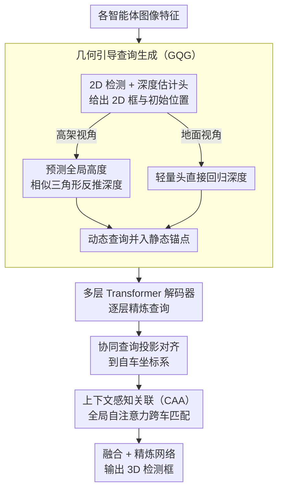

# Long-SCOPE: Fully Sparse Long-Range Cooperative 3D Perception

**会议**: CVPR 2026  
**arXiv**: [2604.09206](https://arxiv.org/abs/2604.09206)  
**代码**: 无  
**领域**: 3D视觉  
**关键词**: 协同感知, 稀疏架构, 长距离3D检测, 查询关联, V2X

## 一句话总结

Long-SCOPE提出了全稀疏的长距离协同3D感知框架，通过几何引导查询生成和上下文感知关联模块，在100-150m远距离场景下实现了SOTA性能，同时保持高效的计算和通信成本。

## 研究背景与动机

**领域现状**：协同感知通过V2X通信扩展自动驾驶的感知范围和解决遮挡问题，但主流方法依赖密集BEV特征，其计算和通信成本随感知范围呈二次方增长。

**现有痛点**：(1) 密集BEV表示在长距离场景下计算成本爆炸；(2) 远距目标的观测误差和对齐误差显著增大，现有基于固定距离阈值的特征关联机制变得脆弱。

**核心矛盾**：高效的稀疏通信需要准确的查询关联，但远距离的位置噪声使得刚性阈值方法失效，正确的协同查询被误滤除。

**本文目标**：设计全稀疏架构，在长距离场景下同时解决计算效率和鲁棒关联两个核心问题。

**切入角度**：完全放弃BEV特征，直接从图像特征中提取对象查询，并用可学习的注意力机制替代规则匹配。

**核心idea**：用几何先验动态生成高质量3D查询（解决观测误差），用上下文感知注意力鲁棒匹配查询（解决对齐误差）。

## 方法详解

### 整体框架

Long-SCOPE要解决的是「把感知范围拉到 100-150m 之后，协同感知既不爆算力、又能把多车看到的同一目标对上」这件事。它的做法是彻底放弃密集 BEV 特征，全程只在「对象查询」这个稀疏层面上运转。每个智能体先从自己的图像特征里掏出一批对象查询——一部分是覆盖近场的静态锚点，一部分是专门为远场小目标动态生成的 GQG 查询——再经多层 Transformer 解码器逐层精炼。各智能体把精炼后的协同查询投影对齐到自车坐标系，交给 CAA 模块做跨车匹配，匹配上的同一目标查询融合精炼后输出 3D 检测框。因为传输的只是稀疏查询而非整张 BEV 图，通信量随目标数线性增长，不再随感知范围平方膨胀。

### 关键设计

**1. 几何引导查询生成（GQG）：给远距离小目标动态生成靠谱的 3D 查询**

固定的静态锚点在近场够用，但远场目标又小又稀疏，落在锚点上的命中率很低，导致一开始就漏检。GQG 先在共享图像特征上跑轻量的 2D 检测和深度估计头，为每个目标拿到一个粗略的 2D 框和初始位置，据此生成贴近真实目标的动态查询，与静态锚点合并后一起送进解码器。

关键巧思在于深度怎么估——直接回归深度是个病态问题，长距离下深度分布极度分散、几乎没法回归准。GQG 因此按相机视角分两类处理，各取最稳的估计方式，而不是一刀切：

- **高架视角**（路侧设备、无人机）：不直接回归深度，而是改预测目标的全局高度 $\hat{z}_{Q_{glb}}$——同一类目标的高度分布很集中（车顶离地都差不多高），是个稳定得多的回归目标。拿到高度后用相机投影的相似三角形几何关系反推相机坐标系下的深度：

$$\hat{z}_{Q_{cam}} = \frac{\hat{z}_{Q_{glb}} - z_{C_{glb}}}{(T_{cam2glb}[:3,:3] \cdot K_{cam}^{-1} \cdot P_{img})_z}$$

  其中 $z_{C_{glb}}$ 是相机自身的全局高度，$T_{cam2glb}$、$K_{cam}$、$P_{img}$ 分别是相机到全局的外参、内参和像素坐标。这步成立的前提是分母里的射线虚拟高度 $z_{P_{virt}}$ 显著非零——高架俯拍恰好满足。
- **地面视角**（车辆）：相机几乎平视地平线，对地平线附近的像素 $z_{P_{virt}} \approx 0$ 会让上式分母趋零、数值爆炸，所以退回标准做法，用轻量深度头直接回归深度。

两条路最后都把 2D 框按估计深度反投影成 3D 位置、配上 MaxPooling 得到的图像特征来初始化动态查询，把初始检测质量直接顶上去。

**2. 上下文感知关联（CAA）：在位置噪声很大时仍能把不同车辆看到的同一目标对上**

到了远距离，每辆车对目标的观测误差和彼此的对齐误差都被放大，基线那套「两个查询坐标差小于 30m（甚至 15m）就算同一目标、超出范围一律不关联直接转发」的固定阈值法就崩了——正确的协同查询会因为位置漂移被误滤掉，还会留下大量重复检测。CAA 索性把匹配交给可学习的注意力：把全部 $N$ 个智能体的查询拼到一起做全局自注意力，让模型基于内容语义和空间拓扑自己判断谁和谁是同一个目标。它遵循四条设计原则——单射匹配（一个目标在每辆车至多一个查询，强制一对一对应）、非对称可见性（允许某辆车独有、无人匹配的查询存在）、空间一致性（靠局部邻域的相对拓扑而非绝对坐标判断，从而抗位置噪声）、可扩展性（天然支持 $N>2$ 而不限于两两配对）。相比固定阈值和匈牙利算法这类启发式，它能在坐标本身就不可靠时靠语义和邻域结构稳住关联。

### 损失函数 / 训练策略

端到端训练。GQG 的 2D 检测头和深度估计头都用轻量化结构以控制开销，CAA 模块的匹配结果则用来生成跨车关联的监督信号。

## 实验关键数据

### 主实验

| 数据集/范围 | 指标 | Long-SCOPE | 之前SOTA | 提升 |
|------------|------|------------|----------|------|
| V2X-Seq长距离 | AP | SOTA | - | 显著提升 |
| Griffin-25m 100-150m | AP | SOTA | - | 突破性提升 |
| Griffin-25m整体 | AP | SOTA | - | 效率+精度双优 |

### 消融实验

| 配置 | 关键指标 | 说明 |
|------|---------|------|
| 无GQG | AP下降 | 远距离小目标检测退化 |
| 无CAA | AP下降 | 关联失败导致重复检测 |
| 固定30m阈值 | AP低 | 基线方法的脆弱关联 |
| 完整Long-SCOPE | 最优 | 两个模块互补协同 |

### 关键发现

- 在100-150m的极远距离场景下提升最为显著，证明了针对长距离设计的必要性
- GQG的高度预测策略对高架智能体效果显著，而对地面车辆应使用直接深度回归
- CAA模块的全局注意力关联远优于固定距离阈值和匈牙利算法等启发式方法

## 亮点与洞察

- **全稀疏架构的先进性**：完全放弃BEV特征，通信成本与目标数线性相关而非感知范围的平方
- **分视角的深度估计策略**：高架用高度反推深度、地面直接回归深度的设计充分利用了不同视角的几何特性
- **SfM启发的多智能体匹配**：借鉴SfM中多视图匹配的拼接+全局注意力策略，自然扩展到N个智能体

## 局限与展望

- 全局自注意力的计算量与查询总数的平方成正比，虽然目标数通常<100，但在极密集场景下可能成为瓶颈
- 未考虑通信延迟和丢包等实际部署问题
- 仅评估了3D目标检测，未扩展到语义分割等更多任务

## 相关工作与启发

- **vs SparseCoop**: Long-SCOPE在SparseCoop基础上替换了最脆弱的查询生成和关联模块
- **vs Far3D**: GQG借鉴了Far3D的2D检测+深度估计方案，但新增了基于高度的深度推导

## 评分

- 新颖性: ⭐⭐⭐⭐ GQG和CAA的设计都有针对性的创新
- 实验充分度: ⭐⭐⭐⭐ 在V2X-Seq和Griffin两个数据集上验证
- 写作质量: ⭐⭐⭐⭐ 问题定义清晰，设计原则明确
- 价值: ⭐⭐⭐⭐ 为协同感知的远距离部署提供了实用方案

<!-- RELATED:START -->

## 相关论文

- [\[CVPR 2026\] Can Natural Image Autoencoders Compactly Tokenize fMRI Volumes for Long-Range Dynamics Modeling?](can_natural_image_autoencoders_compactly_tokenize_fmri_volumes_for_long-range_dy.md)
- [\[CVPR 2026\] MoRel: Long-Range Flicker-Free 4D Motion Modeling via Anchor Relay-based Bidirectional Blending with Hierarchical Densification](morel_long-range_flicker-free_4d_motion_modeling_via_anchor_relay-based_bidirect.md)
- [\[CVPR 2026\] LongStream: Long-Sequence Streaming Autoregressive Visual Geometry](longstream_long-sequence_streaming_autoregressive_visual_geometry.md)
- [\[CVPR 2026\] tttLRM: Test-Time Training for Long Context and Autoregressive 3D Reconstruction](tttlrm_test-time_training_for_long_context_and_autoregressive_3d_reconstruction.md)
- [\[CVPR 2026\] PerpetualWonder: Long-horizon Action-conditioned 4D Scene Generation](perpetualwonder_long-horizon_action-conditioned_4d_scene_generation.md)

<!-- RELATED:END -->
