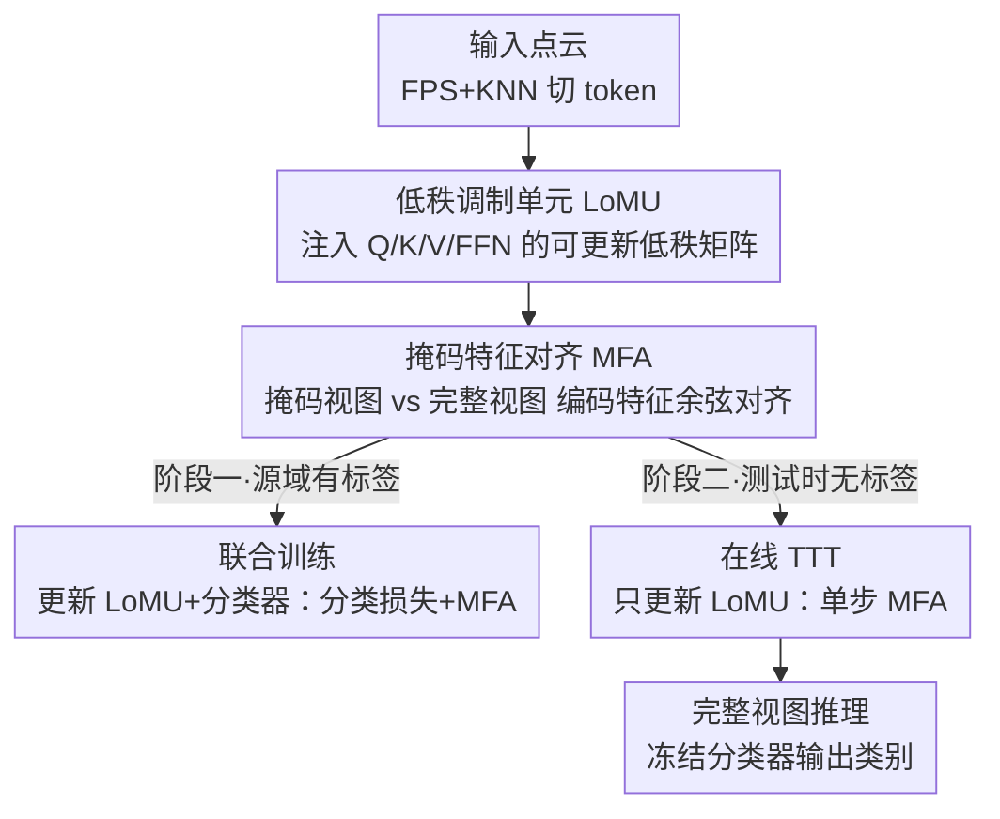

# Low-Rank Test-Time Training for Pre-Trained Point Cloud Models

**会议**: CVPR 2026  
**论文**: [CVF Open Access](https://openaccess.thecvf.com/content/CVPR2026/html/Ye_Low-Rank_Test-Time_Training_for_Pre-Trained_Point_Cloud_Models_CVPR_2026_paper.html)  
**代码**: 未公开  
**领域**: 3D视觉 / 测试时训练 / 点云鲁棒性  
**关键词**: 测试时训练, 点云分类, LoRA, 掩码特征对齐, 分布外鲁棒性

## 一句话总结
本文提出 LoTT-PC，一个面向预训练点云模型的轻量测试时训练框架：用 LoRA 式低秩调制单元替代全参数微调、用解码器无关的「掩码特征对齐」替代重建辅助头，在三个点云抗损坏基准上以单步在线更新平均超过 SOTA 约 2.7%。

## 研究背景与动机

**领域现状**：大规模自监督预训练（Point-BERT、Point-MAE）已成为 3D 点云理解的主流底座，但部署到真实场景时常遇到训练时见不到的损坏（传感器噪声、遮挡、点密度变化），导致分类精度大幅下滑。测试时训练（Test-Time Training, TTT）是应对这种分布外（OOD）漂移的代表性范式——在推理阶段不依赖标签，用一个自监督辅助任务现场微调模型。

**现有痛点**：现有点云 TTT 方法（MATE 用重建头、SMART-PC 用骨架预测头、TTT-KD 用知识蒸馏）有两个共同毛病。其一是**适配低效**：它们普遍更新一大片参数（编码器 + 解码器 + 辅助头），带来高延迟、高显存、并可能在适配过程中灾难性遗忘掉预训练学到的鲁棒先验。其二是**与主任务耦合弱**：辅助目标挂在独立的解码器/任务头上，特征层面与分类主任务对不齐，模型在测试时容易被「重建得更像」这种辅助语义带跑，反而偏离判别性特征。

**核心矛盾**：作者把问题归到一个被忽视的机理——掩码式预训练模型的泛化能力，本质来自一种**潜在特征层面的结构不变性**，即编码表示在掩码扰动下保持一致。既然鲁棒性来自「特征不变性」，那么用一个挂在解码器后、做像素/几何重建的辅助任务来逼近它，就是绕了远路且引入了无关优化压力。

**本文目标**：在不动预训练主干、不加辅助解码器的前提下，直接在编码器特征层面操作这种掩码不变性，既要参数高效、又要让辅助目标和分类主任务强耦合。

**核心 idea**：用「LoRA 低秩调制 + 解码器无关的掩码特征对齐」来替代「全参数微调 + 重建辅助头」，把测试时适配压缩成只更新少量低秩矩阵、只优化一个特征余弦一致性损失。

## 方法详解

### 整体框架
LoTT-PC 以冻结的 Point-MAE（12 层 Transformer）为编码器骨干，整套流程跑在两个阶段上：先在带标签源域做**联合训练**，让分类器和注入主干的低秩调制单元（LoMU）在分类 + 掩码特征对齐（MFA）双目标下学到强耦合、对掩码不变的特征；再在测试时对每个无标签样本做**在线 TTT**，冻结主干和分类器、只用 MFA 损失对低秩单元走一步梯度更新，最后用完整视图做推理。两个贡献组件——低秩调制单元负责「怎么改（参数高效）」，掩码特征对齐负责「按什么信号改（特征不变性）」——分别落在下面两个设计里，再由两阶段训练把它们串起来。

### 关键设计

**1. 低秩调制单元 LoMU：用 LoRA 把测试时更新限制在结构化低秩子空间**

这一设计针对「适配低效 + 灾难性遗忘」的痛点。LoMU 借用 LoRA 的参数化：对源权重 $W_0 \in \mathbb{R}^{d_1 \times d_2}$，引入两个可训练低秩矩阵 $A \in \mathbb{R}^{r \times d_2}$、$B \in \mathbb{R}^{d_1 \times r}$（$r \ll \min(d_1, d_2)$，实现取 $r=16$、缩放 $\alpha=64$），更新量 $\Delta W = BA$，得到 $W = W_0 + BA$。这些低秩矩阵注入全部 12 个 Transformer block 的 Q/K/V 投影与 FFN 投影，而预训练主干始终冻结。测试时只对 $\phi$（即 LoMU 参数）走梯度，主干和分类器不动。它有效的原因在消融里被量化：把 LoMU 换成全参数微调后，在线适配的增益从 +2.1% 骤降到 +0.3%——单样本上全参数更新容易过拟合到那一个测试实例，而把更新约束在低秩子空间里既稳定又能保住预训练的判别先验。

**2. 掩码特征对齐 MFA：解码器无关地把掩码不变性当辅助目标**

这一设计针对「辅助目标与主任务耦合弱」。作者假设掩码扰动下的特征不变性才是泛化的关键，于是把它直接做成损失，而不绕道重建。对同一点云 $X$ 构造随机掩码视图 $X^m$ 与完整视图 $X^c$，共享编码器对每个视图输出 CLS token $h^v_{cls}$ 和非 CLS token 集合 $H^v$；再做置换不变读出，把非 CLS token 逐元素最大池化后与 CLS 拼接得到全局特征 $f^v = h^v_{cls} \oplus \max_j h^v_j$；最后最小化两视图全局特征的余弦距离 $L_{align} = 1 - \frac{\langle f^c, f^m \rangle}{\lVert f^c \rVert_2 \lVert f^m \rVert_2}$。因为对齐的正是分类器要吃的那个全局特征 $f$，辅助目标在特征层面与主任务天然耦合，既不需要任何解码器/辅助头，也避免了「优化重建却伤害分类」的错位。

**3. 两阶段训练：源域强耦合 + 测试时单步轻量适配**

LoMU 和 MFA 要发挥作用，得靠一个把「源域对齐」和「在线适配」分开的训练协议。**联合训练阶段**冻结预训练编码器权重 $\theta^0_E$，只优化 LoMU 参数 $\phi$ 和分类器 $\theta_C$，目标为 $\min_{\phi, \theta_C} \mathbb{E}[L_{ce}(C(f^m; \theta_C), y) + \lambda L_{align}(f^c, f^m)]$（$\lambda=1.0$），分类走掩码视图、对齐拉齐两视图，从而预先把特征训得既判别又对掩码不变。**在线 TTT 阶段**冻结主干和源域分类器，对每个测试样本只用 $L_{align}$ 走**一步** AdamW 更新（online 模式下跨样本累积更新 $\phi$），随后用完整视图推理。一个关键超参错位很有意思：训练用高掩码率 0.9（逼模型学全局语义、防过拟合），而 TTT 用低掩码率 0.1（保留足够几何上下文当锚点，让对齐去纠正分布漂移而非「重建」缺失几何）。整个 TTT 仅需一对视图、一步梯度，相比 MATE 官方在线设定每样本用 48 个增强视图要轻量得多。

### 损失函数 / 训练策略
- 联合训练：分类交叉熵 $L_{ce}$ + 掩码特征对齐 $L_{align}$，权重 $\lambda=1.0$，AdamW、batch 32、lr $5\times10^{-4}$、300 epoch、掩码率 0.9。
- 在线 TTT：仅 $L_{align}$，batch size 1、单步 AdamW、掩码率 0.1、每样本仅 1 个掩码视图（$B_m=1$）。
- 推理：用完整视图 $X^c$ 经更新后的 $\phi^\star$ 输出 logits，分类器冻结。

## 实验关键数据

### 主实验
在 ModelNet40-C、ScanObjectNN-C、ShapeNet-C 三个抗损坏基准上报告 15 类损坏 × 多严重度的平均分类精度（%）。

| 方法 | 出处 | ModelNet40-C | ScanObjectNN-C | ShapeNet-C | 均值 |
|------|------|------|------|------|------|
| Org-SO（无适配基线） | ICCV 2023 | 53.9 | 45.7 | 57.6 | 52.4 |
| MATE-SO | ICCV 2023 | 57.6 | 45.6 | 59.3 | 54.2 |
| SMART-PC-SO | ICML 2025 | 61.7 | 38.7 | 64.5 | 55.0 |
| **LoTT-PC-SO（本文，仅源训练）** | Ours | **74.4** | **52.0** | 66.4 | **64.3** |
| MATE-Online | ICCV 2023 | 71.3 | 48.5 | **69.1** | 63.0 |
| SMART-PC-Online | ICML 2025 | 72.9 | 47.4 | 67.1 | 62.5 |
| **LoTT-PC-Online（本文）** | Ours | **75.5** | **54.1** | 67.4 | **65.7** |

亮点是：即便**不做任何测试时更新**，仅源训练的 LoTT-PC-SO（74.4% / 52.0% / 66.4%）就已经超过 MATE / SMART-PC 的完整在线版本，平均比 MATE-SO、SMART-PC-SO 分别高 10.1% 和 9.3%——说明联合训练阶段的特征耦合本身就带来了很强的内在鲁棒性。在线适配后 LoTT-PC-Online 在 ModelNet40-C、ScanObjectNN-C 上刷到新 SOTA，尤其在最难的真实扫描基准 ScanObjectNN-C 上比 MATE-Online 高出 5.6%。⚠️ ShapeNet-C 上 MATE-Online（69.1%）略胜本文（67.4%），作者归因于其重建目标与干净 CAD 几何更契合，但本文均值（65.7%）仍最高。

### 消融实验
在 ScanObjectNN-C 上拆解两个核心组件（SO=仅源训练，Online=在线 TTT）。

| 变体 | SO | Online | 说明 |
|------|------|------|------|
| w/o MFA | 48.3 | – | 去掉对齐目标，SO 掉 3.7%；无自监督信号，在线适配无从谈起 |
| w/o LoMU（全参数微调） | 50.7 | 51.0 | 在线增益从 +2.1% 跌到 +0.3% |
| **LoTT-PC（完整）** | **52.0** | **54.1** | 两组件互补：MFA 给适配信号，LoMU 保参数高效与稳定 |

### 关键发现
- **MFA 是地基**：去掉它 SO 直接掉 3.7%，且因为没有自监督目标，在线适配根本无法进行，w/o MFA 与完整在线版差 5.8%。
- **低秩才是测试时适配有效的关键**：全参数微调虽然 SO 也不差，但单样本上的在线增益几乎归零（+0.3%），印证了「在低秩子空间里更新」是抑制单实例过拟合的要害。
- **增强 batch 越大越差**：每样本掩码视图数从 1 增到 8，精度从 54.1% 跌到 51.3%。作者解释为单步适配下「梯度稳定性 vs 实例特异性」的取舍——多视图平均反而把纠正具体损坏所需的尖锐信号磨平了。
- **训练/测试掩码率应当错位**：训练用 0.9、TTT 用 0.1 最好；若 TTT 也用 0.9 会掉到 49.1%，因为高掩码抹掉太多几何上下文，模型分不清是损坏还是掩码。
- **推理视图不敏感**：完整视图（54.1%）与掩码视图（53.9%）几乎一致，集成也无额外收益，反向印证 MFA 确实把两视图特征拉到了一致，默认用完整视图即可。

## 亮点与洞察
- **把「鲁棒性来自掩码特征不变性」从假设做成可优化损失**：MFA 直接对齐分类器要用的全局特征，绕开重建解码器，是「机理洞察 → 极简实现」的漂亮闭环——这个解码器无关的特征对齐思路可迁移到任何掩码式预训练骨干的 TTT。
- **LoRA 不只是省参数，更是抗单实例过拟合的正则**：在测试时只有一个样本、只走一步梯度的极限预算下，把更新困在低秩子空间反而比全参数更新泛化得好，这一点对所有在线 TTA/TTT 都有启发。
- **「训练高掩码、测试低掩码」的非对称配方**：同一个掩码机制在两阶段扮演不同角色（学语义 vs 当锚点对齐），是个反直觉但可复用的调参经验。
- **效率账很硬**：单对视图、单步梯度 vs MATE 每样本 48 个增强视图，说明强鲁棒不必靠重计算。

## 局限与展望
- **只验证了分类任务**：方法围绕全局特征 $f$ 的对齐设计，是否能直接迁移到点云分割/检测这类稠密预测任务，论文未涉及。
- **依赖掩码式预训练骨干**：MFA 的前提是骨干本身具备「掩码扰动下特征不变」的属性，对非掩码预训练（如纯对比学习）骨干是否同样有效存疑。
- **在线累积更新的稳定性**：online 模式跨样本累积更新 $\phi$，长序列、分布持续漂移下是否会缓慢退化，论文未做长程实验。
- **ShapeNet-C 上不及 MATE**：在合成 CAD 几何上重建型目标仍有优势，说明特征对齐对「干净几何」的损坏类型并非全面占优。
- 改进方向：把对齐目标扩展到 token 级/多尺度特征以支持稠密任务；引入轻量的更新门控以稳住长程在线适配。

## 相关工作与启发
- **vs MATE（ICCV 2023）**：MATE 把分类塞进掩码自编码器、用重建辅助目标做测试时适配，需要重建解码器且更新大量参数；本文去掉解码器、改成特征层面的余弦对齐、只更新低秩单元，平均更高且单样本适配更稳，仅在合成 ShapeNet-C 上略逊。
- **vs SMART-PC（ICML 2025）**：SMART-PC 用骨架预测作辅助任务增强对噪声/结构变化的鲁棒性，仍是解码器式辅助头；本文论点是「特征不变性比显式几何/骨架重建更本质」，因而直接在编码特征上对齐。
- **vs TENT / SHOT 等 2D TTA**：这些方法靠熵最小化等无监督目标适配，在点云损坏上表现很差（30% 上下）；本文属于 TTT 范式（训练即埋入专用辅助目标），但为 3D 点云定制了 LoRA + MFA 设计。
- **vs 输入级适配（3DD-TTA、CloudFixer）**：它们用扩散/VAE 先验去噪修复输入、不改参数但迭代优化慢；本文走模型级、单步更新，延迟低得多。

## 评分
- 新颖性: ⭐⭐⭐⭐ 把「掩码特征不变性」机理做成解码器无关的对齐损失 + LoRA 化测试时更新，组合清晰且有洞见，但两块积木本身均为已有技术。
- 实验充分度: ⭐⭐⭐⭐ 三基准 + 完整组件/批量/掩码率/推理策略消融，论证扎实；缺稠密任务与长程在线验证。
- 写作质量: ⭐⭐⭐⭐ 动机—机理—方法逻辑顺，公式与消融对得上，少量表述可更紧凑。
- 价值: ⭐⭐⭐⭐ 给点云 TTT 提供了一个高效、易迁移、强耦合的简洁方案，实用性强。

<!-- RELATED:START -->

## 相关论文

- [\[CVPR 2026\] ZipMap: Linear-Time Stateful 3D Reconstruction via Test-Time Training](zipmap_linear-time_stateful_3d_reconstruction_via_test-time_training.md)
- [\[CVPR 2026\] Learning 3D Reconstruction with Priors in Test Time](tco_learning_3d_reconstruction_with_priors_in_test_time.md)
- [\[CVPR 2026\] tttLRM: Test-Time Training for Long Context and Autoregressive 3D Reconstruction](tttlrm_test-time_training_for_long_context_and_autoregressive_3d_reconstruction.md)
- [\[CVPR 2025\] PointLoRA: Low-Rank Adaptation with Token Selection for Point Cloud Learning](../../CVPR2025/3d_vision/pointlora_low-rank_adaptation_with_token_selection_for_point_cloud_learning.md)
- [\[CVPR 2026\] 3D sans 3D Scans: Scalable Pre-training from Video-Generated Point Clouds](3d_sans_3d_scans_scalable_pre-training_from_video-generated_point_clouds.md)

<!-- RELATED:END -->
