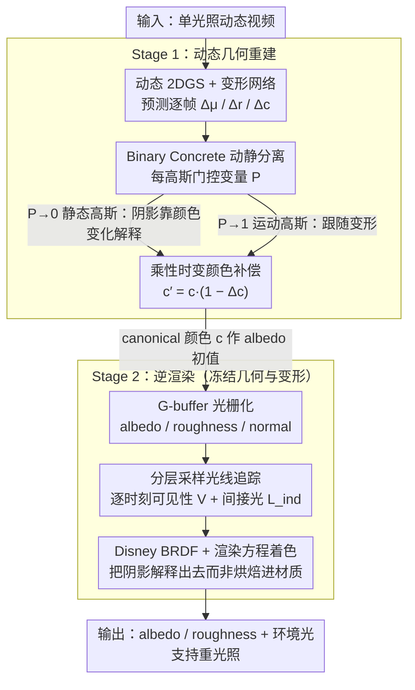

# LumiMotion: Improving Gaussian Relighting with Scene Dynamics

**会议**: CVPR 2026  
**arXiv**: [2604.10994](https://arxiv.org/abs/2604.10994)  
**代码**: [https://joaxkal.github.io/LumiMotion/](https://joaxkal.github.io/LumiMotion/)  
**领域**: 3D视觉  
**关键词**: 逆渲染, 2D高斯溅射, 动态场景, 材质估计, 重光照

## 一句话总结
LumiMotion 是首个利用场景动态（运动区域）作为监督信号来改善逆渲染的 Gaussian-based 方法，通过动静分离和运动揭示的材质变化来更好地分离光照与材质，albedo 估计 LPIPS 提升 23%，重光照提升 15%。

## 研究背景与动机

**领域现状**：逆渲染旨在从图像中恢复几何、材质和光照。现有 Gaussian Splatting 方法（R3DG、IRGS、GI-GS）主要针对静态场景，在强直射光下容易将阴影和材质颜色混淆。

**现有痛点**：静态场景中难以区分"区域暗是因为阴影还是材质本身深色"，因为缺乏同一表面在不同光照条件下的观测。已有动态场景方法要么只针对人体 avatar，要么需要已知光照或多光照训练。

**核心矛盾**：准确分离材质和光照需要同一表面的多光照观测，但现实中通常只有单一光照条件。

**本文目标**：利用场景中物体的运动（如阴影移动、运动物体光照变化）作为天然的多光照监督信号。

**核心 idea**：运动揭示了同一表面在不同光照条件下的外观，为材质-光照分离提供了更强的约束。

## 方法详解

### 整体框架
LumiMotion 想解决的核心难题是：在单一光照条件下，静态逆渲染分不清"这块表面暗，是因为落了阴影，还是材质本身就是深色"。它的办法是把场景里物体的运动当成天然的多光照样本——阴影扫过同一块表面时，这块表面就被"不同光照"照过了。整条管线分两阶段：Stage 1 先在动态 2D 高斯溅射（2DGS）表示上学几何、把高斯分成静止与运动两类、再用一个随时间变化的颜色补偿去拟合视频；Stage 2 冻结几何与变形网络，转而联合优化材质（albedo、roughness）和环境光照，靠光线追踪算出可见性与间接光，让渲染方程把阴影"解释"出去而不是烘焙进材质。两阶段的衔接点是：Stage 1 学到的 canonical 颜色直接当作 Stage 2 的 albedo 初值。

### 关键设计

**1. Binary Concrete 动静分离：让阴影由"静态表面 + 颜色变化"来解释，而不是高斯自己跑掉**

移动的阴影在表示上有两种拟合方式——要么让对应的高斯随时间平移甚至消失，要么让高斯待在原地、只改它的颜色。前者看似也能重建出视频，却会在 Stage 2 埋下大坑：一个会移动/消失的高斯没法被分配一个稳定的 albedo，材质估计就崩了。所以作者强制阴影区域走后一条路。具体做法是给每个高斯挂一个辅助变量 $P$，经 Binary Concrete 分布（Bernoulli 的连续松弛，可微分便于梯度训练）采样出 $\tilde{P}\in[0,1]$，再用它去门控变形网络的输出：$\tilde{P}\to 0$ 的高斯被钉成静态，$\tilde{P}\to 1$ 的才允许跟随变形。配合一个鼓励 $P$ 趋向 0 的正则，整个场景默认保持静止，只有真正的运动物体才"花预算"去变形，阴影则被逼着用颜色变化来表达。

**2. 乘性时变颜色补偿：用符合光照物理的方式吸收阴影，顺带产出 albedo 初值**

既然阴影要靠颜色变化来解释，那这个颜色补偿的形式就不能随便选。LumiMotion 用乘性而非加性：$c' = c\cdot(1-\Delta c)$，其中 $c$ 是不随时间变的 canonical 颜色，$\Delta c$ 是逐帧的衰减量。乘性形式的好处是它直接呼应了渲染方程里"光照作用在表面反照率上"的乘法结构——阴影本质就是入射光被遮挡后的衰减，用 $(1-\Delta c)$ 这个 0~1 的因子去乘，物理上比"加一个偏移"自然得多，也更好正则。更关键的副产品是：把光照变化都甩给 $\Delta c$ 之后，剩下的 canonical 颜色 $c$ 就近似成了一张去除了瞬时光照的 pseudo-albedo，正好拿去做 Stage 2 材质优化的初始估计。

**3. 分层采样光线追踪：在动态场景里把随时间变化的可见性算准**

Stage 2 要从图像反推材质和光照，绕不开"这个点被环境光照到多少、又收到多少来自其他表面的间接反射"。LumiMotion 冻结 Stage 1 的几何后，先把 albedo、roughness、normal 光栅化成 G-buffer，再对环境光图做分层采样（hierarchical sampling）选出若干入射方向，沿这些方向做光线追踪，算出可见性 $V$ 和间接光 $L_{\text{ind}}$，最后套 Disney BRDF 完成着色。之所以非要显式光线追踪而不是用预烘焙的 shadow，是因为动态场景里阴影本身在动——同一块表面的可见性逐帧都不一样，只有逐时刻追踪才能给材质优化喂进正确的光照信息，这也正是"运动即多光照监督"这条主线能落地的前提。

### 损失函数 / 训练策略
Stage 1 的总损失是重建损失 + 法线一致性 + 深度畸变 + 前景掩码 BCE + 动静分离正则（鼓励 $P$ 趋向 0、抑制不必要的变形）+ 颜色变化正则（约束 $\Delta c$ 的幅度）。Stage 2 切换到物理渲染目标：渲染方程下的 L1 重建损失 + albedo 平滑正则，约束材质在空间上连续以抗噪。

## 实验关键数据

### 主实验

| 场景/指标 | LumiMotion | IRGS（次优） | 提升 |
|-----------|------------|-------------|------|
| Albedo LPIPS | 最优 | 次优 | -23% |
| Relighting LPIPS | 最优 | 次优 | -15% |
| Relighting PSNR | 最优 | 次优 | 显著 |

### 消融实验

| 配置 | Relighting PSNR | 说明 |
|------|----------------|------|
| Full (动态) | 最优 | 利用动态信息 |
| 静态 baseline | 较差 | 阴影混入 albedo |
| w/o 动静分离 | 下降 | 动态高斯干扰 albedo |

### 关键发现
- 动态场景下 LumiMotion 能成功从 albedo 中去除阴影，静态方法则将阴影烘焙进 albedo
- 在同一场景的静态/动态两个版本上，动态版本的逆渲染结果一致优于静态版本
- Binary Concrete 分离对正确的 albedo 估计至关重要

## 亮点与洞察
- **运动作为监督信号**：这个观察非常有洞察力——运动天然提供了同一表面在不同光照下的样本，是一种"免费"的多光照数据
- **发布对照数据集**：新合成基准含静态/动态对照版本，首次系统评估动态对逆渲染的影响

## 局限与展望
- 假设光照静态不变，不适用于光照也变化的场景
- 需要场景中有足够的运动区域来提供监督
- 间接光建模仍较简化

## 相关工作与启发
- **vs IRGS**: IRGS 仅处理静态场景，阴影去除能力有限
- **vs Relightable Neural Actor**: 仅限人体 avatar，需已知光照

## 评分
- 新颖性: ⭐⭐⭐⭐⭐ 首次利用场景动态改善逆渲染，观察深刻
- 实验充分度: ⭐⭐⭐⭐ 合成+真实数据，静态/动态对照评估
- 写作质量: ⭐⭐⭐⭐ 动机阐述清晰
- 价值: ⭐⭐⭐⭐ 打开了动态逆渲染的新方向

<!-- RELATED:START -->

## 相关论文

- [\[CVPR 2026\] Node-RF: Learning Generalized Continuous Space-Time Scene Dynamics with Neural ODE-based NeRFs](node-rf_learning_generalized_continuous_space-time_scene_dynamics_with_neural_od.md)
- [\[CVPR 2026\] Faster-GS: Analyzing and Improving Gaussian Splatting Optimization](faster-gs_analyzing_and_improving_gaussian_splatting_optimization.md)
- [\[CVPR 2025\] ReCap: Better Gaussian Relighting with Cross-Environment Captures](../../CVPR2025/3d_vision/recap_better_gaussian_relighting_with_cross-environment_captures.md)
- [\[CVPR 2026\] BulletGen: Improving 4D Reconstruction with Bullet-Time Generation](bulletgen_improving_4d_reconstruction_with_bullet-time_generation.md)
- [\[CVPR 2026\] Improving Human Image Animation via Semantic Representation Alignment](improving_human_image_animation_via_semantic_representation_alignment.md)

<!-- RELATED:END -->
