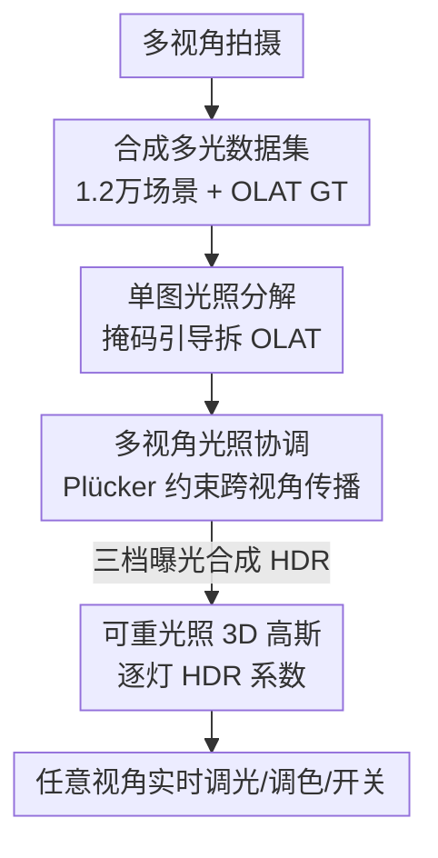

# LuxRemix: Lighting Decomposition and Remixing for Indoor Scenes

**会议**: CVPR 2026  
**arXiv**: [2601.15283](https://arxiv.org/abs/2601.15283)  
**代码**: https://luxremix.github.io （项目页，含视频/交互 demo）  
**领域**: 3D视觉 / 逆渲染 / 重光照  
**关键词**: 室内场景重光照、光照分解、OLAT、多视角一致性、3D 高斯泼溅

## 一句话总结
LuxRemix 用一个生成式单图光照分解模型把室内场景的复杂光照拆成"一次只点一盏灯"（OLAT）的单光源分量，再通过多视角光照协调把分解结果一致地传播到所有视角，最后编码进可重光照的 3D 高斯泼溅表示，让用户能从任意视角实时、独立地开关/调色/调亮每一盏灯。

## 研究背景与动机
**领域现状**：室内场景的灯光控制是摄影、影视、虚拟制作的核心需求，但一旦拍摄完成，光照就被"烤"进了图像和 3D 重建里——单张照片、NeRF/3DGS 重建都把每盏灯的贡献固化成了最终外观，事后想单独调某盏灯几乎不可能。

**现有痛点**：现有重光照路线各有硬伤。数据驱动方法需要在受控环境下做密集多光照采集，对真实室内场景不现实、泛化也差；基于优化的逆渲染能把场景拆成几何/材质/光照，但计算昂贵、且光照大幅变化时常常给出不可信的结果；近期借助扩散先验的方法主要针对**物体**、**人像**或**远场均匀光照的简单场景**。

**核心矛盾**：室内场景的难点在于**空间变化的近场光照**——多个近距离光源（吊灯、壁灯、台灯）相互作用，要想选择性地把某一盏灯开/关，必须理解复杂的光传输，而这恰恰是远场环境光假设（environment map）覆盖不了的。更要命的是，已有的单图光照编辑方法（如 LightLab）无法在多个视角间保持 3D 一致性，给一段多视角拍摄逐帧分解就会到处闪烁。

**本文目标**：从一次普通的多视角拍摄出发，把室内复杂光照分解为**可独立控制的单光源**，并保证分解结果在所有视角下一致、可实时编辑。

**切入角度**：作者的关键洞察是——现代扩散模型已经在海量数据里编码了关于室内光照的丰富先验，可以用来做分解；而多视角几何约束恰好能提供把分解结果跨视角传播所需的一致性。把光照分解重新表述成一个**多视角协调（harmonization）问题**，再塞进快速可微的 3D 表示里，就能同时拿到细粒度的逐灯控制和实时交互。

**核心 idea**：用"单图扩散分解 OLAT + 多视角扩散协调 + 可重光照 3DGS"三段式流水线，把单图分解的细粒度控制和多视角方法的 3D 一致性桥接起来。

## 方法详解

### 整体框架
LuxRemix 要解决的是：给定一次室内多视角拍摄，输出一个能从任意视角实时独立控制每盏灯的 3D 表示。整体是一条三阶段串行流水线——先在**单张图**上用生成式模型把光照拆成 OLAT 分量，再把这些分解结果**跨视角协调**成一致，最后编码进 **3D 高斯**做实时重混。三个阶段都依赖同一个自建的大规模合成数据集（1.2 万个室内场景、带 OLAT groundtruth）来训练扩散先验。

光照分解的数学约定是把输入图像写成环境光与各 OLAT 分量的线性叠加再做色调映射：

$$I_{\text{input}}=\text{tonemap}\Big(I_{\text{ambient}}+\sum_{i=1}^{N}\boldsymbol{c}_{i}\cdot I_{i}\Big)$$

其中 $I_i$ 是第 $i$ 盏灯单独点亮时的 OLAT 图像（在 HDR 线性空间、按尺度待定），$\boldsymbol{c}_i$ 是恢复原始光照所需的 RGB 尺度因子，$I_{\text{ambient}}$ 是关掉某盏灯后剩余光源贡献的"环境光"。整条流水线就是围绕怎么估出这组 $\{I_{\text{ambient}}, I_i\}$ 并保持视角一致展开的。

### 关键设计

**1. 合成多光数据集：用程序化渲染造出室内场景的 OLAT 真值**

整套方法的前提是要有"每盏灯单独点亮"的监督信号，而真实世界根本拿不到这种受控采集。作者干脆用 1.2 万个程序化生成的室内 3D 模型，用 Infinigen 给每个场景程序化布置最多六盏可控灯（吊灯、壁灯、地灯、台灯加环境光），灯色从黑体色温采样覆盖各种白光、再叠 10% HSV 扰动扩展色域。每个场景用 Blender Cycles 渲染成"全开 / 随机开 / 仅环境光 / OLAT（只留一盏）"等多种光照配置。一个工程上的取巧是：不预渲染所有透视视角，而是把每个场景渲成 4 张 equirectangular HDR 全景图，训练时再**在线采样透视视角**——既能采到多样相机姿态，又避开了预渲染全部视角的巨大开销。每盏灯还生成三种掩码（发光面、整个灯具、凸包）供条件输入。这一步把"逐灯分解"从一个无监督难题变成了有充足 groundtruth 的监督学习问题

**2. 单图光照分解（LuxRemix-SV）：用掩码引导的 LoRA 微调让 DiT 学会"只留这盏灯"**

有了数据，第一阶段在单张图上做分解。作者在一个预训练的图像编辑 DiT（FLUX 系）上用 LoRA 微调，让模型聚焦两类光编辑任务：① OLAT 分解——用"关掉除选中灯外的所有灯"这类文本指令，生成只含某盏灯贡献的图；② 关灯——用"只关掉选中的灯"得到其余光源照亮的场景，作者把它当作环境光 $I_{\text{ambient}}$。关键在于怎么告诉模型"编辑哪盏灯"：把光掩码 patch 化后经一个单层 MLP 投到 FLUX VAE latent 维度，再**沿通道加到输入图像 latent 上**（而非把图和掩码并排拼成 token），实验证明这种通道相加比 in-context 拼接的 'FLUX token' 变体更准。训练时还做光照组合增广（动态叠加多张 OLAT），并用高/中/低三档亮度提示（对应目标 HDR OLAT 的 EV0/EV-2/EV-4）来覆盖更宽的动态范围、学好光传输。这一步把扩散先验真正变成了可掩码控制的逐灯分解器

**3. 多视角光照协调（LuxRemix-MV）：把稀疏视角的分解一致地"传染"到所有视角**

单图分解每帧独立做会到处闪、3D 不一致，而此前没有任何工作处理"把光照分解跨多视角传播"这个新任务——它既要懂 3D 几何、又要在跨视角搬运复杂光照时维持光度一致。作者把它表述成一个多视角扩散协调问题：输入是带**部分**光照分解的多视角图（只在一两个视角上分解好）外加对应的 Plücker 射线嵌入，输出是所有视角光照协调一致的图。借鉴 CAT3D/SimVS/SEVA，把原始输入视角、稀疏的已分解视角、Plücker 射线嵌入、参考视角掩码一起拼接喂给预训练多视角扩散 U-Net，做**全参数微调**。为产出 HDR，对每种光照条件用高/中/低三档曝光各跑一遍协调，再按 Debevec-Malik 合成 HDR。这样既保住了每盏灯的完整动态范围，又让光照在所有视角一致——它是把单图分解"升维"到 3D 一致的桥梁

**4. 可重光照 3D 高斯：每个高斯存逐灯 HDR 系数，渲染时线性重混**

最后要把一致的分解结果变成能实时交互的 3D 表示。作者在标准 3DGS 基础上给每个高斯**额外挂上逐灯 HDR RGB 系数**，分开存储每个光源（含环境光）对该高斯外观的贡献；渲染时按用户给的各灯强度/颜色对这些逐灯贡献做线性组合，就能实时合成任意光照配置下的外观，同时保留 3DGS 的实时渲染能力。优化分两阶段：先在原始多视角图上预训练一个标准 3DGS 建立几何与高斯分布；再冻结所有几何/外观参数，给每个高斯引入逐灯 RGB 系数（用多视角协调输出初始化），在线性 HDR 空间配可微色调映射优化，联合解出逐高斯、逐灯的颜色尺度，使重组后的光照能匹配原始输入图。这一步把"逐帧分解图"固化成了任意视角可查询、可实时调光的资产

### 损失函数 / 训练策略
3D 阶段的优化用两个 L1 损失：对每张逐灯图像用 L1 监督，加上一个 L1 组合损失保证重组后与原始输入视角一致。单图分解阶段用 LoRA 参数高效微调，多视角协调阶段对 U-Net 做全参数微调。

## 实验关键数据

评测在 30 个从训练集留出的合成测试场景上做，指标为对 groundtruth 做逐通道色彩重缩放后的 PSNR / SSIM / LPIPS。真实场景用标准 SfM 估计相机位姿，通常用 32–96 张图覆盖目标灯的足够视角。

### 主实验：单图光照分解（Table 1，30 合成场景）

| 方法 | PSNR ↑ | SSIM ↑ | LPIPS ↓ |
|------|--------|--------|---------|
| ScribbleLight | 14.39 | 0.395 | 0.688 |
| Qwen-Image | 18.23 | 0.714 | 0.237 |
| FLUX token（变体） | 25.20 | 0.865 | 0.101 |
| SD U-Net（变体） | 27.13 | 0.857 | 0.099 |
| **LuxRemix-SV（本文）** | **27.68** | **0.898** | **0.082** |

通用图像编辑模型（ScribbleLight、Qwen-Image）缺乏精确的逐灯控制能力，PSNR 远低于本文；本文最终模型在三项指标上全面最优。

### 消融：多视角光照协调（Table 2，30 合成场景）

| 配置 | PSNR ↑ | SSIM ↑ | LPIPS ↓ | 说明 |
|------|--------|--------|---------|------|
| LuxRemix-SV | 25.14 | 0.807 | 0.149 | 每个视角独立处理、无多视角上下文 |
| LuxRemix-MV-Edit | 26.37 | 0.794 | 0.136 | MV 基础上加掩码做多视角编辑 |
| **LuxRemix-MV（本文）** | **30.76** | **0.867** | **0.091** | 从稀疏参考视角做光照协调 |

### 关键发现
- **多视角协调贡献最大**：从逐视角独立的 LuxRemix-SV（PSNR 25.14）升到带多视角上下文的 LuxRemix-MV（30.76），涨了 5.6 dB，直接验证了"跨视角传播分解"这一新任务模块的必要性——独立逐帧分解确实不一致。
- **单图分解的架构选择有讲究**：通道相加掩码 token 的最终模型（LuxRemix-SV，27.68）优于 in-context 拼接的 'FLUX token' 变体（25.20）和 U-Net 的 SD 变体（27.13），说明把掩码经 MLP 投到 latent 再沿通道相加是更有效的条件注入方式。
- **实时重光照拉开身位**：NeRF-W、Splatfacto-W 只能在多光照采集下做整图级重光照、没有逐灯控制；Instruct-NeRF2NeRF 这类文本编辑太不精确。LuxRemix 是少数能对单盏灯做实时交互控制的方法（定量主要靠合成集，真实场景以定性/视频为主）。

## 亮点与洞察
- **OLAT 线性叠加 + 扩散先验**的组合很巧：把"难以监督的逐灯分解"用程序化渲染造出 OLAT 真值，再让扩散模型去学这个分解，绕开了真实世界拿不到受控采集的死结。
- **把"跨视角传播分解"显式当成一个新任务**是本文最"啊哈"的地方——别人要么只做单图分解（不一致）、要么只做整图重光照（无逐灯控制），作者发现这两者之间缺了"多视角协调"这一环，并用多视角扩散把它补上。
- **逐灯 HDR 系数挂在每个高斯上、渲染时线性重混**的设计可迁移性强：任何"想对 3DGS 资产做可分解、可加性编辑"的任务（如材质分层、阴影分量）都可以借鉴"给每个高斯额外挂一组可线性组合的系数 + 两阶段冻结优化"这套做法。
- **全景图在线采视角**是个实用的工程 trick：用 4 张 equirectangular HDR 替代预渲染所有透视视角，大幅降数据生成成本又不损视角多样性。

## 局限与展望
- **作者承认**：模型只在静态合成室内场景上训练，可能难以泛化到室外或动态场景；训练数据里光源多样性有限，分解会偏向"光锥"而非更弥散的光照配置；不支持通过 HDRI 编辑远场全局光照。
- **自己发现**：定量评测几乎全在 30 个合成留出场景上，真实场景主要靠定性/视频展示，缺乏真实场景的逐灯定量基准（真实世界本就拿不到 OLAT 真值，这也是固有困难）；指标都做了"逐通道色彩重缩放后再算"，意味着绝对色彩尺度由后处理对齐，单图分解的 RGB 尺度因子 $\boldsymbol{c}_i$ 本身的恢复精度没被直接考核。
- **改进思路**：把数据集扩到含更弥散光源、室外/动态场景；引入 HDRI 远场光照通道实现"近场逐灯 + 远场环境"的统一编辑；探索真实多视角采集下的弱监督一致性损失以减小 sim-to-real 差距。

## 相关工作与启发
- **vs LightLab**：LightLab 同样靠微调扩散模型在单图上做逐灯强度/色彩的参数化控制，但只能处理单张图、无法保证多视角 3D 一致；本文正是把它的细粒度单图控制"升维"到多视角，多出的多视角协调 + 3DGS 编码是核心增量。
- **vs 多视角重光照（Alzayer 等 / LightSwitch）**：它们能做到 3D 一致，但要么需要受控多光照采集、要么只产出整图级（全局）重光照效果，没有逐灯控制；本文用普通多视角拍摄就能做逐灯控制。
- **vs DiffusionRenderer / UniRelight**：这些用 G-buffer 解耦逆/正向渲染或一遍出图，目标是通用重光照；本文不走逆渲染估几何材质这条易碎的路，而是直接在图像域用扩散先验分解 OLAT，再靠多视角协调拿一致性。
- **vs 3DGS 逆渲染（GS-IR 系）**：多数 3DGS 重光照方法需要受控多视角 OLAT 采集或显式 BRDF 分解；本文从随意拍摄出发，用每个高斯挂逐灯 HDR 系数 + 线性重混，避开了脆弱的逆渲染优化。

## 评分
- 新颖性: ⭐⭐⭐⭐⭐ 首次把"室内多视角光照分解与重混"打通，并显式提出"跨视角传播光照分解"这一新任务
- 实验充分度: ⭐⭐⭐⭐ 合成集定量充分、消融清晰，但真实场景主要靠定性/视频，缺真实逐灯定量基准
- 写作质量: ⭐⭐⭐⭐⭐ 三阶段动机—方法—实验串得清楚，公式与图示到位
- 价值: ⭐⭐⭐⭐⭐ 直击虚拟制作/影视/沉浸式场景的实时逐灯编辑刚需，数据集公开亦有社区价值

<!-- RELATED:START -->

## 相关论文

- [\[CVPR 2026\] Dynamic-Static Decomposition for Novel View Synthesis of Dynamic Scenes with Spiking Neurons](dynamic-static_decomposition_for_novel_view_synthesis_of_dynamic_scenes_with_spi.md)
- [\[CVPR 2026\] SunFaded: Illumination-Aware Gaussian Splatting for Dark Scenes with Camera-Mounted Active Lighting](sunfaded_illumination-aware_gaussian_splatting_for_dark_scenes_with_camera-mount.md)
- [\[CVPR 2026\] UniLight: A Unified Representation for Lighting](unilight_a_unified_representation_for_lighting.md)
- [\[CVPR 2026\] OLATverse: A Large-scale Real-world Object Dataset with Precise Lighting Control](olatverse_a_large-scale_real-world_object_dataset_with_precise_lighting_control.md)
- [\[ICCV 2025\] InstaScene: Towards Complete 3D Instance Decomposition and Reconstruction from Cluttered Scenes](../../ICCV2025/3d_vision/instascene_towards_complete_3d_instance_decomposition_and_reconstruction_from_cl.md)

<!-- RELATED:END -->
