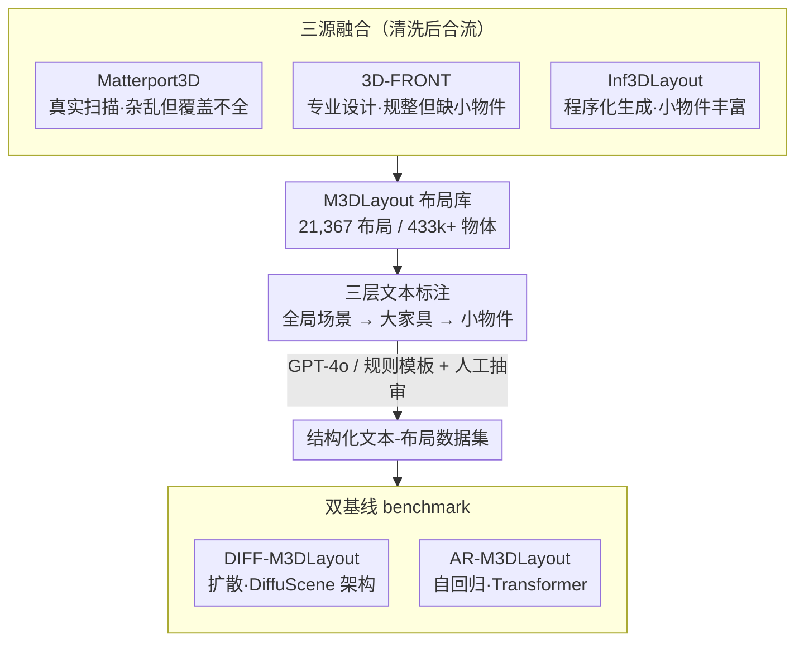

# M3DLayout: A Multi-Source Dataset of 3D Indoor Layouts and Structured Descriptions for 3D Generation

**会议**: CVPR 2026  
**arXiv**: [2509.23728](https://arxiv.org/abs/2509.23728)  
**代码**: [GitHub](https://github.com/Graphic-Kiliani/M3DLayout-code)  
**领域**: 3D视觉  
**关键词**: 3D室内布局, 数据集, 文本驱动场景生成, 扩散模型, 自回归模型

## 一句话总结

构建了多源大规模 3D 室内布局数据集 M3DLayout（21,367 布局、433k+ 物体实例），融合真实扫描、专业设计和程序化生成三种来源，配以结构化文本描述，为文本驱动的 3D 场景生成提供高质量训练基础。

## 研究背景与动机

文本驱动 3D 场景生成中，物体布局是连接语言指令和几何输出的关键中间表示，提供结构蓝图、支持语义可控性和交互式编辑。但现有数据集存在严重瓶颈：

- **ScanNet、Matterport3D**（真实扫描）：几何噪声大、物体覆盖不完整、缺乏生成任务所需的细粒度标注
- **3D-FRONT、Structured3D**（专业设计）：布局结构整洁但物体种类单一，几乎没有小物件（3D-FRONT 仅 0.2% 小物体）
- **所有现有数据集**：均缺乏场景级文本标注（全局描述 + 大家具关系 + 小物件细节），无法支持条件/多模态生成任务
- 场景可行性问题（重叠、位移、语义违规）很少被验证，训练数据含大量噪声

核心诉求：一个大规模、多样化、含结构化文本标注的 3D 布局数据集，同时覆盖大家具和小物件。

## 方法详解

### 整体框架

这篇工作要解决的是文本驱动 3D 场景生成"没有好训练数据"的问题，所以核心产出是一个数据集而非新模型。整条流水线分三步走：先从三类来源各自收集并清洗 3D 室内布局，再给每个布局配上分层的结构化文本描述，最后用扩散和自回归两条主流路线把数据集跑成可对比的 benchmark。前两步决定数据质量与可控性，第三步只是给后续研究提供基线参照。

### 关键设计

**1. 三源融合：用真实性、规范性、多样性互相补短板**

单一来源的布局数据总有一面塌陷——真实扫描杂乱但覆盖不全，专业设计整洁却几乎没有小物件，程序化生成物体丰富但合理性靠手工规则兜底。M3DLayout 的做法是把三者拼起来，让各自的强项盖住别人的弱项。具体来说，Matterport3D（1,684 场景，平均 12.6 物体/场景、39.4% 小物体）提供真实空间的杂乱感，清洗时合并低频类别、过滤掉物体数 <2 的场景；3D-FRONT（5,754 场景，平均 6.9 物体/场景、仅 0.2% 小物体）贡献结构规整和语义规范，过滤掉不常见配置和不自然比例；Inf3DLayout（13,929 场景，平均 26.8 物体/场景、68.5% 小物体）用 Infinigen 针对卧室/客厅/餐厅/厨房/浴室五类房间定制生成，经房间分割和异常过滤后大幅拉高小物件占比。三股数据合流之后，整体既有真实布局的分布，又补齐了现有数据集普遍缺失的细粒度物件。

**2. 三层文本标注：把"全局—大家具—小物件"拆成分层语义监督**

要让模型按文本精细控制布局，标注就不能只给一句笼统描述。M3DLayout 给每个布局写三层文本：全局场景描述交代房间类型、风格、几何特征、功能分区和对称模式；大家具描述给出主要家具的绝对定位（"书架靠对面墙"）和相对关系（"茶几在沙发旁边"）；小物件描述则记录装饰/功能小物件的摆放位置（桌面、架子上）和分布模式（均匀、对称）。这样从粗到细的层次刚好对应生成时由大到小的布局过程，给文本到布局的可控性提供了对齐的监督信号。标注流程按来源分工：Matterport3D 和 Inf3DLayout 渲染俯视图/侧视图/小物件特写后交给 GPT-4o 生成描述，3D-FRONT 因布局规整改用基于规则的模板，最后再抽样人工审核纠错。

> ⚠️ GPT-4o 标注可能引入幻觉或不准确的空间描述，人工审核仅为抽样，以原文为准。

**3. 双基线 benchmark：扩散与自回归两条路线各跑一遍**

为了让数据集能被横向使用，作者各自搭了一条主流生成路线作为参照。扩散基线 DIFF-M3DLayout 沿用 DiffuScene 架构，把每个物体参数化为 $o_i = (c_i, x_i, y_i, z_i, w_i, h_i, d_i, \theta_i)$，固定序列长度 $N=120$，用 UNet 去噪器配 BERT 文本编码器通过交叉注意力注入条件，训练目标是噪声预测损失叠加一个惩罚物体交叉的 IoU 项。自回归基线 AR-M3DLayout 则用 Transformer 编码器，把文本 token 和已生成物体的 embedding 拼成统一输入，逐个预测物体：

$$p_\theta(x \mid c^{\text{text}}) = \prod_{i=1}^N p_\theta(o_i \mid o_{<i}, c^{\text{text}})$$

两条路线都不是论文的创新点，目的是给数据集的可用性提供一个公平的起跑线。

### 损失函数 / 训练策略

- 扩散模型：场景损失 $L_{\text{sce}}$（噪声预测误差）+ IoU 正则化 $L_{\text{IoU}}$（惩罚物体交叉）
- 自回归模型：负对数似然损失
- 两者均使用 BERT 编码文本条件，训练 30k epochs，Adam 优化器
- 扩散模型学习率 $2 \times 10^{-4}$，自回归模型 $1 \times 10^{-4}$
- 训练集 12,062 布局，验证集 3,018 布局

## 实验关键数据

### 主实验

| 方法 | FID↓ (3D-FRONT) | FID↓ (Matterport) | FID↓ (Inf3DLayout) | CLIP-Score↑ |
|------|------------------|-------------------|---------------------|-------------|
| DiffuScene | 29.47 | 98.03 | 102.12 | 0.1982 |
| InstructScene | 68.58 | 100.54 | 159.27 | 0.1944 |
| DIFF-M3DLayout (本文) | 57.64 | **87.89** | **70.85** | 0.2001 |
| AR-M3DLayout (本文) | 87.98 | 107.58 | **57.90** | **0.2026** |

注：在 3D-FRONT 上本文方法 FID 较高，因为生成场景物体数通常>12，而 3D-FRONT 每场景仅5-12物体，分布不匹配导致。

### 消融实验

| 训练数据 | FID↓ (3D-FRONT) | FID↓ (Matterport) | FID↓ (Inf3DLayout) | 说明 |
|----------|------------------|-------------------|---------------------|------|
| 仅 3D-FRONT | 27.33 | 83.88 | 110.98 | 过拟合简单布局 |
| 仅 Matterport3D | - | - | - | 泛化能力差 |
| 仅 Inf3DLayout | - | - | - | 泛化能力差 |
| 全部 M3DLayout | 57.64 | 87.89 | 70.85 | 跨源平衡最优 |

### 关键发现

- Inf3DLayout 子集对生成丰富细节场景至关重要：AR-M3DLayout 在 Inf3DLayout 参考集上 FID 改善 44%（vs InstructScene）
- CLIP-Score 全面超越 baseline，证明文本可控性更强
- 用户研究（42人，15场景）：在场景丰富度（Scene Richness）指标上优势最显著
- 模型可通过文本精细控制物体密度（从极简到丰富），展现出布局粒度可控性

## 亮点与洞察

1. **多源互补**理念值得借鉴：真实扫描（真实性）+ 专业设计（规范性）+ 程序化生成（多样性），三者优势互补解决数据瓶颈
2. 结构化三层文本标注（全局→大家具→小物件）设计精巧，为文本到布局的精细控制提供了层次化语义监督
3. Inf3DLayout 子集的贡献突出：68.5% 小物体占比填补了现有数据集在装饰/功能小物件上的巨大空白
4. 数据集规模（21k布局、433k物体）远超现有最大数据集，且是唯一提供结构化文本描述的 3D 布局数据集

## 局限与展望

1. **模型创新有限**：benchmark 模型直接改编自 DiffuScene，未提出针对多源数据特点的新架构
2. 在 3D-FRONT 参考集上 FID 反而更差，因为生成场景过于复杂——评测指标与生成目标存在矛盾
3. Inf3DLayout 来自 Infinigen 程序化生成，其布局合理性依赖手工规则，可能存在不自然的排列
4. 文本标注依赖 GPT-4o，可能引入幻觉或不准确的空间描述，人工审核仅为抽样
5. 未验证在物体检索 + 实际 3D 资产填充后的最终场景质量
6. 可进一步扩展到室外场景、多楼层、动态布局变化等方向

## 相关工作与启发

- **DiffuScene/InstructScene**：前者生成规整但缺少小物件和文本可控性，后者空间关系建模不准确，M3DLayout 通过数据质量和多样性弥补
- **LayoutGPT/HoloDeck**：LLM 规划方法的空间推理不精确，需要大规模物理合理的布局数据作为底座支撑
- **AutoPartGen/OmniPart**：启示3D bbox 作为中间表示连接部件生成与场景生成的通用性
- 启发：在3D生成领域，数据质量和多样性的提升往往比模型架构创新带来更大收益

## 评分

- 新颖性: ⭐⭐⭐ 核心贡献是数据集而非方法创新，多源融合+结构化标注策略有一定新意
- 实验充分度: ⭐⭐⭐⭐ 定量对比+消融+用户研究+密度可控性验证，评估维度丰富
- 写作质量: ⭐⭐⭐⭐ 数据集特征分析透彻，表格和统计图清晰展示了多源数据的互补性
- 价值: ⭐⭐⭐⭐ 填补了文本驱动3D场景生成的数据瓶颈，开源数据集+代码具有持续影响力

<!-- RELATED:START -->

## 相关论文

- [\[CVPR 2026\] MajutsuCity: Language-driven Aesthetic-adaptive City Generation with Controllable 3D Assets and Layouts](majutsucity_language-driven_aesthetic-adaptive_city_generation_with_controllable.md)
- [\[CVPR 2026\] WonderZoom: Multi-Scale 3D World Generation](wonderzoom_multi-scale_3d_world_generation.md)
- [\[CVPR 2026\] Multi-view Consistent 3D Gaussian Head Avatars 'without' Multi-view Generation](multi-view_consistent_3d_gaussian_head_avatars_without_multi-view_generation.md)
- [\[CVPR 2026\] 3DReflecNet: A Large-Scale Dataset for 3D Reconstruction of Reflective, Transparent, and Low-Texture Objects](3dreflecnet_a_large-scale_dataset_for_3d_reconstruction_of_reflective_transparen.md)
- [\[CVPR 2026\] CustomTex: High-fidelity Indoor Scene Texturing via Multi-Reference Customization](customtex_high-fidelity_indoor_scene_texturing_via_multi-reference_customization.md)

<!-- RELATED:END -->
