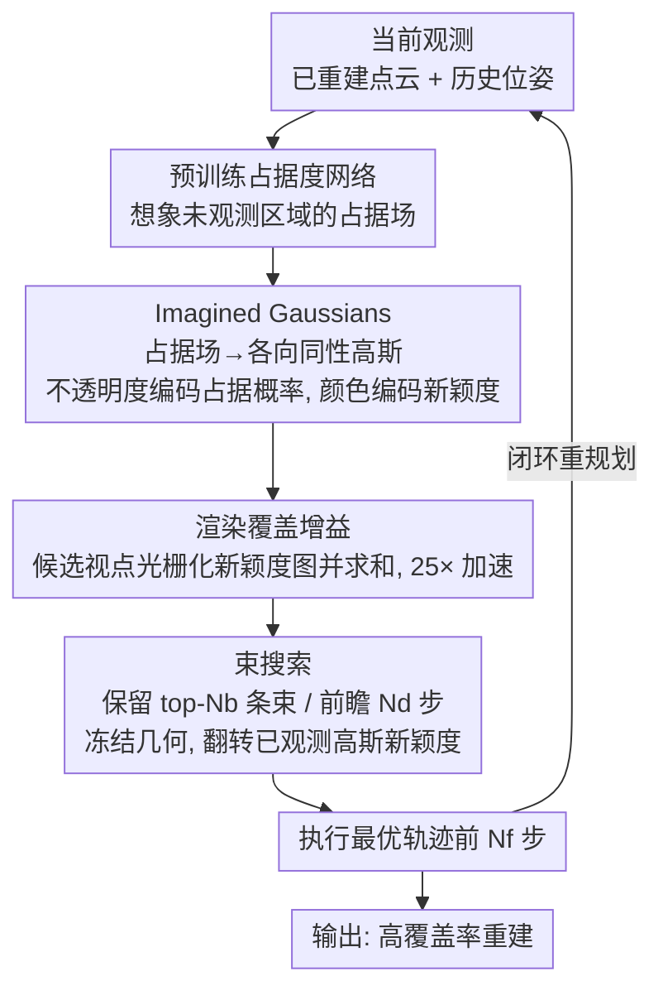

# MAGICIAN: Efficient Long-Term Planning with Imagined Gaussians for Active Mapping

**会议**: CVPR 2026  
**arXiv**: [2603.22650](https://arxiv.org/abs/2603.22650)  
**代码**: [https://shiyao-li.github.io/magician/](https://shiyao-li.github.io/magician/)  
**领域**: 3D视觉  
**关键词**: 主动建图, 长期规划, 3D高斯溅射, 场景重建, 视点选择

## 一句话总结

提出MAGICIAN框架，利用预训练占据度网络生成"想象高斯"（Imagined Gaussians）来高效估计表面覆盖增益，结合束搜索实现主动建图中的长期轨迹规划，在室内外场景均达到SOTA，覆盖率提升超10%。

## 研究背景与动机

1. **领域现状**：主动建图（Active Mapping）要求智能体自主选择最优视点来高效重建未知环境。当前主流方法使用贪心的"下一最佳视点"（NBV）策略，基于信息增益、Fisher信息或表面覆盖增益来选择下一个位姿。
2. **现有痛点**：贪心NBV方法只局部优化单步增益，导致智能体陷入死角、来回折返等低效探索行为。虽然有些方法尝试更长的路径规划（如FisherRF选择前沿目标、NextBestPath预测路径增益），但要么仍依赖前沿启发式，要么依赖训练数据质量。
3. **核心矛盾**：长期规划面临"鸡生蛋蛋生鸡"问题——要规划最优轨迹需要知道环境地图，但地图本身正是要通过规划来构建的。同时，轨迹空间的组合爆炸和计算成本使得长期规划极其困难。
4. **本文目标** (1) 高效估计未观察区域的表面覆盖增益；(2) 在组合爆炸的轨迹空间中搜索最优长期路径；(3) 实现可扩展的闭环规划。
5. **切入角度**：受人类快速推断陌生环境结构并规划探索的能力启发，通过预训练占据度网络"想象"未见区域。
6. **核心 idea**：将占据度预测转化为3D高斯表示，利用快速体积渲染计算覆盖增益，使得束搜索式长期规划成为可能。

## 方法详解

### 整体框架

主动建图的难点在于每走一步都要赌：下一个视点该去哪，才能用最少的步数把未知环境扫完。MAGICIAN 把这件事拆成一个反复执行的感知-规划-行动循环。每到一个位置，它先用预训练占据度模型"脑补"出当前环境的概率占据场——不只是已经看到的部分，还包括被遮挡、尚未观测的区域；接着把这个占据场翻译成一组特殊的 3D 高斯，论文称之为 Imagined Gaussians；然后借助 GPU 体积渲染，快速算出任意候选视点能新看到多少表面（即覆盖增益）；有了这个廉价的"打分函数"，它就能跑束搜索去规划一条往前看好几步的长期轨迹；最后执行这条轨迹的前 $N_f$ 步，再回到第一步重新规划，形成闭环。整套流程的关键，是把"未来视点值不值得去"这个抽象问题，变成了一次次便宜的渲染。

### 关键设计

**1. Imagined Gaussians：把覆盖增益变成一次渲染**

直接估计一个候选视点能新看到多少表面，传统做法（如 MACARONS）要在密集 3D 采样点上反复查询占据度和新颖度两个神经网络，再做 Monte Carlo 积分，单视点要 0.05s，长期规划需要评估成千上万个候选，这个开销根本扛不住。MAGICIAN 的破局点是注意到一个数学巧合：表面覆盖增益的积分（占据度 × 遮挡 × 新颖度）和体积渲染方程（密度 × 透射率 × 颜色）在结构上一一对应。于是它把占据度网络 $\hat{\sigma}(\mathbf{x}\mid\mathbf{C}_t)$ 输出的每个代理点放上一个各向同性高斯球，用不透明度编码占据概率、用颜色通道编码一个二值新颖度 $\hat{\gamma}\in\{0,1\}$（1=尚未观测，0=已看过）。这样一来，对任意候选位姿只要渲染一张"新颖度图"再求和，得到的就是覆盖增益——计算从两次神经网络密集查询塌缩成一次高度优化的高斯光栅化，单视点降到 0.002s，约 25 倍加速。正是这个加速让后面的束搜索从"算不动"变成"算得起"。

**2. 束搜索：在爆炸的轨迹空间里往前看好几步**

贪心 NBV 只挑当下增益最大的单步，很容易把智能体引进死角、来回折返。MAGICIAN 改用束搜索同时保留 $N_b$ 条候选轨迹（束），让它们竞争累积收益。每条束独立维护自己的一份 Imagined Gaussians 状态，因为不同轨迹看过的区域不同；每步扩展时枚举每条束所有可达的下一位姿、算出各自覆盖增益，再从所有展开里只留下 top-$N_b$ 条继续往下走。一个关键技巧是搜索过程中冻结高斯的几何参数，只把被某个位姿观测到的高斯新颖度从 1 翻成 0——这样后续位姿再渲染时，已看过的表面自然就不再计入增益，无需重新建图。前瞻 $N_d$ 步后，选累积覆盖增益 $\sum_{i=1}^{N_d} G(\mathbf{c}_i)$ 最大的那条轨迹执行。贪心 NBV 其实就是 $N_b=1,\,N_d=1$ 的退化特例；把束宽和前瞻步数放开后，覆盖效率系统性变好（AUC +6.3%、覆盖率 +9.3%）。

**3. 预训练占据度网络：长期规划得先能"想象"未见区域**

要评估几步之后的视点值不值得去，前提是对那片还没看到的区域的几何有个先验猜测——否则一切前瞻都是盲算。MAGICIAN 用一个多层 Transformer 占据度网络 $\hat{\sigma}(\mathbf{x}\mid\mathbf{C}_t)$ 充当这个"世界模型"，输入查询点、已重建点云和历史位姿，输出 $[0,1]$ 的占据概率。它先在 ShapeNet 上预训练、再在 3D 场景上微调，从而编码进强结构先验（比如墙后大概率还有空间、桌面下方通常是地面）；同一张网络还顺带用来规划无碰撞轨迹。一个略反直觉的发现是：即便跳过目标域微调、直接用预训练模型，性能也几乎不掉，说明这种结构先验的可迁移性相当强。

### 一个例子：一步束搜索怎么收敛

设束宽 $N_b=3$、前瞻 $N_d$ 较深。当前保留着 3 条候选束 $\{B_1,B_2,B_3\}$，各自带着一份独立的 Imagined Gaussians 状态。这一步展开时，假设每条束有 10 个可达的下一位姿，于是共生成 $3\times10=30$ 个新候选；对每个候选渲染一张新颖度图并求和，得到 30 个覆盖增益值。比如 $B_1$ 往左转能新照到一大片走廊（增益高），$B_2$ 撞向已扫完的墙角（增益接近 0）。把这 30 个候选按累积增益排序，只留 top-3 进入下一步，其余剪掉。被选中的位姿一旦"看过"某些高斯，就把那些高斯的新颖度置 0，于是下一步即使别的束路过同一片走廊，也不会重复加分。如此逐步推进 $N_d$ 步，最终在所有存活轨迹里挑累积增益最高的一条，执行它的前 $N_f$ 步后再重新规划。整个过程里地图从未真正重建，全靠"冻结几何 + 翻转新颖度"在脑内推演。

### 损失函数 / 训练策略

占据度网络使用标准占据度预测损失预训练，再在 3D 场景上微调。探索过程本身不涉及任何梯度更新——Imagined Gaussians 由前向推理生成、新颖度按规则翻转，是完全免训练的闭环规划。

## 实验关键数据

### 主实验

| 数据集 | 指标 | MAGICIAN | MACARONS | FisherRF | SCONE |
|--------|------|----------|----------|----------|-------|
| Macarons++ | AUC↑ | **0.721** | 0.647 | 0.546 | 0.534 |
| Macarons++ | Final Coverage↑ | **0.919** | 0.819 | 0.786 | 0.670 |
| MP3D(轮式) | Comp.(%)↑ | **85.45** | - | - | - |
| MP3D(轮式) | Comp.(cm)↓ | **4.93** | - | - | - |
| MP3D(无人机) | Comp.(%)↑ | **96.83** | - | 90.18(NARUTO) | - |
| MP3D(无人机) | Comp.(cm)↓ | **2.11** | - | 3.00(NARUTO) | - |

**渲染/重建质量** (大规模真实扫描场景):

| 方法 | SSIM↑ | PSNR↑ | LPIPS↓ | Acc.(%)↑ |
|------|-------|-------|--------|----------|
| FisherRF | 0.55 | 13.95 | 0.38 | 79.15 |
| MACARONS | 0.61 | 15.68 | 0.34 | 86.42 |
| MAGICIAN | **0.64** | **17.12** | **0.30** | **94.20** |

### 消融实验

| 配置 | AUC↑ | Final Cov.↑ | 说明 |
|------|------|-------------|------|
| $N_b=1, N_d=1$ (贪心) | ~0.66 | ~0.83 | 退化为NBV，仍优于MACARONS |
| $N_b=10, N_d=10$ (完整) | 0.721 | 0.919 | +6.3% AUC, +9.3% Coverage |
| 预训练占据度模型 | 0.652 | 0.888 | 泛化性好 |
| 微调占据度模型 | 0.646 | 0.893 | 微调无明显帮助 |

### 关键发现

- **即使退化为贪心NBV，Imagined Gaussians渲染方式仍优于MACARONS的Monte Carlo方式**：AUC+5.2%，覆盖率+10.9%。单视点增益估计速度25倍提升是关键
- **长期规划的价值随步数增加而显著**：从1步到10步前瞻，覆盖率从~82%提升到~92%，证明了长期规划的必要性
- **重规划频率不需极高**：每6步重规划一次即可达到SOTA水平，说明轨迹规划具有一定鲁棒性
- **占据度模型域迁移能力强**：仅在室外预训练的模型直接用于室内场景，性能几乎不下降

## 亮点与洞察

- **覆盖增益 ↔ 体积渲染的对应关系**是本文最精妙的洞察：表面覆盖增益积分（占据度×遮挡×新颖度）在数学形式上完全等价于体积渲染方程（密度×透射率×颜色），这使得可以直接复用高度优化的高斯渲染管线来计算覆盖增益，将探索规划变成了一个"渲染问题"
- **束搜索中每条束独立维护高斯状态**的设计很巧妙——不同候选轨迹有不同的观察历史，通过独立的新颖度状态实现了正确的累积增益计算，同时保持了并行性
- **这套框架可以自然扩展到其他探索准则**：只需改变"颜色通道"编码的语义（不确定性、重建误差等），渲染框架不变

## 局限与展望

- 需要预训练占据度网络，对全新域（如水下、太空）可能需要重新训练或微调
- 束搜索仍有计算开销，$N_b=10, N_d=10$ 时需要评估大量候选视点
- 实验中假设精确位姿已知，未考虑定位误差对规划的影响
- **改进方向**：(1) 使用更轻量的占据度估计（如2D特征投影到3D）减少预训练依赖；(2) 结合LLM/VLM实现语义引导的主动建图；(3) 引入不确定性感知的重规划策略

## 相关工作与启发

- **vs MACARONS**: MACARONS使用相同占据度网络但贪心NBV + Monte Carlo增益估计，MAGICIAN通过Imagined Gaussians+束搜索实现长期规划，覆盖率从0.819提升到0.919
- **vs FisherRF**: FisherRF基于前沿选择+Fisher信息增益，但路径规划与增益计算解耦，导致路径上的增益被忽略。MAGICIAN的束搜索在轨迹级别优化累积增益
- **vs ActiveGamer**: ActiveGamer在MP3D上表现强劲(95.32%)，MAGICIAN进一步提升到96.83%且不依赖任何传统规划器或导航模型

## 评分

- 新颖性: ⭐⭐⭐⭐⭐ 覆盖增益到体积渲染的形式化对应极为优雅，首次实现主动建图的长期规划
- 实验充分度: ⭐⭐⭐⭐⭐ 室内外多基准、多动作空间、渲染/重建双评、全面消融，实验设计周全
- 写作质量: ⭐⭐⭐⭐⭐ 数学推导清晰，从问题定义到方法设计逻辑流畅，图示丰富
- 价值: ⭐⭐⭐⭐⭐ 解决了主动建图领域长期悬而未决的长期规划问题，实用价值高

<!-- RELATED:START -->

## 相关论文

- [\[CVPR 2026\] Paparazzo: Active Mapping of Moving 3D Objects](paparazzo_active_mapping_of_moving_3d_objects.md)
- [\[CVPR 2026\] Uncertainty-driven 3D Gaussian Splatting Active Mapping via Anisotropic Visibility Field](uncertainty-driven_3d_gaussian_splatting_active_mapping_via_anisotropic_visibili.md)
- [\[CVPR 2025\] ActiveGAMER: Active GAussian Mapping through Efficient Rendering](../../CVPR2025/3d_vision/activegamer_active_gaussian_mapping_through_efficient_rendering.md)
- [\[CVPR 2026\] Scene Reconstruction as Mapping Priors for 3D Detection](scene_reconstruction_as_mapping_priors_for_3d_detection.md)
- [\[CVPR 2026\] OnlinePG: Online Open-Vocabulary Panoptic Mapping with 3D Gaussian Splatting](onlinepg_online_open-vocabulary_panoptic_mapping_with_3d_gaussian_splatting.md)

<!-- RELATED:END -->
