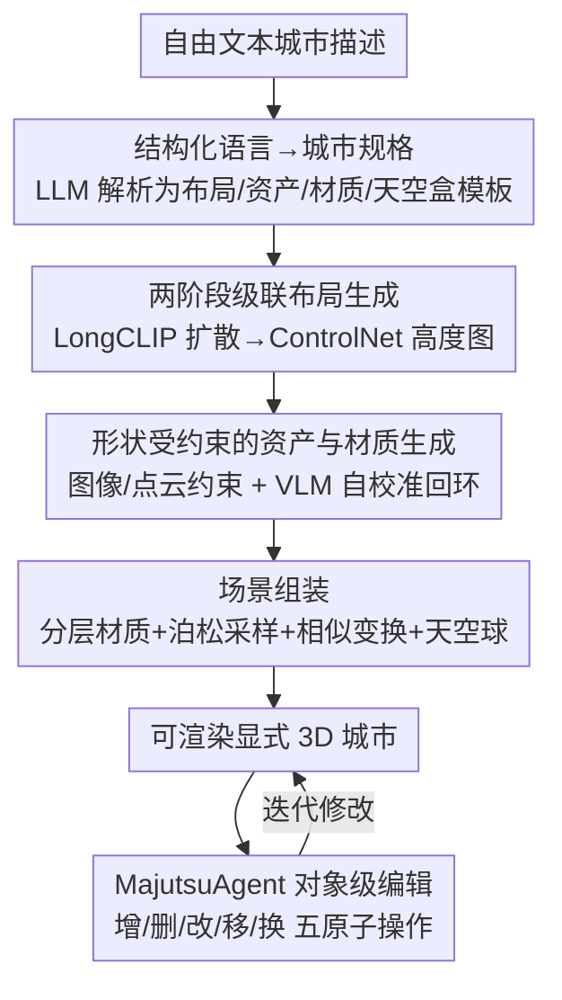

# MajutsuCity: Language-driven Aesthetic-adaptive City Generation with Controllable 3D Assets and Layouts

**会议**: CVPR 2026  
**论文**: [CVF Open Access](https://openaccess.thecvf.com/content/CVPR2026/html/Huang_MajutsuCity_Language-driven_Aesthetic-adaptive_City_Generation_with_Controllable_3D_Assets_and_CVPR_2026_paper.html)  
**代码**: 项目页 https://longhz140516.github.io/MajutsuCity/  
**领域**: 3D视觉  
**关键词**: 3D城市生成, 语言驱动, 可控布局, 显式网格, 交互编辑

## 一句话总结
MajutsuCity 用一条「文本→场景设计→布局/高度图→资产与材质→场景组装」的四阶段流水线，把自然语言直接变成结构一致、风格可调、可对象级编辑的显式 3D 城市，并配套数据集 MajutsuDataset、编辑智能体 MajutsuAgent 与一套 VLM 评测指标（AQS/RDR），在布局 FID 上比 CityDreamer 降 83.7%、比 CityCraft 降 20.1%。

## 研究背景与动机
**领域现状**：城市级 3D 生成有两条主流路线。一条是 LLM 驱动的程序化生成（SceneCraft、3D-GPT），表达力强但只能做小规模简单场景，撑不起城市级的宏观几何合理性；另一条是布局引导方法（InfiniCity、CityDreamer、GaussianCity），用 2D 语义先验生成城市级场景，但依赖隐式表示或神经渲染，存在多视角不一致、且难以接入下游仿真管线的问题。

**现有痛点**：为兼顾结构可靠性，近期工作转向显式网格（explicit mesh），从预定义资产库里检索建筑摆放。但这样一来生成多样性被资产库的覆盖范围和风格限制死了——本质上更像「检索-摆放（Retrieve-and-Place）」而非真正的生成。于是出现一个两难：文本生成有创作灵活性却缺对象级可编辑性，显式结构表示有可编辑性却缺风格多样性。

**核心矛盾**：现有方法无法同时满足风格多样性 + 细粒度可控性 + 对象级可编辑性这三件事，根因是它们在「文本灵活性」和「显式结构可编辑」之间二选一。

**本文目标**：把自然语言里同时编码的宏观几何逻辑（如「林立摩天楼的繁华市中心」）与细粒度审美意图（如「日落下的粉色灯光」）都解析出来，落到一个结构一致、可逐对象编辑、风格可自适应的显式 3D 城市上。

**切入角度**：作者的关键观察是——自然语言本身就同时承载了「该怎么排布」和「该长成什么样」两层信息，只要设计一套结构化的「语言→城市规格」解析管线，就能把这两层分别注入布局生成和资产合成。

**核心 idea**：把城市表示为「可控布局 + 可控资产 + 可控材质」的组合，用四阶段流水线把文本逐级翻译成显式 3D 城市，再加一个语言驱动的编辑智能体把可控性从「初次生成」延伸到「持续修改」。

## 方法详解

### 整体框架
MajutsuCity 接收一段自由文本城市描述，输出一座可渲染、可逐对象编辑的显式 3D 城市。它把任务拆成四个串行阶段：**Scene Design** 用 LLM 把模糊文本解析成结构化设计规格（布局/资产/材质/天空盒四个维度的标准化模板）；**Layout Generation** 用两阶段级联扩散把规格变成语义布局图 $I_{layout}$ 和建筑高度图 $I_{height}$；**Assets & Materials Generation** 自底向上为每个建筑实例生成形状受约束的 3D 资产，并微调生成可无缝平铺的 PBR 材质与天空盒；**Scene Generation** 把资产、地表分层、植被、路灯和天空球组装成完整场景。在初次生成之外，**MajutsuAgent** 用 GPT-5 把用户的自然语言编辑指令拆成五种原子操作，实现人在环路的对象级修改。整个系统还配套了多模态数据集 MajutsuDataset 与一套 VLM 评测协议 AQS/RDR。

### 关键设计

**1. 结构化语言→城市规格：把模糊文本解析成可执行的设计蓝图**

自由文本描述城市天然是模糊的，缺少量化和关系约束，直接喂给生成模型很难控。MajutsuCity 用 LLM 做意图理解与结构化分解：它对用户 prompt 推理出潜在的规划意图，拆解成一个多维城市设计模板，覆盖布局（Layout）、资产（Assets）、材质（Materials）、天空盒（Skymap）四个维度，每个维度用标准化模板参数化（如土地用途、空间分布、建筑风格、立面材质）。这一步把一句话变成一张「语义化蓝图」，同时指导后续的空间布局生成和 3D 资产合成——这是整条流水线能被精确控制的前提，也是它区别于「一句 prompt 直接出图」式方法的关键。

**2. 两阶段级联布局生成：先出语义布局、再用 ControlNet 注入高度**

要从高层文本同时得到语义和几何两种输出，作者设计了两阶段级联扩散。第一阶段用扩散模型 $\epsilon^{(1)}_\theta$ 从细粒度长文本 $C_{layout}$ 合成语义布局图 $I_{layout}$。由于 $C_{layout}$（如「一条主干道从西北延伸到东南，两侧密布商业建筑」）经常超出标准 CLIP 编码器的 token 长度与上下文上限，作者把文本编码器 $\tau_\theta$ 换成 LongCLIP，得到不被压缩、信息丰富的语义特征 $e_c=\tau_\theta(C_{layout})$，从而对复杂布局做精确控制。第二阶段把生成的 $I_{layout}$ 当作强空间先验 $C_s$（如其语义掩码），喂进基于 ControlNet 的架构 $\epsilon^{(2)}_\theta$，用零卷积层注入像素级控制信号来合成高度图 $I_{height}$，保证它与 $I_{layout}$ 里的建筑区域严格空间一致。两阶段都用标准 latent diffusion 目标训练：

$$L = \mathbb{E}_{z_0,c,\epsilon\sim\mathcal{N}(0,1),t}\left[\|\epsilon-\epsilon_\theta(z_t,t,c)\|_2^2\right].$$

这种解耦设计让高层语义意图和低层空间约束各走一条路、又被强制对齐，比一步到位直接生成几何更稳。

**3. 形状受约束的资产与材质生成：用图像/点云双约束 + VLM 自校准回环锁住几何**

现有城市生成里语义表示和几何可控性耦合很弱，导致对象级可编辑性差、结构逻辑不一致。作者改用自底向上的资产级生成：给定布局图和高度图，先抽出实例级建筑单元，再按 Assets Design 规格为每个实例单独生成一个 3D 资产，从而把全局布局生成和局部几何建模解耦。为保证资产与规定布局对齐，引入两条互补的形状约束策略——**图像约束**：受 Qwen-Image-Edit 启发，把建筑掩码挤出（extrude）的粗几何做等距渲染 $I_{iso}$ 当几何先验，配合「Assets Design」prompt $p_{AD}$ 提供风格语义，在不破坏原始几何比例的前提下细化外观；再加一个 VLM 自校准机制定量评估细化结果 $I_{ref}$ 与先验 $I_{iso}$ 的形状一致性，一旦偏差超过预设阈值，就触发「复查-重生成」回环逐步调参直到满足几何一致。**点云约束**（可选）：从粗几何均匀采样点云 $P_c$，连同参考图 $I_{ref}$ 一起喂进多条件 3D 生成框架，在形状和尺度上严格贴合既定 footprint。材质侧则因为道路、草地、水面这类连续表面需要可无缝平铺的纹理（否则会出现接缝和周期性伪影），作者以 Qwen-Image 为骨干，在 MajutsuDataset-Material 和 MajutsuDataset-Skybox 上微调，产出可无缝平铺的材质图和全景天空球。

**4. MajutsuAgent：把语言可控性从初次生成延伸到对象级编辑**

传统场景生成管线生成完就不能改了，而对象级表示天然提供了细粒度交互接口。MajutsuAgent 把高层自然语言交互抽象成五种标准化原子操作并封进统一接口：**Add**（实例化并插入新资产）、**Delete**（删除指定资产）、**Edit**（修改资产的视觉/结构属性）、**Move**（对选中资产做平移/旋转/缩放刚体变换）、**Replace**（替换特定表面的材质）。它用 GPT-5 把用户指令分解成一串原子、可解释的操作序列，从而把用户意图准确翻译成可控的场景修改，实现人在环路的迭代精修。这一组件正是「可控生成 + 高效编辑」里编辑那一半的落点，也是论文反复强调的「实用城市生成框架不能只会生成」的体现。

### 损失函数 / 训练策略
布局生成以预训练 Stable Diffusion v2.1 为基线，原 CLIP 文本编码器换成 LongCLIP；高度图合成阶段把 ControlNet 编码器与 U-Net 联合训练以保证两阶段空间对齐。两网络都在 512×512 分辨率上训练，用 AdamW、初始学习率 $1\times10^{-5}$，在 4 张 A100 上训 100 个 epoch、全局 batch size 128。推理时两阶段都用 CFG scale $\omega=9.0$、DDIM 采样 $T=50$ 步，整套生成可在单张 A800 上跑完。

## 实验关键数据

### 主实验
布局生成沿用 CityDreamer/CityCraft 的协议，用 FID/KID/IS 评估：

| 方法 | FID(↓) | KID(↓) | IS(↑) |
|------|--------|--------|-------|
| InfiniteGAN | 180.4 | 0.215 | 2.58 |
| CityDreamer | 139.6 | 0.164 | 1.96 |
| CityCraft | 28.4 | 0.016 | 3.11 |
| **本文** | **22.7** | **0.013** | **3.14** |

FID 相对 CityDreamer 降 83.7%、相对 CityCraft 降 20.1%，IS 也最高，说明细粒度空间文本带来的布局更贴近真实分布、结构更清晰多样。

城市场景生成因为缺统一协议，作者引入 VLM 评测框架，沿四个维度打分——SVC（结构与视角一致性）、SRC（场景丰富度与复杂度）、MTF（材质与纹理保真度）、LA（光照与氛围）。**AQS**（绝对量化打分）让 GPT-5 对多视角渲染按四维度给 1–10 分取均值；**RDR**（相对维度排名）则做成对比较、每张图至少参与 10 次对比、用 TrueSkill 排名系统聚合，以缓解绝对打分的偏置。两套协议都用 GPT-5 评估器 + 20 名真人用户：

| 协议 | 指标维度 | CityDreamer | GaussianCity | UrbanWorld | CityCraft | 本文(GPT) |
|------|---------|-------------|--------------|------------|-----------|-----------|
| AQS | SVC↑ | 4.20 | 6.73 | 6.17 | 6.00 | **8.56** |
| AQS | SRC↑ | 6.90 | 7.17 | 5.40 | 6.11 | **8.33** |
| AQS | MTF↑ | 2.70 | 2.83 | 2.14 | 4.22 | **7.00** |
| AQS | LA↑ | 3.10 | 3.33 | 2.80 | 5.00 | **6.67** |
| RDR | SVC↑ | 12.39 | 23.56 | 25.31 | 24.44 | **34.13** |

本文在全部八个维度（AQS×4 + RDR×4）的 GPT 与用户评分上均排第一。作者还指出一个有意思的现象：基于 3DGS 的 GaussianCity 在 AQS 的 SVC 上超过基于网格的 UrbanWorld/CityCraft，但在 RDR 下排名反转——说明 RDR 能更好地缓解绝对打分的偏置、给出更稳健的结构一致性评估；同时 GPT 与人类评分高度一致，侧面验证了这套维度设计的合理性。

### 消融实验
布局生成模块消融（Spatial Text = 细粒度空间文本，LongCLIP = 长文本视觉-语言预训练模块）：

| Spatial Text | LongCLIP | FID(↓) | KID(↓) | IS(↑) | 说明 |
|:---:|:---:|---|---|---|------|
| ✗ | ✗ | 35.7 | 0.025 | 3.08 | 用短 prompt，最差 |
| ✗ | ✓ | 28.0 | 0.023 | 3.07 | 去掉细粒度空间文本 |
| ✓ | ✓ | **22.7** | **0.013** | **3.14** | 完整模型 |

### 关键发现
- 细粒度空间文本贡献最大：去掉它（改用短 prompt）FID 从 22.7 飙到 35.7；去掉 LongCLIP 则从 22.7 退化到 28.0。两者都不可或缺，但「描述得够细」比「编码器够强」对布局质量影响更大。
- 材质/光照（MTF/LA）是老方法的普遍短板（CityDreamer/GaussianCity 的 MTF 都在 2–3 分），而本文靠微调出的可无缝平铺 PBR 材质和高质量天空球把 MTF 拉到 7.0、LA 到 6.67，是相对优势最明显的两个维度。
- 风格自适应：把生成条件设为 Minecraft、荷兰、赛博朋克、吉卜力四种风格，模型能在大尺度城市上既抓住各风格的标志性特征、又保持强的风格内一致性。

## 亮点与洞察
- **「显式网格 + 自底向上生成」破解检索-摆放的多样性瓶颈**：用形状约束 + VLM 自校准回环为每个建筑实例单独生成资产，既保住了显式表示的可编辑/可仿真，又拿回了生成式的风格多样性——这是把两条对立路线缝合起来的关键招。
- **VLM 自校准的「复查-重生成」回环**很实用：用 VLM 定量比对细化结果与几何先验、超阈值就自动重生成，相当于给生成过程加了一个无人值守的几何质检环，可迁移到任何「生成的几何必须贴合给定 footprint」的任务。
- **AQS + RDR 双协议**给「没有金标准」的 3D 城市生成提供了一套可复现评测：绝对打分给绝对水平、相对排名（TrueSkill）抗偏置，并实证 GPT 评估接近人类——这套方法论本身对其他主观质量评测任务有借鉴意义。
- 把可控性从「生成」延伸到「编辑」（MajutsuAgent 五原子操作）这件事，提醒大家实用的内容生成系统价值一半在「生成后还能改」。

## 局限与展望
- ⚠️ 论文正文未给出生成单座完整城市的端到端耗时、资产数量上限与显存占用等系统级成本数据，实际可扩展性（多大规模、多少建筑）从文中难以判断。
- 资产库虽由 5 个商用 3D 生成系统产出 1,000 个模型，但仍是预定义的十种风格 × 二十种建筑类型，遇到训练分布外的极端建筑风格能否泛化，文中未充分验证。
- 评测高度依赖 GPT-5 作为评估器与意图分解器，存在对单一闭源大模型的依赖；GPT 评分虽与人类一致，但仅在 16 个 ImageNet 风格/有限场景上验证，规模偏小。
- 材质走 Qwen-Image 微调 + 无缝平铺，对水面反射、动态光照等更复杂物理效果的支持有限；MajutsuAgent 的五种原子操作覆盖了常见编辑，但对「批量风格迁移」「语义级重排」这类高层编辑尚未展开。

## 相关工作与启发
- **vs CityDreamer / GaussianCity（隐式/神经渲染布局引导）**：它们用 2D 语义先验出城市级场景，但隐式/NeRF/3DGS 表示带来多视角不一致、难接仿真；本文用显式网格 + 形状约束生成，结构一致性和下游兼容性更好，布局 FID 直接降 83.7%。
- **vs CityCraft（显式网格检索-摆放）**：CityCraft 靠固定资产库出图，材质保真度（MTF）尚可但风格单调、SRC 低；本文自底向上为每个实例生成资产，风格多样性显著更强，布局 FID 再降 20.1%。
- **vs SceneCraft / 3D-GPT（LLM 驱动程序化生成）**：它们表达力强但只能做小规模简单场景、撑不起城市级宏观几何；本文把 LLM 只用在「文本→结构化规格」这一步，把宏观几何交给扩散+ControlNet，规模和几何合理性都更高。
- **vs UrbanWorld（显式网格但粗糙）**：UrbanWorld 用显式网格却限于粗糙基元、纹理保真度低；本文在 MTF/LA 上大幅领先。

## 评分
- 新颖性: ⭐⭐⭐⭐ 把显式网格的可编辑性和生成式多样性缝合成统一四阶段管线、并配编辑智能体，思路完整但各组件多为成熟模块的组装。
- 实验充分度: ⭐⭐⭐⭐ 布局 FID/KID/IS + 场景 AQS/RDR 双协议 + GPT/人类双评 + 消融，较全面；但系统成本与大规模泛化数据缺失。
- 写作质量: ⭐⭐⭐⭐ 四阶段叙述清晰、图表配套；部分缓存文本有 OCR 噪声但不影响主线。
- 价值: ⭐⭐⭐⭐ 数据集 + 框架 + 评测协议三件套对 3D 城市生成社区有实打实的基础设施价值。

<!-- RELATED:START -->

## 相关论文

- [\[CVPR 2026\] Yo'City: Personalized and Boundless 3D Realistic City Scene Generation via Self-Critic Expansion](yocity_personalized_and_boundless_3d_realistic_city_scene_generation_via_self-cr.md)
- [\[CVPR 2026\] M3DLayout: A Multi-Source Dataset of 3D Indoor Layouts and Structured Descriptions for 3D Generation](m3dlayout_a_multi-source_dataset_of_3d_indoor_layouts_and_structured_description.md)
- [\[CVPR 2026\] PrITTI: Primitive-based Generation of Controllable and Editable 3D Semantic Urban Scenes](pritti_primitive-based_generation_of_controllable_and_editable_3d_semantic_urban.md)
- [\[CVPR 2026\] ArtLLM: Generating Articulated Assets via 3D LLM](artllm_generating_articulated_assets_via_3d_llm.md)
- [\[CVPR 2026\] LangField4D: Learning Identity-Adaptive and Spatio-Temporal Continuous 4D Language Fields for Dynamic Scenes](langfield4d_learning_identity-adaptive_and_spatio-temporal_continuous_4d_languag.md)

<!-- RELATED:END -->
