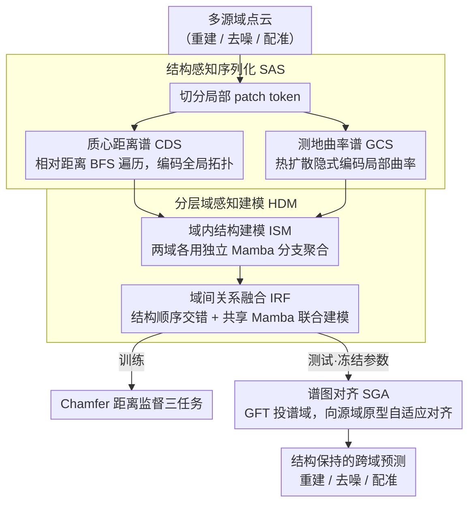

# Mamba Learns in Context: Structure-Aware Domain Generalization for Multi-Task Point Cloud Understanding

**会议**: CVPR 2026  
**arXiv**: [2603.20739](https://arxiv.org/abs/2603.20739)  
**代码**: [https://github.com/Jinec98/SADG](https://github.com/Jinec98/SADG)  
**领域**: 3D视觉  
**关键词**: 点云理解, 域泛化, Mamba, 上下文学习, 结构感知序列化

## 一句话总结

提出SADG框架，首次将Mamba引入多任务点云域泛化的上下文学习，通过结构感知序列化（质心距离谱+测地曲率谱）、分层域感知建模和谱图对齐三个模块，在重建、去噪、配准三个任务上全面超越SOTA。

## 研究背景与动机

1. **领域现状**：Transformer和Mamba架构在点云表示学习中取得进展，但通常针对单任务或单域设计。DG-PIC是首个探索多任务域泛化的工作，使用Transformer进行上下文学习（ICL），但存在二次复杂度和缺乏序列顺序的问题。
2. **现有痛点**：直接将Mamba应用于多任务域泛化面临严重挑战——现有Mamba方法依赖坐标驱动的序列化（如轴扫描、Hilbert曲线），对视点变化和缺失区域高度敏感，会破坏点云的层级结构，导致状态传播不稳定和"结构漂移"。
3. **核心矛盾**：重建、去噪、配准三个任务都依赖于保持点云的结构层级（全局拓扑和局部几何连续性），但域迁移（噪声、遮挡、位姿变化）下坐标序列化会扭曲邻域关系和内在拓扑，使Mamba的递归建模变得脆弱。
4. **本文目标** (1) 设计变换不变的结构感知序列化；(2) 在跨域场景下稳定Mamba的序列建模；(3) 实现免参数更新的测试时域适应。
5. **切入角度**：核心观察是重建、去噪、配准共享"保持结构层级"的需求，因此设计基于内在几何的序列化可以同时服务多任务。
6. **核心 idea**：通过内在几何谱（拓扑+曲率）将无序点云token序列化为结构一致的序列，赋予Mamba结构感知的域泛化能力。

## 方法详解

### 整体框架

SADG 要解决的是同一个模型在重建、去噪、配准三个点云任务上跨域泛化的问题，而它的关键判断是：这三个任务都依赖点云的结构层级（全局拓扑加局部几何连续性），所以只要把无序的点云 token 排成一条「结构一致」的序列，就能用线性复杂度的 Mamba 同时服务多任务。整条流程分训练、测试两段。训练时，先把多源域点云切成局部 patch token，用两种内在几何谱把它们序列化成有序序列——CDS 负责全局拓扑、GCS 负责局部曲率；序列化后的 token 进入分层域感知建模（HDM），先在域内做结构聚合，再做域间关系融合。测试时，谱图对齐（SGA）在谱域把目标域特征往源域原型上拉，整个过程冻结参数、不更新任何权重，就完成结构保持的特征迁移。

### 关键设计

**1. 质心距离谱 CDS：用相对距离关系做旋转/视点不变的全局拓扑序列化**

它针对的是「坐标驱动序列化（轴扫描、Hilbert 曲线）对视点和旋转敏感、一变换就结构漂移」这个痛点。CDS 不按绝对坐标排，而是先算点云全局质心 $c = \frac{1}{N}\sum u_i$，在 token 间建一张亲和度图 $w_{CDS}(i,j) = \exp(-\|u_i - u_j\|^2 / \sigma^2)$，从离质心最近的 token 出发做 BFS 遍历，每一步优先扩展亲和度最高的邻居。关键在于「为什么用 BFS 而不是直接按距离排序」：直接排序会让空间上相隔很远的两个 token 在序列里突然相邻，给 Mamba 的状态传播制造跳变；而 BFS 从质心由粗到细向外扩，序列里相邻的 token 在空间上也连续。又因为整个过程只依赖相对距离关系，在平移、旋转下保持一致，全局拓扑因此被稳定地编码进序列顺序。

**2. 测地曲率谱 GCS：用热扩散隐式编码曲率，避开显式曲率估计的脆弱**

CDS 抓住了全局拓扑，但局部表面的曲率连续性还得补上，而显式算曲率要依赖法线和密集采样，在噪声、残缺、合成到真实的域差异下极不稳定。GCS 改走隐式路线：先在 token 的 KNN 邻接图上算测地距离，刻画流形连通性；再在 Laplace-Beltrami 算子上跑热扩散——高曲率区域热量散得快、平坦区域热量留得久。于是把多尺度热核的对角项拼成每个 token 的曲率描述子

$$h_i = [K_{\tau_1}(i,i),\ K_{\tau_2}(i,i),\ \ldots,\ K_{\tau_S}(i,i)]$$

再按描述子之间的亲和度建图、序列化。这样曲率信息是从扩散过程里「涌现」出来的，不用显式估法线，对噪声和域迁移天然更鲁棒。

**3. 分层域感知建模 HDM：先域内后域间，避免 Mamba 在域边界处状态传播中断**

Transformer 的 ICL 可以直接把 prompt 域和 query 域 token 拼在一起、靠注意力交互，但 Mamba 是序列敏感的递归模型——两个域的 token 一旦拼接，边界处的状态传播就被打断了。HDM 用两级级联绕开这点。域内结构建模（ISM）先用两个独立的 Mamba 分支各自处理两域的序列化特征

$$Z^p = \mathrm{Mamba}^p(X_{seq}^p), \qquad Z^q = \mathrm{Mamba}^q(X_{seq}^q)$$

让每个域的结构模式在域内先稳定聚合；域间关系融合（IRF）再把两域特征按结构顺序交错排列

$$Z^{pq} = [z_{\pi(1)}^p,\ z_{\pi(1)}^q,\ z_{\pi(2)}^p,\ z_{\pi(2)}^q,\ \ldots]$$

送进一个共享 Mamba 联合建模。交错的妙处在于：结构上对应的 prompt-query token 在序列里紧紧挨着，Mamba 的递归传播顺手就把两域特征隐式交换了，相当于用序列顺序替代了注意力的显式匹配。

**4. 谱图对齐 SGA：测试时不更新参数，在谱域做结构保持的域适应**

测试时参数全部冻结，但目标域和源域之间的差异还得弥合，且不能破坏好不容易建立起来的结构一致性。SGA 把目标域序列化特征看成 CDS/GCS 图上的图信号，用图傅里叶变换（GFT）投到谱域，再向源域原型做自适应对齐

$$\hat{X}_{*,i}^t \leftarrow \alpha_i \hat{X}_{*,i}^t + (1-\alpha_i)\big(\hat{P}_*^s - \hat{X}_{*,i}^t\big)$$

对齐强度 $\alpha_i$ 由目标特征与源原型的余弦相似度自适应调节——相似度高就少动、相似度低就多拉。因为对齐发生在结构图的固有频率基上，整个迁移过程会保持拓扑和几何一致，而不是在原始坐标空间里把特征硬搬过去。

### 损失函数 / 训练策略

遵循DG-PIC框架，使用AdamW优化器，学习率 $1 \times 10^{-4}$，余弦衰减，batch size 96，训练300 epochs。三个任务（重建、去噪、配准）使用Chamfer Distance作为统一损失。双向序列（正向+反向）×两种谱（CDS+GCS）= 4路序列拼接，扩展Mamba感受野。

## 实验关键数据

### 主实验

| 方法 | 设置 | ModelNet Rec. | ShapeNet Den. | ScanNet Reg. | ScanObjectNN Rec. | MP3DObject Rec. |
|------|------|---------------|---------------|--------------|-------------------|-----------------|
| DG-PIC | ICL+DG | 6.84 | 9.81 | 5.10 | 4.52 | 5.91 |
| Vanilla Mamba ICL | ICL+DG | 7.69 | 10.19 | 5.56 | 6.93 | 8.28 |
| **SADG (Ours)** | ICL+DG | **5.99** | **9.34** | **3.63** | **4.29** | **3.55** |

*Chamfer Distance ×10⁻³, 越低越好。SADG在所有5个域的15个任务配置上全面优于DG-PIC。*

### 消融实验

| 配置 | 关键影响 | 说明 |
|------|---------|------|
| w/o CDS (仅GCS) | CD上升 | 丢失全局拓扑信息 |
| w/o GCS (仅CDS) | CD上升 | 丢失局部曲率连续性 |
| 朴素坐标排序替代CDS/GCS | CD显著上升 | 对旋转/视点敏感，结构漂移 |
| w/o HDM (直接拼接) | CD上升 | 域边界处状态传播中断 |
| w/o SGA | CD上升 | 测试时域迁移能力下降 |
| Vanilla Mamba ICL | CD 8.28 vs 3.55 | 无结构感知，性能大幅退化 |

### 关键发现

- **结构漂移是多任务域泛化的核心瓶颈**：Vanilla Mamba ICL比DG-PIC（Transformer）差很多（8.28 vs 5.91 on MP3DObject），说明Mamba的坐标序列化在域泛化中的脆弱性。SADG的结构感知序列化彻底解决了这个问题
- **CDS和GCS互补**：CDS主要提升全局重建质量（拓扑层级），GCS更多改善局部去噪效果（几何连续性），二者结合效果最佳
- **MP3DObject上优势最为显著**：从DG-PIC的5.91降到3.55（40%改进），说明真实扫描场景下结构感知的价值更大（噪声更多、遮挡更严重）
- **SGA的测试时对齐有效但温和**：对齐强度自适应调节避免了对不规则区域的过度矫正

## 亮点与洞察

- **热扩散隐式编码曲率**的想法非常巧妙：避开了传统显式曲率估计对法线和采样密度的依赖，通过Laplace-Beltrami算子的特征值分解和多尺度热核来隐式捕获曲率信息。这种方法对噪声和残缺天然鲁棒
- **域间交错序列设计**利用了Mamba递归传播的特性：相邻位置的特征通过状态传播自然交互，交错排列使得结构对应的prompt-query token在序列中紧邻，实现了隐式的结构匹配
- **谱域对齐**的思路可以迁移到其他结构化数据的域适应任务（如分子图、社交网络等），只需定义合适的图结构

## 局限与展望

- 谱分解（特征值计算）在大规模点云上可能成为瓶颈，论文未讨论token数N很大时的计算效率
- MP3DObject数据集仅包含7个类别，类别多样性有限
- 仅支持重建、去噪、配准三个任务，未验证分类、分割等其他点云任务的泛化能力
- **改进方向**：(1) 探索近似谱方法（如Chebyshev多项式逼近）加速；(2) 将结构感知序列化扩展到户外大场景点云（如自动驾驶LiDAR）；(3) 与点云基础模型（如Point-MAE）进行预训练阶段的结构感知集成

## 相关工作与启发

- **vs DG-PIC**: DG-PIC使用Transformer ICL，二次复杂度且无序列顺序。SADG用Mamba替代，线性复杂度+结构感知序列化，在性能和效率上均优
- **vs PointMamba**: PointMamba是单任务Mamba点云模型，依赖坐标序列化。SADG引入内在几何谱序列化，解决了域泛化中的结构漂移问题
- **vs PointDGMamba**: 专注域泛化但仅针对分类任务，SADG首次结合Mamba+ICL实现多任务域泛化

## 评分

- 新颖性: ⭐⭐⭐⭐⭐ 首次将Mamba引入ICL多任务点云域泛化，三个技术模块（SAS/HDM/SGA）均有清晰创新
- 实验充分度: ⭐⭐⭐⭐⭐ 5域×3任务的全面评估，引入新数据集MP3DObject，消融充分
- 写作质量: ⭐⭐⭐⭐ 数学推导严谨，但符号密度较高，部分推导可更直觉化
- 价值: ⭐⭐⭐⭐ 为Mamba在结构化3D数据上的应用提供了重要方法论贡献

<!-- RELATED:START -->

## 相关论文

- [\[ECCV 2024\] DG-PIC: Domain Generalized Point-In-Context Learning for Point Cloud Understanding](../../ECCV2024/3d_vision/dg-pic_domain_generalized_point-in-context_learning_for_point_cloud_understandin.md)
- [\[CVPR 2026\] Deformation-based In-Context Learning for Point Cloud Understanding](deformation-based_in-context_learning_for_point_cloud_understanding.md)
- [\[AAAI 2026\] DAPointMamba: Domain Adaptive Point Mamba for Point Cloud Completion](../../AAAI2026/3d_vision/dapointmamba_domain_adaptive_point_mamba_for_point_cloud_completion.md)
- [\[CVPR 2025\] PMA: Towards Parameter-Efficient Point Cloud Understanding via Point Mamba Adapter](../../CVPR2025/3d_vision/pma_towards_parameter-efficient_point_cloud_understanding_via_point_mamba_adapte.md)
- [\[CVPR 2026\] 3D-Aware Multi-Task Learning with Cross-View Correlations for Dense Scene Understanding](3d-aware_multi-task_learning_with_cross-view_correlations_for_dense_scene_unders.md)

<!-- RELATED:END -->
