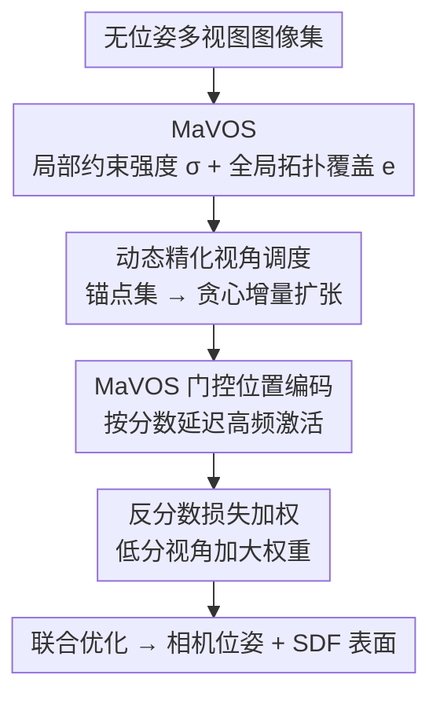

# ManifoldNeuS: Manifold-aware View Optimizability for Pose-Free Neural Surface Reconstruction

**会议**: CVPR 2026  
**论文**: [CVF Open Access](https://openaccess.thecvf.com/content/CVPR2026/html/Liu_ManifoldNeuS_Manifold-aware_View_Optimizability_for_Pose-Free_Neural_Surface_Reconstruction_CVPR_2026_paper.html)  
**代码**: 无（论文未公开链接）  
**领域**: 3D视觉 / 神经表面重建 / 无位姿联合优化  
**关键词**: 位姿无关重建、NeuS、视角可优化性、流形嵌入、SDF

## 一句话总结
ManifoldNeuS 指出无位姿神经表面重建里"均匀对待所有视角"会导致 easy-view bias（容易优化的视角主导梯度、关键但难优化的视角被边缘化），提出在视角流形上联合度量"即时拟合度 + 长期覆盖增益"的可优化性分数 MaVOS，并用它驱动动态视角调度、门控位置编码、反分数损失加权三件套，在 DTU 上把位姿误差从 COLMAP-free baseline 的上百度降到 0.6° 量级、重建质量逼近用 COLMAP 真值位姿训练的 NeuS。

## 研究背景与动机
**领域现状**：多视角 3D 重建（NeRF / 3DGS / 神经隐式 SDF）大多假设有准确相机位姿，通常靠 COLMAP 这类 SfM 流程估计。当位姿噪声大或不可得时，就需要从无位姿图像里**联合优化相机位姿与场景几何**。在隐式表示里，NeuS 这类 SDF 方法因表面保真度高而被青睐。

**现有痛点**：把 BARF 那套位姿联合优化直接搬进 NeuS 框架会灾难性失败——SDF 要求高度一致的多视角约束才能收敛到正确的零等值面，微小位姿误差会被放大成严重几何畸变（pose drift、碎片化）。更深层的问题是：已有联合优化工作（PoRF、SC-NeuS、NoPose-NeuS、ParaSurRe 等）**均匀对待所有视角**。

**核心矛盾**：作者把这个被忽视的现象命名为 **easy-view bias**，它有两面：① 局部梯度主导——高重叠、纹理丰富的"易视角"在早期产生过强梯度，迅速锁死自己的位姿并主导几何更新，把弱纹理区域饿死；② 全局覆盖忽视——优化偏好即时光度精度而牺牲长期几何完整性，那些覆盖未观测区域、对拓扑连通至关重要的视角被边缘化，导致位姿漂移、重建出碎片而非缺细节。

**本文目标**：要打破 easy-view bias，必须显式建模"每个视角到底有多值得 / 多容易优化"，并把这个信号灌进优化过程。

**切入角度**：作者认为一个视角的可优化性由两件事决定——**即时拟合度**（immediate fitness，多快能加速收敛、细化已有几何）和**长期覆盖增益**（long-term coverage gain，能扩展多少拓扑覆盖、帮助恢复未知几何）。关键洞察是：评估覆盖增益需要建模视角间的**拓扑关系**，欧氏距离不够，必须在流形上度量。

**核心 idea**：提出流形感知视角可优化性分数 MaVOS，把即时拟合度量化为局部约束强度、把长期覆盖增益量化为视角图谱嵌入流形上的全局拓扑覆盖，再用这个分数同时调度视角、门控位置编码频率、加权损失，把"逐视角可优化性"转成"全局优化稳定性"。

## 方法详解

### 整体框架
给定一批无位姿图像，目标是同时恢复相机位姿与 SDF 表面几何。整套方法建立在 NeuS 的 SDF + 体渲染骨架上（SDF 场 $F_g$ 给出符号距离与几何特征、颜色场 $F_c$ 给出颜色，位置编码用 BARF 的 coarse-to-fine 频率激活）。在此之上，先计算每个视角的 **MaVOS** 分数（局部约束强度 $\sigma$ + 全局拓扑覆盖 $e$），再把这个分数作为状态控制信号灌进优化的三个层面：**采样层**用动态精化视角调度决定先优化谁、**特征表示层**用 MaVOS 门控位置编码控制何时放开高频、**优化层**用反分数损失加权重新分配梯度。三者协同把易视角的"过度自信"压下去、把难而关键视角的贡献提上来。

### 关键设计

**1. MaVOS：在视角流形上联合度量即时拟合度与长期覆盖增益**

针对 easy-view bias，作者需要一个能同时反映"易不易优化"和"值不值得优化"的分数。**即时拟合度**用局部约束强度刻画：基于多视角几何一致性，特征对应越强的视角约束越强、收敛越快。先构造共视矩阵 $W\in\mathbb{R}^{N\times N}$（$W_{ij}$ 是视角 $i,j$ 间特征对应数，纯共视、此阶段不做 RANSAC 几何验证），局部约束强度为归一化共视量 $\sigma_i = \sum_j W_{ij} / \sum_{i,j} W_{ij}$。但 $\sigma$ 只看成对对应、忽略场景几何，分不清"全局冗余视角"和"拓扑关键视角"。

**长期覆盖增益**因此要在流形上度量。作者对共视图做谱嵌入：用度矩阵 $D$（$D_{ii}=\sum_j W_{ij}$）构造对称归一化拉普拉斯 $L_{sym} = I - D^{-1/2} W D^{-1/2}$，解 $L_{sym} u_k = \lambda_k u_k$，取第 2 到 $d{+}1$ 小特征向量得嵌入 $E=[u_2,\dots,u_{d+1}]$（丢弃平凡常模 $u_1$）。视角 $i$ 的拓扑覆盖为它到其他视角在流形空间的归一化最小距离 $e_i = \min_{v_j\in\mathcal{V}} \|E_i - E_j\|_2$——$e_i$ 越大说明它处在未探索的流形区域、提供关键拓扑覆盖。最终统一分数为

$$S_i = \alpha\cdot\sigma_i + (1-\alpha)\cdot e_i,$$

$\alpha\in[0,1]$ 平衡两者（实验取 0.65）。高 $S_i$ 的视角要么约束强、要么覆盖新拓扑、要么兼具，这套"双感知"打分为后续重建提供了原则性指引。

**2. 动态精化视角调度：锚点稳核 → 贪心增量扩张**

针对"局部梯度主导"，调度要做的是先用可靠视角建立稳定几何核、再渐进扩展。先按 MaVOS 取 top-K 视角组成锚点集 $A$（K 由局部约束强度 $\sigma_i$ 定，高 $\sigma$ 保证足够成对对应来稳定初始位姿与几何，实验取覆盖 30% 视角）。随后多轮增量扩张，每轮用贪心策略从候选池 $R$ 选 M 个最大化精化分数的视角：

$$S_{r_j} = \alpha\cdot\sigma_A(j) + (1-\alpha)\cdot e_A(j),$$

其中 $\sigma_A(j)=\frac{1}{|A|}\sum_{v_i\in A} W_{ij}$ 是候选与当前锚点的平均共视、$e_A(j)$ 是到最近锚点的流形测地距离。每选中一个 $v^*_j$ 就并入锚点集动态更新——这种"边选边更新"让覆盖与连通性持续均匀。此外，后继视角的位姿不再用单位阵初始化，而是**继承 MaVOS 值最接近的锚点位姿**，借位姿连续性减少震荡、加速收敛。

**3. MaVOS 门控位置编码：按视角可优化性自适应延迟高频**

针对"高频位置编码会干扰低频位姿更新"这个 SDF 联合优化的老问题，BARF 用全局进度参数统一渐进放开频率，但它抹平了视角间差异。作者改成按 MaVOS 逐视角调度。先定义 BARF 式基础频率激活阈值 $\beta_0 = [(p-p_a)/(p_b-p_a)]\cdot L$（训练进度 $p$ 在区间 $[p_a,p_b]$ 内从 0 线性升到 $L$），再加一个 MaVOS 驱动的逐视角偏移：

$$\Delta\beta_i = \lambda\cdot\widetilde{S}_i\cdot\eta_f\cdot\eta_t,\quad \widetilde{S}_i = S_i - \bar{S},\ \eta_f^{(l)}=l/L,\ \eta_t = p^{\gamma_t},$$

用相对分数 $\widetilde{S}_i$（减去当前轮均值 $\bar{S}$）而非绝对 $S_i$，以对全局分布漂移鲁棒；$\eta_f$ 让延迟集中在高频分量、保住早期低频几何先验；$\eta_t$ 随训练渐增、照顾早期位姿不稳与噪声估计。最终 $\beta_f = \beta_0 + \Delta\beta$ 代回 BARF 的频率权重 $\varphi_l$。效果是：**对高分（易优化）视角延迟高频激活**，防止它们过早拟合细节而把早期位姿估计带偏。

**4. 反分数损失加权：给低分视角加大权重以再平衡梯度**

调度和门控 PE 在采样与特征层缓解了偏置，但没直接解决"均匀损失权重导致的梯度失衡"。作者在优化层用反分数加权——每个视角对总损失的贡献按 $w_i = 1 - S_i$ 加权，即低 MaVOS（难/关键）视角权重更大。总损失为

$$\mathcal{L} = \sum_{i=1}^N w_i\,(\lambda_c\mathcal{L}_c + \lambda_e\mathcal{L}_e + \lambda_m\mathcal{L}_m + \lambda_d\mathcal{L}_d + \lambda_n\mathcal{L}_n),$$

含光度损失 $\mathcal{L}_c$、Eikonal 正则 $\mathcal{L}_e$、mask 损失 $\mathcal{L}_m$、深度损失 $\mathcal{L}_d$、法向损失 $\mathcal{L}_n$（深度/法向监督来自 MonoSDF / OMNI-DATA）。这样直接在梯度层面阻止误差从易视角向难视角传播，提升鲁棒性。

### 损失函数 / 训练策略
DTU 9 个挑战场景，每场景 49 或 64 张图。两个独立 Adam 分别优化位姿与场景表示：位姿每轮训 50K 步、每步采 256 条光线、每线 128 采样点；位姿冻结后训场景表示 200K 步。首轮锚点估计时损失权重全设 1.0，其余轮除颜色损失外其它降到 0.1；$\alpha=0.65$，K 覆盖 30% 视角，频率区间位姿用 $[0.3,0.7]$、几何精化用 $[0.1,0.5]$。单张 RTX 5090 训练。

## 实验关键数据

### 主实验
位姿估计（DTU，旋转角误差 △R / 绝对平移误差 △T，越低越好，"--"为重建失败；Avg. 为 9 场景平均）：

| 方法 | △R↓ (Avg.) | △T↓ (Avg.) | 说明 |
|------|------|------|------|
| NeuS-BARF | 118.475 | 4.383 | BARF 直接套进 NeuS，发散失败 |
| HT-3DGS | 101.320 | 4.224 | 3DGS 无位姿联合优化 |
| SG-NeRF | 4.505 | 0.235 | 从扰动真值的噪声位姿初始化 |
| VGGT | 2.300 | 0.106 | 数据驱动 Transformer，3 场景失败 |
| **Ours** | **0.602** | **0.022** | 单位阵初始化，全场景领先 |

> 注：SG-NeRF 占了"从接近真值的噪声位姿出发"的便宜，本文却从单位阵初始化、误差仍更低；VGGT 在多尺度场景（如 Scan83）会重建失败。

重建质量（Chamfer 距离，越低越好；NeuS-BARF / HT-3DGS 因太差未列）：

| 方法 | Avg. Chamfer↓ | 备注 |
|------|------|------|
| SG-NeRF | 0.590 | 噪声位姿初始化 |
| VGGT | 0.409 | 点云表示，3 场景缺失 |
| **Ours** | **0.404** | 优于/持平 SOTA |
| NeuS (COLMAP 真值位姿) | 0.368 | 上界参考 |

本文不用已知位姿、却逼近用 COLMAP 真值位姿训练的 NeuS，且在薄结构（Scan37/65）、反射面（Scan63/69/97）上恢复出比 NeuS 更细的几何。

### 消融实验
Scan24 上逐组件消融（△R / △T，越低越好）：

| 配置 | △R↓ | △T↓ | 说明 |
|------|------|------|------|
| BARF（基线） | 168.05 | 2.71 | 均匀优化，easy-view bias 致大漂移 |
| + 视角调度 | 36.02 | 1.78 | 锚点提供早期可靠约束 |
| 完整（去 Manifolds） | 4.07 | 0.14 | MaVOS 去掉流形覆盖项 |
| 完整（去动态精化） | 1.38 | 0.06 | 关掉后继动态重排 |
| **Full（全开）** | **0.80** | **0.02** | 全部组件协同 |

### 关键发现
- **视角调度贡献最大的单步跃迁**：从 BARF 168.05° 加上 MaVOS 视角调度直接降到 36.02°，说明"先用可靠锚点稳住早期约束"是抑制 easy-view bias 的最关键开关。
- **流形覆盖项不可省**：去掉 MaVOS 的 manifold 项后 △R 从 0.80 升到 4.07（差约 5×），证明只看局部共视强度、不看全局拓扑覆盖会漏掉关键视角。
- **动态精化锦上添花**：去掉后 △R 从 0.80 升到 1.38，持续重排后继视角能维持覆盖均匀与连通。
- **SDF 比 NVS 对位姿更敏感**：NeuS-BARF 灾难性失败印证了 SDF 要求高度一致的多视角约束、对初始位姿误差极度敏感。

## 亮点与洞察
- **命名并量化了一个被忽视的现象**：把"均匀优化偏好易视角"提炼成 easy-view bias，并拆成局部梯度主导 + 全局覆盖忽视两面，问题定义本身就很有洞察力。
- **用谱嵌入度量"拓扑关键性"**：把视角共视图谱嵌入流形、用最小流形距离找"连接断裂几何分量"的关键视角——这是把图信号处理工具用进视角选择的漂亮一招，欧氏度量做不到。
- **一个分数贯穿三个优化层面**：MaVOS 同时驱动采样（调度）、特征（门控 PE）、优化（损失加权），设计统一且互补，可迁移到其它需要"视角/样本重要性"的联合优化任务。

## 局限与展望
- 仅在 DTU 9 个场景验证，未涉及大规模、室外或无界场景；流形嵌入对极稀疏视角下共视图退化时是否稳健未充分讨论（⚠️ 以原文为准）。
- 依赖 MonoSDF / OMNI-DATA 提供深度与法向监督，单目先验本身的误差会传入重建。
- 假设相机内参已知，仅估计外参；对内参未知场景不直接适用。
- 谱嵌入 + 多轮贪心调度 + 分两阶段长训练（位姿 50K×轮 + 几何 200K）成本不低，效率未做系统报告。

## 相关工作与启发
- **vs BARF / NeuS-BARF**: BARF 用全局进度统一放开频率、均匀对待所有视角；本文按 MaVOS 逐视角门控频率、并用调度与加权打破偏置，把发散的 NeuS-BARF 救回到 SOTA。
- **vs SG-NeRF**: SG-NeRF 需从接近真值的噪声位姿初始化；本文从单位阵起步、误差反而更低，真正做到 pose-free。
- **vs VGGT（数据驱动 Transformer）**: VGGT 靠大规模带位姿监督前馈回归、点云表示不利于平滑 SDF 面，且部分场景失败；本文无需位姿监督、SDF 表面更完整。
- **vs PoRF / SC-NeuS / NoPose-NeuS / ParaSurRe**: 它们仍均匀训练、不区分逐视角可优化性差异；本文以 MaVOS 显式量化并利用这种差异。

## 评分
- 新颖性: ⭐⭐⭐⭐⭐ easy-view bias 的问题定义 + 流形感知可优化性分数是真正新的视角，谱嵌入度量拓扑关键性尤其巧妙。
- 实验充分度: ⭐⭐⭐⭐ 位姿与重建双指标、消融完整且对照清晰；但仅 DTU 9 场景、缺更大规模与效率报告。
- 写作质量: ⭐⭐⭐⭐ 动机层层递进、公式与组件对应清楚，部分符号偏密。
- 价值: ⭐⭐⭐⭐ 对无位姿 SDF 重建是实在的推进，"视角可优化性"框架可迁移。

<!-- RELATED:START -->

## 相关论文

- [\[CVPR 2026\] Cov2Pose: Leveraging Spatial Covariance for Direct Manifold-aware 6-DoF Object Pose Estimation](cov2pose_leveraging_spatial_covariance_for_direct_manifold-aware_6-dof_object_po.md)
- [\[CVPR 2026\] AeroGS: Scale-Aware Gaussian Splatting for Pose-Free Dynamic UAV Scene Reconstruction](aerogs_scale-aware_gaussian_splatting_for_pose-free_dynamic_uav_scene_reconstruc.md)
- [\[CVPR 2026\] Neural Gabor Splatting: Enhanced Gaussian Splatting with Neural Gabor for High-frequency Surface Reconstruction](neural_gabor_splatting.md)
- [\[CVPR 2026\] E2EGS: Event-to-Edge Gaussian Splatting for Pose-Free 3D Reconstruction](e2egs_event-to-edge_gaussian_splatting_for_pose-free_3d_reconstruction.md)
- [\[CVPR 2026\] MimiCAT: Mimic with Correspondence-Aware Cascade-Transformer for Category-Free 3D Pose Transfer](mimicat_mimic_with_correspondence-aware_cascade-transformer_for_category-free_3d.md)

<!-- RELATED:END -->
