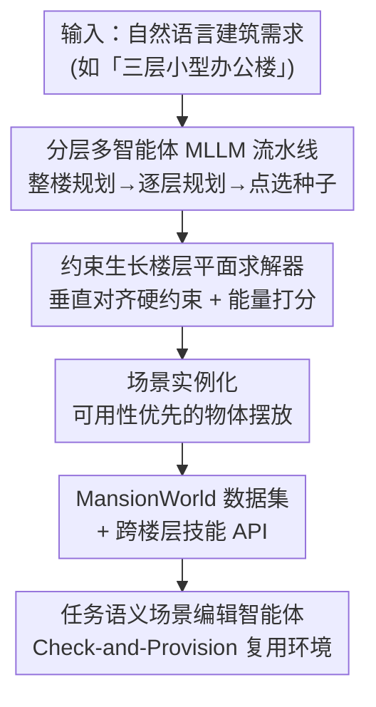

# MANSION: Multi-floor Language-to-3D Scene Generation for Long-horizon Tasks

**会议**: CVPR 2026  
**论文**: [CVF Open Access](https://openaccess.thecvf.com/content/CVPR2026/html/Che_MANSION_Multi-floor_lANguage-to-3D_Scene_generatIOn_for_loNg-horizon_tasks_CVPR_2026_paper.html)  
**代码**: 项目主页（Mansion Webpage，论文中给出链接，⚠️ 具体仓库地址以原文为准）  
**领域**: 3D视觉  
**关键词**: 语言驱动场景生成、多楼层建筑、具身智能、楼层平面生成、多智能体

## 一句话总结
MANSION 用「分层多智能体 MLLM + 几何约束生长求解器」把一句自然语言变成可在仿真器里直接跑的整栋多层建筑，并把垂直对齐当成硬约束，配套发布了 1000+ 栋楼的 MansionWorld 数据集与跨楼层任务编辑智能体，专门用来压测具身智能体的长程跨楼层规划能力。

## 研究背景与动机

**领域现状**：具身智能要让机器人在真实世界里自主完成长程任务（办公楼送件、医院运送、家务），这些任务天然是「建筑尺度 + 跨楼层」的，需要导航、操作之外的长程空间规划与记忆能力。但现有具身 benchmark 几乎都局限在单层室内/公寓尺度。

**现有痛点**：能用的场景资源严重不足。真实扫描数据保真度高但采集贵、难以二次编辑改造；合成环境（程序化生成或 LLM 驱动）大多只生成单层房间或公寓级布局，**很少显式建模垂直结构、楼层间通道，以及电梯、楼梯这类换乘设施**。楼层平面生成方法同样几乎全是单层的，既不对齐相邻楼层的外轮廓，也不保证楼梯井/电梯井这些垂直核在各层位置一致，输出还往往是静态矢量图、缺少能直接进仿真的可执行语义。

**核心矛盾**：单层楼层平面生成器扩不到多层建筑有两个根因——其一缺乏**垂直一致性**（无法跨层对齐轮廓与垂直核），其二数据驱动的本质把它们锁死在「封闭世界」的住宅数据集上，泛化不到分布外的建筑类型（医院、学校、商超）。

**本文目标**：造一个语言驱动、能生成整栋多层建筑、且生成结果可直接用于跨楼层长程任务评测的框架。

**切入角度**：不让 MLLM 直接回归完整房间多边形（当前 MLLM 还做不好），而是先把高层语义分解成 MLLM 擅长的中间表示（功能分区、气泡图、点选种子），再交给一个可验证的几何求解器在约束下搜索。

**核心 idea**：把「垂直对齐」提升为一等公民的硬约束，用「MLLM 管语义 + 几何求解器管几何」的解耦架构，实现真正开放世界、无需重训的整栋建筑生成。

## 方法详解

### 整体框架
MANSION 是一个分层的多智能体框架，把自然语言指定的建筑需求逐级转化为可交互的多层 3D 场景。整条流水线的关键桥梁是「楼层平面生成」——作者先把它形式化成一个可验证的约束搜索问题，再做场景实例化。生成之上还挂着 MansionWorld 生态：1000+ 栋楼的数据集、跨楼层技能 API，以及一个任务语义场景编辑智能体，把静态建筑变成可复用的任务游乐场。

形式化上，每层外轮廓是正交多边形 $P_f$，$V$ 是垂直结构集合（楼梯、电梯、井道），$Q_{f,v}\subseteq P_f$ 是垂直核 $v$ 在第 $f$ 层的占地，房间只在自由区域 $\Omega_f = P_f \setminus \bigcup_{v\in V} Q_{f,v}$ 里规划。楼层平面合成被写成在候选集上的可验证搜索：$L^\star = \arg\max_{L\in C} \mathrm{Score}(L; w)$，约束为拓扑一致 $\mathrm{Topo}(L,G)=\text{true}$，其中 $G=(R,E)$ 是气泡图（节点是房间、边是邻接/连通关系），$C$ 是由采样和约束生长产生的离散候选集，$\mathrm{Score}$ 是给可行候选打分的能量函数。

### 关键设计

**1. 分层多智能体 MLLM 流水线：把语义和几何彻底解耦**

针对「MLLM 直接回归房间多边形做不准」这个痛点，MANSION 由 LangGraph 编排一个多 MLLM 子系统，逐级拆解语义。先由一个建筑级规划节点从用户描述和建筑外轮廓里定下跨楼层功能分区、目标面积分配和全局风格偏好，保证整栋楼语义与视觉一致；这些全局约束再下发给各层的楼层规划节点，每层在自由区域 $\Omega_f$ 上生成气泡图 $G_f=(R_f, E_f)$，指定房间集合、目标面积 $a_r$ 以及与垂直核和其他房间的邻接关系。几何求解前，每个 $\Omega_f$ 被栅格化成 2D 网格，交给专门的「切割 MLLM」节点，为每个目标房间给出初始生长种子 $c_r\in\Omega_f$ 作为粗空间引导。关键在于**分层切割策略**：为避免一次性决定所有房间位置的组合爆炸，切割 MLLM 从气泡图里的交通枢纽节点出发，每步只从当前拓扑前沿里选一个合法子房间、给出它在父区域内的局部种子。这样把语义理解、空间点选全部委托给 LLM，几何求解器只管解几何——实验也验证：随着 LLM 点选能力变强（Gemini-2.5-Pro vs Moonshot），整体布局质量随之提升。

**2. 约束生长楼层平面求解器：把垂直对齐当成可证明的硬约束**

这是 MANSION 区别于所有单层方法的核心。求解器拿到种子和目标面积作为先验，用一个**单切求解器**（topology-aware 的 Lopes 式约束生长变体）在父区域内做局部分割：生成局部候选分区、滤掉违反已实现拓扑关系的候选、用可解释能量函数给剩余候选排序、接受得分最高的分区，沿拓扑前沿迭代直到当前层所有房间节点都被切分完。因为房间只在 $\Omega_f = P_f\setminus\bigcup_v Q_{f,v}$ 里生长，垂直核 $Q_{f,v}$ 的占地在各层被预留并对齐，整栋楼的楼梯井/电梯井天然跨层贯通、保证可证明的可达性。这与 ChatHouseDiffusion 那类把布局直接交给扩散模型/LLM 回归的做法形成对照——后者拓扑上是「平」的，扩不到跨楼层。消融显示，把迭代切割换成「一次性输出所有房间种子坐标」会让 micro-IoU 显著下降：MLLM 给的面积先验相对稳定，但一次性预测所有初始种子位置的点选误差很大，迭代切割正是用来降低复杂度、提升空间定位精度。

**3. 场景实例化：从「数量优先」转向「可用性与质量优先」**

约束生长拿到每层房间分割后，要实例化成可交互的 AI2-THOR 场景（建筑元素、门、物体）。实例化采用两级渐进规划：建筑级「总设计师」节点一开始就定下全局视觉风格（材质色板、配色）保证跨层一致；随后各层规划节点给每个房间节点附一张 room card（材质偏好、开放类型、细粒度功能需求），下游的材质分配、开门、物体摆放节点在已满足的拓扑约束下落地这些 card。物体摆放沿用 HOLODECK 的「LLM+规则」范式但把哲学从数量优先改成可用性/质量优先：把**硬可达性**当不可协商约束（只保留机器人能导航到、周边留够间隙的物体）；引入**锚点分组**（锚物体带 edge/middle 全局空间标签，组内其余成员在锚的局部坐标系下求解）防止大房间里物体扎堆；加 matrix、paired 两个结构化关系原语支持网格阵列和对称共置（教室、图书馆、开放办公的桌椅书架）；最后用优先级感知的摆放顺序 + 质量优先剪枝（贴墙和结构化物体先放，违反可达性或低于质量阈值的候选直接丢弃，而非软约束松弛保留）。

**4. 任务语义场景编辑智能体：让一栋楼复用成无数个任务**

静态多层建筑生成出来后，核心挑战是让它能高效支撑多样的具身任务——为每个任务单独生成新环境既低效，又会把任务需求硬编码进设计、过度约束布局。MANSION 提出一个由 MLLM 控制器驱动的编辑智能体，理解高层自然语言指令、通过一系列受控工具调用修改场景以满足任务前置条件。它不让 MLLM 直接编辑原始场景数据，而是给一组小而表达力强的 AI2-THOR 工具 API（查询场景结构、取资产、操作物体与容器）。面对如「智能体从一楼大堂出发，到二楼桌上拿零食、二楼冰箱拿冷饮，送到一楼沙发」这样的复杂跨楼层指令，智能体不直接执行，而是先把任务分解成必要前置条件，发起一个「检查-供给」（Check-and-Provision）工作流：路径连通性检查 → 物体可用性检查 → 物体供给与场景编辑。通过这种「想-验-做」循环，原本因缺物体而不可执行的任务被补成可执行，且这些编辑可持久化、支持创建复用多个任务变体，把建筑数据集变成研究长程组合具身智能体的任务语义游乐场。

### 损失函数 / 训练策略
MANSION 不做端到端训练，核心是「无训练」的生成流水线：MLLM 部分直接调用现成模型（Moonshot、Gemini-2.5-Pro），约束生长求解器用可解释能量函数 $\mathrm{Score}(L;w)$ 在候选集上排序，整套架构因此实现无需新数据或重训的开放世界可扩展性。

## 实验关键数据

### 主实验

楼层平面生成在 T2D 数据集上以像素级 micro-IoU（全像素总体 IoU）和 macro-IoU（按房间类别平均的 IoU）评测。MA（manual annotation）设置下直接用真值房间质心做种子、真值面积做输入，以隔离 LLM 的影响。

| 数据集 | 方法 | Micro-IoU | Macro-IoU |
|--------|------|-----------|-----------|
| T2D | CHD (MA) | 82.81 | 79.04 |
| T2D | Ours (MA) | 81.67 | **80.66** |
| T2D | CHD (gemini-2.5-pro) | 76.34 | 72.24 |
| T2D | Ours (gemini-2.5-pro) | 69.98 | 66.40 |
| ResPlan-1K | CHD (MA) | 33.49 | 25.39 |
| ResPlan-1K | Ours (MA) | **76.74** | **76.64** |
| ResPlan-1K | Ours (gemini-2.5-pro) | 63.56 | 61.65 |

在住宅风格的 T2D 上，Ours-MA 与 CHD-MA 在同 MA 设置下表现相当，证明约束生长算法能拟合住宅环境里复杂的房间布局；端到端时弱 LLM（Moonshot）下落后 CHD，但换强 LLM（Gemini-2.5-Pro）差距大幅收窄，印证「LLM 点选能力越强、种子与面积先验越好」的设计直觉。在房间数更多、结构更复杂的 ResPlan-1K 上（近 50% 楼层超过 8 个房间，而 CHD 训练上限是 8 房间），CHD 零样本泛化崩盘（micro-IoU 仅 33.49），MANSION 仍达 76.74，体现约束生长在复杂场景下的鲁棒拟合力。

### 消融实验

物体摆放对比（节选两类房间，#Rch 为可达性%，越高越好；#CN 为碰撞对数，越低越好）：

| 房间 | 方法 | #Obj↑ | #CN↓ | #Rch↑ | Layout↑ |
|------|------|-------|------|-------|---------|
| Bedroom | Holodeck | 17.5 | 0.0 | 88.7 | 39.2 |
| Bedroom | Ours | 22.6 | 0.0 | **100.0** | **52.9** |
| Classroom | Holodeck | 64.4 | 0.0 | 80.0 | 5.9 |
| Classroom | Ours | 57.3 | 0.0 | **100.0** | **80.4** |

MANSION 在所有房型都达到 100% 可达性，碰撞为 0，并在非住宅环境（教室、图书馆、办公）的布局质量与真实感上优势尤其明显（52 人用户研究）。

### 关键发现
- **迭代切割是几何求解器的命门**：换成一次性输出所有种子坐标，micro-IoU 显著下降——MLLM 的面积先验稳但一次性点选误差大，分层切割降低了任务复杂度。
- **方法质量随底座 LLM 同步提升**：因为语义理解和空间点选完全外包给 LLM，几何求解器只解几何，所以 LLM 越强、布局越准，这是解耦架构的直接红利。
- **数据集泛化**：CHD 在 T2D 强但 ResPlan-1K 崩，作者归因于 RPLAN 数据存在大量近重复样本限制了多样性；MANSION 不依赖训练分布因而泛化更稳。
- **教室略逊于人感的多样性**：用户研究里 MANSION 在教室的物体数量与多样性上略低，作者认为是大量相同桌椅的规则阵列提高了结构规整性与可达性、却降低了感知多样性。

## 亮点与洞察
- **把垂直对齐做成硬约束**是这篇最关键的「啊哈」点：单层方法不是不能堆楼层，而是没人保证楼梯井/电梯井跨层贯通，MANSION 用 $\Omega_f = P_f\setminus\bigcup_v Q_{f,v}$ 预留并对齐垂直核，直接换来可证明的跨楼层可达性。
- **「MLLM 管语义、求解器管几何」的解耦**很可迁移：凡是「LLM 擅长高层语义但回归精确几何不行」的任务，都可以学这套「LLM 给中间表示（气泡图+点选种子）→ 可验证求解器在约束下搜索」的范式。
- **把「生成」和「编辑/复用」分开**是省成本的好思路：用 Check-and-Provision 智能体对预生成的稳定建筑做最小任务导向编辑，而非每个任务重生成整栋楼，把数据集变成可复用的任务游乐场。
- 物体摆放从「数量优先」转「可用性优先」、把硬可达性当不可协商约束，直接服务于具身任务的可执行性，而不只是好看。

## 局限与展望
- 物体摆放目前是**一次性求解器**，没有 SceneWeaver 那种基于反思的迭代优化，作者明确说不直接和 SceneWeaver 比，定位为未来迭代细化的基础。
- 端到端时方法强依赖底座 LLM 的空间点选能力，弱 LLM（Moonshot）下明显落后 CHD，意味着对闭源强模型有依赖。
- 楼层平面评测用「多边形转栅格 mask」管线而非 T2D 官方接口，作者称量化误差可忽略，但严格意义上与原定义有有限分辨率差异（⚠️ 以原文 caveat 为准）。
- 教室等高密度规则阵列场景下感知多样性偏低，提示规整性与多样性之间仍有 trade-off 待调。

## 相关工作与启发
- **vs ChatHouseDiffusion (CHD)**：CHD 用扩散模型直接回归布局，在住宅 T2D 上强，但训练分布受限（≤8 房间、RPLAN 近重复多），零样本泛化到 ResPlan-1K 崩盘；MANSION 把几何交给无训练的约束生长求解器，泛化更稳，且天生支持跨楼层与开放词汇房型。
- **vs Holodeck / LayoutGPT**：都是 LLM 驱动的开放词汇单层场景合成，MANSION 沿用 HOLODECK 的 LLM+规则摆放范式但改成可用性/质量优先，并把范围从单层扩到整栋多层建筑、显式建模垂直结构。
- **vs ProcTHOR 等程序化生成**：程序化方法可扩展但语义弱、难按需定制；MANSION 用语言驱动 + 任务语义编辑智能体兼顾可扩展性与语义可控。

## 评分
- 新颖性: ⭐⭐⭐⭐⭐ 首个语言驱动的整栋多层建筑生成框架，把垂直对齐做成一等硬约束，填补了具身 benchmark 的跨楼层空白。
- 实验充分度: ⭐⭐⭐⭐ 楼层平面+物体摆放+具身算法三层评测，含跨数据集泛化和用户研究，但物体摆放只是一次性求解器、未与最强迭代基线直接比。
- 写作质量: ⭐⭐⭐⭐ 形式化清晰、动机与设计对应紧密，图示完整；部分实现细节放在附录。
- 价值: ⭐⭐⭐⭐⭐ MansionWorld（1000+ 栋楼、10000+ 房间）+ 跨楼层 API + 任务编辑智能体，是长程跨楼层具身研究稀缺的可执行测试床。

<!-- RELATED:START -->

## 相关论文

- [\[CVPR 2026\] PerpetualWonder: Long-horizon Action-conditioned 4D Scene Generation](perpetualwonder_long-horizon_action-conditioned_4d_scene_generation.md)
- [\[CVPR 2026\] SAGE: Scalable Agentic 3D Scene Generation for Embodied AI](sage_scalable_agentic_3d_scene_generation_for_embodied_ai.md)
- [\[CVPR 2026\] Fast SceneScript: Fast and Accurate Language-Based 3D Scene Understanding via Multi-Token Prediction](fast_scenescript_fast_and_accurate_language-based_3d_scene_understanding_via_mul.md)
- [\[CVPR 2026\] Long-SCOPE: Fully Sparse Long-Range Cooperative 3D Perception](long_scope_fully_sparse_long_range_cooperative_3d_perception.md)
- [\[CVPR 2026\] WonderZoom: Multi-Scale 3D World Generation](wonderzoom_multi-scale_3d_world_generation.md)

<!-- RELATED:END -->
