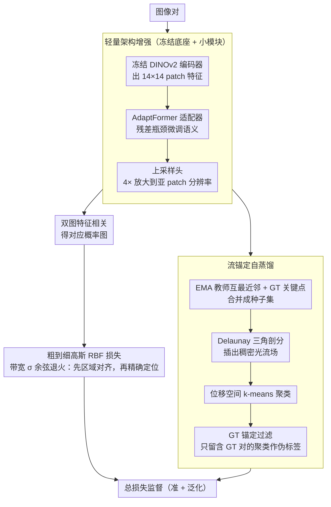

# MARCO: Navigating the Unseen Space of Semantic Correspondence

**会议**: CVPR 2026  
**arXiv**: [2604.18267](https://arxiv.org/abs/2604.18267)  
**代码**: [https://visinf.github.io/MARCO](https://visinf.github.io/MARCO)  
**领域**: 3D视觉  
**关键词**: 语义对应, DINOv2, 自蒸馏, 粗到细, 泛化性

## 一句话总结

提出 MARCO，基于单一 DINOv2 backbone 的语义对应模型，通过粗到细高斯 RBF 损失逐步提升空间精度，并用自蒸馏框架将稀疏关键点监督扩展为稠密伪对应标签，在标准基准和未见关键点/类别上均达到 SOTA，同时比双编码器方法小 3 倍、快 10 倍。

## 研究背景与动机

**领域现状**：语义对应旨在建立语义等价区域之间的像素级匹配。近期主流方法采用双编码器架构——结合 DINOv2（提供鲁棒语义对齐）和 Stable Diffusion（提供丰富空间细节），如 Geo-SC、SD+DINO 等。这些方法在基准测试上表现出色但参数量接近 10 亿。

**现有痛点**：(1) 双编码器方案计算量大，需要从两个编码器提取特征；(2) 更关键的是，用稀疏关键点训练的模型在测试时对未见关键点和未见类别泛化能力差，实际应用中查询点很少与训练时标注的点重合。这暴露了基准性能与实际可用性之间的鸿沟。

**核心矛盾**：稀疏关键点监督使模型过拟合到标注位置附近——微调后的 DINOv2 在标注关键点周围精度提高，但原本跨整个物体表面的部分一致性反而被破坏（表示坍缩到关键点附近）。

**本文目标**：(1) 在标准基准上提升精度，尤其是细粒度定位阈值；(2) 大幅增强对未见关键点和未见类别的泛化能力；(3) 保持单 backbone 的效率优势。

**切入角度**：冻结 DINOv2 编码器虽然空间一致性有限，但其特征空间中已包含稀疏但可靠的对应线索。可以利用这些线索在训练过程中自动发现和传播稠密对应关系，将监督从少量关键点扩展到整个物体表面。

**核心 idea**：用"由粗到细"的监督目标提升空间精度，同时用"自蒸馏+流锚定"将稀疏关键点扩展为覆盖物体表面的稠密伪标签，让特征在整个物体上保持平滑而非仅在关键点附近收缩。

## 方法详解

### 整体框架

MARCO 想在不引入第二个编码器的前提下，同时把语义对应做得更准、又对没见过的关键点和类别更鲁棒。它把一个**冻结的 DINOv2 编码器**当作语义底座，只在上面挂两个轻量组件：一个插在高层 Transformer 块里的瓶颈适配器（AdaptFormer，参数开销 <5%），和一个把 patch 级特征放大 4× 的紧凑上采样头。一张图进来后，DINOv2 出 14×14 的 patch 特征，适配器微调语义、上采样头补回空间分辨率，两张图的特征做相关就得到对应概率图。

真正撑起效果的是两条互补的训练目标。一条是**粗到细的监督损失**，负责把定位从区域级一路收紧到亚 patch 级；另一条是**流锚定的自蒸馏损失**，负责把训练时只有的几十个稀疏关键点，自动扩展成覆盖整个物体表面的稠密伪对应。前者管"准"，后者管"泛化"，下面分别讲。

### 关键设计

**1. 粗到细高斯 RBF 损失：先把区域对齐，再逼精确定位**

直接拿很窄的高斯核去监督，模型只会在少数高置信点上很准、整体准确率反而垮；用很宽的核又只能做到粗对齐。MARCO 的做法是让监督目标的"宽度"随训练动态收缩：预测概率图要去匹配一个以 GT 关键点为中心的高斯 RBF 核，核的带宽 $\sigma$ 按余弦退火从大到小变化

$$\sigma(t) = \sigma_{min} + \tfrac{1}{2}(\sigma_{max} - \sigma_{min})\,(1 + \cos(\pi t/T))$$

训练初期 $\sigma$ 大、核宽，损失只要求预测落在 GT 附近的区域里，先建立稳定的区域级对齐；随着 $t$ 增大 $\sigma$ 收窄，损失开始惩罚哪怕几个像素的偏差，逼模型做亚 patch 级精确定位。这样等于把"先粗后细"这件本来要靠多阶段训练做的事，压进一条退火曲线里，既不会一上来就坍缩到个别点、又能最终收得很紧——这也是它在最严格的 PCK@0.01 阈值上优势最大的直接原因。

**2. 流锚定自蒸馏：用 GT 关键点当锚点，把稀疏监督滚成稠密伪标签**

稀疏关键点监督有个隐患：微调让关键点附近变准，却破坏了 DINOv2 原本跨整个物体表面的部分一致性，表示坍缩到标注点周围，一到未见关键点就失灵。要治这个病，就得让监督覆盖整个表面，但直接拿 DINOv2 特征做稠密匹配又会被对称性、遮挡灌进大量错配。MARCO 的解法是让发现的稠密对应必须**和已知的 GT 关键点"流向一致"才被采信**，分四步：先从 EMA 教师特征里取互最近邻匹配 $\mathcal{P}_{MNN}$，和 GT 关键点合并成种子集；对种子的源端点做 Delaunay 三角剖分，在配对的三角形之间建分段仿射变换，插出一张覆盖物体的稠密光流场 $\mathbf{D}(\mathbf{u})$；再在位移空间里做 k-means 聚类（k 用 BIC 自动定），把运动方向一致的区域归到一起；最后**只保留那些包含 GT 关键点对的聚类**作为可靠伪标签。GT 关键点在这里就是"锚"——一个聚类的整体流向只有和某个 GT 对应吻合，才被认为是真对应而非对称误配，伪标签因此既稠密又干净。

**3. 轻量架构增强：冻结底座，只训适配器与上采样头**

为了不靠堆参数也能拿到细节，MARCO 把 backbone 整个冻住，只训两个小模块。AdaptFormer 在高层 Transformer 块里以残差方式插入瓶颈适配器（降维矩阵 $\mathbf{W}_{down} \in \mathbb{R}^{D \times d}$，$d \ll D$），用极少参数微调语义而不动预训练权重；上采样头则用 2× 转置卷积 + GELU + 3×3 深度卷积串成 4× 放大，把 14×14 的 patch 特征抬到亚 patch 分辨率，给精确定位提供足够的空间粒度。冻结底座既留住了 DINOv2 的泛化能力，又避开了全量微调过拟合到标注点的风险——这正好和前两条损失互补：损失负责"该往哪学"，架构负责"别把底座学坏"。

### 一个完整示例

以一对猫的图片为例，走一遍流锚定自蒸馏。训练标注里这对图只给了少量稀疏关键点（如眼、耳、爪）。第一步，从 EMA 教师特征里取互最近邻，会额外冒出一批分布在脸、躯干、尾巴上的候选匹配，和 GT 关键点合并成种子集——此时种子已不止标注点，但里面混着对称误配（比如左眼匹配到右眼）。第二步，对源图种子点做 Delaunay 三角剖分并在三角形间插值，得到一张覆盖整只猫的稠密光流。第三步，在位移空间聚类，自然会分出"头部一团朝某方向、躯干一团朝另一方向"等几个一致运动区域。第四步是关键过滤：只有**整体流向和某个 GT 关键点对吻合**的聚类才留下——左眼匹右眼那种对称错配，因为流向和真正的眼睛 GT 对不上，整团被丢弃。最终留下的稠密伪对应既铺满了物体表面、又过滤掉了对称噪声，下一轮就用它来监督整张特征图，把一致性从关键点附近撑回到整个物体。

### 损失函数 / 训练策略

总损失 $\mathcal{L} = \mathcal{L}_{sup} + \mathcal{L}_{self}$。监督损失 $\mathcal{L}_{sup}$ 用交叉熵配上面的高斯 RBF 退火；自蒸馏损失 $\mathcal{L}_{self}$ 对稠密伪标签做 L2 回归（相比 CE 对噪声伪标签更鲁棒）。教师网络是学生的 EMA，随训练缓慢更新，保证伪标签来源稳定不抖。

## 实验关键数据

### 主实验

| 数据集 | 阈值 | MARCO | Geo-SC(之前SOTA) | 提升 |
|--------|------|-------|----------------|------|
| SPair-71k | PCK@0.10 | **最优** | 次优 | +4.0 |
| SPair-71k | PCK@0.01 | **最优** | 次优 | **+8.9** |
| AP-10K (Intra) | PCK@0.10 | **最优** | 次优 | +2.9 |
| PF-PASCAL | PCK@0.10 | **最优** | 次优 | 提升 |

### 泛化性实验

| 设定 | MARCO | Jamais Vu(之前最佳) | 提升 |
|------|-------|-------------------|------|
| SPair-U (未见关键点) | **最优** | 次优 | **+5.1** |
| MP-100 (未见类别) | **最优** | 次优 | **+5.6** |

### 消融实验

| 配置 | SPair PCK@0.10 | SPair-U | 说明 |
|------|---------------|---------|------|
| Full MARCO | 最优 | 最优 | 完整方法 |
| w/o 粗到细退火 | 下降 | 下降 | 定位精度受损 |
| w/o 自蒸馏 | 下降 | 显著下降 | 泛化性急剧退化 |
| w/o 上采样头 | 下降 | - | 亚 patch 精度受限 |

### 关键发现

- MARCO 在细粒度阈值 PCK@0.01 上的优势（+8.9）远大于在 PCK@0.10 上的优势（+4.0），说明粗到细策略对精确定位效果显著
- 自蒸馏对泛化性的贡献是决定性的——没有它，微调后的 DINOv2 在未见关键点上甚至不如冻结模型
- 单 backbone 方案在保持 3× 更小、10× 更快的同时超越了双编码器方案，说明关键在于训练策略而非架构规模

## 亮点与洞察

- 流锚定自蒸馏的设计非常精巧：从冻结编码器中挖掘稀疏可靠匹配 → Delaunay 三角剖分稠密化 → 位移聚类 + GT 锚定过滤。每一步都有明确的目的且互相衔接
- "稀疏监督导致表示坍缩"的观察切中要害——微调让关键点附近变好但物体整体变差（图 2 的流可视化非常直观），自蒸馏正好治疗这个病症
- 提出新的泛化性 benchmark（基于 MP-100 的未见关键点/未见类别测试），为该领域提供了更严格的评估标准

## 局限与展望

- 自蒸馏依赖 DINOv2 特征空间中已有的稀疏可靠对应，如果预训练表示本身对某些物体类别缺乏这种结构，方法可能受限
- Delaunay 三角剖分在凸包之外的区域无法产生伪标签
- 不依赖 3D 先验虽然是优点但也限制了对严重形变物体的处理能力
- 改进方向：可结合视频时序一致性提供更多稠密对应信号

## 相关工作与启发

- **vs Geo-SC/双编码器方法**: MARCO 用单 backbone 超越它们，证明精巧的训练策略可以弥补架构简约的"劣势"
- **vs Jamais Vu**: 同样关注未见关键点泛化但依赖 3D 模板，受限于训练类别。MARCO 的自蒸馏不依赖任何类别先验或 3D 信息

## 评分

- 新颖性: ⭐⭐⭐⭐⭐ 流锚定自蒸馏是高度原创的训练范式
- 实验充分度: ⭐⭐⭐⭐⭐ 标准基准+泛化性基准，消融详尽
- 写作质量: ⭐⭐⭐⭐⭐ 问题分析深入，方法推导优雅
- 价值: ⭐⭐⭐⭐⭐ 在精度和泛化性上同时大幅提升，且高效，是对应估计领域的重要进展

<!-- RELATED:START -->

## 相关论文

- [\[ICCV 2025\] Do It Yourself: Learning Semantic Correspondence from Pseudo-Labels](../../ICCV2025/3d_vision/do_it_yourself_learning_semantic_correspondence_from_pseudo-labels.md)
- [\[CVPR 2025\] SemAlign3D: Semantic Correspondence Between RGB-Images Through Aligning 3D Object-Class Representations](../../CVPR2025/3d_vision/semalign3d_semantic_correspondence_between_rgb-images_through_aligning_3d_object.md)
- [\[CVPR 2026\] MimiCAT: Mimic with Correspondence-Aware Cascade-Transformer for Category-Free 3D Pose Transfer](mimicat_mimic_with_correspondence-aware_cascade-transformer_for_category-free_3d.md)
- [\[CVPR 2026\] RayNova: Scale-Temporal Autoregressive World Modeling in Ray Space](raynova_scale-temporal_autoregressive_world_modeling_in_ray_space.md)
- [\[CVPR 2026\] DuoMo: Dual Motion Diffusion for World-Space Human Reconstruction](duomo_dual_motion_diffusion_for_world-space_human_reconstruction.md)

<!-- RELATED:END -->
