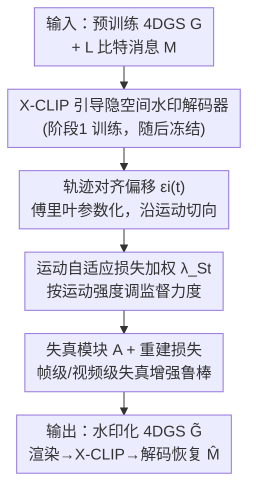

# Mark4D: Temporally-Consistent Watermarking for 4D Gaussian Splatting

**会议**: CVPR 2026  
**论文**: [CVF Open Access](https://openaccess.thecvf.com/content/CVPR2026/html/Lee_Mark4D_Temporally-Consistent_Watermarking_for_4D_Gaussian_Splatting_CVPR_2026_paper.html)  
**代码**: 待确认  
**领域**: 3D视觉  
**关键词**: 4D高斯泼溅、数字水印、时间一致性、隐空间解码、运动自适应

## 一句话总结
Mark4D 是首个针对动态 4D 高斯泼溅（4DGS）的水印方法，用「X-CLIP 视频-文本隐空间解码器 + 沿高斯运动轨迹的偏移 + 运动自适应损失加权」三件套，把不可见、抗失真且时间一致的水印嵌进动态场景，在保真度和比特准确率上同时大幅超过把 3DGS 水印硬搬到 4D 的基线。

## 研究背景与动机

**领域现状**：4DGS 把 3D 高斯泼溅扩展到时间维，用可学习的形变场建模非刚体运动，已成为动态场景实时逼真渲染的主流表示（数字人、动态内容生成、手术场景重建）。当 4DGS 成为合成动态资产的基础表示，确认其真伪与归属就成了关键需求，需要鲁棒、不可见的水印来认证来源。

**现有痛点**：现有 3DGS 水印方法直接微调高斯参数——要么微调全部参数、要么只调一小部分。把它们直接搬到 4D 时都不稳：微调全部参数会导致几何上的**时间不一致**（高斯随时间漂移，水印扰动跟着乱跳）；只调一小部分参数又**容量不足**，嵌不进足够的水印信息。

**核心矛盾**：动态 4DGS 里高斯在相邻帧之间的位移（即运动）随时间剧烈变化——合成数据集（D-NeRF）运动幅度相对受控，真实场景（DyNeRF）则运动分布更宽，既有快速运动也有近乎静止的区间。**对所有帧施加均匀的水印监督并不最优**：静止区间反复监督会过拟合、不必要地破坏视觉保真；高动态区间剧烈形变又会削弱已编码的水印信号。此外像素域解码器在优化时容易扭曲局部图像细节。

**本文目标**：为动态 4DGS 设计一个同时满足鲁棒、不可见、时间一致的水印嵌入方法。

**切入角度**：与其在像素域和静态参数上做文章，不如（1）把解码搬到与像素解耦的视频-文本隐空间，（2）让水印扰动顺着高斯的运动轨迹平滑演化，（3）按运动强度自适应分配监督力度。

**核心 idea**：用「隐空间解码 + 轨迹对齐偏移 + 运动自适应加权」三个互补设计，把水印嵌得既藏得住又跟得上运动。

## 方法详解

### 整体框架
给定预训练 4DGS 模型 $G$，目标是把 $L$ 比特消息 $M\in\{0,1\}^L$ 嵌入其时空表示，得到的水印模型 $\tilde G$ 渲染结果与原模型视觉上无法区分，又能从渲染视频/图像里可靠恢复 $M$。水印化模型只对位置和球谐（SH）系数加偏移：$\tilde G(t)=\{x_i(t)+\varepsilon_i(t),\, h_i(t)+\delta_i(t),\, \alpha_i(t),\, \Sigma_i(t)\}$，不动不透明度 $\alpha$ 和协方差 $\Sigma$（改它们会直接扭曲几何、产生明显伪影）。整个训练分两阶段：先训一个隐空间水印解码器，再冻结它去优化偏移把水印嵌进 4DGS。

### 关键设计

**1. X-CLIP 引导的隐空间水印解码器：在视频-文本隐空间解码而非像素域**

针对「像素域解码器优化时扭曲局部细节」的痛点，Mark4D 把解码器训练在与像素监督解耦的隐特征空间。它借鉴 GuardSplat 在静态 3D 上用 CLIP 引导解码器的图像-文本隐空间思路，扩展到 X-CLIP 的**视频-文本隐空间**，从而能在动态 4D 场景里稳定嵌入、可靠地从渲染视频解码。具体地，把二进制消息表示成 X-CLIP 能处理的文本 token：定义一个比特到 token 的映射 $\Phi(\cdot,\cdot)$，给每个比特位分配两个不同的词表 token（分别对应 0 和 1），映射表训练开始时随机初始化一次后固定，得到 token 序列 $W=\{w_{start}\}\cup(\bigcup_{i=1}^L \Phi(m_i,i))\cup\{w_{end}\}$。阶段一把 $W$ 喂进冻结的 X-CLIP 文本编码器 $\mathcal{E}_W$ 得到文本嵌入，再由可训练的 MLP 解码器 $\mathcal{D}_M$ 重建消息：$\hat M=\mathcal{D}_M(\mathcal{E}_W(W))$，用二元交叉熵 $\mathcal{L}_{msg}$ 优化。阶段二冻结 $\mathcal{D}_M$，让渲染序列经冻结的 X-CLIP 视频编码器 $\mathcal{E}_V$ 编码后被解码为目标消息：$\hat M=\mathcal{D}_M(\mathcal{E}_V(\hat I_{S_t}))$。隐空间解码让水印对像素级失真和压缩伪影不敏感，是后面鲁棒性大幅领先的主因。

**2. 轨迹对齐偏移：让位置扰动顺着高斯运动轨迹走**

4DGS 里每个高斯沿形变场随时间平滑移动，这条天然轨迹正好可以拿来嵌水印而不破坏几何。但**任意方向的位置偏移会扰乱高斯的自然运动轨迹**，造成轨迹剧烈偏移和时间不稳定。为此 Mark4D 把 $\varepsilon_i(t)$ 的方向约束到高斯轨迹的局部运动切向：用相邻帧位置的有限差分近似切向 $d_i(t)=\frac{x_i(t+\Delta t)-x_i(t-\Delta t)}{\|x_i(t+\Delta t)-x_i(t-\Delta t)\|_2}$，再用轨迹对齐损失 $\mathcal{L}_{align}$ 最小化 $\varepsilon_i(\tau)$ 与 $d_i(\tau)$ 的余弦距离，鼓励偏移沿运动轨迹一致演化、防止时间与几何上的不连续。此外，逐帧独立优化偏移参数低效且时间上不稳，作者借鉴「把运动建模为周期信号」的思路，把 $\varepsilon_i(t)$ 用傅里叶级数参数化：$\varepsilon_i(t)=\sum_{k=1}^K (a_{i,k}\sin(2\pi kt)+b_{i,k}\cos(2\pi kt))$，其中 $a_{i,k},b_{i,k}\in\mathbb{R}^3$ 可学习、$K$ 是频率分量数（实验取 3），既让偏移沿整条轨迹平滑连续，又压缩了参数量。

**3. 运动自适应损失加权：按运动强度分配监督力度**

针对「均匀监督对动态 4D 不最优」的矛盾，Mark4D 按时间窗的运动强度调节水印监督。先量化每个时间窗 $S_t$ 内的整体运动 $\Delta_{S_t}=\frac{1}{N_G T}\sum_{\tau\in S_t}\sum_i \|x_i(\tau+\Delta t)-x_i(\tau)\|_2$，再在整段时间范围内归一化得到运动系数 $\beta_{S_t}=\frac{\Delta_{S_t}-\Delta_{min}}{\Delta_{max}-\Delta_{min}}\in[0,1]$，最后线性插值得到该窗的消息损失权重 $\lambda_{S_t}=(1-\beta_{S_t})\lambda_{min}+\beta_{S_t}\lambda_{max}$（实验中 $\lambda_{min}=0.5,\lambda_{max}=1$）。于是运动大的时间窗获得更强监督以保证水印鲁棒嵌入，静止区间获得更小权重以保留高视觉保真——正好对症静止过拟合、高动态信号被削弱这两个问题。

### 损失函数 / 训练策略
为抗真实失真，解码前对渲染序列加一个可微失真模块 $A$：$\hat M=\mathcal{D}_M(\mathcal{E}_V(A(\hat I_{S_t})))$。$A$ 含帧级失真（裁剪、缩放、旋转、高斯噪声、JPEG 压缩、亮度抖动）和视频级失真（H.264 压缩、随机换帧），训练时随机组合施加，逼水印学会在真实失真下仍可解码。保真度用重建损失 $\mathcal{L}_{recon}=\frac1T\sum_{\tau\in S_t}(L_1(\hat I_\tau,I_\tau)+L_{lpips}(\hat I_\tau,I_\tau))$（L1 + LPIPS）。总目标为 $\mathcal{L}_{total}=\lambda_{S_t}\mathcal{L}_{msg}+\lambda_{recon}\mathcal{L}_{recon}+\lambda_{align}\mathcal{L}_{align}$，其中 $\lambda_{recon}=\lambda_{align}=1$。X-CLIP 解码器是 3 层 MLP（ViT-B-32，隐空间 512 维），4DGS 微调 4000 步，$\varepsilon_i(t)$ 傅里叶系数学习率 $1.6\times10^{-4}$、$\delta_i(t)$ 为 $1\times10^{-3}$。

## 实验关键数据

在 D-NeRF（8 个合成场景）和 DyNeRF（6 个真实多视角场景）上评测，三维度：容量（比特准确率随 $L\in\{32,48,64\}$）、不可见性（PSNR/SSIM/LPIPS）、鲁棒性（各类失真下的比特准确率）。

### 主实验

主结果（D-NeRF 与 DyNeRF 平均，节选关键基线）：

| 配置 | 方法 | Bit Acc(%)↑ | PSNR↑ | SSIM↑ | LPIPS↓ |
|------|------|-------------|-------|-------|--------|
| 32 bits | GuardSplat | 88.33 | 38.69 | 0.9934 | 0.0082 |
| 32 bits | 3D-GSW | 90.46 | 31.98 | 0.9651 | 0.0321 |
| 32 bits | **Ours** | **96.34** | **42.32** | **0.9960** | **0.0018** |
| 64 bits | 3D-GSW | 83.36 | 30.87 | 0.9504 | 0.0512 |
| 64 bits | VideoSeal | 77.98 | 36.16 | 0.9810 | 0.0211 |
| 64 bits | **Ours** | **92.71** | **41.27** | **0.9954** | **0.0022** |

64 比特下 Mark4D 比 3D-GSW、VideoSeal 在比特准确率上分别高 9.35、14.79 个百分点，PSNR 高 10.40、5.11 dB；且 $L$ 从 32 升到 64 时本文比特准确率只掉 3.63 个百分点，而 3D-GSW、VideoSeal 各掉 7.10、10.23 个百分点，说明高容量下仍稳。

鲁棒性（$L=32$，各类失真下比特准确率%，节选）：

| 方法 | None | Noise(σ=0.1) | Rotation | Crop(40%) | JPEG | H.264 | 删 20% 高斯 |
|------|------|--------------|----------|-----------|------|-------|-------------|
| GuardSplat | 88.33 | 86.29 | 83.46 | 85.57 | 82.98 | – | 81.54 |
| 3D-GSW | 90.46 | 81.54 | 80.46 | 83.21 | 81.59 | – | 79.77 |
| **Ours** | **96.34** | **95.10** | **91.83** | **92.80** | **91.50** | **90.28** | **90.28** |

各类失真下 Mark4D 都保持 90% 以上比特准确率，最大仅降 6.06 个百分点；3D-GSW 无失真时超 90% 但失真后骤降 10.69 个百分点。鲁棒性主要来自隐空间解码，使水印对像素级失真和压缩伪影不敏感。

### 消融实验

偏移类型与损失项消融（D-NeRF/DyNeRF 平均，$L=48$）：

| $\varepsilon_i(t)$ | $\delta_i(t)$ | $\mathcal{L}_{align}$ | $\lambda_{S_t}$ | Bit Acc(%)↑ | PSNR↑ |
|:---:|:---:|:---:|:---:|------|------|
| ✓ | × | × | × | 79.55 | 30.96 |
| × | ✓ | × | × | 88.37 | 37.82 |
| ✓ | ✓ | × | × | 91.27 | 33.94 |
| ✓ | ✓ | ✓ | × | 92.94 | 39.88 |
| ✓ | ✓ | ✓ | ✓ | **95.02** | **41.45** |

### 关键发现
- **只用位置偏移 $\varepsilon_i(t)$ 最差**（Bit Acc 79.55 / PSNR 30.96）：空间几何被直接扰动；只用 SH 偏移 $\delta_i(t)$ 保真好但容量受限。两者同用比特准确率升但 PSNR 反而掉（无约束位置更新放大几何失真），加入 $\mathcal{L}_{align}$ 通过维持运动轨迹一致同时改善保真与准确率。
- **运动自适应加权 $\lambda_{S_t}$ 在运动更复杂的数据集上收益更大**：DyNeRF（运动分布更宽更不规则）上比 D-NeRF 提升明显更多，印证它对运动幅度多样的真实 4D 场景特别有效。
- **隐空间解码是鲁棒性的根**：把解码搬离像素域，使水印对压缩/噪声等失真天然不敏感。
- 定性上 3D-GSW 重建不出细几何、有抖动伪影，VideoSeal 整帧有可见污渍并丢高频细节，Mark4D 残差最小、时间连贯。

## 亮点与洞察
- **「沿运动轨迹嵌水印」是最巧的一招**：动态场景的高斯漂移通常被视为水印的敌人，本文反过来把这条轨迹当成天然载体，用切向约束 + 傅里叶参数化让扰动平滑跟随运动，既藏得住又不破坏几何——这个「把噪声源变成信号载体」的思路可迁移到任何带形变场的动态表示。
- **隐空间解码换鲁棒性**：把解码从像素域抬到 X-CLIP 视频-文本隐空间，一举拿下对 JPEG/H.264/换帧等失真的强鲁棒，且天然支持视频级（多帧）解码。
- **运动自适应加权**把「不同时间窗该用多大监督」这件直觉的事公式化，按运动强度线性插值权重，对症静止过拟合与高动态信号削弱，且实现简单。
- 首次系统定义了 4DGS 水印问题（只动位置和 SH、不动 $\alpha/\Sigma$ 以护几何），为后续动态资产保护立了基线。

## 局限与展望
- 评测只在 D-NeRF、DyNeRF 两个数据集上，场景类型和规模有限，对更大、更复杂的真实动态场景泛化性待验证。
- 与帧级基线公平比较时，本文用「复制首帧成静态视频片段」的方式评帧级，这一协议本身是为对齐而设的近似（⚠️ 细节以原文为准）。
- 依赖 X-CLIP 预训练视频-文本编码器，水印能力与该底座的隐空间质量绑定；换底座或域差大时的表现未充分探讨。
- 偏移傅里叶频率分量 $K=3$、运动加权上下界等超参的敏感性分析放在附录，正文未展开。

## 相关工作与启发
- **vs 3DGS 水印（GaussianMarker / 3D-GSW / GuardSplat）**：它们直接微调高斯参数，搬到 4D 时要么全调致时间不一致、要么少调致容量不足；Mark4D 专为 4D 设计，用轨迹对齐偏移护几何、隐空间解码保鲁棒，比特准确率与保真度全面领先。本文的隐空间解码思路正是从 GuardSplat 的图像-文本隐空间扩展到视频-文本隐空间。
- **vs 视频水印（RivaGAN / VideoSeal）**：把视频水印解码器套到 4DGS 渲染上虽支持视频级解码，但保真和鲁棒都不如本文；VideoSeal 会在帧上留可见污渍、丢高频细节。
- **vs 2D/NeRF 水印（HiDDeN / StegaStamp / NeRF 水印）**：本文延续「联合优化嵌入与解码以求鲁棒」的范式，但首次把它落到动态 4DGS 这一未被探索的资产形态上，填补了 4D 资产保护的空白。

## 评分
- 新颖性: ⭐⭐⭐⭐⭐ 首个 4DGS 水印方法，把动态场景的运动轨迹从「敌人」变成水印载体，三个设计互补且针对性强。
- 实验充分度: ⭐⭐⭐⭐ 容量/不可见/鲁棒三维度 + 多类失真 + 偏移与损失项消融齐全，但只用两个数据集、部分敏感性分析放附录。
- 写作质量: ⭐⭐⭐⭐⭐ 问题形式化清晰，三个设计与痛点一一对应，公式与图示完整。
- 价值: ⭐⭐⭐⭐ 为动态 4D 资产的版权保护立了首个鲁棒基线，应用场景明确（数字人、动态内容、手术重建）。

<!-- RELATED:START -->

## 相关论文

- [\[CVPR 2026\] SparseCam4D: Spatio-Temporally Consistent 4D Reconstruction from Sparse Cameras](sparsecam4d_spatio-temporally_consistent_4d_reconstruction_from_sparse_cameras.md)
- [\[CVPR 2026\] Robust3DGSW: Toward Robust Watermarking for Quantization-Aware 3D Gaussian Splatting](robust3dgsw_toward_robust_watermarking_for_quantization-aware_3d_gaussian_splatt.md)
- [\[CVPR 2026\] ST4R-Splat: Spatio-Temporal Referring Segmentation in 4D Gaussian Splatting](st4r-splat_spatio-temporal_referring_segmentation_in_4d_gaussian_splatting.md)
- [\[CVPR 2026\] Flow4DGS-SLAM: Optical Flow-Guided 4D Gaussian Splatting SLAM](flow4dgs-slam_optical_flow-guided_4d_gaussian_splatting_slam.md)
- [\[CVPR 2026\] 4C4D: 4 Camera 4D Gaussian Splatting](4c4d_4_camera_4d_gaussian_splatting.md)

<!-- RELATED:END -->
