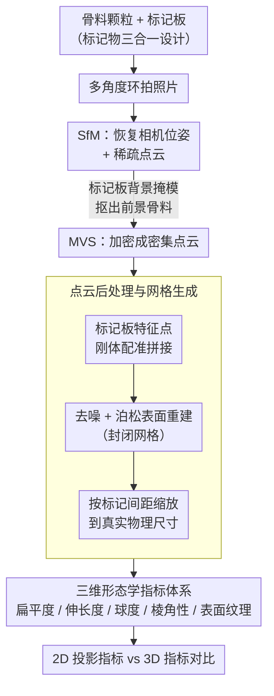

# Marker-Based 3D Reconstruction of Aggregates with a Comparative Analysis of 2D and 3D Morphologies

**会议**: CVPR 2026  
**arXiv**: [2603.12667](https://arxiv.org/abs/2603.12667)  
**作者**: Haohang Huang, Jiayi Luo, Issam Qamhia, Erol Tutumluer, John M. Hart, Andrew J. Stolba
**领域**: 医学图像  
**关键词**: 3D reconstruction, photogrammetry, aggregate morphology, point cloud, marker-based, 2D-3D comparison

## 一句话总结

提出一种基于标记物（marker）的低成本摄影测量方法，实现骨料（aggregate）颗粒的高质量三维重建，并通过 2D 与 3D 形态学指标的系统对比分析，揭示了仅依赖 2D 图像进行骨料形态评估的显著局限性。

## 研究背景与动机

骨料是建筑与交通基础设施中的核心骨架材料，广泛应用于路面基层、铁路道砟、水泥混凝土、沥青混凝土及护岸块石等场景。骨料颗粒的尺寸与形态（morphology）信息对质量保证/质量控制（QA/QC）至关重要，因为形态直接影响骨料在组合与堆积过程中的力学行为。

### 现有方法的局限

- **2D 图像方法**：如 AIMS（Aggregate Imaging System）、E-UIAIA 等，仅分析颗粒轮廓（silhouette），将三维形态简化为二维投影，丢失大量空间信息。扁平度（Flatness）、椭球体特征等三维属性无法从单张投影精确获取
- **3D 扫描方法**：3D 激光扫描仪或 X 射线 CT（Computed Tomography）设备虽可提供完整三维信息，但设备昂贵（数十万美元级）、操作复杂、不适合现场部署
- **核心矛盾**：工业界需要低成本、易部署、能提供完整 3D 形态信息的解决方案，而现有方法要么精度不足（2D），要么成本过高（3D 扫描）

### 研究动机

利用摄影测量（photogrammetry）技术——仅需普通相机从多角度拍摄即可重建 3D 模型——结合标记物设计，解决背景抑制、点云拼接和尺度标定三大关键问题，实现低成本高质量的骨料 3D 重建，并定量揭示 2D 与 3D 形态学差异。

## 方法详解

### 整体框架

这篇论文想解决两件事：用一台普通相机低成本地把骨料颗粒重建成高质量三维模型，再用重建出的 3D 形态去定量证明——只看 2D 投影的传统做法会系统性地偏估颗粒的真实形态。整条管线沿着「拍照→重建→量形态」走：先把骨料颗粒摆在一块印有已知图案的标记板上，绕着它从多角度拍一圈照片；接着用 Structure-from-Motion（SfM）恢复相机位姿和稀疏点云、再用 Multi-View Stereo（MVS）加密成密集点云，期间靠标记板自动把骨料从背景里抠出来；然后用标记板把多视角的局部点云配准拼接、去噪后做泊松表面重建生成封闭网格、并按标记间距缩放到真实物理尺寸；最后从这个带真实尺寸的 3D 网格里读出完整的形态学指标，和同一颗粒的 2D 投影指标摆在一起对比。

### 关键设计

**1. 标记物三合一设计：一套标记板同时解决背景、配准、尺度三个痛点**

摄影测量要落到骨料场景，绕不开三个障碍：背景纹理会干扰前景颗粒的分割、多视角拍出的局部点云难以精确拼到一起、重建结果是无量纲的没有绝对尺寸。本文的巧思是用一块印有已知图案的标记板把这三件事一次性解决。骨料直接放在标记板上，已知图案让算法能自动把前景骨料和背景区分开，省去逐张手工抠图；多视角拍摄得到的多组局部点云，靠标记板上稳定且可重复识别的特征点做刚体配准对齐；而标记之间的物理间距是已知量，正好充当绝对尺度参考，把重建模型缩放回真实物理尺寸。一套标记同时当分割掩模、配准基准和标尺，这是整条低成本管线能跑通的支点。

**2. SfM + MVS 摄影测量重建：从普通相机的多视角照片恢复密集点云**

有了标记板提供的前景掩模，重建本身走的是成熟的摄影测量两段式。用普通数码相机围着骨料样本从多个角度拍摄，先由 SfM 从这组照片里反解出每张照片的相机位姿、同时生成稀疏点云勾出大致几何；再由 MVS 在已知位姿的基础上逐像素匹配、把稀疏点云加密成覆盖表面细节的密集点云。标记板贡献的背景掩模在这一步持续生效，确保最终只保留骨料区域的点、不把标记板和环境带进模型。这一段不依赖任何专用扫描设备，是「低成本」的来源。

**3. 点云后处理与网格生成：把多组点云拼成一个带真实尺寸的封闭网格**

单次拍摄只能看到颗粒的一部分表面，所以要把多个视角的密集点云融成一个完整模型。这里先用标记板提供的对应关系做刚体变换配准，把各组点云对齐到同一坐标系；再去除噪声点和离群点；然后用泊松表面重建（或类似算法）从密集点云生成封闭的三角网格——封闭这一点很关键，因为只有封闭网格才能稳定地算出体积和表面积。最后依据标记间距把整个网格缩放到真实物理尺寸，得到一个可直接量测的颗粒模型。

**4. 三维形态学指标体系：从网格直接读出 2D 投影读不到的形状属性**

重建只是手段，目的是拿到 2D 投影拿不到的完整形态量。从封闭网格上先量出三条主轴——最长轴 $L$、中间轴 $I$、最短轴 $S$，由此定义扁平度 $\text{Flatness}=S/I$ 和伸长度 $\text{Elongation}=I/L$。球度用体积和表面积的比值刻画颗粒接近理想球体的程度：

$$\psi = \frac{\pi^{1/3}(6V)^{2/3}}{A}$$

其中 $V$ 为网格体积、$A$ 为表面积。棱角性基于 3D 曲率分布量化颗粒边缘的尖锐程度，表面纹理则用表面粗糙度指标刻画。这些指标里，体积、表面积、球度本质上是三维属性，2D 投影根本无从精确获取——这正是后面 2D 与 3D 对比要落脚的地方。为做对比，论文同时从颗粒的 2D 投影里算出对应的二维指标。

## 实验关键数据

### 重建精度验证

选取多种类型的骨料样本，将重建结果与真值（ground-truth，通过精密卡尺测量或 CT 扫描获得）对比验证。

| 验证指标 | 重建值 vs 真值误差 | 说明 |
|---|---|---|
| 尺寸精度（长/宽/高） | < 2% 相对误差 | 标记物尺度标定带来高精度 |
| 体积精度 | < 5% 相对误差 | 封闭网格体积与 CT 体积一致性好 |
| 表面积精度 | < 5% 相对误差 | 密集点云确保表面细节捕捉 |
| 球度一致性 | 高度相关（$r > 0.95$） | 3D 形状描述子重建可靠 |

### 2D 与 3D 形态学对比

对同一组骨料样本，分别计算 2D 投影形态学指标与 3D 重建形态学指标，进行统计对比。

| 形态学指标 | 2D 统计值 | 3D 统计值 | 差异显著性 |
|---|---|---|---|
| 扁平度 (Flatness) | 偏高估计 | 真实值 | **显著** ($p < 0.05$) |
| 伸长度 (Elongation) | 存在系统偏差 | 真实值 | **显著** |
| 球度 (Sphericity) | 2D 近似最高偏离 ~15-20% | 精确计算 | **显著** |
| 棱角性 (Angularity) | 投影方向依赖大 | 方向无关 | **显著** |
| 表面纹理 (ST) | 无法准确获取 | 可完整量化 | — |

关键发现：2D 投影方法在所有形态学指标上均与 3D 真实值存在统计显著差异。特别是球度和扁平度的 2D 估计误差最大，因为这些指标本质上依赖三维空间信息。2D 方法对棱角性的估计高度依赖投影方向，同一颗粒不同投影角度可导致 30% 以上的棱角性变化。

## 亮点与洞察

- **低成本 3D 解决方案**：仅需普通数码相机 + 标记板，成本远低于 3D 激光扫描仪（数万美元）或 CT 设备（数十万美元），使 3D 形态分析可在采石场和施工现场普及
- **标记物三合一设计**：一套标记物同时解决背景分割、点云配准、尺度标定三个问题，设计简洁高效
- **2D vs 3D 的定量证据**：首次在骨料领域系统定量证明 2D 形态学指标与 3D 真实值之间的统计显著差异，为行业标准从 2D 向 3D 转型提供数据支撑
- **工程实用性强**：直接面向 QA/QC 流程，可用于骨料检验、数据采集和形态学分析，具有明确的工程应用价值

## 局限性

- **自动化程度有限**：当前方法仍需人工摆放标记物和手动拍摄多视角图像，未实现全自动流水线
- **处理通量较低**：每个骨料样本需要多角度拍摄和重建，处理速度远慢于 2D 图像扫描方法，不适合大批量在线检测
- **遮挡与凹陷区域**：摄影测量方法对深度凹陷或自遮挡严重的区域重建质量下降，可能遗漏部分表面细节
- **环境依赖**：现场光照条件不稳定可能影响特征匹配和重建质量
- **缺少深度学习集成**：方法完全基于传统几何方法，未探索结合深度学习（如 NeRF、3D Gaussian Splatting）可能带来的精度和效率提升
- **样本规模有限**：验证实验选取的骨料样本数量有限，大规模统计结论的代表性有待加强

## 相关工作

- **2D 骨料成像**：AIMS 系统通过三个正交摄像头分析骨料轮廓的扁平度、伸长度和棱角性；E-UIAIA 通过传送带上的 2D 图像实现在线分析。这些方法速度快但丢失三维信息
- **3D 扫描方法**：3D 激光扫描可获得高精度点云但设备昂贵且操作复杂；X-Ray CT 可获得完整内外表面但成本极高且有辐射限制
- **摄影测量**：SfM + MVS 技术在文化遗产、地形测绘等领域已广泛应用，但在骨料领域的系统应用和形态学分析验证较少
- **本文定位**：通过标记物设计弥合摄影测量在骨料场景的关键技术缺口（背景/配准/尺度），并提供首个系统的 2D-3D 形态学对比

## 评分

- 新颖性: ⭐⭐⭐ — 标记物辅助的摄影测量非全新思路，但在骨料领域的系统应用和三合一标记物设计有方法论贡献
- 实验充分度: ⭐⭐⭐ — 有精度验证和 2D-3D 对比，但样本规模有限，缺少与其他 3D 方法的直接对比
- 写作质量: ⭐⭐⭐⭐ — 结构清晰，问题动机表述明确，工程应用价值阐述充分
- 价值: ⭐⭐⭐ — 对骨料工程领域有实际应用价值，但对 CV 社区的方法论贡献相对有限

<!-- RELATED:START -->

## 相关论文

- [\[CVPR 2026\] Fall Risk and Gait Analysis using World-Spaced 3D Human Mesh Recovery](fall_risk_gait_analysis_hmr.md)
- [\[CVPR 2026\] Learning 3D Reconstruction with Priors in Test Time](tco_learning_3d_reconstruction_with_priors_in_test_time.md)
- [\[CVPR 2026\] FF3R: Feedforward Feature 3D Reconstruction from Unconstrained Views](ff3r_feedforward_feature_3d_reconstruction_from_unconstrained_views.md)
- [\[CVPR 2026\] Speed3R: Sparse Feed-forward 3D Reconstruction Models](speed3r_sparse_feed-forward_3d_reconstruction_models.md)
- [\[ECCV 2024\] Analysis-by-Synthesis Transformer for Single-View 3D Reconstruction](../../ECCV2024/3d_vision/analysis-by-synthesis_transformer_for_single-view_3d_reconstruction.md)

<!-- RELATED:END -->
