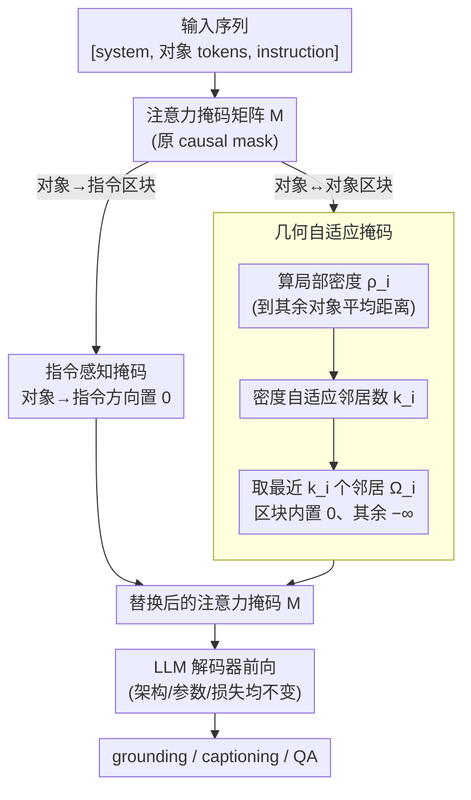

# Masking Matters: Unlocking the Spatial Reasoning Capabilities of LLMs for 3D Scene-Language Understanding

**会议**: CVPR 2026  
**arXiv**: [2512.02487](https://arxiv.org/abs/2512.02487)  
**代码**: [https://github.com/Jyerim/3D-SLIM](https://github.com/Jyerim/3D-SLIM)  
**领域**: 3D视觉 / 场景理解  
**关键词**: 3D场景理解、注意力掩码、空间推理、LLM解码器、对象中心表示

## 一句话总结
发现 LLM 解码器中的 causal mask 与 3D 场景理解存在两个根本冲突（顺序偏置和指令隔离），提出 3D-SLIM 掩码策略（Geometry-adaptive Mask + Instruction-aware Mask）替换 causal mask，无需架构修改和额外参数即可在多个 3D 场景语言任务上获得显著提升。

## 研究背景与动机

1. **领域现状**：3D 场景语言理解旨在联合解释 3D 环境和自然语言，是机器人导航和具身 agent 的基础。最近的 Object-Centric 3D LLM 框架（如 Chat-Scene）将 3D 场景分解为对象提案集合，每个对象用标识符 token 和实例级 3D/2D 特征表示，通过 LLM 进行推理。
2. **现有痛点**：已有方法的进展主要集中在输入表示层面（如何编码 3D 场景），解码器架构几乎未被探索。当前方法直接沿用语言模型的 causal mask，存在两个根本冲突。
3. **核心矛盾**：(a) **顺序偏置**：causal mask 对 token 施加顺序依赖，但 3D 场景中的对象内在是顺序无关的（按空间关系组织而非输入顺序），强制的顺序约束让模型学到虚假的顺序相关性；(b) **指令隔离**：causal mask 阻止对象 token 注意到位于序列后方的指令 token（因为输入是 [system, objects, instruction] 的顺序），迫使模型先处理完整个 3D 场景再整合用户指令，导致推理路径低效。
4. **本文目标** (1) 如何消除对象间虚假的顺序依赖？(2) 如何让对象在编码时即可感知指令上下文？(3) 能否通过简单的掩码修改而非架构重设来解决？
5. **切入角度**：从注意力掩码这一被忽视的角度切入。人类理解 3D 场景时会按空间邻近性分组对象，并根据语言指令聚焦于相关区域——将这两个认知原则编码为注意力掩码。
6. **核心 idea**：用几何自适应掩码替换对象间的 causal 约束（基于空间密度而非 token 顺序建模局部关系），并用指令感知掩码允许对象直接注意到指令 token。

## 方法详解

### 整体框架
这篇论文要解决的是：object-centric 3D LLM 直接照搬语言模型的 causal mask，而 causal mask 和 3D 场景天生不合——它把无序的空间对象当成有序 token 序列，还把对象和后置的指令隔开。3D-SLIM 的做法是只动注意力掩码、不碰架构也不加参数：输入序列照旧是 [system tokens, object tokens, instruction tokens]，模型照常前向，唯一的改动是把注意力矩阵 $M$ 里两个关键区块换掉——object-object 区块换成几何自适应掩码（Geo Mask），object-instruction 区块换成指令感知掩码（Inst Mask）。整篇方法的全部技术含量都落在「这两个区块该填什么值」上。

### 关键设计

**1. 几何自适应掩码（Geo Mask）：让对象按空间邻近度、而非 token 顺序互相注意**

causal mask 强加的顺序依赖（前面的对象看不到后面的对象）对 3D 场景是纯噪声，可一个反直觉的事实是：单纯把它去掉（Full Mask 全注意力）反而可能掉点，因为全注意力对所有对象一视同仁，没给模型任何结构信号。Geo Mask 的思路是用对象的真实空间分布来决定谁该注意谁。它先算每个对象 $i$ 的局部密度——到其余对象的平均距离越小、密度越高：

$$\rho_i = \sqrt{3} - \frac{1}{N-1}\sum_{j \neq i} d_{ij}$$

把 $\rho_i$ 做 min-max 归一化得到 $\tilde{\rho}_i \in [0,1]$，再据此自适应地决定每个对象能看几个邻居：

$$k_i = \mathrm{round}\big((k_{max} - k_{min}) \cdot \tilde{\rho}_i + k_{min}\big)$$

然后按距离排序取最近的 $k_i$ 个对象构成邻居集 $\Omega_i$，掩码里对 $j \in \Omega_i$（含自身 $j=i$）置 0、其余置 $-\infty$。直观上：一堆椅子挤在一张桌子周围的密集区，每把椅子的 $k_i$ 会自动变大、彼此都能注意到；而房间角落一盏孤零零的灯，$k_i$ 收到最小值、只看最近的一两个对象，不会被无关的远处对象干扰。之所以做成密度自适应而不是固定 N 个邻居，正是因为真实 3D 场景的对象密度高度不均——固定邻居数在密集区漏掉相关对象、在稀疏区又强行拉进噪声（消融里 Fixed-N 全面弱于 Geo）。这等于在注意力层里免学习地搭了一张几何感知的场景图。

**2. 指令感知掩码（Inst Mask）：在编码阶段就把指令喂给对象**

因为输入顺序是 [system, objects, instruction]，causal mask 下对象 token 全部排在指令前面，根本看不到「用户到底要问什么」，只能盲目地把整个场景编码完再去对接指令，跨模态推理的路径被硬生生掐断。Inst Mask 的修正极其简单：在掩码矩阵里，把所有「对象 → 指令」方向的 $-\infty$ 项改成 0，即 $M_{ij}=0$ 当 $i \in \mathcal{O}$（对象集）且 $j \in \mathcal{I}$（指令集），其余位置不动。这样一来，指令里提到的「next to the table」「椅子」「桌子」等线索能在编码时就反向引导对象表示，让对象一开始就朝任务相关的方向聚焦，而不是事后补救。

### 损失函数 / 训练策略
- 纯掩码改动，不引入新参数/新模块，完全沿用 Chat-Scene 的单一交叉熵损失覆盖 grounding/captioning/QA：$\mathcal{L} = -\sum_{l=1}^{m} \log P\big(Y_l \mid Y_{[1,\dots,l-1]}, X\big)$，这也是它能即插即用迁移到任意 object-centric 3D LLM 的前提
- LoRA 微调 + AdamW 优化器（weight decay 0.02）
- Chat-Scene: batch size 32, lr 5e-6；3DGraphLLM: batch size 8, lr 2e-5
- Geo Mask 超参：$k_{min}=2, k_{max}=10$
- NMS IoU 阈值 0.9

## 实验关键数据

### 主实验
在 Chat-Scene (Vicuna-7B) 框架上集成 3D-SLIM：

| 任务 | Chat-Scene | Chat-Scene + 3D-SLIM | 提升 |
|------|-----------|---------------------|------|
| ScanRefer Acc@0.25 | 55.5 | 59.6 | +4.1 |
| ScanRefer Acc@0.5 | 50.2 | 54.1 | +3.9 |
| Multi3DRef F1@0.25 | 57.1 | 63.7 | +6.6 |
| Multi3DRef F1@0.5 | 52.4 | 58.7 | +6.3 |
| Scan2Cap C@0.5 | 77.1 | 84.2 | +7.1 |
| ScanQA CIDEr | 87.7 | 94.0 | +6.3 |
| SQA3D EM | 54.6 | 55.5 | +0.9 |

### 消融实验
解码器掩码策略对比（Chat-Scene + Vicuna-7B）：

| 策略 | ScanRefer@0.25 | Multi3DRef F1@0.25 | Scan2Cap C@0.5 | ScanQA C |
|------|---------------|-------------------|---------------|---------|
| Causal Mask (baseline) | 55.3 | 59.6 | 78.1 | 88.3 |
| Full Mask (全部) | 56.2 | 61.2 | 78.4 | 90.9 |
| Diagonal Mask (禁止对象间交互) | 56.4 | 60.5 | 78.6 | 92.9 |
| Fixed-N Mask (固定5近邻) | 57.5 | 61.6 | 81.9 | 91.6 |
| **Geo Mask (本文)** | **58.6** | **62.0** | **82.4** | **94.2** |

组件消融（Chat-Scene）：

| Geo Mask | Inst Mask | ScanRefer@0.25 | Multi3DRef F1@0.25 | Scan2Cap C@0.5 |
|----------|----------|---------------|-------------------|---------------|
| ✗ | ✗ | 55.3 | 59.6 | 78.1 |
| ✓ | ✗ | 58.6 | 62.0 | 82.4 |
| ✗ | ✓ | 57.6 | 62.0 | 81.1 |
| ✓ | ✓ | 59.6 | 63.7 | 84.2 |

### 关键发现
- **Full Mask ≈ Diagonal Mask**：消除 causal 约束后，全注意力和完全禁止对象间交互效果几乎相同，说明仅仅放开注意力范围并不能提供有用的结构信息——必须引入显式的空间局部性引导。
- **Geo Mask > Fixed-N Mask**：自适应邻居数（基于密度）比固定邻居数效果更好，因为 3D 场景的对象密度不均匀。
- **两种掩码互补**：Geo Mask 主要改善空间推理（grounding），Inst Mask 主要改善任务理解（captioning/QA），组合使用效果最佳。
- **跨 LLM 通用性强**：在 Vicuna-7B、Llama3-8B、Qwen2-7B、Qwen3-8B 四种 LLM 上均获得一致提升。
- **$k_{min}=2, k_{max}=10$ 最优**：过小的范围限制信息交换，过大的范围导致注意力过度分散。
- 注意力可视化显示 3D-SLIM 能精准关注指令描述的空间关系（"next to the table beneath the tv"），而 baseline 仅关注孤立名词。

## 亮点与洞察
- **极简但有效的策略**：不改架构、不加参数、不加损失，仅修改注意力掩码就能在多个任务上获得 3-7 个点的提升，是典型的"四两拨千斤"设计。思路可以迁移到任何输入包含无序空间元素的 LLM 推理场景。
- **发现 Full Mask ≈ Diagonal Mask 这一反直觉现象**：说明对象间注意力的关键不在于"是否能互相看到"，而在于"看到的结构是否有意义"。这个洞察对所有涉及集合操作的 Transformer 应用都有启发。
- **密度自适应的局部注意力**：相当于在注意力层面隐式构建了一个动态几何场景图，且完全免学习——密度和距离直接从 3D 坐标计算。

## 局限与展望
- 仅在 object-centric 框架（Chat-Scene、3DGraphLLM）上验证，未扩展到 point-based 或 video-based 表示
- 在 QA 任务（ScanQA、SQA3D）上提升相对较小（+0.9~+6.3），可能因为这些任务更依赖语言推理能力而非空间结构
- $k_{min}$ 和 $k_{max}$ 仍需手动设定，可以探索让模型学习自适应
- Inst Mask 的设计是"开关式"全连接，是否可以引入指令-对象的相关性权重做更细粒度控制？
- 未在大规模预训练阶段验证，仅在 fine-tuning 阶段使用

## 相关工作与启发
- **vs Chat-Scene**: 3D-SLIM 在 Chat-Scene 基础上仅修改掩码，ScanRefer Acc@0.25 从 55.5 提升到 59.6，Scan2Cap C@0.5 从 77.1 提升到 84.2，证明解码器设计是被忽视的重要因素。
- **vs 3DGraphLLM**: 3DGraphLLM 在输入层面显式建模对象间语义关系（构建图），而 3D-SLIM 在解码器层面隐式建模空间关系（通过掩码）。两者结合（3DGraphLLM + 3D-SLIM）进一步提升，说明互补。
- **vs GPT4Scene-HDM（Video-based）**: Video-based 方法在 QA 上更强是因为底层 MLLM 在大规模图像 QA 上预训练。3D-SLIM 作为 decoder 策略可以与更强的 MLLM 结合以弥补差距。

## 评分
- 新颖性: ⭐⭐⭐⭐⭐ 从解码器掩码这一被完全忽视的角度切入，发现并解决了两个根本性冲突
- 实验充分度: ⭐⭐⭐⭐⭐ 5 个基准、4 种 LLM、丰富的掩码策略消融、注意力可视化
- 写作质量: ⭐⭐⭐⭐⭐ 动机推导逻辑严密，从观察到假设到验证环环相扣

<!-- RELATED:START -->

## 相关论文

- [\[CVPR 2026\] Lifting Unlabeled Internet-level Data for 3D Scene Understanding](lifting_unlabeled_internet-level_data_for_3d_scene_understanding.md)
- [\[CVPR 2026\] Scalable Object Relation Encoding for Better 3D Spatial Reasoning in Large Language Models](scalable_object_relation_encoding_for_better_3d_spatial_reasoning_in_large_langu.md)
- [\[CVPR 2026\] Fast SceneScript: Fast and Accurate Language-Based 3D Scene Understanding via Multi-Token Prediction](fast_scenescript_fast_and_accurate_language-based_3d_scene_understanding_via_mul.md)
- [\[CVPR 2026\] Context-Nav: Context-Driven Exploration and Viewpoint-Aware 3D Spatial Reasoning for Instance Navigation](context-nav_context-driven_exploration_and_viewpoint-aware_3d_spatial_reasoning_.md)
- [\[ICLR 2026\] Omni-View: Unlocking How Generation Facilitates Understanding in Unified 3D Model based on Multiview images](../../ICLR2026/3d_vision/omni-view_unlocking_how_generation_facilitates_understanding_in_unified_3d_model.md)

<!-- RELATED:END -->
