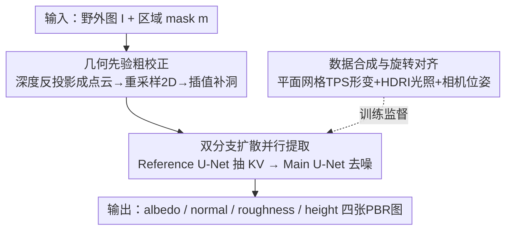

# MatE: Material Extraction from Single-Image via Geometric Prior

**会议**: CVPR 2026  
**论文**: [CVF Open Access](https://openaccess.thecvf.com/content/CVPR2026/html/Zhang_MatE_Material_Extraction_from_Single-Image_via_Geometric_Prior_CVPR_2026_paper.html)  
**代码**: https://tiptoehigherz.github.io/Material-Extraction/ （项目页）  
**领域**: 3D视觉 / PBR材质 / 逆向渲染 / 扩散模型  
**关键词**: PBR材质提取, 几何先验校正, 双分支扩散, 数据合成, 单图逆向渲染

## 一句话总结
MatE 用「深度几何先验做粗校正 + 双分支扩散做细化」的 coarse-to-fine 框架，从单张真实世界图像的指定区域中并行提取出 albedo / normal / roughness / height 四张可平铺的 PBR 材质图，避免了已有方法（LoRA 过拟合视角、视频 DiT 串行误差累积）的缺陷。

## 研究背景与动机
**领域现状**：高保真 PBR（基于物理渲染）材质是现代图形管线的基石，但获取这些材质通常需要专业采集设备和美术师手工制作，门槛极高。从一张「野外随手拍」的 RGB 图反推材质属性，是一个非常诱人但高度病态（ill-posed）的问题——图像外观是材质本征属性、几何、未知环境光三者的复杂纠缠，直接分解天然存在歧义。

**现有痛点**：生成模型兴起后出现了一批单图 PBR 提取方法，但都有结构性缺陷。Material Palette（Lopes et al.）用 DreamBooth + LoRA 微调去学习区域纹理语义，但 LoRA 这种实例级适配会把**视角带来的透视畸变直接烤进**恢复出的材质里；MaterialPicker（Ma et al.）把视频 DiT 改造过来，把输入图当成第一帧、把不同材质属性当成后续帧来生成——可材质属性本质上是**静态**的、不随时间演化，强加时序结构是一个错误前提，导致**串行依赖**：早期属性的微小估计误差会被逐帧传播放大，材质保真度逐级退化。

**核心矛盾**：图像到材质的映射要同时跨越三道鸿沟——几何上要校正透视畸变、域上要从图像域跨到规范化材质域、细节上要保留空间高频。直接端到端学一个隐式处理强非线性透视畸变的映射极难训练。

**本文目标**：从单张野外图 + 用户 mask 出发，对未知光照与透视都保持不变性，可靠恢复一整套材质图。

**切入角度**：与其让网络隐式硬啃透视畸变，不如**用一个几何先验把问题显式拆成 coarse-to-fine 两步**——先用深度图把畸变粗校正掉，再让扩散模型只去补残差畸变和跨域映射。

**核心 idea**：几何先验粗校正 + 双分支扩散并行细化，再配一套能制造「视角-材质」精确配对的数据合成管线来弥合 synthetic-to-real 域差。

## 方法详解

### 整体框架
MatE 接收一张图像 $I$ 和一个目标区域 mask $m$（mask 可来自用户输入或 SAM 等分割模型），输出该区域材质的四张 PBR 图 $\{\hat A,\hat N,\hat R,\hat H\}$（albedo / normal / roughness / height）。整条管线是 coarse-to-fine：先用预训练深度模型估出深度，把图像反投影成 3D 点云再重采样回 2D，得到一个**粗校正**纹理（解决大部分透视畸变）；然后送进双分支扩散网络——Reference U-Net 处理 masked 输入抽取条件 KV 特征，Main U-Net 在这些 KV 引导下去噪、并行预测拼接在一起的材质潜变量；训练数据则由一套基于 Blender 的合成管线提供，关键是用相机位姿对齐保证「条件图 ↔ 规范材质」一致。

### 关键设计

**1. 几何先验粗校正：用深度把透视畸变先显式拆掉**

直接端到端逆转透视畸变极难，作者引入几何先验把它降级成 coarse-to-fine。先用预训练深度估计模型 $\mathcal{D}$ 取得输入图的深度，再把图像与 mask 反投影成 3D 点云、重采样成 2D 图。反投影按式 $u_c=\mathcal{N}\big((u_d-c_x)\tfrac{\mathcal{D}(u_d,v_d)+d_{\text{shift}}}{f_x}\big)s_x$（$v_c$ 同理）进行，其中 $(f_x,f_y),(c_x,c_y)$ 是相机内参，$\mathcal{N}$ 把正交投影归一化到 $[0,1]$、再用 $s_x,s_y$ 缩放回像素坐标。由于预训练深度是归一化的 $[0,1]$，接近 0 会让反投影塌缩到主点，作者引入超参 $d_{\text{shift}}$ 保证最小投影距离来避开这个奇异点。

反投影本质是 splatting，从稠密源网格映到稀疏不规则点集，光栅化到目标网格时会出现重叠和**空洞**（尤其在纹理放大/去遮挡区域）。作者用一个后处理插值把空洞像素用其 $k\times k$ 邻域内有效像素的均值填上（式 8），形成稠密表示供后续使用。这一步只是「粗」校正，复杂非线性畸变留给扩散去补。

**2. 双分支扩散并行提取：KV 注入条件，一次性出四张材质图**

针对 MaterialPicker 串行误差累积的痛点，MatE 用扩散模型**并行**预测所有材质图。四张材质图分别经预训练 VAE 编码器 $\mathcal{E}$ 压成潜变量后沿通道拼接 $z_0=\mathcal{C}(z^a,z^n,z^r,z^h)\in\mathbb{R}^{b\times16\times h\times w}$，去噪网络 $\epsilon_\theta$ 在加噪潜变量 $\tilde z_t=\sqrt{\bar\alpha_t}z_0+\sqrt{1-\bar\alpha_t}\epsilon$ 上预测噪声，条件为 $z_c=\mathcal{E}(I\odot m)$，优化扩散损失 $\mathcal{L}_{\text{diff}}=\mathbb{E}_{\epsilon,t}\big[\|\epsilon-\epsilon_\theta(\tilde z_t;z_c,t)\|^2\big]$。

网络是双分支 U-Net：Reference U-Net 处理 masked 输入潜变量、抽取条件 KV 特征；Main U-Net 去噪材质潜变量、被注入的 KV 引导。KV 注入写成 $\text{Attn}(Q^*,K^R,V^R)=\text{Softmax}\big(\tfrac{Q^*(K^R)^T}{\sqrt d}\big)V^R$，其中 $Q^*$ 来自 Main U-Net，$K^R,V^R$ 来自引导图。这个输出维度与 KV 的序列长度无关，因此是**分辨率无关**的条件机制，并在 U-Net 各层级做多尺度特征对齐——好处是能从任意分辨率参考图生成任意分辨率材质图。相比之下，串行的 MaterialPicker 一旦某属性预测错，误差会沿帧传播；而 MatE 并行架构能把模块错误隔离（论文 Fig.7：法线预测失败时，MatE 的 roughness 仍正确，DiT 的 roughness 则被连带毁掉）。

**3. 旋转对齐数据合成：制造精确的「视角-材质」配对，弥合域差**

真实世界拿不到成对的 $\{I,M\}$ 真值，所以模型在大规模合成数据上训练。作者用 Blender 近似图像成像过程：不用 Objaverse 这类复杂 3D 模型（会引入物理上不合理的尺度变化和 UV 不连续造成的结构断裂），而是用**平面网格**经薄板样条（TPS）形变引入真实的表面几何变化，再把高保真材质 UV 映射上去；相机位置在固定半径球面上随机采样、朝向指向同心小球上的随机目标点，每个场景用 Polyhaven 随机 HDRI 提供真实多样光照渲染，并记录相机位姿。

关键的「旋转对齐」是：训练时用记录的相机位姿对规范 PBR 材质图施加对应旋转变换，旋转角 $\alpha=\text{atan2}(y,x)$ 由相机视向量 $v=(x,y,z)$ 导出（平面网格规范空间定在 XY 平面、法线沿 Z 轴）。这样训练数据本身就是「视角依赖」的，模型**不需要**去学一个不切实际的「材质规范朝向」强先验。这套合成简化了要学的逆映射，显著提升模型跨 synthetic-to-real 域差的能力。材质源自含 5,879 个实例的 PBR 数据集，每个实例都有完整 albedo/normal/roughness/height。

### 损失函数 / 训练策略
核心训练目标是扩散去噪损失 $\mathcal{L}_{\text{diff}}$（式 6），在合成数据上用旋转对齐的材质真值监督。预训练 VAE 编码器固定，Reference / Main 双分支 U-Net 可训练。粗校正阶段无需训练（纯几何操作 + 插值），是即插即用的预处理。

## 实验关键数据

### 主实验
在合成集（Blender 渲染 717 对）和真实集（Polyhaven 226 对人工标注 mask）上，用 LPIPS↓、SSIM↑、CLIP-Score↑ 评估每属性平均（因 MSE/PSNR 对平移过敏，不适合本任务）。

| 数据集 | 属性 | 指标 | Material Palette | MaterialPicker* | MatE(本文) |
|--------|------|------|------------------|-----------------|------------|
| Real-World | Albedo | LPIPS↓ | 0.701 | 0.554 | **0.445** |
| Real-World | Normal | LPIPS↓ | 0.661 | 0.552 | **0.395** |
| Real-World | Roughness | LPIPS↓ | 0.581 | 0.455 | **0.342** |
| Real-World | Height | LPIPS↓ | —(缺height) | 0.542 | **0.489** |
| Synthetic | Albedo | LPIPS↓ | 0.529 | 0.507 | **0.423** |
| Synthetic | Roughness | LPIPS↓ | 0.486 | 0.460 | **0.345** |

MatE 在 LPIPS 和 CLIP-Score 这两个感知/语义指标上大幅领先，SSIM 上保持竞争力。Material Palette 不预测 height（图中留空）。`*` 表示作者基于既有 Video DiT 框架重实现的 MaterialPicker。

### 消融实验

| 配置 | LPIPS↓ | SSIM↑ | CLIP↑ | 说明 |
|------|--------|-------|-------|------|
| Ours 无旋转对齐 + 无透视校正 | 0.464 | 0.360 | 0.706 | 都去掉 |
| Ours + 透视校正 | 0.428 | 0.396 | 0.712 | 仅加几何校正 |
| Ours + 旋转对齐 | 0.435 | 0.391 | 0.698 | 仅加旋转对齐数据 |
| **Ours 完整** | **0.418** | 0.377 | **0.723** | 两者都加 |

条件机制消融（另一张表）：CLIP 注入 LPIPS 0.674（高层语义缺空间细节、严重失真）、Concat 0.529、ControlNet 0.447、**Ours(KV 注入) 0.418**——本文条件机制最优，因为本任务里条件图与目标材质图存在显著空间错位，Concat/ControlNet 这种依赖高空间相关的方式并不适合。

### 关键发现
- **旋转对齐和透视校正各有贡献、叠加最优**：单独加任一项都比都不加好，完整模型 LPIPS 最低（0.418）。
- **几何粗校正可即插即用**：把它当预处理接到 Material Palette 上，能实质提升基线性能、缓解畸变退化——说明它是通用模块而非耦合设计。
- **并行 vs 串行的因果验证**：给 MaterialPicker 在采样时喂入真值 normal，其 roughness 预测就恢复了，证明它的退化源自强加的串行依赖，而非独立模块失败——反衬 MatE 并行架构的鲁棒性。

## 亮点与洞察
- **把「学畸变逆映射」降级成「几何先验粗校正 + 扩散补残差」**，是这篇最巧妙的地方：用一个无需训练的纯几何反投影把最难啃的强非线性透视畸变先消掉大半，让扩散只做它擅长的域翻译和细节补全。
- **诊断式实验设计**（喂真值 normal 看 roughness 是否恢复）干净利落地把「串行依赖」这一根因从「模块本身弱」中分离出来，比单纯刷点更有说服力。
- **「不学材质规范朝向」的思路可迁移**：与其逼网络学一个强且常常拿不到的规范先验，不如把视角依赖直接灌进训练数据，让任务对网络更友好——这个数据侧解法对其他逆向渲染任务也成立。

## 局限与展望
- 作者承认三点局限：① 对有强烈规则内部结构的非平稳纹理，粗校正可能破坏结构完整性产生伪影；② 面对高度复杂几何时，粗校正可能不够；③ 对极端镜面高光表面会提取失败。
- 自己看：方法依赖预训练深度的质量，深度估计在无纹理/透明/反光区域不准时，粗校正会引入误差；合成数据用平面网格 + TPS，对真实弯曲/分层材质的覆盖有上限。
- 改进思路：把粗校正从单次反投影改成可微、与扩散联合优化的迭代校正；引入镜面/高光显式建模分支处理失败案例。

## 相关工作与启发
- **vs Material Palette [Lopes et al.]**：他们用 DreamBooth+LoRA 学区域纹理概念，但 LoRA 适配把视角畸变烤进材质、且两阶段级联导致误差累积；MatE 用几何先验先去畸变、单阶段并行提取，避免过拟合视角依赖属性。
- **vs MaterialPicker [Ma et al.]**：他们把视频 DiT 改造、不同属性当不同帧串行生成，强加错误时序依赖导致静态材质误估；MatE 并行预测、隔离模块误差。
- **vs 纹理校正方法（Hao et al.）**：同样处理畸变纹理，但 MatE 把深度几何先验显式引入校正、并扩展到完整 PBR 材质提取，而非单纯纹理补全。

## 评分
- 新颖性: ⭐⭐⭐⭐ 几何先验 + 双分支并行扩散 + 旋转对齐数据三者组合解决单图 PBR 提取，思路清晰但各组件多有渊源（KV 注入、TPS 数据）
- 实验充分度: ⭐⭐⭐⭐ 合成+真实双集、三指标、消融与即插即用验证齐全，诊断实验亮眼；真实集规模偏小（226 对）
- 写作质量: ⭐⭐⭐⭐ 动机推导清晰、coarse-to-fine 逻辑顺；公式 OCR 后较繁
- 价值: ⭐⭐⭐⭐ 降低 PBR 材质获取门槛，几何校正模块可即插即用迁移到其他基线

<!-- RELATED:START -->

## 相关论文

- [\[CVPR 2026\] Action–Geometry Prediction with 3D Geometric Prior for Bimanual Manipulation](actiongeometry_prediction_with_3d_geometric_prior.md)
- [\[CVPR 2026\] Intrinsic Image Fusion for Multi-View 3D Material Reconstruction](intrinsic_image_fusion_for_multi-view_3d_material_reconstruction.md)
- [\[ECCV 2024\] ZeST: Zero-Shot Material Transfer from a Single Image](../../ECCV2024/3d_vision/zest_zero-shot_material_transfer_from_a_single_image.md)
- [\[CVPR 2026\] Material Magic Wand: Material-Aware Grouping of 3D Parts in Untextured Meshes](material_magic_wand_material-aware_grouping_of_3d_parts_in_untextured_meshes.md)
- [\[CVPR 2026\] Human Interaction-Aware 3D Reconstruction from a Single Image](human_interaction-aware_3d_reconstruction_from_a_single_image.md)

<!-- RELATED:END -->
