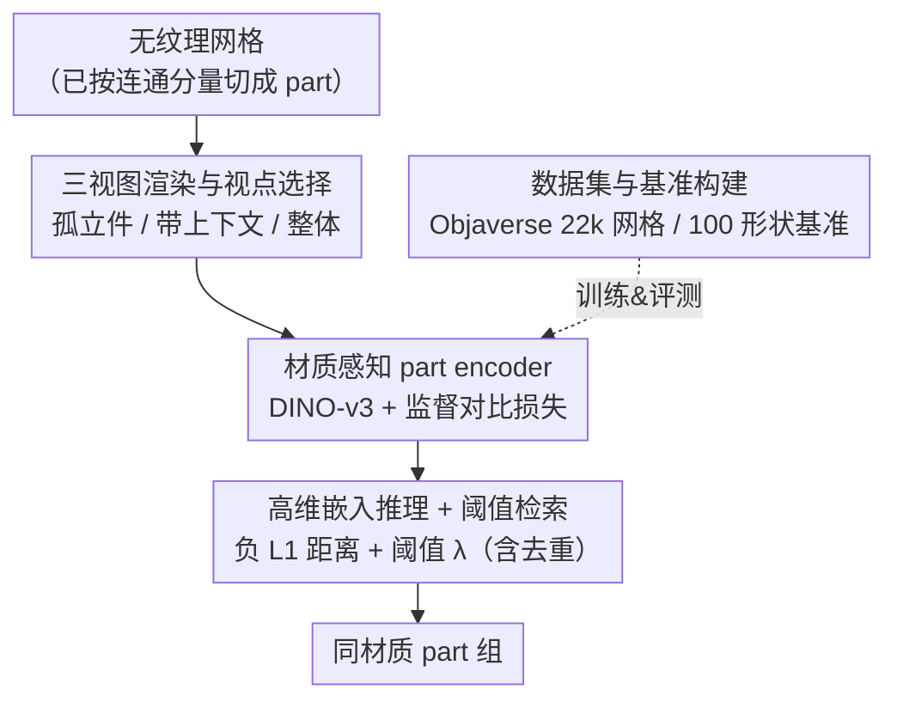

# Material Magic Wand: Material-Aware Grouping of 3D Parts in Untextured Meshes

**会议**: CVPR 2026  
**论文**: [CVF Open Access](https://openaccess.thecvf.com/content/CVPR2026/html/Jain_Material_Magic_Wand_Material-Aware_Grouping_of_3D_Parts_in_Untextured_CVPR_2026_paper.html)  
**代码**: 项目页 https://umangi-jain.github.io/material-magic-wand （代码未明确开源 ⚠️）  
**领域**: 3D视觉  
**关键词**: 材质感知分组、3D part 检索、对比学习、无纹理网格、交互式建模

## 一句话总结
针对无纹理网格中"重复但几何各异的结构件该共享同一材质"这一痛点，本文提出 Material Magic Wand：用一个学到材质感知嵌入的 part encoder，把每个 3D part 编码成向量，单击一个 part 就能用最近邻检索自动选出所有同材质的 part，在自建 100 形状 / 241 query 的基准上检索 AUC 比最强基线高 8.6%、分组 F1 高 16.6%。

## 研究背景与动机
**领域现状**：3D 建模里给网格分配材质是常规且高频的操作。一个艺术家创建的网格通常能按"连通分量（connected components）"自然地拆成很多细粒度 part；很多形状里存在大量重复结构件——松果的鳞片、建筑/车辆的窗户——它们形态相近、却在尺寸朝向上各有不同，而且往往应该共享同一种材质。

**现有痛点**：当前主流建模工具里，这些重复件必须**一个一个手动框选并逐个赋材质**。重复件越多、网格越复杂，这件事就越枯燥越耗时。已有研究都在解相关但本质不同的问题：3D part 分割是把几何切成语义部件（本文假设 part 已经切好），形状检索比较的是整库的"整体形状"而非单个形状内部的部件，对称检测依赖刚性/近等距对应、抓不住"重复但显著变形"的结构，材质分割则依赖纹理/贴图当线索、且 fine-tune SAM 这类做法受分辨率限制对小 part 力不从心。

**核心矛盾**：一边是"同材质的重复件几何差异很大"，纯几何描述子（如 histogram 统计）只能抓近似重复、对变形脆弱；另一边是 DINO、SigLIP 这类强力图像嵌入虽然鲁棒，却**根本不理解材质**——它们按视觉外观聚类，会把外观相似但材质无关的件混在一起，也会漏掉结构相关的件（如脚轮）。没有任何现成方法或基准是"对已切好的 part 按材质一致性做分组"。

**本文目标**：给定一个已切成细粒度 part 的无纹理网格和一个 query part，检索出形状内所有可能同材质的 part；并把它做成像 Photoshop 魔棒一样的交互工具——单击一个 part、调一个阈值就能控制选择的松紧。

**切入角度**：把"分组"问题转成"嵌入空间里的最近邻检索"。只要能把每个 part 嵌到一个**编码材质相似性**的空间，使同材质的 part 嵌入相互靠近、异材质的相互远离，分组就退化成"检索离 query 最近的那些嵌入"。

**核心 idea**：训练一个 material-aware part encoder，用监督对比损失把同材质 part 拉近、异材质 part 推远；推理时按嵌入距离 + 一个阈值做检索，即得到材质一致的 part 组。

## 方法详解
### 整体框架
方法要解决的是"给定一个 query part，从同一网格里捞出所有同材质 part"。整体转法是：先把每个 part 渲染成三张不同语境的图（孤立件 / 带上下文 / 整体物体），喂进一个以 DINO-v3 初始化的 part encoder 得到材质感知嵌入，训练时用监督对比损失塑造嵌入空间；推理时对 query 做最近邻检索、用阈值 $\lambda$ 控制松紧，直接产出 part 组。整个 pipeline 是清晰的串行结构：

### 关键设计

**1. 三视图渲染与视点选择：让 2D 视觉骨干同时看到局部几何和全局语境**

材质判断既要看件本身的局部几何，也要看它在整体中的角色（一片"叶子"和一根"茎"的材质往往不同，光看孤立件可能区分不开）。本文为每个 part $p_i$ 渲染三张图：孤立件视图 $I^{part}_i$（只显示高亮的该件、隐藏其余）、带上下文视图 $I^{ctx}_i$（显示整网格但只高亮该件、相机距离使该件约占画面 25%）、整体视图 $I^{full}_i$（渲染整网格并高亮该件）。其中 $I^{ctx}_i$ 的视角不是随便选的：在环绕该件的半球上采 16 个候选相机位，选**可见面积最大**的那个视角（遵循"最大化可见表面"的感知偏好），若所有候选都被严重遮挡就把相机往件方向拉近缩小上下文范围；$I^{part}_i$ 复用 $I^{ctx}_i$ 的视角但拉近，$I^{full}_i$ 把相机放在物体中心指向件质心的方向。因为目标是无纹理网格，渲染前会移除所有材质与纹理。这套渲染让骨干在不依赖颜色/贴图的前提下，从纯几何 + 上下文里读出材质线索。

**2. 材质感知 part encoder + 监督对比损失：把"同材质"直接写进嵌入空间的几何结构**

三张图各自过一个 foundation 视觉骨干 $E$（DINO-v3 small 初始化、只微调最后三个 transformer block），特征拼接成 1152 维向量 $x_i$，再过一个两层 ReLU MLP 投影头 $f$ 得到 128 维、做 $\ell_2$ 归一化的对比嵌入 $z_i = f(x_i)/\lVert f(x_i)\rVert_2$。训练目标是监督对比损失（Supervised Contrastive Loss）：对 part $p_i$ 定义其正样本集 $P_i=\{j\mid j\neq i, y_j=y_i\}$（同网格内同材质 ID 的其它件）和对比集 $A_i=\{j\mid j\neq i\}$（除自己外的所有件），优化

$$L = \mathbb{E}_S\,\mathbb{E}_i\,\mathbb{E}_{j\in P_i}\left[-\log\frac{\exp(z_i\cdot z_j/\tau)}{\sum_{a\in A_i}\exp(z_i\cdot z_a/\tau)}\right],$$

其中 $\tau$ 为温度。它显式地把同材质件的嵌入拉到一起、把异材质件推开。和"用现成 DINO/SigLIP 直接检索"相比，关键区别在于这里的监督信号是**材质标签**而非视觉外观，因此学到的空间按材质而非按长相聚类——这正是消除"外观像但材质无关"误检的根源。

**3. 高维嵌入推理 + 阈值检索：用未压缩特征 + 负 L1 距离做可调松紧的分组**

一个有意思的发现是：推理时**不用**压缩后的 128 维 $z_i$，而是直接用拼接得到的 1152 维 $x_i$，性能一致更好（消融见下）。两件 part 的相似度定义为嵌入的负 $\ell_1$ 距离 $s(p_i,p_j)=-\lVert x_i-x_j\rVert_1$；给定 query $p_i$，选出 $\{p_j\mid s(p_i,p_j)\le\lambda\}$，阈值 $\lambda$ 越大选得越多（更松的分组）、越小越严（只选最相似的）——这就对应魔棒工具的"Tolerance"，支持细粒度控制和层次化选择。此外引入 **part deduplication**：网格里常有仅经刚性变换、本质相同的重复件，用 histogram matching 把它们分组、每组只取一个代表件算嵌入再共享给全组，既降算力又稳定结果。

**4. 数据集与基准构建：从 Objaverse 造监督，再人工净化出可靠评测集**

任务需要"每个 part 带材质 ID、且同材质 ID 被多个 part 共享"的大规模 3D 数据，但 Material3D / DreamMat 等只在**表面级**而非 part 级标材质，无法直接用。本文从 Objaverse 精选 22,000 个带材质赋值的网格（约 190 万 part）：因 Objaverse 不给细粒度分割，先做顶点合并再按连通分量抽 part，每个 part 取其面上的多数材质标签作为 ID（ID 在每个网格内独立定义）。原始数据材质分布极不均衡（如 99% 材质只用一次、或一种材质覆盖 99% 的件），故施加网格内/网格间的数据再平衡策略。评测则单独构建：Objaverse 的材质赋值常有歧义（屋顶瓦片混材质、栅栏条交替标注），直接拿来评会不可靠，于是在 Blender 里**人工精修 100 个网格**的材质赋值、消解歧义，得到 241 个带干净 ground-truth 检索集的 query part 作为基准。

### 损失函数 / 训练策略
仅用上面的监督对比损失，实践中把训练 batch 内除 $p_i$ 外的所有 part 都放进 $A_i$ 以稳定训练。OpenGL 渲染器批量生成训练数据，图像 512×512；Adam，学习率 $1\times10^{-5}$，batch size 256，训 20,000 步。作者注意到换更大骨干只有边际收益（见消融）。

## 实验关键数据

### 主实验
基准：100 形状 / 241 query，跨度极大（每网格 part 数中位 265、范围 16–40,086；组大小中位 20、范围 2–32,267）。指标全部 macro 平均（每个 query 等权，防止大组主导）。自定义/关键指标说明：**AUC PR** = precision–recall 曲线下面积（检索质量综合度量）；**R-Prec** = 取与 ground-truth 同样多的前若干个结果时的精度；**F1** 为给定阈值 $\lambda$ 下预测组与真值组之间的 F1（$\lambda$ 在 5 网格 / 13 query 的小验证集上各方法各自取最优、保证公平）。

| 方法 | AUC PR | R-Prec | mAP | R@20 | F1 |
|------|--------|--------|-----|------|-----|
| Histogram Matching（纯几何） | 26.85 | 25.45 | 30.71 | 15.97 | 23.84 |
| SigLIP-v2 | 62.83 | 56.02 | 60.58 | 40.72 | 39.44 |
| PartField（3D part 分割嵌入） | 75.30 | 67.74 | 70.52 | 47.92 | 56.57 |
| DINO-v3 small（最强基线） | 81.14 | 78.32 | 83.49 | 56.63 | 59.36 |
| **本文 Ours** | **89.74** | **88.33** | **91.70** | **62.79** | **75.94** |

相对最强基线 DINO-v3 small，检索 AUC +8.6%、分组 F1 +16.6%。纯几何的 Histogram Matching 随 recall 上升精度陡降，说明纯形状描述子脆弱、只对近重复件有效；PartField 偏弱是因为它的训练目标是层次化 part 分割，与"学材质一致嵌入"不对齐。

### 消融实验
| 配置 | AUC | R-Prec | mAP | R@20 | 说明 |
|------|-----|--------|-----|------|------|
| Full model | ~89.7 | ~88.3 | ~91.7 | ~62.8 | 完整模型 |
| w/o isolated part | 86.90 | 84.97 | 88.53 | 61.11 | 去掉孤立件视图 |
| w/o part-with-context | 87.30 | 85.37 | 88.91 | 61.09 | 去掉带上下文视图 |
| w/o full-object | 88.89 | 87.72 | 90.75 | 62.36 | 去掉整体视图 |
| Only isolated part | 86.18 | 81.88 | 85.88 | 59.87 | 只留孤立件 |
| Init from DINO-v2 L | 86.51 | 84.58 | 88.61 | 61.13 | 换更大骨干初始化 |
| Random init | 78.54 | 74.52 | 79.62 | 56.25 | 不用预训练骨干 |
| Finetune last 5 blocks | 89.52 | 88.22 | 91.35 | 62.52 | 微调更多 block |
| Retrieval with $z$ | 87.45 | 87.58 | 90.90 | 62.34 | 用 128 维压缩嵌入检索 |
| w/o data rebalancing | 78.41 | 76.22 | — | — | 不做数据再平衡 |

### 关键发现
- 三视图缺一不可：去掉任一视图都掉点，去掉孤立件视图掉得最多（AUC 89.7→86.9），上下文 / 整体视图次之；"只留孤立件"进一步降到 86.18，印证全局语境对材质判断的价值。
- **预训练 + 数据再平衡是两根支柱**：随机初始化骨干 AUC 暴跌到 78.54，去掉数据再平衡同样跌到 78.41——这两个因素的影响远大于骨干规模（换更大的 DINO-v2 L 反而略降到 86.51，说明盲目堆大模型无益）。
- 推理用未压缩的 1152 维 $x$ 比用 128 维 $z$ 更好（89.7 vs 87.45），说明投影头压缩会丢掉部分对检索有用的材质信息。

## 亮点与洞察
- 把"按材质分组"重构成"嵌入空间最近邻检索"，使复杂的分组直接退化成可调阈值的检索，并天然支持 Photoshop 魔棒式的层次化交互——问题重述本身就很巧。
- 用纯几何 + 上下文渲染图、靠监督对比损失学"材质感"，绕开了"无纹理网格没有颜色线索"的死结；证明材质并非只能从外观读，结构/语境里也藏着可学的材质先验。
- "从 Objaverse 自动抽 part 级材质监督 + 人工净化出干净评测集"这一数据范式可迁移到其它缺标注的 part 级 3D 任务（如 part 级风格 / 功能分组）。

## 局限与展望
- 强依赖输入已有合理的 part 切分（连通分量），若网格切得过碎或过粗，分组质量会受影响——本文不解决初始分解问题。
- 监督来自 Objaverse 的材质 ID，原始标注噪声大、需大量数据再平衡和人工净化；材质本身存在歧义（同类件可能被艺术家故意赋不同材质），评测集只有 100 形状 / 241 query，规模偏小。⚠️ 代码是否开源未在正文明确，仅给出项目页。
- 改进方向：把 part 分割与材质分组联合学习、引入更细的材质属性（粗糙度 / 金属度）而非离散材质 ID、扩展到更大规模真实资产库。

## 相关工作与启发
- **vs 3D part 分割（PartField 等）**：它们把几何切成语义部件，本文假设部件已切好、做更高层的"按材质分组"；直接拿 PartField 的层次分割嵌入来检索效果明显逊于本文，因训练目标不对齐。
- **vs 形状检索（global descriptor）**：它们在整库里比"整体形状"，本文比的是**单个形状内部**的 part 级语义相似，目标尺度不同。
- **vs 材质分割（fine-tune SAM + 多视融合）**：它们依赖纹理/贴图当线索且受视图分辨率限制、抓不住小件，本文面向无纹理网格、用 part 级渲染 + 对比学习规避了这些约束。

## 评分
- 新颖性: ⭐⭐⭐⭐⭐ 首次提出"无纹理网格 part 级材质感知分组"任务并配套数据/基准/方法
- 实验充分度: ⭐⭐⭐⭐ 基准 + 多基线 + 详尽消融充分，但评测集规模偏小、缺真实大库验证
- 写作质量: ⭐⭐⭐⭐ 动机清晰、魔棒类比直观，公式与渲染细节交代到位
- 价值: ⭐⭐⭐⭐ 直击建模工作流里高频枯燥的材质赋值痛点，工具化落地价值明确

<!-- RELATED:START -->

## 相关论文

- [\[CVPR 2026\] MatSpray: Fusing 2D Material World Knowledge on 3D Geometry](matspray_fusing_2d_material_world_knowledge_on_3d_geometry.md)
- [\[CVPR 2026\] Intrinsic Image Fusion for Multi-View 3D Material Reconstruction](intrinsic_image_fusion_for_multi-view_3d_material_reconstruction.md)
- [\[CVPR 2026\] MatE: Material Extraction from Single-Image via Geometric Prior](mate_material_extraction_from_single-image_via_geometric_prior.md)
- [\[CVPR 2026\] MatLat: Material Latent Space for PBR Texture Generation](matlat_material_latent_space_for_pbr_texture_generation.md)
- [\[CVPR 2026\] ICTPolarReal: A Polarized Reflection and Material Dataset of Real World Objects](ictpolarreal_a_polarized_reflection_and_material_dataset_of_real_world_objects.md)

<!-- RELATED:END -->
