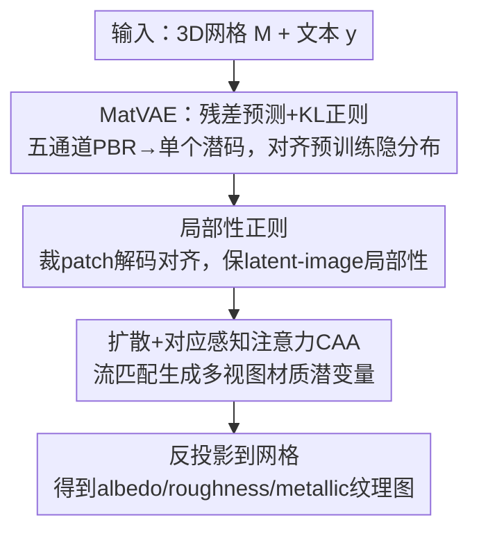

# MatLat: Material Latent Space for PBR Texture Generation

**会议**: CVPR 2026  
**论文**: [CVF Open Access](https://openaccess.thecvf.com/content/CVPR2026/html/Yeo_MatLat_Material_Latent_Space_for_PBR_Texture_Generation_CVPR_2026_paper.html)  
**代码**: https://matlat-proj.github.io （项目页）  
**领域**: 3D视觉 / PBR纹理生成 / 多视图扩散 / 隐空间适配  
**关键词**: PBR纹理生成, 材质隐空间, VAE微调, 对应感知注意力, 局部性正则化

## 一句话总结
MatLat 通过微调预训练 VAE 学出一个能容纳 albedo/roughness/metallic 五通道、又**最小化偏离原始隐分布**的「材质隐空间」（MatVAE），再配「对应感知注意力 + 局部性正则化」保证多视图一致，从而给定 3D 网格生成高质量可重光照的 PBR 纹理。

## 研究背景与动机
**领域现状**：生产级 3D 资产需要 PBR 纹理（albedo 漫反射色、roughness 粗糙度、metallic 金属度），这些通道才能在任意光照下做物理精确的重光照。当前最有效的 PBR 纹理生成范式是：用预训练 2D 扩散模型生成多视图材质图，再反投影（unproject）到网格表面得到纹理图。

**现有痛点**：这条范式有两个绕不开的坎。① **利用预训练先验非平凡**——PBR 纹理比 RGB 多了 roughness/metallic 两个通道，直接喂进为 RGB 训练的预训练编码器会产生**巨大域差**。主流做法（如 MaterialMVP 的 Frozen VAE）冻结编码器、把额外通道做 zero-padding 凑成三通道再编码，结果 $z_{rm}$（粗糙度/金属度潜变量）严重偏离预训练隐空间、是 OOD 的，拖累后续扩散微调；而且它要为 albedo 和 rough/metal 各编一份潜码，推理成本翻倍。② **多视图一致性难保证**——视图间不一致会在反投影到网格重叠区时造成模糊和伪影。

**核心矛盾**：要既能蹭上预训练扩散的强先验，又要把新增材质通道塞进隐空间而不破坏这个先验；同时还要让多视图在像素空间一致。Frozen VAE 在「不破坏先验」上失败（OOD 潜码），而单靠对应感知注意力（CAA）又不足以保证一致（除非 latent-image 映射保持局部性）。

**本文目标**：给定网格 $M$ 和文本 $y$，生成 $N$ 个视角的五通道材质图，再投到网格上得到高质量 PBR 纹理。

**切入角度**：不要冻结编码器，而是**微调**预训练 VAE 去吸收新通道，同时加正则把它锁在原隐分布附近；并意识到「CAA 要在像素空间生效，前提是 latent-image 保持空间局部性」，于是显式加一个局部性正则。

**核心 idea**：学一个「材质隐空间」MatLat——用残差预测 + KL 正则微调 VAE（MatVAE），再用 CAA + 局部性正则把多视图一致性从隐空间传导到像素空间。

## 方法详解

### 整体框架
MatLat 是两阶段流水线。第一阶段训 **MatVAE**：在保留预训练先验的前提下，把五通道 PBR 材质图（albedo $a$、roughness $r$、metallic $m$）编码成**单个**与预训练隐分布对齐的潜码——靠残差预测（复用预训练编码器编 albedo 当基底、加可学习残差编码器注入 rough/metal）和 KL 正则（约束学到的隐分布别偏离预训练）实现，并在微调时加局部性正则保证 latent-image 空间对齐。第二阶段训**扩散模型**：在 MatVAE 的适配隐空间里用流匹配（flow matching）生成多视图材质潜变量，注意力块里插入 CAA 模块利用几何对应做跨视图特征共享。最后把生成的多视图材质图反投影到网格得到 PBR 纹理。

### 关键设计

**1. 残差预测 + KL 正则的 MatVAE：把五通道塞进隐空间又不破坏预训练先验**

针对 Frozen VAE 把 rough/metal zero-padding 喂 RGB 编码器导致 $z_{rm}$ 是 OOD、且双潜码翻倍推理成本的痛点，MatVAE 改为单潜码 + 残差注入。利用 albedo 与 RGB 语义相近，复用冻结的预训练编码器 $\mathcal{E}_{pre}$ 编 albedo 得到基底分布 $q(z_{base}|a)=\mathcal{N}(\mu_{base},\sigma_{base}^2)$；再引入可学习残差编码器 $\mathcal{E}_{res}$ 预测残差参数 $(\mu_{res},\sigma_{res})=\mathcal{E}_{res}(x)$，调整基底分布：$z\sim\mathcal{N}\big(\mu_{base}+\mu_{res},\ \sigma_{base}^2\odot\sigma_{res}^2\big)$。$\mathcal{E}_{res}$ 最后一层卷积**零初始化**，训练之初残差为 0、精确复现预训练隐分布，再渐进适配到新模态，稳定优化。

为防止学到的表示偏离预训练隐空间，加 KL 正则约束「学到的分布」靠近「预训练分布」：$\mathcal{L}_{reg}=\lambda_{reg}\cdot\text{KL}\big(q(z|x)\,\|\,q(z_{base}|a)\big)$，并配合重建/KL/对抗损失训练（编码器 $\mathcal{E}_{pre}$ 冻结，$\mathcal{E}_{res}$ 与解码器 $\mathcal{D}$ 可训练）。与 LayerDiffuse（只预测均值、用 identity loss $\mathcal{L}_{id}$，不做分布级对齐）和 Orchid（直接预测 $(\mu_{full},\sigma_{full})$、无残差零初始化）相比，MatVAE 同时拿到「残差零初始化的稳定性」和「KL 的分布对齐」，论文称这是首个为 PBR 纹理生成做隐嵌入有效微调的工作。

**2. 对应感知注意力 CAA：用几何对应做跨视图特征共享**

dense 多视图注意力让每个 token 无差别 attend 所有视图、不带几何先验，收敛慢且视图不一致。CAA 把注意力**限制在几何对应的 token 上**：对视图 $c_i$ 中像素 $u$，反投影得表面点 $p_i^{(u)}=\Pi_i^{-1}(u)$，再投到别的可见视图 $c_j$ 得对应像素 $\phi_{i\to j}(u)=\Pi_j(p_i^{(u)})$（实现为以该点为中心的 $K\times K$ 局部窗口），对应集 $\mathcal{C}(u)$ 收集所有视图的对应。注意力只在对应集上算：$\text{softmax}\big(Q_u K_{\mathcal{C}(u)}^T/\sqrt d\big)V_{\mathcal{C}(u)}$。显式提供对应强化了跨视图对齐，产出多视图一致的材质图。CAA 模块被插进扩散注意力块，与原始注意力层并存。

**3. 局部性正则化：让 CAA 在像素空间真正生效的前提**

CAA 是在隐空间做特征交换，但目标是**像素空间**的多视图一致。这要求 latent token 与图像像素保持空间局部性（每个像素主要由其空间局部的 latent token 解出）。预训练编码器满足这一点，但 MatVAE 为吸收额外通道做了微调，局部性可能被破坏——此时 CAA 会在几何无关的 token 间传信息，反而降一致性。

为此引入局部性正则，在 MatVAE 微调时强制 patch 级重建对齐：$\mathcal{L}_{local}=\lambda_{local}\cdot d\big(\mathcal{T}(x),\ \mathcal{D}(\mathcal{T}(\mathcal{E}(x)))\big)$，其中 $\mathcal{T}$ 是随机裁剪算子、$d$ 取 $\ell_2$。它先裁出 latent patch、解码、再与对应图像区域对齐，确保每个像素主要由对齐的 latent token 重建。最终 MatVAE 训练目标用它替换原重建损失：$\mathcal{L}_{\text{MatVAE}}=\mathcal{L}_{local}+\mathcal{L}_{KL}+\mathcal{L}_{disc}+\mathcal{L}_{reg}$。实验证明 CAA 与 $\mathcal{L}_{local}$ 协同才能真正提升多视图一致（缺任一项 c-PSNR 都掉）。

### 损失函数 / 训练策略
扩散阶段在多视图 PBR 潜变量上微调一个流匹配（velocity）模型 $u_\theta$，按条件流匹配（CFM）定义数据潜码 $Z$ 与高斯噪声 $\epsilon$ 间的线性路径 $Z_t=(1-t)Z+t\epsilon$，目标 $\mathcal{L}_{\text{MatLat}}=\mathbb{E}_{t,Z,\epsilon}\|u_\theta(Z_t,t,y)-u_t\|^2$，其中瞬时速度 $u_t=\epsilon-Z$，$y$ 是文本条件。基座是 Stable Diffusion 3.5-Medium，用 Objaverse-XL 的 40,723 个 PBR 资产 + Bootstrap3D/Cap3D 文本训练，每个网格渲 26 张固定视角图。

## 实验关键数据

评测自定义指标 **c-PSNR**：计算每个像素 $u$ 与其对应点集 $\mathcal{C}(u)$ 之间的 PSNR，用来度量生成多视图材质图的**一致性**（FID/KID/RMSE 都反映不了一致性）。shaded 与 albedo 报 FID（CLIP 空间）、KID、CLIP 相似度；roughness/metallic 报 RMSE。评测用 128 个训练外网格、每网格 20 视角。

### 主实验（与外部基线对比）

| 方法 | 类型 | Shaded FID↓ | Albedo FID↓ | Rough. RMSE↓ | Metal. RMSE↓ | Time↓ |
|------|------|-------------|-------------|--------------|--------------|-------|
| TexGaussian | 从零训练 | 6.025 | 12.119 | 0.145 | 0.243 | 73s |
| DreamMat | SDS | 5.422 | 9.621 | 0.167 | 0.165 | 2400s |
| FlashTex | SDS | 7.119 | 12.320 | 0.143 | 0.186 | 285s |
| MaterialAnything | 多视图 | 6.582 | 12.691 | 0.233 | 0.200 | 500s |
| MaterialMVP | 多视图 | 6.309 | 9.630 | 0.175 | 0.133 | 35s |
| **MatLat(本文)** | 多视图 | **3.083** | **4.599** | 0.158 | 0.134 | **34s** |

MatLat 在 shaded/albedo 的 FID 上大幅领先（3.083 / 4.599，约为次优的一半），CLIP 对齐最高（0.318/0.314），且 34s 推理远快于 SDS 类（DreamMat 约 40 分钟）。从零训练（SC）受限于 PBR 监督稀缺、保真度低；SDS 类易过饱和且运行时高昂。

### 消融实验

| 配置 | Shaded FID↓ | Albedo FID↓ | Rough. RMSE↓ | c-PSNR↑ | Time↓ |
|------|-------------|-------------|--------------|---------|-------|
| Frozen VAE [MaterialMVP] | 3.419 | 4.926 | 0.193 | 19.869 | 111s |
| Res. Pred. + $\mathcal{L}_{reg}$ (Ours) | **3.083** | **4.599** | 0.158 | 21.934 | 34s |
| Res. Pred. + $\mathcal{L}_{id}$ [LayerDiffuse] | 3.210 | 4.871 | 0.165 | 20.977 | 34s |
| Direct Pred. + $\mathcal{L}_{reg}$ [Orchid] | 3.192 | 4.768 | 0.161 | 21.468 | 34s |
| w/o $\mathcal{L}_{local}$ | 3.419 | 5.873 | 0.154 | 19.437 | 34s |
| w/o CAA | 3.110 | 4.732 | 0.155 | **18.687⚠️** | 38s |

### 关键发现
- **Frozen VAE 的 OOD 之痛被量化**：它在 shaded/albedo FID 和 rough/metal RMSE 上都明显差于 MatLat，证明 zero-padding 新通道确实造成 OOD 潜码；且 MatLat 因单潜码、无跨域注意力分支，比 Frozen VAE **快约 3 倍**（34s vs 111s）。
- **本文的编码器微调方案胜过同类**：相比 LayerDiffuse（只预测均值 + identity loss）和 Orchid（直接预测 + KL），MatLat 的「残差预测 + KL」在 FID 上更优——残差零初始化的稳定性与分布级对齐缺一不可。
- **CAA 与局部性正则必须协同**：去掉 $\mathcal{L}_{local}$ 单用 CAA，潜-像素映射非局部、CAA 在无关区域间传信息，多数指标下降；去掉 CAA 单用 $\mathcal{L}_{local}$，需靠 dense 注意力隐式推对应，c-PSNR 最低（18.687）。完整模型 c-PSNR 最高（21.934）且无性能退化。⚠️ KID 上出现「ours 略高于部分基线」的混合结果，作者归因于 Inception 系 KID 的特性，并在补充材料用 CLIP-based KID 补证。

## 亮点与洞察
- **「先验保留」被拆成两件互补的事**：残差零初始化保证起点不破坏先验，KL 正则保证训练过程不漂移——这种「稳定起点 + 分布约束」的组合比单用其一（LayerDiffuse/Orchid）都强，是对 VAE 模态扩展的一个干净配方。
- **点破「CAA 的隐藏前提」**：作者指出 CAA 要在像素空间生效必须 latent-image 局部，并用一个简单的 patch 裁剪重建正则补上这个前提——把一个常被默认的假设显式化并修复，很见功力。
- **可迁移性**：「微调 VAE 吸收新模态 + 局部性正则」这套思路对任何要把额外通道（深度、法线、alpha、透明度）塞进 RGB 预训练隐空间的任务都适用，不限于 PBR。

## 局限与展望
- 作者承认与基线的实验设置无法严格统一（各方法训练方案、预训练模型、数据集不同），只能用各自官方 checkpoint 在共享渲染设置下评测，横向比较需带 caveat。
- 自己看：依赖 Stable Diffusion 3.5 与 Objaverse-XL 规模，PBR 资产仍只有约 4 万、远小于图像数据，材质多样性（如各向异性、透射、次表面散射）覆盖有限；只生成 albedo/roughness/metallic 三类通道，未含 normal/height 等。
- 改进思路：把局部性正则从随机裁剪推广到多尺度/可学习裁剪；扩展材质通道集；探索无需固定视角集的任意视角生成。

## 相关工作与启发
- **vs Frozen VAE / MaterialMVP**：他们冻结编码器、zero-padding 新通道导致 OOD 潜码 + 双潜码翻倍成本；MatLat 微调编码器成单潜码并对齐预训练分布，更快更准。
- **vs LayerDiffuse**：同用残差预测，但 LayerDiffuse 只预测均值（确定性编码）、靠 identity loss，不做分布级对齐；MatLat 预测均值与方差并用 KL 做分布对齐。
- **vs Orchid**：同用 KL 正则，但 Orchid 直接预测完整 $(\mu_{full},\sigma_{full})$；MatLat 用残差预测 + 零初始化，优化更稳。
- **vs 仅用 CAA 的多视图方法**：MatLat 指出 CAA 在微调后隐空间会因局部性破坏而失效，补上局部性正则才能让跨视图一致从隐空间传到像素空间。

## 评分
- 新颖性: ⭐⭐⭐⭐ 残差+KL 的隐空间适配配方清晰，且首次点破并修复「CAA 需局部性」前提；各组件多有渊源（CAA、VAE 残差）
- 实验充分度: ⭐⭐⭐⭐ 与从零/SDS/多视图三类基线全面对比，消融逐组件拆解、含自定义 c-PSNR；KID 混合结果靠补充材料圆场
- 写作质量: ⭐⭐⭐⭐⭐ 痛点-方案逐一对应，与 LayerDiffuse/Orchid 的区别讲得很透
- 价值: ⭐⭐⭐⭐ 34s 出 SOTA PBR 纹理、比 SDS 快两个量级，隐空间适配思路可迁移到其他新模态生成

<!-- RELATED:START -->

## 相关论文

- [\[CVPR 2026\] NaTex: Seamless Texture Generation as Latent Color Diffusion](natex_seamless_texture_generation_as_latent_color_diffusion.md)
- [\[ICCV 2025\] MaterialMVP: Illumination-Invariant Material Generation via Multi-view PBR Diffusion](../../ICCV2025/3d_vision/materialmvp_illumination-invariant_material_generation_via_multi-view_pbr_diffus.md)
- [\[CVPR 2026\] CaliTex: Geometry-Calibrated Attention for View-Coherent 3D Texture Generation](calitex_geometry-calibrated_attention_for_view-coherent_3d_texture_generation.md)
- [\[ICCV 2025\] SuperMat: Physically Consistent PBR Material Estimation at Interactive Rates](../../ICCV2025/3d_vision/supermat_physically_consistent_pbr_material_estimation_at_interactive_rates.md)
- [\[CVPR 2026\] Material Magic Wand: Material-Aware Grouping of 3D Parts in Untextured Meshes](material_magic_wand_material-aware_grouping_of_3d_parts_in_untextured_meshes.md)

<!-- RELATED:END -->
