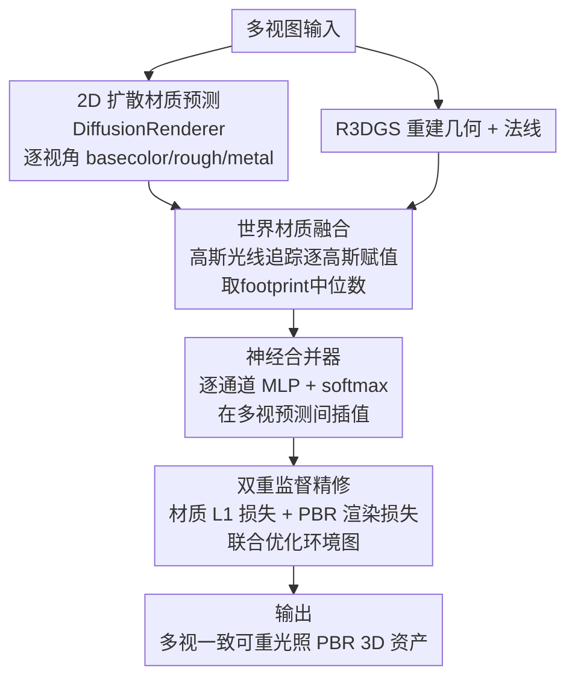

# MatSpray: Fusing 2D Material World Knowledge on 3D Geometry

**会议**: CVPR 2026  
**论文**: [CVF Open Access](https://openaccess.thecvf.com/content/CVPR2026/html/Langsteiner_MatSpray_Fusing_2D_Material_World_Knowledge_on_3D_Geometry_CVPR_2026_paper.html)  
**代码**: 项目页 https://matspray.jdihlmann.com/  
**领域**: 3D视觉 / 逆渲染 / 3D Gaussian Splatting / 可重光照  
**关键词**: PBR 材质, 高斯光线追踪, 多视一致, 神经合并器, 可重光照

## 一句话总结
MatSpray 把任意 2D 扩散材质预测器对每个视角估出的 PBR 贴图（basecolor/roughness/metallic），通过高斯光线追踪"喷"到 3D 高斯几何上，再用一个 softmax 神经合并器跨视角融合 + PBR 渲染损失监督，得到去除烘焙光照、多视一致、可重光照的 3D 材质资产，重建时间比 IRGS 快约 3.5×。

## 研究背景与动机

**领域现状**：从随手拍的多视图重建可编辑、可重光照的真实感场景，是视觉与图形的核心需求。现代神经 3D 重建（NeRF / Gaussian Splatting）能产出不错的几何与外观，但往往把光照和外观纠缠在一起，得到的纹理/系数对重光照并不"物理可信"。

**现有痛点**：作者指出两条路各有短板。① 经典逆渲染需要对光照、曝光做强假设，材质空间变化时很脆弱。② 近年的 **2D 材质预测器**（扩散先验）从大规模数据学到丰富材质先验、能从图像给出像样的 PBR 贴图，但它们**只在 2D 工作**——跨视角不一致、也没附着到任何 3D 表征上。把这些 2D 材质贴图迁到重建出的 3D 几何上，仍是难题。

**核心矛盾**：2D 扩散材质先验（"世界材质知识"）很强但**逐视角各算各的、互相打架**；直接投影到 3D 会因这些不一致而产生模糊、发灰、烘焙光照残留的材质。需要一种机制既保住 2D 先验，又把它们融成一个跨视一致的 3D 表征。

**切入角度**：作者观察到，与其训练昂贵的 3D PBR 模型，不如把 2D 预测当"原料"，关键是**怎么干净地把 2D 抬升到 3D 并消除视角间冲突**——用高斯光线追踪做高效逐高斯赋值，再用一个轻量网络在"已预测值之间插值"（而非自由生成新值）来抑制不一致。

**核心 idea**：即插即用地融合可替换的 2D 扩散 PBR 先验与 3D 高斯材质优化；用 softmax 神经合并器在多视预测之间加权插值、压制烘焙光照并稳定环境图联合优化。

## 方法详解

### 整体框架
MatSpray 从多视图恢复一致的 3D PBR 材质，全流程是：先用**任意** 2D 扩散材质预测器（实测选 DiffusionRenderer）对每个视角估出 basecolor/roughness/metallic 贴图；同时用可重光照高斯泼溅（R3DGS）重建几何与法线；接着用**高斯光线追踪**把各视角 2D 材质"抬升"到每个高斯上，对每个高斯得到一组跨视角的材质估计；再用 **Neural Merger**（每个材质通道一个带 softmax 的小 MLP）把这组带冲突的估计融成单一一致值；最后在延迟着色下用两条监督损失迭代精修——材质图 L1 损失（对齐 2D 预测）+ PBR 光度渲染损失（对齐多视真值图），并联合优化一张可学习的环境图。

### 关键设计

**1. 世界材质融合：用高斯光线追踪把 2D PBR 抬升到 3D 高斯**

针对"2D 材质先验没附着到 3D、直接投影不可靠"这一痛点，作者用高斯光线追踪把每个视角的 2D 材质赋到对应高斯上。沿用 Mai 等人按密度决定每个高斯/椭球对光线贡献的思路，并采用 Moenne-Loccoz 等人的形式让 Gaussian Splatting 的不透明度 $\alpha$ 可直接用于光追：对均值 $\boldsymbol\mu$、协方差 $\boldsymbol\Sigma$ 的高斯，沿光线 $(\mathbf{o},\mathbf{d})$ 的最大响应点 $\tau_{\max}=\frac{(\boldsymbol\mu-\mathbf{o})^\top\boldsymbol\Sigma^{-1}\mathbf{d}}{\mathbf{d}^\top\boldsymbol\Sigma^{-1}\mathbf{d}}$，对应不透明度 $\alpha_{\max}=\alpha\cdot\exp(-\tfrac12\lambda(\mathbf{x}_{\max}-\boldsymbol\mu)^\top\boldsymbol\Sigma^{-1}(\mathbf{x}_{\max}-\boldsymbol\mu))$。每个高斯在其投影 footprint 内收集像素材质，为抑制离群与重叠 footprint 的色偏，对每个视角取**中位数** $\mathbf{m}_{g,v_i}=\mathrm{median}_{p\in\mathrm{fp}_{g,v_i}}(\mathbf{m}_p)$；没被任何视角击中的高斯被剔除。这条 pipeline 的妙处在于 2D 预测器**可即插即换**（作者实测 DiffusionRenderer 比 Marigold、RGB↔X 的 PSNR 高约 30% 故选它），不依赖昂贵的大规模 3D PBR 训练数据。

**2. 神经合并器：softmax 在多视预测之间插值，而非自由生成**

经过抬升，每个高斯 $g$ 都有一组跨视角材质数组（如 $\text{basecolor}_g=\{b_{g,1},\dots,b_{g,n}\}$），但这些值彼此冲突（DiffusionRenderer 逐 batch 预测、跨视会漂移）。Neural Merger 的核心思想是**只在已预测值之间插值、不让网络凭空生成新颜色**，以保住扩散先验携带的世界知识同时强制跨视一致。对每个高斯，输入是各视角材质值 $\mathbf{m}_{g,v}$ 加位置编码后的 $\mathbf{p}_g$，经轻量 MLP $f_\theta$ 输出未归一化权重 $[h_{g,1},\dots,h_{g,V}]$，再 softmax 归一 $w_{g,v}=\frac{\exp(h_{g,v})}{\sum_{v'}\exp(h_{g,v'})}$，最终材质为加权和 $\mathbf{m}_g=\sum_v w_{g,v}\mathbf{m}_{g,v}$。softmax 至关重要：没有它，合并器会比环境图优化更快收敛、产出只在数值上贴近真值却不真实的材质；而 softmax 倾向于"坍缩"到少数输入参数、自动排除偏离真值的预测，从而在保证物理可信的同时让环境图稳定收敛。作者对**每个材质通道用独立的合并器**，以更好地解耦各通道材质。

**3. 双重监督精修：材质 L1 + 延迟着色 PBR 渲染损失 + 环境图联合优化**

合并器产出的逐高斯材质被光栅化成材质图，再用两条互补监督迭代精修。其一是材质监督：把渲染的材质图对齐 2D 扩散预测，$\mathcal{L}_{\text{Image}}=\|\mathbf{M}_{\text{render}}-\mathbf{M}_{\text{2D}}\|_1$，**只作用于合并器**（保住 2D 先验、压制烘焙光照）。其二是渲染监督：用延迟着色 + 基于图像的光照渲出 PBR 图像，对齐多视真值（用掩膜图以抑制 floater），$\mathcal{L}_{\text{3DGS}}=\lambda L_1(\mathbf{I}_{\text{PBR}},\mathbf{I}_{\text{GT}})+(1-\lambda)L_{\text{SSIM}}(\mathbf{I}_{\text{PBR}},\mathbf{I}_{\text{GT}})$（典型 $\lambda=0.8$），它同时监督合并器与环境图估计。两条损失配合，使最终渲染既忠于输入视角、又能把"基色去光照、粗糙度/金属度跨视一致"做对。

### 损失函数 / 训练策略
几何阶段 3D 高斯优化 30000 次迭代，材质精修 10000 次。Neural Merger 为每个通道（basecolor/roughness/metallic）配独立 MLP，3 个隐层各 128 神经元 + ReLU，末层输出经 softmax 的逐视角权重。对高反光物体，作者把 DiffusionRenderer 的法线当 RGB 来训练高斯几何，帮助引导几何（高反光面单独训高斯易出洞）。全部实验在单张 RTX 4090 上跑。

## 实验关键数据

在 Navi 系列合成与真实数据上评测，对比"扩展版 R3DGS"（改造以支持金属材质）与 IRGS。指标用 **PSNR / SSIM / LPIPS**（材质估计比预测与真值贴图、重光照比新光照下渲染与真值渲染）。

### 主实验

17 个合成物体（ARIA Dataset，含真值材质图）：

| 任务 | 指标 | **MatSpray** | Ext. R3DGS | IRGS |
|------|------|--------------|------------|------|
| 重光照 | PSNR↑ | **27.282** | 25.483 | 24.409 |
| 重光照 | LPIPS↓ | **0.080** | 0.094 | 0.166 |
| BaseColor | PSNR↑ | **21.341** | 18.360 | 19.204 |
| Roughness | PSNR↑ | 15.331 | 14.473 | **16.182** |
| Metallic | PSNR↑ | ∞*/27.202 | 10.073 | N/A |

> *非金属物体本文能正确把金属度优化到 0，全 0 时 PSNR 为无穷大，实际统计中剔除。IRGS 无法预测金属度。

跨数据集泛化（PSNR，对比含不产材质的 LightSwitch、做图到图重光照的 Neural Gaffer）：

| 方法 | ARIA | Stanford Orb | NeRF Syn. |
|------|------|--------------|-----------|
| LightSwitch | 16.3 | 23.4 | 17.7 |
| Neural Gaffer | 23.8 | 28.0 | 22.0 |
| Ext. R3DGS | 25.4 | 29.4 | 22.7 |
| IRGS | 24.4 | 30.2 | 23.5 |
| **MatSpray** | **27.3** | **31.2** | **25.4** |

### 消融实验

| 配置 | PSNR↑ | SSIM↑ | LPIPS↓ | 说明 |
|------|-------|-------|--------|------|
| Full（含 Neural Merger） | **29.164** | **0.9105** | **0.0626** | 完整模型 |
| Supervised（仅 2D 监督、无 3D 优化） | 24.809 | 0.889 | 0.0792 | 甚至差于纯投影平均 |
| Proj. Average（直接投影取平均） | 25.555 | 0.866 | 0.122 | 作者的初始化 |

### 关键发现
- **Neural Merger 是性能主因**：完整模型在三项指标上都明显优于消融变体；它把 DiffusionRenderer 的逐视角漂移压成跨视一致表征。
- **只用 2D 监督反而最差**：Supervised 变体（无几何/光度优化）甚至不如简单投影平均，说明优化出的高斯捕捉到的视角相关效应是必要的。
- **金属/高反光是优势区**：本文能正确预测金属度并把非金属优化到 0，而 IRGS 完全无法出金属图、Ext. R3DGS 在高反光面会过亮过糙。Roughness 上 IRGS 的 PSNR 略高，但本文 SSIM/LPIPS 更好（粗糙度估计对所有方法都难）。
- **效率**：比 IRGS 少约 3.5× 的逐场景优化时间。

## 亮点与洞察
- **即插即用**：2D 材质预测器可任意替换，方法本身不绑定特定扩散模型，能随上游 2D 模型进步自动受益，工程上很实用。
- **"插值不生成"的合并器**：softmax 强制在已预测值间加权、自动排除离群预测，是同时保住先验与稳定环境图优化的关键 trick，可迁移到其他"多源带噪估计融合"场景。
- **逐通道独立合并器**：把 basecolor/roughness/metallic 解耦处理，避免通道间相互污染。

## 局限与展望
- 作者承认材质质量**强依赖所选 2D 扩散模型**的表现，尽管 PBR-to-image 损失能部分纠正小偏差。
- 当底层 R3DGS 产出不一致的几何/法线时方法会吃力；很小或很扁的高斯有时在光追中被漏掉。
- 改进方向：更鲁棒的几何先验、对漏检高斯的补救、以及随更强 2D 材质模型的持续升级。

## 相关工作与启发
- **vs R3DGS / IRGS**：两者都逐场景优化材质 + 几何；本文改为用高斯光线追踪把 2D 扩散估计抬升到 3D，借扩散先验获得更快、更一致的重建，且能产金属图（IRGS 不能）。
- **vs DiffusionRenderer（2D 预测器）**：本文把它当可替换的上游原料，并用 Neural Merger 修掉其逐视角不一致——视频式材质模型仍难解决的多视一致问题。
- **vs LightSwitch / Neural Gaffer**：这些方法做重光照但不产显式材质；本文额外产出可重光照的显式 PBR 资产，跨数据集 PSNR 均更高。

## 评分
- 新颖性: ⭐⭐⭐⭐ 高斯光线追踪 + softmax 插值合并器把 2D 材质先验抬升到 3D 的组合较新
- 实验充分度: ⭐⭐⭐⭐ 三数据集 + 多基线 + 关键消融，但部分指标只在子集上、缺运行时细表
- 写作质量: ⭐⭐⭐⭐ 流程清晰、动机扎实；⚠️ 缓存 OCR 致少量公式符号需以原文为准
- 价值: ⭐⭐⭐⭐ 无需 3D PBR 训练即得可重光照资产，对内容生产 pipeline 实用价值高

<!-- RELATED:START -->

## 相关论文

- [\[CVPR 2026\] ICTPolarReal: A Polarized Reflection and Material Dataset of Real World Objects](ictpolarreal_a_polarized_reflection_and_material_dataset_of_real_world_objects.md)
- [\[CVPR 2026\] Beyond Geometry: Artistic Disparity Synthesis for Immersive 2D-to-3D](beyond_geometry_artistic_disparity_synthesis_for_immersive_2d-to-3d.md)
- [\[CVPR 2026\] Material Magic Wand: Material-Aware Grouping of 3D Parts in Untextured Meshes](material_magic_wand_material-aware_grouping_of_3d_parts_in_untextured_meshes.md)
- [\[CVPR 2026\] Intrinsic Image Fusion for Multi-View 3D Material Reconstruction](intrinsic_image_fusion_for_multi-view_3d_material_reconstruction.md)
- [\[CVPR 2026\] SPARK: Sim-ready Part-level Articulated Reconstruction with VLM Knowledge](spark_sim-ready_part-level_articulated_reconstruction_with_vlm_knowledge.md)

<!-- RELATED:END -->
