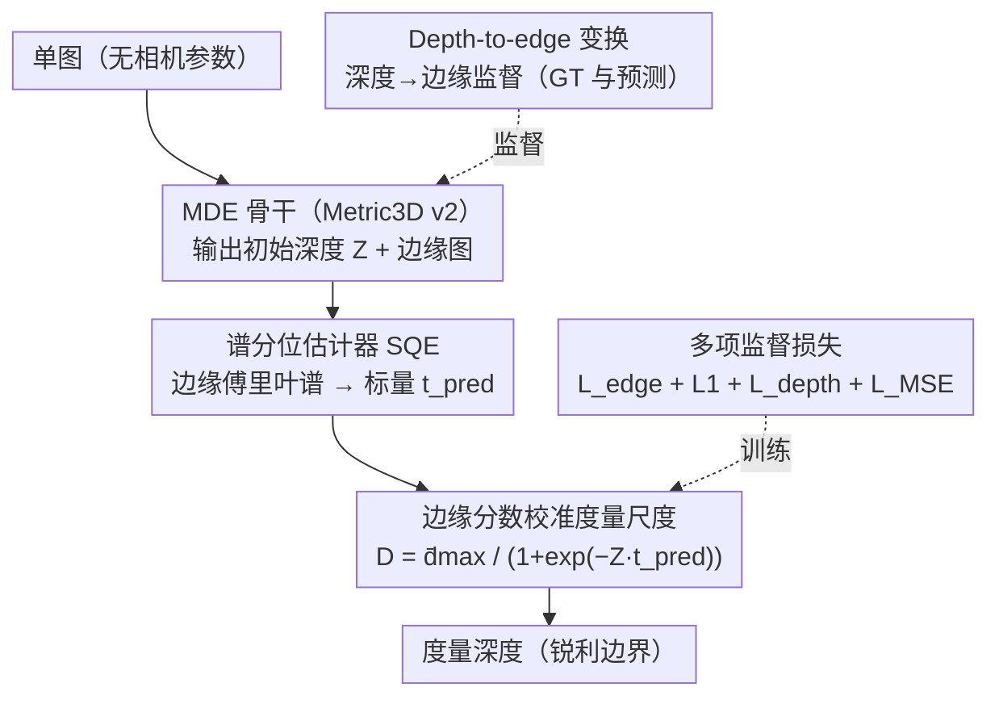

# MD2E: Modeling Depth-to-Edge Cues for Monocular Metric Depth Estimation

**会议**: CVPR 2026  
**论文**: [CVF Open Access](https://openaccess.thecvf.com/content/CVPR2026/html/Ning_MD2E_Modeling_Depth-to-Edge_Cues_for_Monocular_Metric_Depth_Estimation_CVPR_2026_paper.html)  
**代码**: 项目页 https://2j472no.github.io/MD2E/ （代码是否开源未明确 ⚠️）  
**领域**: 3D视觉  
**关键词**: 单目度量深度、无相机内参、边缘谱线索、频域校准、零样本泛化

## 一句话总结
针对"训练/推理都不给相机内参时单目度量深度尺度不可恢复"的难题，本文发现焦距与场景深度耦合变化时 RGB 几乎不变、但**边缘的频谱统计会系统性漂移**，于是提出谱分位估计器 SQE 从预测边缘图的傅里叶谱里抽一个标量分数当尺度代理来校准深度，整套 MD2E 在 6 个未见基准的零样本和微调设置下都取得 MMDE 的 SOTA（如 iBIMS-1 上 A.Rel 降 53.0%、RMS 降 41.9%）。

## 研究背景与动机
**领域现状**：单目深度估计（MDE）是自动驾驶、AR、SLAM 等的基础。MiDaS 用尺度-平移不变损失混合异构数据做出强零样本相对深度，后续 DPT、Depth Anything 把骨干和数据规模继续推大。但相对深度只给点序、在任意单调变换下不变，**绝对尺度未定**，无法满足 3D 检测、数字孪生重建、机器人抓取等需要度量值的任务。

**现有痛点**：恢复绝对尺度的主流路线高度依赖相机内参——Metric3D / Metric3D v2 用规范相机归一化 + 内参重缩放，但训练和推理都预设标定好的内参。为去掉这一依赖，UniDepth / UniDepthV2 学稠密相机表示、Depth Pro 内嵌焦距预测模块，但它们要么需要相机标注做监督、要么把相机表示当成额外学习负担。

**核心矛盾**：当焦距和场景深度**一起变化**时，同一目标在 RGB 图里的外观几乎不变（见论文图 1：同一把椅子在 focal=20mm/depth=2m 与 focal=8.5mm/depth=1m 下 RGB 难以区分），于是网络从 RGB 里读不出尺度——这正是无内参 MMDE 的根本困难。但作者观察到一个被忽略的信号：**边缘图随之系统性变化**，边缘厚度、边缘能量在空间频率上的分布都随焦距/深度耦合而漂移。

**本文目标**：在训练和推理都**不用任何相机参数**的前提下，从单图预测度量深度；同时保持边界锐利。

**切入角度**：既然尺度信息藏在边缘的频谱里而不在 RGB 外观里，那就显式建模"深度→边缘"线索，从边缘频谱里提取一个对尺度敏感的标量来校准深度。

**核心 idea**：把稠密深度标注转成边缘监督、预测边缘图，再用谱分位估计器（SQE）从边缘频谱算出分数 $t_{pred}$ 当尺度代理校准深度，顺带用边缘预测正则化深度边界。

## 方法详解
### 整体框架
MD2E 以 Metric3D v2 为 MDE 骨干，但去掉其深度-法向联合优化模块、换成两个卷积预测头分别输出初始深度场 $Z$ 和边缘图 $\mathcal{E}_{pred}$。整体流程：输入图过 MDE 模型得到边缘图和初始深度；稠密深度标注经"depth-to-edge"变换得到边缘标注监督边缘分支；预测边缘图喂进 SQE 得到尺度分数 $t_{pred}$，用它把初始深度校准到度量尺度；同时预测边缘又反过来约束深度边界使其锐利。这是一个"边缘当中介、频谱当尺度尺"的多分支串行结构：

### 关键设计

**1. Depth-to-edge 变换：从深度标注造干净边缘监督，避开纹理高频噪声**

直接用 RGB 边缘当监督会混入大量纹理高频、且真实数据集深度标注在边缘处常缺失/不连续。本文改从**深度图**导出边缘：先把深度转成逆深度（强调近处几何不连续、在平面上更一致），再沿水平/垂直/两条 ±45° 对角方向聚合对称有限差分得到方向显著度 $S(x)=\sum_{u\in\mathcal{K}}\lvert\gamma_u D^{-1}(x)\rvert$（其中 $\gamma_u D^{-1}(x)=D^{-1}(x+u)-D^{-1}(x-u)$）；接着在每个 $3\times3$ 邻域做局部 softmax 得到概率化对比 $P_x(y)$；最后边缘强度取"中心权重减邻域最小值" $E(x)=P_x(x)-\min_{y\in\mathcal{N}(x)}P_x(y)$，得到空间自适应的高对比边界。对 GT 深度用全局 0.9 分位阈值二值化成边缘标签；对预测深度则额外接一个轻量 $1\times1$ 卷积头去对齐二值标签、且与深度回归头解耦以免影响度量精度。这样得到的边缘监督既干净、又规避了 GT 深度在边界处的标注缺陷。

**2. 谱分位估计器 SQE：把"焦距/场景如何改变边缘"压成一个可微的标量尺度代理**

这是全文核心。焦距改变会让同一结构投影到不同像素跨度，从而改变边缘厚度和边缘能量在空间频率上的分布；场景类型（室内密集人造边缘 vs 室外大平面）也会重分布径向频率上的边缘能量。SQE 用一个标量概括这些效应：先算去均值、加可学习窗 $w$（平窗与可分 Hann 窗的凸组合）的功率谱 $\Phi(f)=\lvert\mathcal{F}\{(w\odot\mathcal{E})-\mathrm{mean}(w\odot\mathcal{E})\}(f)\rvert^2$；用可学习截止 $r_0$ 的平滑径向高通 $\Phi_h(f)=\Phi(f)\,(1-\exp(-(r(f)/r_0)^2))$ 抑制低频偏置、突出细结构；再用高斯软分配把高通谱聚成 $K$ 个径向 bin $R_k$，归一化并累积得到累积径向能量 $C_k=\sum_{j\le k}p_j$；在可学习分位 $p$ 处按与 $C_k$ 的接近度软取分位位置 $f_p$（$\lambda$ 控制软度）；最后用平滑下界反尺度把 $f_p$ 转成对高频集中度敏感、在小 $f_p$ 处稳定的无量纲分数 $t$。直观上：**边缘越细越锐（高频集中、$f_p$ 大）→ $t$ 越小；边缘越宽越低频 → $t$ 越大**，从而提供一个随焦距与场景布局变化的紧凑尺度信号。

**3. 边缘分数校准度量尺度：用 $t_{pred}$ 当 sigmoid 温度把相对深度拉成绝对深度**

得到 $t_{pred}=\mathrm{SQE}(\mathcal{E}_{pred})$ 后，它在度量化前直接调制深度 logits：

$$D_{pred}=\frac{\bar d_{\max}}{1+\exp(-\,Z\,t_{pred})},$$

其中 $\bar d_{\max}$ 是固定最大深度常数、$Z$ 是初始深度场。$t_{pred}$ 相当于 sigmoid 的"温度/增益"，它越大输出深度越被拉向大尺度——这就把"边缘频谱里读出的尺度线索"显式注入到度量深度里。作者还做了相关性分析验证 $t_{pred}$ 的物理含义：拟合 $\hat t_{pred}=-1.895(f_x/W)^{0.1}+0.013(d_{\max})^{0.5}+10.372$，Pearson $P\approx0.698$，说明 $t_{pred}$ 主要由归一化焦距 $f_x/W$ 与场景最大深度 $d_{\max}$ 联合决定——即它同时编码了相机设置和场景尺度，能替代传统的 $f_x/W$ 校准。

**4. 多项监督损失：边缘监督 + 分数对齐 + 度量深度 + 边缘锐化**

四项损失协同：(1) 边缘监督用类平衡交叉熵 $\mathcal{L}_{edge}=-\sum_l[\theta\rho_l^*\log\rho_l+(1-\theta)(1-\rho_l^*)\log(1-\rho_l)]$ 处理前景/背景边缘失衡（$\theta=n^-/(n^++n^-)$）；(2) $\mathcal{L}_1=\lvert t_{pred}-t_{GT}\rvert$ 强制预测边缘与 GT 边缘的 SQE 分数一致（$t_{GT}=\mathrm{SQE}(E_{GT})$）；(3) 度量深度损失 $\mathcal{L}_{depth}=\frac{1}{M}\sum\xi_m^2-\frac{0.85}{M^2}(\sum\xi_m)^2$（$\xi_m=\log D_{pred}(m)-\log D_{GT}(m)$，即带方差项的尺度不变对数损失）；(4) $\mathcal{L}_{MSE}=\sum_o(\mathcal{E}_{pred}(o)-\mathcal{E}_D(o))^2$ 让预测边缘与"从预测深度再导出的边缘"一致，以对抗 GT 深度的稀疏与边界不精。总损失 $\mathcal{L}=0.1\mathcal{L}_{edge}+\mathcal{L}_1+100\,\mathcal{L}_{depth}+\mathcal{L}_{MSE}$。

### 损失函数 / 训练策略
骨干用 Metric3D v2 预训练的 ViT-L、重初始化 DPT 解码器。AdamW，batch 16，基础学习率 $1\times10^{-4}$、编码器学习率乘子 0.01，多项式衰减退火到 0、共 $10^6$ 迭代。训练池从 Metric3D v2 的子数据集采（DDAD、Cityscapes、Virtual KITTI、Matterport3D、Hypersim 等），上限 4M RGB-深度对；边缘监督只用 Virtual KITTI 和 Hypersim（深度稠密可靠）。全程 8×A100 约 4 天。

## 实验关键数据

### 主实验（零样本，6 个未见基准）
指标说明：**A.Rel** = 绝对相对误差（越低越好）；**RMS** = 均方根误差（越低越好）。MD2E 与 Metric3D v2 公平对比时不用相机参数和法向标注。

| 基准 | 指标 | MD2E | Metric3D v2 | UniDepthV2 | Depth Pro |
|------|------|------|-------------|------------|-----------|
| iBIMS-1（室内） | A.Rel↓ / RMS↓ | **0.087 / 0.344** | 0.185 / 0.592 | 0.090 / 0.373 | 0.162 / 0.588 |
| NYUv2（室内） | A.Rel↓ / RMS↓ | **0.057 / 0.212** | 0.063 / 0.251 | 0.076 / 0.269 | 0.111 / 0.378 |
| ETH3D（室外） | A.Rel↓ / RMS↓ | 0.277 / **1.512** | 0.357 / 2.980 | 0.256 / 1.617 | 0.403 / 3.699 |
| KITTI（室外） | A.Rel↓ / RMS↓ | **0.050 / 1.801** | 0.052 / 2.511 | 0.103 / 2.765 | 0.257 / 4.368 |
| DIODE 室外 | A.Rel↓ / RMS↓ | **0.209 / 3.728** | 0.221 / 3.897 | 1.231 / 15.928 | 0.576 / 10.930 |

相对 Metric3D v2：iBIMS-1 上 A.Rel 降 53.0%、RMS 降 41.9%，ETH3D / KITTI 的 RMS 分别降 49.3% / 28.3%。和学相机表示的 UniDepthV2 相比，室外差距尤其大（DIODE 室外 A.Rel 0.209 vs 1.231）。in-domain 微调（NYUv2/KITTI）上也全面领先：相对单数据集 SOTA IEBins，NYUv2 / KITTI 的 A.Rel 各降 49.4% / 30.0%，KITTI $\mathrm{RMS}_{log}$ 降 30.7%。

### 消融实验（1M 样本 / $10^5$ 迭代，6 基准平均）
| 变体 | δ1↑ | A.Rel↓ | RMS↓ | 说明 |
|------|-----|--------|------|------|
| MD2E（完整） | 0.604 | 0.233 | 2.873 | 完整模型 |
| w/o SQE | 0.251 | 0.527 | 5.734 | 去掉尺度校准 → 泛化崩溃 |
| w/o $\mathcal{L}_{edge}$&$\mathcal{L}_{MSE}$ | 0.325 | 0.478 | 5.023 | 去掉边缘监督 |
| w/o $\mathcal{L}_1$ | 0.572 | 0.261 | 3.028 | 不对齐 SQE 分数 |
| w/o $\mathcal{L}_{MSE}$ | 0.599 | 0.240 | 2.892 | 不做边缘锐化 |

### 关键发现
- **SQE 是命门**：去掉 SQE（即不做深度校准）零样本泛化直接崩溃，δ1 从 0.604 跌到 0.251（相对降 58%），A.Rel / RMS 暴涨 126% / 100%——尺度代理一旦撤掉，无内参 MMDE 就失去尺度锚点。
- **边缘监督几乎同等重要**：去掉 $\mathcal{L}_{edge}$ 和 $\mathcal{L}_{MSE}$，δ1 降到 0.325；此时 SQE 只拿到含噪特征图，估不准谱分位分数。
- $\mathcal{L}_1$（分数对齐）带来稳定小幅增益（δ1 0.572→0.604），$\mathcal{L}_{MSE}$（边缘锐化）影响最小（δ1 0.604 vs 0.599），主要贡献在边界锐度而非整体精度。

## 亮点与洞察
- **"RGB 不变但边缘频谱变"这一观察是全文最 aha 的地方**：在大家都盯着 RGB / 相机参数找尺度时，作者从被忽略的边缘频域里找到一个对焦距和场景都敏感的尺度信号，绕开了对内参的依赖。
- 把尺度校准做成一个**可微、可学习参数化**的 SQE（窗、截止、bin、分位、软度全可学），而非手工规则，既可端到端训练又有清晰物理解释（Pearson 0.698 验证 $t_{pred}\sim f_x/W$ 与 $d_{\max}$）。
- "从深度导边缘当监督"而非"从 RGB 取边缘"的取舍，规避纹理高频噪声与边界标注缺失——这个数据侧的清洗思路可迁移到任何需要边缘/边界监督的稠密预测任务。

## 局限与展望
- SQE 的核心假设是"边缘频谱能稳定反映尺度"，在边缘稀疏/严重模糊/强纹理干扰的场景下，谱分位分数可能不可靠（消融也显示去掉边缘监督就崩），鲁棒性边界未充分探讨。
- 边缘监督只用 Virtual KITTI 和 Hypersim 这类深度稠密可靠的数据，对真实稀疏深度（如 LiDAR）的适配仅靠 $\mathcal{L}_{MSE}$ 间接处理，泛化到更恶劣标注的可靠性存疑 ⚠️。
- 仍以 Metric3D v2 的预训练骨干和子数据集为基础，端到端从零训练的表现未知；代码是否开源未在正文明确。改进方向：把 SQE 推广到视频/多帧时序一致校准、或与轻量相机表示融合互补。

## 相关工作与启发
- **vs Metric3D / Metric3D v2**：它们用规范相机 + 内参重缩放恢复尺度、训练推理都要标定内参；本文完全不用相机参数，用边缘谱分数当尺度代理，且在多数基准上反超。
- **vs UniDepthV2**：它学稠密相机表示来推尺度，本文换成"边缘频谱"这一更直接的尺度线索，室外大场景上差距尤其明显（DIODE 室外 A.Rel 0.209 vs 1.231）。
- **vs Depth Pro**：它内嵌焦距预测模块、靠相机标注监督学尺度，本文无需任何相机标注；且 Depth Pro 切 patch 推理削弱全局交互、度量精度受损，本文保持全局推理。
- **vs 既有边缘线索 MDE（UniDepthV2 的 edge-guided loss、各类 RGB 边缘正则）**：以往多用 RGB 边缘做边界锐化，本文首次把**深度导出的边缘 + 频谱分析**用作零样本 MMDE 的尺度线索。

## 评分
- 新颖性: ⭐⭐⭐⭐⭐ 首次把边缘频谱当无内参 MMDE 的尺度代理，观察独到、SQE 设计巧妙
- 实验充分度: ⭐⭐⭐⭐ 6 基准零样本 + in-domain + 消融 + 相关性分析较完整，但缺更恶劣标注/视频场景验证
- 写作质量: ⭐⭐⭐⭐ 动机和公式推导清晰，图 1 直观点题；SQE 公式偏密集需细读
- 价值: ⭐⭐⭐⭐⭐ 去掉相机内参依赖、零样本 SOTA，对 SLAM/机器人等无标定场景实用价值高

<!-- RELATED:START -->

## 相关论文

- [\[CVPR 2026\] UniDAC: Universal Metric Depth Estimation for Any Camera](unidac_universal_metric_depth_estimation_for_any_camera.md)
- [\[CVPR 2026\] Radar-Guided Polynomial Fitting for Metric Depth Estimation](radar-guided_polynomial_fitting_for_metric_depth_estimation.md)
- [\[CVPR 2026\] The Midas Touch for Metric Depth](the_midas_touch_for_metric_depth.md)
- [\[CVPR 2026\] Depth Hypothesis Guided Iterative Refinement for Event-Image Monocular Depth Estimation](depth_hypothesis_guided_iterative_refinement_for_event-image_monocular_depth_est.md)
- [\[CVPR 2026\] Seeing Depth Through Frequency and Motion: A Progressive Training Paradigm for Monocular Depth Estimation](seeing_depth_through_frequency_and_motion_a_progressive_training_paradigm_for_mo.md)

<!-- RELATED:END -->
