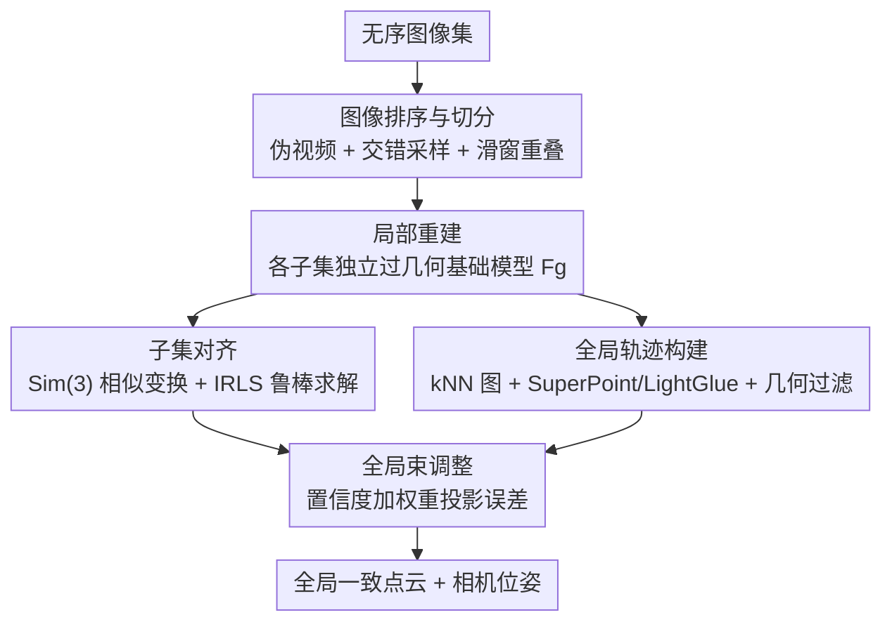

# MERG3R: A Divide-and-Conquer Approach to Large-Scale Neural Visual Geometry

**会议**: CVPR 2026  
**论文**: [CVF Open Access](https://openaccess.thecvf.com/content/CVPR2026/html/Cheng_MERG3R_A_Divide-and-Conquer_Approach_to_Large-Scale_Neural_Visual_Geometry_CVPR_2026_paper.html)  
**代码**: 待确认  
**领域**: 3D视觉  
**关键词**: 神经视觉几何, 大规模重建, 分治法, 全局束调整, 显存可扩展性

## 一句话总结
MERG3R 是一个**无需训练**的分治框架，把上千张无序图像先排序、再切成有重叠的子集分别用 VGGT/π³ 这类几何基础模型重建，最后通过全局对齐 + 置信度加权束调整拼成全局一致的点云，让原本受限于显存的前馈式重建模型能处理远超其原生上限的图像集。

## 研究背景与动机

**领域现状**：以 DUSt3R、MASt3R、VGGT、π³、MapAnything 为代表的前馈式神经视觉几何模型，能直接从一组 2D 图像端到端地同时预测相机内外参和稠密点云，精度上已经超过传统 SfM + MVS 流水线，成为新主流。

**现有痛点**：这些模型几乎都是「单体 Transformer」，必须把所有输入图像一次性塞进网络做全局注意力。视觉 token 数随图像数线性增长，而 self-attention 的计算和显存随之**平方级**膨胀。结果是几百张图就把显存撑爆，根本无法面对城市级建模、上千张图的真实场景。

**核心矛盾**：现有改进路线在「显存可扩展性」和「几何精度」之间二选一。一类（VGGT-Long、FastVGGT、Fast3R）靠分块或 token 合并降算力，但破坏了长程几何推理，宽视角变化时位姿/深度明显退化，且 FastVGGT/Fast3R 仍要同时编码全部图像、没真正摆脱显存上限；另一类（CUT3R、TTT3R）靠逐图独立预测 + 多视图融合天然可扩展，但缺少跨全部图像的全局几何表示，图越多精度掉得越快。

**本文目标**：要一个对**大规模、无序**图像集都鲁棒的分治流水线，既突破显存瓶颈、又不牺牲全局几何一致性。

**切入角度**：作者回到经典 SfM 在大规模场景里用了几十年的「分治」思路——按视觉相似度分块、再全局对齐合并，把它嫁接到神经几何模型上；并且不改模型、纯在外围做图像编排与几何优化，因此对任意预训练几何基础模型即插即用。

**核心 idea**：把无序图像**伪视频化并切成有重叠子集**逐块重建，再用**全局束调整**把这些局部重建拼成全局一致的模型——用「怎么切图 + 怎么拼回去」换显存可扩展性。

## 方法详解

### 整体框架
MERG3R 不训练任何网络，整条流水线围绕一个几何基础模型 $F_g$（输入一组图像，输出相机参数 $G$、深度/点图 $D$、置信度 $C$）展开，分四步：① 把无序图像集排成「伪视频」并切成有重叠的子集；② 每个子集独立喂给 $F_g$ 得到局部重建；③ 把相邻子集对齐到同一参考系，并跨子集建立稀疏的多视图轨迹（track）；④ 在这些置信度加权的轨迹上做一次全局束调整，联合优化所有相机内外参和 3D 点。关键收益是：单体模型处理全部 $N$ 张图是 $O(N^2)$ 注意力，切成 $K$ 个大小为 $T$ 的子集后降到 $O(KT^2)=O(N^2/K)$，峰值显存随之下降且子集间可多 GPU 并行。

### 关键设计

**1. 两步图像编排：伪视频排序 + 交错采样切分**

无序图像若随便切，子集里要么视角几乎一样（局部重建不可靠），要么相邻子集没重叠（拼不回去）。作者先在所有图像上算 DINO 视觉相似度矩阵 $M\in\mathbb{R}^{N\times N}$，把它当成带权完全图，求一条**哈密顿路径**让相邻帧相似度之和最大，得到一个伪时序排列 $P^*=\arg\max_P\sum_{k=1}^{N-1}M_{p_k,p_{k+1}}$——相当于把无序图像「串成一段视频」。然后做**交错采样**：第 $i$ 个元素取 $\tilde P_i = P^*\{(i \bmod K)\cdot K + \lfloor i/K\rfloor\}$，让每个子集从整条序列里循环抽帧，避免某个子集只拿到时序相邻、过于相似的视角；最后在 $\tilde P$ 上用长度 $T$、步长 $T-O$ 的滑窗切出子集，保证相邻子集有 $O$ 帧重叠作为后续对齐约束。这套设计直接对应「视角多样性」与「子集间重叠」两个硬约束，是分治能成立的前提。

**2. 子集对齐：置信度加权的 Sim(3) 鲁棒变换**

各子集独立重建后处在各自坐标系，且重叠区域的点图也未必一致，直接拼会错位。作者沿用并改造 VGGT-Long 的加权相似变换估计：对相邻子集 $S_k,S_{k+1}$ 先找出对应 3D 点对 $\{(p_k^i,p_{k+1}^i)\}$ 及其置信度，按百分位阈值 $\tau_{conf}$ 滤掉低置信点，再求一个 $\mathrm{Sim}(3)$ 相似变换 $T$ 最小化 Huber 鲁棒目标 $T^*_{k,k+1}=\arg\min_{T}\sum_i \rho(\lVert p_k^i - T p_{k+1}^i\rVert_2)$。用**迭代重加权最小二乘（IRLS）**求解，每轮权重 $w_i^{(t)} = c_i\,\rho'(r_i^{(t)})/r_i^{(t)}$ 把置信度 $c_i$ 和残差结合，残差大的对应点逐步降权。这一步把所有子集对齐进同一全局参考系，鲁棒损失保证少量误匹配不会带偏整体。

**3. 可扩展轨迹构建：稀疏 kNN 匹配 + 几何一致性过滤**

全局束调整需要可靠的跨视图像素对应，但朴素两两匹配是平方复杂度。作者对每个子集用相似度矩阵 $M$ 建稀疏 kNN 图，仅对保留的边 $(i,j)$ 抽 SuperPoint 特征、用 LightGlue 匹配（且 $(i,j)$ 匹配过就跳过 $(j,i)$ 改取下一个近邻），把匹配数压到随图像数**线性** $O(kN)$。由于 LightGlue 会产生误匹配，作者再做几何一致性过滤：把原始匹配按各自深度图反投影到 3D、再用已知内外参重投影回配对视图，双向重投影误差超过 $\tau_{reproj}$ 的丢弃。剩余对应用并查集合并成多视图轨迹 $T_l$，每条轨迹的 3D 位置与置信度由各像素点按置信度加权平均得到（$x_l=\sum_k C_{i_k}x^{l,i_k}/\sum_k C_{i_k}$）。这保证了在大规模场景下既有跨子集的可靠约束、又不爆复杂度。

**4. 高效全局束调整：置信度加权重投影误差**

对齐只是刚性拼接，要进一步提全局一致性和精度，作者在合并后的多视图轨迹上做一次梯度下降的全局束调整，联合优化相机内外参 $R,t,K$ 和 3D 点 $P$：$L_{BA}=\sum_{(T_l,x_l,C_l)\in T} C_l \sum_{y_{l,i}\in T_l}\lVert y_{l,i}-\pi_i(x_l)\rVert_2^{\lambda}$，其中 $\pi_i$ 是把 3D 点投到第 $i$ 张图的投影，$\lambda=0.5$，轨迹整体置信度 $C_l$ 作权重。和 MASt3R-SfM 在**逐图像对**上做梯度优化不同，MERG3R 直接在跨所有视图的轨迹上优化，因此在大量视图下能获得更好的全局一致性、精度和可扩展性。

### 损失函数 / 训练策略
本方法**无需训练**（training-free），不引入任何可学习参数，几何基础模型 $F_g$（VGGT*/FastVGGT/π³）保持预训练权重不动。流水线里的「损失」仅是推理期优化目标：子集对齐的 Huber 目标（式 3–5）和全局束调整的置信度加权重投影误差（式 8–9），分别用 IRLS 和梯度下降求解。

## 实验关键数据

评测覆盖 7-Scenes、Tanks & Temples（T&T）、Cambridge Landmarks、NRGBD 四个数据集，且**不做下采样、用全部图像**，统一在单张 64GB AMD MI210 上测时延与显存。MERG3R 与 VGGT*、π³、FastVGGT、VGGT-Long、MASt3R-SfM、CUT3R、TTT3R 等强 baseline 对比（VGGT\* 指显存优化版 VGGT）。

> 自定义/关键指标说明：RRA@τ / RTA@τ 为相对旋转/平移精度在阈值 τ 下的准确率（越高越好）；AUC@30 为阈值 30 下的曲线下面积；ATE 绝对轨迹误差、RRE/RTE 相对位姿旋转/平移误差（越低越好）；点云用 Acc.（精度）、Comp.（完整度）、N.C.（法向一致性）。

### 主实验
7-Scenes 相机位姿（含 1000 张无序图的极限规模）：

| 方法 | 500 图 RTA@30↑ | 500 图 AUC@30↑ | 1000 图 RTA@30↑ | 1000 图 AUC@30↑ |
|------|------|------|------|------|
| VGGT* | 96.87 | 81.13 | OOM | OOM |
| π³ | 97.74 | 83.89 | OOM | OOM |
| FastVGGT | 96.75 | 80.59 | OOM | OOM |
| VGGT-Long | 97.24 | 79.51 | 95.54 | 75.11 |
| CUT3R | 40.16 | 38.82 | 30.50 | 14.11 |
| TTT3R | 86.55 | 57.44 | 53.69 | 30.95 |
| **Ours + π³** | 97.74 | 82.97 | **97.69** | **83.63** |

关键信号：VGGT*/π³/FastVGGT 在 1000 张图上直接 **OOM**，而 MERG3R 套在同样的基础模型上不仅不爆显存，1000 图精度还几乎不掉（π³ 版 AUC 从 500 图的 82.97 到 1000 图的 83.63），把「图越多越好」变成现实；CUT3R/TTT3R 虽不 OOM 但精度崩塌。

T&T / Cambridge Landmarks 位姿（越低越好）：

| 方法 | T&T ATE↓ | T&T RRE↓ | T&T RTE↓ | Cambridge ATE↓ |
|------|------|------|------|------|
| π³ | 0.090 | 0.229 | 0.025 | 1.630 |
| VGGT-Long | 0.585 | 0.768 | 0.057 | 0.970 |
| MASt3R-SfM | 0.202 | 0.521 | 0.024 | 7.695 |
| **Ours + π³** | **0.077** | **0.178** | **0.013** | 1.022 |

对比传统高效 SfM（7-Scenes 500 图）：Ours+π³ 在 AUC@30 上 83.31 优于 GLOMAP（81.38）和 InstantSfM（76.32），且耗时 **4 分 48 秒** < GLOMAP 10 分 34 秒、InstantSfM 8 分 56 秒。

### 消融实验
| 配置 | 现象 | 说明 |
|------|------|------|
| 真值视频序 vs 伪视频序 | ATE 差异 ≤ 0.001 | 用无序图重排出的伪视频，几乎不输给真有序视频 |
| 显存随图像数增长 | 基本恒定 | MERG3R 显存对输入规模保持稳定，base 模型则线性/平方增长 |
| Ours + 三种 base | 均稳定提升 | 框架对 VGGT*/FastVGGT/π³ 即插即用，π³ 版整体最好 |

### 关键发现
- **怎么切图很关键**：作者明确指出图像聚类方式直接影响局部重建成败与下游全局对齐质量——伪视频排序 + 交错采样保证了视角多样性与子集重叠，是分治成立的核心。
- **显存恒定 + 多 GPU 并行**：分治把 $O(N^2)$ 降到 $O(N^2/K)$，显存随输入规模几乎不变，子集还能并行，时延也大幅下降（如 1000 图约 8.5 分钟、~20GB，对照 baseline >20 分钟、>64GB）。
- **精度不随规模退化**：与 CUT3R/TTT3R 图越多越崩相反，MERG3R 靠全局束调整维持了跨全部图像的几何一致性。

## 亮点与洞察
- **训练自由 + 模型无关**：不碰网络权重、纯外围编排，任何前馈几何基础模型都能直接套上去享受显存可扩展性，工程落地成本极低——这是把经典 SfM 分治智慧迁移到神经几何上的漂亮一招。
- **伪视频化是巧设计**：用 DINO 相似度 + 哈密顿路径把无序图像「串成视频」，既复用了为视频/有序输入设计的对齐技术，又用交错采样规避了「子集内视角太像」的坑。
- **可迁移思路**：哈密顿路径排序 + 交错滑窗切分这套「无序→伪有序→可重叠分块」的范式，可迁移到任何受显存约束、需要把大集合切块再拼回的前馈任务（如大规模点云配准、长序列 SLAM 前端）。

## 局限与展望
- 流水线步骤较多（排序 / 切分 / 对齐 / 轨迹 / 束调整），每步都有阈值超参（$\tau_{conf}$、$\tau_{reproj}$、窗长 $T$、重叠 $O$、子集数 $K$），实际部署需要调参，作者未给出自适应策略。⚠️ 论文正文未充分讨论这些超参的敏感性。
- 最终精度仍受底层几何基础模型上限约束——MERG3R 提升的是「能否扩展到大规模」与全局一致性，单子集的局部重建质量取决于所选 $F_g$。
- 依赖 SuperPoint/LightGlue 的跨视图匹配，在弱纹理/强重复结构场景下匹配可靠性可能下降，虽有几何一致性过滤兜底，但极端场景表现仍待验证。

## 相关工作与启发
- **vs VGGT / π³（单体 Transformer）**：它们一次性全局注意力、精度高但 $O(N^2)$ 显存使其几百张图就 OOM；MERG3R 把它们当作可即插即用的子集重建器，外加分治 + 全局束调整，突破显存上限而几乎不损精度。
- **vs VGGT-Long / FastVGGT / Fast3R（高效化路线）**：靠分块/token 合并降算力，但 VGGT-Long 需有序输入、分块伤重建质量，FastVGGT/Fast3R 仍要同时编码全部图像故未真正摆脱显存；MERG3R 直接面向**无序大集合**，子集独立重建、显存恒定。
- **vs CUT3R / TTT3R（逐图独立）**：天然可扩展但缺全局几何表示，图越多精度越崩；MERG3R 用跨子集轨迹 + 全局束调整维持全局一致性，规模增大精度不退化。
- **vs MASt3R-SfM（梯度式 SfM）**：在逐图像对上优化，限制了全局一致性与可扩展性；MERG3R 在跨所有视图的多视图轨迹上做束调整，效率与全局性更好。

## 评分
- 新颖性: ⭐⭐⭐⭐ 把经典分治智慧系统性嫁接到神经几何模型，伪视频排序 + 交错切分是巧思，但单项组件多来自已有技术的改造与组合。
- 实验充分度: ⭐⭐⭐⭐⭐ 四数据集、不下采样用全图、覆盖 100–1900 张多种规模、含显存/时延与传统 SfM 对比，颇为扎实。
- 写作质量: ⭐⭐⭐⭐ 流水线讲解清晰、公式与图配合到位；超参敏感性与失败案例分析略少。
- 价值: ⭐⭐⭐⭐⭐ 训练自由、模型无关，直接让现有几何基础模型能上城市级/上千图重建，实用价值高。

<!-- RELATED:START -->

## 相关论文

- [\[CVPR 2026\] CoLoR: The Devil is in Scene Coordinate Regression for Large-Scale Visual Localization](color_the_devil_is_in_scene_coordinate_regression_for_large-scale_visual_localiz.md)
- [\[CVPR 2026\] OLATverse: A Large-scale Real-world Object Dataset with Precise Lighting Control](olatverse_a_large-scale_real-world_object_dataset_with_precise_lighting_control.md)
- [\[CVPR 2026\] SpatialVID: A Large-Scale Video Dataset with Spatial Annotations](spatialvid_a_large-scale_video_dataset_with_spatial_annotations.md)
- [\[CVPR 2026\] Fast Spatial Tracking with Visual Geometry Transformer](fast_spatial_tracking_with_visual_geometry_transformer.md)
- [\[CVPR 2026\] Ego-1K: A Large-Scale Multiview Video Dataset for Egocentric Vision](ego-1k_--_a_large-scale_multiview_video_dataset_for_egocentric_vision.md)

<!-- RELATED:END -->
