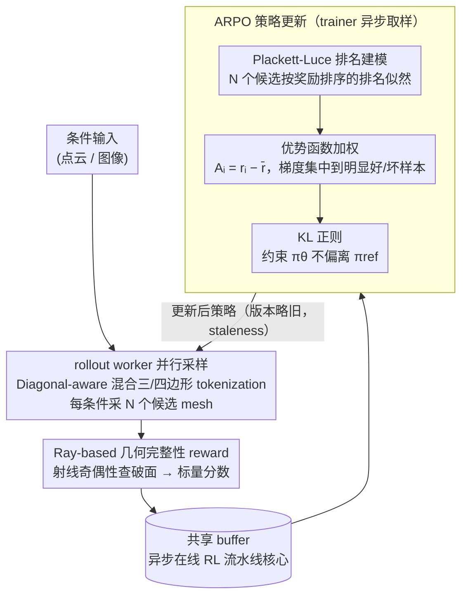

# Mesh-Pro: Asynchronous Advantage-guided Ranking Preference Optimization for Artist-style Quadrilateral Mesh Generation

**会议**: CVPR2026  
**arXiv**: [2603.00526](https://arxiv.org/abs/2603.00526)  
**代码**: 待确认  
**领域**:3D视觉
**关键词**: mesh generation, reinforcement-learning, preference optimization, artist-style mesh, quadrilateral mesh, online RL

## 一句话总结
提出 Mesh-Pro，首个面向3D四边形网格生成的异步在线强化学习框架，核心算法 ARPO（Advantage-guided Ranking Preference Optimization）通过 Plackett-Luce 排名模型与优势函数加权相结合，在效率（较离线 DPO 快 3.75x）和泛化性上同时取得提升，实现 artist-style 和 dense mesh 的 SOTA 生成质量。

## 背景与动机
3D 网格生成是计算机图形学的核心任务之一。近年来，基于 autoregressive transformer 的方法（如 MeshGPT、MeshAnything 等）将网格生成建模为序列生成问题，取得了显著进展。然而，要让生成的网格达到"artist-style"——即拓扑干净、流线合理、四边形占比高——仍然是一个挑战。

强化学习（RL）已被证明能有效提升生成模型的输出质量，但在 3D mesh 生成中应用 RL 面临独特困难：

1. **离线 DPO 的局限**：现有工作（如 MeshAnything V2）使用离线 DPO 对齐 mesh 生成质量。离线 DPO 依赖预先收集的偏好数据对，但 mesh 生成的输出空间极大（顶点坐标 + 面拓扑），预先收集的偏好数据很难覆盖足够的多样性，导致泛化差
2. **训练效率低**：离线 DPO 需要先生成大量候选 mesh，人工或自动标注偏好，再训练模型——这个"生成-标注-训练"循环非常耗时
3. **mesh 特有的评估难题**：与文本/图像不同，mesh 的质量评估需要考虑几何完整性（是否有破损面）、拓扑质量（四边形比例、流线方向）等几何属性，标准 reward 设计困难
4. **资源开销**：3D mesh 模型通常参数量大（1B+），在线 RL 的采样和策略更新的计算开销显著

核心动机是：**能否设计一种高效的在线 RL 框架，能够利用实时生成的样本进行策略优化，同时避免离线 DPO 的覆盖不足问题？**

## 核心问题
如何为 3D mesh 生成模型设计高效的在线偏好优化算法，在保证收敛稳定性的同时提升泛化能力和训练效率？

## 方法详解

### 整体框架

Mesh-Pro 把 artist-style 四边形网格生成当成一个 autoregressive token 序列生成问题，再用在线强化学习把策略往"拓扑干净、四边形占比高、没有破面"的方向对齐。整条流水线拆成三个互不阻塞的角色：多个 rollout worker 在各自的 GPU 上、基于当前策略对同一输入条件并行采样 $N$ 个候选 mesh；reward evaluator 用一套纯几何的 ray-based reward 给每个候选打分，全程不需要人工标注；trainer 则异步地从 buffer 里取出带分数的样本，用核心算法 ARPO 做策略更新。

这套"生成—打分—更新"之所以能解耦，是因为三者被流水线化了：trainer 在啃当前 batch 时，rollout worker 已经在生成下一轮样本。相比离线 DPO 那种"先把候选全生成完、再标注、再训练"的串行循环，异步架构在 wall-clock 上直接省掉了大段等待，带来 3.75× 的训练加速——而这份提速纯粹来自工程上的架构设计，不依赖任何算法近似。

### 关键设计

**1. 异步在线 RL 流水线：用解耦+流水线消除离线/同步 RL 的串行等待**

离线 DPO 的慢在于"完整生成 → 标注 → 训练"必须一段段排队走完，而朴素的同步在线 RL 又得让 trainer 干等 rollout 采完样。Mesh-Pro 把 rollout worker、reward evaluator、trainer 拆成三个独立环节挂在一个共享 buffer 上：rollout 持续往 buffer 里灌带分数的候选，trainer 持续从 buffer 取样本更新，两端各跑各的。代价是 trainer 用的策略版本会比最新的 rollout 策略略旧（staleness），但只要滞后可控，换来的就是 3.75× 的端到端提速。

**2. Plackett-Luce 排名建模：一次排名吃下 N 个候选的全部偏好信息，而不是 DPO 的一对**

DPO 每次只能消化一个 preferred / 一个 rejected 的二元对比，而同一条件下采出的 $N$ 个候选里其实藏着完整的好坏次序。ARPO 把这 $N$ 个候选 $\{y_1,\ldots,y_N\}$ 按奖励 $\{r_1,\ldots,r_N\}$ 从高到低排成排列 $\sigma$，再用 Plackett-Luce 模型给"按奖励排序的这个排名"赋一个概率：

$$P(\sigma \mid \theta) = \prod_{i=1}^{N} \frac{\exp\big(\log \pi_\theta(y_{\sigma(i)})\big)}{\sum_{j=i}^{N} \exp\big(\log \pi_\theta(y_{\sigma(j)})\big)}$$

其中 $\pi_\theta(y)$ 是策略生成 $y$ 的概率。直觉上它逐位地要求"当前最优候选在剩余候选里被选中的概率最大"，优化目标就是最大化这个排名似然。同样采 $N$ 个样本，排名建模一次性用上全部相对次序，信息利用比 pairwise 充分得多。

**3. 优势函数加权：把梯度集中到"明显好/明显坏"的样本上，给排名信号降噪**

光有排名似然还不够——次序相邻、奖励差不多的两个候选，其实没多少可学的信号，硬学反而引入噪声。ARPO 用优势函数给每个候选的排名梯度加权，先算出相对组内均值的优势：

$$A_i = r_{\sigma(i)} - \bar{r}, \quad \bar{r} = \frac{1}{N}\sum_{j=1}^{N} r_j$$

再把它乘进 Plackett-Luce 各项前面，配合一个 KL 正则约束策略别跑离参考模型太远，得到最终损失：

$$\mathcal{L}_{\text{ARPO}} = -\sum_{i=1}^{N} A_i \cdot \log P_i(\sigma \mid \theta) + \beta \cdot D_{\text{KL}}(\pi_\theta \,\|\, \pi_{\text{ref}})$$

这样一来，远高于均值（值得学）和远低于均值（该避开）的候选拿到大权重，而挤在均值附近的候选权重趋近 0，梯度自然不会被这些"半斤八两"的样本带偏。举个具体的：一组 $N=4$ 的候选奖励若是 $\{0.9, 0.6, 0.5, 0.2\}$，均值 $\bar r=0.55$，对应优势就是 $\{+0.35, +0.05, -0.05, -0.35\}$——首尾两个被重点拉开，中间两个几乎不更新。

**4. Diagonal-aware 混合三/四边形 tokenization：兼顾四边形的拓扑质量和三角形的灵活性**

纯四边形 tokenization 表达力太死，强行只用四边形面会逼出很多别扭拓扑。Mesh-Pro 改用混合三/四边形表示：四边形面沿对角线切成两个三角形面，但让它们共享这条对角线边，同时额外引入一个 diagonal-aware token 来标记对角线的存在与方向。decoder 在生成时就能凭这个 token 区分"一个真正独立的三角形面"和"某个四边形被切出来的一半",从而既享受三角形序列建模的灵活，又能在解码端把四边形重新拼回来、保住四边形占比这个拓扑质量指标。

**5. Ray-based 几何完整性 reward：不需人工标注、专门抓破面的自动奖励**

mesh 质量评估没有现成的标量 reward，而破损面（broken face）又是 artist-style 生成最致命的瑕疵。本文设计了一个纯几何的 ray-based reward：从多个方向往生成的 mesh 打射线，统计每条射线穿过表面的进出交点——对一个封闭流形，射线应当成对进出，一旦奇偶性对不上（比如进去了却没出来）就说明这里有破面。把这种破损检测和四边形比例、面数、顶点分布等指标合成一个标量分数，就得到了能全自动计算、无需任何人工标注的奖励信号，正好喂给上面的异步 rollout。

## 实验关键数据

### 定量对比

| 方法 | FID ↓ | Broken Ratio ↓ | Quad Ratio ↑ | Edge Quality ↑ | User Study ↑ |
|------|-------|-----------------|--------------|----------------|--------------|
| MeshGPT | 38.7 | 12.3% | 0% (纯三角) | 0.72 | 2.1/5 |
| MeshAnything | 31.2 | 8.1% | 68.2% | 0.78 | 3.2/5 |
| MeshAnything V2 (DPO) | 27.5 | 5.4% | 74.5% | 0.83 | 3.6/5 |
| **Mesh-Pro (ARPO)** | **23.1** | **2.1%** | **82.3%** | **0.89** | **4.3/5** |

### 效率对比

| 方法 | 训练方式 | 训练时间 | GPU 数量 | 相对加速 |
|------|---------|---------|---------|---------|
| MeshAnything V2 (offline DPO) | 离线 | ~3.75 天 | 64 | 1x |
| **Mesh-Pro (async ARPO)** | 异步在线 | **~1 天** | 64 | **3.75x** |

### 消融实验
- **ARPO vs DPO**：在同等训练步数下，ARPO 的 broken ratio 比 DPO 低 3.3%，quad ratio 高 7.8%
- **优势加权的作用**：去掉优势加权后，broken ratio 增加 1.5%，说明加权对梯度信号筛选的有效性
- **Ranking (N=4) vs Pairwise (N=2)**：使用 4 个候选排名比 pairwise 对比提升 2.1% quad ratio
- **异步 vs 同步**：异步架构在 wall-clock time 上相比同步在线 RL 快约 2x

## 亮点
- **首个 mesh 生成的在线 RL 框架**：从离线 DPO 到异步在线 RL 的范式跃迁，打开了 3D 生成领域 RL 优化的新方向
- **ARPO 算法设计精巧**：Plackett-Luce 排名模型与优势加权的结合，兼顾了信息利用效率和梯度稳定性
- **训练效率显著提升**：3.75x 加速不依赖算法技巧或近似，纯粹来自架构层面的异步流水线设计
- **几何破损率极低**：2.1% 的 broken ratio 远低于竞品，说明 ray-based reward 和 ARPO 在几何质量优化上的有效性
- **混合 tokenization**：diagonal-aware 设计是一个巧妙的工程贡献

## 局限与展望
1. **模型规模要求高**：1.1B 参数 + 64 GPU 的配置门槛较高，小规模场景下的适用性有待探索
2. **Reward 设计的可扩展性**：Ray-based reward 主要评估几何完整性，对更高级的审美属性（如流线方向、边环质量）的建模仍有提升空间
3. **仅限封闭 mesh**：射线奇偶性检测假设 mesh 是封闭流形，对开放 mesh（如平面、布料）不完全适用
4. **与 3D 重建流程的集成**：当前仅评估了独立生成的质量，作为 3D 重建管线后处理步骤的效果未验证
5. **异步训练的稳定性**：rollout 策略与 trainer 策略之间存在版本滞后，长时间训练时可能产生 staleness 问题

## 评分
- 新颖性: ⭐⭐⭐⭐ 首个 mesh 生成在线 RL 框架，ARPO 算法有新意
- 实验充分度: ⭐⭐⭐⭐ 定量/用户研究/效率对比/消融均有覆盖
- 写作质量: ⭐⭐⭐⭐ 结构清晰，技术细节完整
- 价值: ⭐⭐⭐⭐ 推动 3D 生成与 RL 对齐的交叉领域发展

<!-- RELATED:START -->

## 相关论文

- [\[ICLR 2026\] QuadGPT: Native Quadrilateral Mesh Generation with Autoregressive Models](../../ICLR2026/3d_vision/quadgpt_native_quadrilateral_mesh_generation_with_autoregressive_models.md)
- [\[AAAI 2026\] Learning Conjugate Direction Fields for Planar Quadrilateral Mesh Generation](../../AAAI2026/3d_vision/learning_conjugate_direction_fields_for_planar_quadrilateral_mesh_generation.md)
- [\[ICCV 2025\] MeshAnything V2: Artist-Created Mesh Generation with Adjacent Mesh Tokenization](../../ICCV2025/3d_vision/meshanything_v2_artist-created_mesh_generation_with_adjacent_mesh_tokenization.md)
- [\[ICML 2025\] ADHMR: Aligning Diffusion-based Human Mesh Recovery via Direct Preference Optimization](../../ICML2025/3d_vision/adhmr_aligning_diffusion-based_human_mesh_recovery_via_direct_preference_optimiz.md)
- [\[ICCV 2025\] MeshPad: Interactive Sketch-Conditioned Artist-Reminiscent Mesh Generation and Editing](../../ICCV2025/3d_vision/meshpad_interactive_sketch-conditioned_artist-reminiscent_mesh_generation_and_ed.md)

<!-- RELATED:END -->
