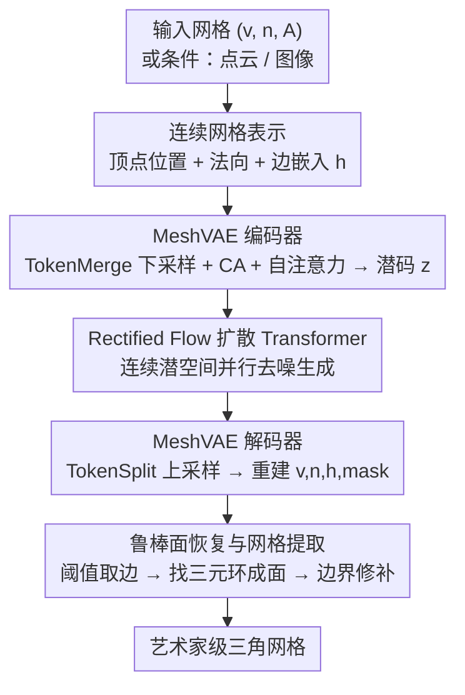

# MeshFlow: Efficient Artistic Mesh Generation via MeshVAE and Flow-based Diffusion Transformer

**会议**: CVPR 2026  
**论文**: [CVF Open Access](https://openaccess.thecvf.com/content/CVPR2026/html/Li_MeshFlow_Efficient_Artistic_Mesh_Generation_via_MeshVAE_and_Flow-based_Diffusion_CVPR_2026_paper.html)  
**代码**: 待确认  
**领域**: 3D视觉  
**关键词**: 艺术家级网格生成, 网格VAE, Rectified Flow, 连续潜空间, 非自回归

## 一句话总结
MeshFlow 用一个把顶点位置、法向和「离散连通性」全部编码进**连续潜空间**的 MeshVAE，配合 Rectified Flow 扩散 Transformer **并行**生成所有顶点和边，约 1 秒就能产出艺术家级三角网格，比最快的自回归生成器快约 18 倍且避免量化误差。

## 研究背景与动机

**领域现状**：三角网格是 AR/VR/游戏/影视的标准 3D 表示，但手工做艺术家级网格门槛高。生成式做法主要两派：一派先生成隐式表示（SDF 等）再用 Marching Cubes 抽网格；另一派注意到网格拓扑离散、与文本类似，于是把顶点和面**离散化、token 化后自回归（AR）**生成（MeshGPT、MeshAnything、MeshXL 等）。

**现有痛点**：隐式路线抽出来的网格不够「艺术家级」——要么平滑掉锐边，要么面数爆炸，难编辑、难实时。AR 路线则有三个硬伤：① 朴素 tokenizer 每个面要 $9n_f$ 个 token，即便高效 tokenizer 也只省 78%，推理成本随网格规模**平方级**增长，出不了又大又细的网格；② AR 会提前终止序列，产出残缺网格；③ 顶点坐标通常只量化到 128 级，引入量化误差，偶尔导致顶点塌缩、面重叠。

**核心矛盾**：网格本质是「连续顶点 + 离散拓扑」的混合体，离散拓扑天然契合 AR/语言模型范式，但 AR 的平方复杂度与量化误差又恰恰卡死了效率和精度。

**本文目标**：找一条**非自回归、不量化**的高效路线，能像潜在扩散一次并行吐出百万像素那样，一次并行吐出整张网格的所有顶点和边。

**切入角度**：作者注意到一个**水密网格**可由顶点、连接顶点的边、以及每个顶点周围边的环序唯一恢复。难点在「边是一对离散顶点索引」。作者借鉴 SpaceMesh，把边连接**连续化**——给每个顶点配一个特征向量，两顶点距离小于阈值即视为有边；环序则用顶点法向编码。这样整张网格就被写成「每顶点一个连续潜向量」。

**核心 idea**：把离散网格拓扑改写成**连续的逐顶点嵌入**，从而能用 Rectified Flow 在连续潜空间里并行去噪生成，用「连续化拓扑 + 扩散」替掉「离散 token + 自回归」。

## 方法详解

### 整体框架
MeshFlow 分两层：先用 **MeshVAE** 把一张网格压成紧凑连续潜码 $z$，再在这个潜空间上训一个 **Rectified Flow 扩散 Transformer** 做生成。网格被表示成三元组 $M=(v,n,h)$——每个顶点 $i$ 配位置 $v_i\in\mathbb{R}^3$、法向 $n_i\in S^2$、边嵌入 $h_i\in\mathbb{R}^D$；给定 $h$ 即可由阈值规则恢复邻接矩阵 $A$、由边找三元环恢复面 $F$、由法向定面朝向。MeshVAE 的编码器吃 $(v,n,A)$、解码器吐 $(\hat v,\hat n,\hat h,\hat m)$（$\hat m$ 是有效顶点掩码），中间把 $N$ 个顶点 token 下采样到 $n<N$（实验里甚至 $n_v/4$ 仍能重建）。生成时，Rectified Flow 在条件（点云 / 图像）下并行去噪出潜码，再过 Mesh 解码器 + 鲁棒面恢复得到最终网格。由于全程连续且并行，推理成本只随网格规模**线性**增长。

### 关键设计

**1. 连续化网格表示：边嵌入 + 顶点法向编码拓扑**

朴素表示把面当离散三元索引、邻接矩阵 $A\in\{0,1\}^{N\times N}$ 离散不可微，无法直接扩散生成。作者借鉴 SpaceMesh，给每个顶点配连续边嵌入 $h_i$，用距离阈值隐式恢复邻接：$A_{ij}=\mathbb{I}[d(h_i,h_j)\le \tau]$，把离散连边关系表达成可学习的连续嵌入。面的朝向（内外）则不直接编码顶点序，而是给每顶点一个外向法向 $n_i$，面法向取三顶点法向均值来定朝向。与 SpaceMesh 相比，MeshFlow **不要求**网格流形、水密（很多艺术家网格不满足），且不像 SpaceMesh 还要为每个顶点额外引入 $(y^{root},y^{prev},y^{next})$ 三组嵌入来记边的环序——MeshFlow 直接用法向一项搞定，表示更简、潜空间更紧凑，能生成更复杂网格。

**2. MeshVAE：TokenMerge/TokenSplit 的「平移式」自编码器**

目标是把网格压进连续潜码 $z$ 再解回来，且这是个「平移式」VAE——输入用 $(v,n,A)$，输出用 $(v,n,h)$（拓扑在解码侧由连续 $h$ 承载，离散 $A$ 只做编码输入，故不构成问题）。编码器先对每顶点拼上其法向和邻居顶点特征 $x_i=\mathrm{Concat}(PE(v_i),PE(n_i),\mathrm{Concat}_{j\in N_i}(v_j))$（pad 到固定维 $D$），再用受 InternVL pixel-shuffle 启发的 **TokenMerge** 把 $N$ 个 token 降到 $n$，过 MLP 得 $z_{merged}$；随后让这些缩减 token 通过交叉注意力回看完整输入 token 以保细节，再过 $L_e$ 层自注意力得潜码 $z=\mathrm{SA}(\mathrm{CA}(z_{merged},X))$。解码器对称：**TokenSplit** 把 $n$ 个潜 token 升回 $N$，加可学习位置嵌入后交叉注意力重建出 $\hat X$。作者实验发现，正是这个简单的 TokenMerge/TokenSplit（而非 Q-Former 的随机可学习查询、或 Shape2Vecset 的 FPS 采样）才能稳定收敛、保住原始信息——后两者会严重阻碍训练、重建质量崩塌。这套表示比朴素 tokenizer 少 72×、比最高效的少 16× token，且不量化、无量化误差。

**3. 对比式邻接监督 + 掩码/重建复合损失**

VAE 训练目标是重建损失 $L_{rec}$ 加 KL 正则。$L_{rec}=L_{mask}+L_v+L_n+L_{adj}+\beta_{kl}L_{kl}$：顶点掩码用 BCE，顶点/法向用只在有效顶点上平均的 MSE，连通性则用**对比损失** $L_{adj}=L_{pos}+\lambda_{neg}R_{neg/pos}L_{neg}$——拉近真实有边顶点对的嵌入距离、推远无边对（$L_{pos}$ 对 $E$ 内边、$L_{neg}$ 对 $\neg E$ 非边），$R_{neg/pos}=|\neg E|/|E|$ 平衡正负边数量极度不均衡的问题，距离函数 $d$ 沿用 SpaceMesh 的 Space-time Distance。对比损失是把「离散连不连边」变成「连续嵌入距离学习」的关键监督。

**4. Rectified Flow 并行生成 + 鲁棒面恢复后处理**

生成端用 Rectified Flow（RF），其直线 ODE 形式 $x(t)=(1-t)x_0+t\epsilon$ 避免路径交叉、减小时间步离散误差，网络 $v_\theta$ 用 Conditional Flow Matching 目标 $L_{CFM}=\mathbb{E}\lVert v_\theta(x,t)-(\epsilon-x_0)\rVert_2^2$ 训练。条件生成用 Diffusion Transformer，把预训练点云编码器的特征 token 经交叉注意力注入，并把顶点数与时间嵌入 $t$ 拼接做全局条件；训练后期采用 SD3 的 logit-normal 采样（$\mu=1.0,\sigma=0.5$），让网络在低噪声步上更专注细几何。生成的潜码解码后，作者做**鲁棒面恢复**：先按边嵌入阈值取有效边，再找共享三顶点的三元环成面、用顶点法向均值定朝向；并修补缺陷——把只属于一个面的「边界边」检测出来，若它们围成 $k<5$ 的 k-gon 环就三角化补面，提升结果鲁棒性。RF 的并行去噪使推理只随网格规模线性增长，相比 AR 的平方复杂度是质变。

### 损失函数 / 训练策略
两阶段训练：① MeshVAE 用 $L_{rec}+\beta_{kl}L_{kl}$（掩码 BCE + 顶点/法向 MSE + 邻接对比损失 + KL）；② RF 扩散 Transformer 用 CFM 目标 $L_{CFM}$。数据为约 60 万高质量艺术家 3D 模型（Objaverse 风格私有集）；MeshVAE 是 8 层 Transformer、1024 维、233M 参数，DiT 是 18 块、1024 维、427M 参数，训练用 Flash Attention、BF16、EMA。

## 实验关键数据

> 关键指标说明：CD（Chamfer Distance，倒角距离，越低越好）衡量整体结构相似度；HD（Hausdorff Distance，越低越好）对局部最大误差敏感；Comp. Ratio（压缩比，越低越紧凑）；Inf. Time 为一批多物体的平均推理时间。下表 CD/HD 均按 ×100 缩放。

### 主实验
形状（点云）条件网格生成，Toys4K 数据集（所有对比模型都没在此训练，测泛化）：

| 方法 | 类型 | CD↓ | HD↓ | Inf. Time(s)↓ |
|------|------|------|------|------|
| MeshAnything | AR | 12.02 | 26.87 | 26.06 |
| MeshAnythingV2 | AR | 10.23 | 24.98 | 31.94 |
| TreeMeshGPT | AR | 5.46 | 13.96 | 27.32 |
| BPT | AR | 5.71 | 12.02 | 49.23 |
| FastMesh-V1K | AR | 4.09 | 10.32 | 3.41 |
| FastMesh-V4K | AR | 4.05 | 10.22 | 6.60 |
| **MeshFlow（本文）** | Diffusion | **2.45** | **6.40** | **1.2** |

MeshFlow 在 CD/HD 上同时最低，推理 1.2 秒——比最快的 AR（FastMesh-V1K 3.41s）还快近 3 倍，比 TreeMeshGPT/BPT 快 20 倍以上，且 AR 单物体常需报告时间的 6 倍而 MeshFlow 运行时恒定。摘要口径概括为「比最快 AR 生成器快约 18×」。

### MeshVAE 重建对比
| 方法 | 类型 | CD↓ | Comp. Ratio↓ |
|------|------|------|------|
| TreeMeshGPT | AR | 1.63 | 0.22 |
| EdgeRunner | ArAE | 1.21 | 0.47 |
| **Ours** | Diffusion | 1.29 | **0.014** |

MeshVAE 重建 CD 与 SOTA 相当（1.29 vs 1.21/1.63），但压缩比 0.014 远紧于对手（约 0.22–0.47），印证连续表示既准又极致紧凑。

### 消融实验
| 配置 | Vert. Dist.↓ | Normals Dist.↓ | F1↑ | 说明 |
|------|------|------|------|------|
| Q-former | 23.36 | 18.77 | 49.47 | 随机可学习查询，训练难收敛、质量崩 |
| FPS | 18.29 | 14.61 | 60.18 | 最远点采样下采样，同样严重退化 |
| **TokenMerge** | **0.75** | **0.47** | **99.78** | 本文方案，稳定训练 + 高保真 |
| downsample ×4 | 1.25 | 1.30 | 88.82 | 4 倍下采样仍能恢复全局+局部结构（边 F1≈0.89） |
| downsample ×2 | 0.97 | 1.11 | 92.65 | 2 倍下采样 |
| 8192 顶点 | 0.94 | 0.49 | 99.71 | 顶点数增到 8192 质量基本不退，表示可扩展 |

### 关键发现
- **TokenMerge 是 VAE 能训起来的关键**：换成 Q-Former/FPS 下采样，顶点距离从 0.75 飙到 18–23、F1 从 99.78 掉到 49–60，重建几乎失败。
- **压缩很激进仍稳**：即便 ×4 下采样（只留 $n_v/4$ 潜向量）边 F1 仍约 0.89，且顶点数从 2048 增到 8192 重建质量不显著退化，说明连续表示可扩展。
- **CD/HD 不足以评网格质量**：作者坦言因为直接预测法向，NC（法向一致性）异常高、无意义；CD/HD 也难捕捉翻转法向、空洞等拓扑缺陷，需配合定性比较。

## 亮点与洞察
- **把离散拓扑彻底连续化**：用「顶点边嵌入 + 阈值取边 + 顶点法向定朝向」三件套，把网格写成纯连续的逐顶点向量，从而解锁了潜在扩散的并行生成能力——这是绕开 AR 平方复杂度与量化误差的根本招。
- **比 SpaceMesh 更省**：同样用顶点嵌入表边，但 MeshFlow 不要求流形/水密、且只用法向一项就编码了环序，省掉 SpaceMesh 的三组额外嵌入，潜空间更紧凑、能生成更复杂网格。
- **简单 TokenMerge 胜过花哨采样**：pixel-shuffle 式的 TokenMerge/TokenSplit 反而比 Q-Former、FPS 更稳更准，提示在网格这类强结构数据上，保信息的确定性下采样优于学习式/采样式 bottleneck，可迁移到其他几何自编码任务。

## 局限与展望
- **只支持三角面**：方法假设三角网格，而艺术家常用四边形等多边形，作者承认这是未来工作。
- **偶有空洞需启发式修补**：扩散预测不准时会留小洞，依赖短环检测的后处理修补，更强 DiT 或更精细扩散过程或可缓解。
- **评测指标失效**：CD/HD 难评翻转法向、空洞等拓扑缺陷，NC 因直接预测法向而虚高，缺乏能评网格拓扑质量的生成式指标（作者列为公开挑战）。
- **不含纹理生成**：当前只生几何，未来可扩展 UV 映射以生成高质量纹理。

## 相关工作与启发
- **vs 自回归网格生成（MeshGPT / MeshAnything / TreeMeshGPT / BPT / FastMesh）**：它们 token 化 + AR，受平方复杂度、提前终止、量化误差三重困扰；MeshFlow 非自回归、并行、不量化，CD/HD 更低且快约 18×。
- **vs SpaceMesh**：同用顶点嵌入表边，但 MeshFlow 不需流形/水密、用法向替掉三组环序嵌入，表示更简、潜空间更紧、生成更复杂网格，且用扩散并行生成位置与连通性。
- **vs MeshCraft / PDT（非自回归扩散）**：MeshCraft 的 GCN bottleneck 限制其难超 1536 面且仍量化顶点；PDT 依赖 QEM 简化导致拓扑分布不匹配；MeshFlow 连续不量化、拓扑由数据学习，更贴近数据分布。
- **vs 隐式表示路线（SDF + Marching Cubes）**：隐式抽网格易平滑锐边、面数爆炸、要求水密；MeshFlow 直接生成艺术家级三角网格，结构更可编辑。

## 评分
- 新颖性: ⭐⭐⭐⭐⭐ 把离散网格拓扑连续化并首次以 Rectified Flow 并行生成顶点+连通性，范式层面有突破。
- 实验充分度: ⭐⭐⭐⭐ 主结果 + VAE 重建 + 多项消融（下采样设计/压缩比/顶点数）较完整，但条件多样性（图像条件）展示偏少、缺更大规模定量。
- 写作质量: ⭐⭐⭐⭐⭐ 表示推导清晰、与 SpaceMesh 区别交代到位、坦诚指标局限。
- 价值: ⭐⭐⭐⭐⭐ 约 1 秒出艺术家级网格、避免量化与提前终止，对 3D 内容生产落地意义大。

<!-- RELATED:START -->

## 相关论文

- [\[CVPR 2026\] Efficient Hybrid SE(3)-Equivariant Visuomotor Flow Policy via Spherical Harmonics](efficient_hybrid_se3-equivariant_visuomotor_flow_policy_via_spherical_harmonics_.md)
- [\[CVPR 2026\] PartDiffuser: Part-wise 3D Mesh Generation via Discrete Diffusion](partdiffuser_part-wise_3d_mesh_generation_via_discrete_diffusion.md)
- [\[CVPR 2026\] ActionMesh: Animated 3D Mesh Generation with Temporal 3D Diffusion](actionmesh_animated_3d_mesh_generation_with_temporal_3d_diffusion.md)
- [\[CVPR 2025\] TreeMeshGPT: Artistic Mesh Generation with Autoregressive Tree Sequencing](../../CVPR2025/3d_vision/treemeshgpt_artistic_mesh_generation_with_autoregressive_tree_sequencing.md)
- [\[CVPR 2026\] TokenHand: Discrete Token Representation for Efficient Hand Mesh Reconstruction](tokenhand_discrete_token_representation_for_efficient_hand_mesh_reconstruction.md)

<!-- RELATED:END -->
