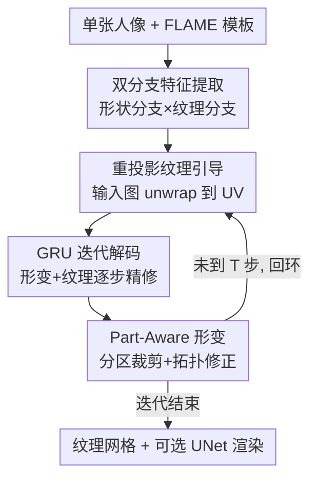

# MeshLAM: Feed-Forward One-Shot Animatable Textured Mesh Avatar Reconstruction

**会议**: CVPR 2026  
**arXiv**: [2604.22865](https://arxiv.org/abs/2604.22865)  
**代码**: https://meshlam.github.io (项目页)  
**领域**: 3D视觉 / 数字人头像 / 前馈重建  
**关键词**: 单图重建、可动画化网格、纹理贴图、GRU 迭代解码、重投影引导

## 一句话总结
MeshLAM 用一个共享 Transformer 的双分支网络，从单张人像图前馈一次（秒级）就重建出**带纹理、可直接驱动**的完整 3D 头部网格——形状分支回归顶点形变、纹理分支合成 UV 贴图，再用 GRU 迭代解码 + 把输入图重投影到网格上做纹理监督，避免网格塌陷并保住高频细节，质量与效率都超过基于高斯点的前馈方法。

## 研究背景与动机
**领域现状**：从单图造可动画化的 3D 头像是 VR / 游戏 / 远程会议的刚需。主流路线分三类——2D 方法（StyleGAN / 扩散驱动）没有显式 3D 结构、大姿态会失真；NeRF / 3DMM 类 3D 方法保真度高但往往要逐人优化或多视角监督；最新的前馈高斯方法（如 LAM）用 Transformer 配 FLAME 先验直接解码可动画化高斯头像，跳过了测试时优化。

**现有痛点**：前馈高斯路线有两个硬伤。其一，要表达发丝、胡须、纹身、文字这类细粒度外观，需要**海量**高斯基元，Transformer backbone 的算力开销随之暴涨；其二，在单次前馈里同时优化这么多高斯点很难收敛，结果常常糊掉、丢高频细节。而传统 mesh 的 3DMM 方法又只能恢复人脸区域，发型、头饰这些「脸以外」的几何和高保真纹理都做不出来。

**核心矛盾**：外观细节的「表达能力」和单次前馈的「可优化性 / 算力」之间存在 trade-off——高斯点把几何和外观纠缠在同一组基元里，想更细就得更多点，越多点越难一次性优化好。

**本文目标**：在**单次前馈**内，既要完整头部几何（含发型/头饰）、又要高保真纹理、还要拓扑完好可直接绑骨驱动。

**切入角度**：作者回到 mesh 表示——它天然把重建拆成「几何（顶点）」和「外观（纹理贴图）」两个域，纹理贴图能用一张紧凑的图存下高频外观，而几何只需稀疏顶点。这种解耦让几何解码器不必被外观细节拖累。论文实测仅用约 8K 顶点就胜过 LAM 的 80K 高斯点。

**核心 idea**：用「双分支前馈 mesh + GRU 迭代精修 + 把输入图重投影回 UV 空间做纹理监督」替代「单次前馈堆高斯点」，在解耦几何与外观的同时防止网格塌陷。

## 方法详解

### 整体框架
给定单张人像，MeshLAM 以 FLAME 模板为先验，前馈重建一个可动画化的带纹理头部网格。先用共享的 ViT/DINOv2 backbone 抽多尺度图像特征，再分双分支：形状分支让 FLAME 顶点通过 cross-attention 关注图像特征、回归逐顶点形变；纹理分支让一组与 FLAME UV 对齐的可学习 token 网格关注同样的图像特征、合成 UV 纹理贴图。两条分支不是一次解码到位，而是被 GRU 解码器在 $T$ 步内迭代精修：每步先把当前网格按输入图的表情参数驱动、光栅化后**把输入图和预测误差重投影（unwrap）回 UV 空间**作为纹理监督，同时对几何做 part-aware 形变并跑拓扑修正。迭代结束得到最终顶点网格 $V_K$ 和纹理贴图 $T_K$，可选再接一个 StyleGAN 式 UNet 神经渲染器提升渲染质量。

### 关键设计

**1. 双分支几何—外观解耦：用稀疏顶点 + 一张纹理图分别扛形状和外观**

针对「高斯点把几何外观纠缠、想细就得堆点」的痛点，MeshLAM 把重建显式拆成两条共享 backbone 的支路。形状分支以 FLAME 顶点 $V_0$ 初始化，加位置编码后过 MLP 得顶点特征 $F_V$，再经 $L_{\mathcal{A}}$ 层 cross-attention 关注图像特征 $F_I$：$F_{V_i}=\mathcal{A}_i(F_{V_{i-1}}, F_I)$；纹理分支用一组与 FLAME UV 图谱对齐的可学习 token 网格 $T_0\in\mathbb{R}^{H_t\times W_t\times C_t}$，展平后过**同一套** attention 层：$F_{T_i}=\mathcal{A}_i(F_{T_{i-1}}, F_I)$。这样几何只需关心稀疏顶点的形变、外观全交给紧凑的 UV 贴图去存高频信息，纹理合成不会再去拖累形状解码器；这正是它能用 ~8K 顶点击败 80K 高斯点的根因——纹理图比顶点着色能高效得多地存下发丝、纹身、文字这类细节

**2. GRU 迭代解码：把「一次性回归形变」改成可微的逐步精修，专治网格塌陷**

直接用一个解码器从顶点特征回归形变 offset 看似最简单，但作者发现这种单次解码在大形变区（长发、头饰）频繁导致网格塌陷——顶点各自无约束地大位移，误差会传播成严重扭曲甚至拓扑崩坏。MeshLAM 改用循环 GRU 算子做 coarse-to-fine 迭代：几何 GRU 从零形变场 $\Delta V_0$ 出发，每步 $\Delta V_{t+1}=\text{GRU}_{\text{geo}}([\psi(\vartheta(V_t), F_{d_t2v}), F_V], h_t^{\text{geo}})$，顶点更新 $V_{t+1}=V_t+\Delta V_{t+1}$；纹理 GRU 则 $T_{t+1}=\text{GRU}_{\text{tex}}(\varphi([\varphi([T_t,U_t]), F_a, F_{d_t}]), h_t^{\text{tex}})$，把上一步纹理、unwrap 图、潜特征、误差特征一起融合。隐状态 $h_t$ 保留历史、让形变从模板渐进发生，因此在大形变下也稳定收敛——消融里去掉 GRU 网格直接塌陷（FID 22.7→26.4），且两步迭代就是性能/效率最优点

**3. 重投影纹理引导：把输入图 unwrap 回演化中的网格，给纹理和几何一个「闭环视觉证据」**

纯靠特征解码合成纹理容易糊，因为它没把生成 anchor 到真实可观测的外观上。MeshLAM 在每步迭代 $t$ 把当前网格 $M_t$ 按输入图表情驱动、光栅化建立「图像像素↔UV 坐标」对应，再把输入图 unwrap 到 UV 空间：$U_t=\mathcal{U}(I_{\text{input}}, \mathcal{R}(M_t^{\text{animated}}))$；同时把「输入图、渲染图、二者残差」拼起来卷积再 unwrap，得到预测误差特征 $F_{d_t}=\mathcal{U}(\varphi([I_{\text{input}}, I_{\text{rendered}}, I_{\text{input}}-I_{\text{rendered}}]))$，作为纹理 GRU 的直接反馈、并投影回顶点空间 $F_{d_t2v}$ 指导形变。于是 3D 几何和 2D 观测之间形成闭环：几何越准 → 重投影越准 → 纹理引导越强 → 反过来约束形变趋向光度一致解。可见区直接复用输入图的真实纹理、遮挡区靠学到的先验补全——这是它跨域泛化（文本/风格迁移到 3D）也能成立的关键

**4. Part-Aware 形变 + 拓扑修正：分区控制形变幅度并实时修网格，保住解剖正确性与可驱动性**

让网格自由形变会破坏人脸的可动画化结构（如眼球错位、发际线乱跑）。作者按语义分区裁剪形变量 $\Delta V_t$：头发区允许大幅度 $\delta_{\text{hair}}=0.08$、颈/脸区中等 $\delta_{\text{neck}}=0.02$、$\delta_{\text{face}}=0.003$，眼球和眼睑顶点**不形变**以保解剖正确。每步形变后还跑拓扑修正：① 细分超过阈值 $\varepsilon$ 的长边三角形、② 翻转朝向不一致的面、③ 删除几何无效面；由于 remesh 改变了顶点连通性，再用重心插值更新蒙皮权重 $W$ 和 blendshape $B$，并重算关节回归矩阵 $J=J(M+B_s(\beta))^{-1}$ 以在拓扑变化下保持骨架一致。这样既能做发型/头饰这种大非刚性形变，又始终保持网格完整、可绑骨驱动——消融去掉它 PSNR 22.7、FID 升到 32.4

### 损失函数 / 训练策略
每步迭代用多项加权目标：图像重建（L2 + 感知）$\mathcal{L}_{\text{img}}=\|I_{\text{rendered}}-I_{\text{gt}}\|_2^2+\phi(\cdot)$、轮廓 mask $\mathcal{L}_{\text{mask}}$、用预训练法向网络监督的法向 $\mathcal{L}_{\text{normal}}$、用人脸解析监督的语义分区 $\mathcal{L}_{\text{part}}$、以及拉普拉斯平滑 $\mathcal{L}_{\text{lap}}$（防顶点散乱/自交）。单步损失 $\mathcal{L}_t=\lambda_i\mathcal{L}_{\text{img}}+\lambda_m\mathcal{L}_{\text{mask}}+\lambda_n\mathcal{L}_{\text{normal}}+\lambda_p\mathcal{L}_{\text{part}}+\lambda_l\mathcal{L}_{\text{lap}}$，权重 $\lambda_i=\lambda_m=\lambda_n=1, \lambda_p=0.5, \lambda_l=2$。总损失按迭代加权 $\mathcal{L}_{\text{total}}=\sum_{t=1}^{N}\gamma^{N-t}\mathcal{L}_t$，$N=2, \gamma=0.8$。Backbone 用冻结 DINOv2，Transformer 2 层 16 头、$C_t=1024$，Adam + cosine annealing + 线性 warm-up 训 100 epoch，学习率 $2\times10^{-4}$。训练数据为 VFHQ（15,204 段视频、约 3M 帧），统一裁到 $512\times512$、去背景、做头部解析。

## 实验关键数据

### 主实验
在 VFHQ 官方测试集上做单图 3D 头像创建 + 重演（reenactment）评测，指标 PSNR / SSIM / LPIPS / AKD（关键点距离）/ CSIM（身份相似度）/ FID，全部在头部区域 mask 内计算。

| 3D 表示 | 方法 | PSNR↑ | SSIM↑ | LPIPS↓ | AKD↓ | CSIM↑ | FID↓ |
|---------|------|-------|-------|--------|------|-------|------|
| Mesh | ROME w/ UNet | 22.850 | 0.874 | 0.098 | 4.98 | 0.681 | 42.542 |
| Mesh | Ours w/o UNet | 23.180 | 0.859 | 0.073 | 3.58 | 0.935 | 23.688 |
| Mesh | **Ours w/ UNet** | **25.233** | **0.879** | **0.061** | **3.24** | **0.948** | **22.699** |
| Gaussian | LAM+FLAME | 25.082 | 0.879 | 0.077 | 2.07 | 0.879 | 24.270 |
| Gaussian | **LAM+Ours** | **25.889** | **0.893** | **0.050** | 2.02 | 0.898 | **22.576** |

mesh 路线里 Ours w/ UNet 全面碾压同为 mesh 的 ROME（PSNR 25.23 vs 22.85、CSIM 0.948 vs 0.681、FID 22.7 vs 42.5）；即便不要神经渲染器（w/o UNet）也保持有竞争力且更高效。更有意思的是把本文重建的 mesh 当几何先验喂给高斯路线（LAM+Ours），所有指标拿到全局最佳（PSNR 25.889 / SSIM 0.893 / LPIPS 0.050），说明这套 mesh 是个更优的下游几何初始化。

### 消融实验
| 配置 | PSNR↑ | LPIPS↓ | FID↓ | 说明 |
|------|-------|--------|------|------|
| Ours-Full | 25.23 | 0.061 | 22.699 | 完整模型（2 步迭代 + UNet） |
| w/o Texture Map | 18.09 | 0.126 | 74.083 | 改用逐顶点着色，纹理细节崩 |
| w/o GRU | 23.08 | 0.081 | 26.397 | 去迭代精修，网格塌陷 |
| w/o Unwrapping | 22.98 | 0.089 | 29.428 | 去重投影引导，纹理变糊 |
| w/o P.A. Deform. | 22.72 | 0.096 | 32.405 | 去分区约束，解剖失真 |
| w/o UNet | 23.18 | 0.073 | 23.688 | 去神经渲染器 |
| GRU-1iter | 23.10 | 0.077 | 25.747 | 仅 1 步迭代 |
| GRU-2iter | 25.23 | 0.061 | 22.699 | 2 步（最优） |
| GRU-3iter | 25.38 | 0.063 | 23.431 | 3 步，PSNR 微升但 FID/LPIPS 变差 |

### 关键发现
- **纹理贴图是命根子**：换成逐顶点着色后 PSNR 从 25.23 暴跌到 18.09、FID 从 22.7 飙到 74.1，证明顶点着色根本存不下发丝/人脸这类高频外观，紧凑的 UV 贴图才是高效高保真的关键。
- **GRU 迭代防塌陷**：去掉 GRU 单次形变直接得到塌陷网格（PSNR 25.23→23.08、FID→26.4）；迭代步数上 2 步是性能/效率最优点，3 步 PSNR 仅微升 0.15 但 LPIPS/FID 反而变差，多迭代只是徒增算力。
- **重投影与分区约束各管一摊**：去重投影纹理变糊（FID 29.4）、去 part-aware 形变解剖失真（PSNR 22.72、FID 32.4），二者分别守住「外观真实」和「几何合理」。
- 整个前馈在**一秒内**完成，无需任何测试时优化。

## 亮点与洞察
- **把「光流式重投影闭环」搬进 3D 头像重建**：每步把输入图 unwrap 回演化中的网格做纹理监督，让 2D 观测和 3D 几何互相约束、形成闭环——这套「用观测 anchor 生成」的思路可迁移到任意单图 3D 重建（物体、全身）来抑制遮挡区幻觉。
- **GRU 迭代当「形变稳定器」**：用 RAFT 式循环更新算子做几何形变，本质是把一次性大位移拆成多步小步、用隐状态约束轨迹，这招对任何「大形变易塌陷」的网格变形任务都通用。
- **8K 顶点胜 80K 高斯点的对比极具说服力**：直观点出「表示选对了，参数量可以小一个量级」，提醒社区不要无脑堆基元。
- **mesh 当高斯的几何先验**：LAM+Ours 拿全局最佳，说明这套高质量 mesh 不只是终点，还能反哺别的表示范式，复用价值高。

## 局限与展望
- 作者承认：依赖 FLAME 做动画，受限于 FLAME 的表达力，无法生成动态皱纹、舌头运动等细粒度表情；且重建/动画质量受 FLAME 参数估计算法精度影响。作者建议用更强的 3DMM（如可微 MetaHuman）和更准的估计器来缓解。
- 自己发现的局限：训练只用 VFHQ 单一访谈场景数据集，对极端光照、夸张配饰、非正面输入的泛化未充分验证；重投影依赖输入图表情参数估计，估计偏差会直接污染纹理监督。
- 拓扑修正（细分/翻面/删面）+ 重新计算蒙皮和关节回归这套流程偏工程化，迭代中反复 remesh 的稳定性与可复现性需看补充材料；纹理在大遮挡区仍靠先验补全，可能与真人不符。

## 相关工作与启发
- **vs LAM（前馈高斯头像）**：LAM 用 Transformer 解码 FLAME 上的可动画化高斯点，但要表达细节得堆海量高斯、单次前馈难优化导致糊。本文改用 mesh 双分支 + 纹理贴图，几何外观解耦，用 ~8K 顶点拿到更细的纹理；本文更省算力、细节更清晰，但动画表达力同样被 FLAME 框住。
- **vs ROME（mesh 3DMM 头像）**：ROME 也是 mesh 路线但只能覆盖人脸区、恢复不了发型头饰和高保真纹理。本文靠 part-aware 大幅形变 + 拓扑修正补出完整头部几何，并用 UV 贴图存高频纹理，PSNR/CSIM/FID 全面领先。
- **vs NeRF / 逐人优化路线**：NeRF 类保真度高但要多视角或单视频、需逐身份优化，泛化差。本文是单图前馈、秒级出可绑骨驱动的显式网格，天然可动画化、可编辑（文本到 3D、风格迁移都能一次前馈接上）。

## 评分
- 新颖性: ⭐⭐⭐⭐ 把「重投影闭环 + GRU 迭代」引入前馈 mesh 头像重建，对「高斯堆点」路线给出有力替代，组合创新扎实。
- 实验充分度: ⭐⭐⭐⭐ 主表对比 mesh/高斯双路线 + 6 项指标，消融覆盖纹理图/GRU/重投影/分区/迭代步数，数字自洽；但仅 VFHQ 单数据集、缺跨数据集泛化与更多 baseline。
- 写作质量: ⭐⭐⭐⭐ 动机—痛点—方法链条清晰，公式与模块对应明确，pipeline 易懂。
- 价值: ⭐⭐⭐⭐ 秒级出可驱动带纹理网格、且能当高斯几何先验，对数字人/虚拟形象落地实用价值高。

<!-- RELATED:START -->

## 相关论文

- [\[CVPR 2026\] Feed-Forward One-Shot Animatable Textured Mesh Avatar Reconstruction](feed-forward_one-shot_animatable_textured_mesh_avatar_reconstruction.md)
- [\[CVPR 2026\] Feed-forward Gaussian Registration for Head Avatar Creation and Editing](feed-forward_gaussian_registration_for_head_avatar_creation_and_editing.md)
- [\[CVPR 2026\] PanoVGGT: Feed-Forward 3D Reconstruction from Panoramic Imagery](panovggt_feed-forward_3d_reconstruction_from_panoramic_imagery.md)
- [\[CVPR 2026\] VGG-T3: Offline Feed-Forward 3D Reconstruction at Scale](vgg-t3_offline_feed-forward_3d_reconstruction_at_scale.md)
- [\[CVPR 2026\] MoRe: Motion-aware Feed-forward 4D Reconstruction Transformer](more_motion-aware_feed-forward_4d_reconstruction_transformer.md)

<!-- RELATED:END -->
