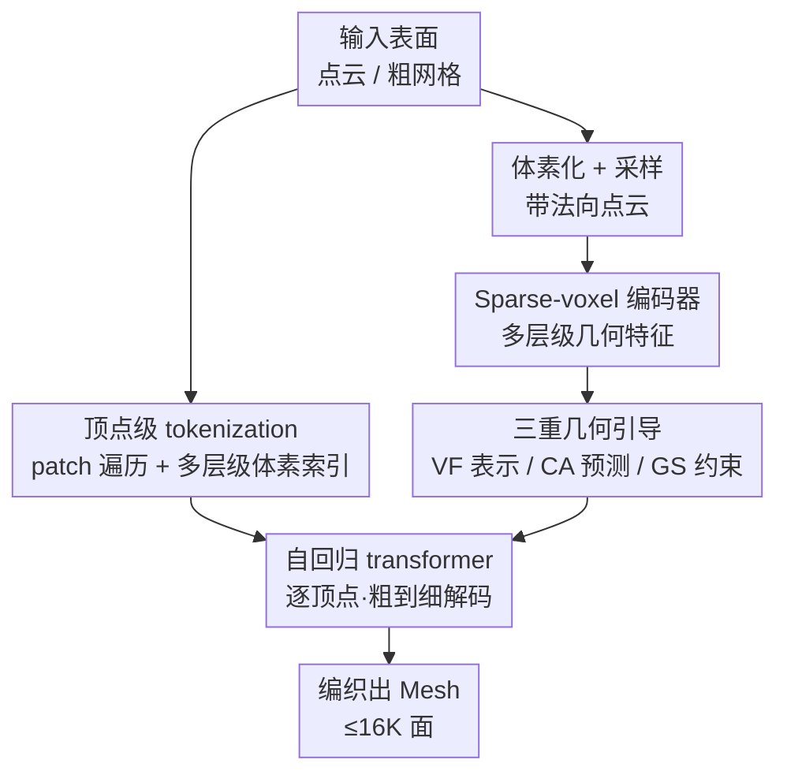

# MeshWeaver: Sparse-Voxel-Guided Surface Weaving for Autoregressive Mesh Generation

**会议**: CVPR 2026  
**arXiv**: [2606.04688](https://arxiv.org/abs/2606.04688)  
**代码**: 待确认  
**领域**: 3D视觉 / 自回归生成 / Mesh 生成  
**关键词**: 自回归 Mesh 生成、顶点级 tokenization、稀疏体素、表面编织、几何引导

## 一句话总结
把自回归 Mesh 生成从"逐坐标预测"改成"逐顶点编织"，并用一个多层级稀疏体素编码器从表示、预测、约束三个层面把局部几何注入生成过程，拿到 18% 的 tokenization 压缩率、可生成多达 16K 面的网格，并显著提升几何保真度。

## 研究背景与动机

**领域现状**：自回归 Mesh 生成（MeshGPT、MeshXL 等）把三角网格的面拆成离散坐标序列，像语言模型一样逐 token 预测，最终直接吐出干净、低多边形、艺术家友好的网格——这正是隐式表示（占据场 + Marching Cubes）做不到的：后者生成的网格往往过密、拓扑混乱，下游编辑/形变/贴图都难用。

**现有痛点**：主流"next-coordinate"范式有两个硬伤。一是 **tokenization 效率低**：朴素表示一个 $N$ 面网格要 $9N$ 个 token，即使 EdgeRunner/TreeMeshGPT 用半边遍历、BPT/DeepMesh 用分块索引压缩，压缩率也卡在 ~22% 上不去，序列太长导致无法扩展到高多边形网格。二是 **缺乏几何感知引导**：生成只依赖一个全局形状 embedding 和静态词表 embedding，每一步预测都看不到局部表面线索，容易误差累积、表面漂移，细节保不住。

**核心矛盾**：把任务当成"以全局形状为条件的形状生成"，模型就只能盲猜坐标；但 Mesh 生成的真正强项应该是"在已知几何上重建拓扑"（类似 re-topology），此时每一步预测本该有细粒度的局部几何先验可用，却被全局 embedding 这条窄通道掐断了。

**本文目标**：(1) 设计更紧凑的 tokenization 把序列变短、扩到 16K 面；(2) 让生成的每一步都能感知并贴合输入表面的局部几何。

**切入角度**：作者把 Mesh 遍历重新理解为沿流形"编织"——一针一针穿过曲面把拓扑缝出来，而编织的基本单位天然是顶点而不是单个坐标。

**核心 idea**：用"逐顶点编织（next-vertex prediction）"替代"逐坐标预测"来缩短序列，并用一个层级化的稀疏体素编码器在表示/预测/约束三处注入局部几何，让生成既结构连贯又忠于底层曲面。

## 方法详解

### 整体框架
MeshWeaver 输入一个表面（点云或粗网格），输出一个干净的低多边形三角网格。流程是：先把表面体素化并采样带法向的点云，用稀疏体素编码器抽出多层级（coarse-to-fine）几何特征；同时把网格按 patch 遍历、用多层级体素索引表示成"二维顶点 token 序列"；自回归 transformer 则在每个解码步里**一次性预测一个完整顶点**（不是一个坐标），预测时通过交叉注意力盯住对应的稀疏体素特征获取局部几何，并用稀疏体素的占据结构把每个顶点钉在真实曲面附近，最终一针一针把网格编织出来。

### 关键设计

**1. 顶点级 tokenization：把"逐坐标"抬升为"逐顶点编织"，砍掉冗余序列**

next-coordinate 范式把每个顶点的 $(x,y,z)$ 拆成三个独立 token，一个 $N$ 面网格要 $9N$ 个 token，序列长到训练推理都吃不消。作者的洞察是：网格遍历本质上是沿流形一个顶点一个顶点地"编织"，所以建模单位应该是顶点。具体做法是把一维坐标序列"抬升"成二维顶点序列——遍历上沿用 BPT 的 patch 启发式：从排序后的面里挑第一个未访问面，取它连接最多未访问面的顶点当 patch 中心 $\bm{o}_i$，把入射面的顶点按顺时针排到中心周围，于是网格被切成一串局部 patch $\mathcal{M}=\{\bm{o}_1,\bm{v}_{11},\dots,\bm{o}_P,\bm{v}_{P1},\dots\}$，每个 patch 头插一个 $\mathrm{BOS}$ 区分中心、序列尾插 $\mathrm{EOS}$。每个解码步直接预测一个完整顶点，把模型算力从"重复生成坐标"解放出来去做结构推理，最终把压缩率压到 18%，刷新了长期卡在 ~22% 的纪录

**2. 多层级顶点表示：用粗到细的体素索引让"一步预测整个顶点"变得可行**

逐顶点的难点是"如何在单步里生成一个完整三维顶点"。TreeMeshGPT 用层级 MLP 头按 $z\to y\to x$ 顺序串行预测 $p(\bm{v}_i)=p(v_i^z)\cdot p(v_i^y\mid v_i^z)\cdot p(v_i^x\mid v_i^z,v_i^y)$，但三个坐标强耦合、并没有清晰的先后依赖，这种分解并不自然。作者改用受分块索引启发的多层级表示：把三维空间按 $L$ 层划分，第 $l$ 层按因子 $D_l$ 细分，最细分辨率 $R=\prod_{l=0}^{L-1}D_l$ 等于坐标量化分辨率（默认两层 $(16,8)$，即 $128^3$、7-bit）；每个顶点表示成多层级体素索引 $\bm{v}_i=(v_i^0,\dots,v_i^{L-1})$，解码遵循粗到细细化 $p(\bm{v}_j)=\prod_{l=0}^{L-1}p(v_j^l\mid v_j^{<l})$：先定一个粗体素，再逐层缩进到更细的子体直到最终分辨率。这样既保留了"单步出一个顶点"的效率，又把坐标耦合问题转成层级条件预测，比串行 $z/y/x$ 分解更贴合三维结构

**3. 稀疏体素编码器的三重几何注入：让每一步预测都看得见、贴得住局部曲面**

旧范式把输入点云压成全局 embedding 再灌进 transformer，每个坐标 token 用静态词表 embedding 表示，从最后一层隐状态直接预测——几何线索极稀薄，容易漂移失真。作者引入一个稀疏体素编码器（PointNet 聚合体素内点 + shifted-window 稀疏注意力 + 稀疏卷积下采样交替）产出层级体素特征 $\mathcal{F}=\{\mathbf{F}^0,\dots,\mathbf{F}^{L-1}\}$，并从三个互补层面注入几何：**(i) VF 体素特征作顶点表示**——顶点不再用形状无关的静态 embedding，而是按各层体素索引取出特征拼成 $\mathbf{e}(\bm{v}_i)=\text{Concat}(\mathbf{F}^0[v_i^0],\dots,\mathbf{F}^{L-1}[v_i^{L-1}])$，携带丰富局部几何；**(ii) CA 交叉注意力引导预测**——每层预测头里隐状态作 query、该层稀疏体素特征作 key/value，预测一个 $D_l^3$ 维体素分布，且 $l>0$ 时交叉注意力被限制在上一层预测出的子体内，既省算又保空间精度；**(iii) GS 稀疏体素当生成脚手架**——稀疏体素显式标出各分辨率下被占据的区域，解码时把空体素的 logit 置 $-\infty$ 再采样，强制每个预测顶点钉在表面附近，从根上抑制误差累积和表面漂移，让"表面编织"真正成立

### 损失函数 / 训练策略
骨干是 24 层 LLaMA3 风格 transformer（hidden 1024 + RoPE），加稀疏体素与点云编码器，共 600M 参数；语料是 Objaverse++/ShapeNet/3D-Future/HSSD/ABO 合并过滤出的 80 万个 1K–16K 面网格，AdamW + cosine 衰减（$1\times10^{-4}\to1\times10^{-5}$），8 卡每卡 batch 4，跑 200K 步约两周。两个加速手段值得记：**训练期子体剪枝**——$l>0$ 的交叉注意力本要对全序列每个顶点单独 mask 到各自子体，开销大；作者只采样一部分子体连同 attend 它们的顶点、只在这个子集上算 loss，大幅减少参与交叉注意力的稀疏体素。**交叉注意力 KV Cache**——不光自注意力，预测头里的交叉注意力 key/value 也只投影一次缓存起来，解码时按上一层预测定位子体、只取相关 KV，免去重复投影；实测把吞吐从 26.8 提到 30.7 tokens/s（+14.5%）。

## 实验关键数据

### 主实验
点云条件 Mesh 生成，评测集 Toys4K（4000 网格 / 105 类），指标 Chamfer Distance (CD↓)、Hausdorff Distance (HD↓)、Normal Consistency (NC↑)、$\lVert$NC$\rVert$↑；所有方法同随机种子、采样温度 0.5。

| 方法 | CD ($\times10^{-1}$)↓ | HD↓ | NC↑ | $\lVert$NC$\rVert$↑ |
|------|------|------|------|------|
| MeshAnythingV2 | 0.213 | 0.169 | 0.194 | 0.878 |
| EdgeRunner | 0.147 | 0.118 | 0.668 | 0.902 |
| BPT | 0.172 | 0.122 | 0.719 | 0.909 |
| TreeMeshGPT | 0.205 | 0.183 | 0.685 | 0.887 |
| Mesh-Silksong（前 SOTA） | 0.140 | 0.106 | **0.734** | 0.900 |
| **MeshWeaver（本文）** | **0.116** | **0.087** | 0.732 | **0.914** |

CD 从前最好 0.140 降到 0.116、HD 从 0.106 降到 0.087，几何对齐明显更准；NC 与最佳的 Mesh-Silksong 持平、$\lVert$NC$\rVert$ 取得最高，表面朝向保持也最好。

tokenization 效率（压缩率 = $L/(9N)$，越低越好）：

| 方法 | 压缩率↓ |
|------|------|
| MeshAnythingV2 | 0.46 |
| EdgeRunner | 0.47 |
| TreeMeshGPT | 0.22 |
| BPT | 0.26 |
| Mesh-Silksong | 0.22 |
| **本文** | **0.18** |

### 消融实验
稀疏体素编码器三个机制（VF / CA / GS）的消融（Table 3，Toys4K）：

| 配置 | CD ($\times10^{-1}$)↓ | HD↓ | NC↑ | $\lVert$NC$\rVert$↑ | 说明 |
|------|------|------|------|------|------|
| 完整模型 | 0.116 | 0.087 | 0.732 | 0.914 | Full |
| w/o VF | 0.142 | 0.122 | 0.694 | 0.884 | 用静态词表 embedding 替体素特征 |
| w/o CA | 0.146 | 0.128 | 0.681 | 0.886 | 预测头退化为线性分类器 |
| w/o VF&CA | 0.158 | 0.138 | 0.660 | 0.865 | 同时去掉，掉点最严重 |
| w/o GS | 0.122 | 0.090 | 0.715 | 0.909 | 推理时关掉空体素 logit mask |

层级划分（Table 4，固定 7-bit / $128^3$，24 层 transformer 分配）：$(16,8)$ 与 $(8,16)$ 表现相当，$(8,4,4)$ 略差（更深层级缩小了后层的空间支撑，限制了稀疏体素能注入的局部几何范围）；层数分配 16+8 / 18+6 / 20+4 差异很小，最终选 $(16,8)$ 空间划分 + 16+8 层分配。

### 关键发现
- **VF 和 CA 是几何保真的主力且互补**：单去 VF 或 CA 都明显掉点（CD 0.116→0.142/0.146），两个一起去掉退化最重（CD 0.158、$\lVert$NC$\rVert$ 0.865），说明体素特征表示与交叉注意力引导提供的是互补的几何先验。
- **GS 是推理期"防漂移"的安全带**：只在推理生效，关掉后 CD 0.116→0.122、HD 0.087→0.090，幅度温和但稳定，定性上对应"表面漂移"——它把生成约束在输入曲面附近，让"编织"范式成立。
- **效率红利**：18% 压缩率让模型能在 1K–16K 面的复杂网格上训练，而 MeshAnythingV2/EdgeRunner 受限于 tokenization 只能训 <4K 面，天花板被压低；KV cache 再带来 +14.5% 推理吞吐。

## 亮点与洞察
- **范式重述比堆模块更有杀伤力**：把"以形状为条件的生成"重新表述成"已知几何上的 re-topology / 表面编织"，一句话就把"每步该有局部几何先验"这个被全局 embedding 掐断的通道打开了——后面三重注入都是这个视角的自然推论。
- **"逐顶点 + 多层级体素索引"是一对绝配**：逐顶点缩短序列，但单步出一个三维顶点很难；用粗到细体素索引把它转成层级条件预测，既绕开了 $z/y/x$ 串行分解的"伪依赖"，又天然对接稀疏体素特征，结构上一气呵成。
- **同一个稀疏体素结构被榨出三种用途**（表示 / 交叉注意力 key-value / 占据 mask），还顺手用占据 mask 当"硬约束脚手架"——logit 置 $-\infty$ 这种零成本 trick 能直接迁移到任何"生成必须落在已知结构上"的自回归任务（如布局/草图/分子）。
- **交叉注意力也能 KV cache**：把 LLM 推理的 KV cache 思路扩到预测头里的交叉注意力，配合按子体定位只取相关 KV，是个实用的工程洞察。

## 局限与展望
- **压缩率仍有空间**：作者自承可学 BPT 给 patch-center 和其它顶点用分开的 token 集，隐式区分 patch 从而省掉每个 patch 头部的 $\mathrm{BOS}$，进一步缩短序列；本文为简单起见显式插了 BOS。
- **依赖已知输入几何**：整个范式建立在"有输入表面可体素化"之上（re-topology 视角），对无条件/纯文本驱动的从零生成不直接适用。
- **层级越深越受限**：$(8,4,4)$ 变差揭示更深层级会缩小后层空间支撑、削弱局部几何注入，层数难无限加深；最细分辨率被 7-bit 量化锁死，超精细细节仍有上限。
- **训练成本高**：80 万网格 + 8 卡两周，复现门槛不低；评测集换成 Toys4K 是为公平，但与历史工作常用的 Objaverse 子集不完全可比，横向数字需带 caveat。

## 相关工作与启发
- **vs MeshGPT / MeshXL**：它们开创了把面离散成坐标序列的自回归范式，但序列极长、难扩到高多边形；本文用顶点级 tokenization 把压缩率从 ~0.46 量级压到 0.18，并能扩到 16K 面。
- **vs EdgeRunner / TreeMeshGPT（拓扑感知遍历）**：它们靠半边/最大化边共享压缩，压缩率卡在 0.22 且仍是逐坐标；本文换成逐顶点编织 + patch 遍历，压缩与保真同时改善，且 TreeMeshGPT 的串行 $z/y/x$ 分解被多层级体素索引取代。
- **vs BPT / DeepMesh（分块坐标压缩）**：本文沿用了 BPT 的 patch 遍历与分块索引思路，但关键差异是把分块索引升级为"多层级顶点表示 + 稀疏体素特征"，从而首次把局部几何注入到每一步预测。
- **vs 隐式表示 3D 生成（VecSet / 稀疏体素 + latent diffusion）**：那条线只管几何、要靠 Marching Cubes 后处理出过密网格；本文直接产出结构化低多边形网格，无需后处理表面抽取。

## 评分
- 新颖性: ⭐⭐⭐⭐⭐ "逐顶点编织"范式重述 + 同一稀疏体素三重几何注入，视角与机制都新。
- 实验充分度: ⭐⭐⭐⭐ 主结果、压缩率、三重消融、层级划分、KV cache 都覆盖，但只在 Toys4K 单评测集、与历史 Objaverse 设置不完全可比。
- 写作质量: ⭐⭐⭐⭐⭐ 动机—范式—三重机制层层递进，框架图与公式清晰，三重注入讲得透。
- 价值: ⭐⭐⭐⭐⭐ 18% 压缩率刷新 SOTA、可扩到 16K 面，对自回归 Mesh 生成的可用性是实打实推进。

<!-- RELATED:START -->

## 相关论文

- [\[ICLR 2026\] Topology-Preserved Auto-regressive Mesh Generation in the Manner of Weaving Silk](../../ICLR2026/3d_vision/topology-preserved_auto-regressive_mesh_generation_in_the_manner_of_weaving_silk.md)
- [\[CVPR 2026\] DynamicTree: Interactive Real Tree Animation via Sparse Voxel Spectrum](dynamictree_interactive_real_tree_animation_via_sparse_voxel_spectrum.md)
- [\[CVPR 2026\] FlashMesh: Faster and Better Autoregressive Mesh Synthesis via Structured Speculation](flashmesh_faster_and_better_autoregressive_mesh_synthesis_via_structured_specula.md)
- [\[CVPR 2026\] PixARMesh: Autoregressive Mesh-Native Single-View Scene Reconstruction](pixarmesh_autoregressive_mesh-native_single-view_scene_reconstruction.md)
- [\[ICLR 2026\] QuadGPT: Native Quadrilateral Mesh Generation with Autoregressive Models](../../ICLR2026/3d_vision/quadgpt_native_quadrilateral_mesh_generation_with_autoregressive_models.md)

<!-- RELATED:END -->
