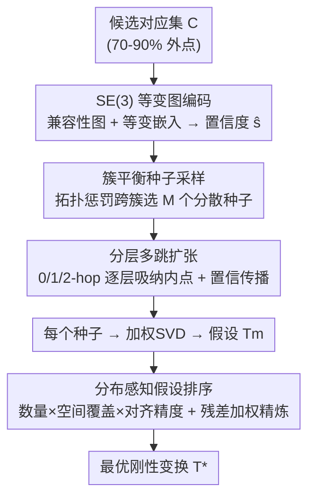

# MHopReg: Efficient Hierarchical Multi-Hop Graph Search for Point Cloud Registration

**会议**: CVPR 2026  
**论文**: [CVF Open Access](https://openaccess.thecvf.com/content/CVPR2026/html/Wu_MHopReg_Efficient_Hierarchical_Multi-Hop_Graph_Search_for_Point_Cloud_Registration_CVPR_2026_paper.html)  
**代码**: 未公开  
**领域**: 3D视觉  
**关键词**: 点云配准, 外点剔除, 兼容性图, 多跳搜索, SE(3) 等变

## 一句话总结
MHopReg 把基于对应关系的点云配准外点剔除做成「分层多跳图搜索」：先用 SE(3) 等变图编码预测对应置信度，再用簇平衡种子采样保证碎片化内点也被覆盖，然后从种子出发沿兼容性图逐跳扩张内点，最后用兼顾几何一致性与空间覆盖度的分布感知排序选最优变换，在低重叠和大规模场景下兼顾精度与效率。

## 研究背景与动机

**领域现状**：点云配准（机器人、SLAM、自动驾驶、3D 重建的基础问题）通常先用特征匹配建立候选对应集，再剔除外点估计刚性变换。现代特征匹配器在困难场景仍会产生 70–90% 的外点，所以外点剔除是配准成败的关键一步。

**现有痛点**：现有外点剔除分两派，各有死穴。**几何派**里基于空间一致性的图搜索（如 MAC 的极大团枚举）能抓细粒度结构，但受限于 NP-hard 复杂度，对大规模对应输入极其低效；**学习派**（PointDSC、VBReg）把外点剔除当分类问题，用 top-K 高置信种子在全局特征空间做一步式非局部搜索，但当外点率 >90%、内点又**碎裂成拓扑孤岛**时，初始种子很难检索到那些高度分散的局部一致子集。

**核心矛盾**：低重叠场景下内点稀疏、碎片化，传统一步式全局搜索抓不全；而大规模场景对应数量巨大，又对搜索算法的精度-效率权衡提出苛刻要求。一步到位地跨越拓扑断裂要么吞进海量外点导致信噪比崩塌，要么复杂度爆炸。

**本文目标**：设计一种既能处理低重叠下分散内点、又能避免大规模一步全局搜索高复杂度的外点剔除方法。

**切入角度**：与其一步搜遍全局，不如把内点发现拆成**多分辨率、逐跳**的渐进式信任域扩张——从高置信种子向外一圈圈安全地吸纳内点。

**核心 idea**：用「分层多跳图扩张」替代「一步式全局搜索」，配上保证覆盖碎片簇的种子采样和抗退化的分布感知排序。

## 方法详解

### 整体框架
MHopReg 是一条四模块串联的分层扩张流水线。输入是特征匹配得到的候选对应集 $C=\{c_k=(x_k,y_k)\}$。① **SE(3) 等变图编码**先构建兼容性图、学等变嵌入并预测每条对应的内点置信度 $\hat{s}_i$；② **簇平衡种子采样**用置信度在不同图簇间挑出 $M$ 个空间分散的种子，保证碎片化低重叠区也被覆盖；③ **分层多跳扩张**让每个种子沿图的边逐跳（0-hop 锚点 → 1-hop 强结构邻居 → 2-hop 扩展邻域）渐进发现内点，得到若干假设变换；④ **分布感知假设排序**联合考虑内点数量、空间分布和对齐精度，对所有假设打分、精炼并选出最优变换。

### 关键设计

**1. SE(3) 等变图编码：用等变嵌入预测对应置信度**

传统对应特征学习用通用算子，忽略 3D 刚性变换的内在性质。本文把每条对应当图节点、边编码空间兼容性。兼容性图 $G=(V,E)$ 的边由两个约束同时满足才建立：距离兼容性 $\Delta d_{ij}=|\,\|x_i-x_j\|_2-\|y_i-y_j\|_2\,|<\epsilon_d$ 和法向角兼容性 $\Delta\theta_{ij}<\epsilon_\theta$。为了让特征同时具备平移不变与旋转等变：先对坐标减质心得到 $\Delta x_i=x_i-\bar{x}$ 保证平移不变，节点初始化 $h_i^{(0)}=\mathrm{MLP}([\Delta x_i;\Delta y_i])$；再在消息传递中对相对位置 $r_{ij}=x_j-x_i$ 做**球谐编码** $\mathcal{Y}(r_{ij})$ 保证旋转等变：

$$h_i^{(\ell+1)} = h_i^{(\ell)} + \sum_{j:(c_i,c_j)\in E} \mathrm{MLP}\big([h_j^{(\ell)}; \mathcal{Y}(r_{ij})]\big)$$

如此显式解耦平移不变与旋转等变，学到的嵌入严格保持 SE(3) 几何性质，再经 $\hat{s}_i=\sigma(\mathrm{MLP}(\tilde{h}_i^{(L)}))$ 得到每条对应的内点置信度，为后续种子选择打基础。

**2. 簇平衡种子采样：用拓扑惩罚强制种子跨碎片簇覆盖**

现有方法用空间非极大抑制（NMS）来物理上分散种子，但低重叠时真内点会碎裂成图上拓扑孤立的「岛」，而空间 NMS 忽略图拓扑，往往把种子全堆在一个主导簇里，漏掉碎片化的有效内点。本文先用半径 $r_{nms}$ 的 NMS 得到候选集 $S_{nms}$，再引入**迭代拓扑惩罚**：从空集开始，每轮对候选 $c_k$ 按其与已选种子的图最短路距离打折扣

$$\text{score}_k^{(t)} = \hat{s}_k - \lambda\cdot\max_{c_j\in S_{t-1}}\exp\Big(-\frac{d_G(c_k,c_j)^2}{2\sigma_G^2}\Big)$$

其中 $d_G$ 是兼容性图上的最短跳数。这个核重重压制拓扑上邻近已选种子的候选，每选中一个种子就动态压低整个簇的采样概率，贪心地选最高分候选直到收满 $M$ 个。由此种子被强制铺到不同拓扑岛上，为后续多跳搜索提供全局代表性的起点。

**3. 分层多跳扩张：从种子沿图逐跳安全吸纳内点**

针对「一步式全局或 1-hop 搜索在碎片化场景吞外点导致信噪比崩塌」的问题，本文把搜索建模成**渐进式信任域扩张**：每个种子 $s_m$ 构造一个假设，0-hop 基层严格只含种子 $L_m^0=\{s_m\}$，更高层 $\ell\in\{1,2\}$ 沿图的边迭代扩张：候选层 $C_m^\ell$ 是与上一层 $L_m^{\ell-1}$ 有边相连、且尚未归入任何层的对应。**1-hop 层**先按特征余弦相似度从未分配池取 top-$k_1$（$k_1=\lceil\sqrt{N}\log N\rceil$），对其诱导子图做幂迭代取主特征向量、留 top-$k_2$（$k_2=\lceil\log_2 N\rceil$），再过严格几何验证（$\Delta d<\epsilon_d$ 且 $\Delta\theta<\epsilon_\theta$）才纳入；**2-hop 层**因谱信号随拓扑距离衰减，改为直接几何验证的局部搜索。同时**置信度沿可信父节点传播**：$\tilde{s}_c^{(\ell)}=\alpha\hat{s}_c+(1-\alpha)\max_{p\in P_c^{(\ell-1)}}\tilde{s}_p^{(\ell-1)}$，让高置信区域稳妥地增强可靠拓扑路径、抑制孤立外点。最终内点集 $I_m=L_m^0\cup L_m^1\cup L_m^2$，以传播置信度为权做加权 SVD 得到假设变换 $T_m$。

**4. 分布感知假设排序：用空间覆盖度抗内点计数退化**

传统方法只按内点计数（IC）排序假设，但部分重叠下，重复局部结构引起的密集假阳性簇会堆出虚高 IC，骗算法选到几何退化的错误对齐。本文提出兼顾数量与**空间覆盖**的质量分：对每个假设先在全局对应上取有效内点集 $V_m=\{c_i\mid\|R_m x_i+t_m-y_i\|_2<\tau_d\}$，再算

$$Q(T_m)=\text{IC}(T_m)\cdot\Big(1-\exp(-\tfrac{\sigma_{dist}^m}{\tau_\sigma})\Big)\cdot\Big(1+\tfrac{\tau_d}{\bar{d}_m+\epsilon}\Big)$$

其中 $\sigma_{dist}^m$ 是源内点绕质心的空间离散度、$\bar{d}_m$ 是平均残差。指数项重罚空间过度集中的退化配置，精度项奖励更紧的局部对齐。随后取 top-K 假设做**残差加权 Procrustes 精炼**：以高斯权 $w_i^m=\exp(-\|R_m x_i+t_m-y_i\|_2^2/2\tau_d^2)$ 软降权大残差对应，收敛后重算 $Q(\hat{T}_m)$ 取最优作为最终结果。

## 实验关键数据

### 主实验
**3DMatch（室内，标准重叠）**：FPFH 描述子下取得最高配准召回与最优旋转误差，且只需 0.10s 运行时（与 PointDSC/FastMAC 持平，远快于 MAC 的 5.54s）。

| 方法 | FPFH RR↑ | FPFH RE↓ | FCGF RR↑ | FCGF RE↓ | Time(s) |
|------|----------|----------|----------|----------|---------|
| PointDSC | 77.57 | 2.18 | 92.85 | 2.08 | 0.10 |
| MAC | 83.90 | 2.11 | 93.72 | 2.07 | 5.54 |
| PCRegen | 88.48 | 1.70 | 93.96 | 1.75 | - |
| **MHopReg** | **88.56** | **1.67** | **93.96** | **1.70** | **0.10** |

> RR=配准召回率（成功率，RE≤15°且 TE≤30cm 算成功）；RE=旋转误差（°）；TE=平移误差（cm）。

**3DLoMatch（室内，10–30% 低重叠）**：跨三种描述子全面领先，取得该数据集最高配准召回。

| 描述子 | 方法 | RR↑ | RE↓ | IP↑ | F1↑ |
|--------|------|-----|-----|-----|-----|
| FCGF | VBReg | 58.30 | 3.32 | 47.24 | 51.26 |
| FCGF | **MHopReg** | **61.59** | **3.23** | **48.12** | **52.19** |
| Predator | PCRegen | 72.04 | - | - | - |
| Predator | **MHopReg** | **72.19** | **3.15** | **64.02** | **64.16** |
| GeoTrans | MAC | 78.91 | - | - | - |
| GeoTrans | **MHopReg** | **79.48** | **2.66** | **65.18** | **70.52** |

> IP/IR=内点精度/召回率，F1=二者调和平均；⚠️ 部分基线缺项以原文 Tab.2 为准。

### 消融与定性分析

| 观察 | 数据 | 说明 |
|------|------|------|
| 多跳渐进精炼 | 内点比 1.7%→56.51%→96.86%（3 跳） | 外点从 3431 降到 2（99.94%），内点比提升 57× |
| 极端低重叠（19.7%）| 内点比 3.61%→36.3%→98.32% | 外点 2722→6（103×），最终 RE 0.01m / TE 0.003m |
| KITTI（室外大规模）| FCGF RR 98.74%、RE 0.30°、TE 17.73cm | 全指标最优，0.13s 远快于 SC2-PCR 的 0.31s |

### 关键发现
- **逐跳扩张是信噪比的关键**：从种子到第 2 跳，内点比能从个位数百分比拉到 96%+，把一步搜索会吞下的海量外点过滤掉，这是低重叠下成败的核心。
- **跨描述子稳健**：在弱手工特征（FCGF）与强学习特征（Predator/GeoTransformer）上都一致提升，说明多跳机制对特征质量不敏感。
- **精度-效率双赢**：在 3DMatch/KITTI 上 RR 领先的同时运行时与最快的学习方法持平，避开了 MAC 类极大团枚举的复杂度爆炸。

## 亮点与洞察
- **把外点剔除从「一步全局搜索」重构成「多分辨率信任域扩张」**：用拓扑距离而非纯空间距离来组织搜索，正好对上低重叠下内点碎裂成拓扑岛的本质，是很对症的建模。
- **簇平衡种子采样用图拓扑惩罚补了空间 NMS 的盲区**：一句「空间近 ≠ 图上近」就解释清楚了为什么传统种子会漏掉碎片内点。
- **分布感知排序抗退化**：用空间覆盖度乘进质量分，直击「重复结构堆高内点计数骗排序」这一经典失败模式，思路可迁移到任何 hypothesis-and-verification 框架。

## 局限与展望
- 流水线超参不少（$\epsilon_d,\epsilon_\theta,\lambda,\sigma_G,k_1,k_2,\alpha,\tau_\sigma,\tau_d$ 等），各场景阈值需调，论文未充分给出敏感性分析。
- 跳数固定为 0/1/2 三层，更极端的超低重叠或更大规模场景是否需要自适应跳数，未探讨。
- 仍依赖外部特征匹配器产出候选对应，匹配器在无纹理/强对称场景失效时，剔除阶段也无能为力。
- KITTI 上 FPFH 描述子的平移误差（8.70cm）反而高于 SC2-PCR（5.36cm），说明在某些室外配置下并非全面占优。

## 相关工作与启发
- **vs MAC / FastMAC**：MAC 把外点剔除建模成极大团枚举能抓细结构，但 NP-hard 复杂度对大规模输入低效；MHopReg 用逐跳扩张避开穷举，达到接近的精度但运行时快一两个数量级。
- **vs PointDSC / VBReg**：它们用 top-K 种子做一步式全局非局部搜索，外点率 >90% 时空间一致性信号变模糊；MHopReg 用簇平衡采样 + 多跳传播专门对付碎片化内点，在 3DLoMatch 上 RR 显著更高。
- **vs SC2-PCR**：二阶空间一致性谱排序是强基线，但在长拓扑距离上谱信号衰减；本文 2-hop 层因此改用纯几何验证，并以分布感知排序兜底退化。

## 评分
- 新颖性: ⭐⭐⭐⭐ 「分层多跳信任域扩张 + 拓扑惩罚种子 + 分布感知排序」组合新颖且针对性强，单个组件（兼容性图、球谐等变、加权 SVD）多为已知工具的巧妙编排。
- 实验充分度: ⭐⭐⭐⭐ 室内/室外、低重叠、多描述子都测了，进度可视化清晰；缺系统的超参敏感性与跳数消融。
- 写作质量: ⭐⭐⭐⭐ 动机-方法逻辑链顺，公式完整；个别符号与表格缺项需对照原文。
- 价值: ⭐⭐⭐⭐ 在低重叠场景拿下 3DLoMatch 最高召回且保持实时级速度，对 SLAM/重建的鲁棒配准有实用价值。

<!-- RELATED:START -->

## 相关论文

- [\[CVPR 2026\] SuP: Sub-cloud Driven Point Cloud Registration](sup_sub-cloud_driven_point_cloud_registration.md)
- [\[CVPR 2026\] C-GenReg: Training-Free 3D Point Cloud Registration by Multi-View-Consistent Geometry-to-Image Generation with Probabilistic Modalities Fusion](c-genreg_training-free_3d_point_cloud_registration_by_multi-view-consistent_geom.md)
- [\[CVPR 2026\] Generalized-CVO: Fast and Correspondence-Free Local Point Cloud Registration with Second Order Riemannian Optimization](generalized-cvo_fast_and_correspondence-free_local_point_cloud_registration_with.md)
- [\[ICCV 2025\] TurboReg: TurboClique for Robust and Efficient Point Cloud Registration](../../ICCV2025/3d_vision/turboreg_turboclique_for_robust_and_efficient_point_cloud_registration.md)
- [\[CVPR 2026\] CMHANet: A Cross-Modal Hybrid Attention Network for Point Cloud Registration](cmhanet_a_cross-modal_hybrid_attention_network_for_point_cloud_registration.md)

<!-- RELATED:END -->
