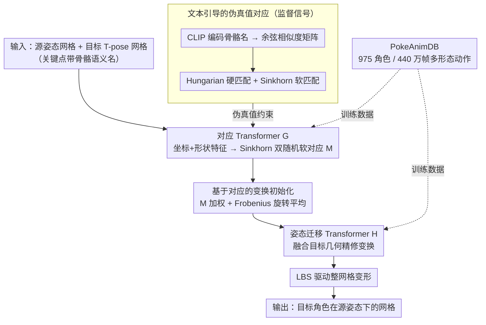

# MimiCAT: Mimic with Correspondence-Aware Cascade-Transformer for Category-Free 3D Pose Transfer

**会议**: CVPR 2026  
**arXiv**: [2511.18370](https://arxiv.org/abs/2511.18370)  
**代码**: [https://mimicat3d.github.io/](https://mimicat3d.github.io/) (项目页)  
**领域**: 3D视觉  
**关键词**: 3D姿态迁移, 跨类别迁移, 软对应, 级联Transformer, 大规模动作数据集

## 一句话总结
本文提出 MimiCAT，一个级联 Transformer 框架，通过语义关键点标签学习柔性多对多软对应关系，结合百万级多类别动作数据集 PokeAnimDB，首次实现了跨类别（如人形到四足动物/鸟类）的高质量 3D 姿态迁移。

## 研究背景与动机

1. **领域现状**：3D 姿态迁移旨在将源角色的姿态应用到目标角色上，同时保留目标的几何特征和源的姿态信息。现有方法大多局限于结构相似的角色之间（如人形到机器人），通过学习关键点或顶点级别的一对一对应关系来实现迁移。

2. **现有痛点**：当源和目标角色的身体结构差异巨大时（如人形到鸟类），一对一映射完全失效。四肢对应两个翅膀该怎么映射？此外，现有方法主要依赖人类运动数据集（如AMASS），在非人形角色上容易产生分布外的不自然变形。

3. **核心矛盾**：不同类别的角色具有截然不同的骨骼结构、关键点数量和旋转模式，传统的一对一关键点映射无法表达这种多对多的复杂对应关系。同时缺乏包含多类型角色动画的大规模数据集。

4. **本文目标** (a) 如何在结构差异巨大的角色之间建立柔性对应关系？(b) 如何获取足够多样的跨类别动作数据来训练模型？(c) 如何保证生成的姿态变换物理上合理？

5. **切入角度**：作者观察到角色的骨骼关键点通常带有语义标签（如"limbs"可以对应人类的"arms"和鸟类的"wings"），利用这种语义信息可以绕过手工标注对应关系的需求，用 CLIP 编码文本标签生成多对多的软对应伪标签。

6. **核心 idea**：通过语义关键点标签驱动的软对应学习 + 形状感知的级联 Transformer + 百万级多类别运动数据集，实现真正的跨类别 3D 姿态迁移。

## 方法详解

### 整体框架
MimiCAT 要解决的核心问题是：当源角色和目标角色的身体结构差异巨大（人形 → 鸟类）时，怎么把源的姿态"翻译"到目标身上。它的输入是源角色摆好姿态的网格和目标角色标准姿态（T-pose）的网格，输出是目标角色在源姿态下的变形网格。

整个流程拆成两阶段、由两个 Transformer 接力完成。Stage I 先训练**对应 Transformer $\mathcal{G}$**，它的任务是在源、目标两套数量不等的关键点之间算出一个软对应矩阵——不是"谁对谁"的硬匹配，而是"谁以多大权重对谁"的多对多概率分布。Stage II 冻结 $\mathcal{G}$，再训练**姿态迁移 Transformer $\mathcal{H}$**：先用软对应矩阵把源的旋转/平移粗略搬到目标关键点上得到一组初始变换，$\mathcal{H}$ 在此基础上结合目标自身几何把变换精修一遍，最后用线性混合蒙皮（LBS）把每个关键点的变换驱动整张网格，得到最终结果。监督信号来自文本语义标签生成的伪真值对应，整个训练不需要人工标对应关系。两阶段所需的多形态训练数据则全部来自自建的 PokeAnimDB。

### 关键设计

**1. PokeAnimDB：撑起跨类别训练的百万帧多形态数据集**

跨类别迁移的第一道坎不在模型而在数据——Mixamo、AMASS 这类常用数据集要么只有人形，要么角色种类极其有限，根本不足以让模型见过"翅膀""鱼鳍"这些非人形结构怎么动。作者为此从网络收集了 975 个角色，横跨人形、四足、鸟类、爬行动物、鱼类、昆虫等形态，整理出 28,809 段艺术家手工设计的动作、共约 440 万帧。每个角色统一重网格化为 5000 面，骨骼动画存成 .bvh，并保留每根骨骼的语义名称——后面文本引导的对应监督正是靠这些名称才成立。这个数据集既是方法能跑通的前提，本身也是目前规模最大的多类别 3D 角色动作库。

**2. 文本引导的伪真值对应：用骨骼名字当跨类别桥梁，省掉人工标注**

要训练对应 Transformer，得先有"正确对应"作监督，但人工标注跨类别骨骼对应成本极高且本身就有歧义。作者的巧思是：艺术家给骨骼起的语义名（`left_arm`、`right_wing`、`tail`…）天然编码了身体部位语义，于是用 CLIP 把这些名称编码成文本特征，算出源、目标关键点名称之间的余弦相似度矩阵 $\mathbf{S}_{\cos}$。在它之上同时生成两种伪真值：Hungarian 算法给出一对一硬匹配 $\mathbf{M}_{\text{hung}}$（保证至少有确定锚点），Sinkhorn 归一化给出多对多软匹配 $\mathbf{M}_{\text{sink}}$（允许"limbs"同时分给"arm"和"wing"）。两者一起约束 $\mathcal{G}$，既不丢确定性又保留柔性。

**3. 对应 Transformer $\mathcal{G}$：形状感知地估计多对多软对应**

$\mathcal{G}$ 的难点是要在长度不同的两套关键点之间输出柔性匹配。它先用 MLP 把关键点坐标编码成关键点 token $g_{\mathbf{C}}$，再用预训练 3D 形状编码器从网格提几何特征得到形状 token $g_{\mathbf{M}}$，两者拼接过 Transformer blocks 得到形状感知表示 $\mathbf{g}^{\text{src}}$、$\mathbf{g}^{\text{tgt}}$。这里特意不用 GNN——GNN 依赖骨骼连接先验，跨类别时拓扑差异太大反而拖累泛化；改用坐标 + 形状特征则不挑结构。相似度由一个可学习仿射矩阵 $\mathbf{A}$ 给出：

$$\mathbf{S} = \exp\!\big(\mathbf{g}^{\text{src}\top}\mathbf{A}\,\mathbf{g}^{\text{tgt}}\big)$$

再经 Sinkhorn 迭代归一化成双随机矩阵 $\mathbf{M}$，每个元素 $\mathbf{M}_{i,j}$ 就是源关键点 $i$ 与目标关键点 $j$ 的软匹配概率。双随机性正是多对多的关键：行列都归一，一个源点可以摊给多个目标点，比 Hungarian 的一对一灵活得多。

**4. 基于对应的变换初始化：四元数加权平均的数学坑与 Frobenius 解**

有了软对应 $\mathbf{M}$，最直接的做法是把源关键点的变换按权重平均搬到目标点上作为初始化：平移和位置直接加权平均没问题，但**旋转不能直接平均**。四元数加权求和会得到非单位四元数，还有正负号歧义（$\mathbf{q}$ 和 $-\mathbf{q}$ 表示同一旋转），结果就是扭曲和翻转——这一点在消融里被证实（去掉它 CCT 的 PMD 从 4.264 涨到 4.524）。作者改用基于 Frobenius 范数最小化的旋转平均：把目标点 $j$ 的初始旋转取成加权协方差矩阵

$$\mathbf{R}_j = \sum_i \mathbf{M}_{i,j}\,\mathbf{q}_i\mathbf{q}_i^\top$$

的最大特征值对应的特征向量。这样得到的旋转在数学上严格保证是合法的单位旋转，绕开了朴素平均的病态。

**5. 姿态迁移 Transformer $\mathcal{H}$：结合目标几何把初始变换精修到位**

光靠对应初始化只能给出"大致对"的变换，没考虑目标角色自己的几何约束（同样是抬腿，鸟的关节限制和人不同）。$\mathcal{H}$ 负责精修：它先把源的变形信息编码进特征差 $\delta_\mathbf{f} = \mathbf{f}_{\mathbf{V}^{\text{src}}} - \mathbf{f}_{\bar{\mathbf{V}}^{\text{src}}}$（变形网格与静止网格的几何特征之差），通过交叉注意力注入目标表示，与目标自身几何特征融合成形状条件 token；关键点 token 则由目标关键点位置、查询位置和上一步的初始变换拼接后经 MLP 投影。两类 token 一起过 Transformer 块，最后 MLP 解出每个关键点的最终变换参数，再由 LBS 驱动整网格变形。

### 一个完整示例：人形 → 鸟类

以"人挥手"迁移到一只鸟为例。源是 22 个带名称的人形关键点，目标是约 18 个鸟类关键点。文本对应阶段，CLIP 发现人的 `left_arm`/`right_arm` 和鸟的 `left_wing`/`right_wing` 语义最近，于是软对应矩阵 $\mathbf{M}$ 把人手臂的权重主要分给对应翅膀、少量溢到躯干——这正是一对一映射做不到的多对多分配。变换初始化阶段，人挥手时手臂那串关键点的旋转通过 $\mathbf{M}$ 加权、再经 Frobenius 旋转平均聚合到翅膀关键点上，得到一个"翅膀大致抬起"的初始旋转（若用朴素四元数平均，这里翅膀就可能翻转或扭曲）。最后 $\mathcal{H}$ 读入鸟自身的几何约束，把"抬起"细化成符合鸟翼活动范围的姿态，LBS 驱动网格，得到一只在"挥翅"的鸟——姿态来自人，形态仍是鸟。

### 损失函数 / 训练策略

**Stage I**：训练对应 Transformer $\mathcal{G}$，联合优化 Frobenius 损失 $\mathcal{L}_{\text{forb}} = \|\mathbf{S} - \mathbf{S}_{\cos}\|_2^2 + \|\mathbf{M} - \mathbf{M}_{\text{sink}}\|_2^2 + \|\mathbf{M} - \mathbf{M}_{\text{hung}}\|_2^2$，让预测相似度同时贴近文本相似度、软伪真值和硬伪真值。

**Stage II**：冻结 $\mathcal{G}$，用循环一致性训练 $\mathcal{H}$。重建损失 $\mathcal{L}_{\text{rec}} = \|\hat{\mathbf{V}}^{\text{src}} - \mathbf{V}^{\text{src}}\|_2^2$ 要求迁移再迁移回来能还原源；姿态先验正则化 $\mathcal{L}_{\text{reg}}$ 用预训练的 matrix-Fisher 分布模型约束旋转落在合理范围；特征一致性损失 $\mathcal{L}_{\text{feat}}$ 确保重建网格的高层几何特征一致。推理阶段再额外做一轮 ARAP 优化提升网格平滑度。

## 实验关键数据

### 主实验

| 设置 | 方法 | PMD↓ (×100) | ELS↑ |
|------|------|-------------|------|
| H2H (人形到人形) | NPT | 6.334 | 0.842 |
| H2H | CGT | 5.687 | 0.887 |
| H2H | SFPT | 3.616 | 0.888 |
| H2H | TapMo | 5.078 | 0.877 |
| H2H | **MimiCAT** | **3.570** | **0.923** |
| CCT (跨类别) | NPT | 9.889 | 0.260 |
| CCT | CGT | 6.314 | 0.744 |
| CCT | SFPT | 4.312 | 0.913 |
| CCT | TapMo | 4.883 | 0.922 |
| CCT | **MimiCAT** | **4.264** | **0.927** |

### 消融实验

| 配置 | PMD↓ (H2H) | PMD↓ (CCT) | 说明 |
|------|-----------|-----------|------|
| Full MimiCAT | 3.570 | 4.264 | 完整模型 |
| A1: w/o 旋转平均(Eq.4) | 4.439 | 4.524 | 朴素等权平均导致方向歧义 |
| A2: w/o 姿态先验(Eq.8) | 4.161 | 4.655 | 无先验正则化导致不自然变形 |
| A3: w/o 文本监督(Eq.5) | 4.268 | 4.612 | 用层级对应替代，映射不准确 |

### 关键发现
- 旋转初始化（Eq.4）对跨类别迁移至关重要，去掉后 CCT PMD 从 4.264 增至 4.524
- 姿态先验正则化（Eq.8）防止关节扭曲和自相交，去掉后跨类别 PMD 涨幅最大（4.655）
- 文本引导的语义对应优于启发式层级对应算法，后者容易造成错误匹配（如狗后腿对到人类手臂）
- 模型可零样本集成到现有文本到动作生成系统（如 MLD、T2M-GPT），为任意角色生成动画

## 亮点与洞察
- **语义标签驱动的软对应**：巧妙利用骨骼的文本语义名称 + CLIP 编码来建立跨类别对应，不需要手工标注，且支持多对多匹配。这个思路可以迁移到其他需要跨域对应的任务。
- **Frobenius 旋转平均**：解决四元数加权平均的数学病态问题，这一技巧在任何涉及旋转聚合的 3D 任务中都很有价值。
- **百万级多样性数据集**：PokeAnimDB 涵盖 975 种角色的 440 万帧动画，是目前最大的多类别 3D 角色动作数据集。

## 局限与展望
- 依赖预训练骨骼预测模型（RigNet）的质量，对极度非标准的角色可能骨骼预测不准
- 跨类别迁移的"合理性"缺乏明确定义，评估指标（循环一致性）是代理指标
- 推理阶段仍需 ARAP 优化来保证网格质量，增加了推理开销
- 数据集来源的版权和许可问题没有充分讨论

## 相关工作与启发
- **vs SFPT**: SFPT 使用固定数量的 handle points 做一对一映射，无法处理关键点数量不同的跨类别场景。MimiCAT 的软对应天然支持变长关键点。
- **vs TapMo**: TapMo 也用 handle-based 方法，受限于一对一对应假设。MimiCAT 在跨类别设置上明显优于两者。
- **vs NPT/CGT**: 这些方法是为相似拓扑设计的，在跨类别场景下性能严重退化。

## 评分
- 新颖性: ⭐⭐⭐⭐ 首次系统性解决 category-free 3D 姿态迁移问题，软对应 + 级联 Transformer 设计合理
- 实验充分度: ⭐⭐⭐⭐ 同类内和跨类别两种评估，消融完整，下游应用展示充分
- 写作质量: ⭐⭐⭐⭐ 结构清晰，方法描述详细，图示丰富
- 价值: ⭐⭐⭐⭐ 新数据集和方法对 3D 动画和角色迁移领域有显著推动价值

<!-- RELATED:START -->

## 相关论文

- [\[CVPR 2026\] Generalizable Structure-Aware Keypoint Correspondence for Category-Unified 3D Single Object Tracking](generalizable_structure-aware_keypoint_correspondence_for_category-unified_3d_si.md)
- [\[CVPR 2026\] UniCorrn: Unified Correspondence Transformer Across 2D and 3D](unicorrn_unified_correspondence_transformer_across_2d_and_3d.md)
- [\[CVPR 2026\] ManifoldNeuS: Manifold-aware View Optimizability for Pose-Free Neural Surface Reconstruction](manifoldneus_manifold-aware_view_optimizability_for_pose-free_neural_surface_rec.md)
- [\[CVPR 2026\] AeroGS: Scale-Aware Gaussian Splatting for Pose-Free Dynamic UAV Scene Reconstruction](aerogs_scale-aware_gaussian_splatting_for_pose-free_dynamic_uav_scene_reconstruc.md)
- [\[CVPR 2026\] SCAPO: Self-Supervised Category-Level Articulated Pose Estimation from a Single 3D Observation](scapo_self-supervised_category-level_articulated_pose_estimation_from_a_single_3.md)

<!-- RELATED:END -->
