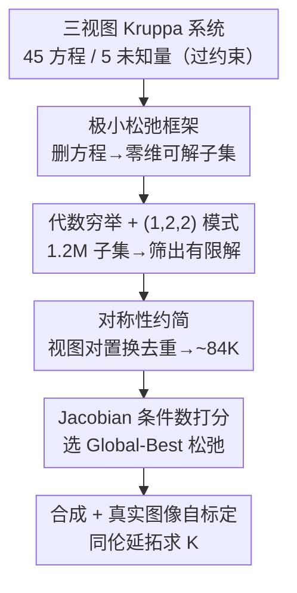

# Minimal Constraint Relaxation for Multiview Autocalibration

**会议**: CVPR 2026  
**论文**: [CVF Open Access](https://openaccess.thecvf.com/content/CVPR2026/html/Kosaka_Minimal_Constraint_Relaxation_for_Multiview_Autocalibration_CVPR_2026_paper.html)  
**代码**: 有（论文称已在 GitHub 开源，未给出确切地址 ⚠️）  
**领域**: 3D视觉 / 多视图几何 / 相机自标定  
**关键词**: 自标定, Kruppa 方程, 极小问题, 约束松弛, 同伦延拓

## 一句话总结
针对三视图 Kruppa 自标定方程"过约束（45 个方程、5 个未知量）导致无解或病态"的老问题，本文提出"极小松弛（minimal relaxation）"框架——系统性地只保留方程的某个子集，用符号计算 + 数值同伦延拓穷举所有能得到有限解的子集，发现唯一可行的 $(1,2,2)$ 选取模式，再用 Jacobian 条件数离线挑出一个"全局最优（Global-Best）"松弛，在合成与真实数据上都比经典 Kruppa 公式和近期分支定界方法更稳更准。

## 研究背景与动机
**领域现状**：相机自标定（autocalibration）是从若干张未标定图像、仅凭图像对应关系反求相机内参的经典问题。其中一条主线是 Kruppa 方程，它把视图对之间的基础矩阵 $F$ 与绝对二次曲线的对偶像（DIAC，记 $\omega^*=KK^\top$）用代数关系联系起来，好处是不依赖场景几何、纯代数。

**现有痛点**：当把三个视图对的 Kruppa 关系拼在一起，得到的是 **45 个双线性方程、只有 5 个未知量（DIAC 的 5 个参数）** 的严重过约束系统。在有噪声的真实数据下，这个系统几乎必然不一致（inconsistent），直接去掉一些方程凑成方阵又往往得到不稳定甚至无意义的解——到底删哪些方程才能既保证有有限个几何有效解、又数值稳定，长期缺乏系统性回答。

**核心矛盾**：过约束系统要"降维到可解"，但**怎么删方程**这件事的组合空间极大（$\binom{45}{5}\approx 1.2\text{M}$），而且绝大多数删法会让解集退化成无穷多解（正维数）或病态；可解性（代数极小性）与数值稳定性（条件数）是两个不同维度，过去要么靠 RANSAC 类随机采样碰运气，要么靠最小二乘 + 初值，都没有把"哪些子集本质上可解且良态"彻底刻画清楚。

**本文目标**：把三视图 Kruppa 系统的约束选择问题拆成两问——(1) 哪些方程子集能得到零维（有限）解集？(2) 在这些可解子集里，哪个数值上最稳？

**切入角度**：作者借用代数几何里"极小问题（minimal problem）"的语言，把删方程形式化为"极小松弛"，再用计算代数系统（Macaulay2）做符号 Gröbner 基与数值同伦穷举，把整个组合空间的维数/次数一次性算清楚。

**核心 idea**：用"系统性枚举 + 代数判定 + 条件数打分"取代"随机采样删方程"——先用符号/数值方法把所有零维松弛找全，再用 Jacobian 条件数离线为每个松弛打分，最终锁定一个对噪声鲁棒的 Global-Best 松弛。

## 方法详解

### 整体框架
方法本质是一条"逐级缩小搜索空间"的离线分析流水线：从 45 个 Kruppa 方程的完整过约束系统出发，先枚举所有"删到 5 个方程"的子集（约 1.2M 个），用代数手段筛掉解集为正维数（无穷解）的，留下零维可解的；再用视图对置换对称性去掉本质等价的重复，把空间从 ~1.2M 压到 ~84K；最后对剩下的松弛逐个估计 Jacobian 条件数 $\kappa(J_x)$，选出条件数最小、对噪声最不敏感的那个作为 Global-Best，部署到在线的合成与真实图像自标定。整条管线只在合成数据上离线跑一次，选出的松弛之后原封不动用在真实数据。

### 关键设计

**1. 极小松弛框架：把"删方程"形式化为可判定的极小问题**

这一步针对的痛点是"过约束系统怎么删方程才合法"。作者借代数几何的"问题–解流形" $Z_{P,X}\subseteq P\times X$ 和投影 $\pi:Z_{P,X}\to P$ 定义极小性：一个问题是极小的，当且仅当 $\pi$ 是占优映射（像在问题空间里稠密）且一般纤维 $\pi^{-1}(p)$ 有限非空，其次数 $\deg(\pi)=|\pi^{-1}(p)|$ 就是复数解个数。落到 Kruppa：问题空间是兼容基础矩阵三元组，未知空间 $X=\mathbb{C}^5\ni\omega^*$。一个子集 $F\subset G$ 称为**极小松弛**，当它在一般点附近定义出一个极小的问题–解流形，等价于在真值解 $x$ 处 Jacobian 满秩 $\mathrm{rank}\big(\partial F/\partial x\big|_{(p_0,x_0)}\big)=n$（$n=\dim X=5$）。与前人 [6] 允许"线性组合方阵化（squaring-up）"或引入松弛变量不同，本文只用"丢方程"这一最朴素的松弛——因为方阵化会破坏稀疏性、引入与原问题无关的新变量，反而掩盖几何结构；丢方程则保留了原始几何含义，便于穷举与判定。

**2. 代数穷举与 $(1,2,2)$ 模式：一次性算清谁可解**

痛点是 $\binom{45}{5}\approx1.2\text{M}$ 个子集太多、无法逐个数值求解判断。Kruppa 约束来自每个视图对的矩阵 $C_i\in\mathbb{R}^{6\times2}$ 的全部 $2\times2$ 子式（共 $\binom{6}{2}=15$ 个），三视图共 45 个方程。作者按"5 个方程在三个视图对间如何分配"把松弛归成模式 $(a,b,c)$（$a+b+c=5$，$0\le a,b,c\le5$），用 Macaulay2 做符号 Gröbner 基算理想维数、再用 Jacobian 秩测试和数值单延拓（monodromy）算次数。结论极其干净：**只有 $(1,2,2)$ 这一族模式总是给出零维（有限）解集**，其余模式都退化为正维数（无穷解）；约 120 万个子集里只有 ~10% 是真正极小的。更妙的是作者在 9 维 $F$ 的商环里做符号计算，发现 105 个子式对中恰有 9 个"相关对"，这 9 个相关对正好一一对应表中所有欠约束（正维数）情形——给出了"代数相关 ↔ 维数退化"的完整解释。$(1,2,2)$ 族的解次数只有 18 / 24 / 32，远低于前人 [6] 公式动辄 2985 的根数，因而同伦求解便宜得多。

**3. 对称性约简：用置换等价去掉本质重复**

即便锁定零维松弛，仍有 138,240 个候选，逐个评估代价高。作者注意到当同一个 $(1,2,2)$ 模式由不同视图对实现时（如 $(1,2,2)\to(2,1,2)\to(2,2,1)$ 的视图对置换，以及固定单约束视图对、交换两个双约束子集的 intra-pattern swap），这些松弛在代数上只是变量与参数的重标记，本质等价。利用这两类置换对称性，搜索空间从 ~1.2M 压缩到 ~84K 个置换不等价的极小松弛，为下一步逐个条件数打分扫清了规模障碍。

**4. Jacobian 条件数打分与 Global-Best：用数值敏感度做最终筛选**

代数极小只保证"有有限解"，不保证数值稳定，这正是真实噪声下成败的关键。作者对每个松弛在真值解处计算 Jacobian $J_x=\partial F/\partial x\in\mathbb{R}^{5\times5}$ 的条件数 $\kappa(J_x)=\sigma_{\max}(J_x)/\sigma_{\min}(J_x)$，作为"解对参数扰动的敏感度"的代理。由于同伦延拓求解最终都要解以 $J_x$ 为系数的线性系统，$\kappa(J_x)$ 直接限制了任意数值方法能达到的精度上限。在 84K 个松弛、100 个随机场景的实验里，作者发现 $\kappa(J_x)$ 与累计平均相对参数误差（sum mpe）强正相关：$\kappa(J_x)<10^5$ 的松弛一致地把误差压到 $10^{-8}$ 量级以下。于是作者按跨噪声水平、跨随机种子聚合误差，挑出单个 **Global-Best** 松弛，离线选定后原样用于所有真实图像实验。

### 损失函数 / 训练策略
本文是代数几何 + 数值分析方法，无可学习参数、无训练损失。求解阶段用 Julia 的 `HomotopyContinuation.jl` 做多面体同伦（polyhedral homotopy），对 Kruppa 与 Global-Best 各追踪 32 条路径（也可用 monodromy 初始化的参数同伦只追踪 18 或 24 条）；真实数据在 MSAC 框架内每次随机采 6 点子集估计基础矩阵三元组，最多迭代 200 次取重投影误差最小者。

## 实验关键数据

### 主实验
真实多视图数据集（Strecha SfM-eval、CVLAB-EPFL strecha08、COLMAP colmap-public），用 6 点求解器在 MSAC 框架内估内参，报告相对误差。Global-Best 一致优于经典 Kruppa（具体每场景数值在论文 Table 2，下表为定性总结 ⚠️ 以原文表为准）：

| 数据集 | 经典 Kruppa | 本文 Global-Best | 结论 |
|--------|-------------|------------------|------|
| SfM-eval | 较高误差 | 明显更低 | 大幅改善 |
| colmap-public | 较高误差 | 明显更低 | 大幅改善 |
| strecha08 | 中等 | 略低且一致 | 稳定小幅改善 |
| Fountain P11 | 相当 | 相当 | 个别例外，二者接近 |

合成实验：图像尺寸 $640\times480$，像素噪声 $\sigma\in[0,1]$，6/7/8 点配置各 100 个随机种子。在所有配置、所有噪声水平上，Global-Best 的平均投影误差都低于 Kruppa 基线，方差更小，说明对噪声更鲁棒。评估指标为内参的归一化误差：焦距误差 $\Delta f_g=\tfrac12(\tfrac{|\hat f-f|}{\hat f}+\tfrac{|\hat g-g|}{\hat g})$、主点误差 $\Delta_{uv}=\tfrac12(\tfrac{|\hat u-u|}{u}+\tfrac{|\hat v-v|}{v})$、偏斜误差 $\Delta_s=\tfrac{2|\hat s-s|}{f+g}$。

### 关键分析（维数/次数枚举）
按松弛模式统计解集维数 $\dim V(F)$ 与次数 $\mathrm{Deg}$（节选自论文 Table 1）：

| 松弛模式 | $\dim V(F)$ | 次数 Deg | 出现次数 | 说明 |
|----------|-------------|----------|----------|------|
| $(1,2,2)$ | 0 | 18 | 91,250 | 唯一总零维的族 |
| $(1,2,2)$ | 0 | 24 | 42,130 | 同族，更高根数 |
| $(1,2,2)$ | 0 | 32 | 4,860 | 同族，最高根数 |
| $(1,1,3)$ | 1 | 12 | 64,350 | 退化为正维数 |
| $(0,0,5)$ | 3 | 3 | 2,922 | 严重欠约束 |

### 关键发现
- **只有 $(1,2,2)$ 模式可解**：所有其它分配模式都给出正维数（无穷）解集，约 120 万个子集里仅 ~10% 极小；这把"该删哪些方程"的答案从经验试探收敛到一个明确的组合模式。
- **代数相关 ↔ 维数退化一一对应**：9 个"相关子式对"恰好解释了表中全部欠约束情形（相关对出现在第二或第三视图对 → 维数 1，共 25,920 例；同时出现 → 维数 2，共 1,215 例），机制层面闭环。
- **条件数是稳定性的好代理**：$\kappa(J_x)<10^5$ 的松弛误差稳定在 $10^{-8}$ 以下，$\kappa$ 与 sum mpe 强正相关，使得离线条件数打分足以预测在线精度。
- **根数远小于前人**：$(1,2,2)$ 族根数仅 18/24/32，而前人 [6] 一般情形高达 2985，求解器因此更简单高效。
- **分支定界与 Kruppa 不兼容**：BnB 方法 [28] 要求 DIAC $\omega^*$ 正定才能 Cholesky 反解 $K$，真实噪声下经常被破坏，导致内参误差高达上千量级，因此主对比中只能放进补充材料。

## 亮点与洞察
- **把"删方程"上升为可穷举、可判定的代数问题**：用极小问题/问题–解流形的语言，把工程上靠经验的约束选择，变成"枚举 → 维数判定 → 次数计算"的系统流程，并且一次算清整个 1.2M 空间，这是方法论上的"啊哈"点。
- **代数极小 ≠ 数值稳定，两层筛选缺一不可**：先用符号/数值方法保证有限解，再用 Jacobian 条件数保证良态——这个"先可解、再稳定"的两段式过滤思路，可迁移到其它过约束极小求解问题（如位姿、单应估计）。
- **离线选、在线用**：Global-Best 在合成数据上选定后原样部署到真实数据，避免了在线随机采样删方程的不确定性，是很实用的工程范式。
- **可复用 trick**：用"相关子式对"判据快速识别欠约束子集，比逐个跑 Gröbner 基便宜得多，对其它多视图极小问题的可解性预筛有借鉴价值。

## 局限与展望
- **强几何假设**：方法假设三视图、内参恒定（constant $K$），对变焦/可变内参、更多视图的推广（前人 [23,38] 走非线性最小二乘）本文未直接覆盖。
- **Global-Best 的最优性是经验的**：条件数打分与最终选择是纯经验的（作者自己强调这部分"不度量任何一般性质"），换数据分布或噪声模型是否仍最优需重新验证。
- **真实实验仅在三个 SfM/MVS 数据集、6 点求解器上验证**，规模有限；高分辨率真实图像导致绝对误差成比例放大，跨数据集绝对数值不可直接横比。
- **改进方向**：把条件数打分换成对噪声分布更鲁棒的指标、把框架推广到 DAQ/模约束等其它代数公式、或与 BnB 的全局最优性结合（先 Global-Best 初始化再局部精化）。

## 相关工作与启发
- **vs 经典 Kruppa [24]**：他们用基础矩阵的 SVD 参数化、解 6 个 Kruppa 方程中的 5 个；本文用一般形 Kruppa 把 $F$ 与极点纯代数处理，并系统选出最良态的 $(1,2,2)$ 松弛，精度与稳定性都更好。
- **vs Kruppa-BnB [28]**：他们用分支定界做内点最大化求全局最优；但要求 DIAC 正定，真实噪声下常失败（误差上千），且本文 Global-Best 求解更简单。
- **vs 前人 HC 松弛 [6]**：本文沿用其"极小松弛"概念但只丢方程，得到根数仅 18/24/32 的系统，远小于其 2985 的一般根数，求解器更简单高效。
- **vs DAQ / 模约束方法 [25]**：DIAC 是 DAQ 的圆锥外廓，DAQ 公式一般可分解为先解 DIAC 再恢复 $K$；本文专注 DIAC 侧并把约束选择问题做到极致。

## 评分
- 新颖性: ⭐⭐⭐⭐⭐ 首次对三视图 Kruppa 做约束选择的穷举式符号-数值刻画，发现 $(1,2,2)$ 唯一可解模式
- 实验充分度: ⭐⭐⭐⭐ 合成 + 三个真实数据集验证充分，但真实评测规模与求解器种类偏窄
- 写作质量: ⭐⭐⭐⭐ 代数推导严谨、结构清晰，但大量细节推到补充材料、缓存中公式 OCR 损坏较多
- 价值: ⭐⭐⭐⭐ 给自标定的约束选择提供了可复用的判定框架与现成 Global-Best 松弛，工程上即取即用

<!-- RELATED:START -->

## 相关论文

- [\[CVPR 2026\] S2D: Sparse to Dense Lifting for 3D Reconstruction with Minimal Inputs](s2d_sparse_to_dense_lifting_for_3d_reconstruction_with_minimal_inputs.md)
- [\[CVPR 2026\] Solving Minimal Problems Without Matrix Inversion Using FFT-Based Interpolation](solving_minimal_problems_without_matrix_inversion_using_fft-based_interpolation.md)
- [\[CVPR 2026\] REArtGS++: Generalizable Articulation Reconstruction with Temporal Geometry Constraint via Planar Gaussian Splatting](reartgs_generalizable_articulation_reconstruction_with_temporal_geometry_constra.md)
- [\[CVPR 2026\] MVInverse: Feed-forward Multiview Inverse Rendering in Seconds](mvinverse_feed-forward_multiview_inverse_rendering_in_seconds.md)
- [\[CVPR 2026\] MV2UV: Generating High-quality UV Texture Maps with Multiview Prompts](mv2uv_generating_high-quality_uv_texture_maps_with_multiview_prompts.md)

<!-- RELATED:END -->
