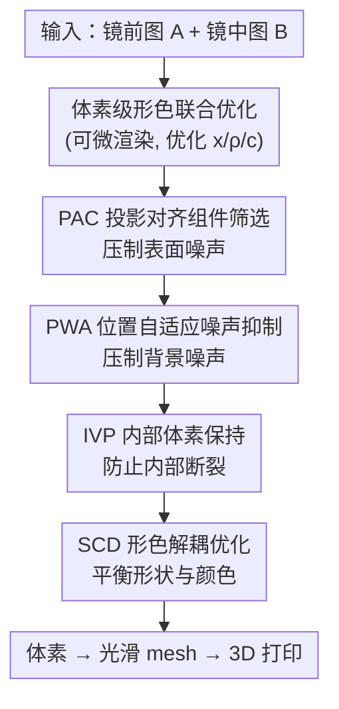

# Mirror Illusion Art

**会议**: CVPR 2026  
**论文**: [CVF Open Access](https://openaccess.thecvf.com/content/CVPR2026/html/Zhu_Mirror_Illusion_Art_CVPR_2026_paper.html)  
**代码**: https://github.com/zxp555/AutoMIA  
**领域**: 3D视觉 / 逆向图形 / 计算设计  
**关键词**: 镜面错觉、逆向设计、3D体素优化、形色联合优化、3D打印

## 一句话总结
本文提出 AutoMIA：给定"镜前正视图"和"镜中倒影"两张 2D 目标图，自动优化出一个同时满足形状与颜色约束、可 3D 打印的体素模型，让同一个物体在镜子前后呈现两个看似完全不同的图案，单卡 RTX 3090 平均约 76 秒、2.6 GB 显存即可完成设计。

## 研究背景与动机

**领域现状**：光学错觉艺术分 2D（Hybrid Images、Visual Anagrams）和 3D（Shadow Art 影子艺术、Multi-View Wire Art 多视角线条艺术）两类。本文聚焦一种新的 3D 错觉——"镜面错觉艺术"（Mirror Illusion Art）：一个 3D 物体放在镜子前，它本身和它的镜像看起来像是两个毫不相干的物体。

**现有痛点**：要做出这种效果，已有路线有两条且都很笨重。其一是 Sugihara 提出的拓扑学方法，强依赖人工直觉和复杂数学推导，新手难上手，且只优化形状、不支持彩色图案。其二是把 Shadow Art 改造过来，同样只能优化形状，而且因为它关注的是"投影出来的影子"而非物体本身的几何，常常生成不光滑、不完整的 3D 物体，既影响观感又难以真实打印。

**核心矛盾**：镜面错觉是一个由"两张非正交目标图"反推 3D 物体的欠约束逆问题——监督信号只约束物体表面、不管内部，而两个视角的监督又会互相干扰。作者把这种相互干扰具体归纳为四类缺陷：**表面噪声**（一个视角的监督把噪声带进另一个视角的重建）、**背景噪声**（远离物体表面的空中浮现杂散体素）、**内部断裂**（内部体素缺乏监督、密度被优化到 0 而消失，导致结构不连通）、**形色失衡**（只满足形状或只满足颜色、或一个视角的颜色"泄漏"到另一个视角）。

**本文目标**：做一条全自动、形色联合优化、且产物可物理打印的镜面错觉设计流水线，并逐一压制上述四类缺陷。

**切入角度**：用可微渲染把问题写成"最小化两个视角投影与目标图的差异"的优化问题，在 3D 体素表示上联合优化每个体素的位置、密度（不透明度）和颜色；再针对四类缺陷各设计一个稳定化机制。

**核心 idea**：在体素级形色联合优化的基础上，用 PAC / PWA / IVP / SCD 四个机制分别消除表面噪声、背景噪声、内部断裂和形色失衡，把欠约束逆问题稳定到可打印的高质量解。

## 方法详解

### 整体框架
AutoMIA 的目标是重建一个 3D 物体 $V$，使它在镜前的正视图 $C_{\text{direct}}$ 像目标图 $A$、镜中倒影 $C_{\text{mirror}}$ 像目标图 $B$。优化目标为

$$\min_V \big(\Phi(\mathrm{R}(V,\theta_{\text{direct}}),A)+\Phi(\mathrm{R}(V,\theta_{\text{mirror}}),B)\big),$$

其中 $\mathrm{R}$ 是可微渲染器，$\theta_{\text{direct}}/\theta_{\text{mirror}}$ 是镜前/镜中两个视角，相似度 $\Phi$ 由形状损失 $L_{\text{shape}}$（目标掩码与投影掩码的 BCE）和颜色损失 $L_{\text{color}}$（目标颜色与投影颜色的 L1）组成。物体用体素集合 $V=\{(x_i,\rho_i,c_i)\}$ 表示，对坐标 $x_i$、密度 $\rho_i\in[0,1]$、颜色 $c_i$ 三者联合优化。

整条流水线是：两张 2D 目标图输入 → 在 $128^3$ 体素网格上做可微渲染优化，同时挂上 PAC、PWA、IVP、SCD 四个机制压制缺陷 → 把优化后的体素转成更光滑的 mesh → 3D 打印成实物。四个机制各自针对一类缺陷，是本文的全部贡献点。

### 关键设计

**1. PAC 投影对齐组件筛选：按投影一致性删掉表面杂散连通块**

针对"表面噪声"——一个视角的监督会在另一个视角的重建表面上留下杂散体素。PAC 把"面相连（共享一个面即视为连通）"的体素聚成 $K$ 个连通组件 $S_k$，对每个组件渲染出它在两个视角下的投影掩码 $M_k^{\text{direct}}$、$M_k^{\text{mirror}}$，再用对齐分数衡量它和目标掩码 $M_A$、$M_B$ 的吻合度：

$$l_k=\alpha\,\mathrm{IoU}(M_k^{\text{direct}},M_A)+\beta\,\mathrm{IoU}(M_k^{\text{mirror}},M_B)-\gamma\big(O(M_k^{\text{direct}},M_A)+O(M_k^{\text{mirror}},M_B)\big),$$

其中 $\mathrm{IoU}$ 是交并比奖励"投影落在目标内"，$O(X,Y)=|X\cap(1-Y)|/|X|$ 惩罚"投影越界到目标外"的比例。设阈值 $\tau$，只保留 $l_k\ge\tau$ 的组件、删掉其余。这一步在优化过程中迭代进行，既剔掉表面噪声又保住有效主体结构，让表面更光滑。

**2. PWA 位置自适应噪声抑制：按到目标掩码的距离加权惩罚**

针对"背景噪声"——监督图只管表面形色，对远离表面的空中浮现体素约束很弱。PWA 的核心是给投影平面上每个像素一个随距离自适应的权重：离目标掩码越远，损失贡献被压得越狠。对像素 $u$，记它到目标掩码 $M$ 中最远/最近像素的欧氏距离为 $d_{\max}(u)$、$d_{\min}(u)$，权重定义为

$$w(u)=1+(w_{\max}-1)\cdot\Big(\frac{d_{\min}(u)}{d_{\max}(u)}\Big)^q,$$

$q$ 控制距离增益，$w_{\max}$ 是上限。把 $w(u)$ 乘进形状损失后，背景区域（投影落点远离目标）的像素被加重惩罚，从而消掉远处的空中杂散体素。

**3. IVP 内部体素保持：给"内部体素"加密度下限防止结构塌陷**

针对"内部断裂"——内部体素缺乏直接监督，密度可能在优化中被压到 0 而消失，破坏连通性、也让打印失败。IVP 先定义"实体体素"为密度超过阈值 $\gamma$ 的体素 $o(x)=\mathbb{1}[\rho(x)>\gamma]$；再用一个 $k\times k\times k$ 的核 $\Omega$ 在物体上滑动，**只有当核内所有体素都是实体体素时**，核中心体素才被判为"内部体素"：

$$m(x)=\mathbb{1}\Big[\frac{1}{|\Omega|}\sum_{y\in\Omega(x)}o(y)=1\Big].$$

对所有内部体素施加密度下界 $\rho_{\min}$，保证它们的密度不会降到 0，从而维持物体的连通完整、利于后续 3D 打印。

**4. SCD 形色解耦优化：分三阶段先定形、再形色联合、最后定色**

针对"形色失衡"——形状和颜色同时优化时往往顾此失彼，甚至另一视角的颜色（如红色）泄漏进当前视角（应为黄色 C）。SCD 把时间轴 $[0,T]$ 切成三段：先只优化形状（$0\le t<t_1$）建立稳定初始结构，再形状+颜色联合细化（$t_1\le t<t_2$），最后只优化颜色（$t_2\le t\le T$）微调外观。总损失

$$L_{\text{total}}=w_s(t)\cdot L_{\text{shape}}+w_c(t)\cdot L_{\text{color}},$$

其中形状权重 $w_s(t)$ 在 $t<t_2$ 时为 1、之后为 0；颜色权重 $w_c(t)$ 在第一段为 0、中段为 $\lambda\in(0,1)$、末段为 1。这种分阶段调度避免了形状还没稳住就被颜色拉偏，最终同时满足形状与颜色要求。

### 损失函数 / 训练策略
基础损失为形状 BCE 损失 $L_{\text{shape}}$ 与颜色 L1 损失 $L_{\text{color}}$，PWA 把距离权重 $w(u)$ 乘进 $L_{\text{shape}}$，SCD 用时变权重 $w_s(t)/w_c(t)$ 调度两者。体素分辨率 $128^3$，渲染用 PyTorch3D，PAC 在优化中迭代筛除组件，IVP 在优化中持续约束内部体素密度下限。

## 实验关键数据

### 主实验
数据集 Mirror-2D 自建：含英文字母、阿拉伯数字、汉字、几何图案、emoji、卡通、商标等，每类随机采 200 张共 1200 张。评测指标（自定义）：**SS**（Shape Score，形状一致性，0–1，越高越好）、**CS**（Color Score，颜色一致性，0–1，越低越好 ⚠️ 原文称"lower 表示颜色越相似"，疑为颜色误差类指标，以原文为准）、**NL**（Noise Level，表面噪声强度，0–1，越低越好）、**SL**（Smooth Level，mesh 表面光滑度，0–1，越高越好）。基线 Shadow Art (SA) 和 Shadow Art Revisited (SAR) 只支持形状优化，故对比时把彩图转成掩码、只比 SS/NL/SL。

| 方法 | SL ↑ | NL ↓ | SS ↑ | 时间 ↓ | 显存 ↓ |
|------|------|------|------|--------|--------|
| SA [12] | 0.827 | 0.507 | 0.499 | 50s | 2.5 GB |
| SAR [17] | 0.834 | 0.120 | 0.668 | 140s | 3.3 GB |
| **AutoMIA (本文)** | **0.989** | **0.049** | **0.931** | 76s | 2.6 GB |

AutoMIA 在三项重建质量上全面领先：SS 从 SAR 的 0.668 提升到 0.931，NL 降到 0.049，SL 高达 0.989。尽管挂了 4 个机制，速度与显存仍与最轻的 SA 接近、远快于 SAR，且能额外恢复颜色（SA/SAR 都只能做形状）。

### 消融实验

| 配置 | SL ↑ | NL ↓ | SS ↑ | CS ↓ | 说明 |
|------|------|------|------|------|------|
| Full（本文） | 0.989 | 0.049 | 0.931 | 0.018 | 完整模型 |
| − PAC | 0.910 | 0.248 | 0.629 | 0.323 | 去 PAC，NL/SS/CS 全面恶化 |
| − PWA | 0.822 | 0.373 | 0.790 | 0.034 | 去 PWA，SL/NL 显著变差 |
| − IVP | 0.979 | 0.050 | 0.748 | 0.021 | 去 IVP，SS 掉到 0.748 |
| − SCD | 0.755 | 0.101 | 0.548 | 0.050 | 去 SCD，SL/SS/CS 明显下滑 |

### 关键发现
- 四个机制各有侧重又有外溢增益：PAC 主要影响 NL/SS/CS（去掉后 CS 从 0.018 暴涨到 0.323，颜色一致性崩坏），PWA 主要影响 SL/NL，IVP 主要影响 SS（去掉后 SS 从 0.931 掉到 0.748），SCD 对 SL/SS/CS 影响明显（去掉后 SS 仅 0.548）。
- 有趣的是任一机制都能改善全部四项指标，即便它主要为某一类缺陷设计——作者解释为表面更光滑、噪声更少时颜色细化也更容易，形色优化互相受益。
- 可物理实现：选 6 个代表物体用 3D 打印，置于直径 16cm 圆镜前、室内标准光、iPhone 13 拍摄，均能从数字模型平滑过渡到实物；SA/SAR 因不考虑物理约束，复杂线条/中空结构常因内部断裂和噪声无法打印。
- 作者还推导了观察角度约束 $\theta_1<\Theta<\theta_2$：视角过小看不全背面图案、过大则直接看到背面使错觉消失，$\theta_1,\theta_2$ 由物体形状与观察者-物体-镜面相对距离决定。

## 亮点与洞察
- 把一个看似纯艺术的命题（镜面错觉）形式化成"双非正交视角逆向图形"优化问题，并精准拆出表面噪声/背景噪声/内部断裂/形色失衡四类缺陷——问题诊断比方法本身更有洞察力，每个机制都对症下药。
- PAC 的"连通组件级筛选 + IoU 奖励/越界惩罚"是个可复用 trick：在欠约束逆向重建里，与其逐体素去噪，不如按连通块整体打分增删，既稳又快。
- IVP 用滑动核判定"内部体素"再加密度下限，是个轻量却管用的连通性正则，对所有"只有表面监督、内部易塌陷"的体素重建任务都可迁移。
- SCD 的"先定形→形色联合→后定色"三段式调度，本质是给欠约束多目标优化排了个课程表，避免早期颜色把形状带偏，思路可迁移到其他形状+外观联合优化。

## 局限与展望
- 作者承认两点局限：① 两张监督图 $A$、$B$ 宽度需相近，否则信号冲突、图案不完整（可缩放到同宽解决）；② 图像分辨率不能超过体素分辨率，否则出现高频噪声与伪影（可用更高分辨率体素，但代价上升，或下采样图像）。
- 错觉依赖特定观察角度 $\theta_1<\Theta<\theta_2$，对一般用户的摆放/观看姿态有要求，鲁棒性有限。
- ⚠️ CS 指标"越低越好表示颜色越相似"的描述与"Color Score"命名直觉相反，原文公式在补充材料，正文未给，建议以原文 SM 为准。
- 改进方向：自适应分辨率体素以兼顾质量与代价；放宽两图宽度约束；把观察角度约束纳入优化以增强鲁棒性。

## 相关工作与启发
- **vs Shadow Art (SA) / Shadow Art Revisited (SAR)**: 二者面向正交设置（如从 3 张正交图重建），只优化形状、关注投影影子而非几何本体，在镜面错觉这种"双非正交视角"下监督不足、噪声与断裂严重且无法打印；本文用 PAC/PWA 压噪、IVP 保连通、SCD 加颜色，质量与可制造性全面胜出。
- **vs Sugihara 拓扑方法**: 拓扑法依赖人工直觉与复杂数学、只做形状、难量化评估；AutoMIA 全自动、形色联合、可定量评测（因人工设计差异大，本文未将其纳入基线对比）。
- **vs 2D 错觉（Hybrid Images / Visual Anagrams / 扩散式多视角错觉）**: 那些方法利用人眼多尺度/相位感知或生成先验，但设计耗时、依赖专家或受生成随机性限制；本文走可微优化逆向设计路线，产物稳定且可物理打印。

## 评分
- 新颖性: ⭐⭐⭐⭐⭐ 定义并自动化了一种新的 3D 镜面错觉艺术，问题形式化与缺陷拆解都很原创
- 实验充分度: ⭐⭐⭐⭐ 主对比 + 四机制消融 + 物理打印验证齐全，但基线偏少（仅 SA/SAR）、缺与人工设计的对比
- 写作质量: ⭐⭐⭐⭐ 四类缺陷→四机制的叙事清晰、图示丰富；CS 指标定义略含糊需查 SM
- 价值: ⭐⭐⭐⭐ 计算设计/逆向图形方向有趣且实用，代码开源、轻量可打印，但应用面相对小众

<!-- RELATED:START -->

## 相关论文

- [\[CVPR 2026\] ART: Articulated Reconstruction Transformer](art_articulated_reconstruction_transformer.md)
- [\[CVPR 2026\] Voxify3D: Pixel Art Meets Volumetric Rendering](voxify3d_pixel_art_meets_volumetric_rendering.md)
- [\[NeurIPS 2025\] 3D Visual Illusion Depth Estimation](../../NeurIPS2025/3d_vision/3d_visual_illusion_depth_estimation.md)
- [\[ICML 2026\] SIMPC: Learning Self-Induced Mirror-Point Consistency for Unsupervised Point Cloud Denoising](../../ICML2026/3d_vision/simpc_learning_self-induced_mirror-point_consistency_for_unsupervised_point_clou.md)
- [\[CVPR 2025\] RASP: Revisiting 3D Anamorphic Art for Shadow-Guided Packing of Irregular Objects](../../CVPR2025/3d_vision/rasp_revisiting_3d_anamorphic_art_for_shadow-guided_packing_of_irregular_objects.md)

<!-- RELATED:END -->
