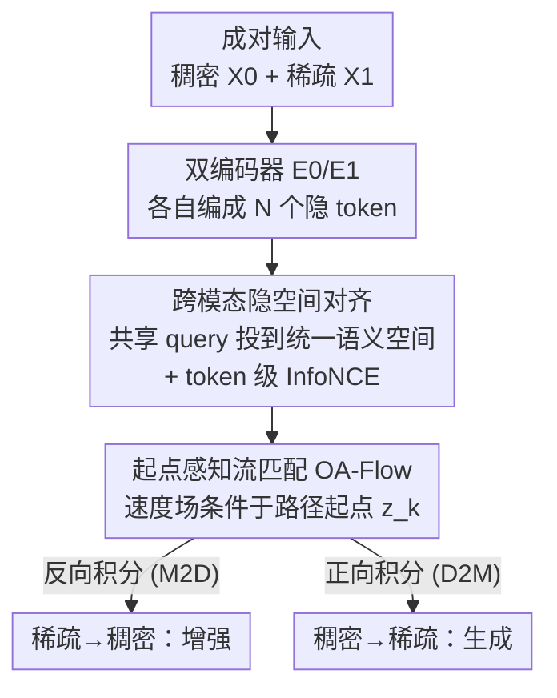

# mmWaveFlow: Unified Enhancement and Generation of mmWave Human Point Clouds

**会议**: CVPR 2026  
**论文**: [CVF Open Access](https://openaccess.thecvf.com/content/CVPR2026/html/Su_mmWaveFlow_Unified_Enhancement_and_Generation_of_mmWave_Human_Point_Clouds_CVPR_2026_paper.html)  
**代码**: https://github.com/suchang-99/mmWaveFlow  
**领域**: 3D视觉 / 点云生成 / 流匹配  
**关键词**: 毫米波点云、流匹配、点云增强、跨模态对齐、人体感知

## 一句话总结
把"把稀疏毫米波点云补稠密"和"从稠密点云反生成毫米波点云"这两件原本各做各的事，统一成稠密↔稀疏分布之间的一次**可逆传输**，用流匹配（flow matching）学这条传输路径，并通过跨模态隐空间对齐 + 起点感知（origin-aware）两个模块解决两端分布不对称、路径交叉的问题，单个模型在三个数据集上同时拿下增强与生成两项任务的 SOTA。

## 研究背景与动机

**领域现状**：毫米波（mmWave）雷达因为隐私好（不像摄像头拍人脸）、成本低（比 LiDAR 便宜）、抗光照/雨雾，正成为非接触式人体感知（姿态估计、动作识别、人体网格恢复）的热门传感方式。但它有两个先天缺陷：点云**又稀又噪**（一帧常常只有十几个点），而且大规模标注数据极度稀缺。

**现有痛点**：为了缓解这两个问题，社区分两条路各走各的——一条是**增强**：用扩散模型把稀疏毫米波点云补成 LiDAR 级稠密点云，但这些方法大多面向自动驾驶的场景级任务，对人体这种细粒度形状不友好；而且它们普遍从高斯噪声采样、把毫米波数据只当成一个 condition 信号，等于丢掉了毫米波点云本身的结构信息。另一条是**生成**：用物理仿真从人体 mesh 模拟毫米波信号来造数据，但依赖高保真 3D mesh，可扩展性和多样性都受限，还有 sim-to-real gap。

**核心矛盾**：增强（稀疏→稠密）和生成（稠密→稀疏）被当成两个独立任务，要训两个模型；但作者指出，它们本质上是同一件事——**稠密点云分布和稀疏点云分布之间的双向映射**。如果有一个可逆的传输，正着走就是增强、反着走就是生成，一个模型搞定两件事。

**本文目标**：学一个连接稠密分布 $p_0$ 和稀疏分布 $p_1$ 的可逆传输 $\phi$，使得 $\phi(X_0,\varnothing)\approx X_1$（生成）且 $\phi(\varnothing,X_1)\approx X_0$（增强），其中 $\varnothing$ 是方向占位符。

**切入角度**：流匹配天然学的是连接两个**任意分布**的可逆 ODE 速度场，正反积分即可双向传输——这正好契合"双向映射"的诉求，不必像扩散那样非要从高斯噪声出发。

**核心 idea**：用流匹配把稠密和稀疏点云的隐表示直接对接起来学一条可逆传输路径；但要让这条路径学得好，必须先解决两端分布几何不对称（一稠一稀）和路径交叉（path crossing）两个拦路虎——这就是本文两个核心模块要干的事。

## 方法详解

### 整体框架
mmWaveFlow 的骨架是"**跨模态 VAE backbone + 隐空间流匹配**"两段式。给定一对同一人、同一时刻采集的点云 $(X_0, X_1)$（$X_0$ 稠密，来自 RGB-D/LiDAR/SMPL-X 仿真；$X_1$ 稀疏，来自毫米波雷达），两个结构相同但参数独立的编码器 $E_0, E_1$ 先把它们各自编成 $N$ 个、维度 $D$ 的隐 token。但点云无序，两端 token 不天然对齐，于是一组**共享可学习 query** 通过 cross-attention 把两模态投到统一语义空间，得到对齐后的隐表示 $z_0, z_1$。随后解码器 $D_0, D_1$ 把隐表示还原回点云，VAE 这一层负责"能编能还原"。真正学双向映射的是其上的**流匹配模块**：它在 $z_0$ 与 $z_1$ 两个隐分布之间学一个可逆速度场，并通过**起点感知**改造消除路径交叉。推理时，正向积分 ODE 把稠密变稀疏（生成 D2M），反向积分把稀疏变稠密（增强 M2D），同一套参数双向跑。

### 关键设计

**1. 统一可逆传输：把增强与生成合成一条流匹配路径**

这是全文的立意。流匹配通过线性插值 $z_t = t\,z_1 + (1-t)\,z_0$ 构造源到目标的路径，训练神经网络速度场 $v_\theta(z_t,t)$ 去拟合真值速度 $\hat{v}_t = \mathrm{d}z_t/\mathrm{d}t = z_1 - z_0$。一旦学好，$v_\theta$ 定义了 $p_0$ 与 $p_1$ 之间一条可逆连续流：$z_1 = z_0 + \int_0^1 v_\theta(z_t,t)\,\mathrm{d}t$，正向积分把稠密传到稀疏（生成），反向积分把稀疏传回稠密（增强）。和扩散/CrossFlow 这类"从高斯噪声出发、把另一模态当 condition"的做法不同，本文直接拿**两个真实数据分布**当源和目标，一次训练同时获得双向能力——这也是为什么 baseline 都要为 M2D、D2M 各训一次，而 mmWaveFlow 只训一次。

**2. 跨模态隐空间对齐：让无序点云 token 在两端语义对得上**

流匹配的线性插值是**逐元素**做的，隐含假设源、目标 token 一一对齐。但点云无序，同一个位置的 token 在不同样本里可能对应不同身体部位，稠密端和稀疏端更是对不上——一旦错位，插值就会把不相干的局部特征混在一起，污染速度场的监督信号。本文从两个层面对齐：**维度对齐**用 VAE 把不同点数（稀疏/稠密点数不同）的点云都编成固定 $N{=}32$ 个 token，绕开"源分布维度不可控"的问题；**语义对齐**则用一组共享 query $q\in\mathbb{R}^{M\times D}$（$M{=}16$）对 $f_0,f_1$ 做 cross-attention 投到统一空间，再过共享三层 self-attention 得到 $z_0,z_1$。光靠 cross-attention 还不够稳，作者额外加 token 级 InfoNCE：只把成对样本里同位置 token $(z_{0,i}^k, z_{1,i}^k)$ 当正例，把同 batch 其他样本同位置 token 当负例，

$$\mathcal{L}_{\text{align}} = -\frac{1}{BM}\sum_{i=1}^{B}\sum_{k=1}^{M}\log\frac{\exp\big(s(z_{0,i}^k, z_{1,i}^k)/\tau\big)}{\sum_{j=1}^{B}\exp\big(s(z_{0,i}^k, z_{1,j}^k)/\tau\big)},$$

其中 $s(\cdot,\cdot)$ 是余弦相似度、$\tau$ 是温度。与 CrossFlow/FlowTok 依赖一端有强预训练编码器当语义锚点不同，毫米波这边没有大规模预训练可用，两端必须**从零联合**学出一个结构良好的共享空间，这正是难点所在。

**3. 起点感知流匹配（OA-Flow）：用路径起点消除路径交叉**

以往工作认为，把高斯源 $p_0(z)$ 换成条件源 $p_0(z\mid c)$ 后，条件 $c$ 就被吸收进源分布，于是只需采样 $z_0\sim p_0(z\mid c)$ 再用**无条件**速度场 $v(z_t,t)$ 演化即可，省时省空间。但作者观察到这种 condition-free 设定下会出现**隐空间路径交叉**：高维空间里不同成对样本的线性轨迹可能穿过同一个中间状态 $z_t$，此时无条件速度场在该点收到互相矛盾的监督，只能学成一个"平均方向"，导致速度估计有偏，多步积分时严重退化甚至失败（有趣的是单步积分反而还行，因为这一步主要由起点处的位移主导）。解法很轻：把速度场额外**条件于路径起点**，

$$\mathcal{L}_{\text{Flow}} = \mathrm{MSE}\big(v_\theta(z_t,t,z_k),\,\hat{v}_t\big),\quad k\sim\mathrm{Bernoulli}(0.5),$$

训练时以等概率随机选 $z_0$ 或 $z_1$ 作为起点条件 $z_k$，这种对称条件让一个模型同时会前向流和后向流，又始终带着"我从哪来"的信息。保留起点信息等于在交叉点给出无歧义的指引，几乎零额外复杂度就把交叉路径解耦、流变得更平滑。第 5.5 节的实证分析（随机采 1000 对样本、在 $s_{i,j}>0.95$ 且 $\hat{s}_{i,j}<0.7$ 时计一次潜在交叉）显示三个数据集都确有路径交叉、且随 $t$ 先增后减，佐证了这个问题真实存在。

### 损失函数 / 训练策略
VAE 用 Chamfer Distance（CD）+ Earth Mover's Distance（EMD）重建损失加 KL 正则：$\mathcal{L}_{\text{VAE}} = \sum_{i=0}^{1}\big[\mathrm{CD}(\mathcal{D}_i(z_i),X_i) + \mathrm{EMD}(\mathcal{D}_i(z_i),X_i) + \lambda_{\text{KL}}\,\mathrm{KL}(\mathcal{N}(\mu_{z_i},\sigma_{z_i}^2)\,\|\,\mathcal{N}(0,1))\big]$。总目标 $\mathcal{L} = \lambda_{\text{VAE}}\mathcal{L}_{\text{VAE}} + \lambda_{\text{Flow}}\mathcal{L}_{\text{Flow}} + \lambda_{\text{align}}\mathcal{L}_{\text{align}}$，权重取 $\lambda_{\text{VAE}}{=}50, \lambda_{\text{Flow}}{=}1, \lambda_{\text{align}}{=}0.1, \lambda_{\text{KL}}{=}10^{-5}$。训练分两段：先联合训 VAE 与 OA-Flow，待 VAE 重建损失连续 10 个 epoch 不再下降即冻结，再单独继续训 OA-Flow；联合阶段视为多任务学习，用 gradient surgery（PCGrad）缓解梯度冲突。VAE 用 VecSet，流网络是 30 层 DiT，每个点云子采样/补零到最多 512 点，单张 RTX 3090 训 200 epoch。

## 实验关键数据

### 主实验
三个数据集分别代表三种稠密点云来源：mmBody（深度相机，含雨天/弱光等挑战场景）、MM-Fi（每 4 帧累积成一帧、丢弃 <50 点的样本）、mRI（SMPL-X 仿真/Kinect 标注）。两个任务：D2M（稠密→毫米波，生成）和 M2D（毫米波→稠密，增强），指标为 L2 Chamfer Distance（CD，cm）和 Earth Mover's Distance（EMD，cm），越低越好。还引入 **Mean Rank（MR）**：$\mathrm{MR}=\frac{1}{M_t}\sum_i r_i$，$r_i$ 为模型在第 $i$ 个指标上的排名，越低越好。所有 baseline 都要为 M2D、D2M 各训一次，mmWaveFlow 只训一次。

| 模型 | mmBody D2M CD | mmBody M2D CD | MM-Fi D2M CD | MM-Fi M2D CD | mRI D2M CD | mRI M2D CD | MR |
|------|------|------|------|------|------|------|------|
| mmPoint | 1.45 | 1.09 | 3.27 | 0.81 | 3.14 | 0.89 | 3.22 |
| RadarHD | 3.95 | 1.59 | 4.57 | 1.55 | 4.27 | 1.24 | 5.44 |
| RadarDiff | 1.61 | 1.09 | 3.52 | 0.84 | 3.15 | 0.98 | 3.89 |
| LiDiff | 6.47 | 1.16 | 9.12 | **0.66** | 9.03 | 0.84 | 5.11 |
| Tiger | 1.32 | 1.02 | 2.90 | 0.77 | 2.35 | 0.81 | 2.11 |
| **mmWaveFlow** | **1.17** | **0.95** | **2.69** | 0.75 | **2.12** | **0.72** | **1.11** |

⚠️ 上表数字从 CVF 缓存的乱排版（每个数字被三连重复）中人工对齐重排，个别列可能有出入，以原文 Tab.1 为准。mmWaveFlow 的 MR=1.11 远低于次优 Tiger 的 2.11，几乎在所有指标上都最好；LiDiff 虽在 MM-Fi 的 M2D CD 上取得单项最优（0.66，因其本就为 LiDAR 补全设计），但整体排名倒数第二。

### 下游任务
作者把生成/增强后的点云喂给下游任务验证其"数据增强器"价值。把训练集切成不相交的 $S_{FT}$（训 mmWaveFlow）和 $S_{DT}$（训下游），用预训练好的 mmWaveFlow 增强/生成数据。

| 任务 | 模型 | 原始 | 增强/合成后 |
|------|------|------|------|
| 人体网格恢复(mmBody, MPJPE) | mmMesh | 15.32 | 14.41 (−0.91) |
| 人体网格恢复(mmBody, MPJPE) | P4Transformer | 13.65 | 12.59 (−1.06) |
| 人体网格恢复(mmBody, MPJPE) | mmDiff | 7.97 | 7.25 (−0.72，约 −9.03%) |
| 动作识别(MM-Fi, Acc) | 3DInAction（半量真+等量合成） | 0.661（仅 $S_{FT}$） | 0.790 |
| 动作识别(MM-Fi, Acc) | 3DInAction（全量真实 $S_{FT}{+}S_{DT}$） | — | 0.813 |

关键结论：用 50% 真实数据 + 等量合成数据（0.790）就逼近了全量真实数据（0.813），说明 mmWaveFlow 能当有效的数据补充。

### 消融实验
在三个数据集上构造三个变体：v1 去掉跨模态隐空间对齐（把共享对齐模块复制成两份独立的、不共享参数，但保留 token 级 InfoNCE，参数量反而更多）；v2 去掉 OA-Flow（把起点感知损失换成 condition-free 的 $\mathrm{MSE}(v_\theta(z_t,t),\hat{v}_t)$）；v3 两者都去掉。

| 配置 | mmBody D2M CD | MM-Fi D2M EMD | 说明 |
|------|------|------|------|
| mmWaveFlow（完整） | 1.17 | 8.49 | 完整模型 |
| w/o 隐空间对齐 (v1) | 1.23 | 10.07 | 去掉跨模态对齐，掉点明显 |
| w/o OA-Flow (v2) | 1.21 | 9.14 | 去掉起点感知，速度场更模糊 |
| w/o 两者 (v3) | 1.34 | 13.48 | 退化最严重，远超单去其一 |

### 关键发现
- **两模块有协同效应**：v3 同时去掉两者后退化幅度显著大于单独去掉任一个，说明对齐与 OA-Flow 互相增益，不是简单叠加。
- **路径交叉真实存在**：实证分析显示三个数据集潜在路径交叉数随 $t$ 先增后减，且 $z_1$（稀疏端）特征空间比 $z_0$ 更松散，印证了"高维空间也会路径交叉"的假设。
- **可扩展到场景级**：在 ColoRadar 数据集（Arpg Lab 场景）只调 VAE 输入输出维度，M2D 取得 CD 0.85 m、D2M 1.64 m，优于 RadarDiff（0.96 m）和 RadarHD（1.73 m），说明框架不限于人体。

## 亮点与洞察
- **"增强=生成的逆"这个统一视角很漂亮**：把两个看似独立的任务归约成同一条可逆传输，用流匹配天然的双向性一次训练拿下两件事，省掉了为每个任务、每个方向各训一个模型的工程负担。
- **指出并修复了 condition-free 流匹配的隐藏坑**：很多工作默认"条件可被吸收进源分布、用无条件速度场即可"，本文用路径交叉现象证明这在多步积分时会塌，且给出几乎零成本的修法（条件于起点）——这个洞察可迁移到任何用非高斯源的跨模态流匹配。
- **token 级 InfoNCE 解决无序点云的隐对齐**：流匹配逐元素插值要求 token 对齐，而点云无序天然不对齐，作者用共享 query + token 级对比损失从零造出共享语义空间，这套思路对其它无序模态（如别的点云配对任务）也有借鉴价值。

## 局限与展望
- **依赖成对数据**：训练需要同一人同一时刻的稠密-稀疏配对点云，虽然作者强调这种配对"易采集"，但仍限制了纯无配对场景的直接应用。
- **点数被裁到 512**：每个点云子采样/补零到最多 512 点，对极稠密的场景级点云可能损失细节；VAE token 数固定为 32，表达力上限存疑 ⚠️。
- **场景级仅小规模验证**：可扩展性只在 ColoRadar 单一场景上验证，是否真能扩到大规模自动驾驶级点云仍需更系统的实验。
- **缺乏与"真正双模型方案"的效率/质量权衡分析**：单模型双向虽省训练，但是否在某一方向上略逊于专门训练的单向模型，论文未深入讨论。

## 相关工作与启发
- **vs 扩散类增强（RadarDiff / RadarHD）**：它们从高斯噪声采样、把毫米波当 condition，且面向自动驾驶场景级、常用 LiDAR BEV 监督（丢高度和细粒度几何）；本文直接在两个真实分布间学可逆传输、面向人体细粒度，单模型双向，MR 从 3.89/5.44 降到 1.11。
- **vs 跨模态流匹配（CrossFlow / FlowTok）**：它们一端有强预训练编码器当语义锚点（RGB/语言），另一端往这个固定空间对齐；毫米波两端都没有预训练可用，本文必须从零联合学共享空间，难度更大，解法是共享 query + token 级 InfoNCE。
- **vs 物理仿真生成（mmGPE / RF-Diffusion 等）**：仿真依赖高保真 mesh、难建模复杂环境与材料散射、有 sim-to-real gap；本文用数据驱动的可逆传输绕开物理建模，泛化性更好。
- **vs 通用 3D 生成（Tiger / LiDiff）**：通用生成器缺针对毫米波的设计（LiDiff 为 LiDAR 补全、在 MM-Fi 的 LiDAR 数据上 M2D 单项最优但整体差），本文针对性设计使两任务质量都稳定。

## 评分
- 新颖性: ⭐⭐⭐⭐⭐ 统一可逆传输视角 + 揭示并修复 condition-free 流匹配的路径交叉问题，两点都有原创性。
- 实验充分度: ⭐⭐⭐⭐ 三数据集双任务 + 两类下游任务 + 路径交叉实证 + 可扩展性，较充分；但场景级与无配对设定验证偏少。
- 写作质量: ⭐⭐⭐⭐ 动机推导清晰、图示到位；CVF 表格排版混乱给复现读数带来一定困难（非作者写作问题）。
- 价值: ⭐⭐⭐⭐ 毫米波人体感知数据稀缺是真痛点，能用 50% 真实数据逼近全量性能，实用价值明确。

<!-- RELATED:START -->

## 相关论文

- [\[CVPR 2026\] Human Geometry Distribution for 3D Animation Generation](human_geometry_distribution_for_3d_animation_generation.md)
- [\[CVPR 2026\] Vista4D: Video Reshooting with 4D Point Clouds](vista4d_video_reshooting_with_4d_point_clouds.md)
- [\[CVPR 2026\] Photo3D: Advancing Photorealistic 3D Generation through Structure-Aligned Detail Enhancement](photo3d_advancing_photorealistic_3d_generation_through_structure-aligned_detail_.md)
- [\[CVPR 2026\] Ghosts in the Point Clouds: De-glaring LiDAR in the Transient Domain](ghosts_in_the_point_clouds_de-glaring_lidar_in_the_transient_domain.md)
- [\[CVPR 2026\] PointINS: Instance-Aware Self-Supervised Learning for Point Clouds](pointins_instance-aware_self-supervised_learning_for_point_clouds.md)

<!-- RELATED:END -->
