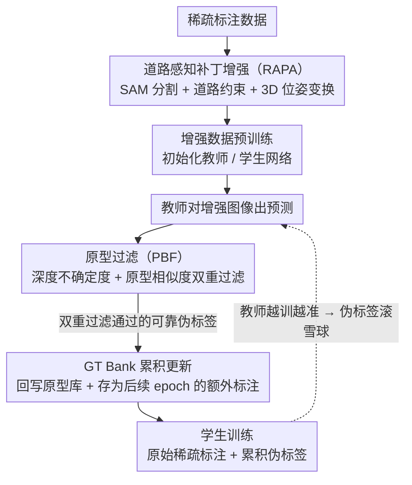

# MonoSAOD: Monocular 3D Object Detection with Sparsely Annotated Label

**会议**: CVPR 2026  
**arXiv**: [2604.01646](https://arxiv.org/abs/2604.01646)  
**代码**: [https://github.com/VisualAIKHU/MonoSAOD](https://github.com/VisualAIKHU/MonoSAOD)  
**领域**: 3D视觉 / 目标检测  
**关键词**: 单目3D检测, 稀疏标注, 数据增强, 伪标签, 原型过滤

## 一句话总结

首次定义并解决稀疏标注单目 3D 目标检测问题，提出道路感知补丁增强（RAPA）和原型过滤（PBF）两个模块，在 KITTI 30% 标注设置下大幅超越现有 2D SAOD 方法（AP3D Easy: 21.28 vs 17.14）。

## 研究背景与动机

**领域现状**：单目 3D 目标检测通过单张图像推断 3D 物体信息（深度、尺寸、朝向），是自动驾驶的关键技术。近年来 MonoDETR、MonoDGP 等方法在全标注数据集上取得了显著进展，但都假设所有物体都有完整 3D 标注。

**现有痛点**：3D 标注成本极高——需要精确的深度、尺寸和朝向标签，耗时是 2D 标注的 3-16 倍。因此真实数据集中标注往往不完整：同一个可见物体在某些场景中被标注，在另一些场景中被遗漏，形成稀疏且不一致的标注。这种不一致会严重干扰模型学习可靠的深度和朝向线索。

**核心矛盾**：现有 2D 稀疏标注检测（SAOD）方法基于分类置信度分数选择伪标签，但置信度反映的是 2D 定位的确定性，而非 3D 属性（深度、朝向）的准确性。结果是高置信度预测可能包含巨大的 3D 误差。而基于点云的 3D SAOD 方法依赖 LiDAR 深度，在单目设置中不可用。

**本文目标** (1) 在有限标注下如何增强模型对道路-物体关系的理解和场景多样性？(2) 如何生成可靠的伪标签——既验证 2D 外观一致性又确保 3D 几何准确性？

**切入角度**：将问题分解为"用好少量标注"（数据增强）和"挖掘未标注物体"（伪标签）两条路线，分别设计针对单目 3D 检测特殊需求的模块。

**核心 idea**：用 SAM 分割+道路约束+3D 几何变换做增强，用原型相似度+深度不确定度双重过滤做伪标签，解决稀疏标注单目 3D 检测。

## 方法详解

### 整体框架

这篇论文要解决的是单目 3D 检测里一个被忽视的现实问题：训练集里同一类可见物体在有些图上被标了、有些图上漏标了，标注稀疏又不一致，模型既学不到稳定的深度/朝向线索，又会把漏标物体误当成负样本。MonoSAOD 用一套教师-学生流程同时从两端补救。先用 RAPA 把现有那点稀疏标注"搬"到更多合理位置，生成几何一致的增强样本，并用增强后的数据预训练出初始模型来初始化教师和学生。训练时，教师对增强图像出预测，PBF 用深度不确定度和原型相似度把其中真正可靠的挑出来当伪标签；挑中的伪标签一边回写去精化原型库，一边存进 GT Bank 当作后续 epoch 的额外标注。学生则在"原始稀疏标注 + 不断累积的伪标签"上一起训练，可用监督信号随训练越滚越多。

### 关键设计

**1. 道路感知补丁增强（RAPA）：让 copy-paste 出来的物体既不悬浮也几何自洽**

直接把物体抠出来贴到别处的传统 copy-paste 在单目 3D 上有三处硬伤：矩形补丁带进背景噪声、不管道路约束导致物体悬空或贴到墙上、不调 3D 位姿使得朝向和深度对不上几何。RAPA 逐条堵住。它先从训练集里挑无截断、无遮挡的高质量标注物体，用 SAM 精确分割掉背景只留物体本体；对目标图也用 SAM 生成道路掩码 $M_\text{road}$。然后把物体补丁按相机外参从源坐标系搬到目标坐标系：

$$[x_t, y_t, z_t]^T = [R_t \mid T_t][R_s \mid T_s]^{-1}[x_s, y_s, z_s]^T$$

接着在水平方向均匀采样偏移搜索候选落点，每挪一个位置就重算朝向角 $r_y' = \alpha + \text{arctan2}(x_t', z_t')$ 以保持观察角不变，再投影回 2D 检查两个约束：物体底部与道路掩码的重叠率要 ≥ $\tau_\text{road}$（确保站在路面上），与已有标注框的 IoU 要 < $\tau_\text{overlap}$（避免不真实的重叠遮挡）。两关都过的位置才落子。这样贴出来的物体在视觉上没有背景毛边、在几何上深度朝向都自洽，等于用一点稀疏标注合成出大量物理可信的新场景。

**2. 原型过滤（PBF）：用深度不确定度 + 原型相似度替代靠不住的分类置信度**

2D SAOD 惯用的分类置信度反映的是"框得准不准"，根本不保证深度、朝向这些 3D 属性对——高分预测照样可能深度错得离谱。PBF 换两把更对口的尺子，分三步走。第一步建原型库：用稀疏标注抽教师的 RoI 特征，加权累积成类别原型集合 $\mathcal{P} = \{p_k\}_{k=1}^K$（容量 K=256），余弦相似度 > 0.8 的特征并入同一原型，差异大的另起新原型。第二步查几何可靠性：借 Laplacian 不确定度损失训练出的深度不确定度 $\sigma$，算几何可靠性分数 $S_\text{depth} = \exp(-\sigma)$，只有 $S_\text{depth} > \tau_\text{depth}$ 才放行——这一关专门拦深度估计虚的预测。第三步查语义一致性：算候选 RoI 特征对所有原型的最大余弦相似度 $S_\text{proto}^{(i)} = \max_{p_k} \cos(f_\text{roi}^{(i)}, p_k)$，只有 $S_\text{proto} > \tau_\text{proto}=0.85$ 才放行——这一关拦外观异常的预测。两关同时通过的预测才被收为伪标签，几何可靠和语义一致缺一不可。

**3. GT Bank 累积更新：让可靠伪标签随训练滚雪球**

PBF 选出的伪标签不是用完即弃，而是存进 GT Bank，在之后的 epoch 里当额外标注继续监督学生。同时这些伪标签的 RoI 特征会以小步长加权回写原型库 $p_k' = (1-\beta)p_k + \beta f_\text{roi}$（$\beta=0.005$），让原型缓慢跟上不断演化的特征分布。随着教师越训越准，GT Bank 里的可靠伪标签越攒越多、原型也越来越贴合，形成"预测更准 → 伪标签更多更稳 → 监督更强 → 预测再更准"的正向循环。举例说，第一轮可能只有少数高确定度物体被收进 GT Bank，几个 epoch 后此前漏标的远处车辆被逐步确认补进来，有效训练数据量随之膨胀，而错误深度的候选始终被 $S_\text{depth}$ 那一关挡在门外。

### 损失函数 / 训练策略

基于 MonoDETR 架构（ResNet-50 backbone），深度不确定度使用 Laplacian aleatoric uncertainty loss：$\mathcal{L}_\text{depth} = \frac{\sqrt{2}}{\sigma}\|d_\text{gt} - d_\text{pred}\|_1 + \log(\sigma)$。先用 RAPA 增强后的稀疏标注数据预训练模型，再初始化教师-学生网络进行伪标签训练。单卡 RTX 3090，batch=16，AdamW 优化器，训练 100 epochs。

## 实验关键数据

### 主实验

| 方法 | 30% Easy | 30% Mod. | 30% Hard | 50% Mod. | 70% Mod. |
|------|----------|----------|----------|----------|----------|
| Baseline (MonoDETR) | 11.17 | 8.73 | 7.56 | 15.25 | 17.83 |
| Co-mining | 16.01 | 12.62 | 10.38 | 16.22 | 18.21 |
| Calibrated Teacher | 17.14 | 12.96 | 10.58 | 16.03 | 18.94 |
| **MonoSAOD (Ours)** | **21.28** | **15.60** | **12.79** | **18.84** | **19.37** |

在 30% 标注最困难设置下，提升最为显著（Easy: +4.14, Mod.: +2.64, Hard: +2.21 vs 最强基线）。KITTI 测试集上 30% 标注下 Easy AP3D 达 17.47（vs 最强基线 10.76），提升 62%。

### 消融实验

| 配置 | Easy | Mod. | Hard |
|------|------|------|------|
| Baseline (无增强无伪标签) | 11.17 | 8.73 | 7.56 |
| + Confidence 伪标签 | 12.39 | 9.68 | 8.18 |
| + Conf. + PBF | 16.49 | 12.65 | 10.32 |
| + Conf. + RAPA | 20.31 | 14.51 | 11.72 |
| + Conf. + RAPA + PBF (Full) | **21.28** | **15.60** | **12.79** |

### 关键发现

- **RAPA 贡献最大**：仅加 RAPA 就将 Easy AP3D 从 12.39 提升到 20.31（+7.92），说明几何一致的数据增强对稀疏标注极为关键
- **PBF 提供互补增益**：在 RAPA 基础上再加 PBF 提升约 1 个点（20.31→21.28），单独使用 PBF 从 12.39 提升到 16.49（+4.10）
- **仅用置信度过滤效果微弱**：Confidence-based 伪标签仅提升约 1 个点，验证了分类置信度无法反映 3D 准确性的论点
- **泛化到其他架构**：在 MonoDGP 上使用 RAPA+PBF 同样大幅提升（30% 标注下 Mod.: 11.70→16.79），说明方法有通用性
- **雾天鲁棒性**：在 foggy KITTI 下 30% 标注，MonoSAOD 达 13.72 Mod. AP3D（vs 最强基线 8.65），在恶劣天气下优势更加明显

## 亮点与洞察

- **首次定义稀疏标注单目 3D 检测问题**：指出了现有 SAOD 方法（为 2D 设计）在 3D 检测中的根本不适用性——置信度无法反映 3D 几何准确性，这个问题陈述本身就是贡献
- **SAM + 道路约束 + 3D 变换的精巧结合**：RAPA 把 SAM 的分割能力、道路语义约束、和 3D 几何变换巧妙组合，生成的增强样本在视觉和几何上都真实可信。这种几何感知的 copy-paste 思路可迁移到其他需要 3D 一致性的增强任务
- **深度不确定度+原型相似度的双重过滤**：利用已有的 Laplacian 不确定度信号作为 3D 可靠性代理，成本低但效果好

## 局限与展望

- 仅在 KITTI 数据集上验证，缺少 nuScenes、Waymo 等更大规模数据集的结果
- RAPA 依赖 SAM 分割和手动提供的道路区域点提示，自动化程度可提升
- 原型库容量 K=256 是固定的，对于类别更多的场景（如行人、骑车人等多类）可能不够
- 30% 标注设置下与全标注差距仍然很大（蕴含进一步改进空间）
- PBF 的阈值（$\tau_\text{depth}=1.0$、$\tau_\text{proto}=0.85$）为手工设定，自适应阈值可能更好

## 相关工作与启发

- **vs Calibrated Teacher**：Calibrated Teacher 通过校准教师置信度来选择伪标签，但仍基于 2D 信息。MonoSAOD 的 PBF 额外验证 3D 深度可靠性，在单目 3D 检测中优势明显
- **vs Co-mining / SparseDet**：这些方法设计自一致性损失或梯度重加权来处理缺失标注，但不够直接。MonoSAOD 直接生成增强数据+过滤伪标签，更简单有效
- **vs Semi-supervised M3OD**：半监督方法假设部分图像全标注、部分图像无标注，而 SAOD 是每张图像都有部分遗漏标注，问题设定不同

## 评分

- 新颖性: ⭐⭐⭐⭐ 首次定义并系统解决稀疏标注单目 3D 检测，RAPA 的 3D 几何感知增强设计精巧
- 实验充分度: ⭐⭐⭐⭐ 多种标注比例、测试集评估、架构泛化、雾天鲁棒性、完整消融
- 写作质量: ⭐⭐⭐⭐ 问题动机讲解清晰，方法描述详细，但部分公式可简化
- 价值: ⭐⭐⭐⭐ 解决了实际存在的标注稀疏问题，方法有通用性，开源代码

<!-- RELATED:START -->

## 相关论文

- [\[CVPR 2026\] Towards Intrinsic-Aware Monocular 3D Object Detection](towards_intrinsic-aware_monocular_3d_object_detection.md)
- [\[CVPR 2026\] Unleashing the Power of Chain-of-Prediction for Monocular 3D Object Detection](unleashing_the_power_of_chain-of-prediction_for_monocular_3d_object_detection.md)
- [\[CVPR 2026\] SPAN: Spatial-Projection Alignment for Monocular 3D Object Detection](span_spatial-projection_alignment_for_monocular_3d_object_detection.md)
- [\[CVPR 2025\] MonoPlace3D: Learning 3D-Aware Object Placement for 3D Monocular Detection](../../CVPR2025/3d_vision/monoplace3d_learning_3d-aware_object_placement_for_3d_monocular_detection.md)
- [\[AAAI 2026\] MonoCLUE: Object-Aware Clustering Enhances Monocular 3D Object Detection](../../AAAI2026/3d_vision/monoclue_object-aware_clustering_enhances_monocular_3d_object_detection.md)

<!-- RELATED:END -->
