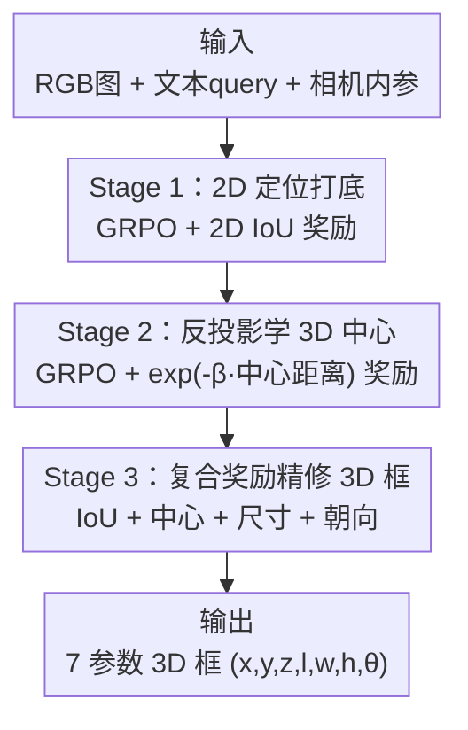

# MonoVLM: Monocular 3D Visual Grounding with Vision Language Models

**会议**: CVPR 2026  
**论文**: [CVF Open Access](https://openaccess.thecvf.com/content/CVPR2026/html/Qu_MonoVLM_Monocular_3D_Visual_Grounding_with_Vision_Language_Models_CVPR_2026_paper.html)  
**代码**: 待确认  
**领域**: 3D视觉  
**关键词**: 单目 3D grounding、视觉语言模型、GRPO、课程式强化学习、3D 目标框预测

## 一句话总结
MonoVLM 用一个**三阶段课程式 GRPO 训练**框架，把"连 GPT-5 都几乎做不动"的单目 3D 视觉 grounding（看一张 RGB 图 + 一句文本描述，预测目标的 3D 包围框）从近零分拉到 SOTA——先教模型把 2D 定位做准，再借相机投影/反投影学 3D 中心，最后用复合奖励精修完整 3D 框，7B 模型在 Mono3DRefer 上反超专用纯视觉方法。

## 研究背景与动机
**领域现状**：单目 3D 视觉 grounding 要求"给一张图 + 一句自然语言描述，定位物体并预测它的 3D 包围框"。传统上这个任务由专用纯视觉模型（如 Mono3DVG、Mono3DVG-TGE）解决，它们靠融合视觉特征与深度线索取得很强成绩；另一边，VLM 在 2D 视觉理解与指令跟随上势如破竹。

**现有痛点**：两条路各有硬伤——专用模型**缺语义理解**，依赖预定义视觉特征、难以解读训练域之外复杂或微妙的语言描述；而 VLM（哪怕 GPT-5）在 3D 感知上**表现极差**，Acc@0.25 常常不到 2%、mIoU 个位数，几乎做不动这个任务。

**核心矛盾**：作者把 VLM 的失败拆成三个具体根因——① **2D 定位不准**，连物体在图像平面的位置都框不对；② **3D 几何理解缺失**，对深度、相对尺寸、空间关系都没概念；③ **不会用相机投影/反投影矩阵的几何对偶性**，给了内参也用不起来。一个反直觉的实证（Table 1）很说明问题：朴素训练后模型在**深度（z）轴**意外地准，但在**横向（x）/纵向（y）轴**误差巨大——因为 $x, y$ 是从 2D 图像中心 $(u,v)$ 反投影出来的，2D 框不准就直接污染了 3D 坐标。

**本文目标**：在**不改架构、不加任务专用模块**的前提下，只靠训练策略把一个现成 VLM 改造成精确的单目 3D grounding 模型。

**切入角度**：既然失败可拆成 2D 定位 / 3D 中心 / 完整 3D 框三层，那就用**课程式**的方式逐层攻克，而非一上来就硬学 3D IoU。作者先做了个 pilot study：直接用 3D IoU 当 GRPO 奖励——结果证明这个信号**太稀疏**，无法引导模型理解 3D，反而留下 2D 定位差、3D 中心错的硬伤。

**核心 idea**：用 GRPO 搭一个 **coarse-to-fine 三阶段课程**——Stage 1 先把 2D 定位练扎实（这是 3D 的前提），Stage 2 借反投影公式学 3D 中心，Stage 3 用"IoU + 中心 + 尺寸 + 朝向"的复合奖励精修完整 3D 框。

## 方法详解

### 整体框架
MonoVLM 的输入是一张 RGB 图 $I$、一句文本 query $T$，以及相机内参（训练和推理时都假设可得）；输出是紧凑的 7 参数 3D 框 $y_o=(x,y,z,l,w,h,\theta)$——中心坐标、长宽高、绕竖直轴的偏航角 $\theta$。整套方法不动模型架构，只用一条三阶段 GRPO 课程把任务从易到难拆开：每一阶段都用一个**可验证的几何奖励**驱动 GRPO，把上一阶段练好的能力当作下一阶段的地基。

### 关键设计

**1. 课程式 GRPO + 紧凑 7 参数表示：用可验证奖励逐层攻克，而非一步登天**

整套方法的底座是两个选择。其一用 **GRPO** 而非 SFT 或 PPO：GRPO 对一个 prompt 采样 $G$ 个候选 $\{o_1,\dots,o_G\}$，用各自奖励 $r_i$ 的组内均值/标准差归一化得到优势 $A_i=\frac{r_i-\text{mean}\{r\}}{\text{std}\{r\}}$，再用裁剪目标 + KL 正则更新策略，**不需要额外的 critic**，且天然适配 IoU 这类可验证奖励。其二用 **7 参数紧凑表示**（中心+尺寸+朝向）而非 8 顶点显式坐标——消融证明 8 顶点表示反而有害，因为预测空间维度更高、纯坐标的 3D 语义模糊。这两个选择加上"把 3D grounding 拆成 2D→3D 中心→完整框"的课程顺序，是后面三个阶段能层层奏效的前提（这是一个贯穿全程的设计，对应框架文字而非单一节点）。

**2. Stage 1：2D 定位打底——3D 误差的真正源头在 2D**

pilot study 发现朴素 3D IoU 训练后，深度 $z$ 反而准、横纵 $x,y$ 误差大。原因藏在反投影公式里：

$$x = \frac{(u-c_x)\cdot z}{f_x}, \quad y = \frac{(v-c_y)\cdot z}{f_y}$$

其中 $(f_x,f_y)$ 是焦距、$(c_x,c_y)$ 是主点。可见即便深度 $z$ 估得很准，2D 中心 $(u,v)$ 一旦有误差就会**直接传播**到 $x,y$。所以 Stage 1 干脆只用 **2D IoU 奖励** $R_{\text{stage-1}}=\text{2DIoU}(\hat b_i,b_i)$ 把 2D 定位练扎实。妙的是这个纯 2D 训练不仅提升 2D，还顺带显著降低了 3D 中心误差（Table 1：MiMo 的 x 轴误差 2.86→0.60），印证了"先把 2D 做准是 3D 的必要前提"。

**3. Stage 2：反投影监督学 3D 中心——让模型自己发现 2D-3D 对偶**

Stage 1 后 3D 中心（尤其 y 轴）误差仍大，Stage 2 直接优化 3D 中心位置，奖励为预测中心 $\hat c_i$ 与 GT 中心 $c_i$ 的欧氏距离的指数：

$$R_{\text{stage-2}} = \exp(-\beta\lVert\hat c_i - c_i\rVert_2)$$

$\beta$ 控制奖励对距离的敏感度，无需额外深度监督。一个关键观察是协同效应：明明只优化 3D 中心，2D grounding 的 IoU 却**附带持续上升**（Figure 3）——因为根据反投影几何约束，要准确预测 3D 中心，模型必须隐式地把 2D 定位也修得更准。这说明模型在这一阶段"发现"了 2D 与 3D 之间的对偶关系。

**4. Stage 3：复合奖励精修完整 3D 框——给稀疏的 3D IoU 补上密集信号**

最后一阶段优化完整 3D grounding。只用 3D IoU 当奖励会面临稀疏、难优化的 landscape（消融里只用 IoU 仅 21.31 mIoU），于是作者在 IoU 主奖励之外，对 3D 框的三个分量分别加细粒度奖励：中心位置用欧氏距离 $R_{\text{loc}}=\exp(-\beta_{\text{loc}}\lVert\hat c-c\rVert_2)$、尺寸用归一化 L1 距离 $R_{\text{size}}=\exp(-\beta_{\text{size}}\frac{\lVert\hat d-d\rVert_1}{\lVert d\rVert_1+\epsilon})$（鼓励尺度不变学习）、朝向用余弦相似 $R_{\text{rot}}=\frac{1}{2}(\cos(\hat\theta-\theta)+1)$（处理角度的周期性）。默认等权组合，适度重加权下也稳定。复合奖励把"完整 3D 框"这件难事拆成几条密集、互补的监督，把 mIoU 从只用 IoU 的 21.31 一路推到 29.13。

> ⚠️ **框架↔关键设计一致**：框架图的三个 stage 节点正是关键设计 2/3/4，关键设计 1（课程式 GRPO + 7 参数表示）是贯穿三阶段的底层选择，已在整体框架文字中点明。

### 损失函数 / 训练策略
全程用 GRPO（含裁剪目标 + KL 正则到固定参考策略 $\pi_{\text{ref}}$），三阶段各换一个几何奖励。基座 VLM 用 Qwen2.5-VL-7B 与 MiMo-VL-7B，分别得到 MonoVLM-Qwen / MonoVLM-MiMo。实现基于 EasyR1，4× H100、默认超参。

## 实验关键数据

**数据集**：Mono3DRefer（单目 3D grounding 标准库），官方划分 训练 29990 / 验证 5735 / 测试 5415，沿用原始评测协议。**指标**：Acc@0.25 / Acc@0.5 表示 mIoU 超过 0.25 / 0.5 的预测占比；mIoU 衡量定位质量。评测按 Object Uniqueness（unique 单一同类 / multiple 多干扰物）、Object Depth（Near 0–15m / Medium 15–35m / Far >35m）、Occlusion（Easy/Moderate/Hard，按 KITTI 定义）三个维度细分。

### 主实验（Overall，Mono3DRefer）

| 方法 | 类型 | Acc@0.25 | Acc@0.5 | mIoU(Overall) |
|------|------|----------|---------|---------------|
| GPT-5 | 闭源 VLM | 5.98 | 0.23 | 7.53 |
| Qwen2.5-VL-72B | 开源 VLM | 0.20 | 0.00 | 0.89 |
| Cube R-CNN + Best | 纯视觉两阶段 | 55.77 | 29.92 | — |
| Mono3DVG | 纯视觉 trans. | 64.36 | 44.25 | — |
| Mono3DVG-TGE | 纯视觉 trans. | 68.44 | 51.21 | — |
| **MonoVLM-Qwen (Ours)** | 开源 VLM | 61.89 | 38.13 | 29.13 |
| **MonoVLM-MiMo (Ours)** | 开源 VLM | **69.41** | 42.96 | **38.11** |

要点：通用 VLM（含 GPT-5）几乎全军覆没（Acc@0.25 常 <2%、mIoU 个位数）；MonoVLM 把它们从近零拉到 SOTA，**MonoVLM-MiMo 的 Acc@0.25 69.41 超过专用 SOTA Mono3DVG-TGE 的 68.44**，mIoU 38.11 是最强 VLM 基线 GPT-5（7.53）的 **5 倍多**。在最难的 Multiple 场景（需要靠语言消歧）也以 71.23 反超 Mono3DVG-TGE 的 69.83，说明 VLM 的语言能力在消歧上确有优势。

### 消融实验

| 配置 | mIoU | 说明 |
|------|------|------|
| Stage-1 only | 19.81 | 仅 2D 定位打底 |
| Stage-1+2 | 20.89 | 加 3D 中心 |
| **三阶段（Ours）** | **29.13** | 完整课程（MonoVLM-Qwen） |
| Stage 3 仅 IoU 奖励 | 21.31 | 复合奖励起点 |
| + Location | 25.92 | 加中心奖励 |
| + Size | 28.73 | 再加尺寸奖励 |
| + Rotation（Ours） | 29.13 | 完整复合奖励 |

| 极简变体对比 | mIoU | Acc@0.25 | Acc@0.5 |
|-------------|------|----------|---------|
| 直接 SFT | 33.07 | 60.74 | 35.79 |
| 仅 Stage-3 奖励 | 32.59 | 62.33 | 33.01 |
| **完整三阶段（Ours）** | **38.11** | **69.41** | **42.96** |

### 关键发现
- **每一阶段都有正贡献**：三阶段 mIoU 单调上升 19.81→20.89→29.13，Stage 3 的复合奖励带来最大跃升（说明把完整 3D 框拆成密集分量奖励是关键）。
- **2D 定位是 3D 误差的真正瓶颈**：pilot study 里深度 z 意外准、x/y 差，根因是 2D 中心不准经反投影放大；这是全篇方法设计的出发点，也是最有价值的洞察。
- **2D-3D 对偶被模型自发利用**：Stage 2 只优化 3D 中心，2D IoU 却附带上升，验证了几何约束下"修 3D 必须修 2D"的协同。
- **简单胜过复杂**：作者强调三阶段课程虽直观，却在消融中优于更复杂的替代方案（直接 SFT、仅 Stage-3 奖励都更差），印证"streamlined approach is maximally effective"。
- **8 顶点表示有害**：紧凑 7 参数表示优于显式 8 顶点坐标，后者预测空间维度高、3D 语义模糊。

## 亮点与洞察
- **把失败先诊断再开方**：先用 pilot study 定位"2D 定位差 → 经反投影污染 3D"这个具体病灶，再针对性地设三阶段课程，是教科书式的"先理解失败再设计方法"。
- **几何对偶当免费监督**：Stage 2 只监督 3D 中心却附带把 2D 练好，等于用相机投影几何把两个任务的梯度耦合起来，这个"附带收益"是巧妙之处，可迁移到其他需要 2D-3D 一致性的任务。
- **复合奖励解稀疏难题**：把单一稀疏的 3D IoU 拆成中心/尺寸/朝向三条密集、互补的奖励，是用 RL 训练几何回归任务的实用范式。
- **不改架构、纯训练**：证明现成 VLM 不靠任何任务专用模块也能逼近甚至超过专用 3D 模型，为"VLM 当统一视觉骨干"提供了有力证据。

## 局限与展望
- **依赖相机内参**：训练和推理都假设内参可得，未讨论内参未知/不准时的鲁棒性。
- **单一数据集验证**：实验只在 Mono3DRefer 上做，跨数据集/跨域泛化（如真实自动驾驶分布漂移）未充分检验。
- **课程顺序为人工设计**：三阶段的拆分与顺序是人工设定的，是否对所有 3D 任务最优、能否自动课程编排仍是开放问题。
- **奖励超参敏感性披露有限**：复合奖励里各 $\beta$ 与权重虽称"适度重加权下稳定"，但缺系统的敏感性分析。
- **改进思路**：把课程式 GRPO 推广到多类 3D 任务（检测、布局推理）、探索内参自估计、研究自动课程与奖励权重学习。

## 相关工作与启发
- **vs Mono3DVG / Mono3DVG-TGE（专用纯视觉）**: 它们靠融合视觉+深度线索做语言引导的 3D 定位，但缺深层语义理解、难解读训练域外的复杂描述；MonoVLM 直接用 VLM 当预测模型，语言理解更强，在 Multiple 消歧场景反超它们（Acc@0.25 71.23 vs 69.83）。
- **vs 通用 VLM（GPT-5 / Qwen2.5-VL-72B / Gemini-2.5-Pro）**: 它们 2D 强但 3D 几何近乎不会（mIoU 个位数）；MonoVLM 用同等甚至更小的 7B 模型经三阶段训练把 mIoU 提升一个数量级（38.11 vs GPT-5 7.53）。
- **vs 标准 GRPO / RL-for-VLM 工作**: 已有工作用 GRPO 强化 2D grounding；本文把这套奖励驱动思路扩展到更复杂的 3D 域，并用课程把稀疏 3D 信号拆成可学的密集子目标。

## 评分
- 新颖性: ⭐⭐⭐⭐ 不改架构、纯训练策略把 VLM 拉到 3D grounding SOTA，课程式 GRPO + 几何奖励拆解的组合很新
- 实验充分度: ⭐⭐⭐⭐ 主结果 + 多维度细分 + 三组消融充分支撑设计，但只在单一数据集 Mono3DRefer 上验证
- 写作质量: ⭐⭐⭐⭐⭐ 从失败诊断到方法逻辑链非常清晰，公式与协同效应解释到位
- 价值: ⭐⭐⭐⭐ 证明现成 VLM 能逼近专用 3D 模型，为统一 3D-aware 视觉系统指了一条简单可行的路

<!-- RELATED:START -->

## 相关论文

- [\[CVPR 2026\] UZ3DVG: Unaided Zero-Shot 3D Visual Grounding with Generated Language Conditions](uz3dvg_unaided_zero-shot_3d_visual_grounding_with_generated_language_conditions.md)
- [\[CVPR 2026\] Geometry-Guided 3D Visual Token Pruning for Video-Language Models](geometry-guided_3d_visual_token_pruning_for_video-language_models.md)
- [\[CVPR 2026\] Zero-Shot Depth Completion with Vision-Language Model](zero-shot_depth_completion_with_vision-language_model.md)
- [\[CVPR 2026\] ORD: Object-Relation Decoupling for Generalized 3D Visual Grounding](ord_object-relation_decoupling_for_generalized_3d_visual_grounding.md)
- [\[CVPR 2026\] PV-Ground: Text-Guided Point-Voxel Interaction for 3D Visual Grounding](pv-ground_text-guided_point-voxel_interaction_for_3d_visual_grounding.md)

<!-- RELATED:END -->
