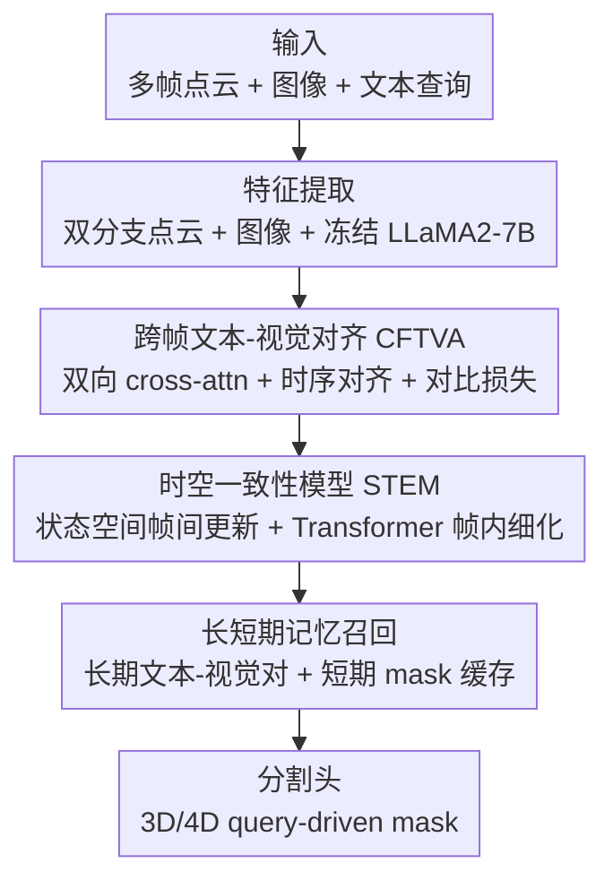

# MORE-STEM: Long-Short MemOry REcall and Spatio-TEmporal Consistency Model for Query-Driven 3D/4D Point Cloud Segmentation

**会议**: CVPR 2026  
**论文**: [CVF Open Access](https://openaccess.thecvf.com/content/CVPR2026/html/Li_MORE-STEM_Long-Short_MemOry_REcall_and_Spatio-TEmporal_Consistency_Model_for_Query-Driven_CVPR_2026_paper.html)  
**代码**: 无（未公开）  
**领域**: 3D视觉 / 点云分割 / 视觉语言  
**关键词**: 4D点云分割、指令分割、时空一致性、记忆机制、跨模态对齐

## 一句话总结
针对"语言驱动的 3D 分割只能处理静态单帧、无法理解动态场景"的痛点，MORE-STEM 把查询驱动分割从 3D 扩到 4D 点云序列，用跨帧文本-视觉对齐 + 时空一致性建模（状态空间 + 稀疏 Transformer）+ 长短期记忆召回三个模块串起来，并构建了首个室外 3D/4D 指令分割基准 InstructKITTI，在指令/指代/语义多个分割任务上同时刷 SOTA。

## 研究背景与动机

**领域现状**：用自然语言查询去定位/分割 3D 点云里的目标（query-driven / 指令分割 / 指代分割）是视觉-语言研究的热点，ScanRefer、GRES、3D-GRES、SegPoint 等已在静态单帧 RGB-D/点云上建立了若干基准，证明了视觉-语言对齐在 3D 感知里的有效性。

**现有痛点**：这些方法几乎都被限制在**静态 3D 单帧**上，没建模时间演化，一旦物体运动、或者需要前几帧的上下文，就会给出前后不一致的结果。而在自动驾驶、机器人、具身感知这些真实场景里，时间上下文和物体运动恰恰是不可或缺的——如图 1 所示，带时间/运动描述的查询（"那辆**正在反方向行驶、离我更近**的银色车"）能把"多个相似目标的模糊指代"收敛成"单个明确目标"，但静态方法根本用不上这种时序线索。

**核心矛盾**：少数尝试时序建模的工作要么靠简单的帧聚合、要么靠循环融合，这类**帧级/全局特征融合**在遮挡或大位移下难以维持**体素级**的时空一致性，也抓不住长程依赖和跨场景召回；同时现有记忆机制（MemorySeg、DDSemi、MAD）要么纯空间更新、缺语义/模态引导，要么只在训练时正则、不做实时序列推理，缺乏长短期的有原则协调。

**本文目标**：构建一个统一框架，同时解决 3D 语义分割、3D 指代分割、3D/4D 指令分割，且能在动态场景下保持时空一致、做跨场景记忆召回。

**切入角度**：与其在单帧上死磕，不如把语言查询和**跨帧**的演化 3D 特征做细粒度时间对齐，再用状态空间模型在**体素级**传播时序特征、用分层记忆兼顾长期语义与短期适应。

**核心 idea**：三个模块各司其职——跨帧文本-视觉对齐（CFTVA）负责"语言对得上演化的视觉"，时空一致性模型（STEM）负责"帧间体素特征稳得住"，长短期记忆召回负责"远场景记得住、近帧续得上"，外加一个新基准把这条路打通。

## 方法详解

### 整体框架
输入是多帧点云、RGB 图像和一条文本查询。先用双分支点云编码器抽特征：轻量 Point Transformer 出逐点嵌入 $F_{\text{point}}$，稀疏 3D Transformer（带窗口移位注意力）出体素特征 $F_{\text{voxel}}$；图像过图像编码器出 $F_{\text{img}}$；文本用冻结的 LLaMA2-7B 编成 $F_{\text{txt}}$。这四类特征先进 **CFTVA** 做跨模态、跨帧对齐，把语言语义在空间和时间上都对齐到演化的 3D 特征上；对齐后的视觉表示进 **STEM**，用状态空间模型做帧间体素传播、用可控 3D Transformer 做帧内空间细化，保证运动场景下分割稳定；再进 **长短期记忆召回**：长期记忆从远场景检索文本-视觉对维持语义连续，短期记忆缓存近邻帧的 mask 特征做实时适应；最后分割头输出带时空一致性的 3D/4D mask。

### 关键设计

**1. 跨帧文本-视觉对齐（CFTVA）：让语言对上正在演化的 3D 特征**

静态对齐对不上动态场景——物体在动，查询里的"反方向""更近"这类时序词需要跨帧的视觉证据才能落地。CFTVA 分三步。先在每帧内做**双向跨模态注意力**，把图像线索注入点/体素特征：$F_t^{\text{point}'} = \mathrm{CrossAttn}(F_t^{\text{point}}, F_t^{\text{img}})$、$F_t^{\text{voxel}'} = \mathrm{CrossAttn}(F_t^{\text{voxel}}, F_t^{\text{img}})$，拼成每帧视觉表示 $F_t^{\text{vis}} = [F_t^{\text{point}'}, F_t^{\text{voxel}'}]$。再把 LLaMA2-7B 出的文本嵌入和视觉表示投到同一空间（$F^{\text{txt}'}=W_{\text{txt}}F^{\text{txt}}$，$F_t^{\text{vis}'}=W_{\text{vis}}F_t^{\text{vis}}$），用**时序跨模态注意力**把文本对齐到当前帧及前两帧的视觉 token 上：$F_t^{\text{vis}^{\text{align}}} = \mathrm{Attn}(F^{\text{txt}'}, [F_t^{\text{vis}'}, F_{t-1}^{\text{vis}'}, F_{t-2}^{\text{vis}'}])$——这一步让文本"看到"多帧上下文，时序词才有依据。最后用时序对比损失强化判别性对应：

$$\mathcal{L}_{\text{align}} = -\log\frac{\exp\big(\mathrm{sim}(F_t^{\text{vis}^{\text{align}}}, F^{\text{txt}'})/\tau\big)}{\sum_{t'}\exp\big(\mathrm{sim}(F_{t'}^{\text{vis}^{\text{align}}}, F^{\text{txt}'})/\tau\big)},$$

$\mathrm{sim}(\cdot)$ 为余弦相似度、$\tau$ 为温度。这样文本特征会随 3D 观测的演化动态适配，实现时序 grounded 的语义一致对齐。

**2. 时空一致性模型（STEM）：用状态空间在体素级把帧间特征稳住**

帧级/全局融合在遮挡和大位移下保不住体素级一致性，会有时序漂移。STEM 把"帧间传播"和"帧内细化"拆开做。帧间用**状态空间式递归**维护每个体素 $v$ 的时序隐状态：$h_t(v) = A\,h_{t-1}(v) + B\,[F_t^{\text{point}^{\text{align}}}(v)\,\|\,F_t^{\text{voxel}^{\text{align}}}(v)]$，$(A,B)$ 是可学习转移参数、$\|$ 为拼接——这种 SSM 形式不必显式堆帧就能跨帧高效传播、抓长程运动依赖。帧内再用**可控的体素级 Transformer** 做空间细化：$z_t(v) = \mathrm{Transformer}(Q_t, K_t, V_t)$，强化同帧邻近体素间的空间相干和细粒度结构关系。最后归一化融合两者得到精细时空特征：$\tilde{f}_t(v) = \mathrm{Norm}\big(h_t(v) + z_t(v)\big)$，兼顾时序一致与几何稳定。SSM 管"跨时间稳"、Transformer 管"同帧准"，两者相加是这个模块的核心。

**3. 长短期记忆召回（LTM + STM）：远场景记得住、近帧续得上**

单一记忆要么只顾全局语义、要么只顾局部连续，缺乏长短协调。**长期记忆（LTM）** 维护三个关联记忆库——文本库 $\{F_i^{\text{txt}}\}$、特征对库 $\{f_{\text{pair}}^i\}$、视觉库 $\{\tilde{f}_i\}$，每个存的对按置信度加权 $w_i^{\text{init}} = \frac{1}{\mathcal{L}_i + \epsilon}$（损失越小、越可靠、权重越大）。为防止高频类别样本过度堆积带偏，额外维护偏置权重：当新样本属于已有类别 $c$ 时，更新 $w_i^{\text{bias}} = \frac{w_i^{\text{init}}}{\sum_{j\in c} w_j^{\text{init}}}$，保证类别 $c$ 的总权重不随样本增多而膨胀，从而平衡长期语义召回。推理时文本查询先对文本库做 self-attention 检索语义对齐上下文，再以其加权特征当 Query 对特征对库做 self-attention 聚合多模态对应，最后两次输出做 cross-attention 得到富含跨场景语义的视觉表示。**短期记忆（STM）** 则维护一个 Mask 记忆库 $\{\tilde{f}_{\text{mask}}^{i-k}\}_{k=1}^{K}$ 存近邻帧的 mask 特征：当前帧 $i$ 用 LTM 输出当 Query、mask 记忆当 Key/Value 做 cross-attention 检索时序信息，经轻量分类器预测当前 mask，预测完再把当前 mask 特征 $\tilde{f}_{\text{mask}}^i$ 压回库里，形成短期反馈回环。LTM 供全局跨场景知识、STM 保局部帧间连续，二者合成分层记忆，支撑稳定且上下文感知的 3D/4D 分割。

### 损失函数 / 训练策略
训练采用 AdamW + 余弦学习率调度，用总步数的 1% 做 warm-up。室内场景初始学习率 0.005、weight decay 0.05；室外场景 0.002、0.005。整体在 4×NVIDIA V100（32 GB）上训练。文本编码器 LLaMA2-7B 全程冻结，只用作上下文嵌入提取。

## 实验关键数据

### 主实验
评测覆盖四个子任务：4D 指令分割、3D 指令分割、3D 指代分割、3D 语义分割，用到 InstructKITTI（自建）、Instruct3D（基于 ScanNet++）、ScanRefer（基于 ScanNet）、SemanticKITTI。指标：mIoU；指令分割另用 SegPoint 的 **Acc**（IoU>0.5 即记为正确样本，Acc 为正确样本占比）。

| 基准/任务 | 指标 | 本文 | 次优 | 提升 |
|------|------|------|------|------|
| Instruct3D（3D 指令） | Acc | 31.4 | 27.5 (SegPoint) | +3.9 |
| Instruct3D（3D 指令） | mIoU | 35.9 | 31.6 (SegPoint) | +4.3 |
| InstructKITTI（3D 指令） | Acc | 38.62 | 21.60 (Chat-Scene) | +17.0 |
| InstructKITTI（3D 指令） | mIoU | 37.95 | 21.50 (Chat-Scene) | +16.5 |
| ScanRefer（3D 指代） | mIoU | 52.7 | 44.8 (RefMask3D) | +7.9（相对约 7.9%） |
| ScanRefer（3D 指代） | Acc@50 | 54.8 | 49.2 (RefMask3D) | +5.6 |
| SemanticKITTI（3D 语义，val） | mIoU | 74.6 | 73.4 (MR-COSMO) | +1.2 |

在自建 InstructKITTI 4D 基准上，本文取得 Acc@50 42.19、mIoU 40.67。在 InstructKITTI 上还报了效率：本文延迟 0.19s/查询、GPU 28.9（GB），相比 3D-STMN（0.05s、13.2）延迟略高但分割精度翻倍有余。

### InstructKITTI 基准构建
作者基于 SemanticKITTI 序列 00–10 自建了首个室外 3D/4D 指令分割基准，产出超 15K 条高质量（查询, 3D-Mask）对。流水线用双模式查询生成：动态模式捕捉运动关系（同向/反向/异向）、静态模式聚焦属性识别；先做实例级时空分析（算 3D 质心、估计实例与自车运动矢量），再把 3D mask 投到图像平面取 RGB crop，用 Qwen3VL-7B 抽开放词表属性（如"红色轿车"）并推断运动方向，最后经视觉-语言校验用 [SEG] token 把查询和 GT 3D 分割关联。

### 消融实验
在 Instruct3D 上逐个去掉四个模块（CFTVA / STEM / LTM / STM），$\Delta$ 列为相对 Baseline 提升 / 相对 full 的差距。

| 配置 | mIoU | 说明 |
|------|------|------|
| Baseline | 28.8 | 无四模块 |
| w/o CFTVA | 29.7 | 去跨模态对齐，分割精度明显下降 |
| w/o STEM | 30.6 | 去时空一致，帧间一致性不稳 |
| w/o LTM | 30.3 | 去长期记忆，跨场景推理变弱 |
| w/o STM | 30.8 | 去短期记忆，局部一致性变差 |
| w/ all（完整） | 31.4 | 完整 MORE-STEM |

### 关键发现
- **CFTVA 贡献最大**：去掉它从 31.4 掉到 29.7（−1.7），是四个模块里掉点最多的，说明把文本查询直接 ground 到 3D 空间的跨模态对齐最关键。
- **四模块各有不可替代角色**：STEM 缺失导致序列帧间一致性不稳、LTM 缺失削弱跨场景历史关联、STM 缺失引入细粒度局部不一致，四者齐备才到最高 mIoU。
- **室外动态收益最显著**：InstructKITTI 上相对 Chat-Scene 提升约 +17 Acc，远大于室内 Instruct3D 的提升幅度，说明时序建模在动态室外场景的价值更突出。

## 亮点与洞察
- **把 3D 指令分割正式扩到 4D 是个清晰的问题升级**：图 1 点出"加上时间和运动，模糊指代→明确单目标"，这个 motivation 直白有力，配套自建 4D 基准让任务可评测，填补了室外动态指令分割的空白。
- **STEM 的"SSM 管时间 + Transformer 管空间"分工很务实**：用状态空间递归在体素级跨帧传播、避免显式堆帧的开销，再用稀疏 Transformer 做帧内细化，把"时序漂移"和"空间细粒度"两个目标解耦处理，思路可迁移到其它 4D 感知任务。
- **长期记忆的类别均衡加权值得借鉴**：用 $w^{\text{init}}=1/(\mathcal{L}+\epsilon)$ 按置信度加权、再用 bias 权重把同类别总权重归一化防止高频类别堆积，这个细节对任何带记忆库的长尾召回都适用。

## 局限与展望
- **代码与基准未明确开源**：论文未给出代码链接，自建 InstructKITTI 的复现依赖补充材料里的流水线细节，复现门槛较高。
- **重度依赖大模型组件**：文本用冻结 LLaMA2-7B、基准构建用 Qwen3VL-7B，部署成本和对这些外部大模型的依赖较强，轻量化场景适用性存疑。
- **延迟偏高**：0.19s/查询、GPU 28.9 GB，相比 3D-STMN（0.05s/13.2 GB）开销明显增大，实时性受限；作者称"竞争性"但未给出更激进的效率方案。
- **记忆库随场景增长的存储/检索代价未充分讨论** ⚠️：长期三库 + 短期 mask 库在超长序列下如何控制规模、检索是否会成为瓶颈，论文着墨不多。

## 相关工作与启发
- **vs 静态查询分割（ScanRefer / GRES / 3D-GRES / SegPoint）**：它们只建模单帧、不含时序，运动或需要前帧上下文时给不出一致结果；本文扩到 4D 序列，用跨帧对齐 + 记忆召回处理动态，Instruct3D 上 mIoU 从 31.6 提到 35.9。
- **vs 时空建模（TASeg / Mamba4D / HiLoTs）**：这些多做帧级或全局融合，遮挡/大位移下保不住**体素级**一致性；本文 STEM 用 SSM 在体素级做时序传播、稀疏 Transformer 做帧内细化，针对性更强。
- **vs 记忆增强（MemorySeg / DDSemi / MAD）**：MemorySeg 纯空间更新缺语义引导、DDSemi 偏训练时正则非实时推理、MAD 记轨迹但缺长短协调；本文 LTM（加权文本-视觉对，跨场景）+ STM（mask 缓存，帧间）做了有原则的长短期分工。

## 评分
- 新颖性: ⭐⭐⭐⭐ 把指令分割从 3D 扩到 4D + 三模块协同 + 首个室外 4D 指令基准，组合创新扎实，单个模块多为已有思路的针对性适配。
- 实验充分度: ⭐⭐⭐⭐ 覆盖四类分割任务 + 自建基准 + 完整消融；但 4D 主表比较方法偏少、部分对比放在补充材料。
- 写作质量: ⭐⭐⭐⭐ 结构清晰、图示完整、动机直白；CVF 缓存里公式排版较乱（非作者问题）。
- 价值: ⭐⭐⭐⭐ 动态场景语言驱动分割对自动驾驶/机器人有实用意义，自建室外 4D 基准对社区有贡献。

<!-- RELATED:START -->

## 相关论文

- [\[AAAI 2026\] MR-CoSMo: Visual-Text Memory Recall and Direct Cross-Modal Alignment Method for Query-Driven 3D Segmentation](../../AAAI2026/3d_vision/mr-cosmo_visual-text_memory_recall_and_direct_cross-modal_alignment_method_for_q.md)
- [\[CVPR 2026\] STS-Mixer: Spatio-Temporal-Spectral Mixer for 4D Point Cloud Video Understanding](sts_mixer_4d_point_cloud.md)
- [\[CVPR 2026\] ST4R-Splat: Spatio-Temporal Referring Segmentation in 4D Gaussian Splatting](st4r-splat_spatio-temporal_referring_segmentation_in_4d_gaussian_splatting.md)
- [\[CVPR 2026\] SuP: Sub-cloud Driven Point Cloud Registration](sup_sub-cloud_driven_point_cloud_registration.md)
- [\[CVPR 2026\] ConsisVLA-4D: Advancing Spatiotemporal Consistency in Efficient 3D-Perception and 4D-Reasoning for Robotic Manipulation](consisvla-4d_advancing_spatiotemporal_consistency_in_efficient_3d-perception_and.md)

<!-- RELATED:END -->
