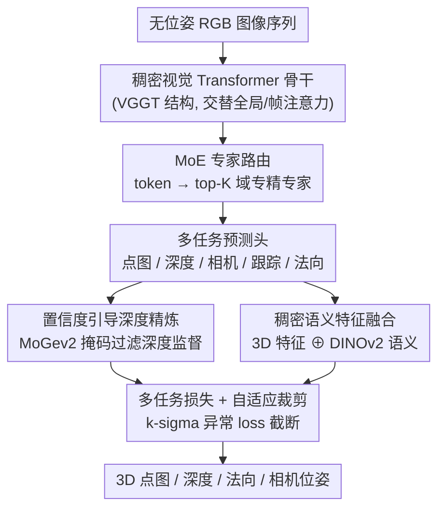

# MoRE: 3D Visual Geometry Reconstruction Meets Mixture-of-Experts

**会议**: CVPR 2026  
**论文**: [CVF Open Access](https://openaccess.thecvf.com/content/CVPR2026/html/Gao_MoRE_3D_Visual_Geometry_Reconstruction_Meets_Mixture-of-Experts_CVPR_2026_paper.html)  
**代码**: 项目页 https://g-1nonly.github.io/MoRE_Website/ （代码待确认）  
**领域**: 3D视觉  
**关键词**: 前馈3D重建, 混合专家(MoE), 视觉几何基础模型, 深度精炼, 多任务学习

## 一句话总结
MoRE 在 VGGT 这类前馈式稠密 3D 几何基础模型上引入混合专家（MoE）路由，让不同专家专精于室内/室外/物体/人体/动态等异质场景，再配上置信度引导的深度精炼和稠密语义特征融合，在点图、深度、相机位姿、法向四类任务上同时刷到 SOTA。

## 研究背景与动机

**领域现状**：3D 视觉几何重建正从「为每个场景单独优化」转向「前馈式基础模型」。以 DUSt3R / MASt3R / Fast3R / VGGT / Pi3 为代表的一类方法，直接从无位姿（unposed）图像回归点图、深度、相机参数、跟踪特征等多种几何量，把传统需要标定和全局对齐的流程压成一次前向传播，并展现出跨数据集的强泛化。

**现有痛点**：这类模型的成功很大程度依赖「大模型 + 大数据」的 scaling。但作者指出，3D 模型的继续放大比 LLM/2D 视觉更难——几何监督本身复杂（深度真值噪声大、不同任务的损失尺度不一），而 3D 数据高度异质（室内、室外、物体中心、人体中心、动态场景分布差异巨大）。单一稠密解码特征很难同时吃透这些差异巨大的域。

**核心矛盾**：想扩容（提升各域精度）就要堆参数和算力，但稠密激活的 Transformer 一旦放大，算力随参数线性甚至超线性增长，而且「一套权重打天下」在异质 3D 分布上会相互拖累。

**本文目标**：在不让算力随容量等比例膨胀的前提下，既扩大模型容量、又让容量按场景自适应分配，同时把噪声深度监督和多视图过度平滑这两个具体顽疾一并解决。

**切入角度**：借鉴 LLM 里的 MoE——每个 token 只激活少数专家，容量可扩而算力不爆，且专家天然会分化去专精数据的不同侧面。3D 场景的多样性正好契合「专家分工」的设定。

**核心 idea**：把 MoE 塞进前馈 3D 几何重建的预测管线，用路由器把特征动态分给域专精的专家；再用置信度掩码过滤掉不可信深度监督、用 DINOv2 语义补回多视图丢失的局部细节，最后用一组定制损失 + 自适应裁剪稳住大规模训练。

## 方法详解

### 整体框架
MoRE 是一个端到端前馈模型：输入是一段无位姿的 RGB 图像序列 $(I_i)_{i=1}^N$，经过一个稠密视觉 Transformer 骨干（沿用 VGGT 结构），一次输出每帧的相机参数 $C_i\in\mathbb{R}^9$、点图 $P_i$、深度 $D_i$、跟踪特征 $T_i$ 和法向图 $N_i$。在 VGGT 已有的点图/深度/相机/跟踪四个头之外，MoRE 额外加了一个法向预测头。训练分两阶段：**第一阶段**用多任务目标常规监督骨干和各任务头；**第二阶段**把骨干里交替的全局/帧注意力 FFN 复制成专家集合、插入 MoE 层继续训练，让模型按场景路由出专精表征。深度侧用置信度掩码精炼监督、法向侧用稠密语义融合补细节，整体由一组定制损失加自适应裁剪共同优化。

### 关键设计

**1. MoE 专家路由：用条件计算让一套模型自适应吃下异质 3D 场景**

这是论文的主创新，针对「单一解码特征吃不下多样 3D 域」的痛点。MoRE 把 MoE 层做成骨干里的模块化组件：初始化时把交替注意力结构（全局注意力、帧注意力）里的 FFN 复制成一组专家 $\varepsilon_i$，再用一个线性层做路由器预测每个 token 分到各专家的概率 $P(x)_i = e^{f(x)_i}/\sum_j e^{f(x)_j}$，其中 $f(x)=W\cdot x$ 是路由 logits。每个 token 只走概率最高的 top-K 个专家，输出按概率加权求和 $\text{MoE}(x)=\sum_{i=1}^{K} P(x)_i\cdot \varepsilon(x)_i$。这样容量随专家数扩张、但每个 token 实际激活的算力不变，专家会自然分化去专精室内/室外/物体/人体/动态等不同分布。为防止「少数专家被挤爆、其余闲置」，每个 MoE 层加可微的负载均衡损失 $L_{moe}=E\cdot\sum_{i=1}^{E} F_i\cdot G_i$（$F_i$ 是分给专家 $i$ 的 token 比例，$G_i$ 是其平均路由概率），鼓励 token 在专家间均匀分布。和「单稠密解码器硬扛所有场景」相比，专家分工让模型在不同域上互不拖累。

**2. 置信度引导的深度精炼：别让模型去拟合带噪的深度真值**

真实世界深度训练数据常含噪声和缺失测量，模型若硬拟合这些不可靠真值反而掉精度。作者观察到一个已校准训练数据的单目模型（MoGev2）仍能给出相当准的深度，于是用它来「过滤监督」：对每个深度样本算置信掩码 $M_{conf}=\big[\,|D_{moge}-D_{gt}|/\max(D_{gt},\alpha) < \tau\,\big]$（$\alpha=0.5$ 防小深度数值不稳，$\tau=0.1$ 为阈值），把低置信、含噪、缺失的真值区域剔掉。再加一个先验引导的深度项 $L^{p}_{depth}=L_{grad}(\hat D_{M_{conf}}, D^{M_{conf}}_{moge})$ 到 VGGT 原有深度损失上，$L_{depth}=L^{vggt}_{depth}+L^{p}_{depth}$，即只在高置信区域监督。这样模型避免过拟合损坏数据，深度估计更准更稳。

**3. 稠密语义特征融合：用语义线索补回多视图丢失的几何细节**

单目/双目模型能给出锐利的单视图几何，但多视图模型为保 3D 一致性倾向于「平滑」预测，丢掉细粒度几何。作者把骨干输出的全局对齐 3D 特征 $f_{3d}$ 与每张图用 DINOv2 抽的稠密语义特征 $f_s$ 沿特征维拼接 $f_n=f_{3d}\oplus f_s$，再送进 DPT 头回归最终深度和法向。语义特征提供额外的局部几何线索，让法向/深度预测重新变锐利、更贴合细结构——消融里证实这一步对法向质量有实在贡献。

**4. 多任务定制损失与自适应裁剪：在异质数据上稳住大规模训练**

模型要同时学点图、相机、深度、跟踪、法向多种量，作者在 VGGT 的点图/相机/跟踪损失基础上，补了三个针对性损失：**局部点损失** $L_{pts\_local}$（解决单目焦距-距离歧义，先解一个最优尺度 $\hat s$ 对齐预测点云与真值，再算深度加权 L1 距离）；**点法向损失** $L_{pts\_n}$（用相邻点叉乘算法向、按角度差监督，鼓励局部光滑表面）；**预测法向损失** $L_n=L1(N,\bar N)$（直接监督法向头的视空间法向）。总损失把这些加权相加。由于训练数据质量参差，错误标注会偶发地把 loss 顶出尖峰，作者用自适应裁剪稳住：维护一个近期 loss 的滑窗、算均值 $\mu_L$ 和标准差 $\sigma_L$，按 k-sigma 规则定阈值 $T_L=\mu_L+k\sigma_L$（默认 $k=3$），当前 loss 超阈即视作离群点裁到阈值，让训练由典型分布主导而非被极端值带偏。

### 损失函数 / 训练策略
总目标为 $L = L_{pts} + L_{cam} + L_{depth} + \lambda_{track}L_{track} + \lambda_{moe}L_{moe} + \lambda_{pts\_local}L_{pts\_local} + \lambda_{pts\_n}L_{pts\_n} + \lambda_{n}L_{n}$，权重设 $\lambda_{moe}=0.01$、$\lambda_{pts\_local}=0.5$、$\lambda_{pts\_n}=1.0$、$\lambda_{n}=1.0$。模型基于预训练 VGGT checkpoint 初始化，训练数据沿用 VGGT 并扩入一个覆盖室内/室外/物体中心/人体中心/动态场景的内部数据集。两阶段训练：先多任务监督，再插 MoE 续训。

## 实验关键数据

> 评测指标说明：**Acc.**（Accuracy，重建点到真值的距离误差，↓）、**Comp.**（Completion，真值到重建点的覆盖误差，↓）、**N.C.**（Normal Consistency，法向一致性，↑）；深度用 **Abs Rel**（绝对相对误差，↓）和 **δ<1.25**（阈值精度，↑）；相机位姿用 **RRA/RTA@30**（30° 内相对旋转/平移精度，↑）、**AUC@30**（min(RRA,RTA)–阈值曲线下面积，↑）、**ATE/RPE**（绝对轨迹误差/相对位姿误差，↓）。

### 主实验
点图重建（Acc./Comp. 取 Mean）上 MoRE 在多数数据集领先；下表节选 DTU 与 ETH3D：

| 数据集 | 指标 | MoRE(本文) | Pi3 | VGGT |
|--------|------|------|-----|------|
| DTU | Acc.↓ | **1.011** | 1.198 | 1.338 |
| DTU | Comp.↓ | **1.482** | 1.849 | 1.896 |
| DTU | N.C.↑ | **0.695** | 0.678 | 0.676 |
| ETH3D | N.C.↑ | **0.782** | 0.768 | 0.766 |
| NRGBD | N.C.↑ | **0.992** | 0.987 | — |

法向估计上提升最为显著（角度误差 Mean/Med ↓，δ11.25° ↑）：

| 数据集 | 指标 | MoRE | StableNormal | Lotus |
|--------|------|------|--------------|-------|
| NYUv2 | Mean↓ | **15.1** | 19.7 | 17.5 |
| NYUv2 | δ11.25°↑ | **63.5** | 53.0 | 58.7 |
| ScanNet | Mean↓ | **16.1** | 18.1 | 18.1 |
| IBims-1 | δ11.25°↑ | **72.6** | 66.7 | 66.2 |

相机位姿上，RealEstate10K 零样本设定下 AUC@30 达 **86.28**（Pi3 85.90、VGGT 77.62），TUM-dynamics 的 ATE 降到 **0.010**（VGGT 0.012、Pi3 0.014），在多数据集刷新或持平 SOTA。单目深度上与专用单目模型（MoGe）相当。

### 消融实验
在 DTU（点图）、NYUv2（深度）、RealEstate10K（位姿）上逐步加组件：

| 配置 | DTU Acc.↓ | DTU Comp.↓ | NYUv2 δ<1.25↑ | RE10K AUC@30↑ | 说明 |
|------|-----------|------------|---------------|---------------|------|
| w/o L, w/o MoE（基线） | 1.338 | 1.896 | 0.951 | 77.62 | VGGT 基线 |
| w/o MoE（仅定制损失） | 1.297 | 1.625 | 0.953 | 85.14 | 加深度精炼等损失 |
| **Ours（全量）** | **1.011** | **1.482** | **0.957** | **86.28** | 再加 MoE |

所有变体（含基线）训练步数相同，排除算力不公平。

### 关键发现
- **MoE 与定制损失各司其职**：仅加定制损失（含置信度深度精炼）就把位姿 AUC 从 77.62 拉到 85.14、点图明显变好；再加 MoE 进一步把 DTU Acc. 从 1.297 压到 1.011，说明「容量自适应」和「监督质量」是两条互补的增益来源。
- **置信度深度精炼的价值在于「少即是多」**：只在高置信区域监督，反而比硬拟合全部带噪真值更准——这是对「深度真值越多越好」直觉的反例。
- **多视图过平滑可被语义救回**：DINOv2 稠密语义融合显著锐化法向/深度，法向在三个 benchmark 上全面领先，是提升幅度最大的任务。
- Pi3 因 Transformer 学习不足常出「棋盘格」伪影，VGGT/Fast3R 跨场景泛化弱，而 MoRE 在稀疏视图和稠密视图下都更一致。

## 亮点与洞察
- **把 LLM 的 MoE 范式干净地迁到稠密 3D 几何回归**：直接复制骨干里交替注意力的 FFN 当专家、线性路由 + top-K + 负载均衡，几乎零额外设计成本，却让一套模型按 3D 场景类型自适应分配容量——这是「扩容不扩算力」在 3D 基础模型上的一次实证。
- **「过滤监督」而非「增强监督」**：用一个现成单目模型（MoGev2）当裁判生成置信掩码、剔掉脏深度真值，思路简单但反直觉，可直接迁移到任何被噪声真值困扰的稠密预测任务。
- **多视图一致性与局部锐度的矛盾用语义特征调和**：3D 一致性导致的过平滑是前馈多视图方法的通病，拿 2D 自监督语义补几何细节是个轻量且通用的解法。
- **自适应 k-sigma loss 裁剪**对在「质量参差的大杂烩数据集」上稳训很实用，是工程上可复用的 trick。

## 局限与展望
- **依赖外部模型当监督源**：置信度精炼依赖 MoGev2 的预测质量，深度语义融合依赖 DINOv2，外部模型的偏差/盲区可能被继承。⚠️ 论文未深入讨论该耦合带来的失败模式。
- **专家专精的可解释性未充分展开**：论文称专家会专精室内/室外/物体/人体/动态等域，但缺少「哪个专家学到了什么域」的定量证据，路由是否真按场景语义分化仍待验证。
- **MoE 第二阶段的训练/显存代价**：专家集合由 FFN 复制而来，参数总量上升；虽宣称「无额外计算」用于下游，但训练侧成本和专家数 $E$、top-K 的敏感性未给充分 sweep。
- **改进方向**：可探索专家数与场景类别的对齐监督、把置信掩码扩展到法向/点图等其它带噪监督、以及动态场景下时序一致性的专门专家。

## 相关工作与启发
- **vs VGGT**：MoRE 直接以 VGGT 为骨干和基线，新增法向头、MoE 层、深度精炼与语义融合；区别在 VGGT 是单一稠密解码、靠纯 scaling，MoRE 用专家分工 + 监督净化在同等训练步下全面超越（如 DTU Acc. 1.338→1.011）。
- **vs Pi3 / Fast3R / CUT3R**：这些同属前馈多视图 3D 重建，但跨场景泛化与一致性偏弱（Pi3 有棋盘格伪影、Fast3R 精度欠佳）；MoRE 的优势来自容量自适应分配而非单纯堆深度。
- **vs DUSt3R / MASt3R / FLARE**：早期前馈方法依赖成对预测 + 全局对齐或解耦位姿与几何；MoRE 在统一前馈框架内联合预测多几何量并以 MoE 扩展，省去对齐阶段的同时提升精度。
- **vs 单目法向/深度专家（MoGe / StableNormal / Marigold）**：MoRE 反过来把单目模型当监督裁判和语义来源，再用多视图骨干整合，最终在法向上反超这些专用单目方法。

## 评分
- 新颖性: ⭐⭐⭐⭐ 首次把 MoE 干净地引入前馈 3D 几何基础模型，思路清晰但更多是成熟范式的有效迁移而非全新机制。
- 实验充分度: ⭐⭐⭐⭐⭐ 覆盖点图/深度/相机/法向四类任务、十余个 benchmark，消融拆解 MoE 与定制损失各自贡献。
- 写作质量: ⭐⭐⭐⭐ 结构清晰、公式完整；专家专精的可解释性证据稍欠。
- 价值: ⭐⭐⭐⭐ 给「3D 基础模型如何继续 scaling」提供了一条实用且可复现的容量扩展路径。

<!-- RELATED:START -->

## 相关论文

- [\[CVPR 2026\] More Natural, More Real: Object-aware Gaussian Splatting for 3D Visual Decoding from Human Brain](more_natural_more_real_object-aware_gaussian_splatting_for_3d_visual_decoding_fr.md)
- [\[ICLR 2026\] MoE-GS: Mixture of Experts for Dynamic Gaussian Splatting](../../ICLR2026/3d_vision/moe-gs_mixture_of_experts_for_dynamic_gaussian_splatting.md)
- [\[CVPR 2026\] MoRe: Motion-aware Feed-forward 4D Reconstruction Transformer](more_motion-aware_feed-forward_4d_reconstruction_transformer.md)
- [\[CVPR 2026\] Unlocking the Power of Critical Factors for 3D Visual Geometry Estimation](unlocking_the_power_of_critical_factors_for_3d_visual_geometry_estimation.md)
- [\[CVPR 2026\] Fast Spatial Tracking with Visual Geometry Transformer](fast_spatial_tracking_with_visual_geometry_transformer.md)

<!-- RELATED:END -->
