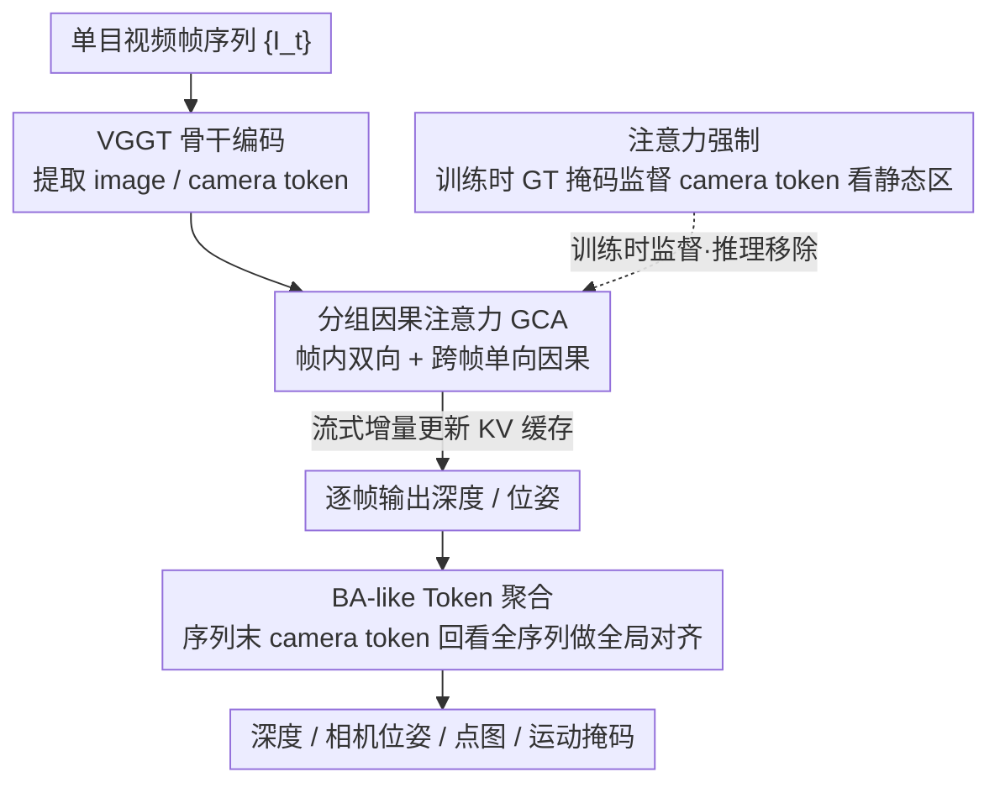

# MoRe: Motion-aware Feed-forward 4D Reconstruction Transformer

**会议**: CVPR 2026  
**arXiv**: [2603.05078](https://arxiv.org/abs/2603.05078)  
**代码**: [项目页面](https://hellexf.github.io/MoRe/)  
**领域**: 3D视觉  
**关键词**: 4D重建, 动态场景, 注意力强制, 流式推理, 运动解耦

## 一句话总结

提出 MoRe，一种前馈式运动感知 4D 重建 Transformer，通过注意力强制策略在训练时解耦动态运动与静态结构，结合分组因果注意力实现高效流式推理，在动态场景的相机位姿估计和深度预测上达到 SOTA。

## 研究背景与动机

从单目视频重建时序演化的 3D 结构（4D 重建）是 AR/机器人/数字孪生等应用的核心需求。现有方法面临的困境：

- **静态假设的前馈模型**（DUSt3R、VGGT、Fast3R）：直接回归点图和位姿，速度快但在动态物体存在时，用于相机估计的特征被严重污染（注意力分散到运动物体上），导致位姿精度显著退化
- **优化式管线**（MonST3R、CasualSAM）：集成光流/分割/深度估计等模块，处理动态场景更鲁棒，但多阶段结构计算开销大，不适合实时或长序列处理
- **流式重建方法**（CUT3R、StreamVGGT）：采用 LLM 风格的因果注意力实现在线处理，但标准因果注意力破坏帧内 token 之间的空间一致性，且误差沿时间累积

核心挑战：如何设计一个快速、可泛化的框架，在动态场景和流式输入下同时保证位姿和深度的精度？

## 方法详解

### 整体框架

MoRe 基于强静态重建骨干（VGGT 架构），从单目视频帧序列 $\{I_t\}_{t=1}^T$ 联合估计深度 $\{D_t\}$、相机参数 $\{g_t\}$、点图 $\{P_t\}$ 和运动掩码 $\{M_t\}$。训练阶段通过注意力强制（attention forcing）策略注入运动感知能力，推理阶段完全不依赖额外运动先验或分割输入。支持全注意力模式（最优质量）和流式因果注意力模式（在线处理）。

### 关键设计

**1. 注意力强制（Attention Forcing）：在训练时教 camera token「看哪里」，免费拿到运动解耦能力**

这一招直接针对前面那个最棘手的痛点——把 VGGT 的注意力图画出来会发现，动态场景里 camera token 的注意力均匀地铺在运动物体和静态背景上，相机估计该依赖的稳定特征被运动物体污染，位姿自然就乱了。MoRe 的做法是在训练时把 GT 运动掩码按 $s \times s$ 的 patch 切开，给每个 image token 算一个静态得分：

$$a_i = 1 - \frac{1}{s^2} \sum_{(u,v) \in m_i} m_i(u,v)$$

$a_i \in [0,1]$，越接近 1 表示这块越静态。然后用 $a_i$ 去监督 camera token 对该 token 的注意力权重 $\alpha_i$，逼着模型把注意力收到静态区域、躲开运动物体。最妙的地方是推理时这套监督完全消失——GT 掩码只在训练用，模型把「该看静态区」的偏好内化进了权重，所以测试时零额外开销、也不需要任何分割输入。

**2. 分组因果注意力：让流式推理在保住因果性的同时不丢帧内空间一致**

朴素地把 LLM 那套因果注意力搬过来会出问题：它把一帧里所有 image token 拍成一条扁平序列，token 之间只能单向看，帧内的空间对应关系被打散，几何推理就站不住。MoRe 把它改成帧感知的因果掩码——同一帧内的 image token 互相双向可见（恢复空间一致性），跨帧则只允许后面的帧看前面的帧（保住时序因果）。流式处理时首帧负责初始化 KV 缓存，之后每来一帧只做增量计算：

$$F_t = \text{Attn}(\mathbf{Q}_t, [\mathbf{K}_{1:t-1}, \mathbf{K}_t], [\mathbf{V}_{1:t-1}, \mathbf{V}_t])$$

这等于在「能在线增量跑」和「不破坏帧内结构」之间找到了最小改动的折中。

**3. BA-like Token 聚合：用一次注意力补回流式推理丢掉的全局一致性**

因果限制让后面的帧看不到更后面的信息，误差会沿时间累积——这是所有流式方法的通病。MoRe 在序列跑完后加一步轻量全局优化：把每帧的 camera query $\mathbf{Q}_t^{\text{cam}}$ 和所有帧的 KV 特征都缓存下来，让每个 camera token 回过头重新注意整段序列：

$$\mathbf{C}_t^{\text{opt}} = \text{Attn}(\mathbf{Q}_t^{\text{cam}}, [\mathbf{K}_{1:T}], [\mathbf{V}_{1:T}])$$

效果类比传统的 Bundle Adjustment 全局对齐，但代价只是一次额外注意力，远比迭代式 BA 便宜。训练时的小技巧是在序列末尾复制一份 camera token，同时监督「流式」和「全局」两条路径，确保增量结果和全局优化结果彼此一致。

### 一个完整示例

拿一段 $T=8$ 帧、其中有行人走动的单目视频走一遍流式推理：第 1 帧进来时没有历史，模型把它的 image/camera token 编码后写进 KV 缓存，得到首帧的深度和位姿；第 2 帧到来，它的 image token 在帧内双向交互、camera token 则同时注意第 1 帧和自己的 KV（公式中 $F_2$ 那一步），因为运动对齐注意力已经内化，camera token 会自动忽略画面里走动的行人、只锚定静态街景，于是位姿不被行人带偏；这样一帧帧增量推进到第 8 帧，KV 缓存逐步累积。全部 8 帧跑完后触发 BA-like 聚合——8 个 camera token 各自回看完整的 1–8 帧特征做一次全局对齐，把流式过程中累积的漂移拉回，最终一次性吐出全序列一致的相机轨迹、深度、点图和运动掩码。整个过程不需要任何外部光流或分割模块。

### 损失函数 / 训练策略

- **深度/点图**：置信度加权回归损失 $\mathcal{L}_{\text{conf}} = \sum_i (\hat{c}_i \|\hat{y}_i - y_i\|_2^2 - \lambda \log(\hat{c}_i))$
- **运动掩码**：标准 BCE 损失 $\mathcal{L}_{\text{motion}}$
- **注意力对齐**：$\mathcal{L}_{\text{attn}} = \frac{1}{M} \sum_i \max(0, a_i - C) \cdot \alpha_i$，仅惩罚动态区域的注意力权重
- **相机位姿**：相对变换监督 $\mathcal{L}_{\text{cam}}$，对流式 token 截断早期梯度，对复制的全局 token 保留完整梯度
- 训练数据：12个数据集混合（Dynamic Replica, PointOdyssey, Spring, KITTI, ScanNet, Co3Dv2 等），覆盖室内外、动态静态

## 实验关键数据

### 主实验

**相机位姿估计（动态场景）**：

| 方法 | 类型 | Sintel ATE↓ | Bonn ATE↓ | TUM-dyn ATE↓ | ScanNet ATE↓ |
|------|------|-------------|-----------|--------------|--------------|
| VGGT | 全注意力 | 0.1715 | 0.0141 | 0.0109 | 0.0347 |
| MoRe (FA) | 全注意力 | **0.0877** | **0.0138** | 0.0115 | 0.0375 |
| CUT3R | 流式 | 0.2163 | 0.0420 | 0.0438 | 0.0929 |
| Stream3R | 流式 | 0.2144 | 0.0235 | 0.0240 | 0.0521 |
| MoRe | 流式 | **0.1474** | **0.0211** | **0.0260** | **0.0605** |

**视频深度估计**：

| 方法 | 类型 | Sintel AbsRel↓ | Bonn AbsRel↓ | KITTI AbsRel↓ |
|------|------|----------------|--------------|---------------|
| VGGT | 全注意力 | 0.387 | 0.055 | 0.073 |
| MoRe (FA) | 全注意力 | **0.335** | **0.055** | **0.066** |
| Stream3R | 流式 | 0.397 | 0.070 | 0.079 |
| MoRe | 流式 | **0.254** | **0.068** | **0.072** |

### 消融实验

| 配置 | Sintel ATE↓ | Sintel RPE_trans↓ | TUM ATE↓ | 说明 |
|------|-------------|-------------------|----------|------|
| w/o 注意力强制 | 0.163 | 0.092 | 0.028 | 去掉注意力强制（运动解耦监督） |
| w/o BA-like 优化 | 0.155 | 0.085 | 0.027 | 去掉全局 token 聚合 |
| Full MoRe | **0.147** | **0.082** | **0.026** | 完整方法 |

| 配置 | Sintel AbsRel↓ | Bonn AbsRel↓ | KITTI AbsRel↓ | 说明 |
|------|----------------|--------------|---------------|------|
| w/o GCA | 0.277 | 0.070 | 0.079 | 标准因果注意力 |
| w/ GCA | **0.254** | **0.068** | **0.072** | 分组因果注意力 |

### 关键发现

- 注意力强制策略在 Sintel（大量动态物体）上效果最显著：ATE 从 0.163→0.147，验证了运动解耦的有效性
- 分组因果注意力在所有深度估计基准上一致提升，证明帧内空间一致性对几何推理至关重要
- 全注意力模式下，MoRe 在 Sintel ATE 上将 VGGT 从 0.1715 大幅降低到 0.0877（-49%），突破性提升
- 流式模式下全面超越同类方法（CUT3R、StreamVGGT、Wint3R、Stream3R），且支持增量处理
- 零样本泛化：所有动态评测数据集均未在训练中出现

## 亮点与洞察

1. **注意力强制**思路极其优雅：不修改推理架构，仅在训练时通过注意力监督教会模型"看哪里"，实现免费的运动解耦能力
2. 从 VGGT 注意力图的直接观察出发（图3），动机可视化清晰有力，问题定义精准
3. 分组因果注意力设计简洁有效，保留因果性同时恢复帧内空间一致——针对图像 token 对 LLM 因果注意力的最小改造
4. BA-like token 聚合仅需一次额外注意力计算就获得全局一致性，比传统 BA 高效得多

## 局限与展望

1. 训练依赖 GT 运动掩码，限制了可用训练数据的规模和多样性（需要带分割标注的动态数据集）
2. 流式模式下在 ScanNet（静态场景）上 ATE 0.0605 高于全注意力的 0.0375，说明因果限制在长序列静态场景中仍有损失
3. BA-like 优化需等待全序列处理完毕才能执行，不算严格的实时流式处理
4. 未报告运动掩码预测本身的精度，也未做下游任务（如动态物体分割/移除）的评测
5. 可探索自监督的运动掩码生成以摆脱对 GT 标注的依赖

## 相关工作与启发

- **VGGT**：MoRe 的直接改进基线，通过注意力强制修复了其在动态场景中的注意力混淆问题
- **CUT3R**：引入 Transformer 持久隐状态做在线重建，但注意力设计不区分帧内外
- **MonST3R/CasualSAM**：优化式管线处理动态场景更鲁棒，但速度慢，MoRe 通过前馈方式兼具速度和鲁棒性
- 启发：注意力强制作为一种通用的"在训练时教模型关注什么"的策略，可迁移到其他需要运动/静态解耦的视觉任务

## 评分

- 新颖性: ⭐⭐⭐⭐ 注意力强制策略新颖且效果显著，分组因果注意力设计精巧
- 实验充分度: ⭐⭐⭐⭐⭐ 4个基准、10+对比方法、全注意力+流式两种模式、完整消融
- 写作质量: ⭐⭐⭐⭐ 注意力图可视化动机清晰，公式推导严谨，实验组织有条理
- 价值: ⭐⭐⭐⭐ 为4D重建提供了实用的前馈解决方案，注意力强制策略具有广泛迁移潜力

<!-- RELATED:START -->

## 相关论文

- [\[CVPR 2026\] Z-Order Transformer for Feed-Forward Gaussian Splatting](z-order_transformer_for_feed-forward_gaussian_splatting.md)
- [\[CVPR 2026\] MoVieS: Motion-Aware 4D Dynamic View Synthesis in One Second](movies_motion-aware_4d_dynamic_view_synthesis_in_one_second.md)
- [\[CVPR 2026\] 4D Primitive-Mâché: Glueing Primitives for Persistent 4D Scene Reconstruction](4d_primitive-mache_glueing_primitives_for_persistent_4d_scene_reconstruction.md)
- [\[CVPR 2026\] Complet4R: Geometric Complete 4D Reconstruction](complet4r_geometric_complete_4d_reconstruction.md)
- [\[CVPR 2026\] Motion 3-to-4: 3D Motion Reconstruction for 4D Synthesis](motion_3-to-4_3d_motion_reconstruction_for_4d_synthesis.md)

<!-- RELATED:END -->
