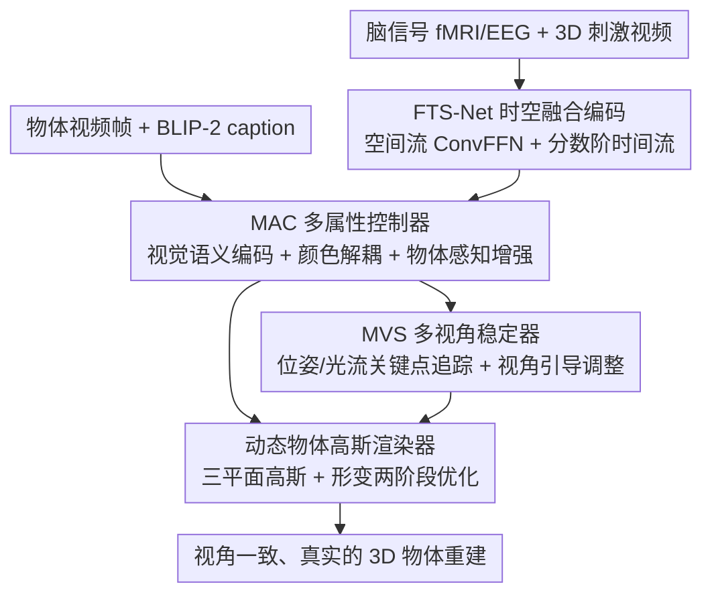

# More Natural, More Real: Object-aware Gaussian Splatting for 3D Visual Decoding from Human Brain

**会议**: CVPR 2026  
**论文**: [CVF Open Access](https://openaccess.thecvf.com/content/CVPR2026/html/Jing_More_Natural_More_Real_Object-aware_Gaussian_Splatting_for_3D_Visual_CVPR_2026_paper.html)  
**代码**: 待确认  
**领域**: 3D视觉  
**关键词**: 脑信号解码, 3D高斯泼溅(3DGS), fMRI/EEG, 多视角一致性, 神经解码

## 一句话总结
BrainGS 是首个基于 3D 高斯泼溅（3DGS）的脑信号→3D 物体重建框架：用时空融合网络编码 fMRI/EEG，用多属性控制器把脑信号按视觉-语义-颜色三类锚点解耦对齐，再用多视角稳定器追踪并校正物体视角变化，最终在 fMRI/EEG-3D 数据集上把重建保真度刷到 SOTA（fMRI 2.936 FPD / 0.202 LPIPS）。

## 研究背景与动机

**领域现状**：脑信号解码（从 fMRI/EEG「读出」心理表征）已在 2D 图像、视频重建上取得高保真成果（MinD-Vis、MindEye、Mind-Video 等）。近年随着「世界模型」思潮，解码被推进到 3D 空间维度——Mind-3D 系列建了 fMRI-3D 配对数据集、Neuro-3D 提供 EEG-3D 数据，开始尝试从大脑重建 3D 物体。

**现有痛点**：现有 Brain-3D 方法有两个具体短板。其一，**脑-3D 对齐缺多维同步**：主流只用简单的自注意力嵌入编码脑信号、再对齐简单的 CLIP 特征，既提不出跨信号类型（fMRI 时间分辨率低、EEG 信噪比低）的时空表征，也忽略物体在不同尺度上的特征差异，导致缺乏多粒度的视觉-神经信息。其二，**多视角不一致**：人感知立体来自双目视差和运动视差，而现有方法用简单空间嵌入算视角变化，稀疏且不准，造成重建位姿前后不一致，出现伪影、真实感差。

**核心矛盾**：3DGS 在立体视图合成上又快又好，但它直接吃「噪声大、表示稀疏」的脑信号会失败——脑信号到物体的映射本身存在内在歧义，难以得到既准确又一致的重建。

**本文目标**：造一个 3DGS 框架，既能跨 fMRI/EEG 提取多尺度时空特征并把脑信号细粒度对齐到视觉/语义/颜色，又能稳定地建模物体的多视角变化，最终重建出「更自然、更真实」的 3D 物体。

**切入角度**：把脑信号显式映射到 3D 高斯基元来建模，而不是走「2D→3D」或预训练 3D 解码器那种带歧义的间接路线；并用对比学习在特征层把脑信号和物体属性绑定。

**核心 idea**：用「时空融合编码（FTS-Net）+ 多属性解耦对齐（MAC）+ 多视角稳定（MVS）+ 动态高斯渲染」四件套，把脑活动直接喂成可控、视角一致的高斯场。

## 方法详解

### 整体框架
给定脑信号 $(X_i)$ 和 3D 视觉刺激（以视频形式呈现的物体 $V_{o,q}$），BrainGS 先用 **FTS-Net**（Fusion Time-Spatial Network）把不同类型脑信号编码成统一的多尺度时空特征 $F_b$；再用 **MAC**（Multi-Attribute Controller）把物体特征拆成视觉-语义、颜色两路锚点，与脑特征做对比对齐，并用物体感知增强聚焦同一物体的相关特征，得到初始化高斯场的可控特征；接着 **MVS**（Multi-View Stabilizer）用 3D 模型 + 光流双路追踪物体的位姿/关键点变化、再用视角引导调整得到平滑稳定的视角特征 $Z_{view}$；最后 **动态物体高斯渲染器**用三平面高斯表示 + 形变模块，把规范高斯按视角形变后泼溅渲染，两阶段优化出视角一致、细节真实的 3D 物体。

### 关键设计

**1. FTS-Net 时空融合脑信号编码：用统一网络吃下 fMRI 与 EEG 的异质时空结构**

针对「现有编码提不出跨信号类型的时空表征」痛点，FTS-Net 同时建模脑信号的空间拓扑分布和时间演化。它先用 patch embedding（patch 长 $P$、步长 $S$、总数 $N_P=\lfloor (L-P)/S\rfloor+2$）保留变量间相关性，经 1D 卷积得到 $E\in\mathbb{R}^{N\times N_P\times D}$，再用深度可分卷积抽 patch 内多尺度依赖。**空间流**用带分组的卷积前馈网络（ConvFFN，两个逐点卷积 + GELU）抽空间特征；**时间流**用广义 Riemann-Liouville 分数阶变换捕捉时刻 $t$ 的动态响应 $\mathcal{R}^{\alpha}(X)_t=\frac{1}{\Gamma(\alpha)}\int_0^t \frac{X(i)}{(t-i)^{1-\alpha}}\,di$，$\alpha\in\{0.4,0.6,0.8\}$，从而同时捕捉快速神经响应和缓慢上下文动态（⚠️ 分数阶公式以原文为准）。两流经跨流注意力融合成脑特征 $F_b$。对 fMRI 去掉时间维 $L$、通道 $C=1$，对 EEG 保留多通道时序——一套网络泛化到两类信号。

**2. MAC 多属性控制器：把脑信号按视觉-语义-颜色三锚点解耦并对齐**

这是为 3DGS 提供「可控初始化」的核心，针对「脑-3D 对齐缺多维同步」。它含三个子模块：（a）**视觉-语义编码器**：从物体视频帧抽 BLIP-2 caption，用 CLIP-ViT 抽视觉-语义特征 $F_{vs}$，再用同步判别器判断 $F_{vs}$ 与脑特征 $F_b$ 是否同源（正样本 $y=1$），用二元交叉熵 $L_{VS}=-(y\log \text{sim}(F_{vs},F_b)+(1-y)\log(1-\text{sim}(F_{vs},F_b)))$ 训出高同步的脑视觉-语义编码。（b）**颜色基元解耦器**：把初始高斯的中心 $\mu_j$ 和球谐 $SH_j$ 送入 Color MLP 学仿射变换 $\eta,\delta=\text{MLP}(\gamma(\mu_j),\gamma(SH_j))$（$\gamma$ 为 NeRF 位置编码），映射颜色 $F_c=\eta\cdot SH_j+\delta$，用 $L_C=\text{InfoNCE}(F_c,F_b)$ 精确捕捉颜色。（c）**物体感知增强**：用跨通道对比学习把同一物体的脑特征与视觉-语义/颜色特征拉近 $L_{CL}=-\log\frac{\exp(\text{sim}(F_{vs},F_c)/\tau)}{\sum_o \exp(\text{sim}(F_{vs},F_c)/\tau)}$，再用自注意力压缩属性特征、两层 MLP 取脑全局上下文、Hadamard 积融合得增强特征 $Z_{vs}=\text{MLP}_{vs}(F_b')\odot\text{SelfAtt}(F_{vs}')$（颜色同理得 $Z_c$），把注意力聚焦到物体不同部位、减少混淆。

**3. MVS 多视角稳定器：双路追踪 + 视角引导调整，治多视角不一致**

针对「视角变化建模稀疏不准导致伪影」。（a）**视角运动追踪器**：用 3D 基模型 Trellis 抽稀疏 2D 地标和 3D 关键点，逐帧先在区间内搜最优焦距 $f_{opt}=\arg\min_{f_i}\mathcal{M}_i(L_{2D},L_{3D}(f_i,R_i,T_i))$（$\mathcal{M}$ 为地标 MSE），再用 $f_{opt}$ 精修每帧旋转平移 $(R_{opt},T_{opt})=\arg\min_{R,T}\mathcal{M}(L_{2D},L_{3D}(f_{opt},R,T))$，线性投影成视角嵌入 $F_{view}$。（b）**视角点追踪器**：因 3D 模型抽位姿可能有偏差，再用光流模型抽 $F_{flow}=(u,v)$，用拉普拉斯滤波挑变化最显著的关键点 $K'=\{k\in K\mid \mathbf{L}(F_{flow}(k))>\theta\}$ 作监督。（c）**视角引导调整**：用追到的视角特征做对齐损失 $L_{align}=\sum_j\|\mathcal{P}_j(F_{view})-K_j'\|_2$ 监督关键点/位姿；并把脑特征 $F_b'$ 与视角变化特征 $F_{view}'$ 相减出判别性特征、送视角引导编码器逐元素相乘（重复三次）得 $Z_{view}$，用余弦相似损失 $L_{view}$ 训练，让解出的位姿/平移平滑稳定。

**4. 动态物体高斯渲染器：三平面规范高斯 + 视角形变，两阶段渲染出真实物体**

把 MAC 与 MVS 的特征落到显式高斯上。先用多分辨率三平面表示 $Z_{can}=\{Z_{vis},Z_c\}=\{Z_{xy},Z_{yz},Z_{zx}\}$，对位置 $\mu$ 在三平面双线性插值并按 Hadamard 积融合得几何特征 $f(\mu)$，经 MLP $\mathcal{F}_{can}$ 投到规范高斯 $\mathcal{G}_{can}=\{\mu_c,r_c,s_c,\alpha_c,SH_c\}$。再用 $\mathcal{F}_{deform}$ 依视角运动特征 $Z_{view}$ 预测每个高斯属性的偏移，得可形变高斯 $\mathcal{G}_{deform}=\mathcal{F}_{can}(f(\mu))+\mathcal{F}_{deform}(Z_{view},R,T)=\{\mu_c+\Delta\mu,\dots,SH_c+\Delta SH\}$。**两阶段优化**：规范阶段先用 L1 + D-SSIM + LPIPS 建立物体大致结构，形变阶段在可形变高斯场上整网优化、并加入跨模态对比损失 $L_{CL}$ 强化细节纹理，总渲染损失 $L_{render}=L_1+\lambda_1 L_{D\text{-}SSIM}+\lambda_2 L_{LPIPS}+\lambda_3 L_{CL}$（$[\lambda_1,\lambda_2,\lambda_3]=[0.2,0.3,0.5]$），逐步精修出富细节、真实的物体。

### 损失函数 / 训练策略
三阶段训练：先预训练 FTS-Net 拿到稳定的被试表征；再在 fMRI/EEG 数据上训 MAC 与 MVS；最后微调 3DGS。优化器 AdamW（lr 1e-4→2e-5，weight decay 0.01，余弦调度），全局 batch 256、训 300 epoch，A800 上推理约 155 FPS。

## 实验关键数据

> 评测指标说明：**2-way/10-way↑**（语义级 N-way top-1 分类准确率，越高越好）；**FPD↓**（Fréchet Point Cloud Distance，点云分布的 Fréchet 距离，越低越准）、**CD↓**（Chamfer Distance，倒角距离）、**EMD↓**（Earth Mover's Distance，推土机距离）为结构级；**LPIPS↓**（感知图像相似度）、**PSNR↑/SSIM↑** 为纹理级。

### 主实验
fMRI-Shape 与 EEG-3D 上对各被试取平均（节选，括号为对最新方法的相对提升）：

| 数据集 | 方法 | 2-way↑ | FPD↓ | CD↓ | LPIPS↓ | SSIM↑ |
|--------|------|--------|------|-----|--------|-------|
| fMRI-Shape | MinD-3D++ | 0.887 | 3.025 | 1.635 | 0.234 | 0.763 |
| fMRI-Shape | **BrainGS** | **0.908** (↑2.4%) | **2.936** (↓2.9%) | **1.517** (↓7.2%) | **0.202** (↓13.7%) | **0.815** (↑6.8%) |
| EEG-3D | Neuro-3D | 0.558 | 4.215 | 2.956 | 0.607 | 0.681 |
| EEG-3D | **BrainGS** | **0.795** (↑42.4%) | **3.774** (↓10.5%) | **2.318** (↓21.6%) | **0.455** (↓25.0%) | **0.769** (↑12.9%) |

EEG-3D 分类任务（物体 72 类 / 颜色 6 类）也全面领先：

| 方法 | 物体 top-1 | 物体 top-5 | 颜色 top-1 | 颜色 top-2 |
|------|-----------|-----------|-----------|-----------|
| Neuro-3D | 5.91 | 16.30 | 39.93 | 61.40 |
| **BrainGS** | **6.48** (↑9.6%) | **18.75** (↑15.0%) | **42.20** (↑5.6%) | **64.92** (↑5.7%) |

跨人/跨类的 OOD 设定下（AP / APAC Set），BrainGS 的 FPD 仍逼近域内水平（AP 3.115、APAC 4.950），证明 FTS-Net 学到了可泛化的神经表征。

### 消融实验
fMRI-Shape 上逐模块消融：

| 配置 | 2-way↑ | FPD↓ | CD↓ | SSIM↑ | 说明 |
|------|--------|------|-----|-------|------|
| w/o MAC | 0.621 | 4.775 | 2.780 | 0.633 | 去多属性控制器，特征解耦学习严重不足 |
| w/o MVS | 0.774 | 3.795 | 2.156 | 0.648 | 去多视角稳定，结构/一致性大幅恶化 |
| w/o Enhancement | 0.868 | 3.015 | 1.669 | 0.774 | 去物体感知增强，特征错配 |
| w/o Adjustment | 0.892 | 3.171 | 1.712 | 0.675 | 去视角引导调整，缺视角监督 |
| BrainGS (LEA Enc) | 0.891 | 3.011 | 1.606 | 0.782 | 用 LEA 编码器替 FTS-Net，效果近似但参数更重 |
| **BrainGS（全量）** | **0.908** | **2.936** | **1.517** | **0.815** | 完整模型 |

### 关键发现
- **MAC 贡献最大**：去掉 MAC 后 CD 从 1.517 暴涨到 2.780、SSIM 从 0.815 跌到 0.633，说明多属性解耦对齐是把脑信号「钉」到准确渲染基础上的关键。
- **MVS 主管结构一致性**：去掉后结构级指标（FPD/CD/EMD）显著恶化，验证多视角追踪与校正对消除伪影、保位姿一致不可或缺。
- **脑区贡献符合神经科学先验**：颞叶主导分类、顶叶主导结构一致性、枕叶（初级视皮层）增强纹理；ROI 重要性图显示视觉-语义由 V1/V4/IT/MT 贡献、颜色集中在 V4、动态视角对应 MST/TPOJ——解码质量与皮层功能分区强相关，提供了生物可解释性。
- **颜色解耦器**让物体颜色表征更连贯，也解释了 BrainGS 在颜色分类上同样领先。

## 亮点与洞察
- **首个把 3DGS 用于脑信号 3D 解码的框架**：用显式高斯基元直接建模脑信号，绕开「2D→3D」或预训练 3D 解码器的内在歧义，把训练效率和渲染质量都带进 Brain-3D 任务（155 FPS 推理）。
- **fMRI 与 EEG 统一编码**：FTS-Net 用空间流 + 分数阶时间流双路设计，一套网络吃下两类信噪比/分辨率迥异的脑信号，且在低信噪比的 EEG 上提升幅度尤其大（2-way ↑42.4%）。
- **三锚点解耦（视觉-语义/颜色/视角）+ 对比学习**是把高维脑信号映射到可控高斯属性的巧妙桥梁，可启发其它「噪声模态→显式 3D 表示」的任务。
- **生物可解释性闭环**：把解码特征线性投影回皮层、与已知功能分区对照，让重建质量与神经机制互相印证，超越了纯指标驱动的解码工作。

## 局限与展望
- **OOD 仍明显掉点**：跨人/跨类设定下性能低于域内（虽超基线），个体差异与复杂数据域仍是瓶颈，离实用的「免重训跨被试」尚远。
- **重度依赖外部模型**：BLIP-2 生成 caption、CLIP-ViT 抽视觉语义、Trellis 抽 3D 关键点、光流模型抽运动——管线长，任一外部模型的偏差都可能传导进重建。⚠️ 论文未系统分析该级联误差。
- **数据规模与刺激受限**：fMRI-Shape 来自 ShapeNetCore、EEG-3D 来自 Objaverse，物体类别有限、且为合成/渲染刺激，迁移到自然真实物体的能力未验证。
- **多视角依赖刺激视频**：MVS 的视角监督来自以视频呈现的 3D 刺激（每物体 192 帧），现实中难有如此密集的多视角脑响应配对数据。
- **改进方向**：减少外部模型级联、探索跨被试统一编码、把分数阶时间建模与更长程脑动态结合。

## 相关工作与启发
- **vs MinD-3D / MinD-3D++**：同为 fMRI-3D 重建且共用 fMRI-Shape 数据，但它们走多视图扩散 + 神经融合、对脑信号编码简单；BrainGS 用 3DGS 显式建模 + 三锚点解耦，在 FPD（3.025→2.936）、LPIPS（0.234→0.202）、SSIM 上全面超越。
- **vs Neuro-3D**：EEG-3D 基准的前 SOTA，BrainGS 在 EEG 上大幅领先（2-way ↑42.4%、物体分类 top-1 ↑9.6%），显示 FTS-Net 对低信噪比 EEG 的时空建模优势。
- **vs 2D→3D 路线（3D-Telepathy / Mind2Matter）**：这类先重建 2D 再抬到 3D，存在映射歧义；BrainGS 直接脑信号→高斯，视角一致性更强。
- **vs 通用 3DGS / NeRF 重建**：常规 3DGS 吃图像/视频，直接喂噪声稀疏的脑信号会失败；BrainGS 的 MAC/MVS 正是为弥合「脑信号 ↔ 高斯可控属性」这道鸿沟而设计。

## 评分
- 新颖性: ⭐⭐⭐⭐⭐ 首个 3DGS-based 脑信号 3D 解码框架，FTS-Net 统一 fMRI/EEG、三锚点解耦均为新设计。
- 实验充分度: ⭐⭐⭐⭐⭐ 覆盖 fMRI/EEG 两类数据、重建+分类+OOD+脑区分析+逐模块消融，证据链完整。
- 写作质量: ⭐⭐⭐⭐ 框架清晰、生物可解释性出彩；部分公式排版含 LaTeX 噪声、子模块命名略繁。
- 价值: ⭐⭐⭐⭐ 为 Brain-3D 解码立了新 SOTA 与可解释范式，但数据/外部模型依赖限制了即时落地。

<!-- RELATED:START -->

## 相关论文

- [\[CVPR 2026\] MoRE: 3D Visual Geometry Reconstruction Meets Mixture-of-Experts](more_3d_visual_geometry_reconstruction_meets_mixture-of-experts.md)
- [\[CVPR 2026\] MoRe: Motion-aware Feed-forward 4D Reconstruction Transformer](more_motion-aware_feed-forward_4d_reconstruction_transformer.md)
- [\[CVPR 2026\] LangRef3DGS: Natural Language-Guided 3D Referential Segmentation from Partial Observations via 3D Gaussian Splatting](langref3dgs_natural_language-guided_3d_referential_segmentation_from_partial_obs.md)
- [\[CVPR 2026\] OLATverse: A Large-scale Real-world Object Dataset with Precise Lighting Control](olatverse_a_large-scale_real-world_object_dataset_with_precise_lighting_control.md)
- [\[CVPR 2026\] PhysHO: Physics-Based Dynamic 3D Gaussian Human and Object from Monocular Video](physho_physics-based_dynamic_3d_gaussian_human_and_object_from_monocular_video.md)

<!-- RELATED:END -->
