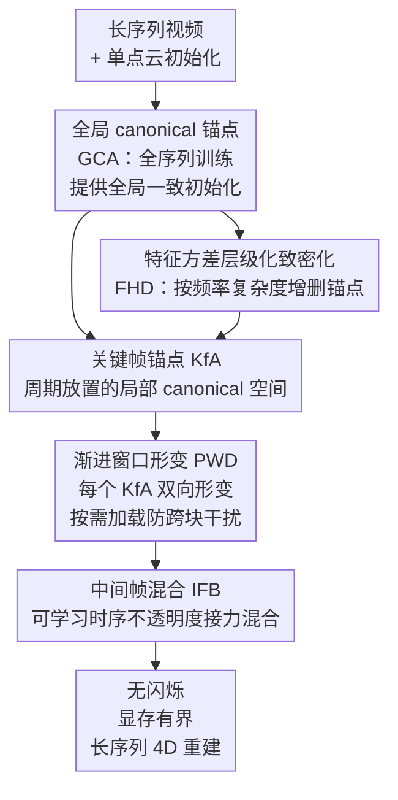

# MoRel: Long-Range Flicker-Free 4D Motion Modeling via Anchor Relay-based Bidirectional Blending with Hierarchical Densification

**会议**: CVPR 2026  
**论文**: [CVF Open Access](https://openaccess.thecvf.com/content/CVPR2026/html/Kwak_MoRel_Long-Range_Flicker-Free_4D_Motion_Modeling_via_Anchor_Relay-based_Bidirectioanl_CVPR_2026_paper.html)  
**代码**: https://cmlab-korea.github.io/MoRel/ (项目页)  
**领域**: 3D视觉  
**关键词**: 4D高斯泼溅, 动态场景重建, 长序列建模, 时序一致性, 锚点表示

## 一句话总结
MoRel 用「关键帧锚点 + 双向形变 + 可学习时序不透明度混合」把几千帧的长序列动态场景拆成一段段锚点接力建模，在显存有界的前提下消除了分块训练在边界处的闪烁，tOF 降到 0.203 拿到所有对比方法里最好的时序一致性。

## 研究背景与动机
**领域现状**：3D 高斯泼溅（3DGS）凭借显式高斯基元 + GPU 并行 splatting 把新视角合成做到了实时高保真，自然被扩展到时间维度成为 4D 高斯泼溅（4DGS），用来重建动态视频场景。

**现有痛点**：一旦视频拉长到几分钟、几千帧的"长序列 4D 运动"，现有 4DGS 全都崩。论文把已有路线归成几类并逐一点名：（i）**一次性训练（all-at-once）**——把全部帧塞进一个 canonical 表示联合优化，虽然全局时序一致，但建模长序列动态需要不断增长的高维高斯，直接显存爆炸，而且对"先被遮挡、后又露出来"的去遮挡区域表达能力受限，还无法只传输片段、不利于流式随机访问；（ii）**分块训练（chunk-based）**——把长视频切成短段、每段独立训一个模型，显存省了、天然支持随机访问，但段与段独立优化导致拼接处时序断裂，出现边界伪影和外观突变（闪烁），且每个块只看到局部时间窗，后续块里新出现的去遮挡区域补不回来；（iii）滑动窗口、（iv）时序高斯层级等改进，要么靠外部光流增加系统复杂度、只能局部修不能保证全局一致，要么需要持续的高斯重分配、逐时刻段选择和 CPU–GPU 流式传输，系统极其臃肿。

**核心矛盾**：长序列 4D 建模本质是「显存有界 ↔ 时序一致 ↔ 表达保真」三者难以兼得——一次性训练为了一致性牺牲显存，分块训练为了显存牺牲一致性，没有方法能同时拿下。

**本文目标**：在显存有界的条件下，做到长序列动态场景的时序连贯、无闪烁、且保留高频细节，同时还要支持实用系统所需的随机时间访问。

**切入角度**：作者观察到分块之所以闪烁，根子在于"段与段之间没有显式的跨块一致性建模"——边界帧由相邻两段各自独立预测，没人负责平滑过渡。那能不能让相邻的关键帧锚点**互相形变到对方**、再在中间帧把两者的影响力平滑接力过去？

**核心 idea**：用周期放置的**关键帧锚点（KfA）**当一段段"局部 canonical 空间"，每个锚点学**双向形变**覆盖自己前后的时间窗，相邻锚点在中间帧通过一个**可学习的时序不透明度**自适应混合——像接力棒一样把表达权从前一个锚点平滑交给后一个，从而既显存有界又时序连续。

## 方法详解

### 整体框架
MoRel 建立在 anchor-point 表示（Scaffold-GS）之上：一个稀疏体素网格上的锚点定义 canonical 空间，每个锚点再派生出若干 neural Gaussian。整套方法叫 **Anchor Relay-based Bidirectional Blending（ARBB）**，分两个阶段、共四个顺序训练 stage，核心思想是"先把空间表达建好，再学时间上的形变与接力混合"。

第一阶段是 **Anchor Relay（锚点接力）**：先用整段视频训练一个 **全局 canonical 锚点（GCA）** 提供全局一致的初始化，并给每个锚点按特征方差打上层级标签；再在周期性的关键帧时刻放一串 **关键帧锚点（KfA）**，每个 KfA 从打好层级的 GCA 初始化、只在自己那段时间窗里精修，成为该段的局部 canonical 空间，并用 FHD 致密化补细节。第二阶段是 **Bidirectional Blending（双向混合）**：每个 KfA 在自己的双向形变窗（BDW）里独立学前向 + 后向形变（PWD stage），相邻两个 KfA 再在中间帧通过可学习时序不透明度融合（IFB stage）。训练和渲染都靠"按需加载/卸载 KfA"，任一时刻显存里只有一两个锚点及其形变场，保证显存有界。

### 关键设计

**1. Anchor Relay-based Bidirectional Blending（ARBB）：用关键帧锚点接力 + 双向形变消除分块闪烁**

这是全文的主干，直接对着"分块训练边界闪烁"这个痛点。MoRel 在时间轴上每隔 GOP（Group-of-Pictures，相邻 KfA 的时间间隔）放一个关键帧锚点 $A^{Key}_n$，每个锚点不是只管自己那一帧，而是负责一段时间窗 $[\max(0, t_n-\text{GOP}),\ \min(t_n+\text{GOP}, T-1)]$，并为锚点引入一个时间容差 $\epsilon$ 让它在 $[t_n-\epsilon, t_n+\epsilon]$ 的局部邻域里也能学到变化。关键在于每个 KfA 学的是**双向形变**：形变场 $D_n(\cdot, \tau_n)$ 用归一化相对时间 $\tau_n \in [-1, 1]$（对应 $t \in [t_n-\text{GOP}, t_n+\text{GOP}]$）同时做前向（$+$）和后向（$-$）形变，每个锚点 $a^n_k$ 查询自己的位置拿到属性形变量。

为什么双向是关键？分块方法里边界帧只由一侧的块负责，另一侧帮不上忙，于是拼接处断裂。MoRel 让相邻两个 KfA 都能形变到中间区域——前一个锚点向后伸、后一个锚点向前伸，中间帧由两者共同覆盖，再做混合（见设计 3），相当于在两段之间架了一座"双向桥"，把硬拼接变成软过渡。这正是它能拿到全场最低 tOF（0.203）的根源。

**2. Progressive Windowed Deformation（PWD）：用渐进滑窗 + 按需加载消除跨块污染并锁住显存**

直接对长序列做双向形变训练会遇到两个坑：一次性训全部 KfA 显存爆炸；而朴素的分块训练会引发**反向污染（backward contamination）**——某个 $A^{Key}_n$ 先为 $\text{chunk}_{n-1}$ 训好，轮到训 $\text{chunk}_n$ 时又被更新（含致密化），结果之前为 $\text{chunk}_{n-1}$ 优化好的特性被破坏：可能长出一批没为后向形变训练过的新锚点，或把对 $\text{chunk}_{n-1}$ 至关重要的锚点剪掉。

PWD 的解法是给每个 KfA 划一个**双向形变窗 BDW**（一个由单个 KfA 通过双向形变建模的时间窗）：训练时只在 BDW 内独立优化该 KfA，$A^{Key}_n$ 仅在它的 $\text{BDW}_n$ 被优化时动态加载、训完即卸载（on-demand loading），窗口训 $J^{PWD}_n$ 次迭代后再带一个 chunk 的重叠**渐进滑动**到下一个 BDW。这样每个锚点的双向形变都在隔离的窗口里学完、不会被后续块回头改坏，既把显存死死锁在"同时只载一两个锚点"的水平（消融里训练显存约 4.5–6.5 GB，相比一次性的约 12–18 GB），又彻底避免跨块干扰。

**3. Intermediate Frame Blending（IFB）：用可学习时序不透明度让相邻锚点平滑接力**

PWD 把形变场建好后，相邻两个 KfA 在中间帧仍然各说各话，需要一个机制决定"中间帧到底听谁的"。以往工作用固定的不透明度衰减——不透明度随到中心时间的距离指数衰减，但在有遮挡、不规则运动的动态场景里，每个 KfA 的时空影响力其实是非均匀变化的，固定衰减表达不了。

IFB 因此引入**可学习的时序不透明度控制**：给每个锚点 $a^n_k$ 配一个自己的时间偏移 $o^{dir}_{n,k}$ 和时间衰减速度 $d^{dir}_{n,k}$（$dir \in \{Fw, Bw\}$，前向 / 后向各一套），第 $n$ 个 KfA 的时序不透明度定义为

$$w^{dir}_{n,k} = \exp\left[-\lambda_{decay}\cdot d^{dir}_{n,k}\cdot |\tau_n - o^{dir}_{n,k}|\right]$$

其中 $\lambda_{decay}$ 是控制全局衰减速度的基础系数。IFB stage 把相邻的 $A^{Key}_n$ 和 $A^{Key}_{n+1}$ 一起加载，**只训练混合权重**，锚点属性、形变场、FHD 全部冻结。渲染时先对每个形变后的锚点 $a^n_k|_{t_n\to t}$ 重建 neural Gaussian，再按学到的权重把 $a^n_k|_{t_n\to t}$ 和 $a^{n+1}_k|_{t_{n+1}\to t}$ 的不透明度混合后 splatting 出最终图像。可学习的偏移和衰减速度让"表达权交接"既能平滑过渡又能贴合不规则运动，是 tOF 进一步下降的关键（消融 d 比 c 的线性混合再提一档）。

**4. Feature-variance-guided Hierarchical Densification（FHD）：用特征方差当频率代理，分层控制锚点增删**

长序列下盲目致密化会让锚点数量失控、显存吃紧，但不致密又补不出高频细节。FHD 的洞察是：锚点特征 $\hat{f}_k$ 的方差可以当作**局部频率复杂度**的代理——高频区域在训练早期对特征特别敏感、梯度反复大幅波动会推高 $\hat{f}_k$ 的方差，所以 $\sigma^2_k = \text{Var}(\hat{f}_k)$ 能可靠指示局部频率高低。

FHD 分两步。**Variance-based Leveling（VL）**：GCA 训完后，给每个全局锚点按方差分位阈值 $\{\tau_1, \tau_2\}$ 打层级——

$$L_{a^{Global}_k} = \begin{cases} 0, & \sigma^2_k < \tau_1 \quad (\text{低频})\\ 1, & \tau_1 \le \sigma^2_k < \tau_2\\ 2, & \sigma^2_k \ge \tau_2 \quad (\text{高频}) \end{cases}$$

**Level-wise Densification（LD）**：在 KfA 和 PWD stage 致密化时，按层级对累积梯度 $g^{j}_n$ 加一个层级权重 $w^{j}_L$ 得到加权统计量 $g^{j}_L = g^{j}_n \cdot w^{j}_L$ 作为增长判据，权重随训练进度 $\eta_t = j^S_n / J^S_n$ 线性插值：

$$w^{j}_L = \begin{cases} 1, & L = 0\\ \lambda_L + (1-\lambda_L)\eta_t, & L \ge 1 \end{cases}$$

这样早期把权重压在低层级（$L=0$）先把低频结构稳住、避免在不稳定的高频区乱长冗余锚点，后期再逐步抬高高层级权重去精修高频细节——一条从"低频主导"平滑过渡到"高频精修"的致密化时间表，在几乎不掉点的情况下把渲染显存从约 144 MB 降到 126 MB。

### 损失函数 / 训练策略
四个 stage 按预定迭代数顺序执行：GCA → KfA → PWD → IFB（迭代数分别为 $J^{GCA}, J^{KfA}, J^{PWD}, J^{IFB}$）。GCA 用单一点云初始化、全帧训练（论文特意强调用**单点云初始化**而非以往要求的"每帧或每十帧采点云"的密集点云，大幅降初始化开销）；KfA 从层级化 GCA 初始化、只采自己时间容差窗内的相机视角训练并经 FHD 致密化；PWD 在 BDW 内学双向形变；IFB 冻结其余一切、只训混合权重 $o^{dir}_n, w^{dir}_n$。训练和渲染全程靠动态加载/卸载，同一时刻至多载一两个 KfA 及其形变场，保证显存有界。整体基于 4DGS 和 Scaffold-GS 实现、沿用大部分超参。

## 实验关键数据

### 主实验
数据集是作者新构建的 **SelfCapLR**：从未蒸馏的原始视频里选出 5 段有代表性、有挑战性的动态序列（Bike1、Bike2、Corgi、Yoga、Dance），超过 3500 帧，平均运动幅度更大、捕获空间更宽，专门用来压测长序列 4D 运动。评测指标含 PSNR / SSIM / LPIPS，外加衡量时序一致性的 tOF（相邻帧光流差）以及训练 / 渲染显存。

各方法平均质量（PSNR↑ / SSIM↑ / LPIPS↓）：

| 组别 | 方法 | PSNR | SSIM | LPIPS |
|------|------|------|------|-------|
| 一次性 | 4DGS [CVPR'24] | 18.95 | 0.648 | 0.402 |
| 一次性 | MoDec-GS [CVPR'25] | 19.61 | 0.643 | 0.391 |
| 一次性 | LocalDyGS [ICCV'25] | 20.64 | 0.652 | 0.371 |
| 分块 | GIFStream [CVPR'25] | 19.02 | 0.653 | 0.405 |
| 分块 | 4DGS_chunk | 19.31 | 0.656 | 0.389 |
| 本文 | **MoRel (Ours)** | **21.00** | **0.664** | **0.355** |

时序一致性与显存（长序列建模的关键指标）：

| 组别 | 方法 | tOF↓ | 训练显存(MB)↓ | 渲染显存(MB)↓ |
|------|------|------|---------------|----------------|
| 一次性 | 4DGS | 0.222 | ~18,000 | 143 |
| 一次性 | MoDec-GS | 0.249 | ~22,000 | 154 |
| 一次性 | LocalDyGS | 0.215 | ~12,000 | 122 |
| 分块 | GIFStream | 0.539 | ~9,000 | 93 |
| 分块 | 4DGS_chunk | 0.680 | ~4,500 | 65 |
| 本文 | **MoRel** | **0.203** | ~6,000 | 126 |

MoRel 在平均质量三项全部最好，tOF 0.203 是所有方法里最低（分块方法 4DGS_chunk 的 tOF 高达 0.680，印证分块的边界闪烁），而训练显存约 6 GB 远低于一次性方法的 12k–22k MB，处在"质量第一 + 时序第一 + 显存有界"的甜点上。在 Corgi、Yoga、Dance 这类时空大运动场景优势尤其明显。

### 消融实验
在 SelfCapLR 采样的 300 帧子集上逐组件评测：

| 变体 | 配置 | PSNR↑ | SSIM↑ | LPIPS↓ | 训练显存↓ | 渲染显存↓ |
|------|------|-------|-------|--------|-----------|-----------|
| (a) | 2-stage，仅 GCA + 单向形变 | 19.71 | 0.654 | 0.386 | ~12,000 | 156 |
| (b) | 3-stage，(a) 加 KfA | 19.90 | 0.647 | 0.364 | ~4,500 | 94 |
| (c) | 3-stage，(b) 加 PWD + 线性混合 | 20.66 | 0.656 | 0.358 | ~6,500 | 138 |
| (d) | 4-stage，(b) 加 PWD + IFB | 21.07 | 0.672 | 0.342 | ~6,500 | 144 |
| (e) | 4-stage，(d) 加 FHD（完整模型） | 21.20 | 0.672 | 0.348 | ~6,000 | 126 |

### 关键发现
- **KfA 是显存的命门**：从 (a) 到 (b) 引入关键帧锚点 + 按需加载后，训练显存从约 12,000 MB 直接砍到约 4,500 MB、渲染显存 156→94 MB，同时 LPIPS 改善（0.386→0.364），证明"局部 canonical 分段 + on-demand loading"既省显存又提细节。
- **双向形变 + 混合是质量主升级**：(b)→(c) 加 PWD + 线性混合 PSNR 涨到 20.66，说明防跨块干扰本身就带来明显增益；(c)→(d) 把线性混合换成可学习的 IFB，PSNR 再升到 21.07、LPIPS 降到 0.342，可学习不透明度对付不规则运动确实更强。
- **FHD 是质量/显存的平衡器**：(d)→(e) 加 FHD 后在几乎不掉点（PSNR 21.07→21.20）的同时把渲染显存从 144 MB 降到 126 MB，体现它"按频率复杂度精准增删锚点、避免冗余膨胀"的价值。
- 分块基线 4DGS_chunk 虽然在 Bike1/Bike2 这类相对静态场景 SSIM 还行，但 tOF 飙到 0.680，直观暴露分块在边界处的闪烁本质。

## 亮点与洞察
- **"锚点接力"是个很顺的隐喻**：把长序列拆成一串关键帧锚点、相邻锚点双向形变到中间再做不透明度接力，本质是把"硬拼接"换成"软交接"，既继承了分块的显存优势，又用双向桥补回了一致性——这个"既要又要"的结构很值得借鉴到其它需要分段处理长信号的任务。
- **用特征方差当频率代理**很巧：不需要显式做频谱分析，直接拿锚点特征的方差（训练早期高频区梯度抖得厉害→方差大）判断哪里是高频区，再分层错峰致密化（早期稳低频、后期补高频），把"何时该长锚点"变成一条可控的时间表，几乎零成本。
- **按需加载贯穿训练与渲染**：显存有界不是靠压缩模型，而是靠"任一时刻只载一两个锚点"的工程设计，使方法天然支持流式随机时间访问——周期放置的 KfA 直接当随机访问入口，这对真实视频系统很实用。
- 可迁移到任意"长时间序列 + 局部表示 + 需平滑过渡"的场景，比如长视频生成、长时序动作捕捉，思路都是"分段局部建模 + 可学习的跨段接力"。

## 局限与展望
- **GOP 是个关键超参却没充分讨论**：关键帧锚点的时间间隔直接决定显存、质量和闪烁的权衡，论文主要把细节放到附录，正文没给 GOP 的敏感性分析，实际部署时怎么选 GOP 仍需摸索。
- **数据集是自建的、规模有限**：SelfCapLR 只有 5 段序列，虽然主打长序列大运动，但场景多样性有限；跨数据集泛化（论文称 DyCheck-iPhone、HyperNeRF 等放在附录）在正文里看不到完整证据。
- **tOF 提升明显但 PSNR 优势相对温和**：相比 LocalDyGS（PSNR 20.64），MoRel 平均 PSNR 21.00 提升不算大，方法的核心卖点是时序一致性（tOF）和显存有界，纯静态画质增益有限。
- **渲染显存并非最低**：分块方法 4DGS_chunk 渲染显存只 65 MB、GIFStream 93 MB，MoRel 的 126 MB 是用"质量 + 时序换来的折中"，对极端显存受限场景未必最优。

## 相关工作与启发
- **vs 一次性训练（4DGS / MoDec-GS / LocalDyGS）**：它们联合优化全部帧保证全局一致，但长序列下显存随高斯数和序列长度爆炸（12k–22k MB），且去遮挡区域受表达容量限制。MoRel 用锚点接力把全局优化拆成局部分段，显存压到约 6 GB，质量还更高——代价是引入了更复杂的四阶段训练流程。
- **vs 分块训练（GIFStream / 4DGS_chunk）**：它们靠 divide-and-conquer 省显存、支持随机访问，但段间独立优化导致边界闪烁（tOF 0.539 / 0.680）。MoRel 的核心区别是用双向形变 + 可学习不透明度做**显式的跨块一致性建模**，把闪烁压到 tOF 0.203，这是分块路线最缺的一环。
- **vs 滑动窗口 / 时序高斯层级**：前者靠外部光流局部修补、增加系统复杂度且不保证全局一致；后者靠多级层级 + 持续高斯重分配 + CPU–GPU 流式，系统极臃肿。MoRel 强调"无需外部线索、渲染管线简单"，在系统复杂度上更克制。
- **建立在 Scaffold-GS 的锚点表示之上**：复用锚点 + neural Gaussian 的结构，并把它的梯度累积式致密化升级成按特征方差分层的 FHD，是对 anchor-based 表示在时间维度上的一次自然扩展。

## 评分
- 新颖性: ⭐⭐⭐⭐ 「锚点接力 + 双向形变 + 可学习时序不透明度混合」对长序列分块闪烁是一个干净且自洽的新解法，FHD 用方差当频率代理也很巧。
- 实验充分度: ⭐⭐⭐⭐ 主实验 + 消融逐组件拆得清楚，tOF/显存对比有说服力；但自建数据集规模有限、跨数据集结果和 GOP 敏感性都压在附录。
- 写作质量: ⭐⭐⭐⭐ 动机—痛点—方法的逻辑链很清晰，Fig.1/2 的对比图把 trade-off 讲得直观；四阶段命名稍多需要对照算法表读。
- 价值: ⭐⭐⭐⭐ 给"显存有界 + 时序一致 + 随机访问"的长序列 4DGS 提供了一套实用且可扩展的方案，对真实动态视频系统有直接价值。

<!-- RELATED:START -->

## 相关论文

- [\[CVPR 2026\] Can Natural Image Autoencoders Compactly Tokenize fMRI Volumes for Long-Range Dynamics Modeling?](can_natural_image_autoencoders_compactly_tokenize_fmri_volumes_for_long-range_dy.md)
- [\[CVPR 2026\] Tracking-Guided 4D Generation: Foundation-Tracker Motion Priors for 3D Model Animation](tracking-guided_4d_generation_foundation-tracker_motion_priors_for_3d_model_anim.md)
- [\[CVPR 2026\] 4C4D: 4 Camera 4D Gaussian Splatting](4c4d_4_camera_4d_gaussian_splatting.md)
- [\[CVPR 2026\] Mark4D: Temporally-Consistent Watermarking for 4D Gaussian Splatting](mark4d_temporally-consistent_watermarking_for_4d_gaussian_splatting.md)
- [\[CVPR 2026\] PackUV: Packed Gaussian UV Maps for 4D Volumetric Video](packuv_packed_gaussian_uv_maps_for_4d_volumetric_video.md)

<!-- RELATED:END -->
