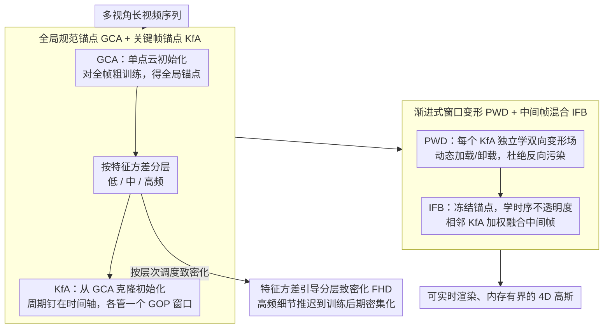

# MoRel: Long-Range Flicker-Free 4D Motion Modeling via Anchor Relay-based Bidirectional Blending with Hierarchical Densification

**会议**: CVPR 2026  
**arXiv**: [2512.09270](https://arxiv.org/abs/2512.09270)  
**代码**: [https://cmlab-korea.github.io/MoRel/](https://cmlab-korea.github.io/MoRel/)  
**领域**: 3D视觉  
**关键词**: 4D高斯泼溅, 动态场景重建, 长视频建模, 时序一致性, 内存高效

## 一句话总结
针对4D高斯泼溅在长视频动态场景建模中面临的内存爆炸、时序闪烁和遮挡处理等挑战，提出了基于锚点接力双向混合 (ARBB) 的MoRel框架，通过关键帧锚点的渐进式构建和可学习时序不透明度控制实现了无闪烁、内存有界的长程4D运动重建。

## 研究背景与动机

1. **领域现状**：3D高斯泼溅 (3DGS) 已成为新视角合成的主流范式，自然地被扩展到4D动态场景。现有4DGS方法主要分为"全局一次性训练"和"分块训练"两大类。

2. **现有痛点**：
    - **全局一次性训练**（如4DGS、MoDec-GS）：将所有帧放在一起优化，保证了全局时序一致性，但对长视频会导致GPU内存爆炸，高维高斯数量随时间长度不断增长。
    - **分块训练**（如GIFStream）：将长视频分成短片段独立训练，减少了内存开销，但在片段边界处产生时序不连续和外观突变，即"闪烁"伪影。
    - 滑动窗口策略只是局部修补，不能保证全局一致性；时序高斯层次结构虽内存近恒定，但系统复杂度很高。

3. **核心矛盾**：长视频建模中"全局时序一致性"与"有界内存使用"之间的根本矛盾——既要跨越数千帧保持平滑过渡，又不能让内存随帧数线性增长。

4. **本文目标** (a) 有界内存的长程4D建模；(b) 无闪烁的时序一致性；(c) 高效的随机时间访问；(d) 不依赖外部光流等额外线索。

5. **切入角度**：借鉴视频编码中"关键帧+GOP"的思想，在时间轴上周期性放置关键帧锚点 (KfA)，通过双向变形和自适应混合实现平滑过渡。

6. **核心 idea**：用关键帧锚点接力机制取代全局或分块策略，在锚点间学习双向变形并通过可学习不透明度控制进行平滑混合，实现内存有界且无闪烁的长程4D重建。

## 方法详解

### 整体框架
MoRel要解决的是长视频4D重建里"全局一致 vs 内存有界"这对老矛盾：全局训练保证不闪烁但内存随帧数爆炸，分块训练省内存但片段边界会跳变。它的破局思路借自视频编码——把时间轴切成一个个 GOP，在每个 GOP 中心放一个**关键帧锚点 (KfA)**，让相邻锚点像接力一样覆盖整段视频。整条流水线是基于锚点的3DGS表示（稀疏体素网格上的锚点定义规范空间），训练按两个阶段、四个步骤推进：先是**锚点接力阶段**，全局规范锚点 GCA 浏览整段视频打底，再克隆出一排 KfA 各管一段时间；然后是**双向混合阶段**，PWD 给每个 KfA 学双向变形场，IFB 再在相邻锚点之间学怎么平滑过渡。贯穿整个训练，特征方差引导分层致密化 FHD 用锚点的特征方差把它们分成低/中/高频，控制致密化节奏、让高频细节晚一点再长，进一步压住峰值内存。输入是多视角长视频序列，输出是可实时渲染、内存有界的4D高斯。

### 关键设计

**1. 全局规范锚点 GCA + 关键帧锚点 KfA：用"打底 + 接力"取代"全局一锅炖"或"分块各练各的"**

直接为每一帧都堆锚点会内存爆炸，从头分块训练又各自为政、边界跳变。MoRel 先用**单个**点云（而非时间密集点云）初始化 GCA，对全部帧做一遍粗训练，得到一份跨越全程、外观一致的全局锚点 $\mathbf{A}^{\text{Global}}$；训练完后按每个锚点的特征方差给它分配层次级别。随后所有 KfA 都从 GCA 克隆初始化（不从零开始），周期性地钉在时间轴上，每个 KfA 只负责 $[t_n - \text{GOP}, t_n + \text{GOP}]$ 这段时间，并留一个时间容差 $\epsilon$ 让窗口边界更鲁棒。这样 GCA 锁住了全局外观一致性，KfA 又能在各自的局部规范空间里抠细节运动；而且 KfA 周期排布恰好对应视频编码里的关键帧，既给出了随机时间访问的入口，又让任何时刻只需按需加载/卸载少数几个锚点，内存自然有界。

**2. 渐进式窗口变形 PWD + 中间帧混合 IFB：先各自练干净，再学着平滑接缝**

分块训练真正的病根是"反向污染"——后训练的 chunk 会改掉前序 chunk 还在依赖的锚点，导致已经练好的片段被破坏。PWD 的做法是让每个 KfA 在自己的双向变形窗口里**独立**训练前向和后向变形场，靠动态加载/卸载保证训练某个 chunk 时根本碰不到别的 chunk 的锚点，从源头堵死污染；变形场以归一化相对时间 $\tau_n \in [-1, 1]$ 为输入。各 KfA 练好后，IFB 接手处理它们之间的中间帧：此时冻结所有锚点属性和变形场，只学两个时序参数——偏移 $o_{n,k}^{\text{dir}}$ 和衰减速度 $d_{n,k}^{\text{dir}}$，用它们算出每个方向的时序不透明度

$$w_{n,k}^{\text{dir}} = \exp\!\big[-\lambda_{\text{decay}} \cdot d_{n,k}^{\text{dir}} \cdot |\tau_n - o_{n,k}^{\text{dir}}|\big]$$

来加权融合前后两个 KfA 的渲染。相比直接线性插值，这种可学习的不透明度能自适应不规则运动（比如遮挡发生时让某一侧权重快速衰减），把边界闪烁压下去。

**3. 特征方差引导分层致密化 FHD：让高频细节"晚一点再长"，省内存又不丢清晰度**

如果一开始就对所有区域同等致密化，高频区域在训练早期还没稳定，会催生大量冗余锚点、白白吃内存。FHD 用特征方差 $\sigma_k^2 = \text{Var}(\hat{f}_k)$ 当作"频率复杂度"的代理，GCA 训练后把锚点分成低频/中频/高频三个层次。训练早期，低频锚点权重设为 1，高频锚点只给较低的 $\lambda_L$；随着训练推进，再用线性插值因子 $\eta_t$ 把高频权重逐步抬上来。致密化的判据是按层次加权后的梯度统计 $g_L^{j_n^S} = g^{j_n^S} \cdot w_L^{j_n^S}$。于是高频细节被推迟到训练后期、表示更稳定时才开始密集化，既压住了峰值内存，又在最后保住了细节质量。

### 一个完整示例：一段视频怎么被接力重建
设一段 3500 帧的长视频，GOP=50。**第一步**，GCA 拿单个点云对全部 3500 帧粗训一遍，得到全局锚点并按特征方差标好低/中/高频。**第二步**，沿时间轴每隔约 100 帧钉一个 KfA（如 $t=50, 150, 250, \dots$），每个都从 GCA 克隆初始化，各自只盯住 $\pm 50$ 帧的窗口。**第三步（PWD）**，逐个加载 KfA 独立训练它的前后向变形场——训 $t=150$ 这个锚点时，$t=50$ 的锚点已被卸载，互不干扰。**第四步（IFB）**，要渲染第 100 帧时，它正好落在 $t=50$ 与 $t=150$ 两个 KfA 之间：两侧各自把锚点变形到第 100 帧，再按各自学到的时序不透明度 $w$ 加权融合；若此处有遮挡，IFB 会让被遮一侧的权重快速衰减，过渡不再跳变。叠加 FHD 后，第 100 帧附近的高频纹理是在训练后期才长出来的，所以全程内存稳定在 ~6,000MB 而不随帧数增长。

### 损失函数 / 训练策略
采用标准3DGS重建损失（L1 + SSIM）。四个训练阶段顺序执行。关键是按需加载/卸载机制：任何时刻最多加载1-2个KfA和变形场，确保训练和渲染内存有界。

## 实验关键数据

### 主实验
构建SelfCap_LR数据集（5个场景，>3500帧），具有更大的平均运动幅度和更宽的空间范围。

| 方法 | 类型 | Avg PSNR↑ | Avg SSIM↑ | Avg LPIPS↓ | tOF↓ | 训练内存↓ |
|------|------|-----------|-----------|------------|------|----------|
| 4DGS | 全局 | 18.95 | 0.648 | 0.402 | 0.222 | ~18,000MB |
| MoDec-GS | 全局 | 19.61 | 0.643 | 0.391 | 0.249 | ~22,000MB |
| LocalDyGS | 全局 | 20.64 | 0.652 | 0.371 | 0.215 | ~12,000MB |
| GIFStream | 分块 | 19.02 | 0.653 | 0.405 | 0.539 | ~9,000MB |
| 4DGS_chunk | 分块 | 19.31 | 0.656 | 0.389 | 0.680 | ~4,500MB |
| **MoRel** | **本文** | **21.00** | **0.664** | **0.355** | **0.203** | **~6,000MB** |

### 消融实验

| 配置 | PSNR↑ | SSIM↑ | LPIPS↓ | 训练内存 | 渲染内存 |
|------|-------|-------|--------|---------|---------|
| (a) GCA + 单向变形 | 19.71 | 0.654 | 0.386 | ~12,000 | 156 |
| (b) + KfA | 19.90 | 0.647 | 0.364 | ~4,500 | 94 |
| (c) + PWD + 线性混合 | 20.66 | 0.656 | 0.358 | ~6,500 | 138 |
| (d) + PWD + IFB | 21.07 | 0.672 | 0.342 | ~6,500 | 144 |
| (e) + FHD (完整MoRel) | 21.20 | 0.672 | 0.348 | ~6,000 | 126 |

### 关键发现
- KfA引入后训练内存从~12,000MB降到~4,500MB（62.5%↓），同时LPIPS从0.386降到0.364。
- IFB相比线性混合PSNR提升0.41dB，可学习不透明度控制对不规则运动至关重要。
- FHD将渲染内存从144MB降至126MB，同时保持质量。
- MoRel在tOF上取得最优0.203，远优于分块方法的0.539/0.680。

## 亮点与洞察
- **锚点接力思想优雅**：借鉴视频编码关键帧概念，既解决内存问题又自然提供随机时间访问，对流媒体系统很实用。
- **PWD解决"反向污染"**：分块训练的根本问题是后续训练破坏先前表示，PWD通过独立BDW训练彻底避免。
- **FHD的设计哲学可迁移**：用特征方差作为频率复杂度代理控制致密化节奏，可迁移到静态3DGS场景重建。

## 局限与展望
- 4阶段顺序训练流程总时间较长，能否并行化部分阶段值得探索
- GOP选择是固定的，能否根据运动复杂度自适应调整
- 主要在自采集数据集上评估，泛化性有待验证
- 未讨论对瞬间出现/消失物体等极端运动的处理能力

## 相关工作与启发
- **vs 4DGS (全局)**：PSNR高2.05dB，tOF低8.6%，且不会内存爆炸
- **vs GIFStream (分块)**：IFB彻底解决边界闪烁，tOF从0.539降至0.203
- **vs TGH (层次)**：系统复杂度更低，不需要CPU-GPU流化

## 评分
- 新颖性: ⭐⭐⭐⭐ 锚点接力和PWD策略新颖，但基本思想来自视频编码
- 实验充分度: ⭐⭐⭐⭐ 消融充分，主数据集是自采集的
- 写作质量: ⭐⭐⭐⭐⭐ 图示清晰，逻辑分明
- 价值: ⭐⭐⭐⭐ 对长视频4D重建有实际应用价值

<!-- RELATED:START -->

## 相关论文

- [\[CVPR 2026\] Tracking-Guided 4D Generation: Foundation-Tracker Motion Priors for 3D Model Animation](tracking-guided_4d_generation_foundation-tracker_motion_priors_for_3d_model_anim.md)
- [\[CVPR 2026\] 4C4D: 4 Camera 4D Gaussian Splatting](4c4d_4_camera_4d_gaussian_splatting.md)
- [\[CVPR 2026\] Mark4D: Temporally-Consistent Watermarking for 4D Gaussian Splatting](mark4d_temporally-consistent_watermarking_for_4d_gaussian_splatting.md)
- [\[CVPR 2026\] PackUV: Packed Gaussian UV Maps for 4D Volumetric Video](packuv_packed_gaussian_uv_maps_for_4d_volumetric_video.md)
- [\[CVPR 2026\] Space-Time Forecasting of Dynamic Scenes with Motion-aware Gaussian Grouping](space-time_forecasting_of_dynamic_scenes_with_motion-aware_gaussian_grouping.md)

<!-- RELATED:END -->
