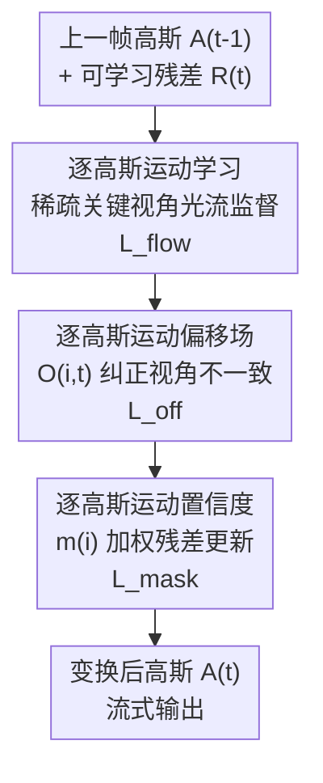

# MoRGS: Efficient Per-Gaussian Motion Reasoning for Streamable Dynamic 3D Scenes

**会议**: CVPR 2026  
**论文**: [CVF Open Access](https://openaccess.thecvf.com/content/CVPR2026/html/Lee_MoRGS_Efficient_Per-Gaussian_Motion_Reasoning_for_Streamable_Dynamic_3D_Scenes_CVPR_2026_paper.html)  
**代码**: 待确认  
**领域**: 3D视觉 / 动态高斯泼溅  
**关键词**: 在线4D重建, 高斯泼溅, 逐高斯运动, 光流监督, 流式重建

## 一句话总结
MoRGS 在流式动态场景的在线 3DGS 重建里，用稀疏关键视角光流显式监督「逐高斯运动」，再叠加一个可学习的逐高斯运动偏移场纠正稀疏光流的视角不一致，并用逐高斯运动置信度只对真正动起来的高斯做残差更新，从而在保持流式低延迟的同时把渲染质量和运动保真度都做到在线方法 SOTA。

## 研究背景与动机

**领域现状**：从多视角视频重建动态场景，是 AR/VR/远程呈现等应用的核心。3DGS 凭借快训练、实时渲染取代了 NeRF 成为主流基底。但大多数动态重建方法是**离线**的——要求拿到完整序列后非因果地优化，无法用于「帧逐个到来、看不到未来帧」的直播流式场景。

**现有痛点**：在线方法（3DGStream、QUEEN、HiCoM、4DGC 等）为满足严格的延迟/算力约束，普遍**回避显式运动线索**（如光流），只用光度损失同时优化外观和运动。这造成「监督信号和优化目标错配」：逐高斯运动被优化去降低像素残差，而不是去还原真实的 3D 运动。

**核心矛盾**：在纯像素驱动的目标下，模型会用「轻微挪动本该静止的邻近高斯」来解释局部外观变化，而不是正确地移动那些真正在动的高斯。结果是大幅帧间运动的高斯被低估、静止高斯却获得了多余运动，时序一致性变差。

**本文目标**：在不破坏流式效率的前提下，让逐高斯运动真正跟随场景的 3D 动态——即把更新集中到真正动态的高斯上。

**切入角度**：光流是廉价又强的 2D 运动先验，关键是「怎么用得起」——不能为所有视角算稠密光流，否则在线效率就没了。作者只在**稀疏的关键视角**上算光流当作轻量运动线索。

**核心 idea**：用稀疏关键视角光流显式监督逐高斯运动（supervise），用可学习偏移场修正稀疏监督的视角不一致（refine），用运动置信度对残差更新做加权（weight），三者构成一个统一的、运动感知的在线重建框架。

## 方法详解

### 整体框架
MoRGS 建立在「在线高斯属性建模」之上：时刻 $t$ 的高斯属性由上一帧属性加可学习残差得到 $\mathcal{A}_t = \mathcal{A}_{t-1} + \mathcal{R}_t$。在这个因果递推骨架里，MoRGS 不改变「逐帧加残差」的流式结构，而是往残差更新里注入三件运动推理的事：先用稀疏关键视角光流**监督**逐高斯运动，再用一个逐高斯**运动偏移场**纠正稀疏光流带来的几何不一致，最后用逐高斯**运动置信度**给残差更新加权、把更新集中到真正动态的高斯上。

### 关键设计

**1. 逐高斯运动学习：用稀疏关键视角光流把高斯运动锚到真实 2D 运动上**

针对「只用光度损失导致运动追像素残差而非真实运动」这个痛点，作者引入光流作为显式监督。为了不拖垮在线效率，光流不是对所有视角算，而是只在一小撮**关键视角** $\hat{v}$ 上用预训练网络（SEA-RAFT）对相邻帧算：$F^{\text{flow}}_{\hat{v}}(x) = F^{\text{flow}}(I_{\hat{v},t}, I_{\hat{v},t-1})$。

要把图像空间的光流和高斯运动对上，需要建立「像素↔高斯」的运动对应。每个高斯的 3D 位移定义为 $\Delta\mu_{i,t} = \mu_{i,t} - \mu_{i,t-1}$，用相机投影的一阶线性化 $\pi_{\hat{v}}$ 投到图像平面，再经过透射率归一化的 $\alpha$-blending 渲染成逐像素的高斯运动图：$F^{G}_{\hat{v}}(x) = \sum_i w_i(x)\,\pi_{\hat{v}}(\Delta\mu_{i,t})$，其中 $w_i(x)$ 是沿光线归一化的透射率加权不透明度。最后用端点误差损失把渲染运动图和观测光流对齐：$L_{\text{flow}} = \sum_{\hat{v}}\lVert F^{\text{flow}}_{\hat{v}}(x) - F^{G}_{\hat{v}}(x)\rVert_2$。整个过程完全可微，让高斯位移跟随观测到的 2D 运动，而不是只去最小化光度误差。

**2. 逐高斯运动偏移场：补偿稀疏、视角受限的光流监督带来的几何不一致**

稀疏关键视角光流虽然方向性强，但它**视角受限**——同一 3D 区域在不同视角的光流可能互相矛盾，而且渲染运动图沿光线混合了多个高斯的贡献，会模糊归因。为此作者给每个高斯挂一个可学习的运动偏移 $O_{i,t}\in\mathbb{R}^3$，把高斯运动改写为 $\Delta\hat{\mu}_{i,t} = \underbrace{\Delta\mu_{i,t}}_{\text{光流引导}} + \underbrace{O_{i,t}}_{\text{可学习偏移}}$。

这里的分工很巧：光流引导的基础运动 $\Delta\mu_{i,t}$ 编码稀疏关键视角给出的位移，而偏移 $O_{i,t}$ 是从**所有观测到该高斯的视角**聚合梯度优化出来的，因此能融合多视角证据。当线索跨视角一致时偏移很小、基础运动占主导；当线索和底层 3D 几何冲突时偏移就出来补偿，让有效位移跟随真实运动而非过拟合稀疏光流。为防止偏移盖过基础运动，用 $L_{\text{off}} = \lVert O_{i,t}\rVert_1$ 约束其幅度。消融里有个有力的证据：用偏移 + 仅 4 个监督视角，效果反而**超过**不用偏移的 8 个监督视角，说明偏移让稀疏运动线索被用得更充分。

**3. 逐高斯运动置信度：只对真正动态的高斯做残差更新，保住静态区时序一致性**

在线重建的关键是「该动的动、该静的静」。作者引入逐高斯运动置信度 $m_i\in[0,1]$ 当作运动似然，去加权高斯属性残差，把更新公式从 $\mathcal{A}_{i,t}=\mathcal{A}_{i,t-1}+\mathcal{R}_{i,t}$ 改成 $\mathcal{A}_{i,t}=\mathcal{A}_{i,t-1}+m_i\odot\mathcal{R}_{i,t}$（$\odot$ 是按属性维度逐元素加权），从而压低近静止高斯的更新、放大动态高斯的更新。

置信度的监督来自 2D 运动分割掩码。先在周期采样的关键帧上由光流幅度阈值得到运动掩码 $M^{\text{flow}}_{\hat{v},k} = \lVert F^{\text{flow}}(I_{\hat{v},k}, I_{\hat{v},k-1})\rVert > \lambda_{\text{flow}}$（多视角静态相机假设下，幅度可忽略的像素视为静态）。但光流掩码强烈依赖视角、同一 3D 区域在不同视角可能一会动一会静，而 $m_i$ 是每个高斯**跨视角共享的单一标量**。所以作者把光流掩码喂给 SAM2 细化成物体级、视角一致的掩码并融合：$M_{\hat{v},k} = M^{\text{flow}}_{\hat{v},k}\cup M^{\text{sam}}_{\hat{v},k}$，既找回漏掉的运动区域又保持物体边界一致，且只在关键视角的关键帧上跑 SAM2 控制开销。最后用 $\alpha$-blending 渲染置信度图 $\tilde{M}_{\hat{v},k}(x)=\sum_i T_i m_i \alpha_i$，用掩码监督 $L_{\text{mask}} = \sum_{\hat{v}}\lVert\tilde{M}_{\hat{v},k} - M_{\hat{v},k}\rVert_1$ 把掩码提升到高斯域。这个置信度还有个附带好处：早期训练时优先更新高置信度高斯，能**加速大运动的建模**。

### 损失函数 / 训练策略
**初始帧重建**：从 SfM 点初始化高斯、运动置信度 $m_i$ 置零；沿用 3DGS 先优化静态属性、冻结运动置信度直到稠密化之后再启用，防止运动梯度干扰早期质量（N3DV 训 10k 迭代、Meet Room 训 15k，置信度只在最后 2k 迭代启用）。第一帧因没有前一帧，运动掩码由下一帧算。

**序列帧重建**：后续帧按因果顺序更新残差，联合优化偏移和置信度，总损失为

$$L_{\text{total}} = L_{\text{recon}} + \lambda_{\text{mask}}L_{\text{mask}} + \lambda_{\text{flow}}L_{\text{flow}} + \lambda_{\text{off}}L_{\text{off}}$$

其中 $L_{\text{recon}}$ 是 3DGS 的 L1+D-SSIM 重建损失。$L_{\text{mask}}$ 和 $L_{\text{flow}}$ 只在关键视角算，$L_{\text{mask}}$ 进一步限制在关键帧。光流用 SEA-RAFT 在每场景 4 个指定视角上算、关键帧每 5 帧采一次。每帧每视角优化 8 个 epoch（轻量版 MoRGS-s 只用 5 个）。

## 实验关键数据

### 主实验
在 N3DV（6 个室内场景、20 视角）和 Meet Room（3 个场景、13 视角）上，每场景 300 帧、中心视角留作测试，单张 RTX A5000 评测。

| 数据集 | 方法 | PSNR(dB)↑ | LPIPS↓ | 训练(s)↓ | 渲染(FPS)↑ |
|--------|------|-----------|--------|----------|------------|
| N3DV | 3DGStream (CVPR'24) | 31.67 | — | 13 | 215 |
| N3DV | QUEEN-l (NeurIPS'24) | 32.19 | 0.136 | 2.9 | 186 |
| N3DV | 4DGC (CVPR'25) | 31.58 | — | 50 | 168 |
| N3DV | **MoRGS-l (本文)** | **32.53** | **0.118** | 4.0 | 200 |
| N3DV | MoRGS-s (本文轻量) | 32.42 | 0.119 | 3.4 | 215 |
| Meet Room | 3DGStream | 30.79 | — | 7.2 | 288 |
| Meet Room | QUEEN-l† | 29.47 | 0.185 | 1.5 | 317 |
| Meet Room | **MoRGS (本文)** | **31.79** | **0.152** | 2.3 | 308 |

MoRGS 在两个数据集都拿到在线方法里最好的渲染质量，且延迟与在线基线相当：QUEEN 训练快约 1.1 s 但质量低 0.34 dB；4DGC 存储最小但训练慢约 46 s。轻量版 MoRGS-s 比全模型每帧再省 0.6 s，仍保住在线方法里最高 PSNR。（QUEEN-l† 为作者在同环境用官方代码复现。）

### 消融实验
ML=逐高斯运动学习，MO=运动偏移，MC=运动置信度。

| 配置 | N3DV PSNR↑ | Meet Room PSNR↑ | N3DV 训练(s) |
|------|-----------|-----------------|--------------|
| Baseline（全去掉） | 31.33 | 29.40 | 3.3 |
| + ML | 31.85 (+0.52) | 30.55 (+1.15) | 3.7 |
| + ML + MO | 32.21 (+0.36) | 31.21 | 3.8 |
| + ML + MO + MC（Full） | 32.53 (+0.32) | 31.79 (+0.58) | 4.0 |

### 关键发现
- **三个模块单调叠加增益**：ML 贡献最大（N3DV +0.52 dB / Meet Room +1.15 dB），且因为光流只在子集视角算，每帧只多约 0.4 s；MO 再 +0.36/+0.66 dB；MC 再 +0.32/+0.58 dB。
- **偏移让稀疏监督更值钱**：监督视角越稀疏，偏移收益越明显——4 视角带偏移（32.21）超过 8 视角不带偏移（32.07），但监督视角从 4 涨到 12 会把每帧时间从约 3.95 s 推到 6.32 s，存在清晰的精度-效率权衡。
- **静态区更稳**：在 COFFEE MARTINI / FLAME STEAK 上，作者用静态区掩码内的 masked Total Variation（mTV，自定义指标：仅在预定义静态区掩码内统计渲染的时间总变差，越低说明静态区时序越稳）衡量，MoRGS 的 mTV 显著低于 3DGStream / QUEEN（如 COFFEE MARTINI 0.671×100 vs QUEEN-l 1.51×100），印证显式运动建模把更新约束在了真正动态的区域。

## 亮点与洞察
- **「监督-精修-加权」三段式运动推理**：把「显式运动线索难以在线用得起」拆成三件可微的小事——稀疏光流监督、3D 偏移场精修、置信度加权，每件都只在关键视角/关键帧上算，整体只增极小开销就把运动保真度拉到 SOTA，这个拆法很可复用。
- **偏移场的归因解耦很妙**：渲染运动图沿光线混合多高斯、归因模糊；而偏移是直接挂在单个高斯上、从所有观测视角聚合梯度，正好补上「稀疏光流看不全」的盲区，且用 L1 约束保证不喧宾夺主。
- **置信度同时管三件事**：抑制静态区冗余更新（保时序一致）、聚焦动态高斯（保质量）、早期加速大运动建模（保收敛），一个标量 $m_i$ 串起来，思路可迁到其他「需要区分动/静再差异化更新」的在线任务。

## 局限与展望
- 方法依赖预训练光流（SEA-RAFT）和分割（SAM2）的质量，关键视角光流或物体掩码出错会直接污染运动监督；作者用偏移场和掩码融合做了缓解但未根除。
- 运动置信度建立在**多视角静态相机假设**上（用光流幅度判静/动），相机本身运动或单目场景下这个假设不成立，泛化性存疑 ⚠️。
- 评测局限在 N3DV / Meet Room 两个室内、前向、相机静止的多视角数据集，对大范围相机运动、室外、稀疏视角的鲁棒性未验证。

## 相关工作与启发
- **vs 3DGStream / QUEEN / HiCoM / 4DGC（在线方法）**：它们只用光度损失隐式学运动，把运动当作外观匹配的代理；MoRGS 显式用稀疏光流监督逐高斯运动，质量与时序一致性都更好，代价是每帧多约 0.4–1 s 的光流/掩码开销。
- **vs 离线 4D 高斯（STG / Swift4D / Real-Time 4DGS）**：离线方法靠完整序列和丰富时序约束做到高质量（Swift4D 32.23 dB），但非因果、不能流式；MoRGS 在因果在线设定下把 PSNR 做到 32.53 dB，反超部分离线方法且保持流式。
- **vs 用稠密光流的方法**：稠密全视角光流会破坏在线效率；MoRGS 只在 4 个关键视角算、用偏移场补稀疏性，是「稀疏线索 + 可学习精修」的折中范式。

## 评分
- 新颖性: ⭐⭐⭐⭐ 在线 3DGS 里首次系统地显式建模逐高斯运动，三段式设计有针对性，但每个组件（光流监督/偏移/置信度）单看都不算全新。
- 实验充分度: ⭐⭐⭐⭐ 两个数据集 + 充分消融 + 自定义 mTV 验证静态区稳定性，但只覆盖室内静相机多视角，缺单目/室外验证。
- 写作质量: ⭐⭐⭐⭐ 动机-方法-实验逻辑清晰，图 3 的逐高斯运动可视化很有说服力。
- 价值: ⭐⭐⭐⭐ 对流式 4D 重建是实用的质量提升，且「稀疏关键视角线索 + 可学习精修」范式有迁移价值。

<!-- RELATED:START -->

## 相关论文

- [\[CVPR 2026\] MotionScale: Reconstructing Appearance, Geometry, and Motion of Dynamic Scenes with Scalable 4D Gaussian Splatting](motionscale_reconstructing_appearance_geometry_and_motion_of_dynamic_scenes_with.md)
- [\[CVPR 2026\] Space-Time Forecasting of Dynamic Scenes with Motion-aware Gaussian Grouping](space-time_forecasting_of_dynamic_scenes_with_motion-aware_gaussian_grouping.md)
- [\[CVPR 2026\] GaussianFluent: Gaussian Simulation for Dynamic Scenes with Mixed Materials](gaussianfluent_gaussian_simulation_for_dynamic_scenes_with_mixed_materials.md)
- [\[CVPR 2026\] VAD-GS: Visibility-Aware Densification for 3D Gaussian Splatting in Dynamic Urban Scenes](vad-gs_visibility-aware_densification_for_3d_gaussian_splatting_in_dynamic_urban.md)
- [\[CVPR 2026\] Featurising Pixels from Dynamic 3D Scenes with Linear In-Context Learners](featurising_pixels_from_dynamic_3d_scenes_with_linear_in-context_learners.md)

<!-- RELATED:END -->
