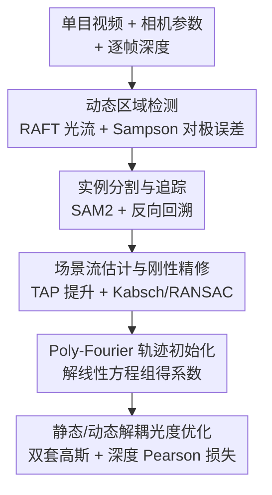

# MOSAIC-GS: Monocular Scene Reconstruction via Advanced Initialization for Complex Dynamic Environments

**会议**: CVPR 2026  
**论文**: [CVF Open Access](https://openaccess.thecvf.com/content/CVPR2026/html/Morkva_MOSAIC-GS_Monocular_Scene_Reconstruction_via_Advanced_Initialization_for_Complex_Dynamic_CVPR_2026_paper.html)  
**代码**: 待确认  
**领域**: 3D视觉 / 单目动态高斯泼溅  
**关键词**: 单目动态重建, 高斯泼溅, 场景流初始化, 刚性约束, Poly-Fourier 轨迹

## 一句话总结
MOSAIC-GS 把单目动态场景重建的「运动估计」从光度优化阶段挪到一个四步预处理流水线里——先检测/分割/追踪动态物体，再用刚性约束精修出场景流，并用 Poly-Fourier 曲线把轨迹**直接初始化**给动态高斯，配合静态/动态高斯解耦，从而在质量与 SOTA 相当（LPIPS 反超）的同时把训练和渲染速度提升好几倍。

## 研究背景与动机

**领域现状**：NeRF 和 3DGS 在静态场景重建上已经很成熟，扩展到动态场景的工作主要走两条路——逐帧形变（为每帧存高斯变换，内存大、长序列不可扩展）或连续运动建模（用可学习函数表示高斯轨迹，更紧凑但难抓复杂/快速运动，尤其只靠光度线索时）。

**现有痛点**：单目动态重建本质上**欠约束**——缺乏多视角约束，几何和时序一致性难恢复。现有方法普遍训练慢、内存/存储开销大、渲染慢，且在复杂运动区有明显伪影；很多还重视觉真实度而轻物理一致性，从新视角看就扭曲。这在机器人、嵌入式这类视角受限、算力有限的平台上尤其要命。

**核心矛盾**：作者的关键洞察是——**在光度优化阶段从纯视觉数据推断场景动态既低效又不可靠**。预实验显示，光度优化对初始化极度敏感：没有准确的运动估计，大部分动态区的点在早期就被剪枝掉了，模型得花很多迭代去找回丢失的数据，既慢质量又差。

**本文目标**：与其在优化里费劲推运动，不如把高质量的运动先验「喂」进初始化——让初始化携带的不只是高斯位置和颜色，还有可靠的运动轨迹。

**切入角度**：充分利用视频里**已有的几何/物理线索**——深度、光流、动态物体分割、逐点追踪，再加刚性约束，在初始化阶段就估出初步的 3D 场景动态。

**核心 idea**：用一个「检测→分割追踪→刚性精修场景流→Poly-Fourier 初始化」的预处理流水线，把动态恢复前置到光度优化之前，并把场景解耦成静态/动态两套高斯以提升参数效率。

## 方法详解

### 整体框架
输入是单目视频 + 相机内外参 + 逐帧深度（传感器或单目深度模型给）。MOSAIC-GS 的核心是一个四步**预处理流水线**，把运动恢复前置到光度优化之前：(1) 用光流 + 对极几何检测动态区域；(2) 用 SAM2 分割并追踪动态实例；(3) 用 TAP 逐点追踪 + 刚性变换精修出场景流；(4) 把精修场景流编码成 Poly-Fourier 曲线、自适应采样点来初始化静态/动态高斯。这些参数作为初始值喂给最后的光度优化阶段，其中静态和动态分别用两套独立高斯（参数效率更高），但联合光栅化渲染，并用深度 Pearson 相关损失强化几何一致性。

### 关键设计

**1. 动态区域检测：用 Sampson 对极误差从相机运动里剥出真实场景运动**

针对「单目缺多视角约束、难判断哪里在动」，作者不依赖容易被噪声深度污染的完整 3D 重建误差，而是用**对极几何**。给相邻两帧 $I_t, I_{t+1}$，先用 RAFT 算稠密光流 $u_t$，再对每个像素对应 $x$ 算 Sampson 对极误差 $e_{\text{epi}}(x) = \frac{(x'^\top F x)^2}{(Fx)_1^2 + (Fx)_2^2 + (F^\top x')_1^2 + (F^\top x')_2^2}$，其中 $F$ 是由相机内外参导出的基础矩阵。对极误差高的像素无法只用相机运动解释——可能来自真实运动、光流误差或相机参数误差，作者用阈值 $e_{\text{epi}}(x) > \tau_{\text{epi}}$ 过滤出动态候选。这一步把「动/静判断」建立在几何约束上，比直接用 3D 重建误差更稳。

**2. 实例分割与追踪：用 SAM2 + 反向回溯把帧间动态区凝成时序一致的物体掩码**

单纯靠对极误差阈值在某些场景不够，作者引入 prompt 式分割追踪模型 SAM2。逐帧先提取动态区的边界框：若之前没检到动态物体就直接拿框当 prompt；否则先**减去已追踪实例的掩码**避免重复追踪，再用剩余区域的框生成新实例掩码 $M^j_t$，并用置信度阈值 $p_{\text{conf}}(M^j_t) < \tau_{\text{mask}}$ 滤掉不可靠检测。高置信掩码加入追踪器并按固定间隔前向传播。处理完所有帧后，为了照顾「早期是静止、后来才动」的物体，再做一次**反向传播**把物体掩码延伸到更早的帧。结合分割和追踪能解决遮挡和不完美掩码带来的歧义，产出时序一致的实例标识。

**3. 场景流估计与刚性精修：逐点追踪提升到 3D，再用刚体变换降噪补缺**

作者在动态区随机采 $N_p = 10000$ 个查询点，用点追踪（BootsTAPIR）追踪成 2D 轨迹，按和分割掩码的多数重叠把每条轨迹分配给某个动态物体 $j$，丢掉主要落在静态背景上的轨迹。再用深度图 + 相机内外参把 2D 轨迹**提升到 3D** 得到场景流。关键的精修在于：对每个物体 $j$，取可见的点对用 **Kabsch 算法 + RANSAC** 估计最佳对齐的刚体变换 $(R^j_t, t^j_t)$，按 $P^i_{t+1} := R^j_t P^i_t + t^j_t$ 更新位置；前向处理完再反向做一遍，补上「物体可见但点未观测」的帧，剩余完全不可见的点用最近的可见帧插值。刚性约束既降低追踪噪声，又能在场景的未观测区域高效推断运动——这正是单目场景最缺的。

**4. Poly-Fourier 轨迹初始化 + 静态/动态解耦：把运动直接写进初始化，而非优化里学**

这是全文最核心的差异点。多数前作要在光度优化阶段才去学轨迹系数，作者反其道而行——**直接从精修后的场景流初始化** Poly-Fourier 曲线系数。对每条轨迹 $\{P^i_t\}$ 解线性方程组 $Ax = y$，其中基函数 $\phi(t) = [1, t, t^2, \sin(\omega t), \cos(\omega t)]^\top$，解出的系数 $x = [a_0, a_1, a_2, \ldots, b_1, c_1, \ldots]$ 紧凑地编码了整条时序轨迹，用来初始化动态高斯的形变参数。同时每个高斯的颜色取自对应 RGB 像素、尺度用 LoG（Laplacian of Gaussian）范数结合深度估计，做到自适应匹配局部细节密度。

场景被解耦成静态集 $G_s$ 和动态集 $G_d$（$G = G_s \cup G_d$），各自独立初始化、独立稠密化策略：静态高斯只有常规参数，动态高斯额外存 Poly-Fourier 系数表示均值和旋转的时变偏移，位置偏移为 $\Delta\mu(t) = \sum_k a_k t^k + \sum_k (b_k\cos(k\omega t) + c_k\sin(k\omega t))$，均值 $\mu(t) = \mu_0 + \Delta\mu(t)$。旋转上作者不像 Gaussian Flow 那样直接给基四元数加时变偏移，而是把 Poly-Fourier 输出加单位四元数再归一化成合法单位四元数 $\Delta q(t)$、再用四元数乘法 $q(t) = \Delta q(t)\otimes q_0$，避免非法四元数更新带来的伪影。此外作者**不建模时变颜色形变**，防止模型用人造颜色变化来掩盖运动不准——这既提升紧凑性又强制运动归运动。

### 损失函数 / 训练策略
光度优化阶段总损失为 $\mathcal{L} = (1-\lambda_{\text{ssim}})\mathcal{L}_{\text{L1}} + \lambda_{\text{ssim}}\mathcal{L}_{\text{SSIM}} + \lambda_{\text{depth}}\mathcal{L}_{\text{depth}}$，前两项是光度损失，$\mathcal{L}_{\text{depth}}$ 用参考深度强化几何一致。为应对时序上深度尺度不一致，深度损失实现为 **Pearson 相关损失**——它保留相对几何、对绝对尺度变化不变，避免噪声深度的绝对值污染优化。Poly-Fourier 默认阶数为 32。

## 实验关键数据

### 主实验
在 iPhone DyCheck 和 NVIDIA Dynamic Scene（原版 + Gaussian Marbles 修改版）上评测，单张 RTX 4090。

| 数据集 | 方法 | PSNR↑ | LPIPS↓ |
|--------|------|-------|--------|
| DyCheck | Gaussian Flow | 16.22 | 0.311 |
| DyCheck | Shape of Motion | 17.32 | 0.295 |
| DyCheck | MoSca | **19.32** | 0.264 |
| DyCheck | **MOSAIC-GS (本文)** | 18.40 | **0.255** |
| NVIDIA(原版) | MoSca | **26.72** | 0.070 |
| NVIDIA(原版) | **MOSAIC-GS (本文)** | 26.26 | **0.060** |
| NVIDIA(Marbles版) | Gaussian Marbles | 23.68 | 0.069 |
| NVIDIA(Marbles版) | **MOSAIC-GS (本文)** | **23.79** | **0.069** |

PSNR 上 MOSAIC-GS 普遍是次优（仅次于 MoSca），但 **LPIPS 在三个数据集都取得最好或并列最好**——作者论证 LPIPS 更贴近人眼感知，本文在动态区重建出更锐利的细节，虽然细节多反而可能略降 PSNR。在 Marbles 修改版上，作者用「仅在可见区评测」的协议重测所有方法，MOSAIC-GS 在 PSNR 和 LPIPS 都拿到 SOTA。

### 效率对比

| 方法 | 训练时间↓ | 渲染速度↑ |
|------|-----------|-----------|
| Gaussian Marbles | 5–9 h | 200 FPS |
| Gaussian Flow | 23 min | 52 FPS |
| MoSca | 50 min | 38 FPS |
| **MOSAIC-GS (本文)** | **10.5 min** | **180 FPS** |

训练时间含预处理，其中纯光度优化只约 5 分钟。相比 MoSca 训练快约 5 倍、渲染快约 4.7 倍。

### 消融实验（DyCheck）
| 配置 | mPSNR↑ | mLPIPS↓ | 训练时间(min)↓ |
|------|--------|---------|----------------|
| Full model | 18.40 | 0.255 | 5.06 |
| 去掉形变初始化 | 16.99 | 0.298 | 5.41 |
| 去掉流刚性精修 | 18.11 | 0.265 | 4.83 |
| 去掉静态/动态解耦 | 14.65 | 0.456 | 8.26 |
| 去掉深度监督 | 18.13 | 0.264 | 4.87 |
| Fourier 阶 24 | 18.37 | 0.261 | 4.91 |
| Fourier 阶 16 | 18.29 | 0.265 | 4.68 |

> mPSNR / mSSIM / mLPIPS 是「masked」指标——只在 ground-truth 可见性掩码（covisibility mask）内统计，避免不可见区污染评分。

### 关键发现
- **静态/动态解耦贡献最大**：去掉后 mPSNR 暴跌到 14.65、训练时间反升到 8.26 min——因为静态区初始化变差、场景流精修出错，且每个高斯都得存形变参数，算力大涨。
- **运动初始化是第二关键**：去掉动态高斯形变系数初始化，mPSNR 从 18.40 掉到 16.99，印证「准确运动先验」对单目重建的重要性。
- **刚性精修与深度监督各有约 0.3 dB 增益**，前者在复杂运动场景尤其明显。
- **Fourier 阶数影响相对小**：高阶（32）在 Wheel 这类细节多、快运动场景更能抓复杂运动；低阶更紧凑、适合资源受限场景。
- **零成本附加应用**：预处理里给动态高斯分配了实例 ID，重建天然产出时序一致的分割，可零额外开销做物体移除/隔离/换色/编辑。

## 亮点与洞察
- **「把运动前置到初始化」的范式转变**：与其在光度优化里和欠约束的单目运动死磕，不如先用现成的光流/分割/追踪/刚性约束把场景流估出来，再直接初始化高斯轨迹——既快又准，消融里它（形变初始化）是仅次于解耦的第二大贡献。
- **直接解方程初始化 Poly-Fourier 系数**：把轨迹系数从「优化里学」改成「从精修场景流解线性方程组得到」，是个很干净的工程洞察，省掉大量优化迭代。
- **静态/动态双套高斯**：只有动态高斯背形变参数，静态高斯保持轻量，参数效率和速度双赢；而且分离后静态区初始化更准，连带让场景流精修也更稳。
- **不建模时变颜色**：刻意砍掉颜色形变，逼模型用真实运动而非「人造变色」去解释外观变化，是个反直觉但有效的紧凑化设计。

## 局限与展望
- 重度依赖初始分割掩码和场景流的质量，会继承外部模型（RAFT/SAM2/BootsTAPIR/深度估计）的误差——这是「把运动前置」范式的固有代价。
- 场景流精修在「整个动态物体在训练视角里都不可见」时可能不足，刚性约束也救不回完全没观测的物体。
- PSNR 始终次于 MoSca，作者用「细节多→LPIPS 更好但 PSNR 略降」来解释 ⚠️——这套说辞在追求 PSNR 的评测里说服力有限，质量-感知的取舍需读者自行判断。

## 相关工作与启发
- **vs MoSca（当前 SOTA）**：MoSca 用 Motion Scaffold Graph 把轨迹连成时空结构、靠逐帧形变建模，质量（PSNR）最高但训练 50 min、渲染 38 FPS；MOSAIC-GS PSNR 略低但 LPIPS 反超，训练/渲染快约 5×/4.7×，靠的是紧凑表示 + 解耦 + 准初始化减少优化步数。
- **vs Gaussian Flow**：两者都用 Poly-Fourier/连续运动表示，但 Gaussian Flow 在优化里学系数、还建模时变颜色；MOSAIC-GS 从场景流直接初始化系数、砍掉颜色形变、改进旋转参数化避免非法四元数，质量和速度都更好。
- **vs Gaussian Marbles / Shape of Motion**：这些走逐帧形变/轨迹混合，内存大、训练动辄数小时；MOSAIC-GS 用解耦 + 紧凑编码把训练压到约 10 min，在 Marbles 版数据集上以约 7 min 训练拿到 SOTA。

## 评分
- 新颖性: ⭐⭐⭐⭐ 「运动恢复前置到初始化 + 直接解方程初始化轨迹系数」是清晰有价值的范式转变，但各组件多是现成模块的精巧组合。
- 实验充分度: ⭐⭐⭐⭐ 三个数据集 + 细致消融 + 公平的可见区评测协议，但 PSNR 始终次优、对完全不可见物体未给定量分析。
- 写作质量: ⭐⭐⭐⭐ 流水线四步讲得清楚、动机（初始化敏感性）有预实验支撑，公式略多但自洽。
- 价值: ⭐⭐⭐⭐ 训练/渲染快数倍且零成本支持分割编辑，对机器人/嵌入式等资源受限场景实用性强。

<!-- RELATED:START -->

## 相关论文

- [\[CVPR 2026\] AdaSFormer: Adaptive Serialized Transformers for Monocular Semantic Scene Completion from Indoor Environments](adasformer_adaptive_serialized_transformers_for_monocular_semantic_scene_complet.md)
- [\[CVPR 2026\] ReFlow: Self-correction Motion Learning for Dynamic Scene Reconstruction](reflow_self-correction_motion_learning_for_dynamic_scene_reconstruction.md)
- [\[CVPR 2026\] WildRayZer: Self-supervised Large View Synthesis in Dynamic Environments](wildrayzer_self-supervised_large_view_synthesis_in_dynamic_environments.md)
- [\[CVPR 2026\] Point4Cast: Streaming Dynamic Scene Reconstruction and Forecasting](point4cast_streaming_dynamic_scene_reconstruction_and_forecasting.md)
- [\[CVPR 2026\] AeroGS: Scale-Aware Gaussian Splatting for Pose-Free Dynamic UAV Scene Reconstruction](aerogs_scale-aware_gaussian_splatting_for_pose-free_dynamic_uav_scene_reconstruc.md)

<!-- RELATED:END -->
