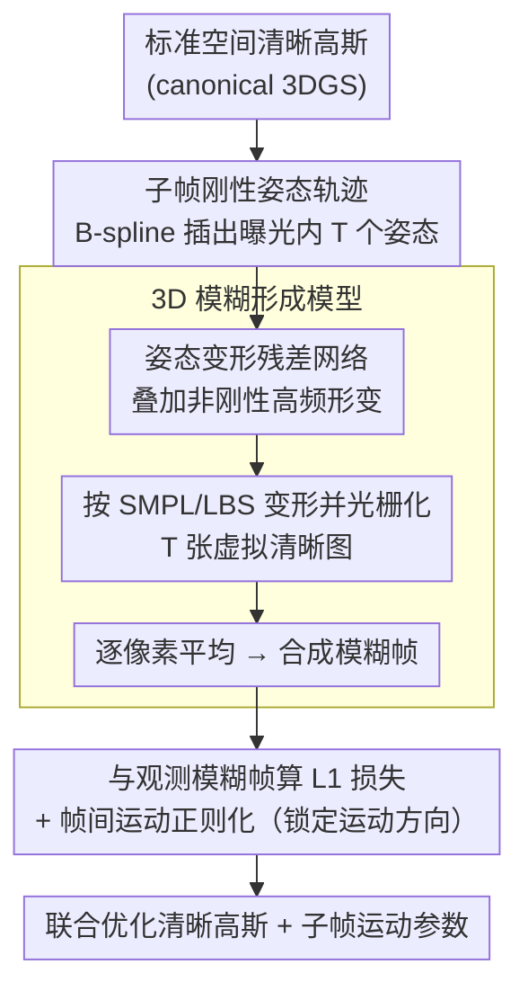

# Motion-Aware Animatable Gaussian Avatars Deblurring

**会议**: CVPR 2026  
**arXiv**: [2411.16758](https://arxiv.org/abs/2411.16758)  
**代码**: [GitHub](https://github.com/MyNiuuu/MAD-Avatar)  
**领域**: 3D视觉  
**关键词**: 3D人体重建, 运动模糊, 3D高斯溅射, SMPL, 去模糊

## 一句话总结

提出首个从模糊视频直接重建清晰可动画3D人体高斯Avatar的方法，通过3D感知的物理模糊形成模型和基于SMPL的人体运动模型，联合优化Avatar表示和运动参数。

## 研究背景与动机

从多视角视频创建3D人体Avatar是计算机视觉中的重要任务。现有方法（如GauHuman）依赖高质量清晰图像输入，但实际场景中由于人体运动速度和强度的变化，运动模糊不可避免。模糊效果会导致两个问题：(1) 3DGS模型学到扭曲的3D表示，因为运动模糊引入了固有歧义；(2) 即使相机已标定，模糊帧仍会导致SMPL参数估计错误。简单的两阶段方案（先2D去模糊再建模）忽略了3D场景信息，导致多视角不一致。

## 方法详解

### 整体框架

这篇论文要解决的是：当多视角视频本身带运动模糊时，如何直接重建出清晰、可驱动的 3D 高斯人体 Avatar，而不是先做 2D 去模糊再建模（那样会丢掉 3D 信息、导致多视角不一致）。核心思路是把整个重建拆成两件事——优化曝光期间的子帧运动、以及构建标准空间里的清晰 3DGS Avatar——并用一个物理模糊形成模型把二者绑在一起。

具体来说，标准空间的清晰高斯先按 SMPL 参数变形到曝光内的若干时间步，每个时间步光栅化出一张"虚拟"清晰图像，再把它们平均合成一帧模糊图像，与真实观测的模糊帧算损失反向优化。这样去模糊不再是前处理，而是被自然嵌进 3D 重建的前向过程里。

### 关键设计

**1. 3D 模糊形成模型：把 2D 物理模糊搬进 3D Avatar 渲染管线**

两阶段方案（先 2D 去模糊再建模）的问题是 2D 去模糊不知道 3D 几何，多视角各自为政。本文把"模糊是曝光期间多个瞬时画面的累积"这一物理事实直接写进渲染：模糊图像是曝光内 $T$ 个时间步渲染结果的平均

$$\mathbf{I}^B = \frac{1}{T}\sum_{t=0}^{T-1}\mathcal{R}(\mathcal{W}(\{G_k(\mathbf{x})\}_{k=0}^{K-1}, \mathcal{S}_t), \mathbf{R}, \mathbf{K})$$

其中 $\mathcal{W}$ 按 SMPL 参数 $\mathcal{S}_t$ 把标准空间的 3D 高斯变形到观测空间，$\mathcal{R}$ 是光栅化。因为每个时间步共享同一套标准空间高斯，多视角天然一致，去模糊问题就被转化成"求清晰高斯 + 求子帧运动"的联合优化。

**2. 子帧刚性姿态轨迹（B-spline 插值）：从一帧模糊里恢复曝光内的连续运动**

要平均多个时间步就得知道曝光内每一刻的姿态，但观测只有离散的模糊帧。本文借 SMPL 的 24 个关节，为每个关节存 $P$ 个控制参数 $\tilde{\Theta}^j \in \mathbb{R}^{P \times 3}$，用 De Boor-Cox B-spline 插出曝光内任意时刻的中间姿态

$$\hat{\Theta}_t^j = \mathbf{B}(t) \cdot \mathcal{M}^P \cdot \tilde{\Theta}^j$$

$\mathbf{B}(t)$ 是时间基、$\mathcal{M}^P$ 是插值矩阵。B-spline 自带连续性，保证插出的关节运动平滑；控制参数从粗估计初始化后随训练一起优化。

**3. 姿态变形残差网络：补回 B-spline 拟合不了的高频非刚性形变**

B-spline 只能描出基本的姿态轨迹，对衣物褶皱、肌肉抖动这类非刚性高频变化无能为力。本文加一个 CNN $G_{disp}$，为每个关节每个时间步预测一个位移残差叠加在 B-spline 结果上

$$\Theta_t^j = \hat{\Theta}_t^j + G_{disp}(\hat{\Theta}_t^j; \theta_{disp})$$

让模型在平滑轨迹之上还能捕捉复杂的姿态动态。

**4. 帧间运动正则化：消除模糊固有的运动方向歧义**

运动模糊有个根本歧义——正向和反向运动可以产生几乎一样的模糊图像，单看一帧无法判别方向。本文用相邻曝光周期"上一帧结尾姿态"和"下一帧开头姿态"应当连续这一约束，对二者的测地距离做正则

$$\mathcal{L}_{reg} = \frac{1}{24 \cdot (N_e - 1)}\sum_{n=0}^{N_e-2}\sum_{j=0}^{23}|\hat{\Theta}_{n,T-1}^j - \hat{\Theta}_{n+1,0}^j|_G$$

强制相邻曝光在时间上接得上，从而锁定唯一的运动方向、增强帧间一致性。

### 损失函数 / 训练策略

总损失是合成模糊帧与观测模糊帧的 L1 损失加帧间正则：

$$\mathcal{L} = \|\hat{\mathbf{I}}^B - \mathbf{I}^B\|_1 + \mathcal{L}_{reg}$$

优化器用 Adam（$\beta_1=0.9, \beta_2=0.999$），学习率与衰减沿用原始 3DGS。输入分辨率合成数据集 $512 \times 512$、真实数据集 $612 \times 512$，单卡 RTX 4090 训练。

## 实验关键数据

### 主实验

| 方法 | 合成PSNR↑ | 合成SSIM↑ | 合成LPIPS↓ | 真实PSNR↑ | 真实SSIM↑ | 真实LPIPS↓ |
|------|----------|---------|----------|----------|---------|----------|
| GauHuman | 23.080 | 0.7660 | 0.2277 | 25.602 | 0.8044 | 0.2380 |
| BSST+GauHuman | 23.081 | 0.7698 | 0.2212 | 25.568 | 0.8068 | 0.2342 |
| **Ours** | **25.546** | **0.8290** | **0.1476** | **27.010** | **0.8271** | **0.1668** |

### 消融实验

| 配置 | 合成PSNR↑ | 合成LPIPS↓ | 真实PSNR↑ | 说明 |
|------|----------|-----------|----------|------|
| w/o interp. | 24.009 | 0.1620 | 25.825 | 无运动插值，降幅最大 |
| w/o pose deform | 25.301 | 0.1545 | 26.426 | 缺少高频姿态细节 |
| w/o LBS opt. | 25.394 | 0.1486 | 26.821 | 固定蒙皮权重 |
| Full model | 25.546 | 0.1476 | 27.010 | 所有组件完整 |

### 关键发现

- 两阶段基线（先2D去模糊再重建）效果有限，因为2D去模糊无法保证多视角一致性
- 帧间正则化 $\mathcal{L}_{reg}$ 对非中间时间步的渲染质量至关重要（non-middle timestep PSNR从24.421提升到25.417）
- B-spline、Slerp、Linear三种轨迹表示中，B-spline表现最优但差距不大

## 亮点与洞察

- 首次解决从模糊视频重建清晰可动画3D人体Avatar的问题，填补了该领域空白
- 将去模糊与3D重建无缝结合的思路非常优雅：不是先去模糊再重建，而是在3D空间中建模模糊形成过程
- 构建了两个基准数据集：基于ZJU-MoCap的合成数据集和360度混合曝光相机系统采集的真实数据集

## 局限与展望

- 依赖SMPL参数的粗估计初始化，若初始化质量极差可能影响收敛
- 仅针对人体运动模糊，未考虑相机运动模糊的联合处理
- 可扩展到多人场景和更复杂的遮挡情况
- 当前仅支持单人Avatar重建，多人交互场景下的相互遮挡和接触区域处理有待探索

## 相关工作与启发

- **vs NeRF/3DGS去模糊方法**（如DeblurNeRF、BAD-NeRF）：这些方法主要处理静态场景中的相机运动模糊或散焦模糊，本文聚焦于可动画人体的运动模糊，需要额外建模人体关节动力学，利用SMPL先验约束运动空间
- **vs GauHuman等清晰输入方法**：GauHuman假设输入为清晰帧，本文可作为blur-aware前端提升这类方法在低质量输入下的鲁棒性
- B-spline运动建模思路可推广到其他动态对象（如动物、手部、柔性物体）的模糊重建
- 物理驱动的3D模糊形成模型是连接去模糊与3D重建的关键桥梁——不是先去模糊再重建，而是将模糊作为监督信号直接融入3D优化
- 360度混合曝光相机系统（4台模糊+8台清晰同步相机）为blur-aware 3D重建提供了有价值的真实世界benchmark
- iPhone 16 Pro的DIY demo展示了方法在消费级设备上的实用潜力

## 评分

- 新颖性：★★★★☆ 首次解决blur-aware avatar重建，问题定义清晰有价值
- 技术深度：★★★★☆ 物理模糊建模+B-spline+姿态变形CNN+帧间正则化的组合设计精巧
- 实验完整性：★★★★★ 合成+真实数据集，丰富消融实验，DIY iPhone 16 Pro演示
- 实用价值：★★★★☆ 实际场景中运动模糊非常常见，方法填补了重要空白

<!-- RELATED:START -->

## 相关论文

- [\[CVPR 2026\] ProgressiveAvatars: Progressive Animatable 3D Gaussian Avatars](progressiveavatars_progressive_animatable_3d_gaussian_avatars.md)
- [\[CVPR 2026\] HyperGaussians: High-Dimensional Gaussian Splatting for High-Fidelity Animatable Face Avatars](hypergaussians_high-dimensional_gaussian_splatting_for_high-fidelity_animatable_.md)
- [\[ICCV 2025\] Sequential Gaussian Avatars with Hierarchical Motion Context](../../ICCV2025/3d_vision/sequential_gaussian_avatars_with_hierarchical_motion_context.md)
- [\[CVPR 2026\] PhysHead: Simulation-Ready Gaussian Head Avatars](physhead_simulation-ready_gaussian_head_avatars.md)
- [\[CVPR 2026\] Zero-Shot Reconstruction of Animatable 3D Avatars with Cloth Dynamics from a Single Image](zero-shot_reconstruction_of_animatable_3d_avatars_with_cloth_dynamics_from_a_sin.md)

<!-- RELATED:END -->
