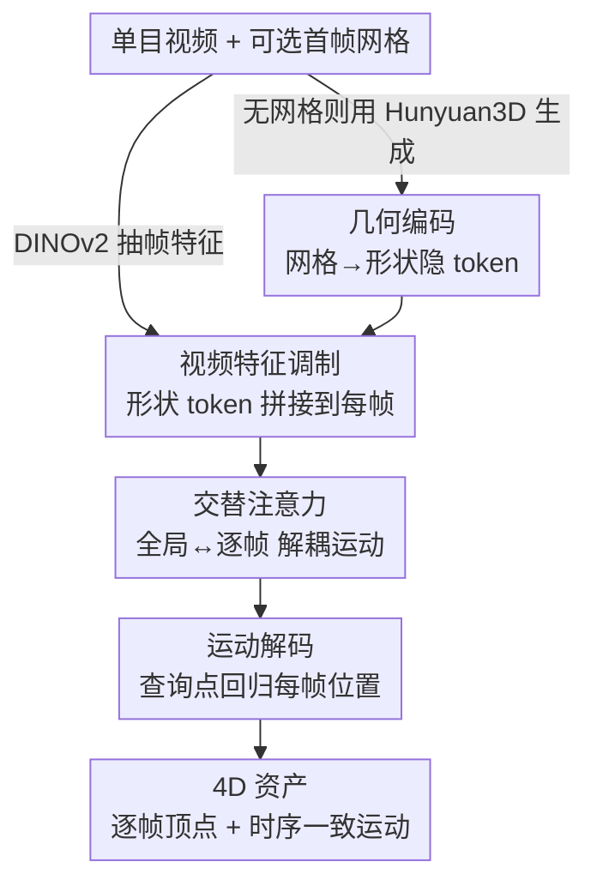

# Motion 3-to-4: 3D Motion Reconstruction for 4D Synthesis

**会议**: CVPR 2026  
**论文**: [CVF Open Access](https://openaccess.thecvf.com/content/CVPR2026/html/Chen_Motion_3-to-4_3D_Motion_Reconstruction_for_4D_Synthesis_CVPR_2026_paper.html)  
**领域**: 3D视觉 / 4D生成  
**关键词**: 4D合成, 运动重建, 前馈框架, 场景流, Transformer

## 一句话总结
Motion 3-to-4 把"从单目视频生成 4D 动态物体"这个病态问题拆成**静态 3D 形状生成 + 动态运动重建**两步：用一个（可生成的）静态参考网格做锚，前馈预测每帧顶点相对参考帧的运动流，借助 DINOv2 视频特征做"表面点-像素"对齐，在保证完整几何与时序一致的同时把推理压到秒级，并在自建的带真值几何的 Motion-80 基准上大幅超越 L4GM / GVFD / V2M4。

## 研究背景与动机

**领域现状**：4D 资产（同时刻画物体的静态形状与随时间的运动）在 VR、影视、机器人、仿真里需求很大。当前单目视频转 4D 主要有三条路：① 先用文本/图像生成多视角视频，再用动态 NeRF 或 3D Gaussian Splatting 重建（如 Consistent4D、SV4D、L4GM）；② 用预训练 3D 生成器逐帧出 mesh，再做 4D 对齐（如 V2M4、ShapeGen4D）；③ 用 VAE 建运动隐空间，把预测运动施加到初始几何上做前馈推理（如 GVFD、AnimateAnyMesh）。

**现有痛点**：第①类依赖逐实例长时间优化，且继承了 2D 生成模型的多视角不一致，几何容易漂；第②类的"逐帧生成→事后对齐"很慢，而且各帧独立条件生成会引入拓扑漂移（topology drift），出现闪烁、物理上不合理的运动；第③类虽然能秒级推理，但 VAE 要靠大规模多样数据才能学出结构良好的隐分布，而高质量 4D 数据极度稀缺，导致它学不动复杂运动、泛化差，几何也弱。

**核心矛盾**：4D 解空间巨大，但 4D 训练数据极少。直接端到端学"视频→4D"会被数据量卡死；而纯重建路线又是非生成的——无法对遮挡/未见区域"脑补"几何，常留下残缺表面。

**本文目标**：在数据稀缺的前提下，既要完整几何（含看不见的背面），又要时序一致的运动，还要前馈、能泛化、能处理任意长度序列。

**切入角度**：作者观察到 3D 形状生成已经被 Hunyuan3D 2.0 等强先验做得很好，没必要在 4D 里重学一遍形状。于是把"形状"和"运动"解耦——形状交给现成 3D 生成器，4D 问题就退化成一个**运动重建**问题。而运动重建本质上是"参考形状的表面点 ↔ 视频像素"的对齐，这种局部对应推理对数据量的依赖远小于学整个 4D 分布。

**核心 idea**：用一个静态参考网格当 canonical 锚，预测每帧顶点**相对参考帧的 3D 运动流（scene flow）**，把 4D 生成重写成"静态 3D 生成 + 运动重建"的组合，从而绕开稀缺 4D 数据的瓶颈。

## 方法详解

### 整体框架
输入是一段单目视频，外加一个可选的首帧网格资产（没有就用 Hunyuan3D 2.0 从首帧图像现生成一个）。输出是整段序列的 4D 资产：以参考网格为基准、每帧的完整顶点位置。整个 pipeline 分两大块——**运动隐学习**（把静态网格和视频帧编码成紧凑的逐帧运动表示）和**运动解码**（从参考网格上采样的查询点回归出每帧 3D 位置）。关键是全程前馈、不需要 V2M4 那种事后逐帧对齐。

### 关键设计

**1. 形状-运动解耦：把 4D 生成重写为静态生成 + 运动重建**

这是全文的根基，直接针对"4D 数据稀缺、解空间太大"这个核心矛盾。作者不学整个 4D 分布，而是把任务拆成两个更可解的子问题：静态形状交给现成的 3D 生成器（Hunyuan3D 2.0），运动则建模为每帧顶点**相对首帧参考形状的位移流**。形式上，先把参考网格 $M=\{V,F,T\}$ 上均匀采样的 $N$ 个表面点 $X_0=(x_i,n_i,c_i)_{i=1}^N$（坐标、法向、RGB）压成形状隐 $Z_{X_0}$，再让运动分支只负责把这组点"推"到每帧的位置。这样做的好处是：形状的高质量由强先验保证，运动分支可以做得很轻，对 4D 训练数据的规模要求大幅下降；同时因为运动是"相对参考"的流而非逐帧独立生成的 mesh，天然保住了表面对应关系，不会出现 V2M4 那种逐帧拓扑漂移。

**2. 形状隐编码 + 视频调制：用 DINOv2 把几何与视频语境融成逐帧运动表示**

光有静态形状不知道怎么动，得把视频里的运动线索注进来。形状侧借鉴 3DShape2VecSet，用一组固定长度 $K$ 的可学习查询 $A\in\mathbb{R}^{K\times C}$ 对采样点做 cross-attention 聚合，得到紧凑的 1D 形状隐：

$$Z_{X_0}=\texttt{CrossSelfAttn}(A,\ \texttt{PointEmb}(X_0))$$

其中 $\texttt{PointEmb}:\mathbb{R}^9\to\mathbb{R}^C$ 用 MLP 把 9 维点标签（坐标+法向+颜色）映成位置嵌入。视频侧用预训练 DINOv2 抽 patch 特征（语义特征利于跨帧鲁棒对应、强泛化），再注入时间嵌入让 token 知道帧序。关键的小设计是：把全局形状 token $Z_{X_0}$ **拼接到每一帧的 token 上**当作逐帧运动表示，这样模型对任意长度的视频都能处理（而不是把整段运动压成一个固定长度的 1D 隐序列）；再加一个 reference 位置 token 把参考帧和其余帧显式区分开，保证注意力能正确利用参考信息做传播。

**3. 交替注意力（Alternating-Attention）：在"任意长度"下分离逐帧运动**

把形状 token 拼到每帧后，需要既让各帧共享几何结构、又能区分各自的运动。作者借鉴 VGGT 用交替注意力：设第 $t$ 帧初始聚合隐为 $Z_t^{(0)}\in\mathbb{R}^{(K+P)\times C}$，每个 block 先做一次跨所有帧的全局注意力、再做一次帧内注意力：

$$[Z_0^{(\ell-\frac12)},\dots]=\texttt{GlobalAttn}(Z_0^{(\ell-1)},\dots),\quad Z_t^{(\ell)}=\texttt{FrameAttn}(Z_t^{(\ell-\frac12)})$$

跑 $L$ 个 block 后取每帧前 $K$ 个 token 作为该帧的运动表示。全局步让所有帧对齐到同一几何/语境，逐帧步保留各帧专属的运动差异——这种全局↔逐帧交替正是支持"任意帧数输入"且保持时序一致的关键，比把整段运动塞进固定长度隐序列更灵活。

**4. 相对参考的运动流解码：以表面查询点回归每帧位置，保住长序列一致性**

解码阶段不像 ShapeGen4D 逐帧独立预测完整形状、也不像 GVFD 预测逐帧属性偏移，而是预测**相对参考形状的逐帧运动流**。具体从参考网格上重采 $M$ 个点 $\hat P_0=\{(x_i,n_i,c_i)\}_{i=1}^M$ 当查询（用同一个 PointEmb 嵌入），cross-attention 解码器结合该帧运动隐 $Z_t$ 独立预测每帧位置：

$$\hat X_t=\texttt{MotionDecoder}(\hat X_0,\ Z_t)$$

解出的点特征再过一层共享全连接得到最终 3D 坐标。"相对参考流"的好处是表面点对应关系被显式保留，长序列上不会累积漂移；而且查询点可以在任意空间位置、任意时刻采样，使整个框架完全前馈、空间/时间都可任意 query。

### 损失函数 / 训练策略
训练用最直接的监督——预测点位置与真值点位置之间的 MSE：

$$\mathcal{L}=\frac{1}{M\times T}\sum_{i=1}^{M}\sum_{t=1}^{T}\|\hat X_t^i-X_t^i\|_2^2$$

训练时密集采样点（dense supervision），鼓励模型学到细粒度的表面对应、保证整片 mesh 上运动连贯。实现上：每个 mesh 采 $N=4096$ 点编码成 $K=64$ 形状隐，过 $L=16$ 个 transformer block，$M=4096$ 个密采真值点；12 帧序列、batch 256、学习率 $4\times10^{-4}$，8 张 H100 训 6 万步约 1.5 天。数据上从 Objaverse / Objaverse-XL 约 5 万模型里筛出 1.6 万个（剔除立方体/球这类简单几何，用 ICP 剔除运动平凡的序列），归一化到 $[-0.5,0.5]$ 包围盒，256×256 固定视角渲染。

## 实验关键数据

### 主实验
在自建 Motion-80 上同时评几何（CD↓、F-Score↑）和外观（LPIPS↓、CLIP↑、FVD↓、DreamSim↓），分短序列和长序列（>128 帧）。"Ours w/m" 指用首帧真值静态网格初始化。

| 数据集/设置 | 指标 | L4GM | GVFD | V2M4 | Ours | Ours w/m |
|------|------|------|------|------|------|------|
| Motion-80 短序列 | CD ↓ | 0.3561 | 0.1970 | 0.3437 | **0.1113** | 0.0437 |
| Motion-80 短序列 | F-Score ↑ | 0.1269 | 0.2608 | 0.2318 | **0.3171** | 0.6774 |
| Motion-80 短序列 | DreamSim ↓ | 0.1941 | 0.2147 | 0.1974 | **0.1682** | 0.0614 |
| Motion-80 长序列 | CD ↓ | 0.3648 | OOM | 0.3719 | **0.1495** | 0.0929 |
| Motion-80 长序列 | F-Score ↑ | 0.0997 | OOM | 0.1652 | **0.2347** | 0.4322 |

几何上 Ours 在 CD/F-Score 上全面领先：L4GM 因 3DGS 表示不约束点落在表面、出现漂浮伪影；GVFD 能出合理点云但运动重建不准；V2M4 逐帧 mesh 拼接有时序不一致、闪烁。长序列里 GVFD 直接 OOM，而本文凭"相对参考流"保持稳定。

在 Consistent4D 基准（无真值 mes，只评渲染指标）上同样领先：

| 方法 | LPIPS ↓ | CLIP ↑ | FVD ↓ | DreamSim ↓ |
|------|---------|--------|-------|------------|
| L4GM | 0.1468 | 0.8457 | 1207.79 | 0.1830 |
| GVFD | 0.1789 | 0.8278 | 1340.78 | 0.2009 |
| V2M4 | 0.1611 | 0.8482 | 1471.58 | 0.1832 |
| **Ours** | **0.1455** | **0.8609** | 1260.06 | **0.1691** |

### 消融 / 关键对照
论文主表里用 "Ours" vs "Ours w/m" 充当核心对照——区别在于运动分支吃的是生成网格还是首帧真值网格：

| 配置 | CD ↓(短) | F-Score ↑(短) | 说明 |
|------|---------|--------------|------|
| Ours | 0.1113 | 0.3171 | 形状由 Hunyuan3D 生成 |
| Ours w/m | 0.0437 | 0.6774 | 用首帧真值静态网格 |

把生成网格换成真值网格后 CD 从 0.1113 降到 0.0437、F-Score 从 0.3171 飙到 0.6774，说明运动重建分支本身极准——瓶颈主要在静态生成质量；这也佐证了"形状-运动解耦"的合理性：只要给个好形状，运动分支就能把它驱动得很好（这正是 Motion Transfer 能成立的原因）。

### 关键发现
- 解耦设计带来的最大收益是**几何精度 + 长序列鲁棒**：CD 相比次优方法（GVFD 0.1970）几乎腰斩到 0.1113，且长序列不 OOM、不漂移。
- 推理速度 6.5 FPS（512 帧均摊），远快于 V2M4（0.1）等优化类方法，仅次于 L4GM（7.8）但几何精度高得多；且是表 1 里唯一同时支持前馈+完整 mesh+网格重定向的方法。
- 涌现的**运动迁移**能力：虽只用配对视频-3D 训练，模型能把龙视频的颈/身/腿运动迁移到鸡、机器龙等不同形状的 mesh 上——因为运动被建成"表面点-像素对齐"而非绑死到特定形状。
- 强泛化到 in-the-wild：配 BiRefNet 去背景 + Hunyuan2.0 出首帧形状 + DINO 强视觉特征，能处理真实视频和生成动画。

## 亮点与洞察
- **问题重写比硬学更聪明**：不去端到端学稀缺的 4D 分布，而是把 4D = 强 3D 先验（现成）+ 轻量运动重建，把"数据需求"从运动分支转移走，是应对数据稀缺最优雅的一招。
- **"相对参考的 scene flow"是时序一致性的关键**：逐帧独立生成 mesh 必然漂移，而预测相对首帧的顶点流天然保住表面对应——这个表示选择比堆 loss 更治本。
- **全局↔逐帧交替注意力解锁任意长度**：把形状 token 拼到每帧 + 交替注意力，使同一模型不必固定序列长度，长序列上反而是它唯一不崩的。
- **副产品很值钱**：运动与形状解耦后，免费得到把"艺术家做的静态 mesh"动画化、以及跨物体运动迁移的能力——这对工业管线（绑定/动画）很有迁移价值。

## 局限与展望
- 作者承认两个失败模式：① 几何编码器只在稠密点云上操作、不显式建 mesh 拓扑，当物体不同部件在参考 mesh 里没清晰分开时会出现**顶点粘连**（vertex sticking）；② 全程依赖首帧 mesh 当参考几何，难以适应后续帧出现的**拓扑变化**（如分裂/新增结构），会直接失败。
- 静态生成质量是上限：从 "Ours" 到 "Ours w/m" 的巨大差距说明，端到端表现被前置 3D 生成器卡着——换更强生成器还能涨，但也意味着生成器的偏差会传导进 4D。
- 数据仍偏合成：训练主要来自 Objaverse 渲染，in-the-wild 靠去背景+生成网格救场，对复杂真实场景（多物体、强遮挡、非刚体细节）的鲁棒性待考。
- 改进方向：显式引入拓扑/网格连通性建模缓解粘连；让参考几何随时间可更新以容忍拓扑变化；把运动分支扩到多物体/铰接体场景。

## 相关工作与启发
- **vs V2M4（3D 生成 + 4D 对齐）**：V2M4 逐帧独立生成 mesh 再事后对齐，慢且拓扑漂移、时序闪烁；本文不做逐帧生成、只预测相对参考的运动流，前馈一步到位、保住对应关系，CD 从 0.34 降到 0.11。
- **vs GVFD（3D 生成 + 运动生成）**：GVFD 用 VAE 学全局运动隐分布、靠渲染监督，受 4D 数据稀缺限制，几何弱、长序列 OOM；本文把运动当"表面点-像素对齐"的重建问题，对数据需求小、长序列稳。
- **vs L4GM（多视角生成 + 3D 重建）**：L4GM 前馈回归 3DGS，但点不约束在表面、有漂浮/重影，从非正交视角看伪影明显；本文用显式 mesh + scene flow，几何精度和跨视角一致性都更好。
- **启发**：当目标分布数据稀缺时，先找一个"已被别人用海量数据解好"的子问题（这里是 3D 形状生成）外包出去，把自己要学的部分压成一个数据需求更低的对齐/重建问题——这种"解耦 + 复用强先验"的范式可迁移到很多 X-to-4D / 跨模态生成任务。

## 评分
- 新颖性: ⭐⭐⭐⭐ 解耦+相对参考 scene flow 的重写很巧，运动迁移是漂亮的涌现副产品；单看组件多为已有模块的组合。
- 实验充分度: ⭐⭐⭐⭐ 自建带真值几何的 Motion-80 + Consistent4D 双基准、几何外观双维度、长短序列分开评；显式消融偏少（主要靠 Ours vs w/m）。
- 写作质量: ⭐⭐⭐⭐ 动机链条清晰、方法解释到位、表 1 的方法谱系对比一目了然。
- 价值: ⭐⭐⭐⭐ 秒级前馈 + 完整几何 + 网格重定向，对 VR/影视/仿真的 4D 资产生产管线实用价值高。

<!-- RELATED:START -->

## 相关论文

- [\[CVPR 2026\] MoVieS: Motion-Aware 4D Dynamic View Synthesis in One Second](movies_motion-aware_4d_dynamic_view_synthesis_in_one_second.md)
- [\[CVPR 2026\] MoRe: Motion-aware Feed-forward 4D Reconstruction Transformer](more_motion-aware_feed-forward_4d_reconstruction_transformer.md)
- [\[CVPR 2026\] 4DEquine: Disentangling Motion and Appearance for 4D Equine Reconstruction from Monocular Video](4dequine_disentangling_motion_and_appearance_for_4d_equine_reconstruction_from_m.md)
- [\[CVPR 2026\] Tracking-Guided 4D Generation: Foundation-Tracker Motion Priors for 3D Model Animation](tracking-guided_4d_generation_foundation-tracker_motion_priors_for_3d_model_anim.md)
- [\[CVPR 2026\] DuoMo: Dual Motion Diffusion for World-Space Human Reconstruction](duomo_dual_motion_diffusion_for_world-space_human_reconstruction.md)

<!-- RELATED:END -->
