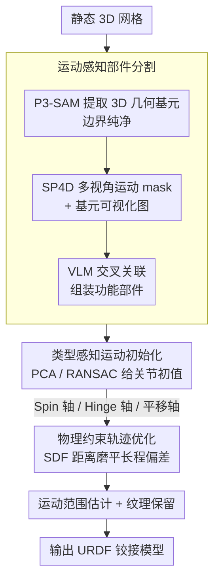

# MotionAnymesh: Physics-Grounded Articulation for Simulation-Ready Digital Twins

**会议**: CVPR 2026  
**arXiv**: [2603.12936](https://arxiv.org/abs/2603.12936)  
**代码**: 无  
**领域**: 3D视觉  
**关键词**: 铰接物体, 数字孪生, URDF, 物理仿真, VLM

## 一句话总结

提出MotionAnymesh，一个零样本自动框架，通过运动感知分割（SP4D先验+VLM推理）和几何-物理联合优化关节估计，将静态3D网格转化为无碰撞的仿真就绪铰接数字孪生，在PartNet-Mobility和Objaverse上物理可执行性达87%。

## 研究背景与动机

将静态3D网格转化为可交互的铰接资产对具身AI和机器人仿真至关重要。现有零样本方案存在两个根本缺陷：(1) 依赖2D-to-3D mask lifting的方法破坏了几何连续性，导致部件边界锯齿化且无法处理自遮挡内部结构；(2) 直接使用VLM进行开放词表部件分解时，模型依赖语义先验而非物理约束，面对缺少显式语义名称的复杂机械部件时频繁产生"运动学幻觉"。更关键的是，现有关节参数估计方法缺乏严格的空间物理约束，即使预测的关节轴看似合理，微小的几何偏差在长程驱动时也会剧烈累积，导致严重的网格穿透。

## 方法详解

### 整体框架

这篇论文要解决的是：怎么把一个静态 3D 网格零样本地变成可交互、能在仿真器里跑且不穿模的铰接数字孪生（simulation-ready digital twin）。难点在两头——分割要切得几何干净、又要切对运动部件；关节参数要估得准、还得保证长程驱动时不累积出碰撞。

整条流水线分三阶段：先做运动感知部件分割，从 3D 原生几何基元出发、用 SP4D 运动先验引导 VLM 把碎片组装成功能部件；再做关节估计与优化，按关节类型几何初始化、再用物理约束优化轨迹保证无碰撞；最后确定运动范围、保留纹理，输出标准 URDF 模型。

### 关键设计

**1. 运动感知部件分割：用 SP4D 运动先验把 VLM 的语义推理锚到物理现实**

直接用 VLM 做开放词表部件分解时，模型只能靠语义先验猜，遇到没有明确语义名的机械部件就频繁"运动学幻觉"（过分割/误合并）。本文先用 P3-SAM 在 3D 原生空间提取细粒度几何基元 $\mathcal{P} = \{p_1, \ldots, p_m\}$ 保证边界纯净，再引入 SP4D 生成的多视角运动分割 mask 作为显式运动先验，和渲染的基元可视化图一起喂给 VLM。VLM 像照着"物理装配手册"一样，把几何基元和运动区域交叉关联，将碎片化基元组装成运动学一致的功能部件 $K_i = \bigcup_{j \in \mathcal{I}_i} p_j$。运动先验把"哪些碎片会一起动"这件事变成可观测的物理证据，幻觉因此大幅减少。

**2. 类型感知运动初始化：先判关节类型，再用对应几何法给一个好的初值**

关节参数优化是非凸的，没有好初值容易陷坏。本文按关节类型分别用几何方法初始化：

- **旋转关节-Spin 类型**（如轮子、旋钮）：对接触点云 $S_{contact}$ 做 PCA，最小特征值对应特征向量作为旋转轴 $\mathbf{v}_{init} = \mathbf{n}$；把接触点投影到垂直于轴的 2D 平面，用 RANSAC 拟合 2D 圆确定轴心 $q_{init} = \bar{\mathbf{x}} + x_c \mathbf{b}_1 + y_c \mathbf{b}_2$
- **旋转关节-Hinge 类型**（如门铰链）：接触区域沿旋转轴纵向分布，PCA 最大特征值方向即为旋转轴
- **平移关节**（如抽屉）：对整个部件做 PCA 得 3 个候选轴，通过归一化双罚验证综合评估碰撞罚项 $\mathcal{L}_{collide}$ 和脱轨罚项 $\mathcal{L}_{derail}$ 选最优滑动方向 $\mathcal{C}(\mathbf{v}) = \mathcal{L}_{collide}(\mathbf{v}) + \omega \cdot \mathcal{L}_{derail}(\mathbf{v})$

双罚验证的物理直觉很直接——正确的滑动轴应该既不让部件穿进基座、也不让它脱出轨道。

**3. 物理约束轨迹优化：用 SDF 把初值的微小偏差在整段运动里磨平**

初始化的关节参数即使看起来合理，微小几何偏差在长程驱动下也会剧烈累积、最终穿模。本文沿运动范围采样一系列驱动角度 $\phi$，对每个接触点统一最小化它到静态基座 SDF 的距离

$$\mathcal{L}_{opt}(\mathbf{v}, \mathbf{q}) = \sum_{\phi \in \Phi}\sum_{\mathbf{x} \in S_{contact}}\|\mathcal{D}_{SDF}(\mathcal{T}(\mathbf{x}; \mathbf{v}, \mathbf{q}, \phi), \mathcal{M}_{static})\|_2^2$$

用 Levenberg-Marquardt 优化关节参数。约束的是"运动部件在整个运动范围内与静态基座保持均匀的最小间距"，因此优化后能保证物理有效、无碰撞的运动学，而不只是某一帧看着对。

### 损失函数 / 训练策略

- 分割阶段：无需训练，P3-SAM + SP4D + GPT-4o 零样本推理
- 关节估计：两阶段——PCA/RANSAC 几何初始化 → SDF + Nelder-Mead 非线性优化
- 运动范围估计：前向仿真碰撞检测确定旋转极限；平移关节用接触面积归零检测脱离极限

## 实验关键数据

### 主实验

| 方法 | mIoU↑ | Count Acc↑ | Type Err↓ | Axis Err↓ | Pivot Err↓ | 物理可执行性↑ |
|------|-------|-----------|-----------|-----------|-----------|------------|
| PARIS | 0.17 | 0.23 | 0.67 | 1.56 | 1.14 | 11% |
| Articulate-Anything | 0.47 | 0.61 | 0.21 | 0.86 | 0.64 | 46% |
| Articulate-AnyMesh | 0.59 | 0.74 | 0.35 | 0.64 | 0.44 | 35% |
| **MotionAnymesh** | **0.86** | **0.92** | **0.08** | **0.12** | **0.10** | **87%** |

### 消融实验

| 配置 | 关键指标 | 说明 |
|------|---------|------|
| w/o SP4D（纯VLM语义） | mIoU 0.68, Count Acc 0.81 | 运动学幻觉严重，过分割/误合并 |
| SP4D-Guided (Ours) | mIoU 0.86, Count Acc 0.92 | SP4D先验有效消除幻觉 |
| w/o Opt.（仅初始化） | Axis Err 0.23, 可执行性 65% | 微偏差在长程运动中急剧累积 |
| Physics-Constrained Opt. | Axis Err 0.12, 可执行性 87% | 优化后碰撞消除 |

### 关键发现

- 物理可执行性是最关键指标——仅初始化的静态指标看似合理，但动态仿真中65%→87%的巨大差距揭示了物理约束优化的必要性
- SP4D运动先验比纯VLM语义推理提升了mIoU 0.18、Count Acc 0.11
- 现有检索式方法在开放世界新几何上灾难性失败

## 亮点与洞察

- 将"感知"与"驱动"解耦的设计思路清晰：先3D原生分割保证几何纯净，再用运动先验引导语义组装
- 双罚轨迹验证机制（碰撞+脱轨）的物理直觉非常强——正确的滑动轴应该既不穿透也不脱轨
- 87%物理可执行性几乎是最强基线（46%）的两倍，端到端Real-to-Sim-to-Real机器人操作验证了实用性

## 局限与展望

- 依赖GPT-4o作为VLM核心，推理成本较高，单个复杂物体可能需要多轮VLM调用
- SP4D从单张图像推断运动先验，对极度复杂/嵌套结构（如多级齿轮箱）可能不足
- 未处理柔性关节（如弹簧、橡胶连接）和连续运动链
- 物理极限估计依赖碰撞检测的离散步长，精度受步长粒度限制
- 无法处理带有内部弹簧或阻尼的关节类型
- 对称性物体（如双开门）的左右部件可能被错误地合并为单一运动部件

## 相关工作与启发

- **vs Articulate-Anything**：检索式方法依赖预定义CAD库，在开放世界新几何上灾难性失败；本文3D原生零样本方案泛化性强得多
- **vs Articulate-AnyMesh**：纯VLM语义推理导致运动学幻觉，本文用SP4D运动先验将推理锚定在物理现实中
- **vs PARIS**：需要多状态观测（打开/关闭），本文从单一静态mesh出发，输入要求更低
- SP4D运动先验为VLM视觉推理提供"物理锚点"的思路可推广到其他需要物理感知的VLM应用场景
- SDF-based轨迹优化范式可用于其他需要保证物理合规性的3D生成任务（如家具组装、机械设计验证）
- P3-SAM的3D原生分割 vs 2D-to-3D lifting的对比有力证明了直接在3D空间操作的必要性
- 平移关节的双罚验证机制（碰撞+脱轨）融合了运动学约束和几何约束，设计直觉值得借鉴
- Hunyuan3D集成的可选重纹理模块展示了框架的良好可扩展性
- 端到端Real-to-Sim-to-Real验证（单张照片→URDF→策略学习→物理机器人部署）是最有说服力的实验设计

## 评分

- 新颖性：★★★★☆ SP4D+VLM组合+物理约束优化的完整管线，"物理接地"理念有创新
- 技术深度：★★★★★ 类型感知初始化（PCA/RANSAC）+SDF轨迹优化设计精细，物理直觉强
- 实验完整性：★★★★★ 三类数据源（PartNet-Mobility/Objaverse/生成资产）+Real2Sim2Real验证
- 实用价值：★★★★★ 直接输出URDF，87%物理可执行性，具身AI/机器人仿真落地价值极高

<!-- RELATED:START -->

## 相关论文

- [\[CVPR 2026\] Particulate: Feed-Forward 3D Object Articulation](particulate_feed-forward_3d_object_articulation.md)
- [\[CVPR 2026\] PhysHead: Simulation-Ready Gaussian Head Avatars](physhead_simulation-ready_gaussian_head_avatars.md)
- [\[CVPR 2026\] ReWeaver: Towards Simulation-Ready and Topology-Accurate Garment Reconstruction](reweaver_towards_simulation-ready_and_topology-accurate_garment_reconstruction.md)
- [\[CVPR 2026\] Wanderland: Geometrically Grounded Simulation for Open-World Embodied AI](wanderland_geometrically_grounded_simulation_for_open-world_embodied_ai.md)
- [\[CVPR 2026\] ExtrinSplat: Decoupling Geometry and Semantics for Open-Vocabulary Understanding in 3D Gaussian Splatting](extrinsplat_decoupling_geometry_and_semantics_for_open-vocabulary_understanding_.md)

<!-- RELATED:END -->
