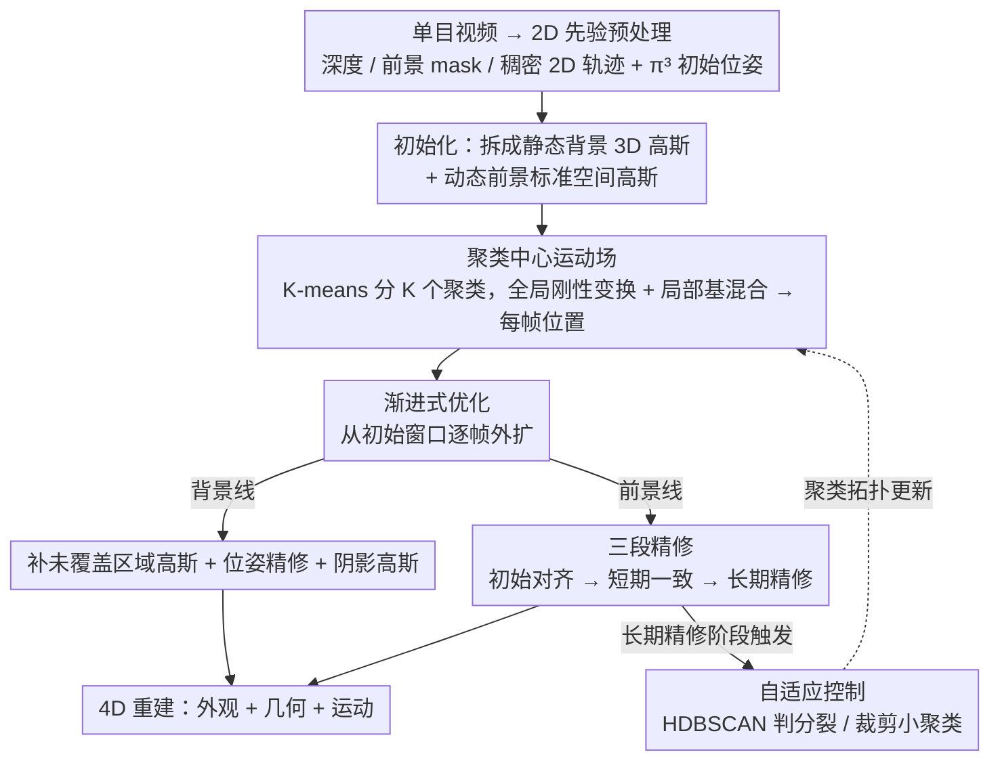

# MotionScale: Reconstructing Appearance, Geometry, and Motion of Dynamic Scenes with Scalable 4D Gaussian Splatting

**会议**: CVPR 2026  
**arXiv**: [2603.29296](https://arxiv.org/abs/2603.29296)  
**代码**: [项目主页](https://hrzhou2.github.io/motion-scale-web/)  
**领域**: 3D视觉  
**关键词**: 4D重建, 高斯泼溅, 动态场景, 运动场, 单目视频

## 一句话总结

提出 MotionScale，一个可扩展的 4D 高斯泼溅框架，通过基于聚类的自适应运动场和渐进式优化策略，从单目视频中高保真重建大规模动态场景的外观、几何和运动，在 DyCheck 上 PSNR 达到 17.98，3D 跟踪 EPE 降至 0.070，显著超越现有方法。

## 研究背景与动机

1. **领域现状**：动态4D场景重建是计算机视觉的核心挑战。近年来，NeRF 和 3DGS 在静态或轻度动态场景中取得了很好的效果，特别是多视角设置下。最近的工作开始结合 2D 几何/运动先验（如深度估计、点跟踪）与 4DGS 来从单目视频重建场景。

2. **现有痛点**：现有方法虽然能在已观测视点产生合理的视图合成，但在几何精度和长序列时间一致性上存在明显缺陷。具体表现为几何畸变、运动轨迹不连贯、在大尺度场景和长视频中难以扩展。

3. **核心矛盾**：作者识别出两个关键瓶颈——(1) **欠约束的几何**：监督信号主要依赖视角依赖的外观信号，缺乏强制3D结构一致性的能力；(2) **累积的时间漂移**：运动模型依赖缺乏3D感知的2D跟踪先验，长序列中误差不可避免地累积，导致几何崩塌和运动轨迹不一致。

4. **本文目标** 如何设计一个既够表达力又可扩展的运动表示，并配合稳定的优化策略，实现从单目视频对大规模动态场景的高保真4D重建。

5. **切入角度**：作者观察到全局变形场或固定容量架构难以处理多样化的局部运动，提出用聚类驱动的运动场自适应扩展模型容量。

6. **核心 idea**：通过聚类中心的基变换来参数化运动场，并配合自适应分裂/裁剪机制和前景-背景解耦的渐进式优化，实现可扩展的4D高斯泼溅。

## 方法详解

### 整体框架

这篇论文要解决的是从一段无标定单目视频里同时重建出大尺度动态场景的外观、几何和运动，而且要能随视频变长、场景变复杂而扩展。整条流程是这样转的：先用现成的 2D 模型把视频拆成单目深度、前景 mask 和稠密 2D 点轨迹，再用 $\pi^3$ 估出初始相机位姿，作为后续优化的几何骨架。场景被拆成静态背景和动态前景两部分——背景是普通的 3D 高斯，动态前景则是一组定义在标准空间的 3D 高斯，叠加一个可扩展的"聚类中心运动场"把它们推到每一帧的位置上。优化不在整段视频上一次性做，而是从一个初始时间窗口起步，把基础表示调好后再逐帧往后扩，边扩边让运动场的聚类自适应地分裂、裁剪，使得模型容量始终匹配当前看到的运动复杂度。

### 关键设计

**1. 聚类中心运动场：用"聚类粒度"换取可扩展的非刚性表达力**

动态场景的麻烦在于不同区域的运动差别很大——一个全局 MLP 或固定数量的时间基函数，要么表达力不够、要么算不动。MotionScale 的做法是把动态高斯划成 $K$ 个互不相交的聚类 $\{\mathcal{C}_k\}$，每个聚类自带一个全局刚性变换 $\mathbf{G}_k^t \in SE(3)$ 和 $B$ 个细粒度基变换 $\mathcal{B}_k^t$。某个高斯 $i$ 在时刻 $t$ 的位置，先由它的可学习系数向量 $\mathbf{w}_i$ 把所属聚类的若干基变换混合成一个局部变换，再和聚类的全局变换复合得到：

$$\boldsymbol{\mu}_i^t = \mathbf{R}_{k,g}^t(\mathbf{R}_{i,\ell}^t \boldsymbol{\mu}_i^0 + \mathbf{t}_{i,\ell}^t) + \mathbf{t}_{k,g}^t$$

关键是每个高斯只挂在单个聚类上，所以单点的计算量几乎恒定；而"局部基的混合"又留出了表达非刚性变形的余地。这就把表达力和算力解耦了——想表达更复杂的运动，不是把每个高斯的模型做大，而是让聚类变多。

**2. 自适应控制：当一个聚类内部运动开始"分家"，就把它拆开**

聚类划分一开始是粗糙的，长序列里某个聚类内部可能逐渐出现明显的非刚性差异——这说明当前粒度不够细。自适应控制借了 3DGS 致密化的思路，在长期优化阶段对每个聚类做体检：把聚类内高斯在传播窗口里的 3D 轨迹拿出来当特征描述子，先用 HDBSCAN 找密度子聚类，再用凝聚聚类把它分成两个候选组，若两组质心距离超过阈值就执行分裂。分裂时把原聚类的运动参数原样复制给两个新聚类，避免突然引入未优化的参数破坏稳定性；与此同时，过小的聚类会被裁掉以保持表示紧凑。整套机制让聚类数量随场景运动的实际复杂度增减，而不是预先拍死一个 $K$。

**3. 渐进式优化：从局部到全局、前景背景分头推进，压住累积漂移**

直接在整段视频上联合优化会同时撞上两个问题——前景背景互相干扰、长序列误差不断累积导致几何崩塌。MotionScale 把优化拆成两条解耦的传播线。背景这条线负责"补地图"：检测新帧里尚未被覆盖的区域，从深度图采样新高斯填进去，同时联合微调相机位姿做亚像素级精修，并用一组专门的"阴影高斯"建模运动物体投下的瞬变阴影（这组高斯耦合运动场跟着物体走、只受光度和分割监督，详见下方损失/训练策略；消融里去掉它 PSNR 从 17.98 掉到 16.26，是影响最大的一项）。前景这条线则用三段递进的精修来建立时间一致性——先是**初始对齐**，只用单向跟踪损失（避免新帧的噪声反过来污染已优化好的帧）；再到**短期一致性**，换成双向跟踪损失强化局部时序的连贯；最后是**长期精修**，在全序列里采样帧对来对冲累积漂移。这种"先保守后激进、先局部后全局"的顺序，正是它能在长视频上不漂的关键。

### 损失函数 / 训练策略

- **跟踪损失** $L_{\text{track}}$：最小化渲染 2D 轨迹与 CoTracker3 先验之间的差异
- **深度一致性损失** $L_{\text{depth}}$：确保渲染深度与单目深度先验在跟踪位置的一致性
- **光度损失 (RGB)**：标准的图像重建损失
- **ARAP 正则化**：as-rigid-as-possible 约束保持运动局部刚性
- **Shadow Gaussians**：引入专门的"阴影高斯"来建模运动物体投射的瞬变阴影，仅用光度损失和分割约束优化，不施加几何和运动监督

## 实验关键数据

### 主实验

| 数据集 | 指标 | MotionScale | Shape of Motion | GFlow | 4D-Fly |
|--------|------|-------------|-----------------|-------|--------|
| DyCheck | PSNR↑ | **17.98** | 16.72 | - | 17.03 |
| DyCheck | SSIM↑ | **0.70** | 0.63 | - | 0.60 |
| DyCheck | LPIPS↓ | **0.40** | 0.45 | - | 0.37 |
| NVIDIA | PSNR↑ | **26.75** | 23.37 | - | 22.52 |
| NVIDIA | SSIM↑ | **0.78** | 0.75 | - | 0.69 |

| 方法 | EPE↓ | δ³ᴅ.05↑ | δ³ᴅ.10↑ | AJ↑ | δ_avg↑ | OA↑ |
|------|------|---------|---------|-----|--------|-----|
| MotionScale | **0.070** | **47.0** | **76.4** | **37.7** | **50.6** | **87.4** |
| Shape of Motion | 0.082 | 43.0 | 73.3 | 34.4 | 47.0 | 86.6 |
| SpatialTracker | 0.125 | 37.7 | 63.9 | 24.9 | 36.9 | 73.5 |

### 消融实验

| 配置 | PSNR↑ | SSIM↑ | LPIPS↓ | AJ↑ | δ_avg↑ | OA↑ |
|------|-------|-------|--------|-----|--------|-----|
| Full Model | 17.98 | 0.70 | 0.40 | 37.7 | 50.6 | 87.4 |
| Global Bases | 16.70 | 0.63 | 0.45 | 34.2 | 46.6 | 86.1 |
| w/o Adaptive Control | 17.21 | 0.67 | 0.42 | 34.9 | 47.0 | 86.6 |
| w/o Pose Ref. | 17.45 | 0.67 | 0.41 | - | - | - |
| w/o Shadow | 16.26 | 0.60 | 0.50 | - | - | - |
| w/o FG Propagation | 16.97 | 0.64 | 0.42 | 34.4 | 46.9 | 86.4 |

### 关键发现

- **聚类运动场 vs 全局基**：聚类设计比使用全局共享基的 baseline（类似 Shape of Motion）PSNR 提升 1.28，AJ 提升 3.5，证明局部化运动基对细粒度非刚性变形至关重要
- **自适应控制**的移除导致 PSNR 下降 0.77，AJ 下降 2.8，表明动态调整聚类拓扑对维持运动精度非常关键
- **Shadow Gaussians** 的移除影响最大（PSNR 从 17.98 降到 16.26），且缺少阴影表示会导致前景高斯向阴影区域过度扩展，产生几何膨胀和鬼影伪影
- **位姿精修**虽然定量提升不算大，但定性可视化表明它对保持尖锐纹理非常重要

## 亮点与洞察

- **聚类化运动场的可扩展性设计**非常巧妙：每个高斯只受一个聚类影响，计算成本几乎恒定，但通过分裂机制可以无限扩展容量。这种"固定计算+动态容量"的设计思路可以迁移到其他需要可扩展表示的任务
- **前景传播的三阶段精修**是一个工程上非常重要的策略：先单向对齐（防止新帧噪声污染已有好结果），再双向一致性，最后全局精修。这种从保守到激进的优化顺序值得在其他渐进式优化场景中借鉴
- **Shadow Gaussians** 的引入解决了一个常被忽视但很重要的问题：动态物体投射的阴影。将它独立建模而非让前景高斯来解释阴影，既简化了问题又避免了几何伪影

## 局限与展望

- 依赖于预训练的 2D 先验模型（深度、分割、跟踪），这些模型的失败模式会传播到最终重建
- 自适应聚类分裂依赖 HDBSCAN + 距离阈值，可能在极端运动模式下不够鲁棒
- 仅在有限的数据集（DAVIS、DyCheck、NVIDIA）上验证，缺乏更大规模的室外场景评估
- K-means 初始化的聚类划分对最终结果的影响未充分探讨

## 相关工作与启发

- **vs Shape of Motion**：SoM 使用全局共享的运动基函数，本文使用聚类局部化的运动基并支持自适应扩展。本文在所有指标上显著优于 SoM，特别是在长序列和大运动场景
- **vs GFlow**：GFlow 在大位移下容易产生"云状"伪影和运动不连续，本文通过渐进式优化和聚类约束保持了几何清晰度和运动连续性
- **vs 4D-Fly**：两者 PSNR 接近但本文在 SSIM 和 3D 跟踪上有明显优势，说明聚类运动场在几何一致性方面的优越性

## 评分

- 新颖性: ⭐⭐⭐⭐ 聚类化运动场+自适应分裂的思路有明确的创新点，但整体仍在 4DGS 框架内演进
- 实验充分度: ⭐⭐⭐⭐⭐ 三个数据集全面评估，NVS + 3D/2D跟踪多维度指标，消融实验详尽
- 写作质量: ⭐⭐⭐⭐ 方法描述清晰，pipeline图直观，但公式密度较高
- 价值: ⭐⭐⭐⭐ 在单目4D重建方向推进了SOTA，可扩展运动场的设计有实际应用价值

<!-- RELATED:START -->

## 相关论文

- [\[CVPR 2026\] MoRGS: Efficient Per-Gaussian Motion Reasoning for Streamable Dynamic 3D Scenes](morgs_efficient_per-gaussian_motion_reasoning_for_streamable_dynamic_3d_scenes.md)
- [\[CVPR 2026\] Velox: Learning Representations of 4D Geometry and Appearance](velox_learning_representations_of_4d_geometry_and_appearance.md)
- [\[CVPR 2026\] 4D Primitive-Mâché: Glueing Primitives for Persistent 4D Scene Reconstruction](4d_primitive-mache_glueing_primitives_for_persistent_4d_scene_reconstruction.md)
- [\[CVPR 2026\] Efficiently Reconstructing Dynamic Scenes One D4RT at a Time](efficiently_reconstructing_dynamic_scenes_one_d4rt_at_a_time.md)
- [\[CVPR 2026\] MoRe: Motion-aware Feed-forward 4D Reconstruction Transformer](more_motion-aware_feed-forward_4d_reconstruction_transformer.md)

<!-- RELATED:END -->
