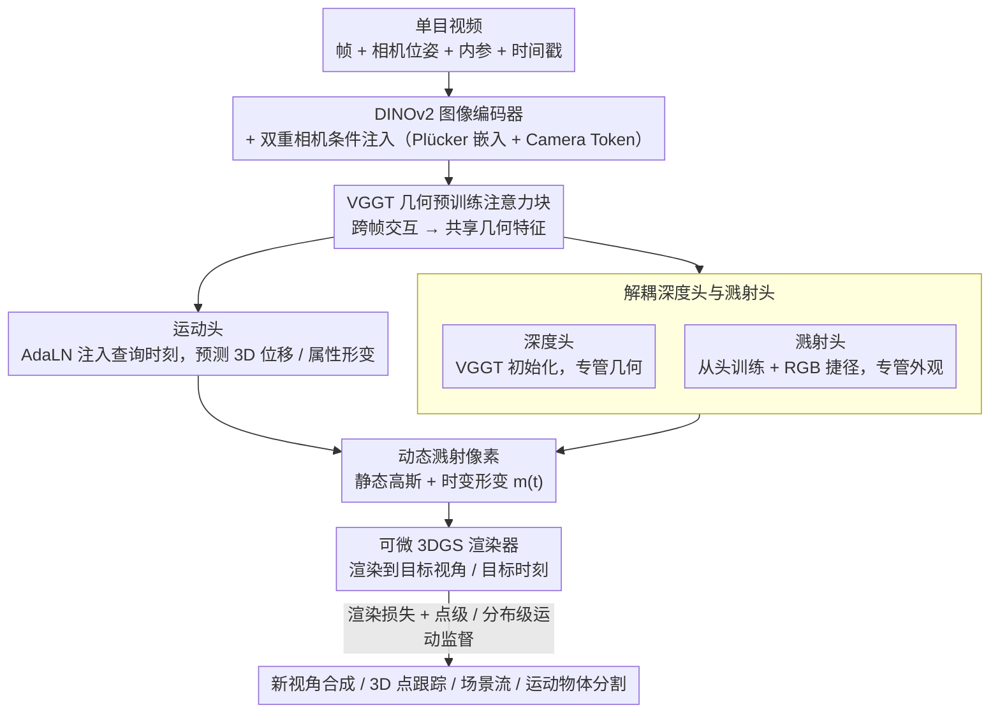

# MoVieS: Motion-Aware 4D Dynamic View Synthesis in One Second

**会议**: CVPR 2026  
**arXiv**: [2507.10065](https://arxiv.org/abs/2507.10065)  
**代码**: [有](https://chenguolin.github.io/projects/MoVieS)  
**领域**: 3D视觉  
**关键词**: 动态视图合成, 4D重建, 3D高斯泼溅, 点跟踪, 前馈式重建  

## 一句话总结

提出 MoVieS，一个前馈式 4D 动态场景重建框架，通过 **动态溅射像素 (Dynamic Splatter Pixel)** 表示将外观、几何和运动统一建模，从单目视频在约 1 秒内完成 4D 重建，并支持新视角合成、3D 点跟踪、场景流估计和运动物体分割等多种任务。

## 研究背景与动机

现有 3D 视觉方法存在三个核心痛点：

**任务割裂**：深度估计、3D 重建、新视角合成、点跟踪等任务各自独立，缺乏统一建模。但这些任务共享底层 3D 先验，分离处理浪费了它们之间的互补信息。

**静态场景局限**：大多数前馈式重建方法（如 pixelSplat、GS-LRM、VGGT）仅处理静态场景，无法建模运动物体。

**优化式动态重建效率低下**：Shape-of-Motion、MoSca 等方法需要 10-45 分钟的逐场景优化，且依赖外部光流/点跟踪模型提供运动监督，流程复杂且难以泛化。

已有的前馈动态方法也各有缺陷：BTimer 逐帧独立预测缺乏时序一致性，需额外 enhancer 模块；NutWorld 缺少运动显式监督，使用正交相机导致投影失真。MoVieS 的核心动机是：**能否用一个统一的前馈模型，同时输出外观、几何和运动，并在 1 秒内完成 4D 重建？** 关键洞察在于新视角合成和运动估计可以相互促进——渲染损失为运动提供密集空间约束，而显式运动监督帮助模型学习时序一致的几何。

## 方法详解

### 整体框架

MoVieS 想用一个前馈网络在 1 秒内同时吐出动态场景的外观、几何和运动，而不再走"先深度估计、再点跟踪、再逐场景优化"的多模型流水线。它的输入是一段带相机位姿和时间戳的单目视频 $\mathcal{V} = \{\mathbf{I}_i, \mathbf{P}_i, \mathbf{K}_i, t_i\}_{i=1}^{N}$，整条链路可以理解为"先把所有帧编码成共享几何特征，再用三个并行的头把特征翻译成一套动态高斯，最后可微渲染回任意视角和时刻"。

具体来说，每帧先经过预训练图像编码器（DINOv2）提取特征，并在其中融入相机嵌入和时间戳 token；这些逐帧特征再送进 VGGT 的几何预训练注意力块做跨帧交互，让每个像素都"看见"其他帧的上下文，得到富含时序信息的共享特征。共享特征同时喂给深度头、溅射头和运动头，三者各管几何、外观和运动，拼出动态溅射像素的全部属性。最后用一个可微 3DGS 渲染器，把这套动态高斯渲染成目标视角、目标时刻的图像——渲染损失就成了串起整条链路的监督信号。

### 关键设计

**1. 动态溅射像素：把动态场景拆成"静态高斯 + 时变形变"，让运动能被直接监督**

以往的前馈动态方法要么把运动塞进隐式场（难以监督、难以可视化），要么用 4D 原语（笨重）。MoVieS 干脆让每个像素对应一个溅射像素 $\mathbf{g} = \{\mathbf{x}, \mathbf{a}\}$，其中 $\mathbf{x} \in \mathbb{R}^3$ 是规范空间里的静态位置，$\mathbf{a} \in \mathbb{R}^{11}$ 打包了旋转四元数、尺度、不透明度和颜色。动态内容只是在这套静态基元上再叠一份时变形变 $\mathbf{m}(t) = \{\Delta\mathbf{x}(t), \Delta\mathbf{a}(t)\}$，用最朴素的加法更新：

$$\mathbf{x} \leftarrow \mathbf{x} + \Delta\mathbf{x}(t), \quad \mathbf{a} \leftarrow \mathbf{a} + \Delta\mathbf{a}(t)$$

把静态几何和动态形变显式分开有两个好处：形变 $\Delta\mathbf{x}(t)$ 本身就是一个可读的 3D 位移场，可以拿点跟踪标注直接监督、也能直接可视化成运动图；而当输入其实是静态场景时，模型只要把 $\Delta\mathbf{x}$ 学成 0，就自然退化回普通 3DGS，静态和动态共用一套表示。

**2. 双重相机条件注入：Plücker 嵌入管局部、Camera Token 管全局，两路互补喂相机参数**

只把相机参数当一个全局向量塞进去，网络很难知道"这一像素对应哪条射线"。MoVieS 因此把 $\mathbf{P}_i$、$\mathbf{K}_i$ 同时编码成两种形态：一是 **Plücker 嵌入**，把每个像素对应的相机射线表示成像素对齐的 Plücker 坐标，直接加到图像特征上，给的是逐像素的局部几何约束；二是 **Camera Token**，把相机参数经线性层压成一个全局 token 拼进注意力序列，给的是整帧的视角信息。消融证实两路缺一不可——单用 Plücker 只有 PSNR 25.81、单用 Camera Token 26.81，两者合起来才到 27.60。

**3. 运动头：用 AdaLN 把查询时刻注入特征，从而支持连续时间的 4D 重建**

运动头要回答的是"在任意时刻 $t_q$，每个像素往哪挪"。它把 $t_q$ 做正弦编码，再用自适应层归一化（AdaLN）把这个时间信号调制进特征 token，最后经 DPT 卷积逐像素预测 3D 位移 $\Delta\mathbf{x}$ 和属性形变 $\Delta\mathbf{a}$。关键在于 $t_q$ 是可查询的：训练时只在若干采样时刻监督，推理时却可以连续地扫 $t_q$ ——比如想看两个输入帧之间某个中间时刻的场景，直接把 $t_q$ 设成那个值再渲染即可，从而把离散帧补成连续时间的 4D 重建。预测出的运动图把 XYZ 坐标归一化到 $[0,1]$ 后映射成 RGB，方便人眼判断运动方向是否合理。

**4. 解耦深度头与溅射头：让几何头吃 VGGT 先验、外观头从头学，各司其职**

很多前馈方法用单个头预测全部高斯属性，结果几何先验和外观细节互相牵扯。MoVieS 把它拆成两个头：深度头从 VGGT 初始化、专管几何，能直接继承 VGGT 在大规模数据上学到的几何先验；溅射头从头训练、专管外观，并额外加了一条从输入图像直连到最后卷积层的 RGB 捷径，把高频纹理和色彩保真度旁路保留下来。这种分工让几何和外观各自用最合适的初始化，比共享一个头更稳。

**5. 运动监督设计：点级损失定绝对位移、分布级损失定相对结构，两者一起才学得出锐利运动**

光有渲染损失，运动是学不准的（见消融，EPE3D 高达 0.79）。MoVieS 在有点跟踪标注的像素集 $\Omega$ 上加了一项复合运动损失：

$$\mathcal{L}_{\text{motion}} = \frac{\lambda_{\text{pt}}}{P}\sum_{i \in \Omega}\|\Delta\hat{\mathbf{x}}_i - \Delta\mathbf{x}_i\|_1 + \frac{\lambda_{\text{dist}}}{P^2}\sum_{(i,j) \in \Omega \times \Omega}\|\Delta\hat{\mathbf{x}}_i \cdot \Delta\hat{\mathbf{x}}_j^\top - \Delta\mathbf{x}_i \cdot \Delta\mathbf{x}_j^\top\|_1$$

前一项是逐点 L1，约束每个像素的绝对位移；后一项把任意两像素位移的内积矩阵对齐，约束像素之间的相对运动结构。消融显示二者互补：只用点级损失能得到大致合理的运动图，但加上分布级损失后运动边界明显更锐利。

### 损失函数/训练策略

总损失为三部分加权组合：$\mathcal{L} = \lambda_d \mathcal{L}_{\text{depth}} + \lambda_r \mathcal{L}_{\text{rendering}} + \lambda_m \mathcal{L}_{\text{motion}}$

- **深度损失**：预测深度图与 GT 的 MSE + 空间梯度 L1 损失，过滤无效值
- **渲染损失**：像素 MSE + LPIPS 感知损失（$\lambda_{\text{LPIPS}} = 0.5$），对 $M$ 个随机采样目标时间戳渲染图计算
- **权重设置**：$\lambda_d = 1, \lambda_r = 1, \lambda_m = 10, \lambda_{\text{pt}} = 1, \lambda_{\text{dist}} = 10$
- **课程训练**：分三阶段逐步增加复杂度——(1) 静态场景预训练 (2) 动态场景+多视角训练 (3) 高分辨率微调
- **数据集**：8 个异构数据集混合训练（RealEstate10K 70K 场景、TartanAir、MatrixCity、PointOdyssey、DynamicReplica、Spring、VKITTI2、Stereo4D 98K 场景）
- **工程优化**：gsplat 渲染后端、DeepSpeed、梯度检查点、梯度累积、bf16 混合精度，32×H20 GPU 约 5 天

## 实验关键数据

### 主实验：新视角合成

| 方法 | 类型 | 每场景耗时 | RE10K PSNR↑ | DyCheck mPSNR↑ | DyCheck mSSIM↑ | NVIDIA PSNR↑ |
|------|------|-----------|-------------|-----------------|----------------|--------------|
| DepthSplat | 前馈(静态) | 0.60s | 26.57 | 13.83 | 43.64 | 17.16 |
| GS-LRM† | 前馈(静态) | 0.57s | 26.94 | 14.60 | 45.35 | 17.83 |
| Ours (static) | 前馈(静态) | 0.84s | **27.60** | 15.24 | 47.84 | 18.73 |
| Splatter-a-Video | 优化式 | 37min | - | 13.61 | 31.31 | 14.39 |
| Shape-of-Motion | 优化式 | 10min | - | 17.96 | 56.62 | 15.30 |
| MoSca | 优化式 | 45min | - | 18.24 | 55.14 | 21.45 |
| **MoVieS** | **前馈(动态)** | **0.93s** | 26.98 | **18.46** | **58.87** | 19.16 |

### 主实验：3D 点跟踪 (TAPVid-3D)

| 方法 | ADT EPE3D↓ | ADT δ0.05↑ | ADT δ0.10↑ | DriveTrack EPE3D↓ | Panoptic δ0.05↑ |
|------|------------|------------|------------|-------------------|-----------------|
| BootsTAPIR† | 0.5539 | 17.73% | 32.97% | 0.0617 | 69.28% |
| CoTracker3† | 0.5614 | 19.88% | 35.82% | 0.0637 | 69.27% |
| SpatialTracker | 0.5413 | 18.08% | 38.23% | 0.0648 | 72.91% |
| **MoVieS** | **0.2153** | **52.05%** | **71.63%** | **0.0472** | **87.88%** |

### 消融实验

| 运动监督策略 | ADT EPE3D↓ | ADT δ0.05↑ | ADT δ0.10↑ |
|-------------|-----------|-----------|-----------|
| 无运动监督 | 0.7938 | 19.58% | 32.86% |
| + 逐点 L1 | 0.2262 | 48.74% | 69.93% |
| + 分布损失 | 0.2496 | 45.98% | 66.87% |
| 两者结合 (Ours) | **0.2153** | **52.05%** | **71.63%** |

| NVS 与运动的协同效应 | DyCheck mPSNR↑ | NVIDIA PSNR↑ | ADT EPE3D↓ | ADT δ0.05↑ |
|---------------------|---------------|-------------|-----------|-----------|
| NVS 无运动 | 15.82 | 18.38 | 0.7938 | 19.58% |
| 运动无 NVS | 16.26 | 18.98 | 0.3801 | 24.72% |
| **完整模型** | **18.46** | **19.16** | **0.2153** | **52.05%** |

### 关键发现

1. **速度优势惊人**：MoVieS 仅需 0.93 秒完成 4D 重建，比优化式方法快 600-2900 倍（Shape-of-Motion 10min, MoSca 45min），同时达到可比甚至更优的性能
2. **运动与视图合成强耦合**：消融实验清晰证明两个任务互相促进。仅靠 NVS 无法学到有意义的运动（EPE3D 0.79 vs 0.22）；缺少 NVS 的运动预测模糊且低质量。联合训练使两个任务都显著提升
3. **静态-动态无缝衔接**：处理静态输入时预测运动自然收敛到零（< 1e-3），模型隐式学会了区分静态和动态区域
4. **3D 点跟踪大幅领先**：在 ADT 上 EPE3D 从次优的 0.54 降至 0.22（提升 60%），δ0.05 从 19.88% 提升至 52.05%，因为直接在 3D 空间估计位移，避免了 2D 跟踪+深度反投影的误差累积
5. **零样本泛化能力**：运动图可直接用于场景流估计（运动向量从世界坐标转到相机坐标）和运动物体分割（对运动向量范数取阈值），无需任何任务特定微调

## 亮点与洞察

- **统一表示的优雅性**：动态溅射像素将静态 3DGS 自然扩展到 4D，通过简单加法形变实现动态建模，同时保持可微渲染完整性。比隐式形变场或 4D 原语更简洁高效
- **代理任务思想**：新视角合成作为运动学习的代理任务，提供了比稀疏点跟踪标注密集得多的空间约束。「用渲染监督运动」的思路值得广泛借鉴
- **异构数据大规模训练**：灵活的模型设计允许在 8 个标注不同的数据集上混合训练，课程学习策略有效缓解了异构数据带来的不稳定性
- **预训练+微调在 4D 的成功**：基于 VGGT 初始化将训练时间缩短约 3 倍，但从零训练也能达到类似效果

## 局限性

1. **依赖已知相机参数**：假设输入视频带有准确位姿和内参，未处理无位姿视频（作者明确留给未来工作）
2. **NVIDIA 数据集上不如 MoSca**：在多视角动态场景（NVIDIA PSNR 21.45 vs 19.16），优化式方法在细节拟合上仍有优势
3. **训练不稳定性**：三阶段课程训练 + 32 张 H20 GPU 的开销对复现造成门槛，训练中出现 loss 震荡和 None 梯度
4. **运动头时间复杂度**：每个查询时间戳需独立推理，密集时间采样时推理开销线性增长

## 评分

| 维度 | 评分 | 理由 |
|------|------|------|
| 新颖性 | ⭐⭐⭐⭐ | 动态溅射像素和外观-几何-运动统一建模思想新颖，但基础组件（3DGS、VGGT、DPT）均为已有技术组合 |
| 实验 | ⭐⭐⭐⭐⭐ | 覆盖静态/动态 NVS、3D 点跟踪、零样本应用，消融设计精到（运动监督、NVS-运动协同、相机条件），公平比较（统一相机参数） |
| 写作 | ⭐⭐⭐⭐ | 结构清晰，图表质量高，动机论述充分，消融可视化有效支撑设计选择 |
| 价值 | ⭐⭐⭐⭐⭐ | 将 4D 动态重建从分钟级压缩到秒级同时保持竞争力，统一框架的实用性和零样本泛化为后续工作奠定强基础 |

<!-- RELATED:START -->

## 相关论文

- [\[CVPR 2026\] MoRe: Motion-aware Feed-forward 4D Reconstruction Transformer](more_motion-aware_feed-forward_4d_reconstruction_transformer.md)
- [\[CVPR 2026\] MotionScale: Reconstructing Appearance, Geometry, and Motion of Dynamic Scenes with Scalable 4D Gaussian Splatting](motionscale_reconstructing_appearance_geometry_and_motion_of_dynamic_scenes_with.md)
- [\[CVPR 2026\] PhysGaia: A Physics-Aware Benchmark with Multi-Body Interactions for Dynamic Novel View Synthesis](physgaia_a_physics-aware_benchmark_with_multi-body_interactions_for_dynamic_nove.md)
- [\[ICLR 2026\] Sharp Monocular View Synthesis in Less Than a Second](../../ICLR2026/3d_vision/sharp_monocular_view_synthesis_in_less_than_a_second.md)
- [\[CVPR 2026\] AeroDGS: Physically Consistent Dynamic Gaussian Splatting for Single-Sequence Aerial 4D Reconstruction](aerodgs_physically_consistent_dynamic_gaussian_splatting_for_single-sequence_aer.md)

<!-- RELATED:END -->
