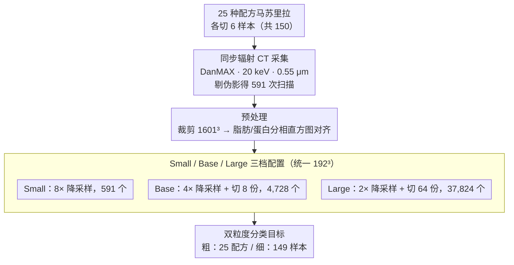

# MozzaVID: Mozzarella Volumetric Image Dataset

**会议**: CVPR 2026  
**arXiv**: [2412.04880](https://arxiv.org/abs/2412.04880)  
**代码**: [https://papieta.github.io/MozzaVID/](https://papieta.github.io/MozzaVID/) (有，数据集公开)  
**领域**: 3D视觉
**关键词**: 体积图像数据集, 3D分类, X射线CT, 食品微结构, 深度学习基准

## 一句话总结

本文发布 MozzaVID——一个基于同步辐射 X 射线 CT 的马苏里拉奶酪微结构体积图像分类数据集，包含 591-37,824 个 192³ 体积样本、25 种奶酪/149 个样本的分类目标，弥补了 3D 体积数据集在数量级和任务设计上与 2D 数据集的巨大差距，实验表明 3D 模型显著优于 2D 模型。

## 研究背景与动机

1. **领域现状**：体积图像（3D CT、MRI等）在医学、材料科学、食品科学等领域应用广泛，深度学习在这些领域的发展日益活跃。在 2D 领域，MNIST（6万张）、ImageNet（1400万张）等标准 benchmark 推动了大量架构创新。

2. **现有痛点**：体积数据集存在严重短板——(a) **规模太小**：最大的体积数据集（如 BugNIST 9154 个、PN9 8798 个）远小于 2D 数据集；(b) **可获取性差**：很多医学数据集需要注册、签协议甚至联系发布者；(c) **任务过于专业**：多数数据集面向特定诊断问题，不适合作为通用 benchmark；(d) **缺乏分类型 benchmark**：多数体积数据集聚焦分割或检测，分类目标较少。

3. **核心矛盾**：由于缺乏大型通用的体积 benchmark，3D 深度学习研究者无法像 2D 领域那样在统一标准上对比不同架构。结果是，新模型往往只在单一专用数据集上评估，泛化性和可比性都受限。很多 3D 方法只是简单地将 2D 架构改为 3D，可能遗漏了专门为 3D 数据优化的机会。

4. **本文目标** 创建一个大规模、清洁、多用途、公开可用的体积图像分类 benchmark，桥接 2D 和 3D 数据集之间的规模鸿沟。

5. **切入角度**：马苏里拉奶酪的微结构具有各向异性且高度无序的特点——可以在不引入偏差的前提下任意切分为更小的体积块，从而从 591 个原始扫描中派生出多达 37,824 个样本。这是食品微结构的独特优势。

6. **核心 idea**：利用马苏里拉奶酪微结构的无序性和可分割性，构建一个规模空前（37K+ 体积）的 3D 分类 benchmark，同时验证了 3D 表示对体积任务的不可替代性。

## 方法详解

### 整体框架

MozzaVID 的构建流程为：(1) 从 25 种不同配方的马苏里拉奶酪中各切 6 个样本（共 150 个），每个样本做 4 次局部断层扫描（共 600 次，剔除 9 次得 591 次）；(2) 在 MAX IV 同步辐射源 DanMAX 光束线上以 20 keV 能量、0.55 μm 像素尺寸进行高分辨率 CT 扫描；(3) 预处理（剔伪影、裁剪、脂肪/蛋白分相直方图对齐）后，利用微结构可任意切分的特性把数据派生为 Small/Base/Large 三档、统一输出 192³ 体积；(4) 在此之上定义粗（25 配方）/ 细（149 样本）双粒度分类目标，构成最终 benchmark。

### 关键设计

**1. 同步辐射 CT 采集：拍清楚蛋白质与脂肪对比度极低的微结构**

马苏里拉的蛋白质和脂肪 X 射线衰减系数非常接近，用普通实验室 micro-CT 扫出来噪声高、对比度差，根本看不清结构。本文改用 MAX IV 同步辐射源（DanMAX 光束线）——它的高通量和相干性远胜实验室源，每次扫描采集 2601 个投影、1.5 ms 曝光、2356×2688 分辨率，0.55 μm 像素尺寸。快速曝光还顺带回避了奶酪样品在长时间扫描下的热不稳定问题。采到的原始体积再做三步预处理：剔除 9 个带伪影的扫描（600 → 591）、裁剪到 1601×1601×2156、做直方图对齐（先分割脂肪和蛋白质两相、再标准化强度），保证不同扫描间的灰度可比。

**2. Small/Base/Large 三档配置：用一份数据覆盖从「典型体积场景」到「逼近 2D 规模」的整个谱段**

体积数据集普遍太小，2D 那种几万到上千万样本的 benchmark 在 3D 几乎没有。本文利用马苏里拉微结构「没有固定宏观形状或边界、可任意切分而不引入偏差」这一特性，从同一批扫描派生出三档规模：都以 1536³ 像素的中心立方体为起点，8X-1X (Small) 降采样 8 倍、保持 591 个体积；4X-2X (Base) 降采样 4 倍、每个再切 8 份得 4,728 个；2X-4X (Large) 降采样 2 倍、每个切 64 份得 37,824 个。三档全部统一输出 192³ 体积，因此研究者既能在 Large 上建立稳定基线，又能在 Small/Base 上复现「数据受限」的真实困境，而切分本身不会因为破坏宏观结构而引入标签偏差。

**3. 双粒度分类目标：让难度从「可行但非平凡」一路压到「明显有挑战」**

数据集同时给出两层分类标签——粗粒度区分 25 种奶酪配方（不同烹饪温度、螺杆速度、添加剂带来的结构变体），细粒度区分 149 个具体样本（每种奶酪 6 个，样本间因空间位置差异带来微妙变化）。两层标签之间存在天然的相似度层次：同配方奶酪「浅层相似」，同种奶酪的不同样本「中等相似」，同一样本的不同扫描「强相似」，越往细分越难。这样设计的结果是难度梯度清晰可控：粗粒度在 Large 上能到 97.3% 准确率（可行但非平凡），细粒度在 Base 上只有 73.3%（明显吃力），恰好覆盖了从大数据到小数据的不同体积任务场景。

### 损失函数 / 训练策略

使用交叉熵损失，评估用测试集准确率。AdamW 优化器，effective batch 32，学习率微调（大模型 $10^{-4}$）。数据增强仅用 XY 轴随机翻转。CNN 用 30 epoch 早停，Transformer 用 50 epoch 早停。5 天内未收敛则取当前最优。

## 实验关键数据

### 主实验

| 模型 | Coarse-3D-Large | Coarse-2D-Large | Fine-3D-Large | Fine-2D-Large |
|------|----------------|-----------------|---------------|---------------|
| ResNet50 | **0.973** | 0.777 | **0.935** | 0.770 |
| MobileNetV2 | 0.909 | 0.775 | 0.895 | 0.857 |
| ConvNeXt-S | 0.806 | 0.621 | 0.877* | 0.652 |
| ViT-B/16 | 0.731 | 0.474 | 0.855 | 0.442 |
| Swin-S | 0.896* | 0.620 | 0.922* | 0.686 |
| **平均** | **0.863** | **0.653** | **0.905** | **0.681** |

3D 模型平均比 2D 高 21-22 个百分点，差距非常显著。

### 不同数据集规模影响

| 配置 | Coarse-3D | Coarse-2D | 说明 |
|------|-----------|-----------|------|
| Small (591) | 0.614 (avg) | 0.367 (avg) | 数据极少，过拟合严重 |
| Base (4,728) | 0.799 (avg) | 0.625 (avg) | 中等规模，差距缩小 |
| Large (37,824) | 0.863 (avg) | 0.653 (avg) | 最大规模，3D 优势最大 |

### 关键发现

- **3D 表示不可替代**：即使 3D Coarse-Base（4,728 样本）也能超越 2D Large（37,824 样本）的多数模型，说明对于体积任务，3D 远比多数据重要。但细粒度分类中这个趋势不明显，说明纹理细节可能通过 2D 切片也能部分捕获。
- **ResNet50 在所有 3D 配置中表现最稳健**，优于更现代的 ConvNeXt 和 ViT。这暗示当前先进架构可能过度针对 2D 优化，3D 领域仍有专用架构优化空间。
- **Swin Transformer 表现出色**，尽管 Transformer 对数据量敏感，但在 Small/Base 上也有不错表现，值得作为 3D 架构开发的起点。
- **UMAP 嵌入显示学到了有意义的结构表示**——相似配方的奶酪在嵌入空间中聚类更近，且聚类分布与化学参数的 PCA 空间高度一致。

## 亮点与洞察

- **利用食品微结构的"无序性"作为优势**——正因为马苏里拉没有规律的重复模式，才能自由切分而不丢失信息。这个 insight 巧妙地将材料特性转化为数据集设计的先天优势。
- **三种配置设计覆盖了从"典型体积场景"到"接近 2D benchmark"的完整谱段**，一个数据集同时满足多种研究需求。
- **分类作为结构分析工具**——通过分类器的嵌入空间可以量化和可视化微结构的变异性，这对食品科学研究有直接应用价值，不仅限于方法 benchmark。
- **首个食品微结构 3D 深度学习数据集**——在食品科学和计算机视觉的交叉领域填补了空白。

## 局限与展望

- **只有分类任务**——没有分割或检测 ground truth。虽然这是切分策略的前提（分类不依赖宏观结构完整性），但限制了数据集用途的多样性。
- **Large 上准确率已经很高（97.3%）**——留给未来改进的空间有限。更有挑战的是 Small/Base 配置。
- **数据来源单一**——仅限马苏里拉，虽然作者论证了与其他有机/医学体积数据的视觉相似性，但直接推广到其他材料的 benchmark 价值需要验证。
- **扫描方向可能引入偏差**——不同类型奶酪的纤维方向可能被模型利用来走捷径分类，虽然消融显示影响不大但未完全排除。
- **预训练的缺失**——所有模型从零训练，可能导致 ViT 等数据饥渴型架构表现不佳。未来可以探索体积数据上的自监督预训练。

## 相关工作与启发

- **vs BugNIST**: 同为非医学领域 3D 分类数据集，BugNIST 有 9,544 个样本但基线分类过于简单。MozzaVID 在 Large 配置上有 4× 的样本量，且分类更具挑战性。
- **vs MedMNIST 3D**: MedMNIST 3D 有 1,633-1,908 个样本，但 64³ 分辨率很低、只有 2/11 类。MozzaVID 在样本量和类别数上都更适合 benchmark。
- **vs 2D 食品数据集 (FoodSeg103/Recipe1M+)**: 这些都是食物照片的 2D 数据集，面向的是完全不同的问题（成品识别 vs 微结构分析）。

## 评分

- 新颖性: ⭐⭐⭐⭐ 首个大规模3D食品微结构数据集，选材有创意，但核心是数据集贡献而非方法创新
- 实验充分度: ⭐⭐⭐⭐ 5种架构×3种配置×2种粒度×2/3D全面覆盖，UMAP分析有深度
- 写作质量: ⭐⭐⭐⭐ 数据集论文典范，相关工作调研极为全面
- 价值: ⭐⭐⭐⭐ 填补了3D benchmark的重要空白，有望成为体积深度学习的标准测试集

<!-- RELATED:START -->

## 相关论文

- [\[CVPR 2026\] ICTPolarReal: A Polarized Reflection and Material Dataset of Real World Objects](ictpolarreal_a_polarized_reflection_and_material_dataset_of_real_world_objects.md)
- [\[CVPR 2026\] Ego-1K: A Large-Scale Multiview Video Dataset for Egocentric Vision](ego-1k_--_a_large-scale_multiview_video_dataset_for_egocentric_vision.md)
- [\[CVPR 2026\] SceneScribe-1M: A Large-Scale Video Dataset with Comprehensive Geometric and Semantic Annotations](scenescribe-1m_a_large-scale_video_dataset_with_comprehensive_geometric_and_sema.md)
- [\[CVPR 2026\] M3DLayout: A Multi-Source Dataset of 3D Indoor Layouts and Structured Descriptions for 3D Generation](m3dlayout_a_multi-source_dataset_of_3d_indoor_layouts_and_structured_description.md)
- [\[CVPR 2026\] Text–Image Conditioned 3D Generation](text-image_conditioned_3d_generation.md)

<!-- RELATED:END -->
