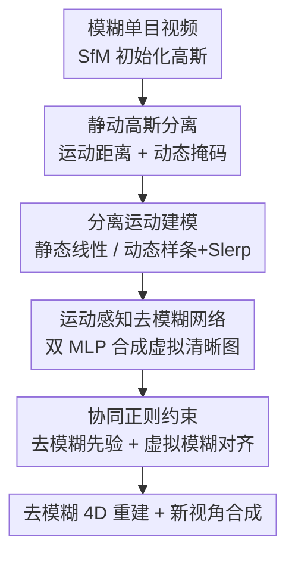

# MSCD-GS: Motion-Separated Cooperative Deblurring Dynamic Reconstruction via Gaussian Splatting

**会议**: CVPR 2026  
**论文**: [CVF Open Access](https://openaccess.thecvf.com/content/CVPR2026/html/Liao_MSCD-GS_Motion-Separated_Cooperative_Deblurring_Dynamic_Reconstruction_via_Gaussian_Splatting_CVPR_2026_paper.html)  
**代码**: https://liaoyongjian1.github.io/MSCD-GS/ （项目主页）  
**领域**: 3D视觉  
**关键词**: 4D高斯泼溅, 运动去模糊, 动态重建, 静动分离, 协同监督

## 一句话总结
针对单目相机拍摄的动态场景里普遍存在的运动模糊，MSCD-GS 把高斯点分成静态、动态两类分别建模其曝光时间内的运动，用两套运动感知 MLP 合成虚拟清晰图像，再配合一个去模糊网络的先验做协同正则约束，从模糊输入里重建出高质量 4D 动态场景，在 Stereo Blur 和真实模糊数据集上去模糊与新视角合成均超过现有方法且训练更快。

## 研究背景与动机
**领域现状**：基于 3D 高斯泼溅（3DGS）的 4D 重建把时间作为第四维，能在动态场景里实时渲染、显式建模随时间变化的几何与外观，已经在动态 SLAM、自动驾驶、机器人感知里被广泛使用。但这些方法几乎都默认输入是清晰图像。

**现有痛点**：真实单目相机在有限曝光时间内对光线积分，一旦相机或场景中的物体在曝光期间运动，画面就不可避免地带运动模糊。模糊又分两种——相机运动模糊（相机位姿在曝光期变化，本质是整张背景的整体偏移）和物体运动模糊（物体与相机运动交织，每个物体各自非线性运动），后者远比前者难处理。用这种模糊图像去监督 4DGS，渲染结果会被严重污染。

**核心矛盾**：一个直观做法是「先用去模糊网络（如 NAFNet）把图像修清楚，再喂给 4DGS」。但论文用 Table 1 指出这条路的天花板被去模糊网络锁死：只靠去模糊网络的输出做监督，重建质量的下界就等于去模糊网络的能力，而单帧去模糊缺乏 3D 几何感知、细节恢复不稳定、跨帧不一致，结果仍然糊。另一类方法（BARD-GS、Deblur4DGS）虽能同时处理两种模糊，却严重依赖深度图、轨迹、光流等大量先验数据，实用性差。

**本文目标**：在不堆砌大量先验数据的前提下，把「去模糊网络」和「4DGS」真正有机地结合起来，既吃到去模糊先验的高质量，又用 4D 几何一致性反过来纠正去模糊的不稳定。

**切入角度**：作者回到运动模糊的成像原理——模糊图像 = 曝光时间内多张虚拟清晰图像的积分平均。既然静态背景与动态物体的运动特性截然不同（背景是刚性整体线性运动，物体是各自独立的非线性运动），那就不该用一套运动模型硬套，而应该分而治之。

**核心 idea**：把高斯点分成静态/动态两类、分别建模其曝光时间内的运动来合成虚拟清晰图，再用「去模糊网络先验 + 合成虚拟模糊图」两路协同监督，避免过拟合去模糊网络的输出。

## 方法详解

### 整体框架
输入是一段带运动模糊的单目视频帧及对应相机内外参，目标是重建高质量的去模糊 4D 场景。整体流程是：先用模糊图像 SfM 初始化高斯点云；在优化中按运动距离和动态掩码把高斯分成静态、动态两类；对两类高斯分别建模其曝光时间内的运动轨迹，并用两套运动感知 MLP 预测它们在曝光期内多个采样时刻的形变，渲染出一组虚拟清晰图像；最后一路用预训练 NAFNet 的去模糊结果当先验监督，另一路把这组虚拟清晰图融合成一张虚拟模糊图去对齐真实输入模糊图，两路协同约束完成训练。

为提高稳定性，输入模糊图先被切成 $N$ 个子集 $\Phi=\{I_1\cdots I_N\}$，每个子集内相机和物体运动连续、幅度小，逐子集渐进重建后按时间顺序拼成完整 4D 场景。

### 关键设计

**1. 静动高斯分离：用运动距离 + 动态掩码把背景和物体拆开建模**

运动模糊的两种来源（相机 vs 物体）运动规律完全不同，混在一起用单一模型必然顾此失彼。作者在重建前用 BootsTAPIR 跟踪每个像素的运动，得到每帧的 2D 动态掩码 $M_D$；然后把「2D 投影中心落在动态掩码范围内、且运动距离排在前 $1.5\%$」的高斯判为动态高斯 $G_D$，其余为静态高斯 $G_S$。这一步是后续所有分治建模的前提——背景交给只描述刚性整体运动的静态分支，前景物体交给描述独立非线性运动的动态分支，让两类运动各用最合适的数学模型，而不是用一个过于灵活的网络去硬拟合所有运动。

**2. 分离运动建模：静态走线性、动态走 Catmull-Rom 样条 + Slerp + 双高斯不透明度衰减**

静态高斯被假设为「相机不动、背景在动」的等价模型，由于子集时间 $\tau_d$ 极短，其运动近似线性：$\mu_S(t_i)=\mu_S(t_s)+\frac{t_i}{\tau_d}d$，只需估计一个位移 $d$。动态高斯的轨迹是相机运动与物体运动叠加的非线性曲线，作者用 Catmull-Rom 样条拟合位置 $\mu_D(t_i)=T(t_i)\cdot M_\mu\cdot\mu$（以子集首尾点为端点、相邻点为控制点），用球面线性插值 Slerp 在四元数空间插值旋转 $q_D(t_i)=\frac{\sin((1-t_i)\theta)q_{-1}+\sin(t_i\theta)q_{+1}}{\sin\theta}$。考虑到动态物体会进出视野，还对动态高斯的不透明度引入双高斯衰减模型：物体在持续时段内 $\sigma(t_i)=1$，离开该时段则按 $\exp(-\frac{\min(t_i-\mu_0,t_i-\mu_1)^2}{2t_d})$ 衰减，使物体出现/消失更平滑。这种「线性管背景、样条管前景」的差异化建模，比一套统一变形场更贴合物理。

**3. 运动感知去模糊网络：双 MLP 预测曝光期内逐高斯形变，合成虚拟清晰图**

光有运动轨迹还不够，要把曝光时间离散成 $N$ 个采样时刻并在每个时刻渲染出虚拟清晰图。静态分支用一个 MLP $F_S$ 预测对应 $N$ 张虚拟图的刚性旋转 $\Delta R$ 与平移 $\Delta T$，得到 $\mu_S(t_i)=\mu_S(t)\cdot\Delta R^i+\Delta T^i$；动态分支用一个更具表达力的轻量 MLP $F_D$（含正弦位置编码、位置/尺度/几何三支编码器、残差融合干路）预测每个动态高斯的位移 $\Delta\mu_D$、各向异性尺度 $\Delta S$ 和旋转 $\Delta R_D$。把同一采样时刻的静、动态高斯合并渲染得到虚拟清晰图 $I(t_i)$，再按成像原理取平均合成虚拟模糊图 $\hat{B}(t)=\frac{1}{N}\sum_{i=1}^N I(t_i)$。这一步把「模糊 = 多张清晰图积分」的物理过程显式地、可微地重建出来，让网络能反向约束清晰图的质量。

**4. 协同正则约束：去模糊先验与虚拟模糊对齐两路平衡，防止过拟合去模糊网络**

如果只用 NAFNet 去模糊后的图像 $B_d$ 监督，重建质量会被去模糊网络的能力封顶（Table 1 的下界现象）。作者先用去模糊图集 $B_d$ 把 4D 高斯优化到一个高质量初始状态（$L'_{render}(t_i)=\sum_{i\in N}\|B_d(t_i)-I(t_i)\|_1$），随后引入真实模糊图 $B$ 做第二路监督，总损失为 $L_{render}(t)=\lambda L'_{render}(t)+(1-\lambda)\sum\|B(t)-\hat{B}(t)\|_1$，用超参 $\lambda$（实验取 $0.4$）平衡「去模糊先验项」和「合成虚拟模糊项」。直觉是：去模糊先验提供清晰度上限的方向，真实模糊图则把模型拉回到符合实际成像的约束面上，两者互相牵制，既享受去模糊网络的清晰先验，又不被它的错误细节带偏。

### 损失函数 / 训练策略
两阶段优化：先用去模糊图 $B_d$ 训练得到高质量初始 4D 高斯，再用真实模糊图 $B$ 接入协同正则项继续优化。曝光时间内虚拟视图数 $N=3$（消融显示 2–4 张即够，再多反而掉点且训练变慢），平衡超参 $\lambda=0.4$。逐子集渐进重建后按时间拼接。实验在单张 NVIDIA A100 40GB 上完成。

## 实验关键数据

### 主实验
在 Stereo Blur 数据集（6 个严重运动模糊场景，每场景 48 张图）上评估去模糊 4D 重建与新视角合成。MSCD-GS 全面领先，且训练时间远短于同类去模糊重建方法。

| 方法 | 去模糊 PSNR↑ | 去模糊 LPIPS↓ | 新视角 PSNR↑ | FPS↑ | 训练(h)↓ |
|------|------|------|------|------|------|
| SoM + NAFNet | 29.01 | 0.101 | 27.76 | - | - |
| DyBluRF (CVPR'24) | 28.67 | 0.101 | 25.90 | 0.2 | 51.1 |
| BARD-GS (CVPR'25) | 30.21 | 0.096 | 27.02 | 80 | 4.62 |
| Deblur4DGS (arXiv'25) | 30.32 | 0.085 | 27.84 | 96 | 6.10 |
| **MSCD-GS (本文)** | **33.21** | **0.043** | **29.49** | **121** | **0.72** |

在真实模糊数据集（GoPro 双曝光采集，7 个场景）的新视角合成上，MSCD-GS 同样最优：PSNR 28.13 / SSIM 0.909 / LPIPS 0.106，相比次优的 BARD-GS（25.13 PSNR）提升约 3 dB。值得注意的是训练时间仅 0.72 h，比 BARD-GS（4.62 h）、Deblur4DGS（6.10 h）快近一个数量级，FPS 也更高。

### 消融实验
在 Man 场景上逐模块消融（DN: 去模糊网络, SGD: 静态高斯去模糊, DGD: 动态高斯去模糊），三者缺一不可：

| 配置 (DN/SGD/DGD) | 去模糊 PSNR↑ | 新视角 PSNR↑ | 说明 |
|------|------|------|------|
| 仅 DN | 29.50 | 27.01 | 只靠去模糊网络，被其能力封顶 |
| 仅 SGD | 28.23 | 26.29 | 只修背景刚性运动 |
| 仅 DGD | 27.41 | 25.62 | 只修动态物体 |
| DN + DGD | 30.15 | 28.25 | 缺静态分支，背景仍糊 |
| SGD + DGD | 31.02 | 29.33 | 缺去模糊先验，细节上限低 |
| **DN + SGD + DGD (全)** | **31.72** | **29.64** | 完整模型最佳 |

虚拟视图数量消融（Table 5）显示 $N=3$ 是甜点：$N=2$ 时去模糊 PSNR 31.32，$N=3$ 升到 31.72，$N=4$ 后几乎不再提升（31.81）但训练时间从 0.72 h 涨到 1.09 h，$N=10$ 反而掉到 30.72。

### 关键发现
- 去模糊网络（DN）单独使用时质量被锁死，但作为先验与静/动态去模糊协同后增益最大——「DN+SGD+DGD」相比「SGD+DGD」去模糊 PSNR 再涨 0.7 dB，印证了协同正则比单纯去模糊更有效。
- 静态、动态分支各管一半场景，去掉任一个都会让对应区域重新变糊，验证了静动分离建模的必要性。
- 少量虚拟视图（3 张）就能逼近模糊积分，过多虚拟视图既无收益又拖慢训练，说明物理建模的精度比采样密度更关键。

## 亮点与洞察
- **把模糊成像的物理过程显式可微化**：不是把去模糊当黑盒前处理，而是用「多张虚拟清晰图取平均 = 模糊图」这一成像原理，反过来约束清晰图质量，这个思路可迁移到任何带运动模糊的可微渲染任务。
- **静动分离 + 差异化运动模型**：背景用线性、前景用 Catmull-Rom 样条 + Slerp，是「让数学模型贴合物理规律」的典范，比统一变形场更省参也更准。
- **协同正则破除去模糊网络的天花板**：用真实模糊图把模型拉回成像约束面，避免过拟合去模糊网络的错误细节，这个「先验项 + 物理项」平衡的设计很值得借鉴。
- **效率惊人**：训练 0.72 h、121 FPS，比依赖深度/轨迹/光流先验的 BARD-GS、Deblur4DGS 快近 10 倍，说明少先验反而能换来高效率。

## 局限与展望
- 依赖 BootsTAPIR 的像素跟踪来生成动态掩码、并用「运动距离前 1.5%」的硬阈值分静动高斯，阈值和跟踪质量可能在快速运动或密集动态物体场景下不稳定。⚠️ 论文未充分讨论该阈值的鲁棒性。
- 静态高斯的线性运动假设建立在「子集时间极短」上，若曝光时间很长或相机剧烈抖动，线性近似可能失效。
- 去模糊先验来自预训练 NAFNet，整个系统的清晰度上限部分受其影响；换更强的去模糊网络是否进一步提升、是否引入新偏差，未深入探讨。
- 仅在两个真实模糊数据集上验证，场景规模和多样性有限，对大场景、多动态物体的扩展性待考。

## 相关工作与启发
- **vs Deblur4DGS / BARD-GS**：同样渲染多张虚拟清晰图来模拟模糊，但这两者重度依赖深度图、轨迹、光流等先验数据；MSCD-GS 几乎不需要这类先验，靠静动分离 + 协同正则就能达到更高质量且训练快近一个数量级，更实用。
- **vs「去模糊网络 + 4DGS」朴素串联**：朴素串联的重建下界被去模糊网络锁死（Table 1）；本文用真实模糊图做第二路监督，把去模糊先验当方向、物理成像当约束，突破了这个天花板。
- **vs 单帧/视频去模糊网络（NAFNet、Transformer/扩散类）**：这些方法缺乏 3D 几何感知，跨帧不一致、深度感知模糊去除不准；MSCD-GS 用 4DGS 显式建几何，强制时空一致性，并反过来提升去模糊质量。

## 评分
- 新颖性: ⭐⭐⭐⭐ 静动分离 + 协同正则的组合在去模糊 4D 重建里思路清晰且物理动机扎实，但各组件（样条/Slerp/双高斯衰减）多为已有技术的巧妙组装。
- 实验充分度: ⭐⭐⭐⭐ 两个真实数据集、多基线对比、模块与虚拟视图数双消融都到位，但场景规模偏小、缺更极端模糊场景压力测试。
- 写作质量: ⭐⭐⭐⭐ 成像原理与三段式 pipeline（Section A/B/C）讲得清楚，公式完整，部分符号偏密。
- 价值: ⭐⭐⭐⭐ 少先验、高效率、SOTA，对单目动态场景去模糊重建有较强实用价值。

<!-- RELATED:START -->

## 相关论文

- [\[CVPR 2026\] Motion-Aware Animatable Gaussian Avatars Deblurring](motion-aware_animatable_gaussian_avatars_deblurring.md)
- [\[AAAI 2026\] MoBGS: Motion Deblurring Dynamic 3D Gaussian Splatting for Blurry Monocular Video](../../AAAI2026/3d_vision/mobgs_motion_deblurring_dynamic_3d_gaussian_splatting_for_blurry_monocular_video.md)
- [\[CVPR 2026\] Space-Time Forecasting of Dynamic Scenes with Motion-aware Gaussian Grouping](space-time_forecasting_of_dynamic_scenes_with_motion-aware_gaussian_grouping.md)
- [\[CVPR 2026\] $L^{2}DGS$: Low-Light Dynamic Gaussian Splatting](l2dgs_low-light_dynamic_gaussian_splatting.md)
- [\[CVPR 2025\] DiET-GS: Diffusion Prior and Event Stream-Assisted Motion Deblurring 3D Gaussian Splatting](../../CVPR2025/3d_vision/diet-gs_diffusion_prior_and_event_stream-assisted_motion_deblurring_3d_gaussian_.md)

<!-- RELATED:END -->
