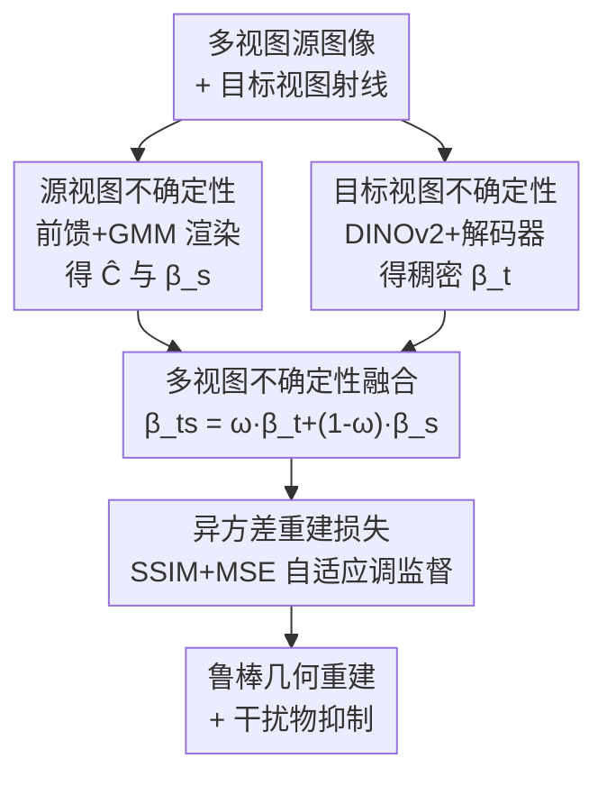

# MU-GeNeRF: Multi-view Uncertainty-guided Generalizable Neural Radiance Fields for Distractor-aware Scene

**会议**: CVPR 2026  
**arXiv**: [2604.17965](https://arxiv.org/abs/2604.17965)  
**代码**: https://github.com/Yanyilucas/MU-GeNeRF (有)  
**领域**: 3D视觉 / 神经辐射场  
**关键词**: 可泛化NeRF, 干扰物抑制, 不确定性建模, 异方差损失, 新视角合成  

## 一句话总结
针对可泛化 NeRF（GeNeRF）在动态真实场景中被瞬态干扰物（行人、阴影、动态物体）污染监督信号的问题，本文把"干扰物感知"拆成**源视图不确定性**（跨源视图的结构不一致）与**目标视图不确定性**（目标图里的观测异常）两个互补分量，再用一个异方差重建损失把二者融合，从而在前馈泛化框架下既能定位干扰物又不误伤静态结构，效果超过现有 GeNeRF 并逼近逐场景优化的 distractor-free NeRF。

## 研究背景与动机
**领域现状**：NeRF 把场景隐式编码后做新视角合成，但需要逐场景从头优化、且假设场景在采集期间几何与光照都静止。GeNeRF 通过学习一个"场景无关的多视图聚合先验"，能用稀疏源视图前馈式地直接合成目标视图，泛化到没见过的场景，省掉逐场景优化。

**现有痛点**：真实环境里普遍存在瞬态干扰物（移动的人、车、阴影变化），它们破坏了跨视图的结构一致性，给训练注入错误监督，导致重建模糊或扭曲。现有的 distractor-free NeRF（如 NeRF-W、NeRF on-the-go、UP-NeRF）都建立在逐场景优化范式上：靠在单个场景里"过拟合"出一致性，再从**逐视图重建误差**里估计不确定性来识别干扰物。

**核心矛盾**：这套范式无法迁移到泛化设置。GeNeRF 不对每个场景单独优化，它的重建误差来源是混杂的——既可能来自**目标视图里的瞬态干扰物**，也可能来自**源视图之间因遮挡/视角变化造成的结构不一致**。如果像逐场景方法那样不加区分地把所有重建误差都当成干扰物的信号，就会把"不一致的静态结构"误判为干扰物，既削弱了不确定性的可解释性，又严重损害几何建模精度。

**本文目标**：在前馈泛化框架下，把重建误差按来源解耦，分别处理"源视图结构冲突"和"目标视图观测异常"，从而精准定位干扰物而不误伤静态几何。

**切入角度**：作者观察到这两类误差本质不同——源视图不一致是**几何/外观层面跨视图的冲突**，目标视图干扰是**单图内部的语义异常**——因此应该用两套机制分别建模，而不是用一个单一的不确定性去硬扛。

**核心 idea**：把干扰物感知分解为**源视图不确定性 $\beta^s$** 与**目标视图不确定性 $\beta^t$** 两个互补分量，再通过异方差重建损失隐式协同，让二者互相补足彼此单独建模时的失败模式。

## 方法详解

### 整体框架
给定 $N$ 张带相机参数的源图像，模型先对目标视图射线上的采样点投影到源图像 $\{I_n^s\}$ 与特征图 $\{F_n^s\}$，采到颜色 $\{c_n^s\}$ 和特征 $\{f_n^s\}$。这些信息连同空间坐标 $x_k$、方向 $d_k$ 一起送进前馈网络 $\mathcal{G}_\theta$，预测每个采样点的颜色 $c_k$ 与**源视图不确定性** $\beta_k^s$；沿射线把所有采样点当作高斯混合模型（GMM）的分量聚合，渲染出像素颜色 $\hat{C}$ 与射线级源视图不确定性 $\beta^s$。同时，目标图 $I^t$ 经 DINOv2 提语义特征 $F^t$，再由解码器 $\mathcal{F}_\theta$ 预测一张稠密的**目标视图不确定性图** $\beta^t$。最后把两个不确定性加权融合成 $\beta_{ts}$，代入异方差重建损失，自适应调节各像素的监督强度，抑制干扰物、稳住几何建模。

### 关键设计

**1. 源视图不确定性：在前馈渲染里顺带量出"跨视图结构有多冲突"**

逐场景方法的不确定性来自单视图重建误差，搬到 GeNeRF 上不可靠，因为它分不清误差是干扰物还是源视图本身的不一致。本文让前馈网络 $\mathcal{G}_\theta$（用 VolRecon/ReTR 的 View-Transformer 聚合多源视图特征、Render-Transformer 给采样点提供渲染权重）在输出颜色 $c_k$ 的同时多输出一个标量 $\beta_k^s$，即 $c_k,\beta_k^s=\mathcal{G}_\theta(f_n^s,c_n^s,x_k,d_k)$。关键在于怎么把"点级不确定性"聚合到"像素级"：把每个采样点建模成一个高斯 $\mathcal{N}(\mu_k,\Sigma_k)$，均值 $\mu_k=c_k$、方差 $\sigma_k^2=\beta_k^s$（三通道独立等方差），再把射线上 $K$ 个点当成 GMM 的分量，用 Render-Transformer 经 Softmax 归一化得到的权重 $\alpha_k$ 加权：

$$\hat{C}(r)=\sum_{k=1}^{K}\alpha_k\mu_k,\qquad \beta^s(r)=\sum_{k=1}^{K}\alpha_k^2\sigma_k^2$$

这样颜色和不确定性用同一套权重统一推断，$\beta^s$ 直接反映"聚合多视图信息时各点有多可信"。它在原分辨率的前馈过程里算出，能精准刻画遮挡边界这类几何/外观冲突，但天然看不到目标视图里才有的瞬态干扰物——这正是需要第二个分量补足的地方

**2. 目标视图不确定性：用语义特征单独画一张干扰物分布图**

源视图不确定性管不了"目标图里突然冒出来的人/车"，因为这些干扰物只在目标视图的观测里出现。本文用预训练 DINOv2 从目标图 $I^t$ 抽语义特征 $F^t$，再过一个 CNN+MLP 解码器 $\mathcal{F}_\theta$ 生成稠密的目标视图不确定性图 $\beta^t(u,v)=\mathcal{U}(\mathcal{F}_\theta(F^t))(u,v)$（$\mathcal{U}$ 为双线性上采样到原图尺寸）。训练时用扩张 patch 策略采样射线、取对应位置的 $\beta^t(r)$ 当损失权重。和 NeRF on-the-go 逐射线、解耦训练地估不确定性相比，这里直接从整图一次性预测稠密图，充分利用 CNN 的空间建模能力、天然支持和 GeNeRF 主干端到端联合优化。注意 $\beta^t$ 由独立解码器预测、不参与前馈推理，所以推理阶段不需要它。它单独用时能定位干扰物，但分不清重建误差来源、容易把不一致的静态结构误判为干扰物（且低分辨率上采样会放大误判）——所以必须和 $\beta^s$ 协同

**3. 多视图不确定性融合 + patch-SSIM：让两路不确定性在异方差损失下隐式互补**

$\beta^s$ 和 $\beta^t$ 各有死角：前者定位不了目标视图干扰物、后者会误伤静态结构。本文把二者线性加权融合 $\beta_{ts}=\omega\cdot\beta^t+(1-\omega)\cdot\beta^s$（$\omega=0.5$），代入异方差重建损失：

$$\mathcal{L}_{\text{Multi-uncer}}=\frac{\mathcal{L}_{\text{SSIM}}(P(r),\hat{P}(r))+\mathcal{L}_{\text{MSE}}(P(r),\hat{P}(r))}{2\beta_{ts}^2(r)}+\lambda\log\beta_{ts}(r)$$

分子是 patch 级的 SSIM+MSE 联合误差、分母用融合不确定性自适应降低高不确定区的监督权重，$\lambda\log\beta_{ts}$ 防止不确定性发散到无穷。由于两路不确定性来源不同、特性互补，在异方差框架下形成隐式协同：单独失效的模式被对方补偿。这里**patch-SSIM 不可或缺**——$\beta^s$（遮挡边界等结构冲突）和 $\beta^t$（瞬态干扰物等语义异常）都依赖捕捉局部相关的结构/语义变化，需要空间一致的监督才能学好；而逐像素 MSE 缺乏空间上下文、梯度容易被孤立噪声主导，patch-SSIM 提供空间平滑、上下文感知的梯度，鼓励模型学到连贯的不确定性分布、防止过拟合孤立噪声

### 损失函数 / 训练策略
最终损失即上面的多视图异方差重建损失，MSE 与 SSIM 权重分别为 0.8 与 0.2，正则系数 $\lambda=0.1$，融合权重 $\omega=0.5$。训练时 $N=4$、评估时 $N=8$；图像统一缩放到 $320\times640$；batch size 为 1，每批随机采 1024 像素，按 $3\times3$ patch、膨胀率 2 采样以增强空间覆盖。先做 60 epoch（约 2.5 天）泛化训练，再逐场景微调 60K 迭代。全部实验在单张 NVIDIA A6000 上完成。

## 实验关键数据

### 主实验
在两个真实数据集 On-the-go（室内外随手拍、多样干扰物）与 RobustNeRF（室内、跨帧非连续动态干扰）上评测。ReTR / MuRF 是面向静态场景的 GeNeRF（无干扰物感知），UP-NeRF / NeRF on-the-go 是逐场景从头训练的 distractor-free NeRF。

On-the-go 上 PSNR↑ 对比（节选，ft 表示逐场景微调）：

| 方法 | 类型 | Corner | Patio | Spot | Patio-High |
|------|------|--------|-------|------|-----------|
| ReTR | GeNeRF 无优化 | 16.33 | 16.39 | 17.43 | 15.66 |
| MuRF | GeNeRF 无优化 | 13.41 | 11.78 | 14.18 | 11.88 |
| **MU-GeNeRF (Ours)** | GeNeRF 无优化 | **17.96** | **18.63** | **19.35** | **17.76** |
| ReTR ft | GeNeRF 微调 | 19.76 | 17.97 | 18.52 | 16.88 |
| UP-NeRF | 逐场景 | 19.34 | 15.78 | 16.71 | 14.52 |
| NeRF on-the-go | 逐场景 | 23.15 | 21.35 | 23.03 | 20.99 |
| **MU-GeNeRF (Ours) ft** | GeNeRF 微调 | 21.77 | 20.72 | 21.38 | 20.33 |

RobustNeRF 上同样领先所有 GeNeRF 基线、逼近 NeRF on-the-go（如 Statue PSNR 19.97 vs 21.25、Android 22.34 vs 23.17）。在同等设置下（无优化 / 微调），本文一致优于 ReTR、MuRF 和 UP-NeRF；虽略低于逐场景充分优化的 NeRF on-the-go，但二者范式不同：本文是前馈 GeNeRF、靠可迁移先验取胜，**效率优势显著**——Patio/Patio-High 上只需约 60K 迭代（约 2 小时）微调即可达到可比效果，而 NeRF on-the-go 需要 250K 迭代（约 48 小时）逐场景优化。

### 消融实验
On-the-go 的 Corner / Patio-High 上逐组件消融（PSNR↑ / SSIM↑）：

| 配置 | $\beta^s$ | $\beta^t$ | MSE | SSIM | Corner PSNR | Patio-High PSNR |
|------|:---:|:---:|:---:|:---:|------|------|
| #0 去掉所有不确定性 | | | ✓ | ✓ | 20.20 | 14.92 |
| #1 仅 $\beta^s$ | ✓ | | ✓ | ✓ | 19.85 | 15.33 |
| #2 仅 $\beta^t$ | | ✓ | ✓ | ✓ | 20.73 | 19.55 |
| #3 去掉 SSIM | ✓ | ✓ | ✓ | | 16.84 | 13.07 |
| #4 去掉 MSE | ✓ | ✓ | | ✓ | 14.87 | 14.10 |
| **Full** | ✓ | ✓ | ✓ | ✓ | **21.77** | **20.33** |

### 关键发现
- **两路不确定性缺一不可**：只用 $\beta^s$（#1）在 Patio-High 仅 15.33，定位不了目标视图干扰物；只用 $\beta^t$（#2）能定位但易误伤静态结构、且低分辨率上采样放大误判；完整模型 20.33 明显更高。
- **MSE 与 SSIM 互补**：去掉 SSIM（#3）Patio-High 暴跌到 13.07，去掉 MSE（#4）跌到 14.10——SSIM 缺像素精度致细节模糊、MSE 缺结构/空间上下文限制不确定性机制，单用任一都次优。
- **干扰物注入鲁棒性**：即便源视图中混入不同比例的干扰物，本文渲染结构仍保持一致，靠不确定性加权让模型聚焦几何一致性，而非记忆特定语义类别——$\beta^t$ 只在物体违反几何一致性时才被触发。

## 亮点与洞察
- **"误差解耦"的视角很对症**：把 GeNeRF 里混杂的重建误差按"源视图结构冲突"vs"目标视图观测异常"拆开建模，直击逐场景方法迁移到泛化设置时"误把静态不一致当干扰物"的根因，比堆一个更复杂的单一不确定性更本质。
- **GMM 统一推断颜色与不确定性**：把射线采样点当高斯混合分量、用同一套 Render-Transformer 权重 $\alpha_k$ 既算颜色又算 $\beta^s(r)=\sum\alpha_k^2\sigma_k^2$，是个干净可复用的前馈不确定性聚合范式。
- **稠密整图预测 + 端到端**：目标视图不确定性用 DINOv2+解码器一次性出稠密图、且不进推理，比 NeRF on-the-go 逐射线解耦训练更简洁，可迁移到其他需要"语义异常定位"的前馈任务。
- **patch-SSIM 当不确定性学习的"空间正则"**：用结构相似度提供空间平滑梯度来稳住不确定性分布、抗孤立噪声，这个思路对任何依赖局部相关信号的逐像素加权任务都有参考价值。

## 局限与展望
- 作者承认：方法**不能显式识别或移除干扰物**，只靠鲁棒监督引导模型聚焦结构稳定区域，因此在高度遮挡场景下性能受限。
- 性能仍略低于逐场景充分优化的 NeRF on-the-go，"泛化先验"和"逐场景精修"之间存在天然 trade-off，横向比 PSNR 大小需注意二者范式与优化预算不同、不可直接等同。
- $\beta^t$ 低分辨率预测后上采样存在误判放大风险；融合权重 $\omega$ 固定为 0.5，未做场景自适应。
- 展望：作者计划探索显式干扰物建模、并与动态场景理解结合，以提升可靠性与可解释性。

## 相关工作与启发
- **vs NeRF on-the-go**：它逐场景、逐射线估不确定性、用异方差损失隐式去干扰，需稠密视图与逐场景训练（250K 迭代约 48 小时）；本文是前馈 GeNeRF，把不确定性拆成源/目标两路、约 60K 迭代约 2 小时即得可比效果，效率大幅领先但绝对画质略逊。
- **vs UP-NeRF**：它对每个采样点估不确定性并**显式**建模/分离瞬态干扰物，复杂场景下解耦不准；本文用**隐式**异方差协同抑制，泛化设置下更稳，主实验全面优于 UP-NeRF。
- **vs ReTR / MuRF**：本文复用了 ReTR 的 View/Render-Transformer 架构，但二者均无干扰物感知设计、在瞬态场景学不到鲁棒先验；MuRF 用 Transformer 隐式建模视图一致性，反而易被干扰物误导、聚合时引入不一致上下文导致画质显著下降。

## 评分
- 新颖性: ⭐⭐⭐⭐ 把"干扰物感知"在 GeNeRF 框架下解耦为源/目标两路不确定性，视角清晰、对症
- 实验充分度: ⭐⭐⭐⭐ 两个真实数据集 + 逐组件消融 + 干扰物注入 + 不确定性策略可视化，较完整
- 写作质量: ⭐⭐⭐⭐ 动机推导和两路不确定性的互补关系讲得清楚，图示直观
- 价值: ⭐⭐⭐⭐ 把 distractor-free 能力首次较好地带进前馈泛化 NeRF，效率优势实用

<!-- RELATED:START -->

## 相关论文

- [\[CVPR 2026\] Evidential Neural Radiance Fields](evidential_neural_radiance_fields.md)
- [\[CVPR 2026\] RF4D: Neural Radar Fields for Novel View Synthesis in Outdoor Dynamic Scenes](rf4dneural_radar_fields_for_novel_view_synthesis_in_outdoor_dynamic_scenes.md)
- [\[CVPR 2025\] Depth-Guided Bundle Sampling for Efficient Generalizable Neural Radiance Field Reconstruction](../../CVPR2025/3d_vision/depth-guided_bundle_sampling_for_efficient_generalizable_neural_radiance_field_r.md)
- [\[CVPR 2026\] 3D-Aware Multi-Task Learning with Cross-View Correlations for Dense Scene Understanding](3d-aware_multi-task_learning_with_cross-view_correlations_for_dense_scene_unders.md)
- [\[CVPR 2026\] NTK-Guided Implicit Neural Teaching](ntk-guided_implicit_neural_teaching.md)

<!-- RELATED:END -->
