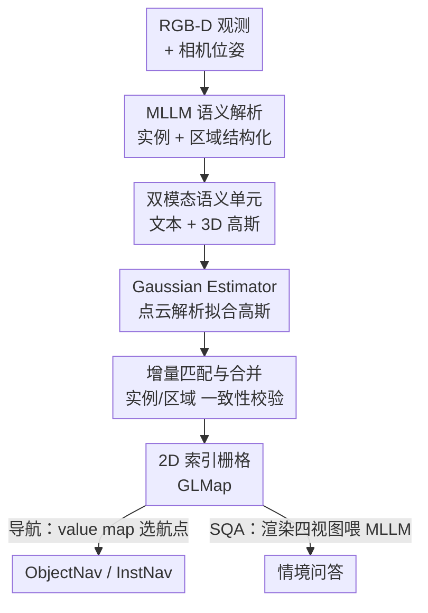

# Multi-Scale Gaussian-Language Map for Zero-shot Embodied Navigation and Reasoning

**会议**: CVPR2026  
**arXiv**: [2605.01736](https://arxiv.org/abs/2605.01736)  
**代码**: https://github.com/sx-zhang/GLMap  
**领域**: 3D视觉 / 具身导航  
**关键词**: 语义地图、3D高斯、具身导航、零样本、多尺度语义

## 一句话总结
提出多尺度高斯-语言地图（GLMap），用「2D 索引栅格 + 实例/区域双层语义单元」组织环境，每个语义单元同时存「自然语言描述 + 3D 高斯」，从而无需额外投影训练就能被 LLM/VLM/MLLM 直接读取；并用一个解析式 Gaussian Estimator 从点云直接拟合高斯参数（不做梯度优化），把 GLMap 零样本接到 ObjectNav / InstNav / SQA 三类任务上稳定涨点。

## 研究背景与动机
**领域现状**：具身智能体（找物体、找特定实例、回答情境问题）都依赖一张记录环境几何 + 语义的地图。现有语义地图大致三类：拓扑图（节点是物体、边是邻接关系）、栅格图（世界坐标网格里存类别或视觉特征）、稠密几何图（点云里存类别或 CLIP 特征）。

**现有痛点**：这些地图在「显式几何」和「多尺度语义」之间总是顾此失彼——拓扑图的边表达不了精确空间关系；类别图只有粗类标签，存不下属性、可供性、上下文；特征图（存 CLIP embedding）虽语义密但**分不清实例边界**。更关键的是，它们存的都是中间特征张量，而现在的 LLM/VLM/MLLM 原生吃的是**图像和文本**，所以接大模型时都得额外训练一个 projection / alignment 把特征对齐到 token，限制了可扩展性和模块化。

**核心矛盾**：「对大模型友好的接口」要求语义以自然语言 + 图像的形式显式暴露，而「显式几何 + 多尺度语义」又要求紧凑可增量地存下空间结构——以往方法把语义压成隐式特征，正好牺牲了前者。

**本文目标**：造一张同时满足三个条件的地图——① 显式几何（精确空间定位）；② 多尺度语义（实例级 + 区域级）；③ 对大模型友好（语义以语言和图像显式呈现）。

**切入角度**：作者注意到具身任务**自带深度图和相机内参**，能直接重建高质量稠密点云——这与原始 3DGS「从多视角图像里靠可微优化反推几何」的设定完全不同。既然几何已知，就没必要再做梯度优化，可以**解析地**从点云算出 3D 高斯。

**核心 idea**：让每个语义单元同时挂一段文本描述和一组 3D 高斯——文本给大模型直接读，高斯靠 splatting 快速渲染出任务相关图像；再用解析式估计器把「点云→高斯」做成闭式拟合，实现实时增量建图。

## 方法详解

### 整体框架
GLMap 把环境表示成 $\mathcal{M}=\{m,\mathcal{S}_o,\mathcal{S}_r\}$：$m$ 是一张 2D 索引栅格（每个格子存落在其空间范围内的语义单元 ID），$\mathcal{S}_o$ 是实例语义单元集合，$\mathcal{S}_r$ 是区域语义单元集合。实例单元 $o=(\mathcal{G},T_o)$ 同时存一组 3D 高斯 $\mathcal{G}$ 和开放词表文本描述 $T_o$；区域单元 $r=(\mathcal{I}_r,T_r)$ 存它包含的实例 ID 集合和区域文本（区域本身不再单独存高斯，渲染时由成员实例的高斯融合而来，省存储）。

整条流水线在一个具身 episode 里**增量**跑：每来一帧 RGB-D，先用 MLLM 把图像解析成「实例 + 区域」的结构化语义，对每个实例用 GroundingDINO+MobileSAM 抠 mask、反投影成点云，再用 Gaussian Estimator 解析地拟合出高斯；新实例与地图里已有实例按文本相似度 + 高斯相似度做匹配/合并，区域按实例重叠 + 文本相似度合并；最后用实例/区域几何更新 2D 栅格。建好的 GLMap 在下游通过「空间查询 / 实例查询 / 区域查询」三种方式被大模型调用：导航任务把语义单元与目标的相似度铺成一张 value map 选下一航点，SQA 任务则在估计的位姿处渲染前后左右四张图喂给 MLLM 作答。

### 关键设计

**1. 双模态语义单元：给大模型一个原生可读的语义接口**

这一条直击「特征图接大模型要额外训对齐」的痛点。GLMap 的每个语义单元都**同时**挂一段自然语言描述和一组 3D 高斯：文本（如物体类别、属性、区域功能）让 LLM 直接读，3D 高斯则通过 3DGS splatting 在任意视角快速渲染出图像让 VLM/MLLM 直接看。之所以选 3D 高斯而不是点云当视觉表示，是因为它存储更紧凑、且能显式高效地渲染——区域单元甚至不必自存高斯，要看图时临时融合成员实例的高斯即可。语义还分两个尺度：实例级单元 $\mathcal{S}_o$ 管对象/属性这类细粒度概念，区域级单元 $\mathcal{S}_r$ 管功能区/场景这类上下文概念，两者互补。正因为语义是以「语言 + 图像」显式暴露而非隐式特征张量，GLMap 才能**零样本**插进现成的 LLM-/VLM-/MLLM 方法，省掉 projection/alignment 训练

**2. Gaussian Estimator：用解析拟合替掉 3DGS 的梯度优化**

原始 3DGS 要靠可微优化反复迭代才能从多视角图像里反推几何，慢且不适合实时增量建图。作者抓住具身任务自带深度 + 内参、能直接重建稠密点云这一点，提出**解析式**估计器 $\mathcal{G}=f_{GE}(\mathcal{P})$：先把点云体素化（voxel 边长 1 cm），对每个体素 $\mathbf{v}$，为避免孤立高斯、保证相邻基元有重叠，取其 Chebyshev 邻域 $\mathcal{N}(\mathbf{v})=\{\tilde{\mathbf{v}}\mid\|\tilde{\mathbf{v}}-\mathbf{v}\|_\infty\le 1\}$ 内的点集 $\tilde{\mathcal{P}}_\mathbf{v}$，直接用样本均值和协方差闭式算出高斯参数——均值 $\boldsymbol{\mu}_\mathbf{v}$ 是点集质心，协方差 $\Sigma_\mathbf{v}=\frac{1}{|\tilde{\mathcal{P}}_\mathbf{v}|}\sum(\mathbf{p}_i-\boldsymbol{\mu}_\mathbf{v})(\mathbf{p}_i-\boldsymbol{\mu}_\mathbf{v})^\top+\epsilon I$，颜色取逐点均值，不透明度固定（如 0.8）。整个过程没有任何梯度反传，所以足够快、能跨视角增量更新

**3. 曲率感知合并：在平坦区省存储、在高曲率边界保细节**

体素拟合会在平坦表面产生大量冗余高斯，得删。作者定义两个高斯的相似度 $D(G_i,G_j)=\|\boldsymbol{\mu}_i-\boldsymbol{\mu}_j\|_2+\lambda_\Sigma\|\Sigma_i-\Sigma_j\|_F+\lambda_c\|\mathbf{c}_i-\mathbf{c}_j\|_2$（位置 + 形状 + 颜色三项，$\lambda_\Sigma=0.6,\lambda_c=0.4$），但合并阈值不是固定的，而是**随曲率自适应**：当 $D(G_i,G_j)<1+\tau(\kappa(\Sigma_i)+\kappa(\Sigma_j))$ 时才合并，其中 $\kappa(\Sigma)=\lambda_{\min}(\Sigma)/\operatorname{tr}(\Sigma)$ 用协方差最小特征值（对应法向）占迹的比例当曲率代理。这样在高曲率区域（物体边界、薄结构）阈值收紧、保留更多高斯维持锐利边界，在平坦区域阈值放宽、合并更狠以省内存——把存储预算花在该花的地方

**4. 增量匹配与合并：让局部观测一致地长进全局地图**

建图是逐帧增量的，必须解决「这一帧看到的实例/区域是不是地图里已有的那个」。系统维护两套 ID：当前帧的局部 ID $\tilde{n}$ 和地图的全局 ID $n$。实例匹配做**两级一致性**校验：先看语义一致性——文本嵌入余弦相似度 $\cos(\phi(T_{o_i}),\phi(T_{o_j}))>\tau_s$（$\tau_s=0.8$）；通过后再看几何一致性——两组高斯里是否存在可按设计 3 的准则合并的高斯。两者都满足才合并实例（高斯取并集 $\mathcal{G}_j\leftarrow\mathcal{G}_j\cup\mathcal{G}_i$、文本拼接 $T_{o_j}\leftarrow[T_{o_j};T_{o_i}]$，拼接文本超长就调一个轻量 LLM 做摘要合并），并记录局部→全局 ID 映射；否则注册为新实例。区域匹配则用「文本相似度 + 实例集重叠（$\mathcal{I}_{r_i}\cap\mathcal{I}_{r_j}\neq\emptyset$）」双条件，合并后再更新 2D 栅格。这套机制保证多视角观测能一致地融进同一张地图

### 损失函数 / 训练策略
GLMap **完全训练无关（training-free）**：建图侧没有任何可学习参数——MLLM（Gemma3-27B）做语义解析、GroundingDINO+MobileSAM 抠 mask、nomic-embed-text 算文本嵌入、Gaussian Estimator 解析拟合、文本超长时用 Qwen3-8B 合并，全是现成模型零样本调用；下游导航/SQA 也直接复用现有 LLM/VLM/MLLM 方法，无需对齐训练。核心超参：voxel 1 cm、$\lambda_\Sigma=0.6$、$\lambda_c=0.4$、$\tau_s=0.8$、文本缓冲长度 300。

## 实验关键数据

### 主实验
零样本 ObjectNav（HM3D / MP3D，Habitat），GLMap 在训练无关 + 开放词表设定下达到最优：

| 数据集 | 指标 | GLMap | 之前最好 | 提升 |
|--------|------|------|----------|------|
| HM3D | SR(%) | 62.7 | 61.4 (BeliefMapNav) | +1.3 |
| HM3D | SPL(%) | 33.7 | 33.0 (ApexNAV) | +0.7 |
| MP3D | SR(%) | 42.5 | 41.1 (FBN) | +1.4 |
| MP3D | SPL(%) | 18.3 | 17.8 (ApexNAV) | +0.5 |

零样本 InstNav（HM3D）与 SQA（SQA3D）同样领先：

| 任务 | 指标 | GLMap | 之前最好 |
|------|------|------|----------|
| InstNav | SR(%) | 22.5 | 20.2 (UniGoal) |
| InstNav | SPL(%) | 13.7 | 11.4 (UniGoal) |
| SQA | EM-1(%) | 58.5 | 57.2 (GPT4Scene) |
| SQA | EM-R1(%) | 61.3 | 60.4 (GPT4Scene) |

**即插即用增益**：把 GLMap 零样本接到不同范式的方法上都涨点——ESC(LLM) SR 39.2→48.8（+9.6）、VLFM(VLM) 52.5→59.1（+6.6）、ApexNAV 59.6→62.7（+3.1）、GPT4Scene(MLLM) EM-1 57.2→58.5（+1.3）。

### 消融实验
HM3D ObjectNav 上多尺度语义消融（基线为 VLFM）：

| 配置 | SR(%) | SPL(%) | 说明 |
|------|-------|--------|------|
| 仅 indexing grid（=VLFM 基线） | 52.5 | 30.4 | 直接拿 egocentric 视图算相似度 |
| grid + 实例单元 | 57.4 | 31.3 | 加实例语义 +4.9 SR |
| grid + 区域单元 | 56.2 | 30.9 | 加区域语义 +3.7 SR |
| grid + 实例 + 区域（Full） | 59.1 | 32.2 | 两者互补，最高 |

不同地图结构横向对比（同为零样本下游）：

| 地图结构 | 语义单元 | ObjectNav SR | InstNav SR | SQA EM-1 |
|----------|----------|------|------|------|
| 拓扑图 UniGoal | 实例+区域(文本) | 54.5 | 20.2 | 34.2 |
| 栅格图 GOAT | 物体(标签) | 50.6 | 17.0 | - |
| 栅格图 g3D-LF | 区域(视觉特征) | 55.6 | 11.5 | 47.7 |
| 稠密几何 Chat-Scene | 区域(视觉特征) | - | - | 54.6 |
| **GLMap** | 实例+区域(文本+渲染图) | **62.7** | **22.5** | **58.5** |

### 关键发现
- 实例单元和区域单元各自加都涨、合起来涨更多（52.5→57.4→59.1），说明实例级与区域级语义提供的是**互补线索**；且相比直接用 egocentric 视图算相似度，语义单元里的文本 + 视觉描述给出更丰富的匹配线索。
- 横向对比里 GLMap 是唯一在三个任务上**全面领先**的结构：拓扑图缺细粒度细节（颜色等）→ SQA 差；类别栅格图（GOAT）InstNav 差、还没法直接喂 MLLM；特征栅格图（g3D-LF）特征来自 2D patch 而非实例中心 → InstNav 掉到 11.5；稠密几何图（Chat-Scene）依赖完整点云 → 不适合增量的导航任务。GLMap 的「显式栅格定位 + 实例/区域双尺度 + 双模态」同时拿下定位精度、实例边界和多尺度理解。
- Gaussian Estimator 虽是解析推导（无梯度优化），渲染结果仍保住了原始颜色保真度和语义完整性（Fig. 3 可视化）。

## 亮点与洞察
- **把「几何已知」这件事吃干榨净**：原始 3DGS 的可微优化本质是在补偿「没有深度和内参」，而具身任务恰恰自带这两样——作者据此把高斯估计从迭代优化降成一次闭式计算，是非常对症的简化，直接换来实时增量建图能力。
- **双模态接口戳中了「大模型时代的地图该长什么样」**：与其把语义压成隐式特征再训对齐，不如直接存大模型原生能读的「文本 + 可渲染图像」。这个设计让同一张地图零样本通吃 LLM/VLM/MLLM 三种范式，可迁移性极强——任何想接大模型的结构化记忆都可以借鉴「存可渲染表示而非特征张量」这一思路。
- **曲率感知合并**是个干净的存储-精度权衡 trick：用协方差最小特征值占迹比当曲率代理，几乎零成本地实现「边界多留、平面少留」，可迁移到任何高斯/点云压缩场景。
- **多尺度语义对应多尺度任务**：实例语义服务 ObjectNav 的目标推断，区域语义服务 InstNav 的上下文定位和 SQA 的情境推理——语义粒度的设计是冲着下游任务的查询类型来的，不是为多尺度而多尺度。

## 局限与展望
- 建图质量**强依赖前端现成模型**：MLLM 语义解析、GroundingDINO/MobileSAM 抠 mask 的错误会直接污染语义单元，论文未系统分析这些误差的传播与累积。
- 解析式高斯估计假设深度图和位姿**足够准**；真实机器人传感器噪声、动态物体、深度缺失下的鲁棒性未充分验证（实验都在仿真器 HM3D/MP3D/SQA3D 上）。
- 渲染视角选择（导航选最大可见投影角、SQA 渲前后左右四视图）较启发式，遮挡严重或视角受限时渲染图可能信息不足。
- 文本无限拼接靠「超长触发轻量 LLM 摘要」缓解，但长 episode 下语义单元描述的漂移/信息损失程度未量化。

## 相关工作与启发
- **vs 拓扑图（UniGoal/SG-Nav）**：它们用场景图的节点-边表达「next to」这类关系，全局规划高效但边表达不了精确空间关系、也缺细粒度属性；GLMap 用显式 2D 栅格 + 渲染图，SQA 上 EM-1 从 34.2 拉到 58.5。
- **vs 特征栅格/稠密图（g3D-LF/Chat-Scene/Scene-LLM）**：它们在格子或点云里存 CLIP/视觉特征，语义密但分不清实例边界、且都要训 feature-to-token 对齐；GLMap 存的是大模型原生可读的文本+图像，零样本即可接入。
- **vs 原始 3DGS**：3DGS 靠可微优化从图像反推几何；GLMap 在深度+内参已知时改用解析估计，省掉优化、支持实时增量。
- **vs SQA 的 PointLLM/LL3DA/Video-3D-LLM**：它们把点云/多视角图编码成隐式 3D 向量再训对齐；GLMap 提供实例级 + 区域级的**显式引用**（文本+渲染图），让 MLLM 直接拿来推理。

## 评分
- 新颖性: ⭐⭐⭐⭐ 双模态语义单元 + 解析式高斯估计的组合切中「地图如何对大模型友好」这一真问题，思路清晰
- 实验充分度: ⭐⭐⭐⭐ 覆盖 ObjectNav/InstNav/SQA 三任务、多模型即插即用、地图结构横向对比都有，但缺真实机器人与误差传播分析
- 写作质量: ⭐⭐⭐⭐ 三大设计目标→三个 key design 对应清晰，公式与图配合到位
- 价值: ⭐⭐⭐⭐ 训练无关 + 零样本通吃 LLM/VLM/MLLM，作为具身记忆接口实用性强，已开源

<!-- RELATED:START -->

## 相关论文

- [\[CVPR 2026\] MSGNav: Unleashing the Power of Multi-modal 3D Scene Graph for Zero-Shot Embodied Navigation](msgnav_unleashing_the_power_of_multi-modal_3d_scene_graph_for_zero-shot_embodied.md)
- [\[CVPR 2026\] Zero-Shot Depth Completion with Vision-Language Model](zero-shot_depth_completion_with_vision-language_model.md)
- [\[ICLR 2026\] pySpatial: Generating 3D Visual Programs for Zero-Shot Spatial Reasoning](../../ICLR2026/3d_vision/pyspatial_generating_3d_visual_programs_for_zero-shot_spatial_reasoning.md)
- [\[CVPR 2026\] Context-Nav: Context-Driven Exploration and Viewpoint-Aware 3D Spatial Reasoning for Instance Navigation](context-nav_context-driven_exploration_and_viewpoint-aware_3d_spatial_reasoning_.md)
- [\[ICCV 2025\] 3D Gaussian Map with Open-Set Semantic Grouping for Vision-Language Navigation](../../ICCV2025/3d_vision/3d_gaussian_map_with_openset_semantic_grouping_for_visionlan.md)

<!-- RELATED:END -->
