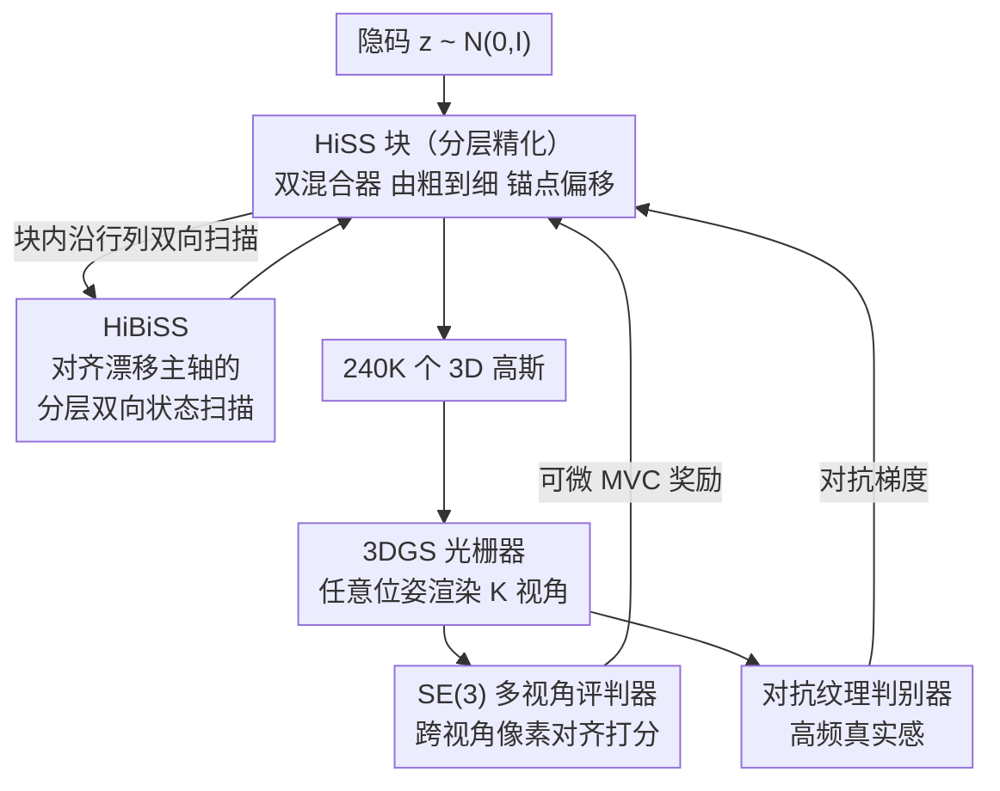

# Multi-view Consistent 3D Gaussian Head Avatars 'without' Multi-view Generation

**会议**: CVPR 2026  
**arXiv**: [2605.25220](https://arxiv.org/abs/2605.25220)  
**代码**: https://humansensinglab.github.io/MVCHead/ (有，项目页+代码)  
**领域**: 3D视觉  
**关键词**: 3D高斯头部头像、多视角一致性、状态空间模型、Mamba、无多视角监督

## 一句话总结
MVCHead 只用随机采样的 2D 人脸图像（不要多视角数据、不要 3D 监督、也不生成中间视角），用一个单次前向的状态空间模型直接回归 24 万个 3D 高斯，靠「按多视角漂移主轴对齐的双向扫描」加「SE(3) 多视角评判器」把多视角一致性写进结构本身，在感知质量和纹理/几何一致性上达到 SOTA。

## 研究背景与动机
**领域现状**：高保真 3D 高斯头部头像（AR/VR、远程在场、数字人）的生成主要有三条路线。一是多视角优化重建，靠 NeRSemble、RenderMe-360 这类影棚级密集多视角采集（每个人约 $10^4$ 帧）逐人优化，质量和多视角一致性（Multi-view Consistency, MVC）都是上限；二是多视角扩散，从单图先用现成图像/视频扩散合成若干侧视图，再由一个重建器把这些图抬升成 3DGS；三是前馈式生成器（GGHead、GS-GAN、CGS-GAN），从隐码直接端到端可微地吐出 3D 高斯头。

**现有痛点**：前两条路线都不可扩展或不可靠。影棚采集贵且要逐人优化；多视角扩散把 MVC 完全绑死在「中间视角生成质量」上——因为重建器和扩散器之间不端到端可微，像素级跨视角损失根本没被优化，于是会出现身份漂移：每个合成视角上一点点偏差（头发、耳廓、下颌阴影的细微移动）凑不出一个自洽的 3D 解释；而且为每个资产稠密地生成中间视角在大规模下算力上不可承受。第三条前馈路线虽然端到端可微，但在「模型从没见过真实多视角配对」的最小资源设定下，如何强制 MVC 仍然是未解难题。

**核心矛盾**：要 MVC，传统做法要么靠多视角真值监督，要么靠中间视角作为代理——但真值贵、代理不可靠且不可微。本文主张：中间视角生成对可扩展性是反作用的，MVC 应该「靠设计直接诱导出来」，而不是靠额外数据或额外生成步骤。

**本文目标**：在最小资源设定（仅 2D 图像）下，用单次、端到端可微的模型，实现大规模、实时、多视角一致的 3D 高斯头生成——既不生成中间视角，也不依赖 3D 真值。

**切入角度**：作者两个关键观察。其一，多视角不一致并非各向同性：偏航（yaw）主要造成水平位移、俯仰（pitch）主要造成垂直位移，所以漂移沿图像的「行/列轴」最强——这给了状态空间模型（SSM）天然的用武之地，可以让递归沿这些主轴传播来「抹平」漂移。其二，同一个 3D 配置的自渲染（self-render）本身就携带强 MVC 先验：判断「一组渲染是否来自同一个底层 3D」不需要真实多视角配对，可以学一个评判器来当奖励。

**核心 idea**：用「沿漂移主轴对齐的分层双向状态扫描（HiBiSS）」把 MVC 写进网络结构，再用「SE(3) 多视角评判器」给跨视角像素对齐打分作为可微奖励，从 2D 图像端到端学出多视角一致的 3D 高斯头。

## 方法详解

### 整体框架
MVCHead 学的是从隐码 $z\sim\mathcal{N}(0,I)$ 到一组各向异性 3D 高斯 $\mathcal{S}_\theta(z)=\{g_i\}_{i=1}^N$（$N=240\text{K}$）的生成映射，每个高斯 $g_i=(\mu_i,s_i,q_i,\alpha_i,c_i)$ 含中心、尺度、四元数旋转、不透明度、RGB。它在 transformer 版的 GSGAN 基础上做三处关键改造：用状态空间块构成的双混合器（Dual-Mixer）架构、HiBiSS 扫描、以及作为显式 MVC 奖励的 SE(3) 多视角评判器。

整条管线一次前向走完：隐码经多个 **HiSS 块（分层状态空间块）** 由粗到细逐层精化高斯——每一层用 HiBiSS 在 token 网格上传播几何与外观线索保证局部全局一致，并以「父高斯 $S_0$ 作为锚点 $A_0$ 推出子高斯 $S_1$」的方式逐级上采样长出更多基元。最终聚合得到的全部高斯送进 3DGS 光栅器，从任意相机位姿渲染出图像。训练时，这些渲染同时被两个评判器审视：一个对抗式纹理判别器保证高频真实感，一个 SE(3) 多视角评判器奖励跨视角像素对齐、把 MVC 信号锚在 3D 几何上。关键的是：HiSS 块内部**刻意不做相机条件化**，相机位姿只在渲染和评判器阶段引入，避免模型退化成「看视角学 2D 捷径」。

### 关键设计

**1. HiSS 块：用锚点偏移 + 双混合器由粗到细回归高斯**

针对的痛点是「前馈生成器如何在没有 3D 监督时长出既细致又不乱飘的几何」。MVCHead 把头部表示成一组在 $L$ 层 HiSS 块上逐级精化的高斯，每个高斯身兼二职：既是 3D 头的粗近似，又作为下一级更细高斯的回归锚点。**锚点式精化（Anchor-based Refinement）** 让细层高斯被显式参数化为对粗层锚点的偏移——这个结构性偏置强制新基元落在已有结构附近，细节只能「精修已有几何」而不能任意漂移；每过一块高斯数按上采样比 $r$ 增长，最终在一次 splatting 中联合渲染 $\sum_{l=0}^{L-1}Nr^l$ 个基元。块内是 **双混合器（Dual-Mixer）**：一支自注意力聚合不强依赖空间轴的全局语义（整体身份、全局线索），一支状态空间块沿水平/垂直方向强制网格对齐的局部连贯，二者输出再喂给逐属性 MLP 头直接回归高斯参数。条件化上用 AdaIN 把从映射隐码 $w$ 预测的 scale/bias 注入所有层，把外观从几何里解耦出来，保证整条层级链上身份一致。

**2. HiBiSS：让状态递归沿多视角漂移的主轴对齐**

这是把「漂移各向异性」这个观察落到结构上的核心。标准 Mamba 的单向扫描（左到右）对 3D 头生成不够：它缺垂直方向传播，还引入因果偏置阻碍全局上下文整合。作者先给出动机推导：相机内参 $\mathbf{K}=\mathrm{diag}(f_x,f_y,1)$、规范位姿下，3D 点 $X=(X,Y,Z)^\top$ 投影到 $\mathbf{u}=(f_x X/Z,\ f_y Y/Z)^\top$；小幅偏航/俯仰带来一阶位移 $\delta\mathbf{u}\approx J_x(X)\delta\theta_x+J_y(X)\delta\theta_y$，而对正立、居中的头部通常有 $|\partial x/\partial\theta_y|\gg|\partial y/\partial\theta_y|$、$|\partial y/\partial\theta_x|\gg|\partial x/\partial\theta_x|$——即偏航主要产生水平位移、俯仰主要产生垂直位移。于是 HiBiSS 用四个互补的 2D 扫描（行向左右各一、列向上下各一）构成连接任意两 token 的双向递归路径，通过把 SS2D 适配到分层高斯预测来实现：token 线性投影 → reshape 成 $H\times W$ 网格 → 四条对称扫描轨迹 → 融合 → 投回原 token 空间，保持空间位置与 token 身份一一对应。其中水平前向扫描的递归为

$$h^{\rightarrow}_{i,j+1}=A_h h^{\rightarrow}_{i,j}+B_h F_{i,j},\quad \tilde{F}^{\text{hor}}_{i,j}=C_h h^{\rightarrow}_{i,j}+D_h F_{i,j}$$

垂直方向同理。这样状态传播显式对齐在 $\|\partial\mathbf{u}/\partial\theta\|$ 最大的方向，等于做一种各向异性、感知位姿的平滑，专打不一致漂移的主轴。HiBiSS 放在每层上采样和属性回归**之前**：放上采样之后会增算力又把递归稀释在近似重复的 token 上；放进逐属性预测里又会让模型失去共享的几何感知上下文。

**3. SE(3) 多视角评判器：用自渲染当 MVC 奖励，无需真实多视角配对**

直接回应「没有多视角真值怎么强制 MVC」。评判器是一个外参感知编码器 $E_\psi$，把一组图像和对应相机位姿映成标量一致性分 $s=E_\psi(\{\hat I_k\},\{T_k\})$；对给定 $z$ 渲染 $K$ 个视角，模型训练时最大化这个分，于是「提升多视角一致」直接等于「优化目标」：$\mathscr{L}_{mvc}=-\mathbb{E}_{z,\{T_k\}}[E_\psi(\{\mathcal{R}(\mathcal{S}_\theta(z),T_k)\}_{k=1}^K,\{T_k\}_{k=1}^K)]$。评判器本身被训成一个**二分类集合分类器**：正集 $\mathcal{S}^+$ 是同一个 avatar 在不同位姿下的 $K$ 个渲染，负集 $\mathcal{S}^-$ 是每个视角来自不同隐码但共享同一组位姿；用二元交叉熵把正集打高分。虽然负集有明显身份差异，但评判器还得额外学到轮廓连贯、阴影连续这类细微几何/纹理一致线索。训练好后 $E_\psi$ 就成了可微奖励，反过来更新 HiSS 块去最大化 $E_\psi(\mathcal{S}^+)$，逼模型生成自渲染跨视角更一致的 avatar。为保证分数只依赖相对视角排布、与绝对相机摆放/内参无关，评判器用 **Geometric Transform Attention (GTA)**：ViT 结构里把所有位姿锚到首视 $\tilde T_k=T_k T_1^{-1}$，用从相对外参导出的轻量块对角线性映射预变换注意力的 query/key，从而对全局刚体变换等变、对内参与裁剪不变。

### 损失函数 / 训练策略
总损失是多任务目标，仅靠 2D 图像联合优化高斯解码器（HiSS 块）、SE(3) 评判器 $E_\psi$、对抗纹理判别器 $D_\phi$：

$$\mathscr{L}_{\text{total}}=\underbrace{\lambda_{mvc}\big(-\mathbb{E}_{z,\{T_k\}}[E_\psi(\{\hat I_k\},\{T_k\})]\big)}_{\text{SE(3) 多视角评判器}}+\underbrace{\mathbb{E}_z\tfrac{1}{K}\sum_{k=1}^K\text{softplus}(-D_\phi(\mathcal{R}(\mathcal{S}_\theta(z),T_k),T_k))}_{\text{相机条件对抗，K 视角平均}}+\underbrace{\lambda_{knn}\mathscr{L}_{knn}+\lambda_{ctr}\mathscr{L}_{ctr}}_{\text{高斯正则}}$$

其中 $\mathscr{L}_{adv}$ 是带 R1 梯度惩罚的相机条件对抗损失（保证投影纹理匹配真实图像分布）；$\mathscr{L}_{knn}$ 惩罚邻近高斯过大间距以维持表面密度，$\mathscr{L}_{ctr}$ 惩罚高斯中心偏离其层级锚点以保证结构稳定。MVC 损失正是相对 GS-GAN/CGSGAN（只靠对抗和条件损失）的关键 departure。训练用 Adam，在 4 张 H100 上跑 10M 步、约 3 天，分别在 FFHQ 和 FFHQ-C 上独立训练。

## 实验关键数据

### 主实验
感知真实感（FID / FID3D，512×512，50K 渲染）：

| 数据集 | 指标 | MVCHead | CGSGAN（前 SOTA） | GGHead | GSGAN |
|--------|------|---------|---------|--------|-------|
| FFHQ | FID↓ | **4.39** | 4.94 | 5.15 | 5.60 |
| FFHQ-C | FID↓ | **3.94** | 4.53 | 5.37 | 5.17 |
| FFHQ | FID3D↓ | **4.39** | 4.94 | 7.90 | 10.50 |
| FFHQ-C | FID3D↓ | **3.94** | 4.53 | 7.78 | 7.68 |

多视角一致性（100 个 avatar 平均，vs 前 SOTA CGSGAN）：

| 维度 | 指标 | MVCHead | CGSGAN |
|------|------|---------|--------|
| 形状 | CD↓ | **0.6654** | 0.6724 |
| 形状 | depth↓ | 6.6649 | 6.6624（相当）|
| 纹理 | cPSNR↑ | **22.082** | 21.852 |
| 纹理 | cSSIM↑ | **0.7636** | 0.7434 |
| 纹理 | cLPIPS↓ | **0.0528** | 0.0622 |
| 几何 | MEt3R↓ | **0.2620** | 0.2814 |

MVCHead 在六项一致性指标里五项更优、depth 相当，整体在感知质量、纹理与几何一致性上 SOTA，形状一致性持平。

> 自定义一致性指标怎么算：对每个生成身份，从**两个不相交**的多视角渲染子集各自独立拟合一个 3DGS（$G_1,G_2$），它们只有在自洽时才会重合。形状用 Chamfer 距离 $e_{cd}(G_1,G_2)=d_{CD}(P_1,P_2)$（各降采样到 60K 点）+ 重叠前景的掩码深度误差；纹理用 $e_m(G_1,G_2)=\frac1K\sum_i d_m(\pi_i(G_1),\pi_i(G_2))$，$m\in\{\text{cPSNR},\text{cSSIM},\text{cLPIPS}\}$；几何用 MEt3R——对一对自渲染先用 MASt3R 做无位姿稠密立体重建，再用 DINO+FeatUp 取高分辨率特征、按点云反投影/重投影对齐，算重叠区掩码余弦相似度 $S$，最终 $\text{MEt3R}=1-0.5\cdot(S(I_1,I_2)+S(I_2,I_1))$。

### 消融实验
在 FFHQ-C、512×512 上逐组件消融：

| 配置 | FID↓ | MEt3R↓ | 说明 |
|------|------|--------|------|
| Full Model | **3.94** | **0.2620** | 完整模型 |
| w/o $\mathscr{L}_{adv}$ | collapse | — | 去对抗损失训练直接崩，证明其对真实感不可或缺 |
| w/o $\mathscr{L}_{mvc}$ | 5.41 | 0.3144 | 去 MVC 损失 FID 和 MEt3R 双双变差，SE(3) 评判器对跨视角一致至关重要 |
| w/o HiSS block | 5.28 | 0.2948 | 去掉状态空间分量（SS2D+LN+FFN），MVC 明显下降，证明 SSM 提供了注意力之外的增益 |
| w/o HiBiSS | 4.78 | 0.2873 | 用标准单向扫描替换，性能退化，验证轴对齐双向递归对调和多视角漂移是关键 |

### 关键发现
- 对抗损失是「保命」组件（去掉直接训练崩溃），MVC 损失则是「提一致性」的主力（去掉 MEt3R 从 0.262 涨到 0.314）。
- 状态空间分量（HiSS 的 SSM 支路）和「方向是否对齐」（HiBiSS vs 单向扫描）各自独立有贡献：前者 MEt3R 0.262→0.295，后者 0.262→0.287，说明「用 SSM」和「让 SSM 沿漂移主轴扫」是两件互补的事。
- MVCHead 仅在前视和侧视训练，没生成中间视角也没用 3D 真值，却把一致性做进了结构里，验证了「自渲染当 MVC 先验」这条路的可行性。

## 亮点与洞察
- **把多视角不一致的「方向性」直接编码进网络**：作者从投影 Jacobian 推出「偏航→水平漂移、俯仰→垂直漂移」，再让状态空间递归正好沿行/列轴扫描——这是一个「先分析漂移结构、再设计归纳偏置」的漂亮范例，比盲目堆注意力更对症。
- **用自渲染绕开多视角真值**：判断「一组渲染是否来自同一个 3D」根本不需要真实配对，把这个判断学成可微奖励（SE(3) 评判器），就能在零多视角监督下诱导 MVC，这个思路可迁移到任何「3D 生成但缺多视角 GT」的任务。
- **GTA 让评判分数只看相对视角**：把外参锚到首视 + 块对角线性映射预变换 Q/K，使一致性分对全局刚体变换等变、对内参/裁剪不变——这保证评判器奖励的是「几何一致」而非「相机摆位」。
- **第一个把 SSM/视觉 Mamba 用于 3D 高斯头生成**，并附带产出 FaceGS-10K（首个免参数化模型、即取即用的 3D 高斯头资产数据集，每个含 240K 高斯 + 24 张前半球渲染），为下游 3D 监督和隐私保护的合成身份生成铺路。

## 局限性 / 可改进方向
- 作者承认：只在前视和侧视上训练，**无法生成完整 360° 头像**（后脑勺缺失）；几何先验完全从 2D 监督学来，加入显式结构约束（如双侧对称）能进一步缩小搜索空间。
- 评判器的负样本目前靠「不同身份」，作者指出可以用更难的负样本（同一身份但几何扰动的视角）来进一步强化一致性信号——现在的负集身份差异太明显，评判器学到的细粒度一致线索可能不够。
- 形状一致性只是「持平」CGSGAN（depth 几乎相同），说明该方法主要赢在纹理和几何一致，全局形状上还没拉开差距。
- 自定义一致性度量依赖 MASt3R/DINO/FeatUp 等外部模型，评测本身的稳健性和可比性受这些工具影响；MVC 量化目前仍无公认标准。

## 相关工作与启发
- **vs 多视角优化重建（GaussianAvatars、SplattingAvatar 等）**：他们靠影棚密集多视角逐人优化拿到 MVC 上限，但贵且不可扩展；本文不用任何采集、单次前向生成不存在的新身份，牺牲一点形状一致换巨大可扩展性。
- **vs 多视角扩散（FaceLift、Zero-1-to-A、Cap4D 等）**：他们先合成中间视角再重建，MVC 被绑死在中间视角质量上、跨视角损失不端到端可微、身份会漂移；本文直接论证「中间视角生成对可扩展性是反作用的」，改用结构 + 评判器把 MVC 写进设计。
- **vs 前馈生成器（GGHead、GS-GAN、CGS-GAN）**：同属端到端可微前馈路线，但他们主要靠对抗/条件损失，没有显式的跨视角一致奖励；本文在 GSGAN 基础上加 Dual-Mixer/HiBiSS/SE(3) 评判器三件套，把 MVC 从「碰运气」变成「按设计诱导」。
- **vs Gamba / MVGamba（SSM+3DGS）**：Gamba 做单视重建但纹理质量有限，MVGamba 只针对简单物体；本文是首个把 SSM 用于 3D 头像生成，并用 SSM 专门对齐多视角不一致的主轴。

## 评分
- 新颖性: ⭐⭐⭐⭐⭐ 首个把 SSM 用于 3D 高斯头生成，且「漂移主轴对齐扫描 + 自渲染评判器」两处创新都直击 MVC 痛点，动机推导扎实。
- 实验充分度: ⭐⭐⭐⭐ 六项一致性指标 + FID/FID3D 双数据集对比 + 干净的逐组件消融，但 MVC 主表只和 CGSGAN 单一对手比、缺更多前馈基线。
- 写作质量: ⭐⭐⭐⭐⭐ 三类方法的痛点剖析、Jacobian 动机推导、自定义指标定义都讲得清晰自洽。
- 价值: ⭐⭐⭐⭐⭐ 最小资源设定下的实时多视角一致 3D 头生成 + 开源 FaceGS-10K，对 AR/VR、数字人和隐私保护合成身份有直接落地价值。

<!-- RELATED:START -->

## 相关论文

- [\[CVPR 2026\] SplatSuRe: Selective Super-Resolution for Multi-view Consistent 3D Gaussian Splatting](splatsure_selective_super-resolution_for_multi-view_consistent_3d_gaussian_splat.md)
- [\[CVPR 2026\] Any Resolution Any Geometry: From Multi-View To Multi-Patch](any_resolution_any_geometry_from_multi-view_to_multi-patch.md)
- [\[CVPR 2026\] Learning Multi-View Spatial Reasoning from Cross-View Relations](learning_multi-view_spatial_reasoning_from_cross-view_relations.md)
- [\[CVPR 2026\] PhysHead: Simulation-Ready Gaussian Head Avatars](physhead_simulation-ready_gaussian_head_avatars.md)
- [\[CVPR 2026\] C-GenReg: Training-Free 3D Point Cloud Registration by Multi-View-Consistent Geometry-to-Image Generation with Probabilistic Modalities Fusion](c-genreg_training-free_3d_point_cloud_registration_by_multi-view-consistent_geom.md)

<!-- RELATED:END -->
