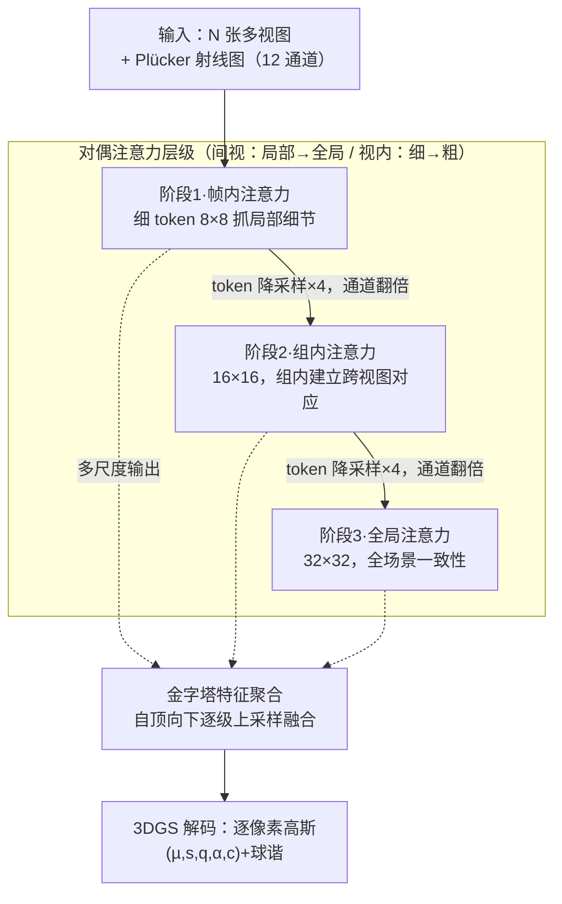

# Multi-view Pyramid Transformer: Look Coarser to See Broader

**会议**: CVPR 2026  
**论文**: [CVF Open Access](https://openaccess.thecvf.com/content/CVPR2026/html/Kang_Multi-view_Pyramid_Transformer_Look_Coarser_to_See_Broader_CVPR_2026_paper.html)  
**代码**: 项目页 https://gynjn.github.io/MVP/  
**领域**: 3D视觉  
**关键词**: 前馈3D重建, 多视图Transformer, 3D高斯泼溅, 金字塔注意力, 可扩展性

## 一句话总结
MVP 用一个"对偶注意力层级"（视图维度从帧内→组内→全局逐层放宽，空间维度从细 token 逐层合并成粗 token）让前馈 Transformer 能在一次前向里吃下几十到几百张图，0.1–2 秒内重建大场景 3D 高斯，在 16–256 视图范围内同时把质量和速度做到当前最好。

## 研究背景与动机

**领域现状**：近两年的大重建模型（LRM 系列、DUSt3R/VGGT 一脉）把 3D 重建重新表述成"多视图 2D 推理"——把每张输入图 token 化，拼成一条长序列喂给 Transformer，靠自注意力跨视图建立几何对应，一次前向就输出点图/深度/3D 高斯。这套范式比传统几何管线（COLMAP 那一套）更鲁棒、更快。

**现有痛点**：每张高分辨率图都贡献大量 token，序列长度随输入视图数线性膨胀，而自注意力是二次复杂度，于是视图一多就爆显存、爆算力。现有的"提效"方案各有短板：Long-LRM 用 Mamba 的线性复杂度块换掉部分注意力，但表达力不如自注意力；iLRM 压缩成紧凑场景表示再做全局注意力，视图一多全局注意力又成瓶颈；LVT 只让每张图注意邻近视图，但全局一致性只能靠多层局部交互间接达成，而且"邻域怎么定义"本身是难题、还依赖已知相机位姿。

**核心矛盾**：可扩展性（视图数）和表达力/全局一致性之间存在 trade-off。更关键的是，作者指出**全局注意力在长上下文里并不真的好用**：视图越多，注意力分布越被稀释、越不稳定，对应关系学得越差——表现为"加视图收益递减"。所以单纯堆全局注意力不仅慢，质量上也会到顶。

**切入角度**：作者借用卷积网络和 Swin Transformer 早已验证的"由细到粗"思想——浅层用细粒度特征图抓局部细节，深层用粗粒度、语义更浓的特征图抓全局上下文，同时降算力。把这套金字塔哲学搬到多视图设定里。

**核心 idea**：构建一个**对偶注意力层级（Dual Attention Hierarchy）**，沿两个互补维度同时收敛——视图维度"局部→全局"地放宽注意力窗口，空间维度"细→粗"地合并图内 token——让参与注意力的 token 数不随层数失控膨胀，从而既避免注意力稀释、又兼顾算力与表达力。

## 方法详解

### 整体框架
MVP 是一个前馈的多视图稠密预测 Transformer：输入是 $N$ 张带已知相机位姿的图，输出是逐像素的 3D 高斯（位置/尺度/旋转/不透明度/颜色），用 3DGS 渲染出新视图。中间它把输入过一个三阶段的注意力金字塔——阶段 1 只在每帧内部做注意力抓细节，阶段 2 在"视图组"内做注意力建立局部跨视图关系，阶段 3 全局注意力把整个场景缝成一致的 3D 表示；每过一个阶段，图内 token 的空间分辨率降 4 倍、通道翻倍。三个阶段的输出再由金字塔特征聚合模块自顶向下融合成统一特征，最后线性头解码成高斯。

### 关键设计

**1. 间视注意力层级（inter-view）：把"帧内→组内→全局"做成一条可扩展的放宽路径**

这针对的是"全局注意力既慢又在多视图下稀释"的痛点。作者引入分组自注意力作为"纯局部（帧内）"和"全局"之间的中间档：把 $N$ 个视图按帧序号就近切成 $\frac{N}{M}$ 个连续组（实现里组大小固定 $M{=}4$），组内先做帧内注意力、再做组间（组内跨视图）注意力。三个阶段分别用 2 个帧内块、4 个组内块、8 个全局块，注意力窗口从"单帧"逐步扩到"组"再扩到"全部视图"（阶段 3 即 $M{=}N$ 的特例）。形式上一步可写成：

$$G \leftarrow \text{group}(T),\quad G_{i,j} \leftarrow \text{self-att}(G_{i,j})\ (\text{帧内}),\quad T_i \leftarrow \text{self-att}(G_i)\ (\text{组内})$$

其中 $T\in\mathbb{R}^{Nhw\times d}$ 是全部 token，$G_{i,j}$ 是第 $i$ 组第 $j$ 张图的 token，$G_i$ 是整组 token。这套设计还把 VGGT 的 Alternating-Attention 统一成特例（帧内/组内/全局都涵盖）。它有效的原因有两层：一是组大小固定，全局注意力只在最后一阶段、且那时 token 已被空间下采样到很少，所以参与注意力的 token 数被卡住、不随视图数爆炸；二是先在局部把对应关系学扎实再放到全局，避免一上来就让全局注意力在海量 token 上被稀释。

**2. 视内注意力层级（intra-view）：逐级合并图内 token，用"细到粗"的特征金字塔换算力与感受野**

光在视图维度分组还不够——每张高分图本身 token 就多。这一支沿每张图的空间维度做"细到粗"：阶段间用一层卷积同时做空间下采样和通道升维，每过一阶段图内 token 数减为 1/4（$h\to h/2,\ w\to w/2$），即 patch 从 $8\times8$ 合到 $16\times16$ 再到 $32\times32$，嵌入维度 $256\to512\to1024$ 翻倍补偿。早层细 token 抓局部几何、晚层粗 token 整合大范围上下文，单个 token 的有效感受野随之扩大。它和间视层级是"配套"的：空间分辨率一降，组内注意力就能在算力可控的前提下覆盖更多视图，两条层级一个"局部→全局"、一个"细→粗"，方向互补，共同把"参与注意力的 token 总量"压住，这正是缓解注意力稀释、在长上下文里稳住优化的关键。

**3. 金字塔特征聚合 PFA：自顶向下把三个阶段的多尺度特征融成稠密预测**

逐级下采样虽然提了效，但只用最后那张最粗的特征图去解码会丢细节。PFA（思路类似 DPT，但专门适配本文三阶段结构）把各阶段 token 先 reshape 回空间特征图、卷积投到共享高维空间，再自顶向下逐级上采样并与前一阶段特征残差融合：

$$F = \text{fuse}\big(\text{up}(\text{fuse}(\text{up}(F^{(3)}) + F^{(2)})) + F^{(1)}\big)$$

其中 $F^{(1)},F^{(2)},F^{(3)}$ 是三阶段的输出特征图。这样粗粒度全局上下文和细粒度局部细节被重新缝合，融合后的特征再排回 token 序列送解码器。消融显示它对 LPIPS（感知细节）尤其关键——去掉 PFA、只从最粗特征解码，LPIPS 从 0.235 恶化到 0.340。

### 损失函数 / 训练策略
解码端每个像素参数化一个 3D 高斯（位置 $\mu$、尺度 $s$、四元数旋转 $q$、不透明度 $\alpha$、颜色 $c$），并预测球谐系数以建模视角相关的颜色与不透明度。监督用渲染图与真值的 MSE + 感知损失（$\lambda{=}0.2$），再加一项视角相关不透明度正则 $R_\alpha=\frac{1}{N_\mathcal{G}}\sum_j|\sigma(\alpha_j\cdot\omega_j)|$（抑制跨视角的不透明度伪影），总损失 $L=L_\text{img}+\gamma R_\alpha$，$\gamma{=}0.001$。训练分三段课程：先 $480\times256$、32 视图打底；再升到 $960\times540$、32 视图、减目标视图数；最后 $960\times540$、变视图数训练，并**冻结前两阶段（帧内/组内块）只更新全局模块**。三段各约 4/3/2 天，用 32 张 H100。

## 实验关键数据

### 主实验
DL3DV 数据集上对比优化式 3D-GS（30K 步）和两个前馈基线 Long-LRM、iLRM（基线只用 32 视图训练）。MVP 在 16–256 全部视图设定下质量、速度双赢：

| 视图数 | 方法 | PSNR↑ | SSIM↑ | LPIPS↓ | 时间(s)↓ |
|--------|------|-------|-------|--------|----------|
| 16 | iLRM | 21.92 | 0.748 | 0.316 | 0.19 |
| 16 | **MVP** | **23.76** | **0.798** | **0.239** | **0.09** |
| 32 | iLRM | 24.30 | 0.803 | 0.256 | 0.53 |
| 32 | **MVP** | **25.96** | **0.847** | **0.187** | **0.17** |
| 128 | iLRM | 22.98 | 0.807 | 0.249 | 5.61 |
| 128 | 3D-GS(30k) | 29.43 | 0.914 | 0.123 | 8 min |
| 128 | **MVP** | 29.02 | 0.903 | 0.134 | **0.77** |
| 256 | iLRM | 20.63 | 0.767 | 0.281 | 20.92 |
| 256 | 3D-GS(30k) | 30.39 | 0.926 | 0.114 | 8 min |
| 256 | **MVP** | 29.67 | 0.915 | 0.125 | **1.84** |

在最密的 256 视图下，MVP 距离优化式 3D-GS 只差约 0.7 dB PSNR，却快 250 倍以上；而 Long-LRM 在 256 视图直接 OOM（80GB 也放不下），iLRM 质量则随视图增多反而崩坏（PSNR 跌到 20.6）。零样本迁移到 Tanks&Temples / Mip-NeRF360 上，MVP 在 32/64/128 视图全面领先，且视图越多领先越大（如 Mip-NeRF360 128 视图：MVP 25.12 vs iLRM 21.32 PSNR）。低分辨率 RE10K 上，MVP-fine 变体 4 视图 32.12、8 视图 33.40 PSNR，也超过 CLiFT 和 iLRM。

### 消融实验
所有变体在 DL3DV 上 $256\times256$ 训 100K 步：

| 配置 | PSNR↑ | SSIM↑ | LPIPS↓ | 说明 |
|------|-------|-------|--------|------|
| Baseline（完整） | 22.79 | 0.733 | 0.235 | 帧内2/组内4/全局8 + PFA |
| w/o 特征聚合(PFA) | 21.58 | 0.646 | 0.340 | 只从最粗特征解码，细节崩 |
| w/o 组内注意力(换帧内) | 22.53 | 0.720 | 0.247 | 缺中间档，跨视图弱 |
| w/o 间视层级(全用全局) | 22.94 | 0.739 | 0.236 | 质量略高但算力随视图暴涨 |
| w/o 视内层级(token不降) | 22.83 | 0.732 | 0.249 | 256 视图直接 OOM |
| w/o 对偶层级 (p=16) | 21.80 | 0.651 | 0.341 | 非层级化、粗 patch，质量明显差 |
| 反转层级（全局→组→帧） | 18.95 | 0.442 | 0.555 | 顺序反了，性能崩塌 |

### 关键发现
- **PFA 对感知质量最关键**：去掉后 LPIPS 几乎翻倍（0.235→0.340），印证多尺度融合是恢复细粒度细节的命门。
- **间视层级买的是"可扩展性"而非"单点峰值质量"**：全用全局注意力在小视图数下 PSNR 反而略高（22.94 vs 22.79），但因组大小固定为 4，全局变体的算力随视图数增长快得多——256 视图时去掉间视层级延迟高 6 倍以上。
- **视内层级是"能不能跑得动"的开关**：去掉视内层级或对偶层级，64 视图就比 MVP 慢约 50×/80×，256 视图直接 OOM。
- **顺序不能反**：把层级反成"先全局粗、再到帧内细"，PSNR 暴跌到 18.95，说明"先局部细节、后全局整合"的方向是设计本质而非可调超参。
- **长上下文外推稳**：32 视图训练、测 40/48 视图，MVP 从 32→48 视图 PSNR 还涨 +1.18，而 Long-LRM/iLRM 早早饱和，验证了"层级化缓解注意力稀释"的主张。
- **冗余剪枝几乎免费**：剪掉不透明度<0.01 的高斯，256 视图能去掉 89% 的基元，PSNR 仅掉 0.15。

## 亮点与洞察
- **"对偶层级"把两条已知的提效思路正交叠加**：视图维度分组（间视）+ 空间维度 token 合并（视内），单独任一条都不够，叠在一起才同时按住"token 总量"这个真正决定算力和注意力稀释的变量——这是比单纯"换线性注意力"更对症的思路。
- **把"全局注意力在长上下文会稀释"当成性能（而非只是算力）问题来攻**：作者不只是为省算力做层级，而是论证了全局注意力在多视图下质量会到顶，这让"层级化"从"工程优化"升格成"质量必需"，长上下文外推实验是很有说服力的佐证。
- **统一了帧内/组内/全局注意力**：把 VGGT 的 Alternating-Attention 表述成分组的特例，框架干净、易扩展，作者也指出能少改架构迁到动态场景/几何任务。
- **可迁移 trick**：对任何"输入数量可变、序列随之膨胀"的多视图/多帧 Transformer（视频、多相机感知），"组内中间档注意力 + 沿主维度逐级 token 合并 + 金字塔特征回融"这套组合都值得借鉴。

## 局限与展望
- 依赖**已知相机位姿**（用 Plücker 射线图和 PRoPE 编码几何），不像 DUSt3R/VGGT 那样能无位姿重建，实用场景受限。
- 实验集中在**静态、有位姿的前馈重建**；动态场景、无位姿设定只在结论里"相信能扩展"，未给实验。
- **训练成本极高**（32×H100、共约 9 天三段课程），且最后一段要冻结前两阶段只更新全局块，复现门槛高。
- 组的划分是"按帧序号就近切连续组"这种最朴素策略，未探索基于几何/重叠度的分组是否更好；组大小固定为 4 也未系统消融不同组大小的影响。
- 单点峰值质量上仍略逊于优化式 3D-GS（密视图下差 ~0.7 dB），定位是"速度换轻微质量折中"。

## 相关工作与启发
- **vs Long-LRM**：它用 Mamba 线性复杂度块提效，但表达力弱于自注意力，且密视图（256）直接 OOM；MVP 用层级化保留全注意力的表达力，靠"控制 token 总量"提效，密视图仍能跑且质量更高。
- **vs iLRM**：它压成紧凑表示后做全局全注意力，视图一多全局注意力成瓶颈、质量崩坏（256 视图 PSNR 跌到 20.6）；MVP 把全局注意力推迟到 token 已大幅下采样的最后阶段，避免了这个崩坏。
- **vs LVT**：它只做局部视图注意力，全局一致性靠多层间接传递、还要定义视图邻域并依赖位姿；MVP 用"组内中间档 + 最终全局阶段"直接、显式地达成全局一致性。
- **vs Swin / 卷积金字塔**：MVP 借了"细到粗"的金字塔哲学，但把它从单一空间域扩展到"视图×空间"双轴，并指出多视图设定里不能像视频那样做时间下采样、而是逐级增加参与的视图数（类比时间长度）。

## 评分
- 新颖性: ⭐⭐⭐⭐ 把金字塔/分组注意力扩到"视图×空间"双轴并论证其缓解注意力稀释，思路清晰但单点组件多为已有思想的重组。
- 实验充分度: ⭐⭐⭐⭐⭐ 16–256 视图全覆盖、多数据集零样本、长上下文外推、组件消融与时间分析齐全。
- 写作质量: ⭐⭐⭐⭐ 动机层层推进、图表清晰，公式排版（OCR 缓存里）略乱但原文应规整。
- 价值: ⭐⭐⭐⭐⭐ 把前馈大场景重建的可扩展性推到数百视图、亚秒级，工程与研究价值都高。

<!-- RELATED:START -->

## 相关论文

- [\[CVPR 2026\] SMVRT: Implicit Human 3D Modeling Using Sparse Multi-View Volumetric Reconstruction with Transformer Fusion](smvrt_implicit_human_3d_modeling.md)
- [\[CVPR 2026\] Any Resolution Any Geometry: From Multi-View To Multi-Patch](any_resolution_any_geometry_from_multi-view_to_multi-patch.md)
- [\[CVPR 2026\] DepthFocus: Controllable Depth Estimation for See-Through Scenes](depthfocus_controllable_depth_estimation_for_see-through_scenes.md)
- [\[CVPR 2026\] Multi-view Consistent 3D Gaussian Head Avatars 'without' Multi-view Generation](multi-view_consistent_3d_gaussian_head_avatars_without_multi-view_generation.md)
- [\[CVPR 2026\] ART: Articulated Reconstruction Transformer](art_articulated_reconstruction_transformer.md)

<!-- RELATED:END -->
